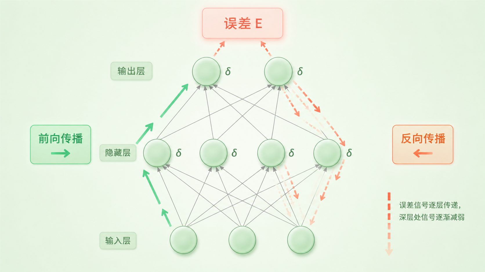

+++
title = "论文里程碑 #1：Learning Representations by Back-Propagating Errors"
description = "反向传播让多层神经网络从「无法训练」变成了「能自己学特征」——这篇 1986 年的论文奠定了整个深度学习的计算基础。"
date = 2026-05-14
tags = ["LLM", "论文里程碑", "反向传播", "Backpropagation", "Hinton", "神经网络"]
categories = ["LLM"]
series = ["论文里程碑"]
showTableOfContents = true
+++



> 反向传播让多层神经网络从「无法训练」变成了「能自己学特征」——这篇 1986 年的论文奠定了整个深度学习的计算基础。

---

### 1986 年：神经网络的至暗时刻与破局

1969 年，Minsky 和 Papert 出版了一本叫《感知机》的书，用严格的数学证明了一件事：单层神经网络连 XOR 这种最简单的非线性问题都解决不了。这本书显著削弱了当时对感知机路线的信心，并推动研究重心转向符号 AI——经费流向了专家系统，神经网络的研究热度大幅下降。

每个人都知道解法：加一层中间层（隐藏层），XOR 就能学了。但没人知道怎么训练这个多层网络。输出层犯了错，你知道怎么调输出层的权重——但中间层呢？它看不到最终误差，不知道自己该往哪个方向调。1986 年，Hinton 和他的两位同事在 *Nature* 上发了一篇只有四页的论文，标题叫 *Learning Representations by Back-Propagating Errors*。四页纸，改变了一切。

*图：网络输出错了，这个错误该怪谁？中间层的神经元看不到最终输出，不知道自己该怎么调——这就是信用分配问题*

### 训练多层网络，当时有多难

想象一个工厂流水线。原材料经过五道工序变成成品，最后质检发现不合格。你知道成品有问题，但不知道是哪道工序出了错——第一道工序用错了温度？第三道工序切割偏了？如果每道工序都随机调整参数再试一次，排列组合的数量是天文数字。

1986 年之前的神经网络研究者面对的就是这个局面。单层网络（感知机）可以用简单的规则训练——输出对了就加强连接，错了就削弱。但一旦加上隐藏层，这个规则就失效了：隐藏层的神经元不直接产生输出，你没法直接判断它该加强还是削弱。

这就是**信用分配问题（Credit Assignment Problem）**：网络最终犯了错，这个锅该分给谁？

当时的替代方案包括随机扰动（Boltzmann Machine）和启发式搜索，但这些方法要么极慢，要么不稳定，没法扩展到稍大一点的网络。整个领域卡在了一个尴尬的位置：理论上知道多层网络更强大，实践上却训练不了它。

### 论文说了什么

这篇论文提出了两个核心论点。

**通过链式法则，可以高效计算多层网络中每个权重对最终误差的贡献，原则上可对多层可微网络高效求梯度。** （但非常深的网络还需要初始化、归一化、残差连接等后续技术才能有效训练。）具体来说，一次前向传播加一次反向传播，就能同时算出网络中所有权重的梯度——不需要对每个权重做单独试探。在论文的实验中，一个包含几十个权重的网络可以在几百次迭代内收敛到正确解。

**隐藏层的神经元能自动学出有意义的「内部表示」（Internal Representation）——不需要人工设计特征。** 论文中最经典的一个实验是家族关系任务：给网络输入「Colin」和「has-aunt」，它应该输出「Jennifer」。训练完成后，隐藏层自动学会了用不同的激活模式编码「国籍」「辈分」「性别」等语义维度——没有人告诉它这些概念存在。这个发现的意义远超算法本身：它意味着神经网络可以自动发现数据中的结构，而不仅仅是做函数拟合。

### 论文怎么做到的

> 回到工厂的比喻。反向传播的思路不是对每道工序随机调整，而是从质检结果开始，沿着流水线一路往回追溯：成品的误差有多少该归因于最后一道工序？最后一道工序的误差又有多少来自倒数第二道？这样一层层回溯，每道工序都能精确算出自己对最终误差的贡献——然后各自做针对性调整。

用数学的话说，这个「回溯」依赖的工具是微积分中的**链式法则（Chain Rule）**。

整个过程分两步。

第一步是**前向传播**：输入从第一层进入，每一层对输入做加权求和，再过一个非线性函数（激活函数），一路算到输出层，得到预测结果，和正确答案比较得到误差 \(E\)。

第二步是**反向传播**：误差从输出层开始，沿着网络反向流动。在每一层，链式法则把「这一层的输出对误差的贡献」分解成「这一层每个权重对误差的贡献」——这就是梯度。

直觉上可以这样理解：如果某个权重稍微增大会导致误差变大，那梯度就是正的，我们应该把它调小；反之亦然。链式法则保证了这个「稍微增大」的影响可以穿过任意多层，精确传递到网络的最深处。

$$
\frac{\partial E}{\partial w_{ij}} = \delta_j \cdot h_i, \quad \delta_j = f'(a_j) \sum_k w_{jk} \, \delta_k
$$

用大白话说：每个权重 \(w_{ij}\) 该调多少（左边），等于两件事的乘积——这个权重收到的输入信号 \(h_i\) 有多强，以及它连接到的那个神经元对最终误差背了多大的责任（\(\delta_j\)）。而 \(\delta_j\) 本身可以从下一层的 \(\delta_k\) 递推回来——这就是「反向传播」名字的由来。

这个算法有一个关键的效率优势：**计算所有权重梯度的总成本，和做一次前向传播差不多。** 不是参数量的平方级，而是线性级。这意味着它可以扩展到大型网络——虽然 1986 年的「大型」只有几百个参数，但这个线性复杂度的框架在今天训练拥有数千亿参数的 GPT 时依然适用，没有任何根本性修改。

从更广的视角看，反向传播本质上是 **反向模式自动微分（reverse-mode automatic differentiation）** 在神经网络上的应用。这个视角能帮你理解为什么 Linnainmaa 1970 年的自动微分和 Rumelhart 1986 年的反向传播是同一件事的两个名字。

*图：误差信号从输出层反向流经每一层，链式法则将最终误差分解到每个权重*

### 它改变了什么

**短期影响**：反向传播的发表直接触发了神经网络研究的第二次浪潮。从 1986 年到 1990 年代中期，大量研究者重新进入神经网络领域。多层感知机（MLP）成为标准工具，被用于手写识别、语音识别、简单的 NLP 任务。LeCun 等人在 1989 年将反向传播应用到卷积结构 / 权重共享网络，用于识别 USPS 手写邮编数字——这是反向传播在卷积网络上的早期成功应用。

**长期影响**：从今天回望，反向传播的意义不仅在于「让多层网络可以训练」，更在于它确立了一个范式——**不要手工设计特征，让网络自己学。** 论文标题里的「Learning Representations」（学习表示）是一个比算法本身更深远的主张。Word2Vec 学到的词向量、CNN 学到的视觉特征、Transformer 学到的上下文表示——所有这些都是「学习表示」这个思想的延续。

但需要说明的是，1986 年的反向传播并没有直接解决深层网络的训练困难——梯度消失和梯度爆炸问题在层数增加时会迅速恶化。真正的大规模深度学习还依赖了后续一系列进展：ReLU 激活函数、更好的初始化策略、BatchNorm、残差网络，以及数据和算力的指数级增长。

我认为这篇论文真正改变的不是技术，而是信念：机器可以自己发现数据中的结构，而不需要人类事先定义。这个信念在 1986 年是激进的，到今天已经变成了常识——这恰恰说明了它的影响有多深远。

需要指出的是，反向传播的思想并非 1986 年才出现——Werbos 在 1974 年的博士论文中就提出过类似想法，Linnainmaa 在 1970 年描述了自动微分的基本形式。但这篇 *Nature* 论文之所以成为里程碑，是因为它第一次把算法、实验和「学习表示」的愿景打包在一起，用最有说服力的方式呈现给了整个科学界。

### 与主线的接口

**如果你想深入……**

这篇论文的核心概念对应我们 LLM 系列的「训练动力学」章节：

- 训练动力学基础 — 讲了梯度下降和 loss landscape，这些都建立在反向传播提供的梯度之上
- 优化器演进（SGD → Adam） — 每一个优化器都依赖反向传播计算出的梯度，区别只在于「拿到梯度之后怎么用」

读完这些，你对 *Learning Representations by Back-Propagating Errors* 的理解会从历史印象变成可操作的工程认知。

### 读完这篇，你拿到了什么

读之前，你可能只知道「反向传播是训练神经网络的方法」。读完之后，画面更清晰了：它解决的是信用分配问题——让每个权重知道自己对最终误差的贡献；它依赖的数学工具是链式法则——一次反向就能算出所有梯度；而它真正的突破不只是一个算法，而是「让网络自己学表示」这个至今仍在驱动整个领域的核心思想。

下一篇，我们来看这个思想在语言领域的第一次落地—— 2003 年 Bengio 的 *A Neural Probabilistic Language Model*。它第一次用神经网络做语言建模，也是词嵌入（Word Embedding）的真正起点。从「学习表示」到「学习词的表示」，故事才刚刚开始。

### 参考资料

- Rumelhart, D. E., Hinton, G. E., & Williams, R. J. (1986). Learning representations by back-propagating errors. *Nature*, 323(6088), 533–536. [论文原文](https://www.nature.com/articles/323533a0)
- 作者：David Rumelhart（加州大学圣地亚哥分校）、Geoffrey Hinton（卡内基梅隆大学，后多伦多大学）、Ronald Williams（加州大学圣地亚哥分校）
- Werbos, P. J. (1974). *Beyond Regression: New Tools for Prediction and Analysis in the Behavioral Sciences*. 博士论文，哈佛大学（反向传播思想的更早来源）
- LeCun, Y. et al. (1989). Backpropagation Applied to Handwritten Zip Code Recognition. *Neural Computation*, 1(4), 541–551. [MIT Press](https://direct.mit.edu/neco/article/1/4/541/5515)（反向传播在卷积 / 权重共享网络上的早期成功应用）
