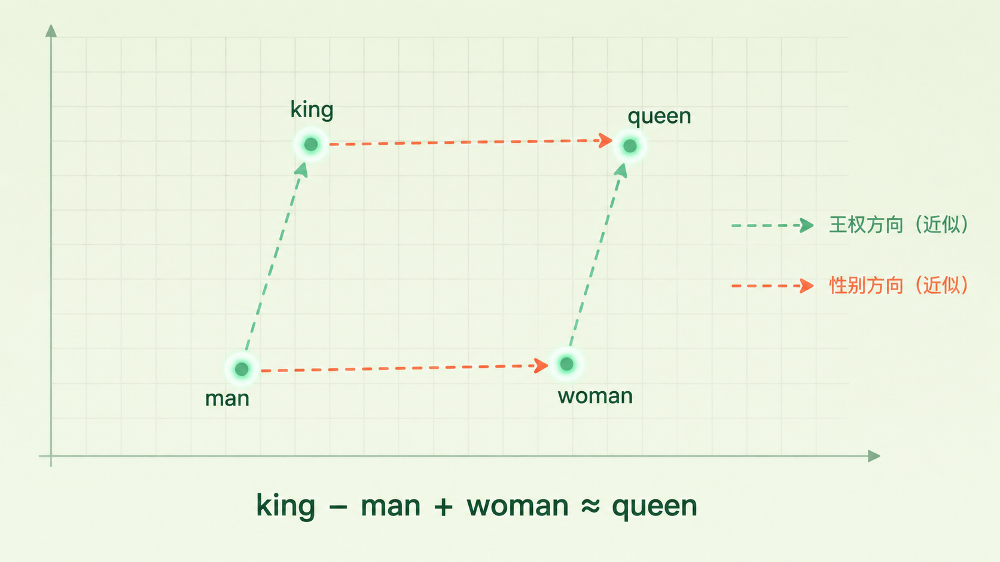
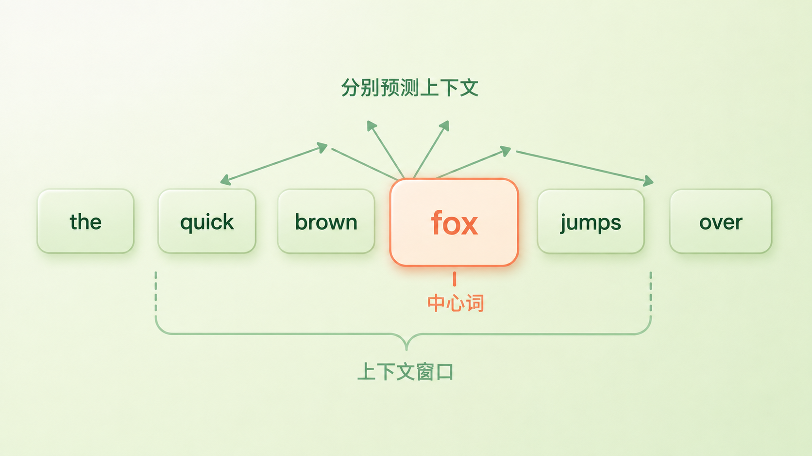

+++
title = "论文里程碑 #10：Efficient Estimation of Word Representations in Vector Space"
description = "一个简单到不像深度学习的模型，第一次把词向量里的语义规律高效、可扩展地训练到高质量，让「词向量算术」广为人知。"
date = 2026-07-12
tags = ["LLM", "论文里程碑", "Word2Vec", "词向量", "Skip-gram", "CBOW", "词类比", "Mikolov"]
categories = ["LLM"]
series = ["论文里程碑"]
showTableOfContents = true
+++



> 一个简单到不像深度学习的模型，第一次把词向量里的语义规律高效、可扩展地训练到高质量，让「词向量算术」广为人知。

## 2013 年，有人给词做了一道减法

2013 年的某天，Google 的一个小组做了个看起来很无聊的实验。他们先把每个英文单词变成一串数字（一个向量），然后出了一道算术题——拿「国王」的向量，减去「男人」的向量，再加上「女人」的向量，问模型：离这个结果最近的词是谁？

答案跳了出来：Queen（女王）。

没有人教过模型什么叫「性别」，什么叫「王室角色」。它只是读了海量的普通文本，这些规律就自己「长」进了向量的几何结构里。你还能接着玩：巴黎 − 法国 + 意大利 ≈ 罗马。这篇论文的名字叫 *Efficient Estimation of Word Representations in Vector Space*，后来大家更爱叫它 Word2Vec。有意思的是，这类「词向量偏移」现象，作者在更早的工作里就见过——Word2Vec 真正的贡献，不是发现了它，而是第一次把它高效、可扩展地训练到很高的质量，让「词能做算术」从一个零星的观察，变成了任何人都能下载复现的事实。

## 在这之前，「猫」和「直升机」一样远

要理解这道减法为什么震撼，得先看看 2013 年之前，计算机眼里的词长什么样。

当时很多 NLP 系统干脆把词当成彼此独立的离散符号——一个词一个编号，互不相干。写成数学形式，就是 one-hot 编码：词表里有几万个词，就给每个词一个几万维的向量，只有一个位置是 1，其余全是 0。「猫」是第 5372 号，「狗」是第 8830 号，「直升机」是第 2 万号。在这种表示下，「猫」和「狗」之间的距离，跟「猫」和「直升机」之间的距离一模一样。每个词都是一座孤岛，彼此正交，机器完全看不出「猫」和「狗」有半点关系。

让词「带上语义」的尝试其实一直都有——LSA、LDA 从共现统计里挖关系，Bengio 早在 2003 年就用神经网络学过稠密词向量（把词压进几百维的连续空间），方向都对。但这些方法卡在同一道坎上：计算太贵。以神经语言模型为例，它既有一个庞大的非线性隐藏层，又要在整个词表上做归一化，训练一次得在几千万词上跑好几天，根本喂不进真正海量的数据。而所有人都隐约觉得——词向量的质量，恰恰被数据量卡着。

于是问题变成一道工程难题：能不能设计一个简单到能吞下几十亿词、又刚好能把语义学出来的模型？

*图：one-hot 编码里每个词都是彼此正交的孤岛（左）；Word2Vec 把词映射进连续语义空间后，「猫」和「狗」靠得很近，「直升机」远远地待在角落（右）。*

## 论文说了什么

这篇论文其实说了两件事，都有点反直觉。

**第一件：与其把模型做复杂，不如砍到最简，然后灌进海量数据。** 作者做了个大胆的减法——把前人神经语言模型里那些昂贵的部件尽量删掉，只留下一个「查向量 + 做预测」的极简结构。它简单到几乎不像「深度学习」，但正因为简单，它跑得飞快：在论文的单机（CPU）实现里，300 维的 CBOW 训练 16 亿词只要大约 0.6 天，Skip-gram 慢一些、约 2 天——而此前同类模型光在几千万词上就要跑好几天。数据量一上来，词向量的质量反而甩开了那些更复杂的模型。

**第二件：只靠「猜上下文」这一个游戏，语义会自己长出来。** 模型从头到尾只做一件事——看着一个词去猜它周围会出现哪些词（或反过来）。没有人工标注，没有语义词典。但训练完之后，作者发现这些向量里藏着惊人的规律：不光「猫」和「狗」靠得很近，连「类比」这种高级关系都能用向量加减表达出来。

为了证明这不是碰巧，他们专门造了一套「词类比」测试集，出的题就像填空：man 之于 king，正如 woman 之于 ___？模型得用向量算术自己算出 queen。在同样的语料和向量维度下，Skip-gram 的语义类比准确率冲到了 55%，把 RNNLM 的 9%、NNLM 的 23%、连自家 CBOW 的 24% 都甩在了后头。这也顺带说明两种架构各有取舍：CBOW 更快、在一些句法任务上更稳；Skip-gram 计算量更大，但语义类比明显更强。

不过得说句公道话，这套评测其实挺严苛——最近邻必须和标准答案一字不差，答成近义词也算错。所以它衡量的是向量里存在多少这种线性规律，而不是模型「真的懂了」语义。

> king − man + woman ≈ queen

> 机器不是「记住」了女王是谁，而是在向量空间里，「从男人到国王」这段位移，和「从女人到女王」这段位移，大致落在同一个方向、同一个长度上。

*图（示意）：king、queen、man、woman 大致构成一个平行四边形——「王权」和「性别」两个方向近似平行。注意这只是近似规律，并不代表空间里真有严格独立的「王权轴」和「性别轴」。*

## 论文怎么做到的

要讲清楚它怎么做到的，得先说一个语言学里的老观念，叫**分布式假设**（distributional hypothesis）：一个词的意思，藏在它周围经常一起出现的那些词里。语言学家 Firth 有句名言——看一个词跟谁混在一起，就知道它是什么。

举个例子：你要是不认识「羧基」这个词，但反复看到它出现在「酸性」「化学键」「分子结构」旁边，大概也能猜到它是个化学名词。Word2Vec 干的就是这件事，只不过它是对着几十亿个句子，把每个词的「社交圈」都统计了一遍。

具体怎么统计？论文给了两个方向相反的玩法：

- **CBOW（连续词袋）**：像做完形填空。挖掉句子中间的词，把周围几个上下文词的向量**取平均**，用这个平均去猜中间缺的是谁——「敏捷的 棕色 ___ 跳过」，猜 fox。
- **Skip-gram**：反过来做。给模型一个中心词的向量，让它**分别**去猜周围的每一个词——给它 fox，它要一个个猜出「敏捷」「棕色」「跳过」。

两个玩法共享同一个核心直觉：**如果两个词能预测出相似的上下文，它们就该有相似的向量。** 训练时，模型拿着一个滑动窗口扫过整个语料，每个位置都做一次这样的猜测；猜偏了就微调向量，让相关的词在空间里再靠近一点。（实现上还有个小心思：窗口大小是随机采样的，离得越远的词被选中的概率越低，相当于自动给近处的词更高的权重。）几十亿次微调之后，语义就这样被一点点「挤」进了几何结构。

以 Skip-gram 为例，它想最大化的目标可以写成这样——遍历语料里每一个词 \(w_t\)，让它尽量预测对窗口内的每个上下文词：

$$
\frac{1}{T} \sum_{t=1}^{T} \sum_{-c \le j \le c,\, j \ne 0} \log p(w_{t+j} \mid w_t)
$$

翻译成大白话：\(T\) 是语料总词数，\(c\) 是窗口半径（往左右各看几个词）。式子说的就是一句话——**把每个中心词「猜对周围词」的对数概率累加起来求平均，让它尽可能大。** 注意，它最大化的是「猜对的概率」，不是「猜对的次数」。

那这个「猜对的概率」 \(p(w_{t+j} \mid w_t)\) 又是怎么算出来的？这里藏着一个容易被忽略的细节：每个词其实有**两套向量**，一套在它当「中心词」时用（记作 \(v_w\)），一套在它当「上下文词」时用（记作 \(v'_w\)）。给定中心词 \(w_I\)、要猜上下文词 \(w_O\)，就拿这两套里对应的向量做内积，再归一化：

$$
p(w_O \mid w_I) = \frac{\exp\left({v'_{w_O}}^{\top} v_{w_I}\right)}{\sum_{w=1}^{V} \exp\left({v'_{w}}^{\top} v_{w_I}\right)}
$$

大白话：分子是「中心词和目标上下文词有多合拍」，分母把它跟词表里**所有**词的合拍程度加起来做归一化。两个词越常一起出现，内积就被推得越大，它们的向量也就越像。（训练完，我们通常只留 \(v_w\) 这套，当作最终的词向量。）

问题恰恰出在那个分母——词表几万上百万个词，每猜一次都要把它们全过一遍，这就是老一代模型的第二处烧钱点（第一处，是前面说的那个非线性隐藏层）。Word2Vec 两处都动了刀：非线性隐藏层直接删掉，退化成一个线性模型；分母则用一个叫**分层 Softmax**（hierarchical softmax）的技巧绕开——把扁平的词表组织成一棵二叉树，猜一个词从「在几万个里挑一个」变成「沿树往下走十几步、每步二选一」，计算量一下从线性降到了对数级。两刀下去，单次计算才便宜到能把几十亿词全喂进去。至于有没有更省的办法，那是下一篇论文的事了。

*图：Skip-gram 拿一个滑动窗口扫过句子，让中心词「fox」去分别预测窗口内的上下文词「quick / brown / jumps / over」。*

## 它改变了什么

Word2Vec 发布后，词向量几乎一夜之间从「学术玩具」变成了「工业标配」。作者把训练好的向量和代码一起开源，任何人下载下来就能用。此后好几年，几乎所有 NLP 系统——文本分类、命名实体识别、机器翻译、搜索——的第一层，默认都压着一层预训练词向量。它太好用、太便宜，以至于「要不要用词向量」根本不算个问题。紧接着 GloVe、FastText 接连出现，词向量成了一整个研究热潮。

但如果只把 Word2Vec 记成「一个好用的词向量工具」，就低估了它。它真正推动的，是整个领域对「表示可以从哪来」的信心：**把一个足够简单的模型扔进足够大的无标注数据，让它做一个自监督的猜词任务，高质量的语义表示就能自己涌现出来。** 不需要一条人工标注，只要海量的普通文本。

这条思路，后来被 BERT、GPT 发扬到极致。不过得说清楚，它们并不是同一个任务：Word2Vec 猜的是一个词的**局部上下文**，BERT 猜的是句子里被**遮住的词**，GPT 猜的是**下一个词**；学到的东西也不一样——Word2Vec 给每个词一个固定的静态向量，BERT 和 GPT 则靠深层 Transformer，为每个 token 算出随上下文变化的表示。它们真正共享的，是「从无标注文本里造一个预测任务来学表示」这个更大的思路。放在这条线上看，Word2Vec 既不是起点（无监督表示学习比它更早），也不是终点，而是一个关键的规模化里程碑——它用小到能复现的代价，证明了简单模型加海量数据能学出好表示。

当然它也留下了几处明显的坑。最有名的是一词多义：一个词只对应一个固定向量，「苹果」无论指水果还是那家公司，拿到的都是同一串数字。除此之外，训练时没见过的新词它给不出向量（OOV）；它把词当成一个不可分的整体，看不见词内部的构造（「apple」和「apples」得各学各的）；而且它的预测目标对上下文里词的先后顺序并不敏感。这些坑后来分头被补上——子词结构等到 FastText，一词多义和上下文要等到 ELMo 和 BERT，那都是后话了。

*图：Word2Vec、BERT、GPT 都从无标注文本里造一个预测任务来学表示，但目标各不相同——Word2Vec 猜局部上下文、BERT 猜被遮住的词、GPT 猜下一个词。它们共享的是这条大思路，而不是同一个任务。*

## 与主线的接口

**如果你想深入……**

这篇论文的核心概念，对应我们 LLM 系列的「表示与分词」章节：

- 「Embedding 查表：离散 ID 到连续语义的惊险一跃」— 讲了 Word2Vec 那句「把词变成向量」在今天的模型里到底怎么实现：token id 如何查一张可学习的大表，变成稠密向量。
- 「几何直觉：向量空间中的类比、距离与各向异性」— 讲了 king − man + woman ≈ queen 这类类比背后的几何原理，以及它被夸大的地方、真实向量空间里那些「看起来相似却不能用」的坑。

读完这些，你对 Word2Vec 的理解，会从「机器能给词做算术」的历史印象，变成「embedding 到底是什么、几何直觉在哪失效」的可操作工程认知。

## 收尾

回到开头那道减法。读这篇之前，你可能觉得「让机器理解词义」是件需要人类精心教导的事；读完之后你会发现，2013 年那群人做的恰恰相反——他们把模型做到极简，把数据堆到极大，然后语义自己长了出来。这就是 Word2Vec 留下的那句话：**结构可以简单，只要数据足够多。**

不过 Word2Vec 的故事在 2013 年还没讲完。同一批作者几个月后又发了一篇续作，把 Skip-gram 往前推了一大步：他们提出**负采样**（Negative Sampling），作为分层 Softmax 的一个更简单的替代方案；又靠对高频词做**子采样**，把训练再加速了大约 2–10 倍；还用一个基于词频和共现的简单办法，把 New York 这类高频短语当成一个整体来学向量。那篇论文，就是我们下一篇要拆的 *Distributed Representations of Words and Phrases and Their Compositionality*——Word2Vec 真正被推向工业级规模的一步。

## 参考资料

- 论文原文：Mikolov, T., Chen, K., Corrado, G., & Dean, J. (2013). *Efficient Estimation of Word Representations in Vector Space*. arXiv:1301.3781. [https://arxiv.org/abs/1301.3781](https://arxiv.org/abs/1301.3781)
- 作者信息：Tomas Mikolov、Kai Chen、Greg Corrado、Jeffrey Dean（均来自 Google）
- 延伸阅读：
    - Mikolov, T., Yih, W., & Zweig, G. (2013). *Linguistic Regularities in Continuous Space Word Representations*. NAACL.（更早展示词向量线性类比规律的工作）
    - Mikolov, T., Sutskever, I., Chen, K., Corrado, G., & Dean, J. (2013). *Distributed Representations of Words and Phrases and Their Compositionality*. arXiv:1310.4546（负采样、子采样、短语向量，本系列下一篇）
    - Rong, X. (2014). *word2vec Parameter Learning Explained*. arXiv:1411.2738（面向初学者的逐步推导）
