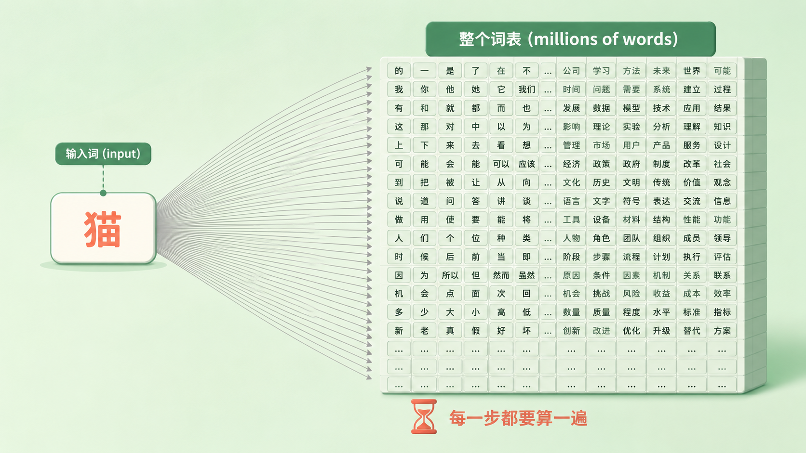
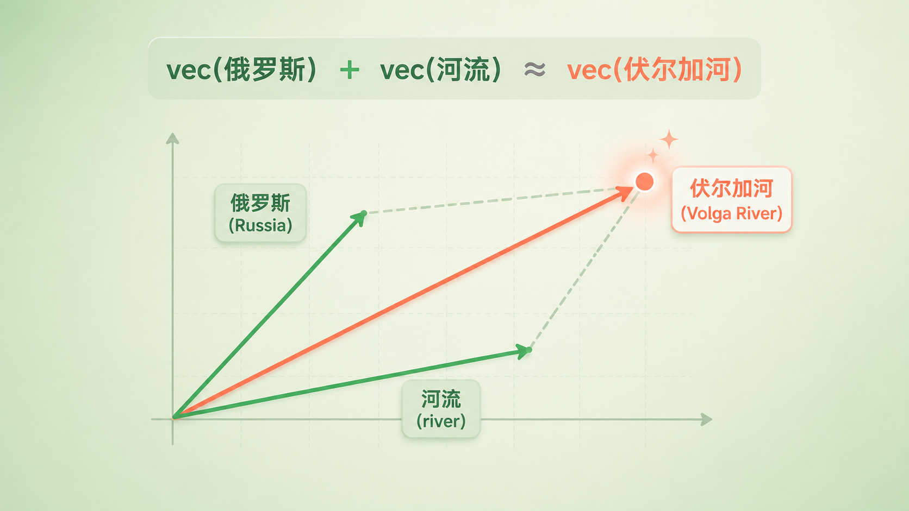

+++
title = "论文里程碑 #11：Distributed Representations of Words and Phrases and Their Compositionality"
description = "让词向量真正普及的不是更聪明的模型，而是三个朴素工程选择：训练更简单、数据更精、短语能独立成向量。"
date = 2026-07-19
tags = ["LLM", "论文里程碑", "Word2Vec", "负采样", "子采样", "词向量", "Skip-gram", "Mikolov"]
categories = ["LLM"]
series = ["论文里程碑"]
showTableOfContents = true
+++



> 让词向量真正普及的不是更聪明的模型，而是三个朴素工程选择：训练更简单、数据更精、短语能独立成向量。

## 开头——一篇更安静的续集

2013 年初，Word2Vec 的第一篇论文出来，用一个浅得不能再浅的网络，让「king − man + woman ≈ queen」这类线性类比以极具传播力的形式火遍全网。更关键的是，它已经能在十几亿词的语料上训练——靠的是一个叫层次化 softmax（Hierarchical Softmax）的技巧，绕开了在整个词表上逐一计算的昂贵开销。

按理说，问题已经解决了。可几个月后，同一批人又发了第二篇，标题很长——*Distributed Representations of Words and Phrases and Their Compositionality*。它没有提出任何新架构，想回答的是一个更安静的问题：同样这件事，能不能做得更简单，还能推得更远？后来大多数人真正用上的，恰恰是这第二篇里的答案。

## 时代背景——那道除法有多贵

先说清楚第一篇留下的底子。Skip-gram 的任务简单到近乎天真：给一个词，猜它周围会出现哪些词。「猫」出现的地方，附近大概率有「喵」「抓」「毛」。模型就在一次次「猜中 / 猜错」的反馈里，把每个词慢慢磨成一个向量。

问题出在「猜」的最后一步。要算出「给定『猫』，下一个词是『喵』的概率」，你得先算出「它是词表里每一个词的概率」，再除以总和做归一化——因为一组概率加起来必须等于 1。这一步就是 softmax。而词表有多大？一个正经语料几十万词起步，网页级语料上千万也不稀奇。于是每处理一个训练样本，模型都要在几百万个词上各算一遍、再全部加起来。这不是慢一点，是慢好几个数量级。

第一篇的应对，是层次化 softmax：把词表组织成一棵二叉树，预测一个词只需沿着树根走到叶子，计算量从「整个词表」降到「树的高度」，也就是从 \(W\) 降到约 \(\log W\)。这招有效，但那棵 Huffman 树、按编码路径一层层走的实现，说不上优雅。于是第二篇问了个直白的问题：能不能连树都不搭，也把这道除法绕过去？

*图：最朴素的做法里，预测下一个词要拿当前词和整个词表逐一比对再归一化——正是这道昂贵的除法，逼出了层次化 softmax 和负采样两种绕行方案。*

## 论文说了什么

这篇论文没有一个宏大的主张，它给了三样东西：两个让训练更省的优化，加一个让表示更强的扩展。

**第一样，一个更简单的训练目标：负采样（Negative Sampling）。** 不搭树，也不在整个词表上归一化，而是把问题改写成「把真词和几个随机假词分开」。它和层次化 softmax 是两个并列的替代方案，而不是第一次让 Word2Vec 跑起来——但它更简单，在很多词向量任务上也更好用，最终成了流传最广的那一个。

**第二样，把高频词扔掉一部分：子采样（Subsampling）。** 像「的」「是」「the」这种词，出现几百万次，重复度极高，单次共现能提供的边际信息却很低。子采样按频率概率性地丢弃它们，结果是训练快了 2 到 10 倍，而且低频词（rare words）的向量反而学得更准了。

**第三样，把短语当成一个词：短语学习。** 这不是加速技巧，而是表示能力的扩展。「New York」不是「New」加「York」，「Boston Globe」是一份报纸而不是一个球。论文把这类经常绑在一起出现的词识别出来、合并成一个整体 token 去学，于是短语也有了自己的向量。

要说最有冲击力的证据，不是某个准确率数字，而是规模本身：论文里最大的模型在 330 亿词的语料上训练完成（用的是层次化 softmax、1000 维向量、整句上下文），在短语类比任务上做到了 72%。词向量从此不再是实验室里的小演示。

## 论文怎么做到的

先讲负采样，这是全篇的心脏。

> 想象你在训练一个鉴宝师。老办法是：每拿出一件真品，就让他把博物馆里所有藏品都摸一遍、排个序，确认真品排第一。这当然严谨，但太慢了——藏品几百万件。新办法是：每拿出一件真品，只额外塞给他几件随手抓来的赝品，让他学会「这件是真的，那几件是假的」。只要真假分得开，鉴宝师的眼力照样练出来，而每次只用看几件东西。

老办法就是那道贵得离谱的 softmax：

$$
p(w_O \mid w_I) = \frac{\exp\!\big(v'_{w_O}{}^{\top} v_{w_I}\big)}{\sum_{w=1}^{W} \exp\!\big(v'_{w}{}^{\top} v_{w_I}\big)}
$$

分子是「猫」（\(w_I\)，输入词）和「喵」（\(w_O\)，上下文词）这一对的匹配分，分母是「猫」和词表里每一个词的匹配分之和。这里其实藏着两套向量：每个词既有一个作「输入」时的向量 \(v_w\)，又有一个作「上下文」时的向量 \(v'_w\)，训练完通常取前者来用。而那个 \(\sum_{w=1}^{W}\) 就是灾难的所在，\(W\) 是整个词表的大小——为了得到一个概率，你被迫把所有词都算一遍。

负采样把这道归一化题，换成了一道二分类题：

$$
\log \sigma\!\big(v'_{w_O}{}^{\top} v_{w_I}\big) + \sum_{i=1}^{k} \mathbb{E}_{w_i \sim P_n(w)}\big[\log \sigma\!\big(-v'_{w_i}{}^{\top} v_{w_I}\big)\big]
$$

左边一项：把真正的上下文词（真品）的分数往上推。右边一项：随机抽 \(k\) 个噪声词（赝品），把它们的分数往下压。\(\sigma\) 是 sigmoid，负责把分数挤进 0 到 1 之间。整个词表的求和消失了，只剩下 \(k\) 个采样——论文里 \(k\) 取 5 到 20，大语料上甚至只要 2 到 5。

把三条路的账并排摆出来，就看清了负采样省在哪、又舍了什么：

- 原始 softmax——每步 \(O(Wd)\)，给出一个合法的归一化概率，但代价是整个词表；
- 层次化 softmax（第一篇用的那套）——每步 \(O(d\log W)\)，同样给出合法概率，靠一棵二叉树把词表压成树高；
- 负采样——每步只要 \(O((k+1)d)\)，但它干脆不再输出归一化概率，只求把真词和随机词分开。

前两者都还在老老实实算一个合法的概率分布 \(p(w_O \mid w_I)\)，负采样则放弃了「算概率」这件事。对只想要一份好用词向量的人来说，这个取舍非常划算：反正要的是向量本身，不是那个概率。

*图：不再和整个词表比对，只需把一个真上下文词的分数推高、几个随机噪声词的分数压低。*

这里还藏着一个不起眼却关键的细节：那 \(k\) 个赝词到底怎么抽？不是均匀乱抽，也不是完全照词频抽，而是把词频取 3/4 次方之后再抽（\(P_n(w) \propto f(w)^{3/4}\)）。这个奇怪的指数纯粹是试出来的——它让高频词被抽为负样本的机会降一点、低频词升一点，实测就是比均匀和按频率两种都好。工程里很多最好用的东西，就是这么磨出来的。

再说子采样。它给每个词算一个丢弃概率 \(P(w_i) = \max\!\big(0,\, 1 - \sqrt{t / f(w_i)}\big)\)：其中 \(f(w_i)\) 是这个词在语料里的相对频率，\(t\) 是个阈值，大约取 \(10^{-5}\)。这个式子只对频率高于 \(t\) 的词起作用——词频越高，被丢的概率越大，「的」这种词会被大量删掉，而低于阈值的低频词一个都不动。好处是双份的：训练样本变少了（更快），而且低频词不再被高频词的汪洋淹没，它们的向量练得更扎实。

短语的处理最朴素，也最有意思。作者用一个打分公式，找出那些「异常爱绑在一起」的词对：\(\text{score}(w_i, w_j) = \frac{\text{count}(w_i w_j) - \delta}{\text{count}(w_i)\,\text{count}(w_j)}\)。分子里的 \(\delta\) 是个折扣项，防止两个都很罕见的词凑巧连在一起就被误判。分数够高的词对（比如 New York）就被合并成一个 token「New_York」，然后照常喂进 Skip-gram；论文还会把阈值逐轮调低、扫上 2 到 4 遍，好把更长的短语也拼起来。这里要说清楚：这个公式测的是「两个词共现得反不反常」，也就是统计意义上的搭配（collocation），并不真的去判断一个短语的意思能不能由它的词组合出来。它的动机确实是那些不可组合的短语（像 Boston Globe），但它抓到的，其实是一切绑得够紧的组合——习语、专名，甚至意思完全能拆开的固定搭配。

请记住这个「把绑得紧的词打包成一个原子」——它待会儿会变成一个伏笔。

## 它改变了什么

短期看，负采样和子采样这套组合，被后来很多词向量工作继承了下去。FastText 就直接站在负采样版的 Skip-gram（简称 SGNS）之上，把它扩展到子词一级。不过并不是所有后来者都走这条路——同期的 GloVe 沿的是另一条线：它不做负采样，而是直接在全局的词-词共现矩阵上做加权最小二乘拟合，用对数双线性模型去逼近共现统计。两者目标函数并不相同，却在各类基准上打得旗鼓相当，很长一段时间里成了预训练词向量的两个标准选项。

长期看，Word2Vec 是「大规模自监督表示学习」这件事的一个重要里程碑：用海量无标注文本，配一个便宜到能大规模跑的目标，就能学出通用的语言表示。这个思路后来在 BERT、GPT 的预训练里被发扬光大，负采样那种「不追求精确概率、只要能把正确的和随机的分开」的味道，也和今天对比学习里的 InfoNCE 一脉相通。但要说清楚：这是一种思想上的呼应，不是同一套算法，也不是说预训练范式就源自这一篇——它是众多源头里分量很重的一个。

它还附赠了一份意外的礼物：这些向量能做加法。vec(俄罗斯) + vec(河流) ≈ vec(伏尔加河)，vec(德国) + vec(航空) ≈ vec(汉莎航空)。原论文给的直觉解释是：向量大致活在一个「对数概率」的空间里，两个向量相加约等于把它们各自的上下文分布相乘、做了个「与」——那个同时高频出现在「俄罗斯」和「河流」语境里的词，正是伏尔加河。这个解释很漂亮，但更准确的说法是：它是模型里经常出现的一种经验性线性结构，而不是对所有词都严格成立的代数定律。后来的理论工作甚至指出，负采样版 Skip-gram 本质上是在对一个「移位的逐点互信息（shifted PMI）」矩阵做隐式的低秩分解——一旦落到具体的低维分解和两套向量上，「相加等于分布相乘」就只是近似而非铁律。可即便如此，语义能用加减法直接操作这件事本身，已经足够让人震动。

*图：两个词向量首尾相接，合成的向量往往落在一个语义上「同时属于两者」的词附近——这是经验性的线性结构，而非严格的代数定律。*

## 与主线的接口

**如果你想深入……**

这篇论文的核心概念，对应我们 LLM 系列的「表示与分词」章节：

- **#13 Embedding 查表：离散 ID 到连续语义的惊险一跃** —— 讲了「分布式表示」（distributed representation）到底是什么：为什么每个词要用一整个稠密向量、由许多维度共同编码，而不是一个孤立的编号。这正是本篇标题里那半句 *Distributed Representations* 的工程版拆解。
- **#14 向量空间的几何** —— 讲了 king − man + woman ≈ queen 这类类比为什么成立、又为什么被夸大，以及 cosine 相似度、最近邻这些「读」词向量空间的基本操作。本篇里那些加法奇迹，到了这里会被讲清楚它的边界在哪。
- **#4 Logits、Softmax 与数值稳定** —— 讲了那道「贵到跑不动」的 softmax 归一化本身。理解了它为什么贵，你才会真正明白层次化 softmax 和负采样各自绕开的是什么。

再往大了说，负采样让「在几百亿词上做无监督预训练」第一次变得现实，这条线一直通到主线的「数据工程」章节——大规模自监督训练为什么可行，源头之一就在这里。

读完这些，你对 *Distributed Representations of Words and Phrases* 的理解，会从「哦，就是那个 word2vec」变成能说清「它到底省下了哪一步、代价又是什么」的工程认知。

## 收尾

读这篇之前，你可能以为 Word2Vec 的魔法在于那个巧妙的网络结构。读完你会发现，让它真正流行起来的，是几个朴素到有点「土」的工程选择：把训练目标改得更简单、把冗余的高频词扔掉、把黏得紧的词打包成一个整体。好的想法要落地，往往就差这最后一公里的抠门。

但还记得那个伏笔吗——短语的处理，本质是「把绑得最紧的词打包成一个原子」。这是一种聪明的绕行：它没有去回答「组合性」（compositionality）这个真正难的问题，而是把最难拼的那些短语直接打包、绕了过去。一句话的意思，真能从它的词一步步「拼」出来吗？当「not good」里的 not 把 good 的褒义整个掀翻，向量的加减法就彻底失灵了。

下一篇，我们看斯坦福的一群人怎么正面硬刚这个问题——*Recursive Deep Models for Semantic Compositionality Over a Sentiment Treebank*。他们不再把短语打包成原子，而是沿着句子的语法树，一层一层地把意思真正「算」出来，连否定和转折都想接住。组合性，这一次要来真的了。

## 参考资料

- 论文原文：Mikolov, T., Sutskever, I., Chen, K., Corrado, G., & Dean, J. (2013). *Distributed Representations of Words and Phrases and Their Compositionality*. NeurIPS 2013. arXiv:1310.4546
- 作者：Tomas Mikolov, Ilya Sutskever, Kai Chen, Greg Corrado, Jeffrey Dean（Google）
- 延伸阅读：
    - Mikolov, T., Chen, K., Corrado, G., & Dean, J. (2013). *Efficient Estimation of Word Representations in Vector Space*. arXiv:1301.3781（Word2Vec 第一篇，本系列上一篇；层次化 softmax 与 CBOW / Skip-gram 架构）
    - Goldberg, Y., & Levy, O. (2014). *word2vec Explained: Deriving Mikolov et al.'s Negative-Sampling Word-Embedding Method*. arXiv:1402.3722（把负采样的数学推导讲透的经典笔记）
    - Levy, O., & Goldberg, Y. (2014). *Neural Word Embedding as Implicit Matrix Factorization*. NeurIPS 2014（证明 SGNS 等价于对 shifted-PMI 矩阵的隐式分解）
