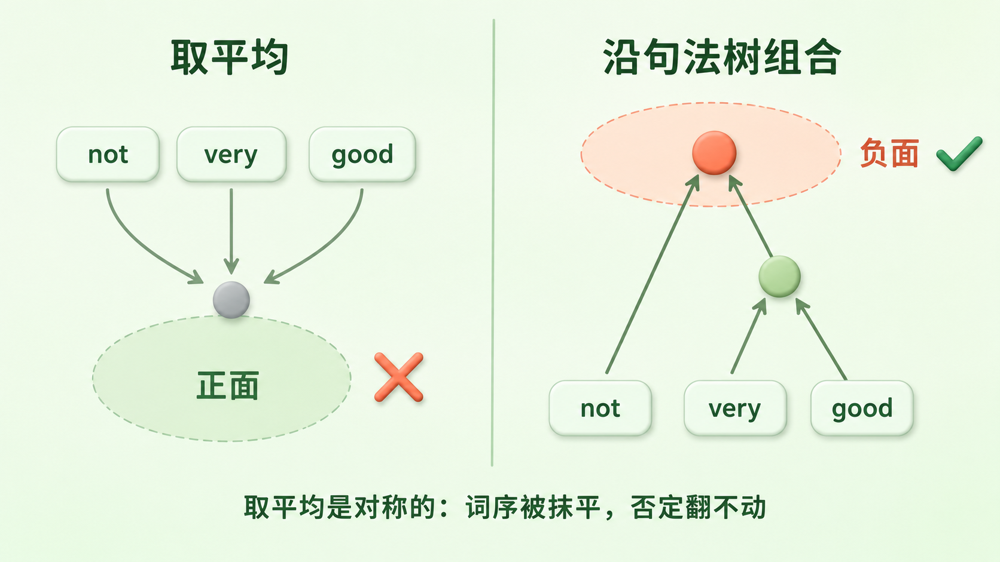
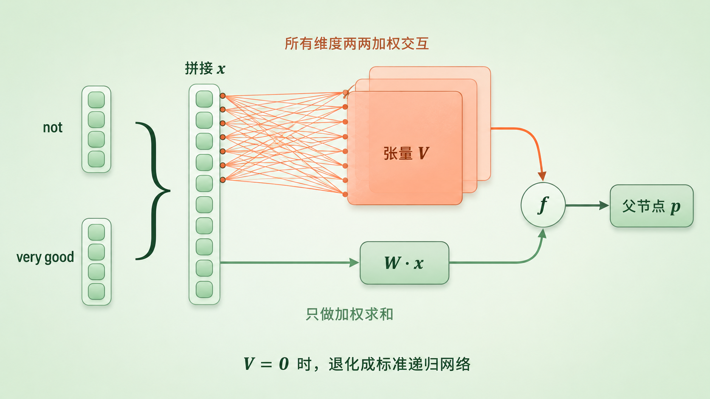
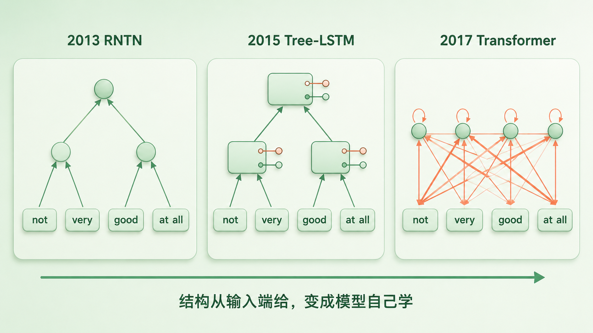

+++
title = "论文里程碑 #12：Recursive Deep Models for Semantic Compositionality Over a Sentiment Treebank"
description = "句子的意思不是词义的平均——2013 年，一棵标了 21 万个短语的树把这件事变成了可测量的问题。"
date = 2026-07-27
tags = ["LLM", "论文里程碑", "SST", "RNTN", "情感分析", "组合性", "句法树", "Socher"]
categories = ["LLM"]
series = ["论文里程碑"]
showTableOfContents = true
+++



> 句子的意思不是词义的平均——2013 年，一棵标了 21 万个短语的树把这件事变成了可测量的问题。

## 2013 年秋天的另一条路

2013 年是词向量的高光年。年初 Word2Vec 第一篇挂上 arXiv，年底第二篇进了 NIPS，标题里就明明白白写着 compositionality（组合性）。它对短语的处理很实用主义：把 New York 这类高频搭配整个塞进词表，当成一个词来学。

夹在这两篇中间的十月，EMNLP 上出现了另一条路：短语可以不进词表，而是沿着句法树一层层算出来。两条路并不互斥，但它们对「意思从哪来」的下注方向相反。为了让自己这一注能被验证，斯坦福的一组人先雇人在 215,154 个短语上打了标：不是句子，是短语，包括「不太」「不太好」「这部电影不太好」这样一层层套上去的每一个中间片段。

论文标题是 *Recursive Deep Models for Semantic Compositionality Over a Sentiment Treebank*。十年后它拿了 ACL 的 Test of Time 奖。有意思的是，让它拿奖的那个东西，和标题里最想强调的那个东西，并不是同一个。

## 取平均，为什么撑不住一个句子

2013 年，单词级的分布式表示刚刚取得突破——Word2Vec 让高质量词向量变得便宜、可规模化。但一个句子的意思怎么从词的意思里来，还没有像样的答案。

当时最省事的做法是：把句子里所有词的向量取平均，扔给分类器。这个做法被这篇论文拉出来当基线，代号 VecAvg。

它在粗粒度上其实不算差：只判正负的整句二分类有 80.1%，跟同期几个词袋基线在一个档位。可一旦要判五档，整句准确率掉到 32.7%，是全表最低的一个——连只数词频、连词序都不看的朴素贝叶斯（41.0%）都比它高 8 个多点。

差别就出在「程度」和「组合」上。粗判正负，句子里堆了几个褒义词大致就够了；要判「有点好」还是「很好」，要处理「不太好」，就得知道这些词是怎么搭在一起的。

而取平均恰恰在这一步交白卷。它是对称聚合，词序在这一步就没了：「狗咬人」和「人咬狗」平均出来一模一样。否定更麻烦——good 和 not good 之间只差一个 not 的贡献，而 not 的向量是固定的，它在每个句子里都往同一个方向推同样的量。可否定该起多大作用、作用在谁身上，恰恰依赖它挨着谁。

数据那头卡得更死。当时主流的影评语料主要给到句子级或篇章级的标签，也有一些带 chunk 标注的资源，但没有一份把整棵句法树的每个节点都标上情感。模型只知道最后的结论，不知道是在哪一步翻的车。监督信号基本挂在树根上，中间过程靠模型自己猜。

> 这就是 2013 年的困境：组合的算法可能不对，而且没有任何数据能告诉你它错在哪一步。

*图：取平均是对称聚合，词序在这一步就没了；沿句法树逐层组合，否定才有机会作用在它真正修饰的那一部分上*

## 三个论点

**第一，要让模型学会组合，得先把组合过程本身标出来。**

Stanford Sentiment Treebank（SST）用的是笨办法：拿 Pang & Lee 2005 年那批烂番茄影评句子，用 Stanford Parser 全部解析成句法树，再把树上每一个不重复的短语节点——一共 215,154 个——扔到 Amazon Mechanical Turk 上，每个由 3 个标注者用一根 25 档的滑条打分。11,855 个句子，切出 21 万个带标签的中间态。

标注结果本身就是发现。滑条虽然有 25 档，但绝大多数人只把它停在五个区域附近——负面、略负、中性、略正、正面；两端的极值很少有人用，档与档之间也很少停。既然连续评分实际上只用出了五个簇，五分类就成了这份数据的天然粒度。另一个观察是短语越长情感越强、短短语大多中性——这恰好解释了词袋模型为什么在长句上还凑合、一到短语就崩。

在看数字之前先把口径说清楚，不然下面几个百分比会打架。SST 常报的是两个任务乘两个范围：**SST-5** 是五分类，**SST-2** 是扔掉 neutral 之后的正负二分类（这一扔过滤掉约 20% 数据）；**Root** 只评完整句子，**All** 评树上全部短语节点。论文里整句的训练/验证/测试划分是 8,544 / 1,101 / 2,210，二分类子集是 6,920 / 872 / 1,821。这个口径后来还会变一次，我们放到第四节讲。

**第二，组合不能只靠加法，得让两个向量之间发生乘法。**

递归神经张量网络（Recursive Neural Tensor Network，RNTN）在 SST-5-All 上做到 80.7%，SST-2-Root 上做到 85.4%。

85.4% 容易被误读成张量结构一个人的功劳。此前公开结果长期停在 80% 以下，但那是在旧版整句标注的 Rotten Tomatoes 数据上跑的；换到 SST 的短语级密集监督之后，同一张表里连二元词袋模型都到了 83.1%，上一代的 MV-RNN 是 82.9%。这五个多点里，数据和模型各占一部分——同样吃 SST，RNTN 比 MV-RNN 高 2.5 个点。

**第三，也是我认为这篇论文最诚实的地方：总分的提升有限，把差距逼出来的是几个专项子集——而那几个子集小得惊人。**

SST-5-Root 上，RNTN 45.7%，MV-RNN 44.4%，普通递归网络 43.2%——差距在 1.3 到 2.5 个点之间。论文没有报多次运行的方差，也没做显著性检验，所以严格讲，我们没有依据判断这个差值有多稳（这正是主线「离线评测范式」那一篇要处理的问题）。

换到专门测否定的子集上，数字一下就拉开了。把正面句否定掉、看模型能不能正确翻转结论：RNTN 71.4%，MV-RNN 52.4%，普通递归网络 33.3%，二元词袋模型 19.0%。把负面句否定掉（「不烂」应该变得没那么糟，但不必变好）：RNTN 81.8%，MV-RNN 54.6%，普通递归网络 45.5%。

但这里必须把分母摆出来。论文写明第一组只有 **21 个**正面句及其否定版；第二组的样本数没写，不过那一列的四个数字（27.3 / 45.5 / 54.6 / 81.8）两两间距都是 9.1 个点上下，正好是 1/11，反推样本数就是 **11 个**。所以 71.4% 其实是 15/21，81.8% 是 9/11——错一个样本，准确率就动 5 到 9 个点。「X but Y」那组稍好，131 例，RNTN 41%，MV-RNN 37%，普通递归网络 36%，二元词袋 27%。

这不是要否掉结论。方向是清楚的：四类模型在否定上的排序，和它们的组合能力排序一致，而且这个排序在两组独立的否定实验里都成立。但它给的是方向性证据，撑不起「RNTN 学会了否定」这种强判断。

有意思的是，这篇论文一边示范了「总分会掩盖关键能力」，一边也示范了另一半风险：把总分换成小样本专项集，你换来的是分辨率，付出的是稳定性。两个坑都在，主线的「评测与观测」章里会挨个碰到。

## 它是怎么做到的

先说清楚「递归」在这里的意思。它不是 RNN 那种从左到右一个词一个词地读，而是照着句法树自底向上合并：以 not very good 为例，先把 very 和 good 合成父向量 \(p_1\)，再把 not 和 \(p_1\) 合成 \(p_2\)，每合出一个节点就用同一个 softmax 分类器打一次情感分。

每个节点都有预测、也都有人工标签，于是每个节点都产生一份交叉熵损失；全树的损失加起来（再加一项 L2 正则）就是训练目标，梯度顺着树的形状回传，同时更新共享的组合参数和底层词向量——这套做法叫 Backpropagation Through Structure。所以「监督信号铺满整棵树」不是比喻：每个节点都在真的往回送梯度。这正是 SST 存在的意义。

关键在于「合成」这个动作到底用什么函数。

标准递归网络的写法是：把两个孩子拼成一个长向量，过一个线性层，再压一下，\(p = f(W[b;c])\)（\(W\) 是 \(d \times 2d\) 矩阵，\(f\) 取 tanh）。

问题就在这里：\(b\) 和 \(c\) 各自被 \(W\) 的对应列加权、然后求和，两者之间唯一的「交互」发生在 tanh 那一下挤压里——隐式的，被动的。

> 想象两个人合写一句话。标准递归网络的做法是：一人写一半，把两张纸拼起来交给编辑压平。两个人全程没说过话。

论文的问题是：能不能让他们先说上话？

答案是在组合函数里并联一条乘法通路：

$$
p = f\left( x^\top V^{[1:d]} x + W x \right), \quad x = \begin{bmatrix} b \\ c \end{bmatrix}
$$

加号右边那项就是原来的标准递归网络，一个字没改；左边是新加的，把拼起来的 \(2d\) 维向量和它自己做一次二次型运算。\(V^{[1:d]}\) 是 \(2d \times 2d \times d\) 的张量，可以理解成 \(d\) 张切片摞在一起，每张吃进同一对孩子、吐出结果向量的一维。

翻成大白话：每张切片都在给「所有维度两两配对」打分——不是逐维对齐相乘，而是把 \(x\) 里任意两个分量的乘积都配上一个可学的权重再加起来。\(x\) 由 \(b\) 和 \(c\) 拼成，所以这里既有两个孩子之间的交叉项，也有各自内部的二次项。

那它跟线性通路的差别到底在哪？\(Wx\) 当然会随输入变化，它不是常数。但它可以拆开写成 \(W_b\,b + W_c\,c\)——两个孩子各算各的，最后相加，\(b\) 那一份里不含任何关于 \(c\) 的信息。这叫加性可分。二次型多出来的正是 \(b_i c_j\) 这类交叉项：某一维最终往哪偏、偏多少，可以取决于另一个输入此刻长什么样。

这正是 not good 需要的能力：not 该起多大作用、把哪一维推向哪边，得看它挨着的是 good 还是 terrible，而不是各算各的再相加。张量通路把这种「条件性」变成了模型可以学的东西。至于内部是不是真把 not 学成了一个作用在 good 上的算子——论文没有做参数分析或消融去证明，我们能说的是它在否定实验上表现得像。

当 \(V\) 全设为 0，RNTN 就退化成标准递归网络——这不是换了个新模型，而是在旧模型上并联了一条支路。「新方法把旧方法包含为特例」，是判断方法论文扎不扎实的一个朴素信号。

那会不会只是参数变多了呢？论文给了一个反例。交叉验证下来，所有模型的最优词向量维度都落在 25 到 35 维之间，按今天的标准小得离谱（这是论文那次超参数搜索的结果，倒不能反推出「这份数据只能支撑这么大容量」）。而词表相关参数量最大的其实是 MV-RNN：它给每个词额外配一个 \(d \times d\) 矩阵，规模是 \(O(|\mathcal{V}| d^2)\)，比只存词向量的 \(O(|\mathcal{V}| d)\) 多出一个 \(d\) 的因子，在这个维度设置下差几十倍。参数更多，效果反而不如 RNTN。

这能排除「参数越多越好」，但排除不了别的。三个模型的参数根本不长在同一个地方——标准递归网络的组合层是 \(O(d^2)\)，RNTN 在这之上加了 \(4d^3\)，MV-RNN 则把参数全堆在词表侧。论文没有做参数量对齐的消融，所以能说的是「显式的交互形式可能比单纯堆参数更管用」，不能说这 2.5 个点全部来自张量。

而 \(4d^3\) 这个量级不是白来的。除了参数，每个节点的组合还要 \(O(d^3)\) 的朴素计算——\(d\) 从 30 提到 300，参数和计算各涨一千倍。这是 RNTN 想往大了做时会先撞上的一堵墙。至于它后来被取代有多少归因于这堵墙、多少归因于树难并行或别的什么，论文管不到，我们也只能把它列为原因之一。

还有个我很喜欢的细节。测「否定负面句」时，作者没拿「是否翻转成正面」当指标，而是定成「非负激活是否上升」——因为「不烂」本来就不该被判成「好」。愿意为一个子集重新设计指标，说明作者是在做语言学，不是在刷榜。

*图：两个孩子先拼成一个向量，再分两条路——加法通路是加性可分的，张量通路给所有维度的两两配对都配上权重*

## 它改变了什么

短期影响很直接。此后多年，SST-5 或 SST-2 成了句子级情感分类最常见的参照系：TextCNN、Tree-LSTM、ELMo 报的是细粒度那一版，或者两版都报；到了预训练时代，SST-2 借着 GLUE 成了默认那一版——BERT 原论文报的就只有 SST-2。

这里有个反转：论文标题最想强调的是 Recursive Deep Models（模型），真正活下来的却是 Sentiment Treebank（数据）。RNTN 两三年就被 Tree-LSTM 超过，再往后被 Transformer 整个绕过；而那 21 万条标注用到了今天。

顺带说一个树模型特有的脆弱点。SST 的节点是 Stanford Parser 自动切出来的，模型的组合路径完全由这棵树决定。分析器要是把短语边界切错了，模型就会被要求去组合两个本来不该拼在一起的片段，而且这个错误会顺着树一路传到根节点。端到端的序列模型没有这个失败模式——它不需要一个外部组件先把结构定下来。

拆开看，这篇论文留下了三样寿命不同的东西。

**第一样是数据形态：密集的短语级监督。** 不是给一句话一个标签，而是给树上每个节点一个标签。它让「模型在哪一步理解错了」第一次变成可直接测量的东西，这个形态比 RNTN 活得久得多。

**第二样是评测方法：专项诊断集。** 否定子集只有二十来个样本，在总分里连零头都算不上，却是全文最有说服力的证据——同时也是全文统计上最脆的证据。用小而针对性的集合去逼问模型的某一类能力，后来成了标配；连带着「小集合怎么才能不被噪声吞掉」也成了一个长期问题。

**第三样是建模直觉：显式的乘法交互有价值。** 这一样最抽象，也最容易被讲过头。

「乘法交互」这条线索确实延续了下来，但别把它讲成师承。RNTN 的张量吃进两个孩子、吐出一个新的父向量——它做的是**组合**，产出一个 \(d\) 维表示。attention 里的 \(q \cdot k\) 吃进两个 token 的投影、吐出一个标量，经 softmax 决定 value 怎么加权求和——它做的是**路由**，产出的是权重。一个是三阶张量的二次型，一个是点积打分，不是同一种运算。两者共享的只是一个更宽泛的直觉：比起纯加法，乘法形式能表达「一个输入的存在会改变另一个输入的作用」这种条件关系。

至于树，情况也比「被证伪」复杂。Transformer 之后，大量任务不再在输入端提供句法树，self-attention 直接从数据里学任务需要的依赖关系。但这从来不是一次受控比较——原始 Transformer 做的是机器翻译和成分句法分析，没有在同等数据规模和监督条件下跟 RNTN 对打过。它削弱的是「外部句法树是必需品」这个前提，不是证明句法结构没有价值。

最后是评测那一层。SST-2 上头部系统的准确率后来被推到 97% 以上——但这个数字和论文里的 85.4% 连不成一条曲线。GLUE 收编 SST-2 的时候沿用了原来的验证集和测试集（872 / 1,821 句），却把训练集换成了短语级展开的约 6.7 万条，而论文用的是 6,920 个整句。训练规模和协议都变了，两个数字只能说是同一份数据家族上的历史趋势，不是同一条赛道上的成绩。

趋势本身倒是真的：区分度基本耗尽了。加上它是一份公开十几年、被无数教程和仓库转载的数据，污染风险也很高。但「风险高」和「某个具体模型见过测试集」是两回事，后者要靠训练数据披露、字符串匹配或成员推断单独验证，不能直接断言。

也别把 SST 当成语言理解的通用尺子：单一的影评领域、自动生成因而会一路传错的句法树、由 3 人评分聚合而抹掉分歧的标签，加上 SST-2 为二分类扔掉的 neutral。它测的是「影评里的情感组合」，这已经足够有价值，但不比它更大。

*图：三代模型的组合方式——结构从「人在输入端给」变成「模型自己学」*

## 与主线的接口

**如果你想深入……**

这篇论文的核心概念对应我们 LLM 系列的「评测与观测」章节：

- [#94] 评测全景：别被榜单骗了，Goodhart 定律悬在头顶 — 基准被当成优化目标之后区分度如何耗尽，SST-2 是走完整个周期的早期样本（跨设置的分数不能直接连线，见第四节）
- [#95] 分数为何经常骗人：平均分掩盖长尾灾难 — 总分只高 1.3 个点、否定子集却高出近 20 个点；而那个子集只有 21 个样本，两种「被分数骗」的方式在同一篇论文里同时出现
- [#96] 基准陷阱 I：数据污染、泄漏与「背题库」 — 公开基准长期流传之后要怎么判断它还可不可信
- [#98] 离线评测范式：固定随机性，才能谈回归 — 没有方差和显著性检验时，1.3 个点为什么不该被当成结论

组合性那一半，对应「表示与分词」章节：

- [#13] Embedding 查表：离散 ID 到连续语义的惊险一跃 — 这些词向量到底从哪来
- [#14] 几何直觉：向量空间中的类比、距离与各向异性 — 为什么向量的线性运算在语义上没那么可靠

读完这些，你对 SST/RNTN 的理解会从历史印象变成可操作的工程认知。

## 收尾：模型变强之后，谁来拦住它背题

读之前，你可能觉得这是一篇关于情感分析的老论文。读完之后，希望你看到的是另一个问题：意思是怎么从小单位合成大单位的。RNTN 给的答案是「沿着句法树，让两个孩子的维度两两之间都能相互作用」。这个答案里，结构那一半被后来者绕开了，乘法那一半以另一种形式活了下来。

还有一件事值得留意。RNTN 比前辈多了一整个三阶张量，表达力上去了，把训练集背下来的风险也跟着上去。这篇论文的应对是一整套定制化的克制：词向量压到 25 至 35 维、交叉验证正则强度、外加 21 万条标注把监督信号铺满每个节点。论文没有把这几项拆开做消融，所以各自贡献多少并不清楚；能确定的只是它们都是为这一个任务量身配的。

一个完全不挑架构的答案在同一时期成型：训练的时候，每一步随机把一部分神经元的输出直接置零，逼着网络不许依赖任何单个特征。下一篇我们看 *Dropout: A Simple Way to Prevent Neural Networks from Overfitting*——正是这类正则化手段先把地基铺好，后来的模型才敢一路往大了做。

## 参考资料

**论文原文**

- Socher, R., Perelygin, A., Wu, J. Y., Chuang, J., Manning, C. D., Ng, A. Y., & Potts, C. (2013). *Recursive Deep Models for Semantic Compositionality Over a Sentiment Treebank*. EMNLP 2013, pp. 1631–1642. [aclanthology.org/D13-1170](https://aclanthology.org/D13-1170/)
- 数据集主页与在线 demo（可以直接输入句子看树上每个节点的预测）：[nlp.stanford.edu/sentiment](https://nlp.stanford.edu/sentiment/)

**延伸阅读**

- Tai, K. S., Socher, R., & Manning, C. D. (2015). *Improved Semantic Representations From Tree-Structured Long Short-Term Memory Networks*. ACL 2015. — RNTN 的直接后继，把 LSTM 的门控搬上了句法树。[aclanthology.org/P15-1150](https://aclanthology.org/P15-1150/)
- Wang, A., Singh, A., Michael, J., Hill, F., Levy, O., & Bowman, S. R. (2018). *GLUE: A Multi-Task Benchmark and Analysis Platform for Natural Language Understanding*. BlackboxNLP @ EMNLP 2018. — SST-2 如何被收编进预训练时代的评测套件，以及训练集为什么从 6,920 变成约 6.7 万。[aclanthology.org/W18-5446](https://aclanthology.org/W18-5446/)
