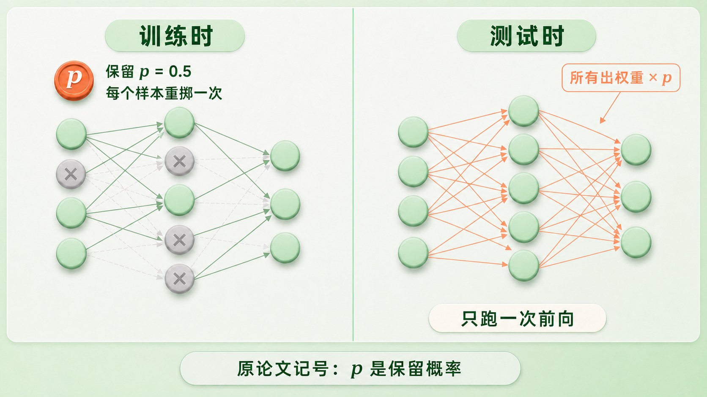

+++
title = "论文里程碑 #13：Dropout: A Simple Way to Prevent Neural Networks from Overfitting"
description = "训练时从同一套权重里随机采样子网络，测试时一次前向近似融合它们的预测——用噪声换一次几乎免费的集成。"
date = 2026-08-01
tags = ["LLM", "论文里程碑", "Dropout", "正则化", "过拟合", "集成学习", "Hinton", "Srivastava"]
categories = ["LLM"]
series = ["论文里程碑"]
showTableOfContents = true
+++



> 训练时从同一套权重里随机采样子网络，测试时一次前向近似融合它们的预测——用噪声换一次几乎免费的集成。

## 一、赢在前，论文在后

2012 年 7 月 3 日，一篇八页的短文挂上 arXiv，标题是 *Improving neural networks by preventing co-adaptation of feature detectors*，署名五个人，都在多伦多大学。

两个月后，这五个人里的三个带着一个卷积网络参加 ILSVRC-2012。那个网络的两层全连接里用的，就是这篇短文的方法。成绩分几档：单个网络在验证集上的 top-5 错误率是 18.2%，5 个网络平均后降到 16.4%，最终提交竞赛的那一版（7 个网络平均）在测试集上做到 15.3%——第二名是 26.2%。

方法叫 dropout：训练的每一步，随机把一半神经元的输出直接置零。

它赢下比赛的时候，完整的论文还没写。真正把它讲清楚的那一篇——《Journal of Machine Learning Research》第 15 卷，1929 到 1958 页——2013 年 11 月投稿，2014 年 6 月才见刊。所以我们今天读的这三十页，与其说是一个新想法的发布，不如说是一份迟到的说明书：一个已经改写了行业的方法，回过头来解释自己凭什么能行。

## 二、我们知道集成有效，但在大网络上用不起

深度网络的老毛病是参数太多、数据太少：网络会把训练集里的采样噪声也当成规律学下来，在训练集上成立，换到测试数据就不成立。论文开篇列了当时的常规武器——早停、L1/L2 权重惩罚、soft weight sharing。

但所有人都知道还有个更好的东西：模型平均。

理论上的金标准是贝叶斯，对参数的所有可能取值按后验概率加权平均。退一步的工程版本是集成：训几个不同的模型，把预测平起来。这一招在机器学习里几乎从不失手。

问题是它在大网络上用不起，而且是三重用不起。第一，模型之间得够不一样才有收益，那就要么换架构、要么换数据；换架构意味着每个架构都要单独调一遍超参。第二，大网络本来就吃数据，再把数据切开喂给不同模型，每个都不够吃。第三，就算你把它们都训出来了，测试时跑十个大网络，在需要快速响应的场景里根本不现实。

所以 2012 年的处境是：最有效的那个办法，恰好在最需要它的地方用不起。

一个具体的尺度感——论文里最大那个 MNIST 网络是两层各 8192 个单元，六千五百多万参数，而训练集只有六万张图。参数是样本量的一千倍。按当时的常识，这种网络不早停必然把训练集背下来。

## 三、论文做了什么

### 3.1 三个论点

**第一，随机丢单元不只是「加了点噪声」，它有一个精确的解释：你在从同一套参数里反复采样，训练指数多个共享权重的子网络。**

一个有 \(n\) 个单元的网络，对应最多 \(2^n\) 个可能的「瘦身网络」（thinned network）。「共享」这两个字要说清楚分量：这些子网络不是各自初始化、各自优化出来的独立模型，它们共用同一份权重，被采到哪个就更新哪个对应的部分，所以总参数量还是 \(O(n^2)\)。论文自己把话说得更直白——每个具体的瘦身网络很少被训练到，甚至可能一次都没有。多样性来自采样，成本却没有跟着翻倍，这就是那笔交易的核心；代价是这些「成员」从来没有被单独训练完整过。

**第二，测试时不需要真的把这些子网络跑一遍，把权重乘以保留概率 p，一次前向就够了。**

论文把这一步的目标写成「等权重的预测几何平均」。这个说法在一种情形下是**精确**的：2012 年那篇短文给出了结论——单隐层加 softmax 输出的网络，权重缩放后的「平均网络」算出来的，恰好就是全部 \(2^N\) 个子网络所预测的标签分布的几何平均。但网络一变深、非线性一层层叠起来，这个等式就不再成立，权重缩放退化成对模型组合的一个近似。

近似得够不够好，论文用实验量了一下，不过要留意它量的方式：第 7.5 节采样 \(k\) 个子网络，对它们的**预测概率做算术平均**（不是几何平均），再拿去和「权重缩放一次前向」比分类错误率。答案是 \(k \approx 50\) 时两者持平。所以这个实验说明的是「一次前向追得上 50 次采样平均」，而不是「深网里那个几何平均等式仍然成立」。

**第三，它是通用的，但收益不均匀。**

最干净的对照在 MNIST 那张正则化比较表里：同一个 784-1024-1024-2048-10 架构，只换正则化手段——L2 是 1.62%，max-norm 是 1.35%，dropout + L2 是 1.25%，dropout + max-norm 是 1.05%。错误率差不多砍掉三分之一。

SVHN 那组更有意思，因为它推翻了一个直觉。同一个卷积网络：不用 dropout 是 3.95%，只在全连接层用降到 3.02%，连卷积层一起用再降到 2.55%。按常理卷积层参数少、不该过拟合，可加了照样有用——论文的解释是卷积层的 dropout 给上面的全连接层提供了带噪输入。

但换到文本上，收益就小了一大截：Reuters-RCV1 的 50 类文档分类，31.05% 降到 29.62%。论文自己写明这个改进比视觉和语音小得多，没有粉饰。

第一节那几个 ImageNet 数字则要单独说一句归因。论文表里 ILSVRC 那一栏报的是 AlexNet 的整体成绩，dropout 只是其中一个组件，这篇论文没有在 ImageNet 上做过 dropout 的消融。那个数字能说明 dropout 参与了一件大事，不能说明那件大事有多少归它。

### 3.2 它是怎么做到的

先说直觉。论文给了两个，都不是数学。

第一个来自有性生殖。无性繁殖直接把一整套磨合好的基因传下去，看起来更有利于保住个体适应度；有性生殖非要把两套基因各取一半重组，明明会打散那些已经配合默契的基因组合。可绝大多数高等生物走的是后一条路。论文引用的一个解释是：长期看，自然选择筛的可能不是个体适应度，而是基因的「可混合性」（mix-ability）——一个基因不能指望某几个固定搭档永远在场，它必须自己就有用，或者只跟少数几个伙伴配合就有用。

第二个更直白，是关于合谋的。

> 十个五人小组分头搞事，大概比一个需要五十人各就各位的大阴谋更容易得手。条件不变、排练充分的话，大阴谋当然能成；可一旦环境变了，规模越小的合谋活下来的概率越大。

把这段里的「合谋」换成「隐藏单元之间的共适应」，就是 dropout 的全部论证：训练集上练出来的复杂共适应，换到没见过的数据上更容易整个垮掉；多个简单的、各自成立的机制则不会。

后来还流传着一个更接地气的版本：Hinton 说他去银行，发现柜员老是换人，一问说是被轮岗，他猜是因为要骗银行需要几个员工长期配合，轮岗正好让这种配合搭不起来。这是他事后的复述，论文正文里写的是上面那两个。

**机制本身只有三行。**

训练时，第 \(l\) 层的每个单元独立地掷一次伯努利硬币：以概率 \(p\) 保留、以概率 \(1-p\) 置零。被丢的单元连同它所有的进出连接一起从网络里临时消失，反向传播只在这个瘦身后的子网络上进行。测试时不再丢，改为把这些单元的**出权重**——也就是把 \(\tilde{y}^{(l)}\) 送往下一层的那组 \(W^{(l+1)}\)——乘以 \(p\)（2012 年那篇短文里的说法更直观：把它的出权重减半）：

$$
r^{(l)}_j \sim \text{Bernoulli}(p), \quad \tilde{y}^{(l)} = r^{(l)} \odot y^{(l)}, \quad W^{(l+1)}_{\text{test}} = p\,W^{(l+1)}
$$

翻成大白话：训练时每个样本都在一个随机残缺的网络里走一遍；测试时把完整网络还回来，但把每条往外的连接按「这个单元平时有多大概率在场」缩一下。由于每一层都做 dropout（输入层也算），实际效果是每个权重矩阵都要缩。

这里有个会让你写错代码的坑，值得单独停一下。论文里的 \(p\) 是**保留概率**，\(p = 0.5\) 意思是留一半。而你在 PyTorch 里写 `nn.Dropout(p=0.5)`、在 Keras 里写 `rate=0.5`，那个数字是**丢弃概率**，正好反过来。缩放的位置也挪了：现代框架普遍用 inverted dropout——记丢弃率为 \(d\)、保留率 \(q = 1-d\)，掩码 \(m_i \sim \text{Bernoulli}(q)\)，训练时算的是 \(\tilde{h}_i = m_i h_i / q\)（把留下来的激活放大回去），推理时直接 \(\tilde{h}_i = h_i\)，什么都不做，所以 `.eval()` 之下 dropout 就是恒等映射。

论文第 10 节自己就提到可以把缩放挪到训练侧，但原话是带条件的：需要相应调整每一层的权重初始化和学习率，两者才等价。也就是说，如果保持其余超参不动、只把缩放搬个家，梯度尺度和训练轨迹都会变。现代框架选 inverted dropout，图的是推理阶段一点额外操作都不用做。本文一律沿用论文记号，\(p\) 是保留概率。

为什么缩放因子恰好是 \(p\)？看一个单元往下游送的东西。训练时它有 \(p\) 的概率送出 \(w y\)、有 \(1-p\) 的概率送出 0，期望是 \(p w y\)；测试时它总是在场，但出权重变成了 \(p w\)，送出的正好也是 \(p w y\)。测试时的实际输出，等于训练时的期望输出。

这个等式是逐个单元、在加权求和那一步成立的。整个网络套上非线性之后，「期望的输出」和「输出的期望」就不再相等，所以严格讲这是个近似——论文自己也是这么定位的，前面那个 \(k \approx 50\) 的蒙特卡洛对照，就是为了量一量这个近似有多准。

*图：训练时每个样本重新掷一次硬币、在残缺网络上更新；测试时网络完整，靠出权重乘 p 把所有子网络折进一次前向（原论文记号，p 为保留概率）*

**那「打散共适应」真的是主要原因吗？**

论文给的证据是特征长相。同一个单隐层自编码器，两版的重建误差差不多：不用 dropout 的那版，256 个隐藏单元单看几乎都认不出在检测什么，像一堆互相打补丁的碎片；用 \(p = 0.5\) 的那版，能看出边缘、笔画、斑点。

论文在这里用的词是 We hypothesize。这是一个有可视化支持的假设，不是被证明的因果；它也不意味着每个神经元从此只对应一个概念、单元之间不再有任何配合，只是说单元不能再依赖某几个固定搭档，因而变得更独立、更容易读懂。

还有个没被计划的副产物：激活自己变稀疏了。在没加任何稀疏正则的情况下，隐藏单元的平均激活从大约 2.0 掉到 0.7，激活分布在零附近堆出一个尖峰。

*图：不用 dropout 时单元互相打补丁，单看每个都读不出在检测什么；加了 dropout，单元不再依赖固定搭档，更倾向于学出各自可用的特征*

**能不能把随机性直接算掉？**

能，但只在最简单的角落里。论文第 9 节做了这件事：拿最普通的线性回归，对输入做 dropout，再把噪声求期望消掉。剩下的东西我们早就认识：

$$
\min_{\tilde w} \; \|y - X\tilde w\|^2 + \frac{1-p}{p} \|\Gamma \tilde w\|^2
$$

其中 \(\Gamma = (\text{diag}(X^\top X))^{1/2}\)。

翻成大白话：在线性回归上，dropout 就是一个 L2 惩罚项——但不是教科书里各向同性的 \(\lambda \|w\|^2\)，而是按每一维数据尺度加权的广义岭回归。\(\Gamma\) 决定惩罚怎么分摊到各维：某一维数据波动越大，它的权重被压得越狠。而惩罚强度也不是另外调的超参，它由丢弃率直接决定——\(p\) 趋近 1（几乎不丢），惩罚趋近 0；丢得越狠，惩罚越重。

边界也要说清楚。这个闭式只在线性回归上拿得到；到了 logistic 回归和深层网络，论文明说拿不到闭式解。所以「dropout 就是 L2 正则」这句话，在最简单的情形下是字面真理，到了深网就只剩一个方向性的类比。

**它什么时候不管用？**

论文自己划了这条边界，而且是拿实验划的。第 7.4 节把 MNIST 训练集裁成 100、500、1K、5K、10K、50K 六档，同一个架构各跑一遍：在 100 和 500 这两档上，dropout 完全没有收益——模型参数多到即便灌了噪声，也照样能把这么点数据背下来。随着数据变多，收益先涨、到某一点之后又开始回落。

论文的结论是存在一个「甜点区」：数据要多到在噪声之下也背不完，又不能多到本来就不会过拟合。

这句话值得记住，因为十一年之后它会再派上一次用场。

**代价。**

这笔交易不是白拿的，而且价目表是在 2014 年那套训练环境（SGD、动量、手调学习率）下开出来的。论文报告：要达到同等收敛水平，带 dropout 的网络通常需要约 2 到 3 倍的训练时间——每个样本都在训一个不同的随机架构，梯度噪声很大，算出来的梯度并不是最终那个测试网络的梯度。

附录 A 是一份被论文自己标注为「启发式」的实操指南：丢掉单元等于砍容量，所以一个标准网络在 \(n\) 个单元时最优，dropout 网络就该至少放到 \(n/p\) 个；学习率要放大 10 到 100 倍来抵消互相抵消的梯度，动量从常见的 0.9 提到 0.95 至 0.99；而大学习率会把权重推飞，所以要配 max-norm 约束，把每个单元的入权重范数卡在 \(\|w\|_2 \le c\)（\(c\) 典型取 3 到 4）。隐藏层的 \(p\) 一般在 0.5 到 0.8，输入层更接近 1（实值输入典型取 0.8）。

这些具体数字别照搬到今天的 AdamW + Transformer + inverted dropout 上，它们回答的是「2014 年怎么把 dropout 调通」。但那句总结仍然成立：dropout 从来不是「加一行代码」，它连着一整套训练配方。

## 四、它改变了什么

短期的事很直接。2012 年之后，dropout 迅速成为全连接网络、CNN 和早期序列模型里最常见的正则化组件，AlexNet 和 VGG 的全连接层都用它。但也不必写成人人都用——2015 年的 ResNet 原论文就明确写了不使用 dropout，沿用的是 BatchNorm 那篇论文的做法。

真正值钱的是它改掉的两个观念。

**第一，正则化不必是「往损失函数里加惩罚项」，也可以是「往计算过程里灌噪声」。**

这条路后来长出一整个家族，按「丢什么」分层看最清楚：原始 dropout 丢的是单个激活，Spatial / Channel Dropout 丢的是整个通道，DropBlock 丢的是特征图上一整块连续的空间区域，DropPath（出自 FractalNet）随机关掉某条计算分支，Stochastic Depth 则在残差网络里随机跳过整个 residual block。后两个在今天的代码库里经常被当成同义词，但来源和粒度都不同：一个丢的是路径，一个丢的是块。连乘性高斯噪声这个变体，论文自己第 10 节就给了——把激活乘以一个均值为 1 的高斯随机数，期望不变，连测试时的缩放都省了，在 MNIST 上还略好一点。

**第二，也是我认为更重要的：面对过拟合，「缩小模型」不再是唯一反应。**

这个转向在论文里是明写的——\(n/p\) 那条规则的意思就是「用了 dropout，你得把网络做得更大」。在此之前，发现过拟合的标准动作是砍层砍宽度、早停；之后，「保留容量、再用随机化把泛化误差压住」成了一条可以走的路。这不是说后来的大模型都是被 dropout 推出来的——扩展规律、数据规模、优化器和硬件各有各的因果链——但这个观念转向确实是其中一环。

长期看，它进了 Transformer。2017 年的原始 Transformer 里，dropout 挂在每个子层的输出上（加回残差之前），以及 embedding 与位置编码之和上，base 模型取 0.1。BERT 沿用。到这里为止，dropout 是无可争议的标配。

然后事情变了。

今天许多大规模 LLM 采用近单轮、低重复率的预训练配方，并把 dropout 直接设成 0。一个说得通的解释回到 3.2 末尾那个「甜点区」：dropout 治的是「参数远多于数据，还要在同一批数据上反复过很多轮」；语料一旦大到这个程度，训练损失和验证损失之间那条缝本来就不怎么张开，这时再灌优化噪声，收益可能盖不住成本。这是个解释框架，不是被证明的定律。

支持它的系统实验目前有一篇：2025 年 Findings of ACL 上，作者在 BERT 和 Pythia 160M / 1.4B 上比较不同的 dropout 强度，结论是单轮预训练下不用 dropout 的下游表现更好（语言建模、BLiMP、SQuAD、MNLI 全都是），连近年提出的 early dropout 也不如干脆不用。但要留意它的射程——模型最大只到 1.4B，作者自己说明没有给出理论结论、只认为结果可能适用于类似设置，不能当成所有 LLM 配方的普遍规律。

这里还有个容易滑过去的混淆值得点破：**「没有出现验证集过拟合」不等于「没有记忆训练数据」**。语言模型完全可能在验证损失还没抬头的时候，就已经逐字记住了大量训练样本，而且模型越大、样本重复次数越多，记得越牢。所以准确的说法是：单轮预训练削弱的是传统意义上的训练—验证过拟合压力，不是消灭了记忆。

所以 dropout 没有退休，是换了岗位：微调阶段（数据少、要过很多轮，正是它的主场）、LoRA 和 adapter 里的 dropout，以及一个当年没人预料到的用法——Monte Carlo Dropout：测试时故意不关掉随机性，同一个输入采样多次，用预测的离散度当作模型不确定性的廉价信号。这同样有边界：采样方差反映的是模型自身的犹豫，不等于校准好的真实置信度。当年被当作近似误差的东西，后来成了信号。

还有一段插曲值得记一笔。这套方法在 2013 年 8 月被提交专利申请（优先权日 2012 年 12 月 24 日），2016 年 8 月 2 日获批为美国专利 US9406017B2，发明人是 Hinton、Krizhevsky、Sutskever 和 Srivastava。转让链条上出现过多伦多大学和 DNNresearch——后者是 Hinton 团队 2013 年被 Google 收购的那家公司；2014 年 6 月权利一并转到 Google Inc.（2017 年更名 Google LLC），也是今天专利记录上的受让方。而在它获批的那一年，dropout 早已写进各大深度学习框架、印在公开教材里。

我的判断是：dropout 真正的遗产不是那一行代码，而是它把随机性从训练过程里的杂质，变成了一件可以主动设计的正则化工具，并且证明了昂贵的模型集成可以被一个足够好的近似替代品换掉。

*图：从 2012 年的常见组件到今天大规模预训练里被设为 0，dropout 没有消失，是退到了数据少、要反复过很多轮的场景*

## 五、与主线的接口

**如果你想深入……**

这篇论文的核心概念对应我们 LLM 系列的「训练动力学：从『能收敛』到『能泛化』」章节：

- [#37] 训练动力学全景：为什么「loss 降了」不等于「能力涨了」 — 训练损失和泛化能力之间的那条缝，正是 dropout 要处理的东西；也是分清「过拟合」与「记忆」的地方
- [#41] 正则化与泛化：权重衰减、dropout、label smoothing 的角色分工 — dropout 在今天的工具箱里站哪个位置，以及大模型预训练里它什么时候反而是负担
- [#40] Batch、梯度噪声与有效批大小：为什么大 batch 需要不同「配方」 — dropout 往梯度里灌的噪声和 batch 大小控制的是同一类东西，第三节那个「训练慢 2 到 3 倍」就是它的账单

它在现代模型里的具体落点，在「Transformer 架构」章：

- [#17] 一个 Transformer Block 的「最小骨架」 — 残差子层的输出，正是 dropout 挂载的那个位置

读完这些，你对 dropout 的理解会从历史印象变成可操作的工程认知。

## 六、收尾：一笔有条件的交易

读之前，dropout 大概是「随机丢神经元防过拟合」的一行代码。读完之后，希望你看到的是一笔交易：用训练时的随机噪声，换测试时一次前向就能拿到的近似集成。在原论文那套 SGD 实验里，标价是约 2 到 3 倍训练时间、一个往往要更宽的网络，和一整套配套调参；换到今天的训练配方，这笔账要重新算过。

而这笔交易还是有条件的，条件在论文第 7.4 节就被实验框了出来：数据要少到会被模型背下来，又要多到不至于连噪声都挡不住。十一年后，许多大模型在预训练时把它关掉，可以用同一个「甜点区」直觉来理解——只是这次落在了区间的另一头：语料规模大、重复率低，训练与验证之间的过拟合压力本来就弱。同一个条件式，两个方向的答案；这是一个好用的解释框架，不是一条已经被证明的统一规律。

RNTN 那边也能顺着这个框架看一眼。上一篇里那套定制化的克制（词向量压到 25 至 35 维、交叉验证正则强度、21 万条标注铺满每个节点）之所以后来不再是必选项，一部分原因是 dropout 这类不挑架构的容量控制手段变得可用了；但那条技术路线最终被绕开，还牵涉数据规模、端到端训练目标和架构能不能扩展，dropout 只是其中一个变量。

地基铺好之后，问题就变了：不再是「网络能不能被安全地做大」，而是「网络该长成什么形状」。

有意思的是，回答这个问题的人就在这篇论文的作者名单里。2014 年底，Ilya Sutskever 和 Oriol Vinyals、Quoc Le 一起提出了一个当时听起来相当莽的想法：用一个 LSTM 把整句话读进去、压成一个固定长度的向量，再用另一个 LSTM 把这个向量展开成另一种语言。下一篇我们看 *Sequence to Sequence Learning with Neural Networks*。

## 七、参考资料

**论文原文**

- Srivastava, N., Hinton, G., Krizhevsky, A., Sutskever, I., & Salakhutdinov, R. (2014). *Dropout: A Simple Way to Prevent Neural Networks from Overfitting*. Journal of Machine Learning Research, 15(56), 1929–1958. [jmlr.org/papers/v15/srivastava14a.html](https://jmlr.org/papers/v15/srivastava14a.html)
- 前身短文：Hinton, G. E., Srivastava, N., Krizhevsky, A., Sutskever, I., & Salakhutdinov, R. R. (2012). *Improving neural networks by preventing co-adaptation of feature detectors*. arXiv:1207.0580. — 2012 年 7 月的八页版本，dropout 第一次公开露面；「单隐层 + softmax 时权重缩放精确等于几何平均」这个结论出自这里。[arxiv.org/abs/1207.0580](https://arxiv.org/abs/1207.0580)

**延伸阅读**

- Krizhevsky, A., Sutskever, I., & Hinton, G. E. (2012). *ImageNet Classification with Deep Convolutional Neural Networks*. NIPS 2012. — dropout 的第一次大规模实战，用在前两层全连接上；第一节那几个 top-5 数字的出处，作者也写明它让收敛所需的迭代数大约翻倍。[proceedings.neurips.cc/paper/2012](https://proceedings.neurips.cc/paper/2012/hash/c399862d3b9d6b76c8436e924a68c45b-Abstract.html)
- Liu, H., Bauer, J., & Manning, C. D. (2025). *Drop Dropout on Single-Epoch Language Model Pretraining*. Findings of ACL 2025. — 十一年后的反向结论：单轮预训练下不用 dropout 反而更好；注意实验规模最大到 1.4B。[aclanthology.org/2025.findings-acl.111](https://aclanthology.org/2025.findings-acl.111/)
- Carlini, N., Ippolito, D., Jagielski, M., Lee, K., Tramèr, F., & Zhang, C. (2023). *Quantifying Memorization Across Neural Language Models*. arXiv:2202.07646. — 为什么「没过拟合」不等于「没记住」：记忆随模型规模、数据重复次数和上下文长度增长。[arxiv.org/abs/2202.07646](https://arxiv.org/abs/2202.07646)
