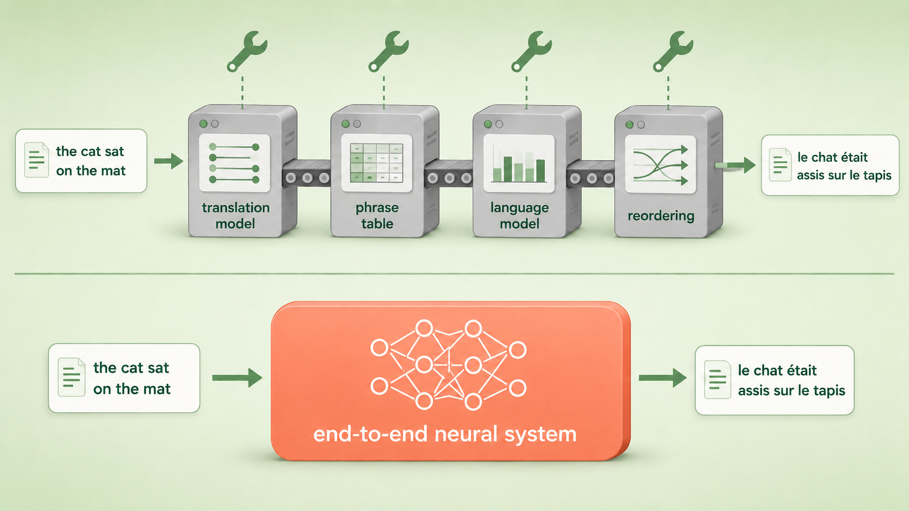
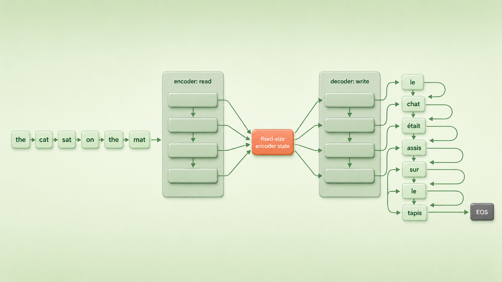
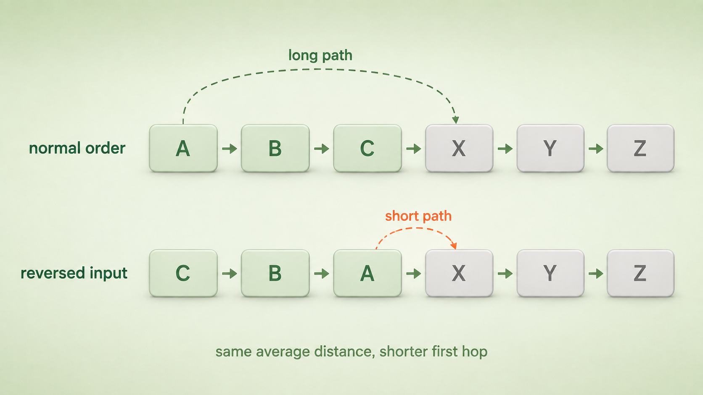
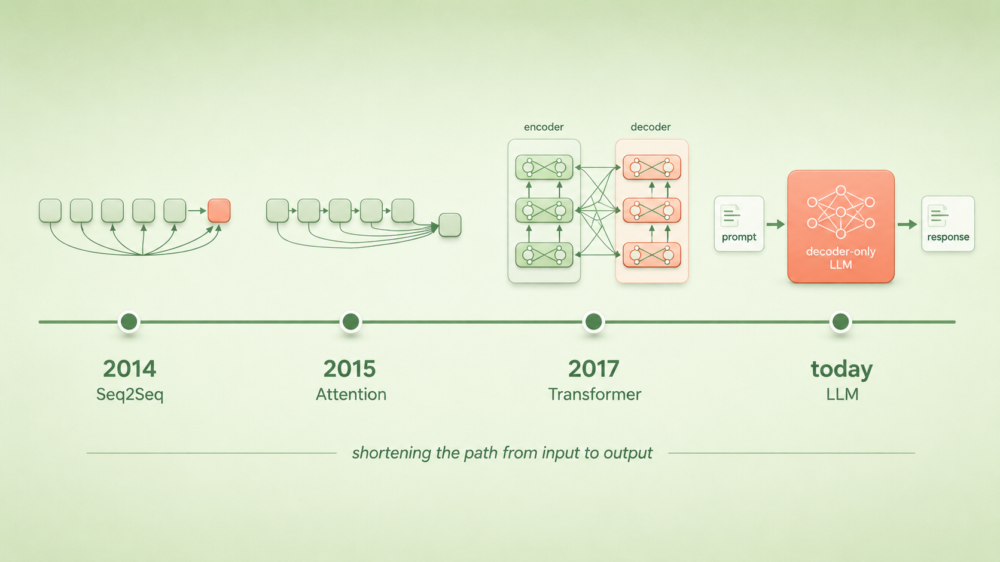

+++
title = "论文里程碑 #14：Sequence to Sequence Learning with Neural Networks"
description = "两个 LSTM，一个读一个写，机器翻译第一次不再需要人拼流水线。"
date = 2026-08-09
tags = ["LLM", "论文里程碑", "Seq2Seq", "LSTM", "机器翻译", "Encoder-Decoder", "Sutskever"]
categories = ["LLM"]
series = ["论文里程碑"]
showTableOfContents = true
+++



> 两个 LSTM，一个读一个写，机器翻译第一次不再需要人拼流水线。

## 一、2014 年秋天，一套没有短语表的系统赢了

那时候机器翻译的工业标准是短语式统计机器翻译（phrase-based SMT）：一套由词对齐、短语表、语言模型、调序模型和一堆调好权重的特征拼起来的流水线。它是十几年集体工程的结晶，线上跑的翻译服务背后基本都是它。想让它变好，方式是往里加特征、调权重、扩语料——每一步提升都对应着某个工程师坐下来设计了点什么。

然后 Google 的三个人挂出一篇论文，标题平铺直叙：*Sequence to Sequence Learning with Neural Networks*。里面没有短语表，没有对齐模型，没有调序规则。只有 LSTM：一个负责读英文，一个负责写法文。

在 WMT'14 英法翻译的完整测试集上，这套东西拿到 34.8 BLEU（五个模型集成的成绩）。同一个测试集，那条工业级流水线是 33.3。

这是纯神经系统第一次在大规模翻译任务上正面压过 SMT。

## 二、深度学习当时的一个尴尬前提

到 2014 年，深度神经网络已经在图像和语音上赢麻了。但那时的深度网络有个很少被点破的前提：**输入和输出都得能编码成固定维度的向量。** 一张图是固定尺寸的像素矩阵，分类结果是固定长度的概率分布，这套框架才转得动。

循环网络（RNN）本来就是冲着变长序列去的，可它的舒适区也有边界：**输入和输出的对齐关系已知**时它很好用——逐帧打标签、逐词标词性，一步对一步就行。翻译不满足这个条件。源句和译句长度不同，词与词的对应还经常不是单调的，语序在两种语言之间会整段挪位。你既不知道该输出多少个词，也不知道第几个输出该对着第几个输入。

当时有两种绕法。一种是把序列削成固定维度的问题——开一个固定大小的窗口，或者干脆把句子拍成词袋，代价是把顺序信息丢掉大半，我们在讲 *Natural Language Processing (Almost) from Scratch* 时见过这条路的上限。另一种是把翻译拆成一条流水线，每个模块单独训练：翻译模型管词和短语的对应，语言模型管目标语言说得通不通，调序模型管语序差异——这就是 IBM 那套统计机器翻译路线的现代版本（见《A Statistical Approach to Machine Translation》那篇）。它确实有效，代价是每一次提升都要人去设计新特征。

同年 Cho 等人的 RNN Encoder-Decoder（我们也讲过）已经把神经网络塞进了这条流水线，用它给候选短语打分。但它仍然只是流水线上的一个零件，最终翻译还是 SMT 出的。

真正没人敢下注的问题是：能不能把整条流水线扔掉，让一个网络直接吃进一句英文、吐出一句法文？

*图：上半部分是 SMT 的多模块流水线，每个模块都要人工设计和调参；下半部分是 Seq2Seq 的主张——中间什么都没有*

## 三、核心论文解读

### 3.1 论文说了什么

**变长序列到变长序列的映射，可以由两个 LSTM 端到端学出来，不需要任何关于语言结构的先验。**

WMT'14 英法测试集上，5 个模型集成、beam size 12，BLEU 34.81；同一测试集的 SMT 基线是 33.30。这里得说清楚赢的是哪个数：单模型最好成绩是 30.59，还落后基线两个多点，34.81 是集成之后才拿到的。所以准确的说法不是「一个 LSTM 打赢了 SMT」，而是「一套纯神经的翻译系统第一次压过了成熟的 phrase-based 基线」——2014 年的神经机器翻译离单模型碾压还有距离，但方向已经不容误认。

这个分数还是被扣着分拿到的：模型的目标端词表只有 8 万词，参考译文里但凡出现一个词表外的词，模型就没有可能生成对，BLEU 照扣。带着这个惩罚，它还是赢了。

**一整句话确实可以被压进一个固定大小的状态，而且这个状态是有结构的。**

论文用的是 4 层、每层 1000 个单元的 LSTM，读完一句话之后交给 decoder 的就是这套状态。arXiv 版本里作者顺手算过一笔账：这个深度 LSTM 用 8000 个实数表示一句话（4 层各自的隐状态与记忆单元加起来，正好这么多）。不管这句话是 5 个词还是 50 个词，都是这么多个数。把这些句子表示做 PCA 投影到二维之后可以看到：意思相近的句子聚在一起，把词序换掉的句子会分开，而主动语态改成被动语态之后，表示仍然比较接近。它学到的显然不是词袋。

**长句子没有崩。**

这是当时最反直觉的一条。所有人的预期都是「压成一个定长状态，句子一长就装不下」，同期确实有别的团队在类似模型上报告过长句退化。而这篇的结果是：35 词以内几乎看不出退化，更长的句子也只是缓慢下滑。

还有一个容易被忽略的结果：把训好的 LSTM 拿去给 SMT 系统吐出的 1000 条候选翻译重新打分排序，5 个模型集成能到 36.5，逼近当时该任务的最好成绩 37.0；单个模型重排也有 35.85。神经网络那时还打不过所有人，但已经能给最强的系统当裁判了。

### 3.2 论文怎么做到的

> 你听人讲完一段话，脑子里留下的是「意思」，不是逐字录音。然后你用另一种语言，把这个意思说出来。Seq2Seq 就是把这两件事分给两个网络：一个负责听完，一个负责说出来。

encoder 是一个 LSTM，逐词读入源句；读到最后一个词时，它的状态就代表了这句话的全部——也就是前面说的那 8000 个实数。decoder 是另一个 LSTM，拿这个状态当起点，一个词一个词地往外写。

写成条件概率是这样：

$$
p(y_1, \dots, y_{T'} \mid x_1, \dots, x_T) = \prod_{t=1}^{T'} p(y_t \mid v,\, y_1, \dots, y_{t-1})
$$

翻译成大白话：\(v\) 就是 encoder 读完整句之后留下的那个状态；decoder 每写一个词，依据只有两样东西——这个 v，以及它自己已经写出来的部分。整句翻译的概率，就是逐词概率连乘起来。

这个式子和我们在 LLM 主线开篇讲的链式法则是同一个东西，只是多挂了一个条件 v。今天的 LLM 把 v 换成了「提示词的全部 token」，这层概率结构没变过。

式子里的 \(y_1, \dots, y_{t-1}\) 在训练和推理时来路不同，这一点必须分清：**推理**时它们是模型自己刚写出来的词，一步接一步，错了也得将错就错；**训练**时它们直接从参考译文里抄——写第 t 个词时，前面那些词一律用标准答案填上。这叫 teacher forcing，好处是每个时间步都能拿到一份直接的监督信号，不必等模型先把前面写对；代价是训练时它见到的历史永远完美，推理时却要面对自己写歪的历史。不过这时候还是 LSTM，时间步之间仍然得一格一格串行地算——要到 Transformer 把循环换掉、用 causal mask 挡住未来，整段序列的训练计算才真正并行起来。这个取舍连同它的代价，一起传到了今天的 LLM 预训练里。

*图：左边读进去、中间压成一个固定大小的状态、右边一个词一个词写出来，直到 EOS*

几个设计上真正起作用的点：

**用一个终止符让模型自己决定什么时候停。** 输出长度不需要事先指定，模型写到该结束的时候输出 `<EOS>`。变长输出的问题就这么解决了——朴素得几乎不像个设计，但这是整套东西能成立的前提。

**encoder 和 decoder 用两套独立参数。** 论文的原话是：这样做增加了模型参数量，而计算成本的增加可以忽略。换来的是两边各自适应「读」和「写」这两件不一样的事。

**深度是有用的。** 4 层的 LSTM 明显好过单层，论文里每加一层，困惑度大约降 10%。

**然后是那个著名的反直觉技巧：把源句倒着输进去。**

不是把意思倒过来，是字面上反转词序——`the cat sat on the mat` 变成 `mat the on sat cat the` 输进 encoder，目标句照常顺序输出。就这一下，测试困惑度从 5.8 掉到 4.7，BLEU 从 25.9 涨到 30.6。四个多点，比大多数架构改动都值钱。

为什么有用？论文的解释是「最小时间滞后」（minimal time lag）。把 encoder 和 decoder 的处理过程摊平成一条时间轴：正常顺序下，源句的第一个词和目标句的第一个词——它俩的对应关系通常最紧密——中间隔着整个源句的长度，梯度得跨过这么多步才能把它们联系起来。反转之后，源句开头被挪到了紧挨着目标句开头的位置，头几个词之间出现了短程依赖，优化器很容易先把这一段学对，后面的对应关系再顺着往下建立。

*图：平均距离没变，变短的是「最小距离」——第一对词之间从隔着整句变成紧挨着*

注意这里的分寸：反转并没有让平均距离变短——前面近了，后面就远了。变短的只是「最小距离」。所以它不是什么语言学洞见，纯粹是优化层面的把戏。

但这个把戏的效果本身是个信号。不反转的 LSTM 也能训出来，只是停在 25.9；一个这么廉价的数据变换就换来四个多点，说明当时压着模型的重要瓶颈之一，是长程依赖带来的优化困难——信息要走的路径太长，梯度就很难把远处的对应关系建立起来。它并没有让那个固定状态装得更多，只是让信息更容易被学进去。后来的几项关键设计都在回答同一个问题，只是各自缩短的方向不同：attention 在序列方向上给出跨位置的直接访问路径，残差连接在深度方向上给信息和梯度开一条直通车。它们不是同一个机制，但共享同一个诊断——**让信息少走点路。**

解码用的是 left-to-right beam search（beam search 本身在 phrase-based SMT 的解码器里早就是标配，这篇是把它用在了神经序列生成上），论文里有个很实际的发现：beam 开到 2 就拿到了绝大部分收益，开到 12 也只多零点几个 BLEU。

顺便记一下 2014 年训练这种模型的工程现实：8 块 GPU 跑十天，把长度相近的句子塞进同一个 minibatch 换来两倍加速，梯度范数超过 5 就整体缩回去。这些今天大多已经变成框架里现成的配置项，当时都得自己动手。

## 四、它改变了什么

**短期：它把 encoder-decoder 从一个想法变成了工业级的证据。**

真正的分水岭不是谁先想到 encoder-decoder——同期至少有三家在做类似的事——而是 Seq2Seq 在完整测试集上压过 SMT 基线这个结果，它让整个领域相信这条路线值得押注。之后两年是神经机器翻译的爆发期：attention 成为标配，2016 年 Google 开始在 Google Translate 上部署 GNMT，首批覆盖 8 个语言对，此后逐步取代原来的 phrase-based 系统。

**长期：它给出了一个模板——任何「A 变成 B」的任务，都可以写成序列到序列。**

对话（问句→答句）、摘要（长文→短文）、语音识别（音频帧→文字）、图像描述（把 encoder 换成 CNN）、代码生成，全都能套这个框架。今天我们对着 LLM 输入 prompt、等它输出 response，继承的正是这套概率分解：给定上下文，自回归地把输出一个个吐出来。至于结构，GPT、LLaMA 这类模型已经是 decoder-only——prompt 和 response 是同一条因果 token 序列，由同一个 Transformer 栈处理，不再显式分成编码和解码两半。

**它同时留下了一个非常明确的问题：那个固定大小的状态。**

不管句子多长，都压进同样大小的状态——这是整个设计里最漂亮、也最脆的地方。反转输入缓解的是优化困难，并没有把这个容量限制本身挪走，句子越长它越藏不住。破解它的工作几乎是同时出现的：Bahdanau 等人在 2014 年 9 月挂出注意力机制，让 decoder 在写每个词时回头看整个输入序列，而不是只盯着 encoder 交出来的那一个状态——Seq2Seq 这篇论文里就已经引用了它当时的分数（28.45，那会儿还落后）。三年后 Transformer 再往前推一步：它保留了 encoder-decoder 的骨架，也保留了连接两端的 cross-attention，被换掉的是 encoder 和 decoder **内部**的循环计算——encoder 里任意两个位置一步就能互相看到，decoder 里每个位置也能一步看到此前的所有位置，不必再沿着那条循环链一格一格往下传。

这条链条是从 Seq2Seq 这里启动的：固定状态的 Seq2Seq → 加了 attention 的 Seq2Seq → Transformer 的 encoder-decoder → 今天的 decoder-only 大模型。

*图：四个节点，一条主线——每一次改动都在缩短信息要走的路*

**我认为这篇论文最被低估的贡献，其实不是 encoder-decoder 架构本身。**

架构这件事同期好几家都在做。真正稀缺的是它给出的那个态度：不给模型任何关于语言的结构假设——没有句法树、没有对齐、没有短语表——只给足够的容量、足够的数据，和一条能训得动的优化路径，结果就压过了十几年的人工特征工程。论文结论里那句判断说得很直白：一个大的深度 LSTM，哪怕词表有限，也能在大规模翻译任务上超过词表无限的标准 SMT 系统。今天回头看，这大概是「规模与简单架构胜过精巧领域知识」这套信仰，第一次在 NLP 上拿到硬证据。

## 五、与主线的接口

**如果你想深入……**

这篇论文的核心概念对应我们 LLM 系列的「Transformer 架构：训练视角 vs 推理视角」章节：

- **[#21] 推理是串行的：Prefill 与 Decode 的两阶段** — 「先把整段输入处理完，再逐 token 往外写」这个计算形态今天还在用，只是 decoder-only 模型的两个阶段跑在同一个网络里，靠 KV cache 而不是靠一个固定状态来传递上下文
- **[#19] 训练是并行的：Teacher Forcing 与 Causal Mask** — 3.2 里那个训练/推理的区别就是 teacher forcing；而它为什么到了 Transformer 才换来整段并行、曝光偏差又留下什么后果，是那一篇的正题
- **[#1] 语言模型到底在建模什么：序列概率与链式法则** — 3.2 里那个连乘公式，去掉条件 v 就是今天 LLM 的训练目标
- **[#6] 采样策略拆解：Greedy / Beam / Top-k / Top-p** — 这篇论文用的 beam search，为什么在今天的开放生成里反而被换掉了

读完这些，你对 Seq2Seq 的理解会从「一个古早的翻译架构」变成「今天推理链路上每一步的来历」。

## 六、读完之后

读这篇之前，Seq2Seq 大概是教科书里一个已经被淘汰的名字：两个 LSTM，先被 attention 取代，再被 Transformer 取代。

读完之后应该换一个看法：被淘汰的是 LSTM 这个零件，被改写的是编码和解码的组织方式，但那条流程还在——把上下文读完、自回归地一个个往外吐、用一个终止符决定什么时候停。你现在每次和 LLM 对话，跑的还是这三步。Seq2Seq 定下的是范式，不是实现。

它还留下了一个很典型的教训：当一个奇怪的技巧（比如把输入倒过来）能带来那么大的提升时，那个技巧通常正指着真正的瓶颈。

**下一篇**：同样是 2014 年，同样在处理序列，Yoon Kim 却选了完全相反的方向。Seq2Seq 拼命让模型记住跨越整句的顺序依赖，而 *Convolutional Neural Networks for Sentence Classification* 问的是：如果不去建模那种长距离的递归依赖，只用卷积核抓局部的 n-gram 模式呢？一个只有一层卷积、简单到能写在一页纸上的模型，在多个文本分类任务上打赢了当时一堆精心设计的系统。下一篇我们讲 TextCNN——以及它比 Transformer 早三年就展示过的那个诱惑：放弃递归，换来并行。

## 七、参考资料

- 论文原文：[Sequence to Sequence Learning with Neural Networks](https://arxiv.org/abs/1409.3215)（arXiv:1409.3215，NeurIPS 2014）
- 作者：Ilya Sutskever, Oriol Vinyals, Quoc V. Le（Google）
- 延伸阅读：
    - [Learning Phrase Representations using RNN Encoder-Decoder for Statistical Machine Translation](https://arxiv.org/abs/1406.1078)（Cho et al., 2014）——同年的另一半答案，我们在 #4 讲过
    - [Neural Machine Translation by Jointly Learning to Align and Translate](https://arxiv.org/abs/1409.0473)（Bahdanau et al., 2015）——直接对准固定状态瓶颈动手
    - [Google's Neural Machine Translation System](https://arxiv.org/abs/1609.08144)（Wu et al., 2016）——这条路线的工业落地
