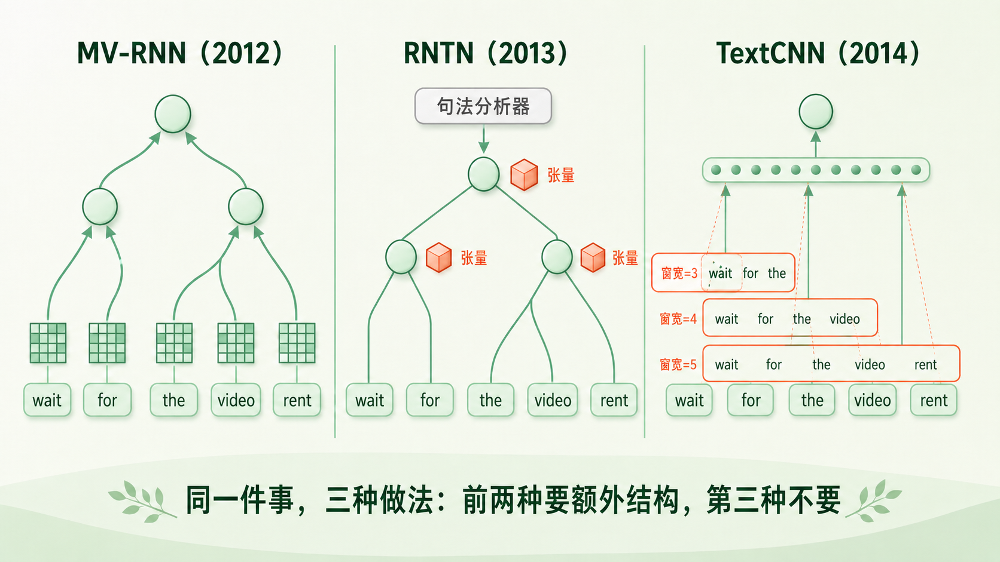
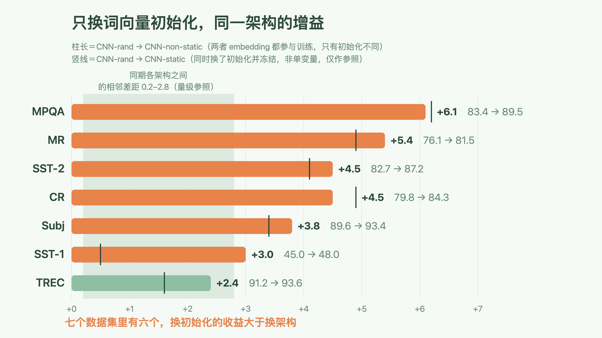
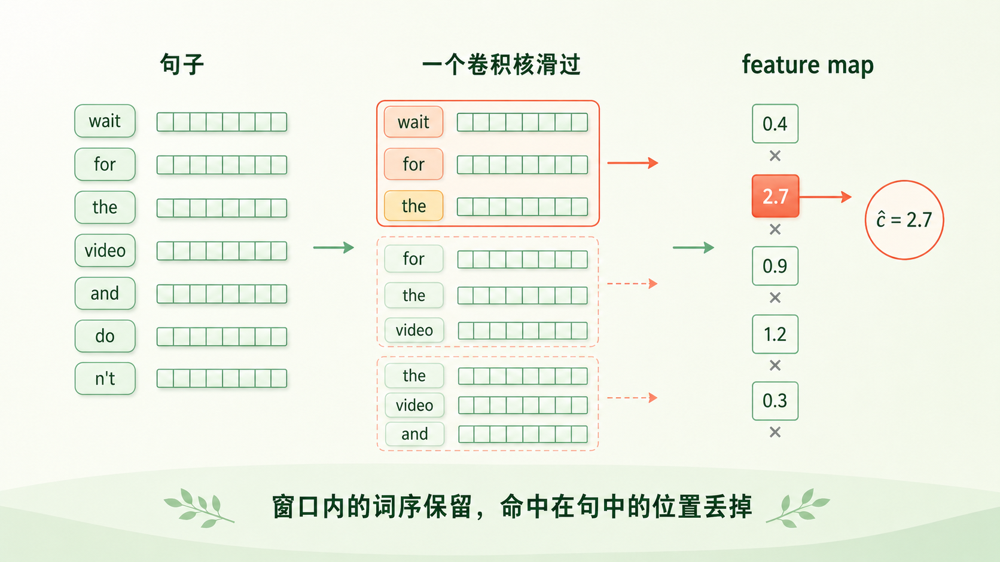
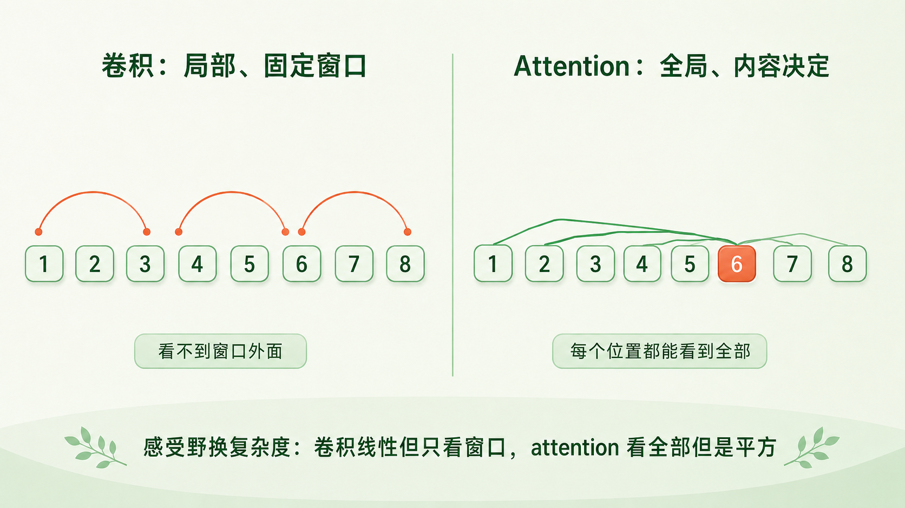

+++
title = "论文里程碑 #15：Convolutional Neural Networks for Sentence Classification"
description = "2014 年，一个只有一层卷积的模型，把「分数到底从哪来」这件事摆到了桌面上。"
date = 2026-08-16
tags = ["LLM", "论文里程碑", "TextCNN", "CNN", "文本分类", "词向量", "Kim"]
categories = ["LLM"]
series = ["论文里程碑"]
showTableOfContents = true
+++



> 2014 年，一个只有一层卷积的模型，把「分数到底从哪来」这件事摆到了桌面上。

## 一、六页纸，一个作者

2014 年 8 月底，一篇六页的短论文挂上 arXiv。作者栏只有一个名字：Yoon Kim，纽约大学。致谢里第一个感谢的人是 Yann LeCun——十六年前把卷积网络用在手写数字上的那位。

论文做的事，放在当时有点冒犯。那一年整个领域正在比谁的组合函数更精巧：有人给词表里每个词额外配一个矩阵，有人要先跑句法分析器再沿树递归，有人设计了随句长变化的池化。而 Kim 用的是一层卷积——一层，加一次取最大值，再接一个 softmax。超参数只在一个数据集上搜过一遍，然后原样套给其余六个。

结果是七个任务里四个刷新了当时的最好成绩。

论文标题是 *Convolutional Neural Networks for Sentence Classification*。它后来被叫作 TextCNN，成了此后近十年文本分类的默认起点。

## 二、从词到句子，那一步当时怎么走

到 2013 年年底，词这一级已经有了称手的工具。Word2Vec 让高质量的静态词向量变得便宜，随便谁都能下载一份来用——这不等于词表示这个问题被解决了（上下文相关的表示、子词切分、一词多义，后面每一样都还要单独打一仗），但至少「拿到一份能用的词向量」不再是门槛。

真正卡住的是下一步：一句话十几二十个词，每个词现在都是一个 300 维向量，怎么把它们变成一个能拿去分类的东西？

当时的主流答案是往复杂里走。递归神经张量网络要先用句法分析器把句子解析成一棵树，再沿树自底向上合并，每合一次过一个三阶张量；它的前辈 MV-RNN 更狠，给词表里每个词都额外配一个 \(d \times d\) 矩阵；同期的 DCNN 走的是另一条线，它已经不要句法树了，但在池化上做足了文章，设计了随句长变化的 k-max 池化。

方向很一致：既然「组合」是难点，那就把组合函数做得更有表达力。

这条路有它的代价。要树，就得先有分析器，而分析器切错了边界，错误会顺着树一路传到根节点；树的形状还每句话都不一样，一个 batch 里凑不出整齐的矩阵运算。要给每个词配矩阵，词表侧的参数量就从 \(O(|V|d)\) 涨到 \(O(|V|d^2)\)。DCNN 没有前两者的树结构包袱，可它的动态池化和多层结构，比后来的 TextCNN 仍然重出一大截。

> 2014 年真正没人系统问过的问题不是「组合能不能做得更精巧」，而是：这些精巧到底贡献了多少分。

*图：同一件事的三种做法——前两种都要额外结构，第三种不要*

## 三、论文做了什么

### 3.1 三个论点

**第一，把一句话编码成定长向量，一层卷积加一次取最大值就够了。**

模型总共三步：查词向量、一层卷积、一次 max pooling，然后 softmax。窗宽取 3、4、5 三种，每种 100 个卷积核，一共 300 个数构成句子表示。激活用 ReLU，dropout 0.5，batch 大小 50，优化器 Adadelta。

正则化那一项值得写准确：论文不是把 L2 惩罚项加进 loss，而是在 dropout 所在的那一层之后，对输出层的权重向量做 max-norm 约束——每步梯度下降之后检查一次，只要 \(\|w\|_2\) 超过 3 就把它整体缩放回 3。是一道硬上限，不是一个软惩罚。

这套超参数是在 SST-2 的验证集上网格搜出来的，然后原样用到全部七个数据集，除早停之外不做任何针对性调整。所以「几乎不调参」要这么理解：是不逐数据集调，不是完全没调。

成绩上，MR 81.5%、SST-2 88.1%、CR 85.0%、MPQA 89.6%，这四个超过了当时表上的最好结果。另外三个没有：SST-1 上 48.0%，输给 Paragraph-Vec 的 48.7%；Subj 上 93.4%，输给多项式朴素贝叶斯的 93.6%；TREC 上 93.6%，输给一个用了词性、上位词和 60 条手写规则的 SVM 的 95.0%。

口径上还要补一句：这四项 SOTA 是在四个模型变体里各取最好的那个报出来的——MR 上最好的是 CNN-non-static，SST-2 和 CR 上是 CNN-multichannel，MPQA 上是 CNN-static。论文没有为这种「多变体取最大」做任何校正，严格说会让 SOTA 的数目略微乐观。

四个变体的差别只在词向量怎么处理，网络部分完全一样。这张表后面反复要用，尤其是「初始化方式」和「是否更新」这**两列要分开看**：

| 变体 | 词向量初始化 | 训练中是否更新 |
| --- | --- | --- |
| CNN-rand | 随机 | 更新 |
| CNN-static | word2vec 预训练 | 冻结（含未登录词） |
| CNN-non-static | word2vec 预训练 | 更新（微调） |
| CNN-multichannel | word2vec 预训练，两份 | 一份冻结、一份更新 |

**第二，也是全文真正的发现：在同一个架构里，把随机初始化换成预训练词向量，增益大到超出当时所有人的预期。**

要量这件事，得先挑对那组对照。最常被引用的是 CNN-rand 对 CNN-static，可看一眼上面的表就知道，这两者之间**同时变了两件事**：初始化方式变了，embedding 从「参与训练」变成了「冻结」。拿它当「只换初始化」的证据并不成立。

干净的单变量对照是 **CNN-rand 对 CNN-non-static**——两者的 embedding 都参与训练，唯一的区别就是起点是随机的还是 word2vec 的。论文还特意把 CNN 参数初始化、未登录词初始化、交叉验证的折分配这些随机因素在同一数据集内固定住了。

*图：柱长是干净的单变量对照（rand → non-static，两者 embedding 都训练）；竖线是常被引用的 rand → static，它同时换了初始化并冻结，只能作量级参照*

这组干净对照给出的增益是：MPQA +6.1、MR +5.4、SST-2 +4.5、CR +4.5、Subj +3.8、SST-1 +3.0、TREC +2.4。七个数据集里有六个，换初始化的收益超过了同期各架构彼此之间的差距——在 SST-1 那一列上，RAE、MV-RNN、RNTN、DCNN、Paragraph-Vec 这五个跨了三年的架构排下来，相邻两个之间只差 0.2 到 2.8 个点。

这个比较只能当**量级参照**，不能当严格结论：一边是同一数据集内同一架构的增益，另一边是跨模型的绝对分数差，两者不在同一个坐标系里。它说明的是「量级上，换初始化这一下不比换架构小」，不是「初始化比架构更重要」这种可检验的命题。

顺着这组对照还能读出第二件事：**冻结的预训练向量已经几乎把收益榨干了。** 把 CNN-static 也放进来比，它在七个数据集里五个都紧贴着 CNN-non-static，MPQA（89.6 对 89.5）和 CR（84.7 对 84.3）上冻结版甚至更高一点。解冻带来的额外收益，只有 SST-1 上那 2.5 个点算得上明显。也就是说，主要的价值在**那份向量本身**，不在「允许它继续被这个任务改造」。

而这组数字管得住的范围也就到这里为止：它证明了预训练初始化在这个架构里贡献巨大，没有证明架构不重要。同一篇论文里就摆着反例——Kalchbrenner 那篇的 Max-TDNN，Kim 说它「本质上和我们的单通道模型是同一个架构」，同样用随机初始化的词向量，SST-1 上只有 37.4%，而 CNN-rand 是 45.0%，差了 7.6 个点。Kim 把这个差距归给自己的模型容量更大：多种窗宽、更多 feature map。7.6 个点比这里任何一个换初始化的增益都大。

这个归因是 Kim 跨着两篇论文的两套实现给出的，不是一次受控消融，所以精度有限。但方向足够清楚：两个杠杆都在，而当时整个领域几乎只在扳其中一个。论文自己的结论措辞也很克制——预训练词向量是深度学习做 NLP 的「一个重要成分（an important ingredient）」，不是唯一原因。

**第三，「通用」这个词要打个折。**

论文的措辞是预训练向量像是「通用（universal）的特征提取器」。但同一篇论文里还有一句：作者试过 Collobert 那套在维基百科上训练的 SENNA 向量，效果差很多，而且「不清楚这是因为架构不同，还是因为那 1000 亿词的 Google News 语料」。

所以准确的说法是：**当时那一份**特定的词向量很好用。至于好在哪、能不能复制，论文自己没有答案。这个问号会一直挂到下一篇。

**关于多通道，论文自己认输了。**

作者原本设计了一个双通道结构：两份都用 word2vec 初始化的词向量，一份冻住、一份微调，每个卷积核同时作用于两者。想法是让微调后的向量不至于跑得离原始值太远，从而抑制过拟合，在小数据集上尤其该有用。

结果是混合的：SST-2 和 CR 上它确实是最好的变体，其余五个数据集上不如单通道。论文的原话是「结果是混合的，需要进一步研究如何正则化微调过程」，并顺手提了个替代方案——与其加一个通道，不如在单通道里留出一部分维度允许被改。

一篇论文愿意把自己主打的那个「简单修改」写成「没成，原因待查」，这份诚实值得记一笔。

### 3.2 它是怎么做到的

先说清楚卷积在文本上到底是什么。

在图像里，卷积核是一个在二维平面上滑动的小方块。搬到句子上，句子被摆成一个 \(n \times k\) 的矩阵（\(n\) 个词，每个词 \(k\) 维），而卷积核的宽度被钉死为整个 \(k\)——它不在词向量内部横着滑，只沿句子纵向滑。所以文本卷积实际上是一维的：一个 \(h\) 个词宽的窗口，从句首滑到句尾。

> 想象你拿着一张只开了三个词宽的纸板，从句首往句尾一格一格地挪，每挪一格就给窗口里看到的那三个词打一个分。分数高，说明这三个词的组合正是你在找的那种模式。

形式化写出来就是一行：

$$
c_i = f\!\left( w \cdot x_{i:i+h-1} + b \right)
$$

\(x_{i:i+h-1}\) 是第 \(i\) 到第 \(i+h-1\) 个词向量首尾拼起来的长向量，\(w\) 是同样长度的卷积核，\(f\) 是非线性激活。窗口从头滑到尾，得到一串分数 \(c=[c_1,\dots,c_{n-h+1}]\)，论文管它叫 feature map。

翻成大白话：**一个卷积核就是一个可学习的 n-gram 探测器。** 传统词袋模型也用 n-gram，但那是把每个 n-gram 当成一个独立的离散特征，「非常好」和「特别好」是两个毫不相干的东西。卷积核作用在词向量上，两个语义相近的三词组合会拿到相近的分数——n-gram 从字符串匹配变成了语义匹配。这就是「预训练词向量在起作用」的具体机制。

这里还藏着一个容易被误读的细节：\(w\) 是一个长度为 \(hk\) 的向量，窗口里第一个词、第二个词、第三个词各自对应它的一段，权重互不相同。也就是说，**窗口内部的词序是被结构性地编码进去的**——「not very good」和「good very not」落在同一个卷积核上会得到不同的分数。

接下来是这个模型最关键、也最容易被略过的一步：**max-over-time pooling**。整条 feature map 只保留最大值，其余全部丢掉。

$$
\hat{c} = \max\{c_1, c_2, \dots, c_{n-h+1}\}
$$

一整条 feature map 塌成一个数。这一步干了三件事。

第一，它让输出维度不再依赖句长。不管句子是 5 个词还是 50 个词，每个卷积核都只交出一个数，300 个核就是 300 维，后面接一个固定形状的分类层就行。这不等于「不用 padding」——论文写得很清楚，句子是「必要时补齐（padded where necessary）」的，短于最大窗宽的句子必须补，实际按 batch 计算时也照样要对齐。被解决的是「句向量维度随句长变化」这个问题，不是补齐这个动作本身。

第二，它选出的是「这个模式在整句话里最强的一次出现」。做情感分类，一句影评里只要出现过一次足够强的贬义搭配，结论大概就定了；至于它出现在第几个词，通常不重要。

第三——这是代价——**位置信息被丢掉了一部分，但不是全部。** 分三层看更清楚：窗口内部的词序，前面说过，卷积核的槽位结构把它保住了；模式出现在句中的**绝对位置**，被 max 抹掉了，模型只知道「强度 2.7」，不知道在句首还是句尾；不同卷积核各自的最强命中之间**谁先谁后**，同样无从表示，因为每个核只交出一个孤零零的数。

这个取舍和后来的做法可以对照着看，不过要分清情形。不带任何位置机制的**双向** self-attention 对输入排列是等变的，打乱词序输出只跟着换位置——原始 Transformer 正是因此加了位置编码。而 LLM 用的**因果** self-attention 不太一样：causal mask 本身就打破了排列对称性（第 \(i\) 个位置只能看到自己左边），已经有工作发现不加任何显式位置编码的因果语言模型照样能学出位置信息、语言建模效果也有竞争力。饶是如此，现代 LLM 仍然普遍配 RoPE 这类显式机制，因为隐式信号在长度外推等场景上不够用。

放在一起看：TextCNN 靠卷积核的槽位结构**免费拿到局部词序**，再主动扔掉全局位置；Transformer 这边则要为位置**专门做一次设计**，具体做成什么样，是后面一整篇的事。

*图：一个卷积核滑过整句，只留下它最强的那一次命中——窗口内的词序还在，命中的位置没了*

还有一处容易被略过：整个模型的参数其实几乎全在词向量表里。按论文给的超参数、以 MR 的单通道配置算一笔账——

卷积层的权重是 \((3+4+5) \times 300 \times 100\)，也就是 36 万个，加上偏置和分类层，网络部分一共约 36.1 万；而 MR 的词表有 18,765 个词，光词向量表就是 18,765 × 300 ≈ 563 万个参数。两者相加约 599 万，**其中约 94% 坐在 embedding 表里**，网络部分只占 6%。

再往下拆一层。这 18,765 个词里只有 16,448 个能在 word2vec 里查到，剩下约 12% 是随机初始化的。所以**真正「从别人那儿下载来」的参数约占整个模型的 82%**，不是 94%。而在 CNN-static 里，整张 embedding 表全程冻结——论文写明连那些没查到、随机初始化的词也一起冻住——所以模型真正在更新的，只有那 6% 的网络参数。

这个比例是跟着词表大小走的，别拿 MR 这一个数去套七个数据集：词表最大的 Subj（21,323 词）只有约 5.3% 的参数可训练，而词表最小的 CR（5,340 词）能到约 18.4%。但结论的方向在七个数据集上是一致的——模型自己那部分始终是小头。

说「模型很简单」是准确的。更准确的说法是：这个模型绝大部分的重量不在它自己身上，而且在 static 那个变体里，最重的那一块它连动都不动。

**关于微调，论文给了全文最漂亮的一段证据。**

CNN-non-static 允许词向量在训练中被更新。更新之后发生了什么，论文列了一张最近邻表。

在原始的 word2vec 里，`bad` 的最近邻是 `good`。这不是 bug——两个词的句法角色几乎完全一样，出现的上下文高度重合，分布式假设下它们本来就该挨得很近。但对情感分类来说，这是最糟糕的一种邻近。在 SST-2 上微调之后，`bad` 的邻居变成了 `terrible`、`horrible`、`lousy`、`stupid`；`good` 的邻居里 `bad` 消失了，换成了 `nice`、`decent`、`solid`。

更有意思的是那些根本不在 word2vec 词表里的 token。前面算过，MR 的词表里约 12% 的词是随机初始化的，缩写 `n't` 就是其中之一。它随机初始化时的最近邻是 `os`、`ca`、`ireland`、`wo`，全是噪声；在 SST-2 上微调之后，邻居变成了 `not`、`never`、`nothing`、`neither`。感叹号学到了它和溢美之词同现，逗号学到了它是连接性的。

任务监督让一个本来没有表示的 token，凭空长出了一个语义上讲得通的位置。

这里要克制一下：`n't` 学会了和其他否定词聚在一起，不等于模型学会了处理否定。当否定词和它作用的对象距离超过卷积窗口，**没有任何单个卷积特征能直接建模这两者的组合关系**——分类层也许能分别看到「这里有个否定词」和「那里有个褒义搭配」两个特征，但表示不了谁否定了谁、否定的作用范围到哪为止。上一代用句法树处理的正是这件事，而 TextCNN 干脆没有回答它。

**最后，dropout 在这篇论文里的角色比看上去重。** 作者的说法是：dropout 好用到可以直接把网络造得比需要的更大，然后让 dropout 去收拾；它稳定地带来 2% 到 4% 的相对提升。刚讲完的那个正则化方法，在这里正是「敢用一个容量过剩的模型」的前提。

## 四、它改变了什么

短期影响是工程上的。TextCNN 很快成了文本分类的默认基线——不是因为它最强，而是因为它在「效果 / 实现成本」这条曲线上位置太好：几十行代码，一块普通显卡几分钟训完，推理时整句一次算完，没有循环。此后很多年，一个新方法要证明自己，得先在 TextCNN 上赢一次。

但它真正的长期意义不在 CNN 上。

**第一层遗产：让一条已经存在的路线变得无法忽视。**

「先在无标注数据上学表示，再用少量标注数据接任务」这条路线，不是从 TextCNN 开始的。Kim 自己在引言里就写明，用无监督模型预训练词向量再喂给监督任务，在当时**已经是常见做法**，他引的是 Collobert 2011、Socher 2011 这些工作——Collobert 那篇正是我们这条子线的前一站，TextCNN 的架构本身也是它的一个变体。论文结尾的措辞同样克制：我们的结果**为已经确立的证据再添一笔**，说明词向量的无监督预训练是深度学习做 NLP 的一个重要成分。

TextCNN 的贡献是把这件事**演示得无可辩驳**。此前这是个分散在多篇论文里的经验共识，Kim 用一个简单到没什么可辩护的架构、一组只动一个变量的对照，把增益的幅度直接摆了出来。他还点破了跨领域的类比：引用同年 Razavian 等人在计算机视觉上的工作，那篇文章证明从预训练模型里拿出来的特征在各种没见过的任务上都好用——两个领域在同一年撞上了同一个发现。

也要说清楚，TextCNN 的「微调」和今天的微调不是一回事。它微调的只是词向量表，上面那层网络仍然从随机初始化开始训；而 ELMo、GPT、BERT 之后，被预训练的是整个编码器，微调动的是全部参数。中间隔着的东西不少——上下文相关的表示、更大的模型、更大的语料。

**第二层遗产：一个关于并行的存在性证明。**

RNN 处理句子必须一步一步来，第 \(t\) 步要等第 \(t-1\) 步的隐状态；树结构更糟，每句话的计算图形状都不一样。卷积没有这个问题——每个窗口的计算互不依赖，整句话可以一次算完，max pooling 也是一次归约。

在 Transformer 出现之前三年，TextCNN 就已经说明：建模一个句子并不必须依赖沿时间的递归。这个方向后来被认真推进过——2017 年 5 月的 ConvS2S 用堆叠卷积做机器翻译，靠层数把感受野撑大，比 *Attention Is All You Need* 早了一个月。

卷积没赢，原因也很具体。一层卷积的感受野被窗宽锁死在 3 到 5 个词，要看得更远只能堆层数，感受野随深度线性增长；attention 一层就让每个位置看到所有位置，代价是复杂度对序列长度变成平方。这是一笔交换，不是一边倒的碾压——直到今天，长序列场景下还有人把这笔账重新算一遍。

*图：一个是固定窗口的局部连接，一个是内容决定的全局连接——感受野换复杂度*

**第三层，是一个方法论上的提醒。**

这篇论文最有价值的部分不是模型，是它把变量拆开量了一遍这个动作。它示范的不是「架构不重要」——上面那 7.6 个点已经说明架构很重要——而是一件更基本的事：**分数涨了，先去问增益是从哪一处来的，别默认它来自你刚改的那个地方。**

那一年大多数论文换了架构、也换了词向量、还换了训练数据，然后把提升整个记在架构头上。这个问题在后来的十年里反复出现，答案也常常是同一种形状——数据、规模、预训练往往比结构改动更能解释分数。

顺带说一句：这把尺子也得量到论文自己头上。它最常被引用的那组 rand / static 对照，恰恰同时动了初始化和冻结两件事，不是单变量；真正干净的是 rand / non-static。一个专门讲「别把增益归错地方」的实验，自己也留了一处归因的口子，这大概是这篇论文最值得学的一课。

至于证据强度，同样按这把尺子量。它报的是七个数据集的单次结果，没有方差、没有多次运行、没有显著性检验；其中四个数据集用的是 10 折交叉验证，另外三个有固定划分。像 SST-2 上 88.1% 对 Paragraph-Vec 87.8% 这样 0.3 个点的领先，本身撑不起「更好」这个结论。核心的那组 rand / non-static 对照结实得多——六个数据集上 3 个点以上的差距、方向一致——但它同样只是单次结果。

还有一处口径值得留意：SST-1 和 SST-2 这两列，Kim 是在对应训练划分的**短语和句子上一起训练、只在句子上测试**的，训练样本量因此比表 1 列出的句子数大一个数量级（SST 全库的短语标注共 215,154 条，Kim 用到的是其中训练划分那部分）。所以 TextCNN 在 SST 上的成绩，有一部分要记在上一代 SST 的账上。

这批格外密集的监督**或许**也解释了 SST-1 的两处异常：它是七个数据集里唯一一个解冻词向量还能多拿 2.5 个点的（其余六个在 −0.4 到 +0.8 之间），而它的 rand → static 增益又低得离谱，只有 0.5 个点。标注多到一定程度，模型有本钱把词向量按任务重塑一遍，冻结的代价就显出来了。这个解释说得通，但论文没有做任何验证，我们也无从判断它对不对——摆在这里当假设，不当结论。

方向清楚，精度有限。这是那个年代大量实证论文的共同状态。

## 五、与主线的接口

**如果你想深入……**

这篇论文的核心概念对应我们 LLM 系列的「Transformer 架构：训练视角 vs 推理视角」章节：

- [#19] 训练是并行的：Teacher Forcing 与 Causal Mask — 「整段一次算完」的前提是位置维上没有递归，卷积是这个性质在 Transformer 之前的版本；causal mask 顺带给因果模型带来的隐式顺序信号也在这一篇
- [#20] Attention 在算什么：Q/K/V、Softmax 与 O(N^2) — 卷积是固定窗口的局部聚合（线性，但感受野被窗宽锁死），attention 是内容决定的全局聚合（全局感受野，但复杂度变平方），这笔交换在这里第一次显形

表示那一半，对应「表示与分词：Token、Embedding、位置」章节：

- [#13] Embedding 查表：离散 ID 到连续语义的惊险一跃 — 用预训练词向量做初始化，就是今天 embedding 层的直系祖先；本篇那笔「参数绝大多数在 embedding 表里」的账也在这一篇有更完整的版本
- [#14] 几何直觉：向量空间中的类比、距离与各向异性 — `bad` 的最近邻是 `good`，这是「向量相似 ≠ 语义同义」最经典的一个样本
- [#16] 位置编码进化史：从正弦波到 RoPE 旋转位置编码 — TextCNN 靠卷积核槽位免费拿到局部词序、用 max pooling 扔掉全局位置；Transformer 这边位置该怎么补、补多少、隐式够不够用，是那一篇的正题

读完这些，你对 TextCNN 的理解会从历史印象变成可操作的工程认知。

## 六、收尾：那份词向量到底好在哪

读之前，你可能觉得这是一篇「CNN 也能做 NLP」的论文。读完之后，希望你看到的是另一件事：一次关于归因的实验。同一个网络、embedding 同样参与训练，只把起点从随机换成 word2vec，分数就动了 2 到 6 个点；而同样用随机词向量，换一个容量更大的卷积结构，SST-1 上又能动 7.6 个点。两个杠杆都在，当时的领域几乎只在扳其中一个。

这篇论文最诚实的地方，是它没有把这份功劳整个留给自己——它说自己只是给一条已经存在的证据链再添了一笔。

但它也留下了一个没答完的问题。Kim 试过另一套在维基百科上训练的词向量，效果差很多，他说不清是因为训练架构不同，还是因为 word2vec 吃的是 1000 亿词的 Google News。整篇论文都建立在「手上有一份好词向量」这个前提上，而这份词向量为什么好，它没有回答。

下一篇我们回到词向量本身，看 *GloVe: Global Vectors for Word Representation*。它和 Word2Vec 几乎同时出现，走的却是相反的路：不靠一个个滑动窗口去做预测，而是把整个语料的词-词共现统计一次性摊开，直接对那张巨大的共现矩阵下手。两条路最后殊途同归——而 GloVe 的贡献之一，正是把「为什么会同归」这件事讲清楚了。

## 七、参考资料

**论文原文**

- Kim, Y. (2014). *Convolutional Neural Networks for Sentence Classification*. EMNLP 2014, Doha, Qatar, pp. 1746–1751. [aclanthology.org/D14-1181](https://aclanthology.org/D14-1181/)　｜　arXiv 版（v2, 2014-09-03，本文引用的脚注与讨论以此版为准）：[arxiv.org/abs/1408.5882](https://arxiv.org/abs/1408.5882)

**延伸阅读**

- Collobert, R., Weston, J., Bottou, L., Karlen, M., Kavukcuoglu, K., & Kuksa, P. (2011). *Natural Language Processing (Almost) from Scratch*. JMLR 12: 2493–2537. — TextCNN 架构的直接前身，max-over-time pooling 就出自这里，「预训练表示 + 轻量任务头」这条路线也是它先走的。[jmlr.org/papers/v12/collobert11a.html](https://www.jmlr.org/papers/v12/collobert11a.html)
- Kalchbrenner, N., Grefenstette, E., & Blunsom, P. (2014). *A Convolutional Neural Network for Modelling Sentences*. ACL 2014. — 文中作对照的 DCNN 与 Max-TDNN 出自这里，也是「架构容量同样值好几个点」那笔账的来源。[aclanthology.org/P14-1062](https://aclanthology.org/P14-1062/)
- Zhang, Y., & Wallace, B. (2015). *A Sensitivity Analysis of (and Practitioners' Guide to) Convolutional Neural Networks for Sentence Classification*. — 把 TextCNN 的每个超参数逐一做了消融，正好补上这篇论文缺失的那部分实验。[arxiv.org/abs/1510.03820](https://arxiv.org/abs/1510.03820)
- Haviv, A., Ram, O., Press, O., Izsak, P., & Levy, O. (2022). *Transformer Language Models without Positional Encodings Still Learn Positional Information*. — 因果语言模型不加显式位置编码也能学到位置信息，本文第 3.2 节那条「causal mask 自带隐式顺序信号」的依据。[arxiv.org/abs/2203.16634](https://arxiv.org/abs/2203.16634)
- Gehring, J., Auli, M., Grangier, D., Yarats, D., & Dauphin, Y. N. (2017). *Convolutional Sequence to Sequence Learning*. ICML 2017. — 卷积路线在序列任务上最强的一次尝试，比 *Attention Is All You Need* 早一个月挂上 arXiv。[arxiv.org/abs/1705.03122](https://arxiv.org/abs/1705.03122)
