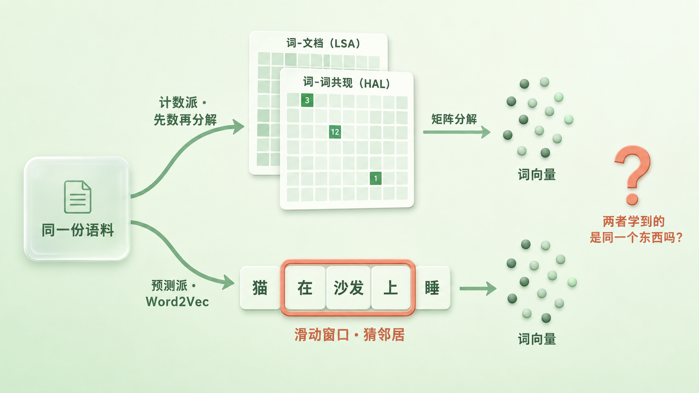
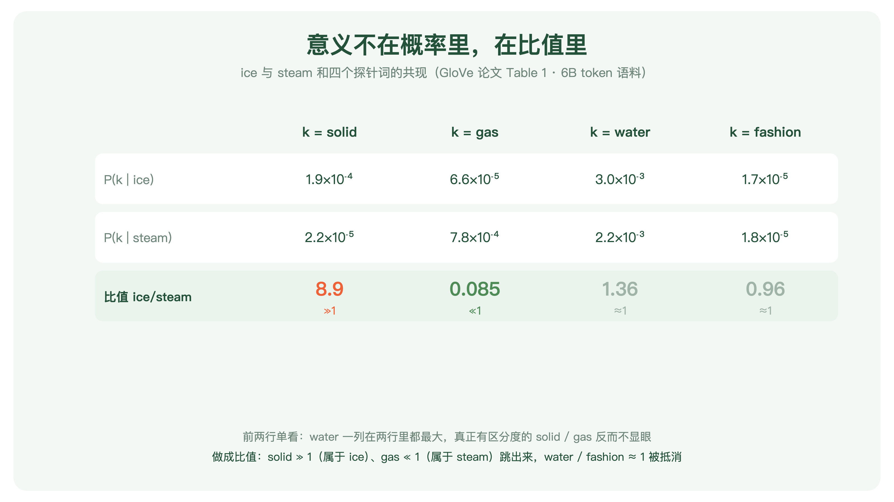
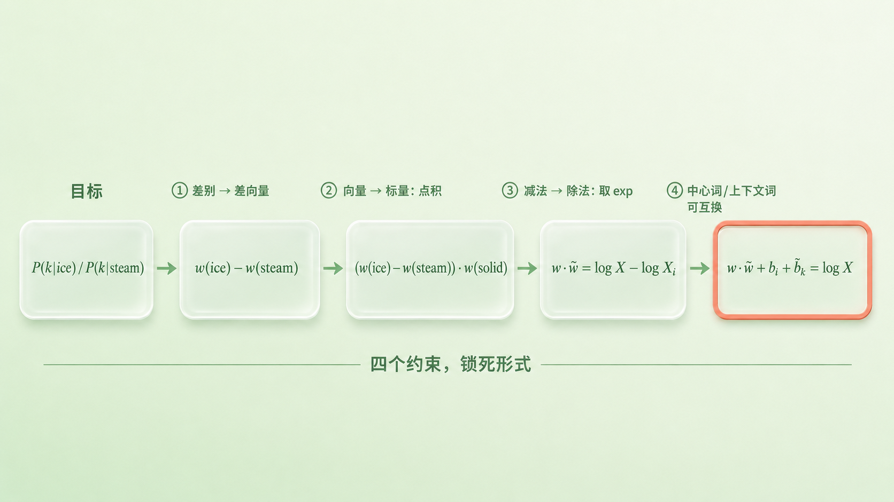
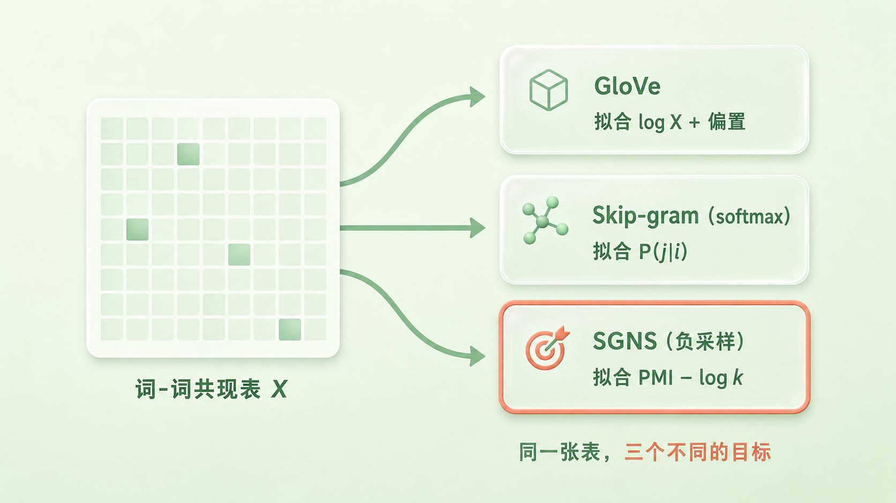

+++
title = "论文里程碑 #16：GloVe: Global Vectors for Word Representation"
description = "单个共现概率看不出的语义差别，两个概率的比值能露出来——GloVe 把这个观察一路推成了目标函数。"
date = 2026-08-23
tags = ["LLM", "论文里程碑", "GloVe", "词向量", "Word2Vec", "共现矩阵", "Pennington"]
categories = ["LLM"]
series = ["论文里程碑"]
showTableOfContents = true
+++



> 单个共现概率看不出的语义差别，两个概率的比值能露出来——GloVe 把这个观察一路推成了目标函数。

## 一、2014 年，两个阵营

2014 年的词向量领域，正站在一场路线之争的中间。

一边是老派：从上世纪九十年代的 LSA 算起，这一派的做法是**数数**——先把整个语料扫一遍攒出一张全局统计矩阵，再用矩阵分解把它压成低维向量。矩阵具体怎么搭有不同流派：LSA 数的是「词-文档」，每个词记录它在哪些文档里出现过；HAL 那一路数的是「词-词」，直接记录两个词一起出现过多少次。GloVe 后面要接的是后一张表。另一边是新贵：Word2Vec 刚火了一年，它不数总账，而是拿一个滑动窗口在语料上一路**预测**过去，向量是预测游戏的副产品。

新贵的势头压倒性。那年 ACL 上有一篇论文，标题起得像战书：*Don't count, predict!*——系统对比了两派方法，结论是预测派全面胜出。计数派几十年的家底，看起来要被一个浅浅的神经网络扫进故纸堆了。

就在同一年的 EMNLP 上，斯坦福 NLP 组交出了另一份答卷。论文叫 *GloVe: Global Vectors for Word Representation*。它没有站队，而是问了一个两派都没答上来的问题：**词向量里那些神奇的规律——king − man + woman ≈ queen——到底是从语料的什么性质里长出来的？**

回答完这个问题，路线之争本身就消解了。

## 二、时代背景：赢家说不出自己为什么赢

先把两派各自的难处摆出来。

计数派的问题是「数得全，用不好」。词-词共现矩阵确实装下了整个语料的全局统计——任何两个词一起出现过多少次，一查便知。但把这张表直接分解出来的向量，在词类比这类任务上表现很差：几个超高频词（the、and 这些）的计数大到离谱，把分解结果整个带偏了。全局信息在手，却提炼不出几何规律。

预测派的问题正好相反：「用得好，说不清」。我们在 Word2Vec 那两篇（发布第 10、11 篇）里讲过，Skip-gram 只做一件事——看着一个词猜它的邻居，语义规律就自己长出来了，类比任务上一骑绝尘。但它训练时从头到尾没有显式构造、也没有直接操作那张全局共现表：滑动窗口一次只看一小段，同一对词在语料里共现了一百万次，它就要在扫语料时撞见一百万回、每回都当新鲜事重新学一遍。更要命的是没人说得清它为什么好——目标函数里写的是「预测邻居」，学出来的却是「语义几何」，中间那一步是黑盒。

> 这就像两个学生。一个把全年级的成绩单都抄下来了，却总结不出规律；另一个天天跟同学聊天、考试成绩很好，你问他怎么学的，他说不知道。

2014 年真正悬着的问题不是「谁的分数高」，而是：**这些向量学到的到底是什么？既然两派用的是同一份语料，它们学到的会不会根本是同一个东西？**

*图：同一份语料的两种用法。上路（计数派）：先扫语料攒出一张全局统计矩阵——LSA 数词-文档，HAL 这一路数词-词——再做矩阵分解得到向量；下路（预测派）：滑动窗口一路扫过去，每一步做一次「猜邻居」，向量是副产品。GloVe 之前，没人说清这两条路的产物有什么关系*

## 三、论文做了什么

### 3.1 三个论点

三个论点，一个比一个大。

**第一，比起共现概率本身，两个共现概率的比值更适合当建模的出发点。** 单独看「solid 在 ice 附近出现的概率」，你读不出多少东西；但拿它除以「solid 在 steam 附近出现的概率」，一个 8.9 倍的比值立刻告诉你：solid 这个属性属于 ice、不属于 steam。比值消掉了一部分与区分无关的成分，让某些语义关系直接浮到表面。论文把它当作词向量学习的**起点**——注意是起点不是终点：最终训练时最小化的并不是「比值误差」，而是从这个要求一路推导出来的另一个式子，3.3 会走完这条路。

**第二，从这个原理出发，可以直接推导出一个显式的目标函数：让词向量的点积去拟合共现次数的对数，用加权最小二乘去训。** 训出来的向量叫 GloVe（Global Vectors）。证据是当时最难的词类比任务：在 420 亿 token 的语料上训 300 维向量，总准确率 75.0%——论文对比表里的最好成绩。

**第三，「预测」和「计数」并不是两个世界。** 论文把 Skip-gram 逐窗口的训练目标在数学上摊开、按词对合并同类项，发现它隐含的全局目标同样由共现次数 \(X_{ij}\) 加权——一个纯粹的局部预测模型，写成全局形式后依赖的还是那张共现表。论文自己的措辞很克制：两个目标「有某种形式上的相似」。这不等于它们拟合同一个东西（3.4 会把差别摆清楚），但足以说明 *Don't count, predict!* 那场争论的前提有问题：预测派并没有绕开全局统计。

### 3.2 意义藏在比值里

从一个具体例子进去。拿两个词：ice（冰）和 steam（蒸汽）。它们的差别在哪？你我都知道——一个是固体，一个是气体。但怎么让「数数」数出这个差别？

论文的做法是找一批探针词 k，去查两个条件概率：k 出现在 ice 附近的概率 \(P(k \mid \text{ice})\)，和出现在 steam 附近的概率 \(P(k \mid \text{steam})\)。这里的「附近」有具体口径——论文用左右各十个词的窗口，而且离得越远算得越轻：相隔 d 个词的一对，只往计数里加 \(1/d\)。所以后文说的「共现次数」严格讲是这样加权出来的计数，不是简单的出现次数。

单看概率，结果很让人泄气。在 60 亿 token 的语料上，ice 附近出现概率最大的探针词是 water——steam 附近也是 water。真正有区分度的 solid 和 gas，概率反而小一个量级，淹没在里面。原因不难想：water 和两个词都相关，出场自然多；概率的绝对大小混杂了「这个词本身常不常见」「和两边是不是都沾边」这些不相干的因素。

**除一下，噪声就消掉了。** 把两个概率做成比值 \(P(k \mid \text{ice}) / P(k \mid \text{steam})\)：solid 的比值是 8.9——远大于 1，它属于 ice 那一边；gas 是 0.085——远小于 1，属于 steam；而 water 是 1.36、fashion 是 0.96——都贴着 1，前者因为和两边都相关、后者因为和两边都无关，分子分母里相同的成分被除法抵消了。

*图：论文 Table 1 的四个探针词。前两行是原始条件概率——water 在两行里都最大，有区分度的 solid/gas 反而不显眼；第三行做成比值，solid ≫ 1、gas ≪ 1 立刻跳出，water 和 fashion ≈ 1 被抵消。数值取自论文原文*

> 比值就像做菜时的对照组：一勺盐撒进清水里咸得发苦，撒进一锅汤里刚刚好——单看「一勺盐」说明不了什么，得看它相对什么而言。词的意义也一样：solid 本身出现多少次不重要，重要的是它在 ice 身边比在 steam 身边多出现多少倍。

这就是 GloVe 的出发点：**要让向量的结构能够编码共现概率的比值，而不是去拟合单个共现概率。**

### 3.3 从比值推出目标函数

原理有了，怎么变成可以训练的东西？这一段是论文最漂亮的部分——不是「设计」出一个模型，而是像解方程一样把模型**推导**出来。

我们想要的是：三个词 i、j、k 的向量之间的某种运算，等于比值 \(P_{ik}/P_{jk}\)。约束一条条加上去。第一，比值刻画的是「i 和 j 的差别」，而向量空间里表达差别最自然的东西是**差向量** \(w_i - w_j\)——king − man 那条类比线索早就暗示了这一点。第二，等号左边是向量、右边是标量，最不破坏线性结构的压缩方式是**点积**。第三——最关键的一步——比值有个特点：交换 i 和 j，比值变成倒数。要让向量运算跟着有这个性质，就要求这个函数把「向量的减法」翻译成「概率的除法」，而能把加减法翻译成乘除法的只有指数这一族。于是解出来的形式取完对数就是：一个词的向量和另一个词的向量做点积，等于共现概率的对数 \(\log P_{ik} = \log X_{ik} - \log X_i\)。

到这里还差最后一步，而这一步正好解释了公式里为什么会冒出两个多余的项。**在共现矩阵里，「谁是中心词、谁是上下文词」这个区分是人为的**——把矩阵转置、两套向量互换角色，描述的还是同一份语料，模型理应跟着对称。可上面那个式子不对称：右边挂着一个 \(\log X_i\)，只跟 i 有关、跟 k 无关。解法很朴素：既然它只跟 i 有关，就把它并进一个属于 i 的常数项 \(b_i\)；再给 k 也配一个 \(\tilde{b}_k\)，两边就平权了。这两个偏置不是为了好看加上去的，它们是对称性要求的产物。

$$
w_i^\top \tilde{w}_k + b_i + \tilde{b}_k = \log X_{ik}
$$

翻译成大白话：**词 i 的向量和词 k 的向量做个点积，再加两个各自的修正项（偏置，把「这个词本身有多常见」那部分影响吸收掉），结果应该等于「i 和 k 共现次数」的对数。** 左边全是要学的参数，右边是从语料里数出来的数。词向量的训练，从「玩一百万轮预测游戏」变成了「拟合一张表」。

但直接拟合有两个坑。第一个坑：这张表里 75% 到 95% 的格子是零——绝大多数词对从没共现过——而零没有对数。第二个坑：低频共现噪声更大，频次高的统计通常更可靠，不能一视同仁；可反过来，「the 和 of 共现了几千万次」这种条目也不该独霸整个训练。

解法是给每个格子配一个权重，把拟合写成加权最小二乘：

$$
J = \sum_{i,j=1}^{V} f(X_{ij}) \left( w_i^\top \tilde{w}_j + b_i + \tilde{b}_j - \log X_{ij} \right)^2
$$

大白话翻译：**对每一对词，看「点积加偏置」和「对数共现次数」差多远，差得越远罚得越重；但每一对的罚款额度先乘一个系数 f——没共现过的直接免罚（零格子根本不参与训练，第一个坑顺带解决），共现次数少的轻罚，次数多的重罚，但涨到某个截断值就封顶，再多也不加罚，不让高频词包场。** 论文给 f 选了个幂函数，截断值取加权计数 100、指数取 3/4，都是试出来的经验值（论文也说了，性能对截断点并不敏感）。有意思的是那个 3/4：Word2Vec 给负采样的词频分布做平滑时，凭经验选的也是 3/4。两边在不同的地方摸到了同一个数。

这套设计还有一笔计算账，得分两段算。**建表那一段跑不掉**：要数出 X，无论如何得把语料完整扫一遍——论文自己的记录是，6B token 的语料配 40 万词表，单线程建表约 85 分钟。这是一次性的前期成本。**建完之后就便宜了**：训练只在非零格子上走，而按论文的估计，非零格子数大约随语料长度的 0.8 次方增长——次线性，比「随语料规模线性增长」慢。这个 0.8 不是普适定律，它建立在论文观察到的一个经验假设上：词对共现次数按频率排名呈幂律、指数约 1.25。所以「全局统计一定更贵」这个印象并不成立：前期一次扫描换来的是一张可以反复训练、反复调参的表。

还有一个实现上的细节，任何人下载 GloVe 或者自己实现时都会撞见：模型训练出来的是**两套**向量——中心词那套 W 和上下文词那套 W̃。共现矩阵对称时这两套在数学上是等价的，差别只来自随机初始化。论文最后取的是两者之和 W + W̃ 当最终词向量，理由是「训多份再合并」通常能压掉一点噪声，实测也确实有小幅提升，语义类比那一项涨得最多。

*图：GloVe 的推导链，四个约束一步步锁死形式。①差别用差向量承载；②向量到标量用点积压缩；③减法要翻译成除法 → 函数只能是指数，取对数后得到 w·w̃ = log X − log Xᵢ；④中心词与上下文词可以互换角色 → 那个只跟 i 有关的 log Xᵢ 被吸收成偏置 bᵢ，再给 k 补一个 b̃ₖ 使两边平权。终点：点积 + 两个偏置 = log(共现次数)*

### 3.4 「预测」和「计数」离得有多近

推导做完，论文还回头干了一件事：把 Skip-gram 的目标函数摊开看。

Skip-gram 训练时是一个窗口一个窗口地过，但把所有窗口的损失加总、按「词对」合并同类项，会得到一个等价的全局目标——每一对词 (i, j) 的损失，乘上它们的共现次数 \(X_{ij}\)；整理完是一个按词频加权的交叉熵。**一个从头到尾只做局部预测的模型，写成全局形式之后，权重恰好是那张共现表。** 论文对此的措辞很克制：这个目标与 GloVe 的目标「有某种形式上的相似」。

相似不等于相同。从这个交叉熵形式走到 GloVe，论文自己还改了好几刀：换掉交叉熵、去掉 softmax 的归一化、改成在对数空间做最小二乘、重新设计加权函数。每一刀都是实打实的改动，不是换个记法。

更要紧的是，真正流行的 Word2Vec 并不是上面这个 full-softmax 版本，而是负采样版（SGNS）——它连那个交叉熵形式都不是。Levy 和 Goldberg 同年证明了：SGNS 隐式分解的是一张**移位的 PMI（点互信息）矩阵**，即 \(w_i^\top \tilde{w}_j \approx \text{PMI}(i,j) - \log k\)（k 是负样本个数）。这和 GloVe 拟合的「带偏置的对数共现次数」是两个不同的目标。

所以准确的说法是这样：

> 三种方法拟合的目标各不相同——GloVe 对准带偏置的 \(\log X_{ij}\)，full-softmax Skip-gram 对准条件概率 \(P(j \mid i)\)，SGNS 对准移位后的 PMI。但它们全都可以写成「关于共现统计的某个函数」，谁也没有真的绕开共现统计。

这就是 GloVe 那一节真正的贡献：它没有证明两派是一回事，而是把「预测派其实也在用全局统计」这件事摆到了明面上，让**目标函数**成为讨论的对象。争论的焦点从此不再是「该数数还是该预测」，而是「你在拟合共现统计的哪一个变换、用什么损失、怎么加权」——这是个能算清楚的问题。

*图：同一张词-词共现表，三种取法。GloVe 显式拟合 log X + 偏置；full-softmax Skip-gram 的全局形式是按 X 加权的交叉熵、对准条件概率 P(j|i)；SGNS 则隐式分解移位 PMI。共同点是都建立在这张表上，差别在于对准的是它的哪一个变换*

## 四、它改变了什么

**短期，词向量市场变成了双寡头。** GloVe 项目放出了训练好的现成向量——用 60 亿、420 亿乃至 8400 亿 token 语料训好、打包成文件、下载即用。此后几年，NLP 论文的实验设置里「用 GloVe 还是 Word2Vec 初始化」成了和「学习率设多少」并列的常规选项，问答、推理、分类模型的输入层里到处是 glove.840B.300d 这个文件名。上一篇 TextCNN 靠一份预训练词向量把七个任务打了个遍——那类「拿来就用」的玩法，GloVe 把它变得更顺手了。

**但「GloVe 更强」这个实验结论，输得比想象中难看。** 论文的对比实验里，GloVe 在整体成绩和多数指标上占优（并非每一项都第一——6B 语料那一档，句法类比就有 CBOW 略高于它），可 2015 年 Levy、Goldberg 和 Dagan 做了一次受控重测：同一份语料、超参数逐项对齐、每种方法都允许调到自己最好的状态。结果反了过来——**SGNS（负采样版 Skip-gram）在他们测的每一项任务上都赢过 GloVe**，论文原话就是「SGNS outperforms GloVe in every task」。差距的来源他们也拆了：原对比里超参没放开、只评了 Google 一套类比集而没评 MSR 的、各方法用的语料也不完全相同。

同一篇论文还顺手把 *Don't count, predict!* 那个结论也推翻了：超参对齐之后，预测派对计数派并没有稳定优势——两派谁也不是全局赢家。回头看，那张对比表是 GloVe 这篇论文最经不起时间考验的部分。

**真正站住的是那个显式化的视角。** 在 GloVe 之前，词向量是炼金术——大家知道 Word2Vec 好用，说不清为什么；在它之后，至少有一个模型把话说明白了：**它拟合的就是带偏置的对数共现次数**，训练目标写在纸面上，没有黑盒。上一篇结尾我们留了个问号——那一份词向量为什么好用——GloVe 给出了答案的一半：它好用，是因为语料的共现统计里本来就藏着可用的语义结构，训练是把它挖出来的过程。

同一年 Levy 和 Goldberg 从另一头补上了另一半：SGNS 隐式分解的是移位 PMI 矩阵。两项工作合起来，让「这些向量到底在拟合什么」从悬案变成了可以逐个写出来的目标函数——哪怕答案是「三个不同的目标」，也比「不知道」前进了一大步。

我认为，这是 GloVe 作为论文最持久的贡献：它未必给了你更好的向量，但它给了你**把问题写成目标函数的习惯**。至于静态词向量本身——无论 GloVe 还是 Word2Vec，一个词永远只有一个向量，一词多义无解——它们在 NLP 主线上的黄昏，随 2018 年的 ELMo 和 BERT 一起到来。（作为工具倒还没退休：2025 年 7 月，斯坦福那边还放出了用 2024 年语料重训的一批新向量——Dolma 2200 亿 token、120 万词表那一档，配套报告叫 *A New Pair of GloVes*。）

更长久的是那条底层线索：**语义可以从「什么和什么一起出现」里学出来**。今天 LLM 的 embedding 依然吃这份信号，但要说清楚差别——它不再是先数好一张表再去分解，而是作为深层 Transformer 的一部分，被 next-token prediction 这一个目标端到端地带出来。没有哪张显式的共现矩阵摆在那里，也就谈不上「把窗口放大到整个上下文的 GloVe」。共用的是那条分布式假设，不是同一套做法。

## 五、与主线的接口

**如果你想深入……**

这篇论文的核心概念对应我们 LLM 系列的「表示与分词：Token、Embedding、位置」章节：

- [#13] Embedding 查表：离散 ID 到连续语义的惊险一跃 — 讲了「词变向量」这件事在今天 LLM 里的形态；GloVe 那张「点积拟合共现」的账，是这张查找表的史前史
- [#14] 几何直觉：向量空间中的类比、距离与各向异性 — 讲了 king − man + woman ≈ queen 这类类比的几何原理与失效边界；GloVe 的推导（差向量承载差别、点积压缩成标量）正是这套几何直觉的理论化版本

读完这些，你对 GloVe 的理解会从历史印象变成可操作的工程认知。

## 六、收尾

读这篇之前，「计数 vs 预测」看起来是词向量的路线之争，Word2Vec 是打败了传统方法的新范式；读完你会知道，**两派最终都可以还原到词-上下文共现统计上，只是各自对准了它的不同变换**——GloVe 拟合带偏置的对数共现，SGNS 拟合移位 PMI。真正被换掉的不是答案，而是问题：从「该数数还是该预测」变成了「你在拟合什么、用什么损失、怎么加权」。至于那些神奇的几何规律，源头是共现概率的比值这个观察。

词这一级，故事到这里就齐了：怎么学（Word2Vec、GloVe）、为什么有效（比值、共现结构）、怎么用（TextCNN 拿它做分类）。但序列那一级还欠着一笔账。我们在 Seq2Seq 那篇（发布第 14 篇）见过：整句话被编码器压进一个固定长度的向量，句子一长，这个瓶颈就把信息挤丢了。2015 年，一篇论文让解码器不再依赖那一个向量，而是在生成每个词时**回头去看**输入句子里所有位置、自己学会该看哪——对齐和翻译，第一次被放进同一个网络里端到端地学。注意力机制就此登场，通往 Transformer 的门被推开了一条缝。下一篇，*Neural Machine Translation by Jointly Learning to Align and Translate*。

## 七、参考资料

- Pennington, J., Socher, R., & Manning, C. D. (2014). *GloVe: Global Vectors for Word Representation*. EMNLP 2014. 论文：[https://aclanthology.org/D14-1162/](https://aclanthology.org/D14-1162/) 。预训练向量下载：[https://nlp.stanford.edu/projects/glove/](https://nlp.stanford.edu/projects/glove/)
- Baroni, M., Dinu, G., & Kruszewski, G. (2014). *Don't count, predict! A systematic comparison of context-counting vs. context-predicting semantic vectors*. ACL 2014.（本篇开头那场「路线之争」的战书）
- Levy, O., & Goldberg, Y. (2014). *Neural Word Embedding as Implicit Matrix Factorization*. NeurIPS 2014.（证明 SGNS 隐式分解移位 PMI 矩阵：w·w̃ ≈ PMI − log k，与 GloVe 拟合的 log 共现是两个不同目标）
- Levy, O., Goldberg, Y., & Dagan, I. (2015). *Improving Distributional Similarity with Lessons Learned from Word Embeddings*. TACL 3:211-225.（超参对齐后的受控重测：SGNS 在所测每一项任务上均优于 GloVe；同时指出预测派对计数派并无稳定优势）
- Carlson, R., Bauer, J., & Manning, C. D. (2025). *A New Pair of GloVes*.（2024 年语料重训的新向量与训练细节报告）
