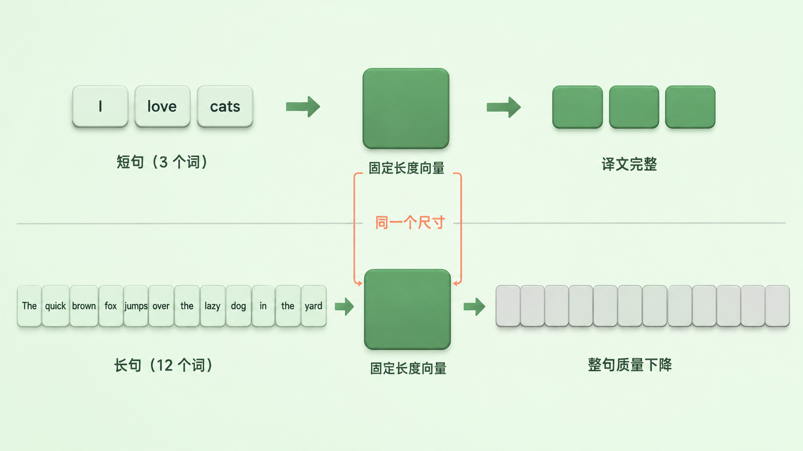
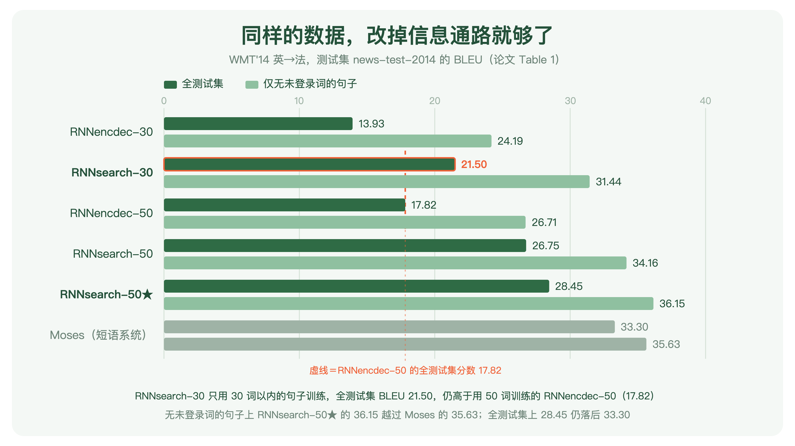
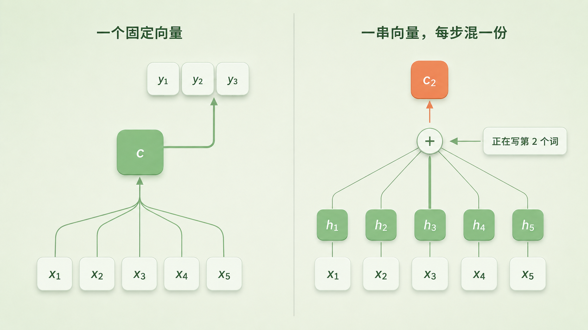
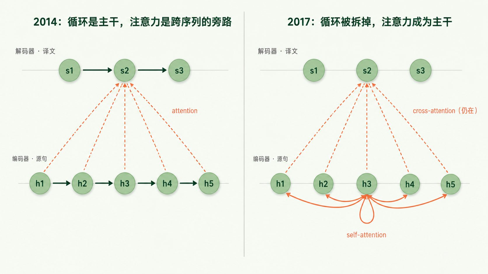

+++
title = "论文里程碑 #17：Neural Machine Translation by Jointly Learning to Align and Translate"
description = "让解码器每写一个词就回头重看整句原文——对齐从流水线上单独的一站，变成了网络里可微的一层。"
date = 2026-08-30
tags = ["LLM", "论文里程碑", "Attention", "Bahdanau", "机器翻译", "Seq2Seq", "对齐"]
categories = ["LLM"]
series = ["论文里程碑"]
showTableOfContents = true
+++



> 让解码器每写一个词就回头重看整句原文——对齐从流水线上单独的一站，变成了网络里可微的一层。

## 一、那个词在论文里只出现了三次

2014 年 9 月 1 日，arXiv 上挂出一篇机器翻译论文。标题里没有「注意力」：*Neural Machine Translation by Jointly Learning to Align and Translate*——神经机器翻译：联合学习对齐与翻译。摘要里也没有，那里用的说法是「软搜索」（soft-search）。

整篇论文里，attention 一共出现三次，全挤在第 3 节中间的同一段，用来给一组下标符号做直觉说明：直觉上，这在解码器里实现了一种注意力机制。

那是一句顺手打的比方。而这篇论文提出的那套机制，后来成了整个领域的默认组件。至于「注意力」这个叫法究竟是谁先用的、这篇又该分到多少发明权，第四节再算。

## 二、时代背景：一个装不下长句子的向量

2014 年是神经机器翻译爆发的一年。这条路线本身更早就有人走——本文引言里把 Kalchbrenner 与 Blunsom 2013 列在最前面——但真正把它推上台面的是这一年的两篇。6 月和 9 月，两组人先后把几乎相同的骨架挂上 arXiv（我们在发布第 9 篇和第 14 篇讲过）：一个编码器把整句源文读完，压成一个固定长度的向量；一个解码器拿着这个向量，一个词一个词地写出译文。

这个设计的吸引力在于干净。此前的短语系统（phrase-based SMT）是一串各自调参的子系统——短语表、语言模型、调序模型、对齐模型——拼在一起，动一个模块要担心会不会打乱下游。现在只剩一个网络、一个目标函数。

但它有一处写死的假设：不管源句是三个词还是五十个词，交给解码器的都是同样大小的那一个向量。

> 像一种严苛版的同声传译：先把整段听完，笔记只准记在一张固定尺寸的便签上，然后原文收走，凭便签开口。三个词的句子，便签绰绰有余；五十个词的句子，便签还是那么大。

论文对这件事的措辞值得原样搬过来：**我们猜想**（we conjecture），使用固定长度向量是这套基础架构继续变好的一个瓶颈。是猜想，不是结论——摘要里一次、实验分析里一次、结论里一次，作者三次都用了这个词。

猜想不是凭空来的。同一批人在那年另一篇论文里量过曲线：基础 encoder-decoder 的表现随源句变长急剧下滑。但「长句难翻」这件事当时至少有两个嫌疑人，容量只是其中一个。另一个是循环网络本身的长程依赖与优化困难——Seq2Seq 那篇把源句倒着输入，什么容量都没动，光靠缩短第一批词到译文开头的路径就换来四个多点。两个嫌疑人当时都还在场，这篇论文要做的是把矛头对准前一个，并拿出证据。

还有一条线索藏在被扔掉的东西里。**对齐**在统计机器翻译里是一个独立而成熟的模块：源句的哪个词对应译文的哪个词，靠 EM 把它当隐变量估出来，估完再拿去抽短语表。神经翻译一上来把这一整套扔了——反正一切都压在那个向量里，模型不需要知道谁对谁。

于是 2014 年的局面是：新范式干净漂亮，却撞着一个说不清有多硬的上限；旧范式笨重，手里却攥着一样新范式主动放弃的东西。

顺便记一个巧合：本篇挂上 arXiv，比 Seq2Seq 那篇还早九天。瓶颈和它的解药，几乎是同时被写下来的。

*图：不管源句多长，编码器交给解码器的都是同一个尺寸的向量。短句够用；长句被塞进同样大小的空间——论文猜想，长句翻不好的一个重要原因就在这里*

## 三、论文做了什么

### 3.1 三个论点

**第一，把整句话挤过一个固定长度的向量，是长句翻不好的一个结构性原因。**

论文给的证据很漂亮：RNNsearch-30——只用 30 词以内的句子训练——在完整测试集上拿到 21.50 BLEU，高于用 50 词以内句子训练的 RNNencdec-50 的 17.82。后者见过更长的句子，仍然输了。更直观的是随句长画出来的曲线：基础 encoder-decoder 随句子变长急剧下滑，而 RNNsearch-50 到 50 词以上仍看不出退化。

这条对照有力，但要说清它证到哪一步。RNNsearch 相对 RNNencdec 同时换了两样东西：编码器从单向变成双向，输出从一个向量变成一串可按需取用的 annotation。所以它证明的是「这一整套改动解开了长句瓶颈」，而不是「瓶颈百分之百长在那一个向量上」。论文自己也停在「我们猜想」这四个字上，没有再往前走。这个分寸值得记住——后面十年，attention 被追认成一件比作者当时敢说的大得多的事。

*图：论文 Table 1 的六个系统。深色是完整测试集，浅色是只算不含未登录词的句子。虚线标的是 RNNencdec-50 的 17.82——RNNsearch-30 用更短的句子训练，却越过了这条线。数值取自论文原文*

**第二，对齐不必是流水线上单独的一站，它可以是网络里的一层，跟翻译一起学出来。**

训练时没有任何人工对齐标注，也没有为对齐单独设过损失函数。模型看到的只有成对的源句和译文，目标是最大化「给定源句、写出这句参考译文」的对数似然——打分网络的梯度全部来自这一个目标。

但把模型算出的那组权重画成灰度图，得到的对齐符合语言直觉：英译法里 [European Economic Area] 要变成 [zone économique européenne]，形容词和名词整体换序——模型先跳过中间两个词、拿 Area 对出 zone，再一个词一个词往回补完剩下的部分。没有人教过它法语的语序。

**第三，在不含未登录词的句子上，一个单模型已经能和成熟的短语系统打平。**

这个子集上，训练得最久的那个模型拿到 36.15 BLEU，Moses 是 35.63——而 Moses 还额外吃了一份 4.18 亿词的单语语料，这边只用了双语平行语料。论文强调的正是「单个模型」这四个字。

把完整测试集算上就是另一幅样子：28.45 对 33.30，落后得很明显——甚至低于我们在发布第 14 篇讲过的 Seq2Seq 单模型的 30.59（那篇靠五模型集成拿到 34.81，已经压过同一条 33.30 的基线）。所以这篇不是「神经翻译第一次赢了 SMT」的那篇，那件事发生在别处。它换来的东西在另一个维度上：长句不再塌。

差距的来源也很清楚：词表只有三万个词，之外的一切都只能落成一个 `[UNK]`。代价不是「每个生僻词扣一分」这么线性——目标侧吐不出正确的词，坏掉的不止那个 unigram，还有所有跨过它的高阶 n-gram 匹配；源侧撞上生僻词，则是输入信息先少了一块。所以论文另外统计了一个子集：源句和参考译文里都不含未知词的那些句子，也就是表里那条浅色的线。论文自己在结论里把「更好地处理未登录词和罕见词」列成留给未来的挑战。这笔账接下来一年被分头还了两次：先是把目标词表本身做大、或者在解码之后把 UNK 替换回去（2014 年秋冬的两篇工作，其中一篇正出自 Bahdanau 同一个实验室），再是 2015 年下半年的 BPE 把它变成一个更彻底的方案——不跟词表大小硬碰硬，直接把词切成子词单元。

### 3.2 怎么做到的：把便签换成摊开的原文

> 不再要求译员背下整段话，而是允许他把原文摊在桌上。每写一个词，抬头扫一眼——这一眼不是只盯住某一个词，而是给整句话的每个词分配一份比重，再按比重把它们混成一份「我此刻需要的上下文」。写下一个词时，重新分配一次。

拆成三步。

**第一步：把编码器的输出从「一个向量」改成「一串向量」。**

编码器换成双向 RNN：正着读一遍、倒着读一遍，在每个源词位置把两个方向的隐状态拼起来，得到一个 annotation。它含有整句的信息，但因为 RNN 天然偏重刚读过的输入，重心落在这个词附近。

这里是全篇最本质的改动：源句有多少个词，就有多少个 annotation。**信息通路的宽度不再是常数，它跟着句子一起长。** 后面所有事情都是这一条的推论。

**第二步：每写一个目标词，重新算一份专属的上下文向量。**

$$
c_i = \sum_{j=1}^{T_x} \alpha_{ij} h_j, \qquad \alpha_{ij} = \frac{\exp(e_{ij})}{\sum_{k=1}^{T_x} \exp(e_{ik})}
$$

翻译一下：写第 \(i\) 个目标词时，给每个源词位置一个 0 到 1 之间的比重，一整行加起来等于 1；然后按这组比重，把所有 annotation 混成一份 \(c_i\)。\(i\) 变了，整行比重重算一次。原来那一个上下文向量，现在有多少个目标词就有多少份，每份都是为当下这一步定制的。

**第三步：比重从哪儿来——一个跟翻译一起训练的小网络。**

$$
e_{ij} = v_a^\top \tanh\left(W_a s_{i-1} + U_a h_j\right)
$$

翻译一下：拿解码器写完上一个词之后的状态 \(s_{i-1}\)（相当于「我现在要找什么」），和源句第 \(j\) 个位置的 annotation \(h_j\)（相当于「我这里有什么」），一起送进一个单隐层的小网络，吐出一个分数；分数高，说明这个位置此刻相关。这个网络（论文里隐层 1000 个单元）没有自己的训练目标。

三步串起来，可微性才闭上环：打分 \(e_{ij}\) → 归一化成比重 \(\alpha_{ij}\) → 加权求和成 \(c_i\) → 更新解码器状态 \(s_i\) → 算出这一步的词分布 \(p(y_i \mid y_{\lt i}, x)\) → 落进那一个负对数似然。每一环都可导，所以「这个词写错了」的梯度能沿着这条链一路退回打分网络，去调整「刚才该多看哪儿」。这就是它凭什么在没有任何对齐标注的情况下，把对齐学了出来。

*图：左边是基础 encoder-decoder——五个源词汇进一个向量 c，整段译文都从它出发。右边是加了注意力之后——五个源词各留下一个向量，写第 2 个目标词时按比重混出一份专属的 c₂，其中第三个位置的线最粗，表示这一步主要在看它*

有四个地方值得单拎出来看。

**① 变的不是「有没有给对齐建模」，是对齐在系统里的身份。**

论文当然给对齐建了模——上面那个 \(a\) 就是一个专门的前馈网络，不是什么都没有。改掉的是它站在哪儿：短语系统把对齐当成离散隐变量，用 EM 单独估出来，估完固定住送进下一个模块；这里它是一个可微的子模块，和翻译共用一个目标、一起被优化。论文写得很直白：这里的对齐**不是**隐变量，模型直接算出一个软对齐，让代价函数的梯度能穿过去。

没有人告诉模型什么是对齐。它是为了把句子翻对，顺带学会了对齐。

> 别急着把中间结构做成流水线上单独的一站。只要能把它写成可微的模块、挂进同一个目标，任务本身会顺手把它学出来。

**② soft 比 hard 强，不只是因为好训练。**

论文举了一个很小但很有说服力的例子：[the man] 译成 [l' homme]。任何硬对齐都得把 the 对到 l'、man 对到 homme。可这不解决问题——要决定 the 该译成 le、la、les 还是 l'，必须看它后面跟的是什么词。软对齐天然允许模型同时看 the 和 man，于是它选对了 l'。顺带的好处是，源句和译文的短语长度对不上时，也不需要短语系统里那种把某些词对到 `[NULL]` 上的补丁。

**③ 代价：每写一个词，都要重新扫一遍全句。**

论文在相关工作一节里自己把账写明了：生成每个目标词都要给每个源词算一次权重，一共 \(T_x \times T_y\) 次。作者当时的判断是这在翻译上不算严重——句子多在 15 到 40 个词——但可能限制它用到别的任务上。

这笔账后来确实变大了，不过得分清是哪一笔。这里乘的是两条不同的序列：译文的每个位置 × 源句的每个位置。而今天被反复优化的那个 \(N^2\)，是 self-attention 的账——一条序列跟它自己两两相看。两者共享同一个结构（两两交互带来平方增长），但不是同一种注意力，成本也不长在同一个地方。decoder-only 大模型里那笔是后者；至于前者——也就是 cross-attention——在 encoder-decoder 结构里作为一个功能位置留了下来，只是里面的算法早已不是这里这一套。

**④ 一个今天回看才显形的细节。**

在这套记法里，解码器状态 \(s_{i-1}\) 提供的是「我在找什么」，位置相当于今天的 query；打分时真正跟它相加的是 \(U_a h_j\)，那是 annotation 过了一层投影，位置相当于 key；而最后被加权求和搬走的是 \(h_j\) 本身，没再过任何投影，位置相当于 value。

所以不能说 key 和 value 是同一个向量。准确的说法是：它们同源，都出自 \(h_j\)，但只有 key 那一侧有投影，value 那一侧是裸的；而且打分是一个带 tanh 的加性网络，不是点积。Transformer 后来把两侧都换成各自独立的可学习投影，再把加性打分换成缩放点积——这两处正是接下来几年被反复重写的地方。

## 四、它改变了什么

**短期：神经翻译从一条有潜力的路线，变成了工业界愿意押注的路线。**

论文挂出后两年内，attention 成了神经机器翻译的默认组件；2016 年 Google 把 GNMT 部署上线，开始替换用了十几年的短语系统。GNMT 不是这一篇的直接产物——它同时叠了深层 LSTM 与残差连接、WordPiece 子词、低精度推理、长度归一化与覆盖惩罚一整套工程。attention 是其中拆不掉的那个零件，不是唯一的那个。

同一时期它被搬去了别处——图像描述（把编码器换成 CNN，让解码器每写一个词就去看图像的不同区域）、语音识别（在声学帧序列上做同样的事）。搬家发生得这么快，说明大家很快看清了它的性质：它不是一个翻译技巧，而是一个**可微的检索原语**——给定一个查询，在一堆候选里按相关度取回一份加权混合。任何「我得从一堆东西里挑着看」的任务都能用。

**发明权得算清楚：这篇论文不是从零发明了 attention。**

论文自己在相关工作一节里点了名：Graves 在 2013 年的手写体生成里已经用过很接近的做法——给输入的每个位置算一组权重、按权重取用，整条路径可导。Bahdanau 这边也写明了差别在哪：Graves 那套的权重中心只能单向移动、位置必须单调递增，而翻译经常需要长距离换序，单调是个硬伤。前面 [European Economic Area] → [zone économique européenne] 那个例子正好落在这个差别上——模型得先跳过两个词、再一个个往回补，单调对齐做不到。

连「attention」这个叫法也不是这篇起的。同年 9 月 Sutskever 那篇的相关工作里就把 Graves 的机制直接称作「一种新颖的可微注意力机制」，并说 Bahdanau 等人把这个想法的一个优雅变体成功用到了机器翻译上。

所以准确的谱系是四棒：Graves 2013 给出可微对齐的原型 → 这篇把它改成可任意换序的软对齐、放进神经机器翻译并跑出结果 → 2015 年 Luong 等人把设计空间系统化 → 2017 年 Transformer 把它提拔成主干。这一篇是第二棒，不是第一棒；但后面所有人接的，是它交出去的那根。

**长期：它改掉的是一种设计习惯。**

在此之前，处理带结构的问题，默认做法是给中间结构一个名字、一个独立模块、一套自己的训练流程：对齐模块、句法分析器、指代消解器，各自设计、各自调参、串成流水线。这篇论文示范了另一条路——中间结构照建不误，但不让它自己占一站，而是写成可微模块挂进同一个目标，让端到端的梯度把它填出来；填出来的东西还恰好能画成图、能被人看懂。之后十年，这个模式反复出现。

**三年后 Transformer 做的事，可以先用一句话说清：把旁路变成主路。**

在 Bahdanau 这里，attention 是加在循环网络之上的一条旁路——主干仍然是那条一格一格往下传的循环链，attention 负责在需要的时候跨过去取一眼。*Attention Is All You Need* 这个标题问的就是：如果把主干拆了，只留旁路呢？

比喻只能带到这里。Transformer 不是把循环删掉、原样保留这里的 attention：加性打分换成了多头缩放点积，跨两条序列的对齐换成了序列内部的 self-attention，循环让出的顺序信息改由位置编码补上，再配上逐位置的 FFN、残差连接与 LayerNorm 才凑成一层。而连接编码器与解码器的那道 cross-attention，功能位置被完整保留了下来——论角色，那一道才是本文这套机制最直接的后代；论算法，它同样换成了带独立投影的多头缩放点积，早不是这里的加性打分。

*图：左边，编码器与解码器各是一条循环链（粗箭头），attention 是从五个源位置斜拉到当前解码位置的一束虚线——它跨的是两条不同的序列，不是同一条链上的抄近路。右边，两条链上的相邻箭头都没了：序列内部改由 self-attention 两两直连，跨序列那一束仍在，只是算法换成了多头缩放点积*

**这一篇真正没料到的，是自己会变成一个时代的注脚。**

它要解决的问题非常具体：那个固定长度的向量装不下长句子。「注意力」在文里出现三次，是给一组下标符号找的直觉说法，没进标题，没进摘要，作者对自己的核心主张也只敢写「我们猜想」。我们今天把 attention 当成一种基本计算原语来讲，那是十年反向追认的结果。

**这个比方后来也惹了点麻烦。** 既然权重叫「注意力」，很自然会有人拿它当解释用：模型为什么这么答？看看它注意了哪里。2019 年前后这件事被正面质疑过一轮——有工作展示注意力权重可以被大幅改动而输出几乎不变，因此不能当成忠实的解释；也有工作回应说，这取决于你要「解释」什么、拿什么标准衡量。我的看法是，这场争论的根子在 2014 年就埋下了：权重在数学上只是一组归一化的相关性打分，「注意力」是加在它上面的一层人类语言。在翻译这种源和目标近乎逐词对应的任务上，这个比方贴得很紧；换个任务就未必。

## 五、与主线的接口

先把这一篇和今天的 attention 摆在一张表上，六个维度，差别一目了然：

| 维度 | Bahdanau 2015 | Transformer 2017 |
| --- | --- | --- |
| 打分函数 | 加性：带 tanh 的单隐层网络 | 缩放点积 \(QK^\top/\sqrt{d_k}\) |
| 谁看谁 | cross：译文位置看源句位置 | self：序列内部两两相看（cross 仍保留） |
| 头数 | 单头 | 多头并行 |
| key / value | 同源于 \(h_j\)，只有 key 侧过投影 | 两个各自独立的可学习投影 |
| 顺序信息 | 双向 RNN 逐步算出，天然带序 | 循环被拆掉，靠位置编码补 |
| 两两交互的成本 | \(T_x \times T_y\)（源句 × 译文，即 cross） | self-attention 是 \(N^2\)；完整 encoder-decoder 三类都有：\(T_x^2\)、\(T_y^2\)、\(T_x \times T_y\) |

**如果你想深入……**

这篇论文的核心概念对应我们 LLM 系列的「Transformer 架构：训练视角 vs 推理视角」章节：

- **[#20] Attention 在算什么：Q/K/V、Softmax 与 O(N²)** — 讲了为什么要把一个向量拆成 Query / Key / Value 三个角色，以及那笔 \(N^2\) 具体贵在哪。对照上表读会更清楚：本文的 query 是解码器状态，key 与 value 还同源未分家，账也还是 \(T_x \times T_y\) 那一笔
- **[#21] 多头注意力的现代变体：MHA → MQA/GQA → MLA** — 讲了一个头不够用之后的事：拆成多头，再为了省显存把 K/V 头压回去。Bahdanau 的注意力只有一个头，同一时刻只能维持一种「该看哪儿」的判断
- **[#16] 位置编码进化史：从正弦波到 RoPE 旋转位置编码** — 讲了顺序信息怎么进模型。Bahdanau 不需要位置编码，因为 annotation 是双向 RNN 一格一格算出来的，顺序天然写在里面；Transformer 拆掉循环之后，才欠下这笔债

读完这些，你对 Bahdanau Attention 的理解会从历史印象变成可操作的工程认知。

## 六、收尾

读这篇之前，attention 大概是 2017 年那篇论文的招牌零件，Transformer 的核心。

读完之后应该换个看法：它是 2014 年为了绕开一个固定长度向量而加的一条旁路，本体是一次可微的加权检索——给定「我现在要找什么」，在一串候选里按相关度取回一份混合。这个想法有更早的源头（Graves 的手写体生成），也有走得更远的后来者（Transformer 把它从旁路提拔成主干，顺手换掉了打分方式、加上多头与位置编码）。真正属于这一篇的那一格是：把软对齐做成可以任意换序的形式，塞进机器翻译，并且让它站住了。

还有一层，可能比 attention 本身更耐用：这篇论文示范的不是「注意力」，而是**别急着把中间结构做成流水线上单独的一站**——只要能写成可微模块、挂进同一个目标，任务本身会把它学出来。对齐是这样长出来的，后来很多东西也是。

**下一篇**：Bahdanau 把这套可微、可任意换序的软对齐在机器翻译里跑通了，但每一个设计当时都只是「能跑通的第一版」——打分非得用一个带 tanh 的小网络吗？每写一个词非得扫完整句吗？上下文向量非得在算下一个状态之前算好吗？2015 年，斯坦福的一组人把这些问题一个一个拆开重问了一遍。*Effective Approaches to Attention-based Neural Machine Translation* 系统比较了几种打分函数，也提出了只看一个窗口的局部注意力。结论里最有意思的一条：在全局注意力这一档里，最省事的那个做法——两个向量直接点乘——表现最好，而 Bahdanau 用的拼接式打分在他们的实现里始终没跑出好成绩。三年后 Transformer 选的缩放点积 \(\text{softmax}(QK^\top/\sqrt{d_k})\)，延续的正是这条被留下的路线——虽然它点乘的已经不是裸的隐状态，而是各自过了投影、再除以 \(\sqrt{d_k}\) 的 Q 和 K。下一篇，我们讲 Luong Attention。

## 七、参考资料

- 论文原文：[Neural Machine Translation by Jointly Learning to Align and Translate](https://arxiv.org/abs/1409.0473)（arXiv:1409.0473，v1 挂于 2014 年 9 月 1 日，ICLR 2015 oral）
- 作者：Dzmitry Bahdanau（Jacobs University Bremen）、KyungHyun Cho、Yoshua Bengio（Université de Montréal）
- 延伸阅读：
    - Graves, A. (2013). *Generating Sequences With Recurrent Neural Networks*（[arXiv:1308.0850](https://arxiv.org/abs/1308.0850)）——本文相关工作里点名的前身：同样是可微对齐，但权重中心只能单调前移，做不了长距离换序
    - Cho, K., van Merriënboer, B., Bahdanau, D., & Bengio, Y. (2014). *On the Properties of Neural Machine Translation: Encoder–Decoder Approaches*（[arXiv:1409.1259](https://arxiv.org/abs/1409.1259)）——本文据以立论的那条「性能随句长下滑」的曲线出自这里
    - Luong, M.-T., Sutskever, I., Le, Q. V., Vinyals, O., & Zaremba, W. (2014). *Addressing the Rare Word Problem in Neural Machine Translation*（[arXiv:1410.8206](https://arxiv.org/abs/1410.8206)）／ Jean, S., Cho, K., Memisevic, R., & Bengio, Y. (2014). *On Using Very Large Target Vocabulary for Neural Machine Translation*（[arXiv:1412.2007](https://arxiv.org/abs/1412.2007)）——UNK 那笔账最早的两次偿还，都早于 BPE
    - Sennrich, R., Haddow, B., & Birch, A. (2015). *Neural Machine Translation of Rare Words with Subword Units*（[arXiv:1508.07909](https://arxiv.org/abs/1508.07909)）——把开放词表问题换了个更彻底的解法
    - Luong, M.-T., Pham, H., & Manning, C. D. (2015). *Effective Approaches to Attention-based Neural Machine Translation*（[arXiv:1508.04025](https://arxiv.org/abs/1508.04025)，EMNLP 2015）——下一篇，把本文的每个设计选择拆开重问一遍
    - Xu, K. et al. (2015). *Show, Attend and Tell*（[arXiv:1502.03044](https://arxiv.org/abs/1502.03044)）——注意力搬去图像描述，只隔了几个月
    - Jain, S. & Wallace, B. C. (2019). *Attention is not Explanation*（NAACL）／ Wiegreffe, S. & Pinter, Y. (2019). *Attention is not not Explanation*（EMNLP）——「注意力权重能不能当解释」的正反两方
