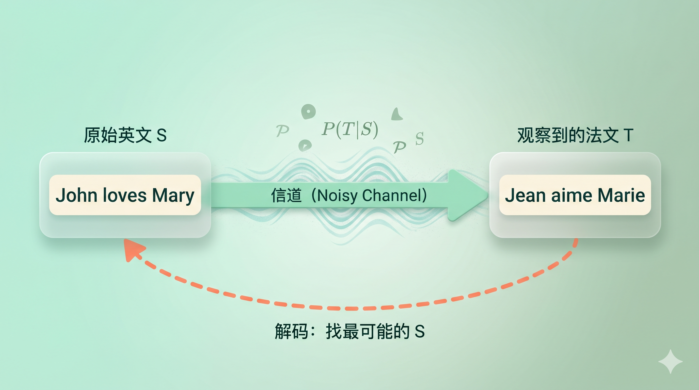
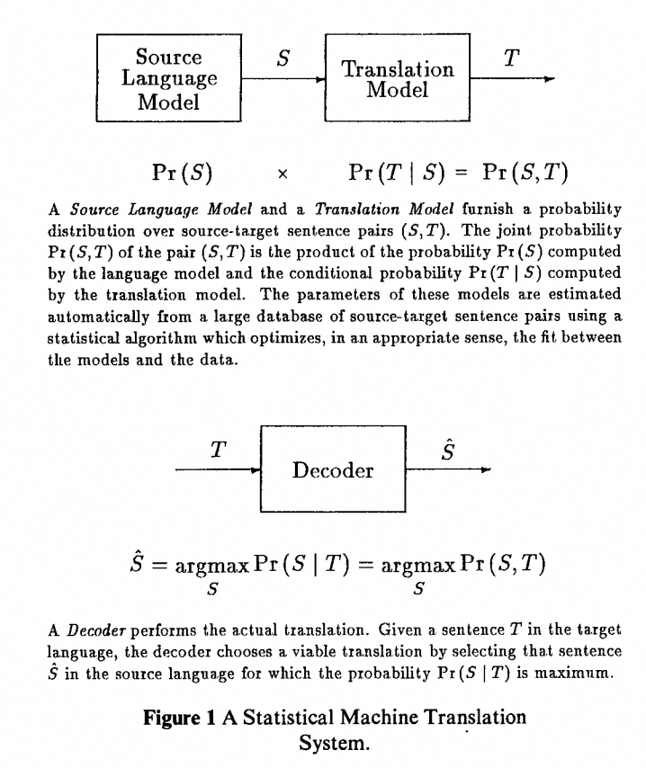
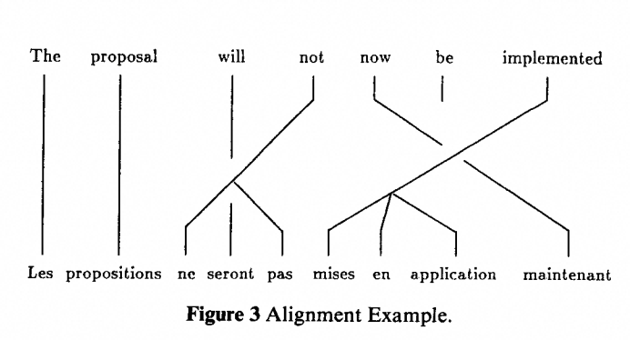

+++
title = "论文里程碑 #2：A Statistical Approach to Machine Translation"
description = "机器翻译从「写语法规则」转向「数概率」——1990 年这篇 IBM 论文把翻译变成了可学习的统计问题。"
date = 2026-05-21
tags = ["LLM", "论文里程碑", "机器翻译", "SMT", "IBM", "噪声信道", "EM 算法"]
categories = ["LLM"]
series = ["论文里程碑"]
showTableOfContents = true
+++



> 机器翻译从「写语法规则」转向「数概率」——1990 年这篇 IBM 论文把翻译变成了可学习的统计问题。

---

### 1990 年：当一群搞语音识别的工程师盯上了翻译

1990 年的机器翻译领域，已经熬了 40 年。从 1949 年 Warren Weaver 提出「用信息论做翻译」开始，这个方向经历过一轮乐观、一轮长达十几年的寒冬——语言学家们花了几十年手写词典和语法规则，系统越写越复杂，效果却总卡在「能看懂大概意思」的门槛上，离真实可用还差得远。

就在这一年，IBM Thomas J. Watson 研究中心的一群人在 *Computational Linguistics* 上发了一篇只有 7 页的论文，标题叫 *A Statistical Approach to Machine Translation*。写这篇论文的 Peter Brown、Della Pietra 兄弟、Fred Jelinek、Robert Mercer——全是当年做语音识别的那批工程师。他们提出一个让语言学家炸锅的主张：**翻译不是语言学问题，是信息论问题。** 只要有足够的平行语料，机器可以从统计规律里把翻译「数」出来。

*图：把翻译想象成一个噪声信道——原本的英文句子 S 在「通过翻译」时被「扭曲」成了法文 T，翻译的任务就是反过来，从 T 恢复 S*

---

### 翻译这件事，当时是怎么做的

在这篇论文之前，主流的机器翻译怎么做？答案是：雇一批语言学家写规则。一条规则大概长这样：当法语动词出现在「je」后面时，用第一人称变位；当名词前出现「le / la / les」时，翻译成英语的「the」。每多一个例外就补一条规则，每多一种时态就加一组变位表。

这种路子叫**基于规则的机器翻译（Rule-Based MT）**，60 到 80 年代的绝对主流。它有两个根本问题。

一是**规则永远写不完**。自然语言到处都是例外，每补一条规则都带出三个新的歧义。到 1980 年代，欧共体的 Eurotra 项目招了上百名语言学家，写了数百万行规则，最后只能在有限领域里勉强跑通，离通用翻译还遥遥无期。

二是**语言学家对了，翻译却不对**。语法规则可以保证译文「合法」，但保证不了译文「地道」。地道这件事不是规则能捕捉的——它藏在数以亿计的「人们实际会这么说」的句子里。

与此同时，另一个领域正悄悄用完全不同的思路解决类似问题：**语音识别**。1980 年代，IBM 用隐马尔可夫模型和大规模语料把语音识别的词错误率压下去了一大截，走的完全是统计路线。那问题来了：如果语音识别可以不靠规则只靠数据，翻译凭什么不行？

这正是这篇论文敢发出来的底气。

---

### 论文说了什么

论文提出了三个紧密咬合的核心论点。

**论点一：翻译可以被形式化成一个噪声信道问题。**

想象说法语的人心里本来要表达一句英文，但这句英文在「经过翻译」的过程中被「扭曲」成了法语。翻译的任务就是反过来——从观察到的法语 \(T\)，恢复原始的英语 \(S\)。数学上就是找让 \(P(S \mid T)\) 最大的那个 \(S\)。

用贝叶斯公式一拆：\(P(S \mid T) \propto P(S) \cdot P(T \mid S)\)。前者是「这句英语像不像人话」（**语言模型**），后者是「这句法语像不像这句英语的翻译」（**翻译模型**）。一个管流畅，一个管忠实。这一拆把翻译切成了两个独立可学的部分——至今所有机器翻译系统（包括神经翻译）都还能看到这个分工的影子。

**论点二：即使用最粗糙的语言模型，数据本身就带着惊人的结构。**

论文做了一个相当可爱的小实验——「bag translation」（袋翻译）。把一句英文打散成词袋，再让一个 trigram 语言模型来重排。38 个短句里，24 句（63%）被精确还原，32 句（84%）保留了原意。语言模型什么都没做，只是「知道哪些词连在一起像英语」——光凭这个它就能把乱序的词复原出来。这暗示一件事：语料里的统计规律远比我们以为的丰富。

**论点三：不需要任何词对齐标注，EM 算法就能把翻译模型训练出来。**

翻译模型要学的是「每个英语词最可能变成哪些法语词」，但平行语料只给了整句对整句——没人标注过「John 对齐 Jean」。论文从语音识别借来了 EM 算法：初始化所有词对的概率相等，算一遍期望对齐，更新一遍参数，再算一遍……跑若干轮之后，`the` 自动学出翻译成 `le` 概率 0.610、`la` 概率 0.178；`not` 学出翻译成 `pas` 和 `ne` 各约 0.46（因为法语否定是 `ne...pas` 双词结构）。没人告诉系统这些，全是从语料里「涌现」出来的。

最有意思的是 `hear`。模型学到它最可能被对齐到法语的 `bravo`，概率 0.992——但这不意味着模型认为 hear 的词典义等于 bravo。原因是加拿大国会里英语议员喊 "Hear, hear!" 表赞同，法语议员对应的是 "Bravo!"——在 Hansard 这个**特定语域**里，这一对固定话语高频共现，模型就把它学成了一个强语境映射。换句话说，它抓的是语料里的共现分布，不是抽象的语义。没有词典会告诉你这件事，但语料会。

---

### 论文怎么做到的

回到噪声信道的比喻。论文里翻译模型的核心直觉是：**把翻译想象成一个分步生成的过程，每一步都有显式概率**，再把这些概率从语料里学出来。

这里先交代一个时间线边界——1990 这篇 7 页论文主要在把 alignment、fertility、distortion 这些关键概念立起来，并用一个跑得通的 pilot 系统证明路线可行；真正把它们**系统化为严格数学定义的 IBM Model 1–5**，是三年后 1993 年 *The Mathematics of Statistical Machine Translation* 那篇长文。下面讲的「三步生成」，是本文已经搭起来的骨架雏形，不是 1993 之后教材里那套完全成熟的形式。

给定英语句子 \(S\)，生成法语句子 \(T\) 的过程被拆成三步：

1. **每个英语词决定自己要生几个法语词**（fertility，繁殖力）。`the` 通常生 1 个，概率 0.871；`not` 通常生 2 个（要凑出 `ne...pas`）；`does` 这类助动词翻成法语时常常消失，fertility 就是 0。
2. **每个英语词决定具体生成哪些法语词**（translation，词翻译）。`the` → `le` / `la` / `l'`，`not` → `pas` / `ne`。
3. **这些法语词在句子里摆到什么位置**（distortion，扭曲）。英语形容词在名词前，法语在名词后——这个位置重排由这一步处理。

每一步是一个概率分布，整句的联合概率是三者连乘。这些「概率」有多大规模？论文跑了两个 pilot 实验：第一个只做参数估计，用 9,000×9,000 的英法词表、4 万句对，估了 **约 8100 万个翻译参数**；第二个才真正端到端跑翻译，把词表收到 1,000 / 1,700，对应约 1700 万参数，语言模型是 bigram。要强调的是，这里的「参数」指的是「待估计的概率表格有多大」，和今天神经网络里的参数不是一个量纲——但放到 1990 年的机器上，这已经是需要精打细算的工程规模。

> 类比：做一道菜。先决定每种食材用几份（fertility），再决定具体用哪种食材（translation），最后决定怎么摆盘（distortion）。每一步有自己的概率分布，合起来就是这道菜的「生成过程」。翻译模型把翻译也拆成了这样的三步。

*图：语言模型给出 P(S)、翻译模型给出 P(T|S)，解码器在所有可能的 S 中搜索使乘积最大的那一个——这张图是之后 20 年 SMT 研究的骨架*

但这里有一个真正的难题：**训练**。要算翻译概率，得先知道词对齐；但数据里只有整句对整句，没有对齐标注。这就是一个经典的鸡生蛋蛋生鸡问题。

论文的解法是从语音识别搬过来的 **EM 算法**。核心思路是左右互搏：

> 想象两个人各自拿着一半拼图线索。他们轮流说「以我手里的信息看，这块该放这里」，对方根据这个更新自己的判断。几轮下来两人会收敛到同一个答案——这就是 EM。

具体到翻译：给定当前参数 → 算每个句对里「最可能的对齐」（E 步） → 从这些对齐里数频次，更新参数（M 步） → 回到第一步。初始所有词对概率都一样（完全没有先验），几轮迭代之后，参数会自己「长」出有意义的形状。

需要澄清一点：这里的「无监督」只是指**不需要人工标注词对齐**——整套方法仍然**强依赖高质量的句级平行语料**，加拿大 Hansards 的三百万英法句对就是它的燃料。把「无监督」误读成「不需要平行语料」，就偏离这篇论文的实际场景了。这也是为什么它的另一重影响是把「平行语料」推到战略资源的位置（下一节会再提到）。

整个系统的解码目标可以浓缩成一个公式：

$$
\hat{S} = \arg\max_S P(S) \cdot P(T \mid S)
$$

用大白话说：在所有可能的英语句子里，找那一句，让「它本身像英语」（语言模型）和「它翻译出来恰好是我们观察到的这句法语」（翻译模型）的乘积最大。

这一个公式，就是之后 20 年 SMT 所有论文的起点。

*图：一个典型的对齐——`not` 同时对齐到 `ne` 和 `pas`（fertility=2），`implemented` 对齐到 `mises en application` 三个词（fertility=3），这些都是模型从语料里自己数出来的*

至于效果：第二个实验把 73 句法语交给系统翻译，作者按「精确 / 意近 / 不同但合法 / 错 / 不通顺」五档做主观分类，前三档合计约 **48%** 被他们判为「可以接受的翻译」。要提醒的是——**这不是今天习惯的 BLEU 或 COMET，只是作者自定的主观口径**，放到现代评测标准下含义要打折扣；但放回 1990 年的上下文里，那是第一次有人证明，一套完全不懂语言学的统计系统，能把近一半的句子翻到「可读」水平。

---

### 它改变了什么

**短期影响**：论文发表后，机器翻译的研究重心在几年内就倒向了统计路线。IBM 自己 1993 年发表了 *The Mathematics of Statistical Machine Translation*，把本文的模型形式化为 **IBM Model 1–5**，成为之后 SMT 系统做**词对齐**的标准工具。2000 年代初，真正登上工业主流的是 **基于短语的 SMT（Phrase-Based MT）**——它不再逐词翻译，而是以短语为基本单元，配合 log-linear 模型和 minimum error rate training 等技术，把 SMT 推到了实用级。开源的 **Moses 工具包** 就是这一代系统的代表：它的 decoder 是 phrase-based 的，但训练流水线里的词对齐那一步，依然用 IBM Models 打底。2006 年上线的 Google Translate，也是沿着这条 phrase-based SMT 的路线铺开来的。

换句话说，从 1990 年到 2016 年 Google Translate 换成神经翻译，**统计机器翻译作为工业主流走了 20 多年**。这 7 页论文不等于这 20 年的全部技术——后续的 IBM Models、phrase-based SMT、log-linear 判别式建模都是关键增量——但它确实是这整条范式的起点。

**长期影响**：从今天回望，这篇论文的真正意义不在于「SMT 比规则系统好」——那只是当时的一个事实判断。它真正改变的是**整个 NLP 领域对「语言问题」的定义方式**。

在这篇论文之前，「翻译」被默认为「需要懂语言的人去做的事」。之后，它变成了「给我足够的平行语料，我就能自动学出来的事」。这个转变不只影响翻译，它通过 Jelinek 那句广为流传（他本人后来说被后人改编过）的话扩散到整个 NLP：

> 「每次我开除一个语言学家，系统的性能就上升。」

这话当然不能字面上当真——但它背后的方法论影响是真实的：**让数据说话，而不是让规则说话**。这条路线从 SMT 走到 Word2Vec，再到 BERT、GPT，今天所有大语言模型本质上还在这条路线上。只不过「平行语料」换成了「整个互联网文本」，「EM 算法」换成了「梯度下降」，但核心信念没变：**语言规律藏在数据的分布里，不是写在语法书里。**

我认为这篇论文最深远的影响，是它把「翻译问题」变成了「优化问题」。一旦你接受了这个框架，接下来 30 年的故事就变成了两条主线的竞赛——**更好的模型**（IBM Model 1→5 → Phrase-Based MT → 神经 MT → Transformer）和**更多的数据**（Hansards 的百万级 → Common Crawl 的万亿级）。两条线交织，才有了今天。

另一个常被忽略的影响是：这篇论文让「**平行语料**」成为一种战略资源。加拿大国会 Hansards 之所以重要，是因为法律强制同一份议事记录必须同时存在于英法两种语言——这种高质量双语对齐数据在当时极其罕见。之后二十年里，「找平行语料」成了 NLP 研究的隐性基础设施工作，直到预训练大模型时代才稍微被单语数据稀释了重要性。

---

### 与主线的接口

**如果你想深入……**

这篇论文的核心概念对应我们 LLM 系列的「数据工程」章节：

- 平行语料与数据采集 — 讲了为什么高质量双语对齐数据极其珍贵，以及现代机器翻译如何在 Hansards 之外扩展到上百种语言（从 OPUS 到 NLLB）
- 数据驱动范式的兴起 — 讲了从「写规则」到「用数据」的范式转变如何从 MT 扩散到整个 NLP，最终催生了预训练的哲学

读完这些，你对 *A Statistical Approach to Machine Translation* 的理解会从一个历史文献变成一个当代工程师仍在面对的问题：**数据从哪里来，怎么让它说话**。

---

### 读完这篇，你拿到了什么

读之前，你可能把「机器翻译」默认绑定在深度学习上，以为是最近十来年的事。读完之后，画面清楚了：早在 1990 年，IBM 这群搞语音识别的工程师就把翻译重新定义成了一个概率问题——给定法语 \(T\)，找让 \(P(S) \cdot P(T \mid S)\) 最大的英语 \(S\)。这个框架奠定了 noisy channel 的思路，划分出语言模型与翻译模型的分工，勾勒出 alignment / fertility / distortion 这些关键方向——这些方向随后被 1993 年的 **IBM Model 1–5** 完整参数化，又在 2000 年代被 **phrase-based SMT** 推上工业主流，直到 2017 年 Transformer 把整个骨架都换掉。从这条线看，真正一路继承到今天大语言模型的，不是 noisy channel 的具体形式，而是它背后那个更普适的主张：**用大规模数据学分布，让语言的规律从语料里自己长出来。**

下一篇我们来看这套统计思想在语言建模本身上的第一次神经网络化尝试—— 2003 年 Bengio 的 *A Neural Probabilistic Language Model*。它第一次用神经网络做语言建模，也是词嵌入（Word Embedding）的真正起点。从「数 n-gram 频次」到「学词向量」，语言的表示方式开始被重新思考。

---

### 参考资料

- Brown, P. F., Cocke, J., Della Pietra, S. A., Della Pietra, V. J., Jelinek, F., Lafferty, J. D., Mercer, R. L., & Roossin, P. S. (1990). A Statistical Approach to Machine Translation. *Computational Linguistics*, 16(2), 79–85. [ACL Anthology](https://aclanthology.org/J90-2002/)
- 作者：Peter F. Brown、John Cocke、Stephen A. Della Pietra、Vincent J. Della Pietra、Fredrick Jelinek、John D. Lafferty、Robert L. Mercer、Paul S. Roossin（均来自 IBM Thomas J. Watson Research Center）
- Brown, P. F., Della Pietra, S. A., Della Pietra, V. J., & Mercer, R. L. (1993). The Mathematics of Statistical Machine Translation: Parameter Estimation. *Computational Linguistics*, 19(2), 263–311.（IBM Model 1-5 的完整数学形式，本文的技术延伸）
- Koehn, P. (2009). *Statistical Machine Translation*. Cambridge University Press.（SMT 时代的系统性教材，讲清楚了从 IBM Model 到 Phrase-Based MT 的完整脉络）
