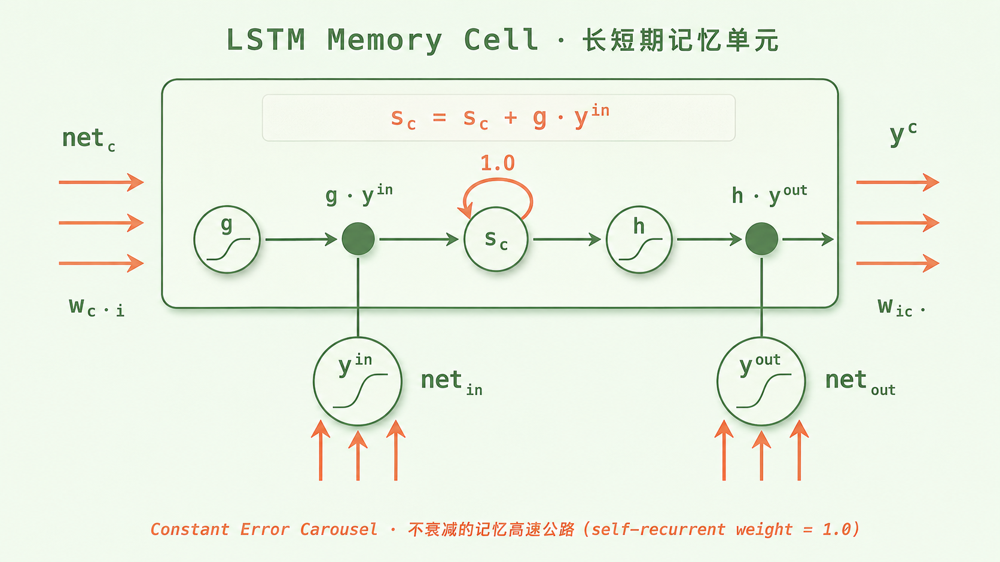

+++
title = "论文里程碑 #3：Long Short-Term Memory"
description = "LSTM 用一条「不衰减的记忆高速公路」教会神经网络记住长程依赖，统治 NLP 二十年——又被自己埋下的并行化命门亲手送下王座。"
date = 2026-05-28
tags = ["LLM", "论文里程碑", "RNN", "LSTM", "梯度消失", "序列建模", "Hochreiter"]
categories = ["LLM"]
series = ["论文里程碑"]
showTableOfContents = true
+++



> 一句话摘要：LSTM 用一条「不衰减的记忆高速公路」教会了神经网络记住长程依赖，沉寂多年后在 2010 年代中期成为 NLP 工业界的主流序列架构，又被自己埋下的并行化命门亲手送下王座。

## 一、1991 年的那本被忽视的硕士论文

1991 年，慕尼黑工业大学的一个奥地利学生交出了一本德语硕士论文，标题翻译过来是《动态神经网络的研究》。这本论文里，他第一次清晰地证明了一件事：**循环神经网络（RNN）在数学上学不会长程依赖**——因为误差信号在沿时间反向传播时，会以指数速度衰减或爆炸。这个学生叫 Sepp Hochreiter，他的导师是 Jürgen Schmidhuber。

六年后的 1997 年，他俩在 *Neural Computation* 期刊上发表了一篇叫 *Long Short-Term Memory* 的论文，给出了一个解决方案。这篇论文没有发表在当时更显眼的会议上，而是发表于 *Neural Computation*，沉寂了将近二十年。然后在 2015 年到 2017 年之间，它毫无征兆地成了 Google 翻译、Google 语音识别、Apple Siri、Facebook 翻译的底层技术——一个 1997 年的设计，撑起了 2010 年代上半叶整个 NLP 工业界的天空。

这是一篇被低估了十七年的论文，也是一个有缺陷的天才架构。它解决了一个根本问题，又在自己身体里埋下了另一个根本问题。

## 二、那个让所有人头疼的「梯度消失」

要理解 LSTM 为什么是个突破，先要理解它解决的是什么。

1990 年代初的 NLP 研究者已经知道：要建模语言，就得建模序列。一个句子的第 50 个词，可能依赖第 1 个词——你说「那个我昨天在公园里遇到的、穿红衣服的、提着菜篮子的老太太……终于过马路了」，模型读到「过马路了」时，必须还记得主语是「老太太」。

RNN 看起来天生为这个任务而生：它把序列一个时间步一个时间步地喂进去，每一步都把自己的「隐状态」向前传，理论上可以记住任意长的过去。但实际训练时，所有人都撞上了同一堵墙。

问题出在反向传播。要让 RNN 学会「过马路了」依赖「老太太」，得把误差信号从第 50 步往回传 49 步。每往回传一步，梯度都会乘上一个由循环权重矩阵和激活函数导数组成的 Jacobian——也就是 \(W^\top \operatorname{diag}(\phi'(a_t))\) 这一类的乘子。当这些 Jacobian 的连乘范数长期小于 1 时，梯度会指数级衰减到几乎为零；长期大于 1 时，则指数级爆炸为无穷大。两种情况都意味着模型学不到这个依赖。

> 一个有短期记忆的人读一个长句子：读到第 100 个词时，第 1 个词已经模糊了。RNN 就是这样的人，而且这不是它努不努力的问题——是数学上的硬伤。

Hochreiter 在 1991 年的论文里把这件事算清楚了。这之后，RNN 在学术界几乎被判了死刑。大家普遍接受了一个共识：序列建模这条路走不通，至少深度学习这条路走不通。

## 三、核心论文解读

### 3.1 论文说了什么

这篇论文给出了三个关键结论。

**第一，梯度消失不是 RNN 训练得不够好，是结构本身的问题。** 在论文的前半部分，Hochreiter 和 Schmidhuber 用了相当大的篇幅做 Jacobian 连乘的范数分析：标准 RNN 的误差反传过程里，每个时间步都贡献一个由循环权重和激活函数导数组成的乘子；当激活是 sigmoid 时，单步导数最大只有 0.25。这些乘子叠在一起几十步后，原信号会被压到 \(10^{-60}\) 量级——这不是数值精度问题，是结构性的指数衰减。

**第二，只要在结构里嵌入一条「常量误差流」，梯度就能跨越任意长的时间步。** 这是论文最聪明的部分。如果某条路径上的递归权重恰好是 1，那么误差信号沿这条路径反传时既不衰减也不爆炸——它叫这个机制为「常误差转盘」（Constant Error Carousel，CEC）。CEC 不是一个数学技巧，而是一个结构性承诺：**架构里得有一条专门用来「不忘」的高速公路**。

**第三，光有高速公路不够，还得有阀门。** 如果记忆永远不衰减，那它会被新信息淹没（什么都记 = 什么都没记住）。所以论文又在 CEC 的入口和出口各装了一个**门**：input gate 决定「现在这一步的信息要不要写进记忆」，output gate 决定「记忆里的内容要不要影响当前的输出」。

论文在若干人造长时距任务上验证了效果——在那些 BPTT、RTRL 等传统 RNN 训练方法学不动的长时距问题上，LSTM 都能稳定收敛。其中最常被引用的一个例子叫**嵌入式 Reber 文法**：一个需要模型记住开头字母、跨过中间噪声、最后用开头信息预测结尾的任务。严格来说嵌入式 Reber 不算极端长时距问题，论文里更多是用它来展示 output gate 的作用；真正体现 LSTM 长程能力的是几组人造的「噪声序列识别」「延迟回忆」任务。

### 3.2 论文怎么做到的

关键是要理解 LSTM 把「记忆」和「计算」做了一次干净利落的分家。

传统 RNN 里只有一个隐状态 \(h_t\)，它既要承担「短期工作记忆」（处理当前这步的计算），也要承担「长期存储」（把过去信息往后传）。这两份工作的需求是矛盾的：工作记忆需要快速被覆盖，长期存储需要稳定不变。一个状态扛两份工作，结果两边都做不好。

LSTM 把这两个角色分开成两条独立的状态：

- **细胞状态 \(c_t\)（cell state）**：长期记忆。这是那条「不衰减的高速公路」，沿时间轴往前流动时主路径上是加法而不是矩阵乘法。
- **隐状态 \(h_t\)（hidden state）**：短期工作记忆。每一步从 \(c_t\) 里读出当前需要的部分，参与计算和输出。

**1997 年原始版本**的更新规则是：

$$
c_t = c_{t-1} + i_t \odot \tilde{c}_t
$$

这就是 CEC 在数学上的体现——上一步细胞状态的系数恒为 1（自连接权重为 1），误差信号沿 \(c_t\) 反传时只做加法，可以近似恒等地一路传回去。

**1999 年加入 forget gate 后的现代标准 LSTM** 把这条公式扩展成：

$$
c_t = f_t \odot c_{t-1} + i_t \odot \tilde{c}_t, \quad h_t = o_t \odot \tanh(c_t)
$$

注意区别：原版细胞状态是严格的恒等保留，现代版引入了 forget gate \(f_t\) 之后，记忆通路变成了**可学习的乘性保留**——模型可以选择让某条记忆衰减或清零。CEC 在严格意义上变成了「可控的 CEC」，但只要 \(f_t\) 学到接近 1，长程梯度通路依然成立。

> 把 RNN 的隐状态想成一张正在涂涂改改的草稿纸——每一步都在覆盖上一步。LSTM 的细胞状态则是一条传送带：你只能往上添东西、撕掉东西，但传送带本身不会因为转得太久就停下来。

*图：LSTM 单元的内部结构示意（参考 Hochreiter & Schmidhuber 1997 原始论文 Figure 1）。盒子里那条从 g 到 h 的水平线就是细胞状态 \(c_t\) —— 那条「不衰减的记忆高速公路」，中间 s_c 节点上的 1.0 自循环是 CEC 的几何表达。盒子外面下方的两个门像阀门一样，控制信息能否进入、能否影响输出。*

这里有一个值得讲的历史细节：**1997 年的原始论文里只有两个门**——input gate 和 output gate。今天我们说的「LSTM 三件套：输入门、遗忘门、输出门」，那个 forget gate 其实是两年后由 Gers、Schmidhuber、Cummins 在 1999 年的一篇补丁论文里加上的。

为什么需要 forget gate？因为原版 LSTM 太「忠诚」了——细胞状态只能加东西不能减东西，跑长了以后会累积过载。Gers 的发现是：**有时候模型需要主动忘记**。比如句子结束了，主语该清空了；新段落开始了，旧上下文该淡出了。forget gate 的引入让 LSTM 从「只会记」升级为「会记也会忘」，从此进入了它的二十年统治期。

所以严格来说，今天工业界用了二十年的「标准 LSTM」，是 1997 论文的核心思想 + 1999 论文的补丁的合体。但提出关键洞察「在结构里造一条不衰减的记忆通路」的，是 1997 这篇。

## 四、它改变了什么

**短期影响**：LSTM 让 RNN 起死回生。1997 到 2010 年代，它在语音识别、手写识别、机器翻译、文本生成上一个接一个刷新基线。2014 年 Sutskever 等人提出的 Seq2Seq（也是这个系列的下一篇）直接拿两个 LSTM 拼成翻译系统，端到端地从一种语言映射到另一种语言；2015 年 Google 把 LSTM 部署到语音识别里；2016 年 Google 翻译切换到神经翻译，把翻译错误率降低了 60%，底层就是 LSTM。短短两三年，LSTM 从学术冷门变成了所有大公司的语言基础设施。

**长期影响要分两面看**。

往好的一面说：LSTM 与后来的 Seq2Seq 一起，第一次证明了**端到端神经序列建模能在机器翻译、语音识别这类核心任务上达到工业可用水平**。在它之前，NLP 是统计模型 + 大量手工特征工程的天下；在它之后，「端到端神经网络」成了默认选项。它不只是一个具体架构，更是一个范式开关——告诉这个领域「数据 + 表示学习 + 长依赖建模」这套组合是 work 的。后来从 Word2Vec 到 BERT 再到 GPT 的整条路径，都是在这个范式假设下展开的。

往不那么好的一面说：**LSTM 的胜利里也藏着它的死刑判决书**。它必须按时间步顺序展开——第 \(t\) 步的计算必须等第 \(t-1\) 步算完才能开始。这在 GPU 时代是个致命缺陷。GPU 擅长的是「一万个相同操作并行做」，而 LSTM 偏要「一万个操作排队做」。当训练数据从百万级跳到亿级时，这个并行化短板被放大到无法忍受。

2017 年 *Attention Is All You Need* 给出的真正激进的设计选择不是「用 attention 替换 RNN」，而是**砍掉时间维度上的串行依赖**——每个位置都可以独立并行计算。Transformer 的胜出有两层：一层是去掉时间维串行后带来的训练并行化，让 GPU 集群能跑得动 LSTM 跑不动的数据规模；另一层是 self-attention 给任意两个位置之间提供了 \(O(1)\) 长度的直接路径，全局依赖比 LSTM 那种「沿着时间轴一步步爬」的间接路径更短、更易学。两层叠加才让它真正赢下了这场竞赛。

值得一提的是，LSTM 到 Transformer 之间还有一个重要的中间站：Bahdanau 在 2015 年提出的**注意力机制**最早就是给 LSTM Encoder-Decoder 打补丁的——为了解决固定长度上下文向量的瓶颈，让解码器能在每一步动态回看编码器的所有隐状态。Transformer 的「砍掉 RNN，只留 attention」不是凭空跳跃，而是把这个外挂直接升级成了主架构。

所以 LSTM 同时是 Transformer 的奠基人和靶子：它教会了这个领域「序列建模值得做、长依赖能被建模」，又用自己的失败定义了下一代架构必须解决的问题——**怎么在保持长依赖建模能力的同时，把时间维度的串行依赖砍掉**。这个问题是 LSTM 留给 Transformer 的礼物，也是它的遗嘱。

## 五、与主线的接口

**如果你想深入……**

这篇论文的核心概念对应我们 LLM 系列的「Transformer 架构」章节的前传部分：

- 「序列建模的早期尝试：从 RNN 到 LSTM」 — 讲了循环架构的根本机制和瓶颈
- 「为什么 Transformer 必须存在：并行化的工程账」 — 讲了 LSTM 的串行依赖如何在 GPU 时代变成致命短板
- 「门控机制的工程直觉」 — 讲了 input/output/forget gate 这套设计后来如何在 GRU、Highway Network 甚至 Transformer 的残差连接里换了形式存活下来

读完这些，你对 *Long Short-Term Memory* 的理解会从「门控加记忆单元」的历史印象，变成可操作的工程认知——理解为什么 attention 选择保留「跨位置依赖建模」却抛弃「按时间步串行计算」，理解残差连接为什么本质上和 CEC 是同一个思想的不同形态。

## 六、读前 vs 读后

读这篇论文之前，你可能觉得 LSTM 是一个「带门的复杂 RNN」，名字念起来还有点拗口。

读完之后你会知道：LSTM 真正的洞察不在「门」，而在「**给神经网络架构里造一条不衰减的高速公路**」这个结构性想法。门只是这条高速公路的配套阀门。这个想法在后来的所有深度网络里都还在——ResNet 的残差连接、Transformer 的残差路径，本质上都是 CEC 的近亲。Hochreiter 1997 年发明的不只是 LSTM，是一种「让信息在深度网络中自由流动」的设计哲学。

下一篇我们要讲 #4 *Learning Phrase Representations using RNN Encoder-Decoder for Statistical Machine Translation*——Cho 等人 2014 年的论文。它做了两件事：一是提出 GRU，把 LSTM 的三个门精简到两个；二是第一次把「编码器-解码器」的结构用神经网络明确写了出来。这是从「LSTM 单元」走向「Seq2Seq 系统」的关键一步，也是注意力机制即将登场的舞台搭建。

## 七、参考资料

- 论文原文：Hochreiter, S., & Schmidhuber, J. (1997). *Long Short-Term Memory*. *Neural Computation*, 9(8), 1735–1780. [JKU 公开版 PDF](https://www.bioinf.jku.at/publications/older/2604.pdf)
- 梯度消失的源头论文（德语硕士论文，Sepp Hochreiter, 1991）：*Untersuchungen zu dynamischen neuronalen Netzen*
- forget gate 的补丁论文：Gers, F. A., Schmidhuber, J., & Cummins, F. (1999). *Learning to Forget: Continual Prediction with LSTM*
- 延伸阅读：Christopher Olah, *Understanding LSTM Networks* — 全网最广为引用的 LSTM 直觉解释，配图清晰，建议作为正式入门第一站
- 延伸阅读：Schmidhuber 本人写的回忆性长文 *Annotated History of Modern AI and Deep Learning*，里面有 LSTM 从 1991 到 2017 整条历史线的当事人视角
