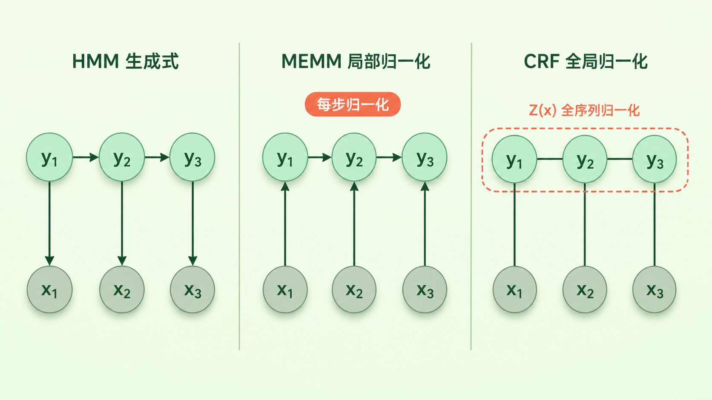
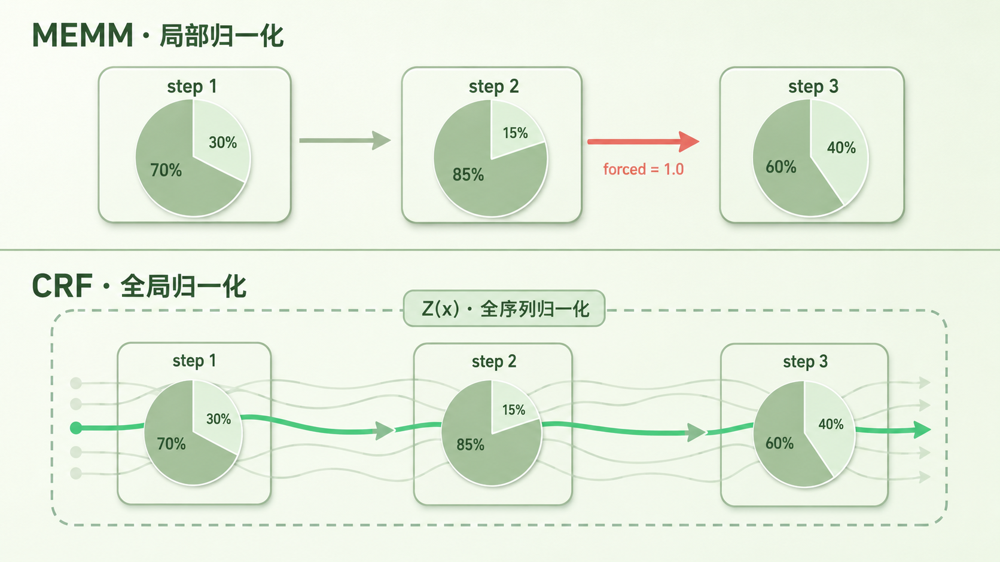

+++
title = "论文里程碑 #4：Conditional Random Fields"
description = "2001 年，CRF 用判别式建模解开 HMM 的特征独立性枷锁，用全局归一化修复 MEMM 的 label bias——序列标注从此进入判别式结构化预测时代。"
date = 2026-06-03
tags = ["LLM", "论文里程碑", "CRF", "序列标注", "判别式模型", "label bias", "结构化预测", "Lafferty"]
categories = ["LLM"]
series = ["论文里程碑"]
showTableOfContents = true
+++



> 一句话摘要：CRF 用判别式建模解开 HMM 的独立性枷锁，用全局归一化修复 MEMM 的 label bias，让序列标注进入判别式结构化预测时代。

## 一、历史时刻钩子

2001 年的 NLP 圈，气氛是这样的：HMM 在词性标注、语音识别、命名实体识别上几乎一统天下，新人入门 NLP 第一件事就是手撸一个 Viterbi 算法；隔壁机器学习圈，SVM 正如日中天，「判别式模型胜过生成式模型」的论调每隔几个月就被翻出来引用一次。

那一年六月，ICML 上来了一篇标题非常技术化的论文——*Conditional Random Fields: Probabilistic Models for Segmenting and Labeling Sequence Data*。论文没承诺什么新任务、没刷什么榜，反复在说一件事：HMM 和 MEMM 都有结构缺陷。我们应该这样建模。

这篇论文做的不只是提出一个新模型——它把序列标注的主流思路从生成式建模明显推向了判别式结构化预测，是 2000s NLP 范式切换的标志之一。

## 二、时代背景——那个问题有多难

如果你在 2001 年想做命名实体识别（Named Entity Recognition，NER）——也就是从 "John works at IBM" 里把 John 和 IBM 都标出来——主流做法是用隐马尔可夫模型（Hidden Markov Model，HMM）。

HMM 的世界观很美：假设每个标签都是一个「隐状态」，每个观测到的词都由当前隐状态「生成」出来。要训练，就最大化联合概率 \(P(\mathbf{x},\, \mathbf{y})\)；要预测，就用贝叶斯倒过来求 \(P(\mathbf{y} \mid \mathbf{x})\)。优雅、对称、有完整的概率论作背书。

但用过的人都知道两个噩梦。

**第一个，特征工程被死死锁住。** HMM 假设每个词只由当前标签生成、词之间相互独立。可现实里，决定一个词是不是公司名的特征是一大堆相互相关的东西——首字母是否大写、词缀有没有 ".com"、上一个词是不是 "at"、下一个词是不是动词……这些特征你想全部塞进 HMM，模型就崩了，因为它要求特征独立。

**第二个，HMM 优化的目标跟你要解决的问题对不上。** 你最终想要的是 \(P(\mathbf{y} \mid \mathbf{x})\)，HMM 却去先学 \(P(\mathbf{x},\, \mathbf{y})\) 的联合分布——把宝贵的建模能力浪费在「词长什么样」上，而你根本不在乎词。

于是大概 2000 年前后，McCallum 等人提了一个改进方案：最大熵马尔可夫模型（Maximum Entropy Markov Model，MEMM）。MEMM 把生成方向反过来，每一步直接学 \(P(y_t \mid y_{t-1},\, \mathbf{x},\, t)\) —— 这里 \(\mathbf{x}\) 是整条观测序列，特征函数可以读取当前位置附近、甚至整段输入的任意上下文，特征想加多少加多少。看起来完美。

但 MEMM 藏着一个致命的 bug——**label bias problem（标签偏置）**。具体场景是这样：如果某个标签状态只有一条出边，那这条出边的概率会被局部归一化成 1，无论这一步的观测多不像那条出边对应的标签。换句话说，MEMM 在每一步做局部归一化，让「出边少的状态」会被偏向性地推着走，整条路径的概率分配是扭曲的。

走到这里你能感觉到，序列标注这个领域被卡在了一个进退两难的位置：HMM 假设太强，MEMM 局部归一化又有偏。需要的不是修补，是结构性地换地基。

## 三、论文说了什么

CRF 论文给了两个核心论点。

**第一个论点：判别式建模解掉 HMM 的特征独立性枷锁，全局归一化解掉 MEMM 的 label bias。** 论文不是只提出了一个新模型，而是把整个序列标注问题搬到一个新框架下——条件随机场（Conditional Random Field，CRF）。它直接建模 \(P(\mathbf{y} \mid \mathbf{x})\)，跳过 HMM 那个不必要的「生成观测」环节、绕开特征独立性假设；同时把归一化放在整条序列上做，而不是每一步局部做，从根上消除 label bias。两招分别对应两个不同的结构缺陷。

**第二个论点：这套设计在真实任务上同时打败 HMM 和 MEMM。** 论文在词性标注的标准数据上做了对比实验，CRF 把错误率比 HMM 降了一档；更关键的是在一个为 label bias 专门构造的合成数据上，MEMM 表现明显差于 CRF 和 HMM——这是直接的、可复现的「MEMM 错在哪」的实验证据。

两条腿走路：第一条是「我们说它对，是因为结构上能讲通」；第二条是「我们说它对，是因为它真的赢了」。

## 四、论文怎么做到的

要理解 CRF 的核心技巧，先看一张图。

*图：左边是 HMM 的有向生成式结构（标签生成观测）；中间是 MEMM 的有向判别式结构（观测影响标签，但每一步局部归一化）；右边是 CRF 的无向结构（整条序列联合建模、全局归一化）。三张图箭头方向看似只是细节差异，背后是三种完全不同的概率视角。*

三个模型放在一张表里更清楚：

| 模型 | 建模目标 | 归一化范围 | 特征灵活度 |
| --- | --- | --- | --- |
| HMM | \(P(\mathbf{x},\, \mathbf{y})\) 联合分布（生成式） | —（生成式建模，不直接条件归一化） | 受词独立性假设强约束 |
| MEMM | \(P(y_t \mid y_{t-1},\, \mathbf{x})\) 局部条件（判别式） | 每一步内局部归一化 | 可使用整段观测特征 |
| CRF | \(P(\mathbf{y} \mid \mathbf{x})\) 全序列条件（判别式） | 整条标签序列上全局归一化 | 可使用整段观测特征 |

直觉先行。

> 想象你在玩一个填空游戏：给你一个 10 个词的句子，让你给每个词贴一个标签。HMM 的做法是「先假设这 10 个标签是怎么编出来的，再倒推哪种编法最可能产出眼前这句话」；MEMM 的做法是「我从左到右走，每走一步都立刻拍板下一个标签，不管后面」；CRF 的做法则是——「我先列出所有可能的标签序列，给每一种打一个分，把分数归一化成概率，挑分最高的」。

CRF 最关键的设计是它把整条标签序列当成一个整体，序列得分等于各种「局部一致性特征」的加权和。形式化写出来，对于线性链 CRF（最常见的版本），给定输入序列 \(\mathbf{x}\)，标签序列 \(\mathbf{y}\) 的条件概率是：

$$
P(\mathbf{y} \mid \mathbf{x}) = \frac{1}{Z(\mathbf{x})} \exp\left(\sum_{t=1}^{T} \sum_{k} \lambda_k \, f_k(y_{t-1},\, y_t,\, \mathbf{x},\, t)\right)
$$

翻成大白话：每个 \(f_k\) 是一个「特征函数」，可以是「上一个标签是 B-PER 且当前词首字母大写」这种规则，也可以是「当前词是 'IBM' 且当前标签是 B-ORG」这种规则。每个特征都有一个学到的权重 \(\lambda_k\)。把句子里所有位置、所有特征的得分加起来，取指数，就是这条标签序列的「原始分数」。关键在分母——\(Z(\mathbf{x})\) 把所有可能的标签序列的原始分数都加起来作为归一化项：

$$
Z(\mathbf{x}) = \sum_{\mathbf{y}'} \exp\left(\sum_{t=1}^{T} \sum_{k} \lambda_k \, f_k(y'_{t-1},\, y'_t,\, \mathbf{x},\, t)\right)
$$

也就是遍历所有可能的标签序列 \(\mathbf{y}'\)，把它们的原始分数全部加起来。**这一步发生在整条序列上，不是每一步局部做。**

这就是 CRF 的灵魂。MEMM 是在每一步内做 softmax，CRF 是把整条序列当成一个东西做 softmax。看上去只是把归一化范围从一步扩到 T 步，含义却完全不同：

> 因为 \(Z(\mathbf{x})\) 把所有候选序列都纳入了比较，CRF 在解码时比较的是整条候选路径的总分，而不是在每个状态局部提前归一化。一个出边只有一个的状态，在 CRF 里不再被强制走那条出边——后续位置的观测特征会通过整条路径的总分参与选择，label bias 就在这里被解掉。

整条路径参与比较，并不等于 CRF 引入了任意长度的标签依赖：线性链 CRF 的标签转移仍是一阶邻接，跟 HMM、MEMM 一样。改变的只是归一化的范围，不是依赖结构。

*图：上半部分 MEMM 在每一步内做局部归一化（每一步概率和 = 1，出边少的状态会被强行走过去）；下半部分 CRF 在整条标签序列上做全局归一化（所有候选序列概率和 = 1，路径之间可以根据整段观测的特征相互调整得分）。*

判别式的好处也顺势体现出来：因为 CRF 不用建模「词怎么产生」，特征函数 \(f_k\) 可以任意复杂、彼此重叠、依赖整段输入 \(\mathbf{x}\) 而不只是当前位置——这正是 HMM 学不到的那些上下文特征。

代价是训练成本变高。MEMM 每一步独立归一化，训练时是分步走的；CRF 要在所有可能标签序列上做求和才能算 \(Z(\mathbf{x})\)，训练目标是最大化条件对数似然（conditional log-likelihood）。它有一个很优雅的梯度形式：真实标签的特征计数减去模型期望下的特征计数——后者用 forward-backward 算法高效计算，整体把求和复杂度压回 \(O(T \cdot K^2)\)，T 是序列长度、K 是标签数。预测时则用 Viterbi 算法找最大概率路径，跟 HMM 一样。整套训练-推理流程在 2001 年的硬件上是跑得起来的。

## 五、它改变了什么

短期的余震发生在两个方向上。

第一个方向是 NLP 的核心任务被 CRF 接管。论文发表后五年内，CRF 很快成为命名实体识别、词性标注、中文分词、信息抽取等任务上的重要强基线，并在 2000s 的信息抽取系统中被广泛部署。直到 2014 年深度学习开始接管这些任务之前，CRF 都是默认对照组。

第二个方向是机器学习社区对「判别式 vs 生成式」的讨论被这篇论文推到了一个新的强度。CRF 不是单纯地「换个判别模型」，它是用一个具体的反例——label bias——证明了「局部归一化」这个看似无害的设计会带来全局性的偏差。这个洞察后来反复出现在结构化预测（Structured Prediction）的文献里。

长期影响有两层。

一层是 CRF 这套数学骨架本身没死。今天许多 NER 工业方案——BiLSTM-CRF、BERT-CRF——的 CRF 那一层就是 2001 年 Lafferty 论文里的 CRF。神经网络换掉了底层的特征工程，顶上加一层 CRF 来约束「标签之间的合法转移」仍是常见做法；在强预训练模型时代，CRF 层是否真的必要会取决于任务、标签体系和延迟约束——softmax tagger 在某些场景已经能跑出近似精度且更快——但这套「约束解码」的思路本身没过时。

更深的一层是认知层面。CRF 把概率图模型在 NLP 里的能力推到了一个完整的形态：在那之前，NLP 的概率模型多少还在 HMM 那种「小马尔可夫假设」的舒适区里；CRF 之后，大家意识到只要愿意承担计算代价、愿意把归一化范围放大，结构化建模能做的事还有很多。也正是这个认识到位之后，社区开始把注意力移向另一个方向——能不能让「特征」也由模型自己学，而不是手工设计？这条路最终通向了 Word2Vec、LSTM、Transformer，把整个序列建模问题重新交给了神经网络。

可以这样总结：CRF 是 2000s 序列标注最有代表性的范式之一；图模型为序列建模能做的事，到这里告一段落。

## 六、与主线的接口

**如果你想深入……**

这篇论文的核心概念对应我们 LLM 系列的「语言建模」和「Transformer 架构」两个章节：

- 第一章 #1（序列概率与链式法则）— 讲了 LLM 怎么用链式法则把整条序列的概率拆成 token 级条件概率。和 CRF 形成有趣对照：CRF 在整条标签序列上做一次全局归一化，LLM 在每一步 token 上做局部归一化。两种归一化只是粒度上的类比，不要混同——LLM 的链式分解是合法的概率拆解，并不带 MEMM 那种 label bias 缺陷
- 第三章 #5（Attention 在算什么）— 讲了 self-attention 怎么用一次矩阵运算处理任意位置之间的依赖，把 CRF 用 forward-backward 聚合「全局信息」这件事直接换成了 attention 矩阵
- 第三章 #3（训练是并行的：Teacher Forcing 与 Causal Mask）— 讲了现代序列模型怎么靠 mask 把训练并行化。对照 CRF 的 forward-backward，能直观看出「用 attention 替代图模型」在工程上换来了什么

读完这些，你对 CRF 的理解会从「老 NLP 时代的一个模型」变成「序列建模这件事在前神经网络时代最成熟的判别式答案」——也更能理解，今天的 Transformer 解决的是同一个问题，只是路径完全不同。

## 七、收尾

读这篇之前，CRF 在很多人脑子里大概只是一个名字——「哦那个老序列标注模型，跟 HMM 差不多吧」。读完会发现，CRF 跟 HMM 差的不只是一个字母：它代表的是 NLP 从生成式建模转向判别式结构化预测、从局部归一化转向全局归一化、从特征独立性假设转向任意特征工程的范式切换。

但这条赛道很快被换了——下一站，深度学习开始让「特征」也由模型自己长出来。下一篇我们看 2003 年 Bengio 的神经概率语言模型，那是这场切换的第一枪。

## 八、参考资料

- 原论文：Lafferty, J., McCallum, A., & Pereira, F. (2001). *Conditional Random Fields: Probabilistic Models for Segmenting and Labeling Sequence Data*. Proceedings of ICML 2001. [https://repository.upenn.edu/cis_papers/159/](https://repository.upenn.edu/cis_papers/159/)
- 作者背景：John Lafferty（时任 CMU 教授）、Andrew McCallum（CMU 博士后，后任 UMass Amherst 教授）、Fernando Pereira（时任宾大教授），三位都是 21 世纪初概率图模型与 NLP 交叉方向的核心人物
- 延伸阅读：
    - Sutton, C. & McCallum, A. (2012). *An Introduction to Conditional Random Fields*. Foundations and Trends in Machine Learning. 后来最权威的 CRF 教科书章节，由原作者之一亲手撰写：[https://arxiv.org/abs/1011.4088](https://arxiv.org/abs/1011.4088)
    - Lample et al. (2016). *Neural Architectures for Named Entity Recognition*. NAACL 2016. BiLSTM-CRF 的代表性论文，展示了「神经网络 + CRF」如何成为 2016–2018 年间 NER 的事实标准
    - Tan et al. (2019). *Hierarchically-Refined Label Attention Network for Sequence Labeling*. [https://arxiv.org/abs/1908.08676](https://arxiv.org/abs/1908.08676)。关于「强 neural encoder 之上 CRF 层是否必要」的实证讨论
