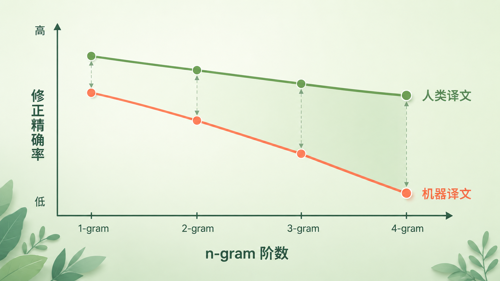
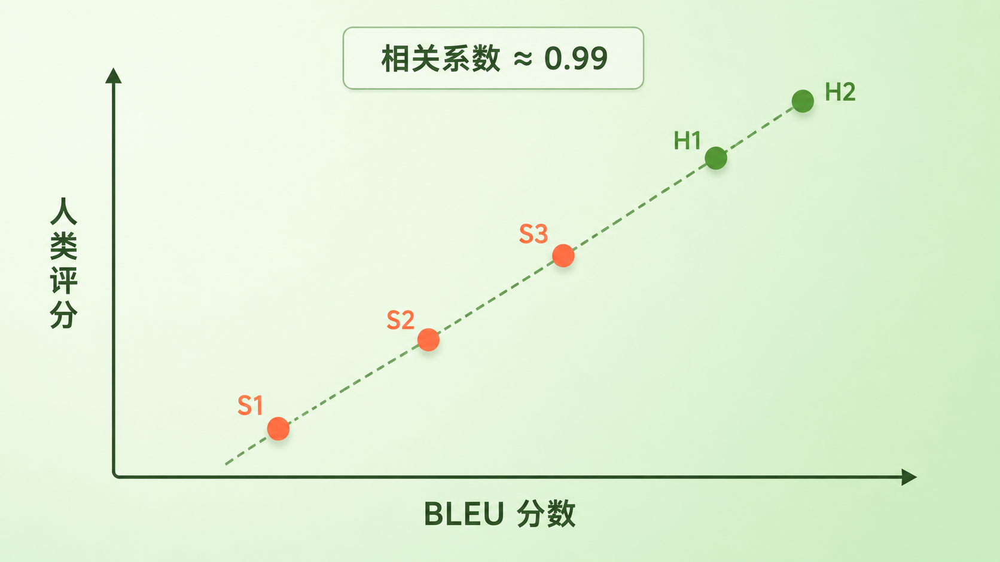

+++
title = "论文里程碑 #5：BLEU"
description = "BLEU 把「翻译好不好」变成一个秒级可算的数字，让机器翻译终于有了能日夜迭代的标尺——也立下了「用代理指标优化质量」这把双刃剑。"
date = 2026-06-09
tags = ["LLM", "论文里程碑", "BLEU", "机器翻译", "评测指标", "n-gram", "NLP", "Papineni"]
categories = ["LLM"]
series = ["论文里程碑"]
showTableOfContents = true
+++



> 一句话摘要：BLEU 把「翻译好不好」变成一个秒级可算的数字，让机器翻译终于有了能日夜迭代的标尺。

## 一、2002 年：改一版模型，要等上几周

2002 年，机器翻译的研究者们正卡在一个尴尬的地方。模型不是不能改，是改完之后没人说得清到底变好了还是变坏了。要判断一句翻译的好坏，得请懂双语的人坐下来，一句一句打分——一轮评测做下来要好几周，还得花一大笔钱。于是怪圈出现了：评测太慢，迭代就快不起来；迭代快不起来，模型就进步缓慢。那一年，IBM 的几位研究者发了一篇论文，提出一个叫 BLEU 的东西。它的主张近乎冒犯：翻译质量这种「只有人才懂」的事，可以交给一个公式，几秒钟算完。

## 二、慢，是因为那把尺子太贵

要理解 BLEU 的分量，得先理解当时「评测」有多贵。机器翻译从 1990 年代的统计方法（见本系列 #5 *A Statistical Approach to Machine Translation*）起步后，研究范式已经变成「调一版、测一版、再调一版」。问题是「测一版」这一步死活快不起来。

麻烦的根源在于：一句话的翻译没有唯一正确答案。同一个意思，十个人能写出十种说法，措辞、语序都不一样。所以判断好坏只能靠人——找懂双语的评委，逐句给流畅度和忠实度打分。这套流程慢、贵，而且不同评委口味不同，今天测的结果跟上个月未必可比。

结果就是，研究者一年也跑不了几轮正经评测。每一次模型改动都像在黑暗里下注，要等上好几周才知道押对了没有。瓶颈不在模型，而在那把量质量的尺子本身。

## 三、BLEU 做对了什么

### 论文说了什么

**第一，翻译好不好，可以不靠人来判断，而靠「和参考译文有多接近」来算。** 这是 BLEU 的核心主张：给定机器译文和几句人工参考译文，质量就等于它们之间的「重合程度」——重合得多就好，少就差。一个不懂意思、只会对照的公式，居然能逼近人的判断。

**第二，一个真正能用的自动指标，必须同时堵住两个作弊口子：不能靠重复高频词蒙混过关，也不能靠缩短句子骗高分。** BLEU 用「截断精确率」堵第一个，用「简短惩罚」堵第二个。这两道防线，才是它从一个朴素想法变成可用指标的关键。

这套办法到底准不准？论文让 BLEU 给 5 个翻译系统打分——其中 3 个是机器系统，2 个是人类译者——再请两组共 20 位评委独立打分。在这组小规模的系统级实验里，两边排出来的名次几乎一模一样：人类译者 H2 第一、H1 第二，然后断崖式领先机器系统 S3 > S2 > S1，BLEU 分数与人类评分的相关系数高达 **0.99**。一个不懂意思的公式，居然复现了一屋子人的排序。要强调的是，这个亮眼数字属于当时的特定实验——它说明方向对了，但并不等于 BLEU 在所有任务、语言对和设置下都同样可靠，这一点后文会回到。

### 论文怎么做到的

> 把 BLEU 想象成一个不读懂句子、只做对照的批改员：它把你的译文和标准答案摆在一起，数你写出来的词和词组，有多少在标准答案里出现过。

最朴素的做法是算「精确率」——译文里的词，有多大比例命中了参考译文。但这里有个大洞。假设机器输出了一句 `the the the the the the the`，而「the」恰好在参考译文里出现过，那七个词全部命中，精确率满分。这显然是胡来。

BLEU 的第一招叫**截断（clipping）**：每个词最多按它在参考译文里出现的最高次数来记。「the」在参考里最多出现 2 次，那么七个「the」里最多只算对 2 个，精确率立刻从 7/7 掉到 2/7。这就是论文里的**修正 n-gram 精确率（modified n-gram precision）**——它掐死了「靠堆高频词刷分」这条捷径。

*图：随着 n-gram 阶数升高，机器译文的精确率比人类译文掉得快得多——这正是 BLEU 能把人和机器区分开的视觉证据。*

那为什么要从 1 阶一直算到 4 阶？因为单个词（unigram）管的是「用词对不对」，而连续的 2、3、4 个词组成的词组（高阶 n-gram）管的是「语序顺不顺」。一句词都对、但顺序全打乱的译文，unigram 精确率很高，4-gram 精确率却会塌掉。把 1 到 4 阶的精确率揉成一个数，忠实度和流畅度就被同时管住了。

但精确率还有个反向漏洞：它只看「我说出口的词对不对」。那我干脆少说几个词、只输出最有把握的那几个——精确率自然飙高。BLEU 的第二招就是为这个口子准备的，叫**简短惩罚（brevity penalty）**：译文比参考译文短，就按差距指数级扣分。

把两招合起来，BLEU 的完整算法是：先把 1 到 4 阶的修正精确率取几何平均，再乘上简短惩罚。

$$
\text{BLEU} = \text{BP} \cdot \exp\left(\sum_{n=1}^{4} w_n \log p_n\right)
$$

式子里 \(p_n\) 是第 n 阶的修正精确率，\(w_n\) 是权重（通常四阶各占 1/4），\(\text{BP}\) 就是简短惩罚。指数和对数只是把「几何平均」写得好看一点。直觉上它就一句话：四种粒度的重合度乘到一起，任何一种太差都会把总分往下拖；最后再用句子长度校准一次。

而简短惩罚本身也很简单：

$$
\text{BP} = \begin{cases} 1, & c > r \\ e^{1 - r/c}, & c \leq r \end{cases}
$$

这里 \(c\) 是机器译文的总长度，\(r\) 是参考译文的长度——有多句参考时，\(r\) 取与每个候选句最接近的那条参考长度，再在整个语料上累加，这叫**有效参考长度（effective reference length）**。译文够长（\(c > r\)）就不罚；一旦偏短，\(r/c\) 变大，惩罚指数级增长。这一项专门掐死「用沉默换精确率」的小聪明。

这套设计真正聪明的地方，不在任何一个单独的公式，而在它把「翻译质量」这个模糊概念，拆成了几个可以分别防守的方向：用词对不对（截断精确率挡住重复刷词）、句子完不完整（简短惩罚挡住偷工减料）、语序顺不顺（多阶 n-gram 顺带管了）。每一项单看都不完美，合在一起却足够稳——稳到能复现人类评委的排序。

值得记住的是，这一整套算法是套在整个语料上累加出来的：BLEU 天生是给一批译文打总分的指标。单句也能算，但只要某一阶 n-gram 命中为零，整句分数就会被拉到零，所以句子级 BLEU 很不稳，通常得额外做平滑才好用。

*图：在论文这组实验里，BLEU 分数与人类评分高度线性相关（相关系数约 0.99）——它有力地说明这个公式不是在另算一套东西，而是在逼近人的判断。*

## 四、它改变了什么

短期来看，BLEU 发表后迅速成了机器翻译研究的通用货币。NIST、WMT 等评测长期把它当作重要的自动指标和基线之一——尽管从来不是唯一标准，人工评测以及后来的 METEOR、chrF、COMET 等始终在场。但 BLEU 让评测从「几周一轮」变成「几秒一轮」，研究者可以一天试几十个想法，自动留下涨分的、丢掉掉分的。整个领域的迭代速度被解锁了——这正是 2000 年代统计机器翻译突飞猛进背后那台隐形引擎之一。

而 BLEU 真正深远的影响，是它给整个 NLP 立下了一种范式：把一个本来需要人判断的能力，换成一个可自动计算的**代理指标（proxy metric）**，然后对着这个数字优化。

这个范式好用到危险。因为 BLEU 终究只是「和参考译文的字面重合度」，它并不懂意思：它偏重精确率，几乎不会奖励同义改写和语义等价——一句意思完全正确、只是换了说法的翻译，BLEU 可能很低；一句生硬拼凑、却碰巧用词重合的译文，BLEU 可能虚高。它甚至不是一个稳定的数：分词方式、大小写、参考译文数量、平滑策略，任何一项不一致，两个 BLEU 分就不能直接比——后来 SacreBLEU 这类工作专门出来立规矩，要求大家报告统一的计算口径，正是因为这个乱象。而一旦分数本身变成了优化目标，系统就会开始迎合分数，而不是迎合质量——这就是后来被反复引用的 Goodhart 定律。

我认为，与其说这是 BLEU 的缺陷，不如说是所有自动指标共有的「原罪」——只是在它身上第一次大规模地显形。今天我们吐槽大模型「刷榜」、吐槽 benchmark 失真，那套底层逻辑，BLEU 在 2002 年就立下了。它既是机器翻译的功臣，也是「指标会骗人」这个故事的第一个主角。

## 五、与主线的接口

**如果你想深入……**

这篇论文的核心概念，对应我们 LLM 系列的「评测与观测」章节：

- 「评测全景：别被榜单骗了，Goodhart 定律悬在头顶」— 讲了为什么任何一个被拿来当优化目标的分数，最终都会通胀、失真
- 「分数为何经常骗人：平均分掩盖长尾灾难」— 讲了单一总分如何把关键场景的失败悄悄平均掉
- 「LLM-as-Judge：自动评分的边界与正确打开方式」— 讲了在大模型时代，自动评分演化成了什么新形态，又带来了哪些新陷阱

读完这些，你对 BLEU 的理解会从历史印象变成可操作的工程认知：它不只是机器翻译的一段往事，而是今天每一张排行榜背后都还在起作用的那套逻辑的起点。

## 六、写在最后

读这篇之前，你可能觉得 BLEU 只是机器翻译里一个技术性的评分公式。读完之后会发现，它其实是 NLP 在「质量怎么自动量化」这个问题上，最早、也最有影响的一次系统性回答——以及这个问题为什么注定没有完美答案。

下一篇，我们看同一篇章的 *Latent Dirichlet Allocation*。当 BLEU 在解决「怎么评判一段输出」时，LDA 面对的是另一个方向的难题：面对成千上万篇没人标注过的文档，怎么让模型自己摸出潜藏在里面的主题结构。

## 七、参考资料

- 论文原文：Papineni, K., Roukos, S., Ward, T., & Zhu, W.-J. (2002). *BLEU: a Method for Automatic Evaluation of Machine Translation*. ACL 2002. [aclanthology.org/P02-1040](http://aclanthology.org/P02-1040)
- 作者：Kishore Papineni、Salim Roukos、Todd Ward、Wei-Jing Zhu（均来自 IBM T. J. Watson 研究中心）
- 延伸阅读：Post, M. (2018). *A Call for Clarity in Reporting BLEU Scores*（SacreBLEU）. WMT 2018. [arxiv.org/abs/1804.08771](http://arxiv.org/abs/1804.08771) —— 为什么不统一口径的 BLEU 分数不可直接比较
- 延伸阅读：Callison-Burch, C., Osborne, M., & Koehn, P. (2006). *Re-evaluating the Role of BLEU in Machine Translation Research*. EACL 2006 —— 系统性讨论 BLEU 的局限与误用
- 延伸阅读：本系列 #5 *A Statistical Approach to Machine Translation*（统计机器翻译的理论起点）
