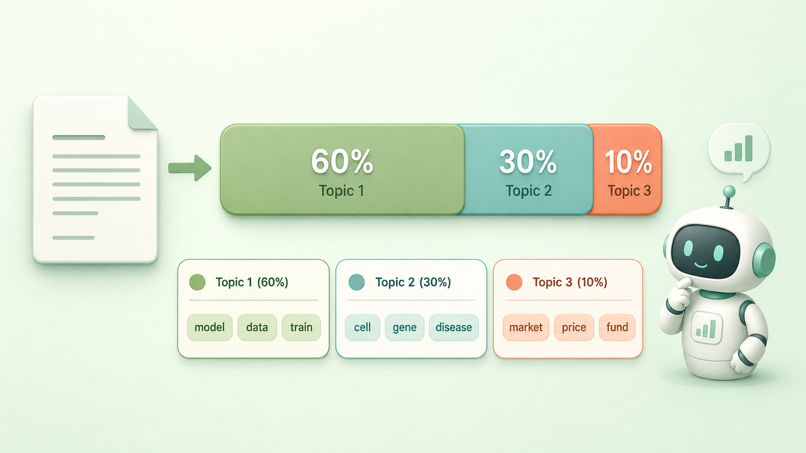
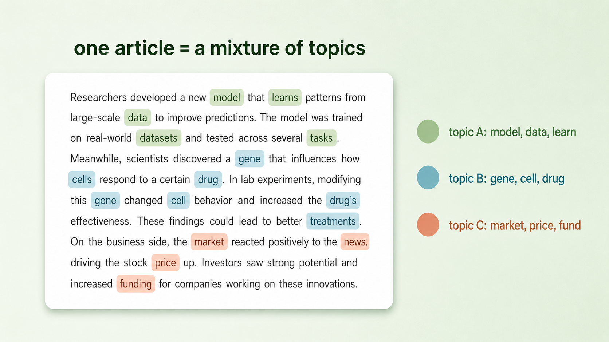
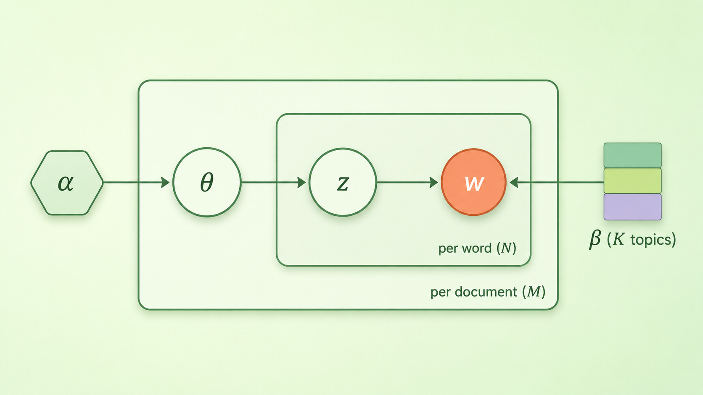

+++
title = "论文里程碑 #6：Latent Dirichlet Allocation"
description = "在前人 LSA、pLSI 的基础上，LDA 用一套更完整的贝叶斯生成模型，让机器无监督地理出文档背后的主题结构。"
date = 2026-06-14
tags = ["LLM", "论文里程碑", "主题模型", "LDA", "topic model", "贝叶斯生成模型", "无监督学习", "NLP"]
categories = ["LLM"]
series = ["论文里程碑"]
showTableOfContents = true
+++



> 在前人 LSA、pLSI 的基础上，LDA 用一套更完整的贝叶斯生成模型，让机器无监督地理出文档背后的主题结构。

## 2003：文本变成洪水的那一年

2003 年，互联网正在把文本变成一种新的洪水。门户网站、新闻库、论文数据库里堆着几十万、上百万篇文档，没有人读得完，也没有人愿意一篇篇贴标签。就在这一年，David Blei、Andrew Ng 和 Michael Jordan 三个人发表了一篇题为 *Latent Dirichlet Allocation* 的论文——这几个名字后来都成了机器学习领域响当当的人物。

它想回答一个朴素到近乎天真的问题：**能不能让机器自己读完一大堆文章，然后告诉你它们到底在聊哪些「话题」，而且全程不需要任何人事先给出答案？**

这个问题今天听起来理所当然，但在那个还没有深度学习、连「词向量」都尚未流行的年代，它是一道结结实实的难题。

## 在 LDA 之前，机器没有「主题」这个概念

要体会这篇论文的分量，得先看看在它之前，人们是怎么对付「这篇文档在讲什么」的。

最朴素的办法是数词频（TF-IDF）：把一篇文档拆成一袋互不相干的词，谁出现得多又足够独特，就认为它重要。可这套办法看到「苹果」分不清是水果还是公司，更说不出「这篇文章 60% 在谈科技、30% 在谈财经」——因为它脑子里根本没有「主题」这个东西。

往前一步是潜在语义分析（Latent Semantic Analysis, LSA）：用矩阵分解把词-文档表压缩到几十个「潜在维度」。这是第一次有了「隐藏维度」的味道，但那些维度是抽象的数学方向，带着负数，没法解释，也谈不上概率含义。

再往前一步，是 LDA 的直接前辈——概率潜在语义索引（pLSI）。它第一次把「主题」定义成词上的概率分布，把文档看成主题的混合。方向完全对了，可它有一个致命的结构性毛病。那个毛病，正是 LDA 要来收拾的。

## 论文说了什么

*图：LDA 的核心直觉——一篇文档不是属于某一个主题，而是若干主题按比例的混合，而每个主题又是一袋有偏好的词。*

LDA 的贡献可以收成三句话。

**第一，一篇文档不属于某一个主题，而是多个主题按比例的混合。** 一篇讲「AI 制药」的报道，可以是 60% 的「机器学习」、30% 的「生物医学」、10% 的「资本市场」。LDA 把这个我们读文章时天然就有的直觉，第一次写成了可计算的模型。

**第二，每个「主题」本身，是词表上的一个概率分布。** 「体育」主题里「球员、比赛、赛季」概率高，「金融」主题里「利率、股票、美元」概率高。主题不是贴在文档上的标签，而是一套对词的偏好。

下面这张图是 LDA 跑在真实新闻上的样子——同一篇文章里，不同颜色的词来自不同主题：

*图：同一篇文章里，不同颜色的词来自不同主题——这就是「文档是主题的混合」最直观的样子。*

**第三，也是最关键的，它给了主题模型第一个干净的生成式概率框架，顺手修好了前辈 pLSI 的过拟合。** pLSI 的问题，用论文自己的话说：模型参数量会随语料规模线性增长，因此一旦文档变多就严重过拟合；而且它没法给训练集之外的新文档赋一个概率——来了篇没见过的文章，模型就卡住了。LDA 用一个看似微小、实则釜底抽薪的改动解决了这两件事，下面就讲它是怎么做到的。

## 论文怎么做到的

先讲那个改动背后的直觉。

> 想象你要「假装」批量生产一堆文章。LDA 说：写每篇文章之前，你先掷一个特殊的骰子，定下这篇文章里各个主题的比例（比如 70% 科技、30% 财经）；然后每写一个词，你先按这个比例随机挑一个主题，再从那个主题的词袋里随机摸一个词。重复到写完。整篇文章，就是这么被「生成」出来的。

把这个故事写成三层结构，就是 LDA 这个「三层贝叶斯生成模型」的全部：

- **语料层**：整个语料库共享 K 个主题，每个主题 \(\beta_k\) 是词表上的一个分布；
- **文档层**：对每篇文档，先抽一组主题比例 \(\theta_d \sim \text{Dir}(\alpha)\)；
- **词语层**：对文档里第 n 个词，先按比例抽一个主题 \(z_{d,n} \sim \text{Mult}(\theta_d)\)，再按该主题抽一个词 \(w_{d,n} \sim \text{Mult}(\beta_{z_{d,n}})\)。

把一篇文档完整生成出来的概率，就是把这套动作连乘起来：

$$
p(\theta, \mathbf{z}, \mathbf{w} \mid \alpha, \beta) = p(\theta \mid \alpha) \prod_{n=1}^{N} p(z_n \mid \theta)\, p(w_n \mid z_n, \beta)
$$

别被符号吓到。这行公式从左到右，讲的就是上面那个故事：先掷骰子定下主题比例 \(\theta\)，然后对文档里的每一个词，都重复「先选主题 \(z\)、再选词 \(w\)」这两步，把每个词的概率乘到一起，就得到整篇文档的生成概率。

这里藏着一个关键假设：每个词都是独立地、不分先后地被摸出来的。换句话说，LDA 把文档当成一个「词袋」（bag of words）——只在乎哪些词一起出现，不在乎它们的顺序和句法。这是它简洁的根源，也是它的天花板：它能说清一篇文章在聊哪些主题，却读不懂一句话的结构。

那名字里的「Dirichlet」是从哪来的？关键在 \(\theta\)——它是一组加起来等于 1 的比例，住在一个叫单纯形（simplex）的空间里。要给「比例」这种东西配一个先验分布（prior），狄利克雷分布（Dirichlet distribution）天生就是干这个的：它专门用来生成一组和为 1 的正数，是「分布的分布」。参数 \(\alpha\) 则控制这些比例的形状：\(\alpha\) 越小，文档越倾向于由少数几个主题主导，主题分布更稀疏；\(\alpha\) 越大，则越倾向于摊到很多主题上、更均匀。这就是 Latent Dirichlet Allocation 的字面意思——用 Dirichlet 去分配（allocate）潜在的（latent）主题。

到这里都是「正着生成」。可现实里我们只看得到词 \(w\)，看不到主题比例 \(\theta\)，也看不到每个词背后的主题 \(z\)。真正要做的事是倒过来：给定一篇真实文章，反推「它最可能由哪些主题、按什么比例混成」。这一步的后验分布（posterior）算不出闭式解——\(\theta\) 和主题耦合在一起，分母是个积不出来的积分。论文的办法是变分推断（Variational Inference）：另造一个简单、可计算的分布去逼近真实后验，把「推断」变成「优化」。

随后，2004 年，Griffiths 与 Steyvers 给出了另一条更好实现的路子——折叠版的吉布斯采样（collapsed Gibbs sampling）。它的直觉很朴素：反复地为文档里每一个词重新猜它属于哪个主题，每次猜都同时看两件事——「这篇文档目前偏爱哪些主题」和「这个主题平时偏爱哪些词」，猜上很多轮，整个语料的主题归属就稳定下来了。（顺带一提，这个版本还会给主题-词分布 \(\beta\) 也加一层 Dirichlet 先验 \(\eta\)——原论文里 \(\beta\) 还只是一组待估计的参数——从而凑成一个更彻底的贝叶斯模型。）正是这条路子，让 LDA 真正走进了千万人的工具箱。

*图：方框（plate）代表「重复」——外框是每篇文档重复一次，内框是文档里每个词重复一次；顺着箭头看，就是「先定主题比例 θ，再为每个词选主题 z、选词 w」的生成顺序。*

回到那个「微小却釜底抽薪」的改动：pLSI 把每篇训练文档的主题比例当成一组要单独学的参数，文档越多参数越多，于是过拟合、也接不住新文档；LDA 则把主题比例 \(\theta\) 改成一个从 Dirichlet 里抽出来的隐变量（latent variable）。模型要学的只剩下 \(\alpha\) 和那 K 个主题，参数量固定，新来一篇文章照样能套同一套生成故事去解释。这套「先写好生成剧本，再倒推隐藏变量」的思路，正是贝叶斯生成模型的精髓。

## 它改变了什么

短期看，LDA 几乎是凭一己之力把「主题模型」催熟成了一个完整的子领域。它之后，变体层出不穷：追踪主题随时间演变的动态主题模型、让主题之间相互关联的相关主题模型、带标签的有监督 LDA……在之后近十年里，数字人文、社会科学、生物信息、信息检索、推荐系统里几乎每一条文本挖掘流水线，都跑过 LDA。它一度就是「在没有标注的情况下理解大规模文本」的默认答案。

但把时间尺度拉长，LDA 更像是一个范式的巅峰，同时也是它的终点。它代表了一整套世界观：把文本看成词的计数，用优雅的概率生成模型去解释这些计数，而主题是人能读懂的词分布。这套范式干净、可解释、数学漂亮。

当然，它的短板也很实在：主题数 K 要靠人工事先拍定；遇到一条微博、一句搜索这样的短文本，词太少几乎估不准；跑出来的主题有时清晰、有时含混，可解释性并不总是稳定。再加上前面说的词袋假设，它终究读不懂词序和上下文。这些短板，恰好就是下一代方法要去解决的。

可就在 LDA 发表十年后，2013 年，Word2Vec 来了。它把「理解文本」从「数词 + 猜主题」彻底换成了「把每个词压成一个稠密向量」——意义不再是一张能读懂的主题比例表，而是高维空间里的几何关系。再往后，BERT 和 GPT 连「词袋」这个假设都一并扔掉，顺序和上下文全都回来了。

我的判断是：LDA 是「可解释」这一派，在被深度学习的浪潮淹没之前，最后也最辉煌的一座纪念碑。今天的大模型在某种意义上站到了它的反面——能力强出几个数量级，但你再也没法像读 LDA 的主题词表那样，直接看出「模型认为这篇文章由哪些主题构成」。LDA 真正的遗产，不是算法本身（工业界如今已很少直接用它），而是两个还在发光的念头：文档是若干隐含成分的混合；以及，用生成模型加隐变量去解释观测到的数据——这正是今天的 VAE、扩散模型乃至大模型预训练共享的那条贝叶斯式直觉。

## 与主线的接口

**如果你想深入……**

LDA 想解决的那个问题——无监督地搞清楚一大堆文本到底在讲什么——在今天的 LLM 工程里并没有消失，只是换了实现方式。它对应我们 LLM 系列的「数据工程」章节：

- **「质量过滤：从启发式到 Quality Classifier」**——现代数据流水线怎么判断一段文本「在讲什么、值不值得喂给模型」，靠的是分类器和 embedding，而不再是主题分布；
- **「配比（Mixture）是一门艺术」**——怎么按领域和主题把语料配成想要的能力，LDA 当年「发现主题」的工作，如今变成了语料构成的工程决策。

读完这些，你对 LDA 的理解会从「一个经典的老算法」，变成「现代 LLM 数据工程里那条无监督文本理解暗线的源头」。

## 写在最后

读这篇之前，「机器理解一篇文章」在你脑子里也许还是个模糊的黑箱。读完之后，你至少知道：在 embedding 时代到来之前，曾有过这样一套清清楚楚、能用一句生成故事讲明白的方法——文档是主题的混合，主题是词的分布，而藏在背后的那只手，是贝叶斯。

而紧接着 LDA 的下一站，就是那篇真正掀翻桌子的论文：2013 年的 Word2Vec。它会告诉机器，理解一个词不必先理解「主题」，只要看它常和谁做邻居。下一篇见。

## 参考资料

- 论文原文：Blei, D. M., Ng, A. Y., & Jordan, M. I. (2003). *Latent Dirichlet Allocation*. Journal of Machine Learning Research, 3, 993–1022. [https://www.jmlr.org/papers/volume3/blei03a/blei03a.pdf](https://www.jmlr.org/papers/volume3/blei03a/blei03a.pdf)
- 作者：David Blei（哥伦比亚大学）、Andrew Ng（斯坦福大学）、Michael I. Jordan（加州大学伯克利分校）
- 延伸阅读：Griffiths, T. L., & Steyvers, M. (2004). *Finding Scientific Topics*. PNAS——给出 LDA 的 collapsed Gibbs sampling 实现，是 LDA 大规模普及的关键推手。
- 延伸阅读：Blei, D. M. (2012). *Probabilistic Topic Models*. Communications of the ACM——作者本人写的主题模型通俗综述。
