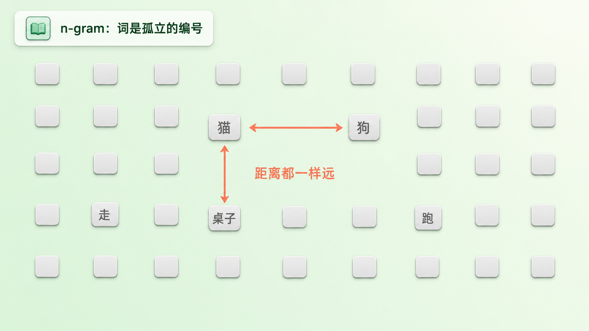
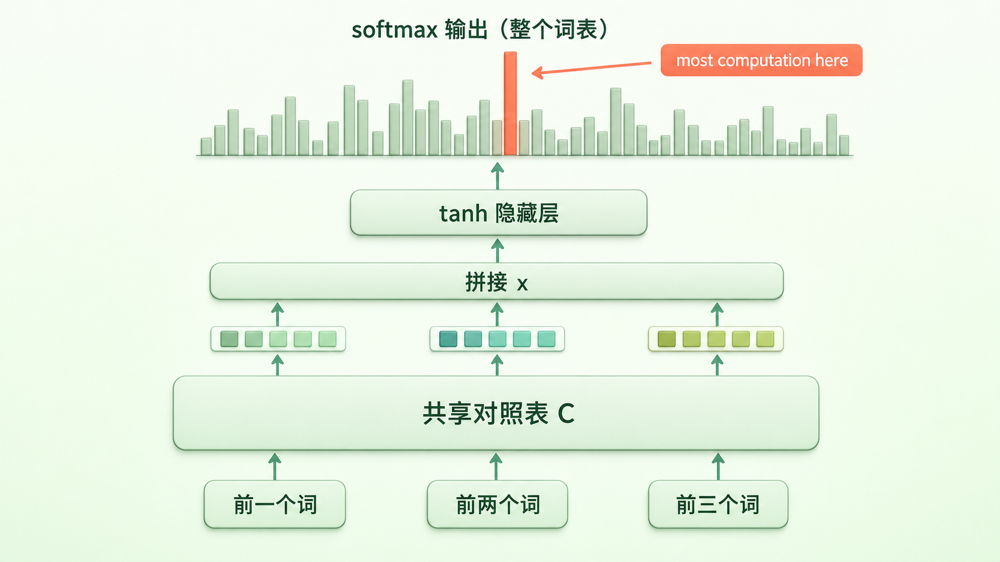
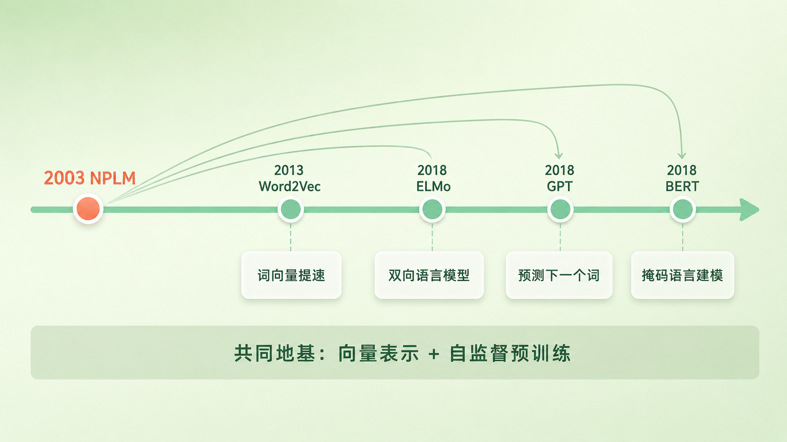

+++
title = "论文里程碑 #7：A Neural Probabilistic Language Model"
description = "它第一次把大规模语言建模、分布式词向量和端到端训练拧成一股绳——现代词嵌入路线的关键起点之一。"
date = 2026-06-17
tags = ["LLM", "论文里程碑", "词嵌入", "word embedding", "神经语言模型", "Bengio", "维度灾难", "NLP"]
categories = ["LLM"]
series = ["论文里程碑"]
showTableOfContents = true
+++



> 它第一次把大规模语言建模、分布式词向量和端到端训练拧成一股绳——现代词嵌入路线的关键起点之一。

## 2003 年：被「维度灾难」困住的语言模型

2003 年，统计语言模型的世界由 n-gram 统治。想让机器算出「下一个词是什么」，标准做法是数数：在海量文本里统计「the cat is」后面跟「walking」出现了多少次。这套方法撑起了那个年代的语音识别和机器翻译，但所有人心里都清楚——它撞上了一堵墙。词表里有几万个词，稍微长一点的词组合数量就是天文数字，绝大多数组合在训练语料里一次都没出现过，模型只能干瞪眼。

这一年，Yoshua Bengio 和三位合作者在《机器学习研究杂志》（JMLR）上发表了一篇标题平平无奇的论文：*A Neural Probabilistic Language Model*。它没有立刻引爆领域，却埋下了一颗十年后才完全发芽的种子——词嵌入。

## 那堵墙叫「维度灾难」

先说清楚 n-gram 是怎么工作的。它假设下一个词只取决于前面几个词，于是把「预测下一个词」简化成查表统计：在语料里数「前两个词是 A、B 时，第三个词是 C」出现了多少次。问题在于，语言的组合是爆炸式的。词表有一万七千个词，三个词的组合就有上万亿种，而你的训练语料可能只有几百万个词。结果就是绝大多数合理的句子模型从没见过，只能给出概率零。

研究者用各种平滑（smoothing）技巧打补丁，给没见过的组合分一点概率。但这治标不治本，因为传统的词级 n-gram 有一个更根本的缺陷：它把每个词都当成一个孤立的符号，词与词之间毫无关系。在它眼里，「猫」和「狗」之间的距离，跟「猫」和「桌子」之间的距离一模一样——都只是词表里两个不同的编号而已。（当时也有人用 class-based n-gram，先把词归成若干离散的类别来缓解这个问题，但离散类别的表达力，终究比不上连续的向量。）

Bengio 举了一个后来被引用无数次的例子：如果模型在训练时见过「The cat is walking in the bedroom」，按理说它应该能推断「A dog was running in a room」也是个合理的句子——因为猫和狗相似、走和跑相似、卧室和房间相似。但 n-gram 做不到这种举一反三，因为它压根不知道这些词是相似的。

*图：在 n-gram 眼里，每个词只是词表里一个孤立的编号——「猫」和「狗」的距离，跟「猫」和「桌子」一样远*

## 论文说了什么

先把话说清楚：用神经网络做语言模型、用连续向量表示词，都不是 Bengio 第一个想到的——在他之前已有一些零星的尝试。这篇论文真正的分量在于，它第一次把这些零散的想法拧成一个完整方案：能在大规模语料上跑通，还正面打败了当时最强的基线。它的核心可以浓缩成两句话。

**第一，与其把词当成孤立的编号，不如给每个词学一个连续的向量，让意思相近的词在空间里彼此靠近。** 这个向量就是后来人人都在说的「词嵌入」（word embedding）。论文里它的维度只有 30 到 100 维——相比动辄上万的词表，这是一次剧烈的压缩。压缩丢掉的是「每个词独一无二」的执念，换回来的是「相似的词共享相似的表示」。

**第二，用一个神经网络同时学这两样东西——词的向量表示，和「根据前几个词预测下一个词」的概率函数。** 关键在「同时」：词向量不是事先准备好的，而是在训练预测任务的过程中自己长出来的。模型为了把下一个词预测得更准，被迫把「猫」和「狗」放到相近的位置，因为它俩出现的上下文确实太像了。

证据是困惑度（perplexity）。你可以把它粗略理解成：模型每预测一个词，平均要在多少个候选里纠结——越低越好。按原论文的口径：在 Brown 语料（约 118 万词）上，当时调得最精细的 n-gram，困惑度比这个神经网络还高出约 24%；换到更大的 AP News 语料（约 1400 万词），也高出约 8%。在一个被 n-gram 打磨了十几年的赛道上，一个新方法第一次出场就把最强基线甩在身后，这个信号很难被忽略。

## 论文怎么做到的

先用一个类比建立直觉。

> 给词表里的每个词发一张「坐标卡」，把它放进一个几十维的空间里。这些坐标一开始是随机的、毫无意义的；但网络在反复预测下一个词的过程中，会不断微调每张卡的位置。预测对了，就稍微强化当前的摆位；预测错了，就把相关的词朝更合理的方向挪一点。训练足够久之后，「猫」和「狗」会自己飘到一起，「周一」到「周日」会排成一串——因为它们出现的上下文太像了。

把这个直觉拆成网络的四步，是这样的：

第一步，**查表**。模型不直接处理词，而是先把每个词换成它的向量。这张「词 → 向量」的对照表就是矩阵 \(C\)，大小是「词表大小 × 向量维度」，全网络共享同一张表。

第二步，**拼接**。把前 \(n-1\) 个词的向量首尾接成一个长向量 \(x\)，作为「上下文」的表示。

第三步，**非线性变换**。让 \(x\) 过一个带 tanh 的隐藏层，提取上下文里的组合信息。

第四步，**打分并归一化**。输出层给词表里每一个词打一个分，再用 softmax 把这些分变成加起来等于 1 的概率分布。

*图：模型从下往上的四步——底部每个词查同一张对照表 C 变成向量，拼接成上下文，过 tanh 隐藏层，顶部 softmax 在整个词表上输出概率；softmax 这一步也是计算量最大的瓶颈*

整个网络算的是这样一个函数：

$$
y = b + Wx + U\tanh(d + Hx)
$$

别被符号吓到，它说的就是上面第三、四步：\(\tanh(d+Hx)\) 是隐藏层的输出，\(U\) 把它映射成词表大小的一串分数；额外的 \(Wx\) 是一条从输入直连输出的「捷径」，让模型在需要时绕过隐藏层。最后对 \(y\) 做 softmax，就得到「下一个词是某个词」的概率。（想对上维度的话：拼接向量 \(x\) 有 \((n-1)m\) 维，隐藏层权重 \(H\) 是 \(h\times(n-1)m\) 的矩阵，输出层权重 \(U\) 是 \(|V|\times h\)——留意 \(U\) 的行数正好是词表大小 \(|V|\)，这就是下面那个瓶颈的根源。）

但这套设计真正聪明的地方不在网络结构，而在**词向量** \(C\) **是和网络其他参数一起被训练的**。它不是事先备好喂进去的，而是在「预测下一个词」这个任务的压力下自己长出来的。这就带来了 n-gram 永远给不了的能力：因为输出概率是词向量的**光滑函数**——某个词的向量挪动一点点，预测概率也只跟着挪一点点——所以一旦「狗」的向量靠近了「猫」、「跑」靠近了「走」，模型见过「the cat is walking」之后，自动就会觉得「a dog was running」也挺合理。当年 n-gram 死活学不会的举一反三，在这里成了免费的副产品。

*图：训练之后，「猫」和「狗」、一周七天各自抱团，「桌子」远远独处——含义上的相似，变成了空间里的距离*

代价也很现实。最后那步 softmax 要在整个词表（上万个词）上做归一化，每预测一个词都得把所有词过一遍——这是整个模型计算量的大头。论文里训练一次要在并行计算机上跑好几周。这个「昂贵的 softmax」后来成了一道公开的难题：2013 年的 Word2Vec 用更轻量的 Skip-gram / CBOW 把训练做快（负采样是它同年稍晚的后续工作里才系统提出的提速技巧），Collobert 用排序损失另辟蹊径——大家抢着要绕开的，都是这个「每预测一个词都得扫一遍整张词表」的瓶颈。

## 它改变了什么

**短期影响**：说实话，这篇论文在当时并没有立刻引爆领域。2000 年代的算力撑不起它的胃口，那个昂贵的 softmax 让大规模训练举步维艰，而统计机器翻译和 n-gram 在工业界又用得好好的。所以在之后好几年里，神经语言模型更像是一小撮人坚持的方向，而不是主流。但它确实把这条路立住了——2011 年 Collobert 和 Weston 那篇 *Natural Language Processing (Almost) from Scratch*，用的正是「预训练词向量 + 神经网络」的思路，把它推广到了词性标注、命名实体识别等一系列任务上。

**长期影响**：真正的引爆点是 2013 年的 Word2Vec。它把 Bengio 这套框架剥到最简、训练速度提了好几个量级，词嵌入这才从论文走进了每一个 NLP 工程师的工具箱。再往后，ELMo、GPT、BERT 这些预训练模型，都继承了这篇论文立下的两块地基——**用连续向量表示词，用在原始文本上的自监督预训练学这套表示**。只是具体的训练目标各走各路：GPT 直接沿用了「预测下一个词」；ELMo 改成双向语言模型，用来生成随上下文变化的词表示；BERT 干脆把目标换成了「完形填空」式的掩码语言建模，不再逐词从左到右地预测。地基是同一块，盖出来的楼并不一样。

*图：从 2003 年的 NPLM 出发，后来的模型分叉成不同的训练目标——Word2Vec 把词向量做轻、GPT 预测下一个词、ELMo 走双向语言模型、BERT 走掩码语言建模；共享的是「向量表示 + 自监督预训练」这块地基*

我认为这篇论文被低估了很久。它在 2003 年就押中了后来被反复验证的两件大事：分布式的词向量表示，和在原始文本上做自监督预训练的思路。它没能在当时兑现，不是因为想法不对，而是因为算力还没追上。你甚至可以说，今天的 GPT 做的还是 Bengio 当年那件事——根据前文预测下一个词——只不过把前馈网络换成了 Transformer，把几十维的向量和几百万词的语料，放大了不止一亿倍。

## 与主线的接口

**如果你想深入……**

这篇论文同时踩在 LLM 主线两个最基础的概念上，对应两处：

- 「语言模型到底在建模什么：序列概率与链式法则」— 讲了为什么「预测下一个词」就足以建模整段文本的概率，这正是 Bengio 这个网络在优化的目标
- 「词嵌入：从 token id 到向量」与「向量空间的几何直觉」— 讲了 embedding 矩阵怎么把离散的词变成连续向量，以及为什么相似的词会在空间里聚到一起、还能做类比运算

读完这些，你对 *A Neural Probabilistic Language Model* 的理解会从「历史上的一个神经语言模型」变成可操作的工程认知。

## 读完这篇，你拿到了什么

读之前，你可能觉得「词嵌入」是深度学习时代才冒出来的新东西。读完之后，时间线清楚了：早在 2003 年，Bengio 就用一个前馈神经网络，把「预测下一个词」和「给每个词学一个向量」这两件事捆在一起，做成了第一个能打的完整方案。它治好了 n-gram 最大的毛病——不会举一反三；它留下的最大难题——昂贵的 softmax，又成了后来一连串工作的起跑线。最重要的是，它同时立起了现代大模型的两块地基：词的向量表示，和在原始文本上自监督预训练的思路。

下一篇，我们顺着这条线往前走一步，看 2011 年的 *Natural Language Processing (Almost) from Scratch*。如果说 Bengio 证明了「词可以用学出来的向量表示」，那 Collobert 和 Weston 要回答的是下一个问题：这些预训练出来的词向量，能不能用一套统一的神经网络打通词性标注、命名实体识别、语义角色标注一大堆 NLP 任务，把延续了几十年的手工特征工程一脚踢开？

## 参考资料

- Bengio, Y., Ducharme, R., Vincent, P., & Jauvin, C. (2003). A Neural Probabilistic Language Model. *Journal of Machine Learning Research*, 3, 1137–1155. [论文原文](https://www.jmlr.org/papers/volume3/bengio03a/bengio03a.pdf)
- 作者：Yoshua Bengio、Réjean Ducharme、Pascal Vincent、Christian Jauvin（蒙特利尔大学）
- 延伸阅读：Mikolov, T. et al. (2013). Efficient Estimation of Word Representations in Vector Space (Word2Vec). [arXiv:1301.3781](https://arxiv.org/abs/1301.3781)
- 延伸阅读：Mikolov, T. et al. (2013). Distributed Representations of Words and Phrases and their Compositionality（负采样的系统提出）. [arXiv:1310.4546](https://arxiv.org/abs/1310.4546)
- 延伸阅读：Collobert, R., Weston, J. et al. (2011). Natural Language Processing (Almost) from Scratch. *JMLR*, 12, 2493–2537. [arXiv:1103.0398](https://arxiv.org/abs/1103.0398)
