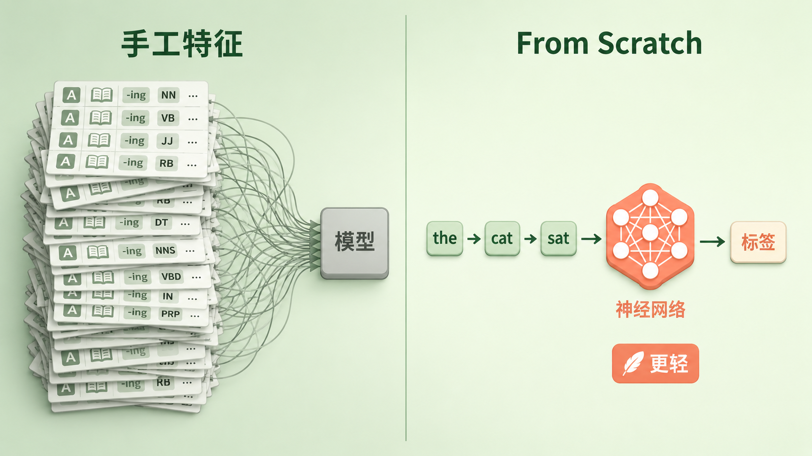
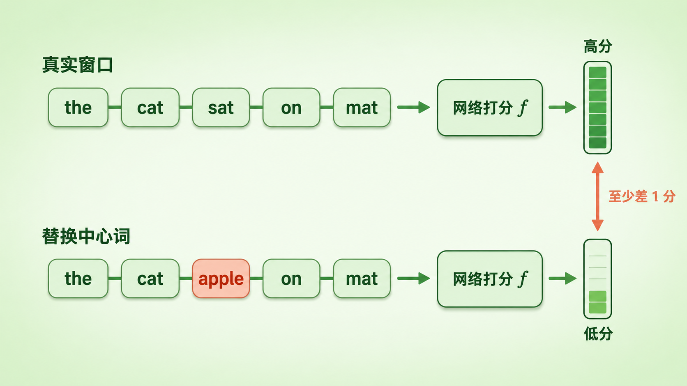
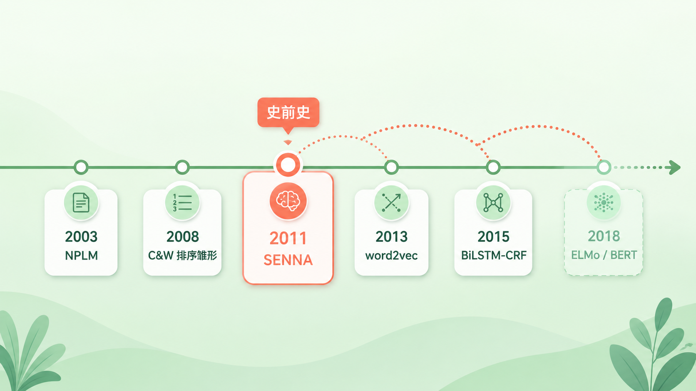

+++
title = "论文里程碑 #8：Natural Language Processing (Almost) from Scratch"
description = "一套统一框架通吃四个 NLP 任务，几乎不靠手工特征——这篇 2011 年的论文，悄悄写下了「预训练」范式的史前史。"
date = 2026-06-27
tags = ["LLM", "论文里程碑", "NLP", "词向量", "预训练", "SENNA", "Collobert", "特征工程"]
categories = ["LLM"]
series = ["论文里程碑"]
showTableOfContents = true
+++



> 一套统一框架通吃四个 NLP 任务，几乎不靠手工特征——这篇 2011 年的论文，悄悄写下了「预训练」范式的史前史。

## 那一年，做 NLP 的人手里都攥着一本「特征手册」

2008 年前后，如果你想做一个能从文本里认出人名、地名的系统（命名实体识别，NER），典型流程是这样的：翻出前人论文里的特征模板，把「这个词首字母是否大写」「它的前缀后缀是什么」「它前一个词的词性是什么」「它在不在地名词典里」——几十上百个特征一条条写出来，再喂给一个 CRF 或最大熵分类器。

换个任务，比如词性标注（POS），这套特征基本作废，你得从头再设计一套。那几年，NLP 的真正门槛常常不在模型，而在「谁的特征调得更细」。

就在这种氛围里，Ronan Collobert、Jason Weston 等人抛出一篇标题带着挑衅的论文：*Natural Language Processing (Almost) from Scratch*——几乎从零开始。潜台词很直接：那本越来越厚的特征手册，也许根本不需要。

## 特征工程：NLP 最重的一项体力活

要理解这篇论文的分量，得先明白它想拆掉的是什么。

*图：旧范式靠人堆特征喂模型，新范式让生词直接流过网络输出标签*

在它之前，主流 NLP 系统的套路可以概括成一句话：**人来设计特征，模型只负责加权**。一个词到底是不是人名，模型自己看不出来，得靠人提前告诉它「该看哪些线索」——大小写、词缀、词典命中、上下文窗口里的词性……这些线索被编码成一个高维稀疏向量，模型在上面学一组权重。

这套范式有三个绕不开的问题。第一，**贵**：每套特征都是领域专家几个月手工打磨的产物，高度依赖语言学先验。第二，**不通用**：POS 的特征、NER 的特征、语义角色标注的特征几乎不能互相复用，每换一个任务就重来一遍。第三，**有天花板**：特征是离散的、人想出来的，模型再聪明也只能在人给定的视野里打转，看不到人没想到的模式。

> 那个年代真正稀缺的，不是更强的分类器，而是一种能让机器自己「看见」语言结构的表示。

## 论文说了什么

这篇论文其实在讲三件事，层层递进。

**第一，一套统一的框架，覆盖四个 NLP 任务。** 它的骨架是同一条流水线——可学习的词向量查找表，加神经网络自动抽特征，再加结构化解码。词性标注、组块分析（Chunking）、命名实体识别、语义角色标注（SRL）这四套过去互不相干的特征工程管线，被它收进同一个范式，几乎不需要任务专属的手工特征。不同任务只在中间的特征抽取结构上有少量差异：局部任务用窗口，长程任务用卷积（细节见下一节）。

**第二，也是最关键的——让性能真正起飞的，不是有监督的网络本身，而是先在海量无标注文本上「自学」出来的词向量。** 网络的第一层是一张「词 → 向量」的查找表；把它先放到几亿词的维基百科上做无监督预训练，再迁移到具体任务上，效果会发生质变。这是一种半监督思路：标注数据稀缺，但生文本几乎无限。

**第三，简单架构 + 好的表示，足以逼近、甚至小幅反超专家级系统。** 这里要说清一个常被误读的细节：论文有「纯净」和「工程」两档结果。最干净的版本——只喂词、只用预训练词向量、不加任何任务特征——NER 已经做到 88.67、POS 97.20，逼近当时最强的专家系统；而它放出的工程版 SENNA，又补上一小撮便宜的特征（后缀、大小写、地名词典，再把 POS / Chunk 的预测级联给下游任务），把成绩推到 NER 89.59、POS 97.29——NER 小幅反超手工特征 SOTA（89.31），POS 几乎追平，且比当时最强的 Shen 词性标注器快约 200 倍、内存只用约 1/69。

| 版本 | 关键差别 | NER F1 |
| --- | --- | --- |
| 纯 from scratch | 只用词 + 预训练词向量，零任务特征 | 88.67 |
| 工程版 SENNA | 再加后缀 / 大小写 / 地名词典 / 级联标签等少量便宜特征 | 89.59 |
| 当时手工特征 SOTA | 多年精心打磨的特征工程 | 89.31 |

标题里那个「(Almost)」就藏在这张表的第二行：它不是 100% 从零——仍保留了小写化、大小写标记、数字归一化、后缀、地名词典、POS / Chunk 级联这几样轻量特征。但和过去那本厚手册比，已经轻得不像话。也有诚实的短板：Chunking 接近最强专家系统，SRL 则仍落后约 2 个百分点（75.49 对 77.92），是它最明显的弱项。

> 把人从「设计特征」里解放出来，机器不仅没变笨，反而又快又轻。

## 它是怎么做到的

整篇论文里，最该被记住的机制只有一个：**它怎么在没有任何标注的情况下，让词向量自己学出语义。**

先看架构的骨架。每个词先经过一张可学习的查找表，变成一个稠密向量。可学习的词向量并不是这篇论文的发明——更早的神经语言模型（Bengio 等）就用过；它的贡献，是把这种表示放进一个多任务 NLP 系统里跑通、并证明它真的好用。对词性、NER 这类「标签主要由局部上下文决定」的任务，论文用**窗口法**：把目标词左右几个词的向量拼起来，过一两层非线性，输出每个标签的分数。而对语义角色标注这种「关键线索可能离得很远」的任务，窗口不够用，论文改用**卷积句子法**：用一个卷积层扫过整句话，再用 max pooling 把全句信息压成一个全局特征——这一步，比后来 CNN 大规模用于文本早了好几年。

但真正的灵魂在预训练。论文设计了一个不需要任何人工标签的自学任务，思路像「判断一句话顺不顺」：从维基百科里取一个真实的文本窗口，再造一个「假」窗口——把它正中间那个词替换成词典里随机抽的一个词。网络要学会给真窗口打的分，比给假窗口至少高出 1 分。

*图：网络学着给真窗口打高分、给「中心词被换掉」的假窗口打低分，两者至少差 1 分*

写成训练目标，就是下面这个成对排序（pairwise ranking）损失：

$$
\sum_{s \in \mathcal{S}}\ \sum_{w \in \mathcal{D}} \max\!\left(0,\; 1 - f_\theta(s) + f_\theta\!\left(s^{(w)}\right)\right)
$$

这里 \(s\) 是语料里一个真实窗口，\(s^{(w)}\) 是把它中心词换成随机词 \(w\) 后的假窗口，\(f_\theta\) 是网络给一个窗口打的分。

翻译成大白话：**只要假窗口的分数没比真窗口低够 1 分，就有损失，网络就得继续调整。** 为了把「the cat sat on the mat」判得比「the cat apple on the mat」高，网络被迫去理解每个词该出现在什么语境里——而它唯一能调的，就是那张查找表里的词向量。于是语义不是被人标注进去的，是从「什么词和什么词常做邻居」里自己长出来的。训练跑在几亿词的维基百科（后来又加上路透社语料）上，前后耗时数周。学完之后，查找表自带语义结构：和 france 最近的是 italy、germany 这类国家名，和 jesus 最近的是 god、christ——没人教过它这些，全是从共现里悟出来的。

还有一处常被忽略却很重要的设计：输出端。逐词独立判断标签会闹笑话（比如 NER 里一个实体中间突然蹦出个不相干的标签）。论文在标签之间加了一个转移分数矩阵，对整句的标签路径整体打分，用类似 Viterbi 的方式解码——这其实就是把 CRF 的结构化思想接到了神经网络后面，也是后来 BiLSTM-CRF 的雏形。

## 它改变了什么

短期看，这篇论文给了整个领域一个可复用的「开箱即用」组件：随论文放出的 SENNA 系统和那套预训练词向量，在 2011 到 2013 年间成了很多人做 NLP 的默认起点——你不用再自己从零训词向量，拿来就能用。「让网络自己学特征」也从一个有点激进的口号，变成越来越多人愿意尝试的路线。

长期看，它的影响要大得多，而且大多是「史前史」式的——它埋下的种子，是在别人的论文里发芽的。把它放进一条更长的脉络里看会更清楚：2003 年 Bengio 的神经语言模型先让「用神经网络学词向量」成为可能，2008 年 Collobert 与 Weston 的前身工作提出了成对排序的雏形，2011 年这篇 JMLR 把它做成了能打的完整系统；再往后，2013 年的 word2vec 让词向量全民普及，2015 年前后 BiLSTM-CRF 成为序列标注标配，直到 2018 年 ELMo / BERT 把「预训练」推上王座。

*图：这篇 2011 年的工作，是从神经语言模型到预训练时代之间承上启下的一环*

需要厘清一处因果：常有人说「word2vec 就是把这篇的排序目标提了速」，这话只对一半。word2vec 的负采样更直接是噪声对比估计（NCE）的简化，但它和 Collobert / Weston 这套 hinge ranking 确实同属一个谱系——都在做同一件事：**让模型去区分「真实样本」和「随机噪声样本」，语义就在这种区分里被逼出来**。这条对比式自监督的主线，这篇论文是最早把它跑通的之一。它的卷积句子法预告了 TextCNN，输出端的转移矩阵预告了 BiLSTM-CRF。

当然，它也有清楚的天花板，而这些天花板恰恰指向了后来的方向。它学出的是**静态词向量**——一个词永远只有一个向量，bank 是「河岸」还是「银行」分不开，多义词只能被压成一个平均；没见过的新词主要靠一个统一的兜底符号顶上；SRL 的明显差距说明只靠词向量还撑不起复杂的结构预测；那几周的预训练在当时也是不小的成本。正是这些局限，催着后来的人走向上下文相关的表示（ELMo、BERT）和更强的生成式预训练（GPT）。

我认为它最被低估的贡献，是第一次完整地演示了一条范式：**在海量无标注文本上预训练出通用表示，再迁移到下游任务**。今天我们说「预训练」说得理所当然，但在 2011 年，敢把宝押在「让机器自己从生文本里学，而不是让专家喂特征」上，是需要一点信念的。这篇论文，是那条路上最早的脚印之一。

## 与主线的接口

**如果你想深入……**

这篇论文的核心——把离散的词变成可学习的稠密向量、再让语义从数据里自己长出来——正对应我们 LLM 系列「表示与分词」章节：

- **《Embedding 查表：离散 ID 到连续语义的惊险一跃》** — 讲了那张「词 → 向量」查找表到底是什么、为什么神经网络非得先把离散符号变成稠密向量，正是 Collobert 这套架构的第一层。
- **《几何直觉：向量空间中的类比、距离与各向异性》** — 讲了为什么「france 的最近邻是意大利、德国」这种语义结构会出现在向量空间里，以及它背后的几何真相与陷阱。

读完这些，你对这篇论文的理解，会从「哦它很早就用了词向量」的历史印象，变成「我知道这张查找表在工程上怎么工作」的可操作认知。

## 写在最后

读这篇论文之前，你可能以为深度学习改造 NLP 是从 word2vec、甚至从 Transformer 才开始的。读完之后会发现：早在 2011 年，「让网络自己学特征 + 在无标注文本上预训练再迁移」这套今天看来天经地义的范式，就已经被完整地演示了一遍——只是当时还没有名字。

Collobert 他们解决了「怎么把一个个词变成机器能用的表示」。但他们的网络还停留在「逐词贴标签」：输入一串词，输出一串等长的标签。可很多任务并不是这个形状——比如翻译，要把一整句话变成另一种语言的、长度完全不同的一整句话。该用什么结构，把一个变长序列先「读懂、压缩」，再「展开、生成」成另一个变长序列？

下一篇，我们看 2014 年的 *Learning Phrase Representations using RNN Encoder-Decoder for Statistical Machine Translation*——它带来了 GRU 和编码器-解码器框架，正是后来 Seq2Seq、注意力机制乃至 Transformer 的共同起点。

## 参考资料

- 论文原文：Collobert, Weston, Bottou, Karlen, Kavukcuoglu, Kuksa. *Natural Language Processing (Almost) from Scratch*. JMLR 12 (2011): 2493–2537（arXiv:1103.0398）。
- 作者与系统主页：SENNA 系统与预训练词向量，详见 [https://ronan.collobert.com/senna](https://ronan.collobert.com/senna)
- 延伸阅读：Collobert & Weston. *A Unified Architecture for Natural Language Processing*. ICML 2008——本文方法的前身，成对排序目标最早在此提出。
- 延伸阅读：Mikolov et al. *Distributed Representations of Words and Phrases and their Compositionality*. 2013——word2vec 负采样（NCE 的简化）的出处。
