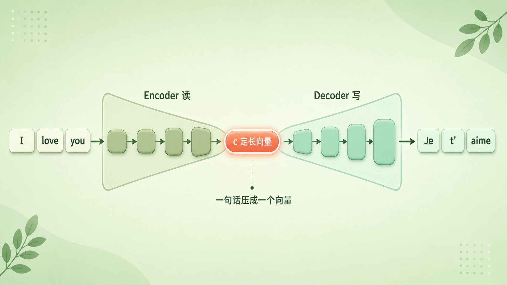
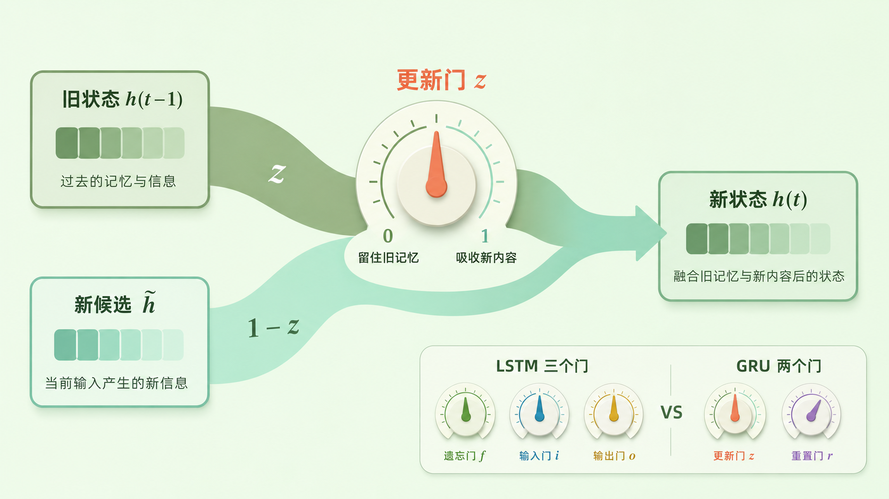
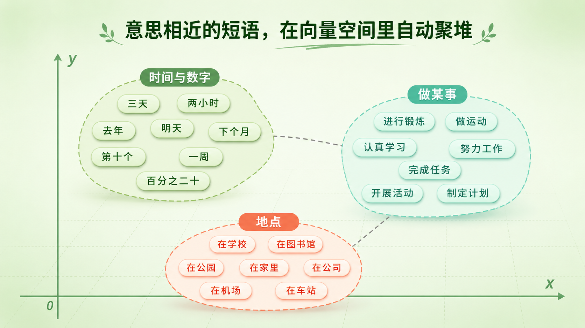

+++
title = "论文里程碑 #9：Learning Phrase Representations using RNN Encoder-Decoder for Statistical Machine Translation"
description = "机器学会把一句话压成一个向量、再解压成另一种语言，GRU 由此诞生，也埋下了日后被注意力打破的「定长瓶颈」。"
date = 2026-07-03
tags = ["LLM", "论文里程碑", "GRU", "Encoder-Decoder", "Seq2Seq", "机器翻译", "RNN", "Cho"]
categories = ["LLM"]
series = ["论文里程碑"]
showTableOfContents = true
+++



> 机器学会把一句话压成一个向量、再解压成另一种语言，GRU 由此诞生，也埋下了日后被注意力打破的「定长瓶颈」。

## 开头——2014 年，一篇标题平平的论文

2014 年，深度学习刚在图像识别上封神两年，NLP 这边却还是统计方法的天下。做机器翻译的人守着一套叫「统计机器翻译」的成熟系统，神经网络在这个领域更像是学术圈的玩具。就在这一年，蒙特利尔 Yoshua Bengio 的实验室里，一个叫 Kyunghyun Cho 的年轻研究者，把一篇标题平平无奇的论文投给了 EMNLP：*Learning Phrase Representations using RNN Encoder–Decoder for Statistical Machine Translation*。

标题里没有一个惊人的词。可就是这篇论文，塞进了两个后来撑起整个 NLP 三年的零件：**GRU** 和 **Encoder-Decoder**。没人在当时意识到，这颗不起眼的种子，会一路长到 Transformer。

## 时代背景——「变长」和「遗忘」两道坎

那时候机器翻译的主力，是「统计机器翻译」（Statistical Machine Translation，SMT）。它的工作方式，像一个只会查词典加拼装的工匠：把句子切成一个个短语，去一张巨大的「短语对照表」里查每个短语怎么翻，每个候选翻译配上几个分数，再拿一个语言模型把它们拼得通顺些。它翻得出东西，但它从不「理解」整句话的意思。

神经网络这边，理论上更有希望。循环神经网络（Recurrent Neural Network，RNN）天生是读序列的——一个词一个词地读，边读边更新自己的「记忆」。可它卡在两道坎上。

第一道坎是**变长**。句子有长有短，5 个词的和 50 个词的都得能翻；可神经网络的结构是固定的，怎么让一个固定的网络吃下任意长度的输入、再吐出任意长度的输出？第二道坎是**遗忘**。普通 RNN 读到句子结尾，开头早忘光了（这就是「梯度消失」）。LSTM（长短期记忆网络）能缓解遗忘，靠的是一个独立的「记忆细胞」，外加输入、遗忘、输出三个门来精细地控制信息进出——效果好，但结构重，又慢又难训。

于是问题摆在桌面上：有没有一个更轻的循环单元，用更少的部件也能做到类似的记忆控制？又有没有一种结构，能把「变长输入 → 变长输出」这件事干净利落地做出来？这篇论文，一次性回答了两个。

## 论文说了什么

这篇论文的贡献，可以拆成三句话。

**第一，让一个 RNN 负责「读」，另一个 RNN 负责「写」，中间用一个定长向量交接——变长输入到变长输出，被抽象成了一个干净、可复制的通用结构。** 这就是 RNN Encoder-Decoder。编码-解码的想法此前已有零星尝试（比如 Kalchbrenner 和 Blunsom 2013 的连续翻译模型），但这篇把它讲得格外清晰，也最快被后来的 Seq2Seq 继承下来。

**第二，他们顺手造出了 GRU：一个比 LSTM 更轻的门控单元，实践中成了它最常用的轻量替代。** GRU（Gated Recurrent Unit，门控循环单元）不再单设记忆细胞，只用重置门和更新门两个门，就缓解了普通 RNN「记不住、又难训」的老毛病。

**第三，学出来的短语向量，自己长出了语义和语法的几何——意思相近的短语，在向量空间里聚成了一堆。** 论文标题里的「Learning Phrase Representations」，说的就是这件事。

这里要诚实说一句 BLEU 分数。这篇论文并没有去做端到端的神经翻译，也没有替换掉当时的 Moses 系统；它做的是，把 RNN Encoder-Decoder 算出的「这一对短语翻译得有多靠谱」当成一个新特征，加进 SMT 那个对数线性模型（log-linear model）里，和原有的分数一起打分。结果是：Moses 基线在测试集上的 BLEU 是 33.30，加了这个特征涨到 33.87，再叠加一个神经语言模型能到 34.64。

> 涨了半个多点。不惊艳——因为它没甩开老系统，只是给工匠递了一把更懂「短语意思」的尺子。这篇论文真正的分量，从来不在这 0.6 个点上，而在它留下的那两个零件。

## 论文怎么做到的

先说 Encoder-Decoder，它的直觉和人类同传很像：**翻译不是逐词替换，而是先把源句读成「一个意思」，再用目标语言把这个意思复述出来。** 当然，这个「意思」是要打引号的——数学上，它只是一个为了预测目标句而训练出来的连续向量，并不等于人类脑子里理解的那种语义。

具体怎么做？一个 RNN 当编码器（Encoder），逐词读入源句，每读一个词就更新一次自己的隐状态；读完最后一个词，它此刻的隐状态 \(c\) 就是「整句话的摘要」——一个长度固定的向量。另一个 RNN 当解码器（Decoder），拿着这个 \(c\)，一个词一个词往外吐目标句，每吐一个都回头参考 \(c\) 和自己已经吐出来的词。

这两个 RNN 不是分开练的，而是拴在一起、朝同一个目标一起训练：看到源句后，把正确译句的概率算得尽可能高。写成一行就是：

$$
\max_{\theta}\ \sum_{n} \log p_{\theta}(y_n \mid x_n)
$$

翻译成大白话：不断调整参数 \(\theta\)，让每一对「源句 \(x_n\)、译句 \(y_n\)」里，真实译句被模型打出的概率越来越大。那个中间向量 \(c\) 不是谁塞给它的「语义」，而是为了把这个概率做高，模型自己挤出来的一份压缩表示。

> 打个比方：Encoder 把一句话拧成一颗「意义胶囊」，Decoder 再把胶囊舒展成另一种语言。

*图：Encoder 把源句逐词压成一颗定长的「意义向量 c」，Decoder 再把它舒展成目标句——变长进、变长出，中间过一个固定尺寸的瓶颈。*

但这里先埋一个坑：无论源句是 5 个词还是 50 个词，\(c\) 的尺寸是固定的。5 个词压进去绰绰有余，50 个词呢？这个疑问，我们放到第四节再引爆。

再说 GRU。为什么编码器、解码器不用普通 RNN？因为普通 RNN 记不住长句。用 LSTM 倒是能记，但它带着独立的记忆细胞和三个门，太重了。于是 Cho 他们问了一个很聪明的问题：**「遗忘」和「记住」，真的需要两个独立的门吗？**

想象隐状态是一块记忆白板。每读一个新词，你都要做一个决定：旧内容留多少，新内容写多少。LSTM 用两个独立的旋钮——遗忘门决定擦掉多少旧的，输入门决定写入多少新的，理论上你甚至可以「既全擦又全写」。GRU 发现，大多数时候，「该留多少旧的」和「该收多少新的」其实是同一个决定的两面：留得多，就该收得少。于是它把两个旋钮捆成了一个，叫**更新门** \(z\)。这个门自己也是学出来的——它拿当前输入和上一刻的状态，算出一个 0 到 1 的开合度 \(z_t = \sigma(W_z x_t + U_z h_{t-1})\)，再按这个比例混合新旧：

$$
h_t = z_t \odot h_{t-1} + (1 - z_t) \odot \tilde{h}_t
$$

翻译成大白话：\(z\) 拧到 1，几乎原样保留上一刻的记忆（那些需要长期记住的信息，比如整句话的主语）；拧到 0，几乎完全采纳当前新算出的候选 \(\tilde{h}\)。关键在于，两个系数被强制加起来等于 1——**「多留旧的」就必然「少收新的」，一个旋钮同时管住了遗忘和记忆。** 这正是 GRU 比 LSTM 轻的地方。

*图：GRU 把 LSTM 里相互独立的遗忘门、输入门，合并成一个更新门 z——旧状态和新候选按 z 与 1−z 的比例混合，两股比重永远此消彼长。*

GRU 还有第二个门——**重置门** \(r_t = \sigma(W_r x_t + U_r h_{t-1})\)。它管的是另一件事：在算「新候选」\(\tilde{h}\) 时，要不要参考旧状态。重置门拧到 0，候选就只看当前输入、彻底无视历史，相当于允许网络在合适的时候「翻篇重来」。论文还观察到一个有意思的现象：不同的隐单元会自己分工——负责短期依赖的单元，重置门频繁活跃；负责长期依赖的单元，更新门大多打开。论文里也专门强调：如果去掉门、换成普通的 tanh 单元，根本训不出有意义的结果——门控，才是关键。

## 它改变了什么

**短期看，它给 NLP 递上了两块新积木。** GRU 很快成了 LSTM 之外最常用的循环单元——想要 LSTM 的记忆力、又嫌它太重的人，默认就换成 GRU。而 Encoder-Decoder 这个「读一个、写一个、中间过一个向量」的骨架，几个月内就被 Sutskever 等人做成了完全端到端的 Seq2Seq（用的是 LSTM），真正甩开短语表、直接用神经网络翻译。神经机器翻译（NMT）的大门，就是从这里推开的。

**长期看，它埋下的那个坑，恰恰成了下一次突破的引信。** 还记得那个定长向量 \(c\) 吗？把一整句话——不管多长——都挤进一个固定尺寸的向量，句子一长，信息就开始溢出、损耗。就在一年后的 2015 年，同一个实验室（Bahdanau、Cho、Bengio）提出了注意力机制（Attention）：与其把整句话挤进一个向量，不如让解码器每吐一个词，都回头看源句的所有位置、按相关性加权参考。**注意力不是凭空冒出来的，它是为了修这篇论文亲手埋下的瓶颈。** 而注意力再往前两年，就是那句「Attention is all you need」——Transformer 干脆连 RNN 都不要了。

还有一层更安静、也更深的遗产，藏在第三个论点里：短语向量自己长出了几何。论文把学出来的、上千维的短语向量用 Barnes-Hut t-SNE 投影到二维来看，发现意思相近的短语会挨在一起、聚成小团（得说清楚：那张聚堆图是投影后的样子，不是原始高维空间本来的模样）。但结论是扎实的——「意义」这种抽象的东西，是可以被学成向量空间里的位置和方向的。这个发现，和同时期的词向量研究遥相呼应，成了后来一切表示学习的信念基石。

*图：论文用 Barnes-Hut t-SNE 把学出来的短语向量投影到二维，意思相近的短语会自动聚堆（图为投影后的示意）。「意义可以是空间里的位置」，这个信念一直传到今天的词向量与大模型。*

所以，如果只盯着 BLEU，这篇论文平平无奇；可如果看它留下的零件——GRU、Encoder-Decoder，以及「意义有几何」这个信念——它可能是 2014 年 NLP 最被低估、也最深远的一篇。

## 与主线的接口

**如果你想深入……**

这篇论文的核心概念，对应我们 LLM 系列的「表示与分词：Token、Embedding、位置」章节：

- **#13《Embedding 的本质是查表》** — 讲了离散符号怎么变成连续稠密向量、什么叫「分布式表示」；本文的 context vector \(c\)，正是把「一整句话」压成一个这样的分布式表示。
- **#14《向量空间的几何：相似、类比与陷阱》** — 讲了 king − man + woman ≈ queen 这类语义几何；本文让人第一次看到「短语的意义在向量空间里有结构」，正是这种几何的先声。

此外，Encoder-Decoder 的「编码器 + 解码器」分工，为我们理解后来架构的分化提供了一条重要的历史线索——BERT 走 encoder-only、GPT 走 decoder-only、T5 用 encoder-decoder。这三条预训练路线的形成，当然还受语言模型、掩码（masking）、自回归建模等多条线索共同影响；但「编码器/解码器」这套结构语言和直觉，很大程度上正是从这里一路传下来的。

读完这些，你对 RNN Encoder-Decoder 的理解，会从「翻译史上的一个名字」，变成「现代模型第一层和整体骨架的来路」。

## 收尾

读这篇论文之前，你可能觉得「把句子编码成一个向量」是 Transformer 时代才有的操作。读完会知道，早在 2014 年，人们就已经在用两个 RNN 加一个定长向量做这件事了，连「意义有几何」都已经被看见——只是那时的向量还太挤，挤着挤着，就挤出了后来的注意力。

这篇论文的标题是「Learning Phrase Representations」，学的是短语的表示。但它得靠平行语料——源句和译句成对出现——才学得起来。那么问题来了：有没有可能，不要翻译、不要任何标注，只拿一大堆生文本，就学出同样有几何的词向量？

下一篇，我们看 2013 年那篇把这件事做到极致、也做到工业级的论文——*Distributed Representations of Words and Phrases and Their Compositionality*，也就是 Word2Vec 的第二篇。它会告诉你：king − man + woman ≈ queen 不是玄学，而是「负采样」加一堆生文本，硬生生喂出来的几何。

## 参考资料

- **论文原文**：Kyunghyun Cho, Bart van Merriënboer, Caglar Gulcehre, Dzmitry Bahdanau, Fethi Bougares, Holger Schwenk, Yoshua Bengio. *Learning Phrase Representations using RNN Encoder–Decoder for Statistical Machine Translation*. EMNLP 2014. arXiv:1406.1078 / ACL Anthology D14-1179.
- **更早的编码-解码尝试**：Nal Kalchbrenner, Phil Blunsom. *Recurrent Continuous Translation Models*. EMNLP 2013.
- **端到端的另一条线**：Ilya Sutskever, Oriol Vinyals, Quoc V. Le. *Sequence to Sequence Learning with Neural Networks*. NeurIPS 2014.（同年做出完全端到端的 Seq2Seq）
- **瓶颈是怎么被打破的**：Dzmitry Bahdanau, Kyunghyun Cho, Yoshua Bengio. *Neural Machine Translation by Jointly Learning to Align and Translate*. ICLR 2015.（注意力机制，直指本文的定长瓶颈）
- **门控直觉图解**：Christopher Olah, *Understanding LSTM Networks*（对 LSTM / GRU 门控机制最清晰的可视化讲解）。
