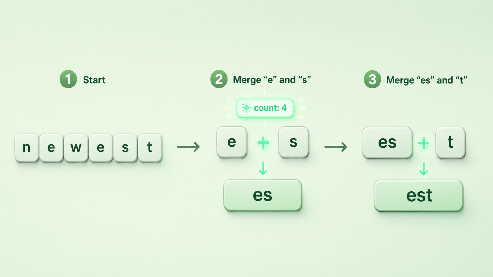
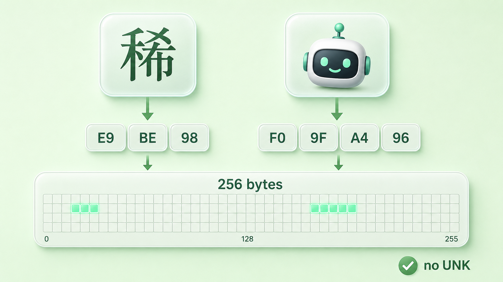

+++
title = "10 BPE 与 Byte-level BPE：现代 LLM 如何消灭 UNK"
description = "把高频字符对反复焊成子词，再把切分的地基退到 256 个字节——这样任何文本都切得开，UNK 在结构上无处容身。"
date = 2026-06-06
tags = ["LLM", "Tokenizer", "BPE", "Byte-level BPE", "BBPE", "子词", "UTF-8", "OOV"]
categories = ["LLM"]
series = ["主线"]
showTableOfContents = true
+++





> 把高频字符对反复焊成子词，再把切分的地基退到 256 个字节——这样任何文本都切得开，`<UNK>` 在结构上无处容身。

> 前置知识提示：读这篇前，建议先了解 token 与子词（subword）切分，以及「覆盖性」为什么是 tokenizer 的硬指标（见第 8、9 篇）。

你随手把一段话丢给大模型：里面有生僻字「龘」、两个 emoji、半句日文，还跟着一截连你都认不出编码的乱码。它照单全收，回得有模有样，从不会卡在某个字符上跟你说「这个我不认识」。

换成十年前的 NLP 系统，遇到词表里没有的词，它只会吐出一个 `<UNK>`（unknown，未知词的占位符），然后假装无事发生——句子的信息当场缺了一块。

从「张口就 `<UNK>`」到「什么都能读」，中间这一步是怎么迈过去的？上一篇我们论证了子词是切分粒度的工程最优解，却留了个尾巴没解开——subword 词表里那些片段，到底是谁、按什么规矩定出来的？答案藏在一个朴素得有点反直觉的算法里：BPE。

## 一、子词不是人定的，是「数」出来的

先问一个具体问题：tokenizer 词表里那些片段——英文的 `ing`、`tion`，常见的整词块——是谁规定的？总不可能让人手工敲下几万条。

> 把它想成整理一面贴满便利贴的墙：你盯着看久了，发现某两张总是结对出现，干脆撕下来订成一张新的，下次整块用。BPE 干的就是这件事，只不过它「盯」的是语料里的统计频率。

BPE（Byte Pair Encoding，字节对编码）本是 1994 年的一个数据压缩算法，2016 年被 Sennrich 等人借来做分词。它的训练过程出奇地简单，就是三步循环：

1. 把语料打散成最小单位——经典 BPE 从单个字符起步，byte-level 版本则从 UTF-8 字节起步（这点第三节细说）——再统计所有**相邻 token 对**出现的次数。
2. 挑出最高频的那一对，合并成一个新 token，并把这条**合并规则**（merge rule）记下来。
3. 拿合并后的序列重复第 1、2 步，直到词表攒到预设大小。

每一步要合并的，永远是当前语料里最高频的那一对：\(\arg\max_{(a,b)} \text{count}(a,b)\)。说白了——谁最常黏在一起，就先把谁粘成一块。这是一种贪心：每步只挑眼下最划算的合并，不回头、不追全局最优，但够快、够稳。

举个最小的例子。假设语料里反复出现 `newest`、`widest` 这类词。一开始全是单个字符，统计下来 `e` 和 `s` 这一对出现得最频繁，于是第一条合并规则就是 `e + s → es`；合并完再统计，`es` 又总跟着 `t`，于是第二条 `es + t → est`。几轮下来，`est` 这个常见词尾就成了一个独立子词——而真正高频的整词会被整块保留，罕见词则留成更碎的片段。

```python
from collections import Counter

# 把每个词拆成字符，统计相邻字符对的频次
words = ["newest", "newest", "widest", "widest"]
pairs = Counter()
for w in words:
    chars = list(w)
    for a, b in zip(chars, chars[1:]):
        pairs[(a, b)] += 1

print(pairs.most_common(1))   # [(('e', 's'), 4)] → 第一条合并规则: e + s → es
```


*图：BPE 训练的一步——把语料里最高频的相邻对 e+s 焊成新子词 es，再由 es+t 合成 est。*

> 一句话收束：BPE 不发明子词，它只是把语料里最常共现的片段反复焊大。词表是「数」出来的，不是人拍脑袋列的。

## 二、同一个词，为什么每次都切得一样

训练攒出一张合并表之后，真正拿它来切文本的，是另一个阶段。这里有个常被忽略的问题：同一个词，会不会今天切成一种、明天切成另一种？

> 合并表其实是一份按优先级排好的「拼装说明书」：先拼优先级最高的，再拼次高的。无论谁来拼、拼几次，照着同一份说明书走，结果必然一模一样。

编码（也就是推理）阶段，BPE 把输入先打散成最小单位，再按合并规则的**优先级**来拼——注意不是从第一条规则线性扫一遍，而是反复在当前序列里挑出优先级最高（rank 最小、学得最早）的那一对来合，合完再挑，直到没有可合的为止。还拿 `newest`：它先是 `n e w e s t`，当前能合的里 `e+s` 优先级最高，合成 `n e w es t`；接着轮到 `es+t`，合成 `n e w est`；再没有可合的，停。换谁来切、切多少次，都是这一串。

切法之所以唯一，正源于这套优先级是固定的——只要 normalization、pre-tokenization、merge rank、special token 的处理都一致，同一段文本就永远切成同一串 token，这叫确定性切分（deterministic segmentation）。哪怕来个训练时整体没见过的新词，它也只是套用已有规则、退化成已知片段去拼，结果同样唯一、可复现。

顺带拎清一个常被混淆的点：**训练**是离线学出这张合并表，慢，只做一次；**推理**是每次请求时照表套用，快，反复做。tokenizer 出厂那一刻，合并表就冻结了——你调 API 时它并不是在「学」怎么切，只是在查一张早就定好的表。

留个心眼：「照说明书拼出唯一结果」是 BPE 的特性，不是分词的唯一可能。有的方法允许同一个词存在多种合理切分、再按概率挑一个——那是下一篇 Unigram 的故事。

> 一句话收束：BPE = 离线学一张有序合并表 + 在线照优先级确定性切分。切法唯一、可复现，是它的长处，也为后面「token 边界错位」埋下了伏笔。

## 三、最后一个漏洞：Byte-level BPE 怎么让 `<UNK>` 彻底消失

到这儿 BPE 看着已经很周全了，可回到开头那段乱码——要是输入里出现了**训练语料里压根没出现过的字符**呢？一个生僻字、一个刚发布的新 emoji。字符级 BPE 的底座，是「训练时见过的字符集合」；没见过的字符连最小单位都凑不齐，于是又退回了 `<UNK>`。上一篇说 byte-level 能让覆盖性满分，却没讲它具体怎么做到——现在把它拆开。

> 与其费力维护一本「我认识的所有字符」的字典（总有漏网的），不如退一步，换一套谁都逃不掉的最小积木——字节。世界上任何字符，在计算机里最终都是一串字节（UTF-8 编码），就像任何颜色都能拆成红、绿、蓝三个分量。积木只要是字节，就没有「拼不出来」的东西。

这正是 Byte-level BPE（BBPE，字节级 BPE）的思路：不在字符上、而在 **UTF-8 字节**上跑完全相同的合并算法，底座词表固定为 **256 个字节**（一个字节的全部取值）。任何合法 Unicode 字符——汉字、emoji、阿拉伯文——都能被 UTF-8 编码成 1 到 4 个字节，必然落在那 256 个里，于是必然能被表示；合并算法再在字节序列上，把高频组合焊成子词。（至于复制粘贴进来的非法字节流，能不能无损处理还得看上游的解码策略——但只要进了字节层，就不再有「词表里没有」这回事。）

```python
# 任何合法字符都能落到 UTF-8 字节，再生僻也不例外
"龘".encode("utf-8")   # b'\xe9\xbe\x98'        → 3 个字节
"🤖".encode("utf-8")   # b'\xf0\x9f\xa4\x96'    → 4 个字节
# 这些字节都在 0–255 的底座词表里，所以一定切得开，永远不会变成 <UNK>
```



*图：任何合法字符先经 UTF-8 拆成字节（生僻字「龘」→ E9 BE 98），所有字节都落在 256 个字节的底座词表里，于是永远切得开。*

这里要拎清几个常被混成一锅的名词。**byte-level BPE** 是「从字节开始训练和编码」，覆盖性是结构自带的、不需要额外兜底；而 **byte fallback** 通常特指 SentencePiece 那一类做法——底座仍是子词 piece，只在遇到表示不了的字符时，才退回字节 token 来托底。两者都能不掉 `<UNK>`，但不是同一回事。摆到一张表上看得更清楚：

| 机制 | 底座单位 | 怎么避免 UNK |
| --- | --- | --- |
| 字符级 BPE | 训练时见过的字符 | 做不到——没见过的字符仍会变 UNK |
| Byte-level BPE（GPT-2 / tiktoken） | 256 个 UTF-8 字节 | 一切从字节起，结构上不可能 UNK |
| byte fallback（SentencePiece 选项） | 子词 piece + 256 个字节兜底 token | 正常用 piece，遇不可编码字符退回 0xXX 字节 |
| Unigram（SentencePiece，下一篇 #11） | 子词 piece（可叠加字节兜底） | 换的是切分算法（概率化），仍靠字节兜底避免 UNK |

落到实践：从 GPT-2（2019）起，OpenAI 的 tokenizer 就走 byte-level BPE，Llama 等现代主流模型也普遍带字节兜底。代价也得认——byte-level 覆盖性满分，可一个汉字就要 3 个字节起步，CJK、emoji、罕见符号切下来 token 数往往更多，效率不一定最优。不可能三角又在提醒你：没有白拿的好处。但至少，你今天给大模型喂一段稀奇古怪的输入，它基本都能「读」——不是因为它认识，而是因为它在字节层永远有得切。

把覆盖性说得严谨一点：只要底座词表能表示输入的每一个最小单位、且任意单位都能退回底座，就不可能产生 `<UNK>`。256 个字节的底座恰好满足这个充分条件——前提是输入已经是合法的字节序列。

> 一句话收束：`<UNK>` 的消失不是模型变聪明了，而是工程上把切分的地基从「认识的字符」换成了「所有可能的字节」。覆盖性从此不再靠运气，而是结构保证。

## 回头看：从「查不到」到「切得动」

读这篇之前，你可能以为 tokenizer 的词表是一本「人工词典」，遇到没收录的词就抓瞎。读完之后，这幅图该变了：子词是 BPE 从语料频率里贪心合并出来的；切分是照一张有序合并表、按优先级确定性执行的；而 `<UNK>` 的彻底消失，靠的是把底座退到 256 个字节。从「词典查不到就 UNK」到「字节层永远切得动」，正是覆盖性从奢望变成保证的那一步。

但 BPE 这条路藏着一个假设——同一个词只有一种「正确」切法。真的只能有一种吗？下一篇我们看 Unigram：它把切分当成概率问题，允许一个词有多种切法、再挑最优，会带来什么不同。再往后，我们还要算一笔账：词表到底该多大？为什么 BPE 切出来的 token 边界，会让大模型连「strawberry 里到底有几个 r」都数不清——那才是 token 化真正要付的代价。

## 参考与延伸阅读

- Gage, P. (1994). *A New Algorithm for Data Compression*. —— BPE 最早作为数据压缩算法被提出
- Sennrich, R., Haddow, B. & Birch, A. (2016). *Neural Machine Translation of Rare Words with Subword Units*. [arXiv:1508.07909](https://arxiv.org/abs/1508.07909) —— 把 BPE 引入分词、确立 subword 路线的奠基论文
- Radford, A. et al. (2019). *Language Models are Unsupervised Multitask Learners*（GPT-2）—— 首个大规模采用 byte-level BPE 的语言模型
- Wang, C., Cho, K. & Gu, J. (2019). *Neural Machine Translation with Byte-Level Subwords*. [arXiv:1909.03341](https://arxiv.org/abs/1909.03341) —— 以 256 字节为基础的 BBPE 系统研究
- 延伸：Kudo & Richardson (2018). *SentencePiece*. [arXiv:1808.06226](https://arxiv.org/abs/1808.06226)，或直接用 OpenAI 的 [tiktoken](https://github.com/openai/tiktoken) 把一段乱码粘进去，看它被切成哪些 token，最直观
