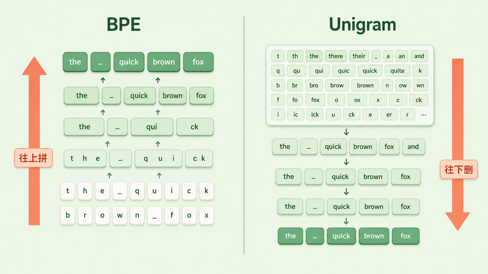
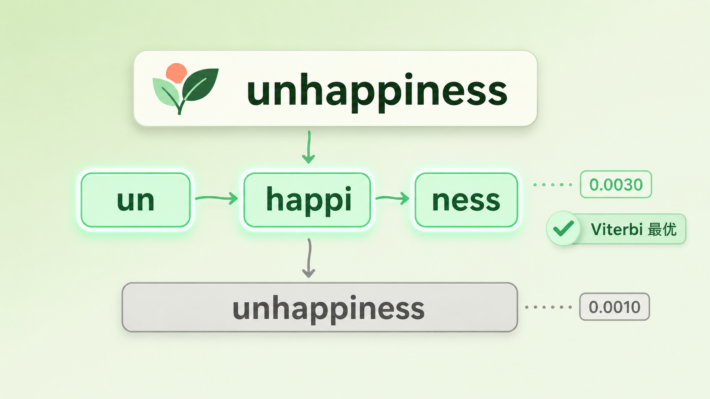

+++
title = "11 Unigram（SentencePiece）：并非所有切分都是确定的"
description = "BPE 的切分是唯一确定的，Unigram 让同一句话有多种合法切法——这份不确定性反而成了训练时近乎免费的数据增强。"
date = 2026-06-09
tags = ["LLM", "Tokenizer", "Unigram", "SentencePiece", "subword regularization", "EM", "Viterbi", "分词"]
categories = ["LLM"]
series = ["主线"]
showTableOfContents = true
+++





> BPE 的切分是唯一确定的，Unigram 让同一句话有多种合法切法——这份不确定性反而成了训练时近乎免费的数据增强。

> 前置知识提示：读这篇前，建议先了解 subword 子词、BPE 的合并规则（见第 9、10 篇）。

「南京市长江大桥」。

你几乎不用想就读懂了：南京市 / 长江大桥。但如果让一台没有先验的机器来切，它完全可以切成「南京 / 市长 / 江大桥」——一位姓江的市长。两种切法都由合法的词拼成，区别只在于哪一种「更可能」。

切分不是只有一条路。这件事我们上一篇其实绕过去了：BPE 把一段文本切成什么样，是被合并表写死的——同样的输入，永远切出同样的结果，干净利落，没有歧义。可「没有歧义」一定是好事吗？这一篇我们换一条路线：Unigram 语言模型（Unigram Language Model）。它从一开始就承认，切分是一件有多种可能、可以打分、甚至可以随机采样的事。

## 往上拼，还是往下删：两种相反的造词法

子词词表是怎么「长」出来的？这是理解 Unigram 的第一道门槛，因为它和 BPE 的答案正好相反。

> BPE 像搭乐高：手里全是最小的积木（单字符），谁和谁老是挨在一起，就把这两块粘成一块更大的，反复粘，直到攒够一盒常用件。这是自底向上、越拼越大。

> Unigram 反过来，像做减法的雕塑：先准备一块大到离谱的石料（一个塞满了各种候选子词的超大词表），再一点点凿掉那些「留着也没用」的部分，直到剩下的正好够用。这是自顶向下、越删越小。

具体说，Unigram 训练的起点是一个远超目标大小的候选词表——通常把语料里所有高频子串、或者先跑一遍别的方法凑出来的几十万个候选 piece 都先收进来。每个候选 piece 都带一个概率 \(p(x_i)\)，表示它作为一个独立单元出现的可能性。训练要做的，就是一边估计这些概率，一边把贡献最小的候选删掉，最终收敛到设定的词表大小（比如 32000）。

一句话：BPE 是「从零拼到够」，Unigram 是「从多删到够」。方向相反，落点都是一张目标大小的子词表——但因为造法不同，Unigram 顺带拿到了 BPE 没有的东西。


*图：BPE 从单字符往上合并、越拼越大；Unigram 从超大候选词表往下裁剪、越删越小，两者落点都是目标大小的词表*

## 把切分当成概率：同一句话，好几种切法

既然词表里每个 piece 都有概率，那「切一段文本」到底是什么意思？

想象你要把一条项链拆成几段卖，每一种现成的小段在市场上有自己的行情价。同一条项链可以拆成不同的组合，每种组合的总价值不一样。Unigram 要做的，就是在所有拆法里挑总价值最高的那一种。

这里它用了一个很强（也很省事）的假设：一段切分的概率，等于它各个子词概率的连乘——子词之间互相独立，谁也不影响谁。这就是「unigram」这个名字的由来。把一段文本 \(X\) 的某一种切分写成 \(\mathbf{x} = (x_1, x_2, \dots, x_M)\)，它的概率是：

$$
P(\mathbf{x}) = \prod_{i=1}^{M} p(x_i)
$$

但这里要先分清一件容易混的事。同一段 \(X\) 通常有很多种合法切分，把它们的集合记作 \(S(X)\)。**训练**模型时，我们关心的是整句话 \(X\) 在这套概率下有多可能，而它可以由 \(S(X)\) 里任意一种切法生成，所以要把所有切法的概率加起来——这一步叫边缘化（marginalization）：

$$
P(X) = \sum_{\mathbf{x}\, \in\, S(X)} \prod_{i=1}^{M} p(x_i)
$$

可真正要「切」出一条结果时（也就是**推理 / 解码**），我们不再求和，而是取其中概率最大的那一条：

$$
\mathbf{x}^{*} = \arg\max_{\mathbf{x}\, \in\, S(X)} \prod_{i=1}^{M} p(x_i)
$$

记住这个分工：训练边缘化所有切法，解码只取最优一条。候选切法可能成百上千，但解码时不用真的一个个枚举——把候选 piece 排成一张 lattice（切分网格），这是一个标准的动态规划问题，用 Viterbi 在这张 lattice 上一次扫描就能找出最优切分，复杂度与 lattice 的边数近似成正比，工程上通常接近线性。如果你不只想要第一名、还想要「前 k 名」，同一套 DP 稍加改动就能给出 n-best 切分。

举个缩小版的例子：

```python
# 每个子词单元的概率（piece probability，示意值）
p = {"un": 0.30, "happi": 0.05, "ness": 0.20,
     "unhappiness": 0.001}

# "unhappiness" 的两种切法，比谁的连乘概率高
seg_a = ["un", "happi", "ness"]   # 0.30 * 0.05 * 0.20 = 0.0030
seg_b = ["unhappiness"]           # 0.0010

# 0.0030 > 0.0010，Viterbi 选 seg_a：用了三块，但总概率更高
```

在 BPE 眼里，一段文本只有一种切法；在 Unigram 眼里，切法是一个概率分布，最优切分只是这个分布的众数。承认了这一点，后面两件好事才有可能发生。



*图：unhappiness 的两种切法——「un·happi·ness」连乘概率 0.0030 高于整词「unhappiness」的 0.0010，Viterbi 选前者*

## 这张概率表怎么学出来：EM 加裁剪

上面一直在用 \(p(x_i)\)，可它从哪来？我们最开始并不知道每个 piece 该有多大概率。

这有点像「先有鸡还是先有蛋」：要算每个子词的概率，得先知道语料是怎么切的；可要切语料，又得先有每个子词的概率。Unigram 的解法是两头来回猜——先随便给个初始概率，切一遍语料看看，再根据切的结果回头修正概率，如此往复，直到稳定。

把这件事写成一个训练目标，就是让整个语料 \(D\) 在这套子词概率下的似然最大：

$$
\mathcal{L} = \sum_{X\, \in\, D} \log \sum_{\mathbf{x}\, \in\, S(X)} \prod_{i=1}^{M} p(x_i)
$$

注意里层那个「对所有切分求和」——正是它，决定了下面这套迭代该怎么做。这就是 EM 算法（Expectation-Maximization，期望最大化）。E 步：固定当前的概率表，但**不是只切出一条最优路径**（那叫 hard EM），而是在一段文本的所有合法切分上做边缘化，算出每个 piece 的期望出现次数（expected count）；M 步：用这些期望次数归一化，重新估计每个 piece 的概率 \(p(x)\)。两步交替，整个语料的似然单调上升，逐渐收敛。

裁剪（pruning）就穿插在这个过程里。每隔几轮 EM，估一估「如果把某个 piece 从词表里删掉，整个语料的似然会掉多少」——掉得最少的那批，说明它们可有可无（它们承担的切分总能被别的组合以相近的概率替代），于是按比例删掉一批。删完继续 EM，再删，直到词表缩到目标大小。

单字符（以及必要的基础字符）通常受保护、不参与删除，这样任何字符串都至少留有一种可分解的兜底切法，不会出现切不动的死角。不过这里要和上一篇分清楚：Unigram 自己保证覆盖，靠的是「保留基础字符 + 必要时退回 UNK」；而 SentencePiece 作为工程实现，还能再开 `character_coverage` 或 `byte_fallback` 选项来兜底——这跟 byte-level BPE 那个「256 字节闭包」不是同一套机制，只是都奔着「不留死角」这同一个目标。

所以 Unigram 的「训练」，是 EM 估概率和按似然损失裁词表这两件事交替进行，一路从超大候选集合收敛到你要的规模。到这里，BPE 和 Unigram 都能交付一张定长子词表——真正拉开差距的，是 Unigram 一直保留着的那个「切分可多解」的性质。

## 不确定性的红利：随机切分与 SentencePiece

「同一句话有多种切法」听起来像个麻烦，它到底能换来什么好处？

想象教小孩认「unhappiness」这个词。要是每次都把它拆成一模一样的三块给他看，他只记得这一种长相；可要是有时给他看整词、有时拆两块、有时拆三块，他反而更能摸清这个词的内部构造，换个没见过的词也更容易举一反三。

这就是子词正则化（subword regularization）。训练模型时，不必每次都用概率最高的那条切分，而是按各切分的概率从 \(S(X)\) 里随机采样一条——同一个词在不同的训练步里，可能以不同的子词组合出现。这相当于在分词这一层免费做了数据增强，让模型不至于过度依赖某一种固定切法，对拼写变体、低资源语言、噪声输入都更稳。要补一句的是，这里的采样并不是完全均匀乱抽：它按各切分的概率来抽，还带一个平滑参数（论文里的 \(\alpha\)，作用类似采样温度）调节「多大程度上偏向最优切分」——\(\alpha\) 越接近 1 越贴近真实概率分布，越小则分布越平、越鼓励去试那些次优切法。BPE 原生做不到这点：它的切分是确定的，没有「别的切法」可供采样（后来 BPE-dropout 用随机丢弃部分合并规则补上了类似能力，但那是后话）。而推理时换回最优切分，保证结果稳定可复现。

最后说说 SentencePiece——它常和 Unigram 一起出现，但两者不是一回事。Unigram 是算法，SentencePiece 是把算法打包成的框架；严格说，**Unigram 和 BPE 都只是 SentencePiece 支持的两种算法之一，别把 SentencePiece 直接等同于 Unigram**。它真正解决的是「工程上怎么对任意语言一视同仁」。传统分词要先按空格把句子切成词、再切子词，这对英文还行，对中文、日文这种词之间不写空格的语言就犯难了。SentencePiece 干脆不做这步预处理：它把输入当成一串原始字符（连空格也算一个普通符号，用 `▁` 表示），直接在上面跑 Unigram 或 BPE。

> 不做语言相关的预分词，意味着同一套流程能原样搬到任何语言上；而且切分可以无损还原回原文——空格去哪了、词连在一起还是分开，全都编码在 token 里。

切分可多解，对内带来了 subword regularization 这样的训练红利；SentencePiece 则把整套方案打磨成语言无关、可逆的工程标准。这也是为什么今天很多多语言模型的 tokenizer，底层都是 SentencePiece 配 Unigram。

## 写在最后

读到这里，你对「分词」的认知应该变了：它不再是一道结果唯一、按表执行的确定工序。BPE 把切分钉死成一条路，Unigram 把切分看成一个有概率、可打分、可采样的决策——最优切分只是分布的众数，而那些「次优」切法也不是废料，它们在训练时是数据增强，在多语言里是鲁棒性的来源。两条路线没有绝对的高下：BPE 简单确定、工程直觉强，Unigram 概率化、更灵活，今天的主流 tokenizer 常在两者之间按需取舍。

但不管走哪条路，最后都要回答同一个问题：这张子词表，到底该设多大？三万、五万还是十万？词表大了、小了，分别要付出什么代价？为什么有些模型连「strawberry 里有几个 r」都数不清、把简单的数字也算错？这些看着像玄学的毛病，根子其实都埋在词表大小和 token 边界上。下一篇 #12，我们就来拆这本「token 危机」的账。

## 参考资料

- Kudo, T. (2018). *Subword Regularization: Improving Neural Network Translation Models with Multiple Subword Candidates.* ACL 2018. [https://arxiv.org/abs/1804.10959](https://arxiv.org/abs/1804.10959)
- Kudo, T., & Richardson, J. (2018). *SentencePiece: A simple and language independent subword tokenizer and detokenizer for Neural Text Processing.* EMNLP 2018 (System Demonstrations). [https://arxiv.org/abs/1808.06226](https://arxiv.org/abs/1808.06226)
- 延伸阅读：Provilkov et al. (2020). *BPE-Dropout: Simple and Effective Subword Regularization.* ACL 2020——把「随机切分」的思路带回 BPE。[https://arxiv.org/abs/1910.13267](https://arxiv.org/abs/1910.13267)
