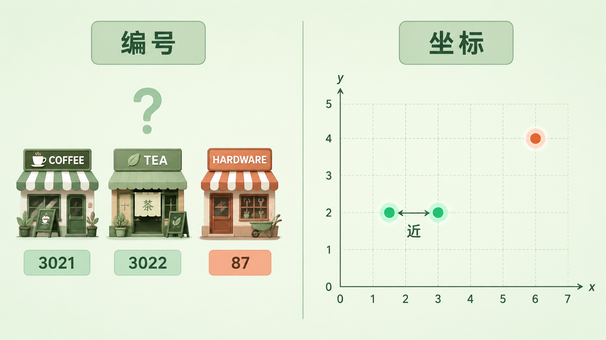
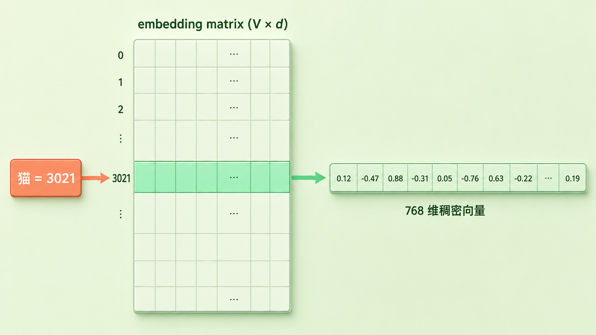
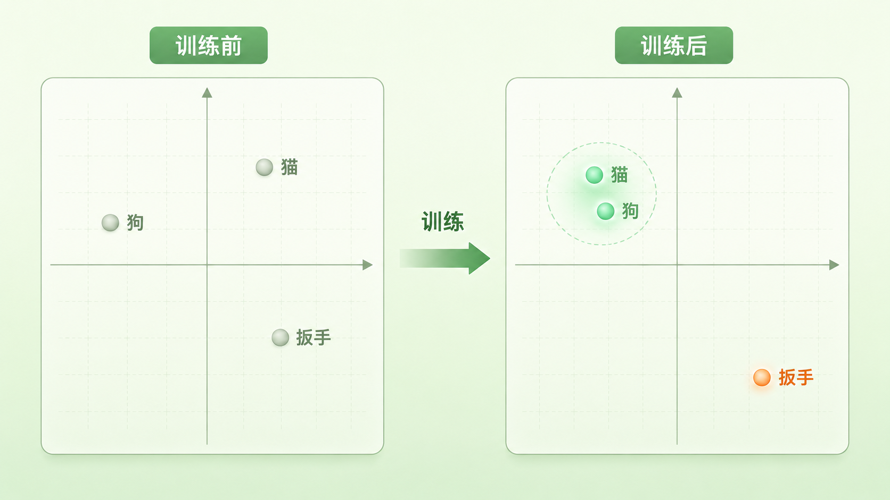
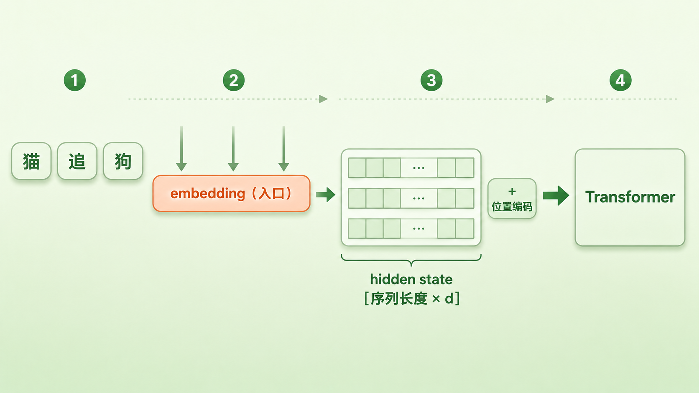

+++
title = "13 Embedding 查表：离散 ID 到连续语义的惊险一跃"
description = "Embedding 是一张可学习的查找表，把模型读不懂的离散 token 编号，翻译成能做数学运算的连续向量——语义计算从这里才真正开始。"
date = 2026-06-23
tags = ["LLM", "Embedding", "词嵌入", "查找表", "one-hot", "分布式表示", "向量空间", "hidden state"]
categories = ["LLM"]
series = ["主线"]
showTableOfContents = true
+++





> Embedding 是一张可学习的查找表，把模型读不懂的离散 token 编号，翻译成能做数学运算的连续向量——语义计算从这里才真正开始。

上一篇结尾我们停在一个画面：tokenizer 把句子切成一个个 token，每个 token 在词表里领到一个编号（id）。「猫」也许是 3021，「狗」也许是 5847。句子就这样变成了一串数字，看起来已经可以喂给神经网络了。

可这里藏着一道最容易被跳过、却决定模型能不能「理解」语言的坎：3021 这个数字，对模型来说到底意味着什么？

> 把它想成给城市里每家店编号。你家楼下的咖啡馆是 3021 号，隔壁奶茶店是 3022 号，城另一头的五金店是 87 号。这些编号能告诉你「哪两家店卖的东西像」吗？完全不能。3021 和 3022 挨着，纯属登记顺序的巧合；87 和 3021 差了几千，也不代表五金店和咖啡馆「差得远」。编号只是身份标签，不携带任何关于内容的信息。

token 编号也一样。它是 tokenizer 登记时随手发的工牌号，「猫」是 3021 不是因为它「大」，换一份词表它可能就成了 88。而模型最想做的事——判断哪些词意思相近、能不能把「猫喜欢吃鱼」的经验推广到「狗喜欢吃肉」——一旦建立在这种空洞的编号上，就彻底没了着力点。这篇要讲的，就是模型怎么完成从「编号」到「可计算的语义坐标」这惊险一跃。


*图：编号只是身份标签（左），坐标却能算远近（右）——token id 到 embedding 的差别正在于此*

## 编号不能直接喂给模型：one-hot 的死胡同

那问题来了：3021 这个数，为什么不能原样丢进神经网络去算？

神经网络的运算是实打实的乘加——它把输入数字乘以权重、相加、再激活。直接喂 3021，模型就会把它当成一个「量」来对待：3021 是 1500 的两倍多，是 87 的三十几倍。可这些大小关系全是假的。编号是**标称量（nominal quantity）**，只用来区分身份，数值大小、彼此间距都没有意义。拿一个意义全是噪声的数去做乘加，模型只会被带偏。

最朴素的修法，是把「比大小」这条路彻底堵死——用 **one-hot 编码**。开一个和词表一样长的向量，第 3021 位写 1，其余全写 0。每个 token 都成了一根「只有一个位置亮着」的长条，谁也不比谁大，彻底平等。

这一步确实解决了「大小是假的」问题，却撞进一条更深的死胡同。

第一，维度爆炸。词表多大，向量就多长。还记得上一篇说的词表常在三万到十万量级吗？那意味着每个 token 都是一根十万维的向量，里面九万九千多个都是 0。又长又空。

第二，也更致命——**任意两个 token 的 one-hot 向量都两两正交**。「猫」的 1 在第 3021 位，「狗」的 1 在第 5847 位，两根向量没有任何一个位置同时亮着，点积（dot product）恒等于 0。

> 在 one-hot 的世界里，「猫」和「狗」的相似度是 0，「猫」和「五金扳手」的相似度也是 0。所有词彼此之间的距离一模一样，像一堆被均匀撒在各个角落、谁也挨不着谁的孤岛。

这就要命了。模型最想要的恰恰是「猫和狗相近、和扳手很远」这种关系，而 one-hot 把所有关系一刀切平。没有相近，就没有泛化——模型在「猫」上学到的东西，一丁点也传不到「狗」身上。

说到底：编号本身的数值是假的，one-hot 消除了假的大小，却又抹平了所有真实关系。我们需要第三种东西，既不靠编号大小，又能让相近的词真的挨在一起。


*图：one-hot 下「猫」「狗」「扳手」两两正交，相似度全是 0——所有词被抹成等距孤岛*

## 查表的真相：一张可学习的大表，和那惊险一跃

怎么既稠密、又能表达关系？答案朴素得出人意料：给每个 token 配一串「坐标」。

> 回到城市那个比喻。与其给店铺发编号，不如给每家店标上经纬度坐标。一标上坐标，「哪两家近」「哪家在市中心」「从 A 到 B 多远」立刻全都能算了。坐标和编号最大的差别在于：坐标携带的是真实的空间信息，而且可以做加减乘除。

Embedding 干的就是这件事：给每个 token 一行固定长度的实数坐标，比如 768 个数。这些坐标整整齐齐码成一张大表——这张表就是 **embedding matrix（嵌入矩阵）**。它的形状记作 \(V \times d\)——V 是词表大小（上一篇那个旋钮），d 是每个向量的长度，业内叫 model dimension 或者 \(d_{\text{model}}\) 这个记号，常见 768、1024、4096。

查 embedding，就是按 token 的编号去翻这张表的对应行：

```python
import torch
import torch.nn as nn

V, d = 50000, 768                 # 词表大小、向量维度
embedding = nn.Embedding(V, d)    # 一张 50000×768 的可学习大表

token_ids = torch.tensor([3021, 5847])   # "猫"、"狗" 的编号
vectors = embedding(token_ids)           # 直接按行号取出对应两行
print(vectors.shape)              # torch.Size([2, 768])
```

「lookup（查表）」这个名字就是这么来的——说穿了就是按行号取一行，没有任何花哨运算。如果你较真，它在数学上等价于用 one-hot 向量去乘整张表：

$$
\mathbf{e}_i = \mathbf{1}_i^\top E
$$

这里 \(\mathbf{1}_i\) 是第 i 位为 1 的 one-hot 向量，\(E\) 是 embedding matrix，乘出来正好是 \(E\) 的第 i 行，也就是 \(\mathbf{e}_i\) 本身。换句话说，one-hot 并没有被丢掉，它被「吸收」进了这张表：one-hot 负责「选中哪一行」，表负责「这一行存什么内容」。工程上没人真去做这个十万维的乘法，直接按下标取行，省时省力。

到这里，那惊险一跃就完成了：一个空洞的整数 3021，变成了一个 768 维的实数向量 \(\mathbf{e}_{\text{猫}} \in \mathbb{R}^{768}\)。从此它不再是一张工牌，而是一个能做加减、求距离、算梯度的几何对象。「离散 → 连续」——这正是标题里那一跃。

而真正让这一跃值回票价的，是一种叫 **分布式表示（distributed representation）** 的存储方式。在 one-hot 里，一个词由一个维度独占（第 3021 位就代表「猫」）；在 embedding 里恰好反过来——「猫」由全部 768 维一起编码，而每一维也不专属某个词，是被所有词共享的。一个词的种种属性——是不是动物、褒义还是贬义、抽象还是具体——就这样被打散、揉进了整串坐标里。

> 这就像描述一个人：one-hot 是发身份证号，一人一号，号与号之间毫无关系；分布式表示则是把身高、性格、爱好、口音……揉成一串特征。两个人可能身份证号天差地别，却在大多数特征上很像。相近，第一次成为可能。

正因为含义被摊在很多共享的维度上，「猫」和「狗」才能在大量维度上彼此重叠，只在少数维度上分开。模型在「猫」身上学到的规律，于是能顺着这些共享维度淌到「狗」身上——这就是泛化的来源。这里也顺手把一个常见误会摆平：这些维度并不是人工命名好的语义轴，你没法指着第 17 维说「这一维管动物性」。语义更多藏在若干维度的组合里、藏在向量空间的某些方向上；单拎一维出来看，多半读不出什么明确含义。

这一节收束成一句：embedding 把符号翻译成坐标，把 one-hot 那片十万维、谁也挨不着谁的正交孤岛，压进一个几百维、彼此有远近的连续空间。



*图：按编号 3021 翻到 embedding matrix 的对应行，取出「猫」的 768 维稠密向量*

## 这些坐标不是设定的，是「喂」出来的

新问题立刻冒出来：谁来决定「猫」那 768 个数到底是多少？有没有一本词典，写好了每个词的标准坐标，让模型去抄？

没有。这件事比抄词典有意思得多。

从头训练一个模型时，embedding matrix 一般是**随机初始化**（random initialization）的——表里每一行都是一串随机噪声。这时候「猫」和「狗」的向量八竿子打不着，「猫」和「扳手」反倒可能凑巧挨得很近，整张表就是一锅乱炖，没有任何语义。（也可以拿别的模型已经练好的 embedding 来开局、省去从零摸索，但故事主线不变：起点不含我们想要的语义，得靠训练长出来。）

但关键在于：这张表是模型参数的一部分，会**跟着训练一起被更新**。还记得前面讲过的训练目标吗——模型反复做「预测下一个 token」，用交叉熵（cross-entropy）衡量预测得好不好，再靠反向传播（backpropagation）把误差回传，一点点修正所有参数。embedding matrix 也在被修正之列。

> 它更像一个小孩学语言：没人给他一本「词义坐标手册」，他只是听了海量的话，发现「猫」和「狗」总出现在相似的句子里——都跟「喂」「叫」「可爱」「毛」凑在一起——于是慢慢把这两个词放到了相近的位置。语义不是被标注进去的，是从「谁和谁常一起出现」里自己长出来的。

训练跑够久，这张表就从一锅乱炖，沉淀成一张有结构的语义地图：意思相近的词，向量也相互靠近。这时候我们终于能回答开头那个「哪两个词像」的问题了——量一量它们向量的相似度就行。最常用的尺子是**余弦相似度（cosine similarity）**，只看两个向量的夹角、不管长短：

$$
\cos(\mathbf{u}, \mathbf{v}) = \frac{\mathbf{u} \cdot \mathbf{v}}{\lVert \mathbf{u} \rVert \, \lVert \mathbf{v} \rVert}
$$

夹角越小、余弦越接近 1，两个词就越像。「猫」和「狗」的余弦会很高，「猫」和「扳手」则很低——这正是 one-hot 那个恒为 0 的相似度，被训练救活之后该有的样子。

这里我只点到为止。这个空间到底长什么形状、「国王 - 男人 + 女人 ≈ 女王」这种类比为什么真能算出来、它又藏着哪些反直觉的坑（比如向量其实挤在一个狭窄的锥形里），是下一篇要钻进去看的事。

这一节的核心：embedding 不是查来的词典，而是被训练数据喂出来的语义地图；坐标的意义，主要来自它在海量上下文里的分布、以及模型为了把「下一个 token」预测得更准而反复施加的梯度——「谁和谁常一起出现」，是这件事最直观的那一层。



*图：随机初始化时词向量一锅乱炖（左），训练后「猫」「狗」聚拢、「扳手」被推远（右）*

## 查完表，向量去哪了：模型的第一层

最后收个尾：一句话查成向量之后，它往哪走？

一整句话经 tokenizer 切成 token、再逐个查表，就得到一串向量。把它们按顺序叠起来，是一个形状为 [序列长度 × d] 的矩阵。不过这还差一步——这串 token 坐标本身不带「先后」，得再叠上一层**位置编码（position embedding）**，大致是 \(H^{(0)} = E_{\text{token}} + E_{\text{pos}}\) 这么回事；凑齐之后，才是真正送进 Transformer 的**初始 hidden state（隐状态）** \(H^{(0)} \in \mathbb{R}^{L \times d}\)（L 就是序列长度）。位置编码本身怎么设计、为什么必须有它，留到 #16 专门讲。

embedding 层因此有个特殊身份：就 token 的内容而言，它是文字进入模型的**主要入口**（位置、注意力掩码这些结构信息另走通道进来）。过了这道门，模型内部就再也看不到「猫」这个字、也看不到 3021 这个编号了，眼里只剩下连续向量。后面那些大名鼎鼎的部件——注意力（Attention）、前馈网络（FFN）——做的全是向量与向量之间的线性代数，它们处理的原料，正是 embedding 递上来的这串坐标。这串坐标怎么被一层层加工，留到第三章 Transformer 架构再讲。

> embedding 是把「语言」翻译成「数学」的海关。翻译只在入口这一次发生，之后整座模型都在纯数学的世界里运转。

这里还埋着一个对称的悬念。入口有这么一张表把编号变成向量；那出口呢——模型在最后一层拿到一个向量 \(h\)，要把它变回「下一个 token 是谁」的概率，办法是再做一次矩阵乘法、把它投影回词表，算出每个候选词的分数（即 \(\text{logits} = h\,W_{\text{out}}^\top\)）。这一步用的矩阵，和入口这张 embedding matrix 大小一模一样——它俩是不是干脆共用同一张表？这就是 weight tying，留到本章稍后那篇细说。

这一节一句话：embedding 是模型的第一层、是文字进入数学世界的入口；它交出的（叠上位置编码后的）hidden state，是后面一切计算的起点。



*图：句子查表叠成 [序列长度 × d] 的 token 表示，再叠上位置编码，构成喂给 Transformer 的初始 hidden state*

## 写在最后

读这篇之前，「embedding」这个词可能透着一股玄乎劲儿，像某种高深的「语义编码术」。读完你会发现它朴素得很：就是一张可学习的查找表，干的活只是把离散编号翻译成连续坐标。

但别小看这次翻译。正是它，让「语义」第一次从一堆无法比较的符号，变成了可以加减、可以度量远近、可以被梯度一点点雕刻的数学对象。模型之所以能「理解」语言，第一步不是因为它聪明，而是因为我们先把语言摆进了一个能做数学的空间——这就是从符号到数学的惊险一跃。

不过，光知道每个词有了坐标还不够。这些坐标凑在一起，构成的到底是个什么样的空间？相近的词真的会聚成一簇吗？传说中「国王 - 男人 + 女人 ≈ 女王」的向量魔法，是真有其事还是美丽的巧合？这个空间又有哪些会坑到人的几何怪癖？下一篇，我们就钻进这个向量空间里，仔仔细细看一看。

## 参考资料

- Bengio et al. (2003), *A Neural Probabilistic Language Model* — 用神经网络学习词的分布式表示的奠基之作。[https://www.jmlr.org/papers/v3/bengio03a.html](https://www.jmlr.org/papers/v3/bengio03a.html)
- Mikolov et al. (2013), *Efficient Estimation of Word Representations in Vector Space*（word2vec）— 让「词向量」与类比现象广为人知。[https://arxiv.org/abs/1301.3781](https://arxiv.org/abs/1301.3781)
- Vaswani et al. (2017), *Attention Is All You Need* — embedding 层与 positional encoding 在 Transformer 中相加构成输入，pre-softmax 投影与 embedding 共享权重（weight tying）。[https://arxiv.org/abs/1706.03762](https://arxiv.org/abs/1706.03762)
- 延伸阅读：Jay Alammar, *The Illustrated Word2vec* — 图解词向量，直觉极佳。[https://jalammar.github.io/illustrated-word2vec/](https://jalammar.github.io/illustrated-word2vec/)
