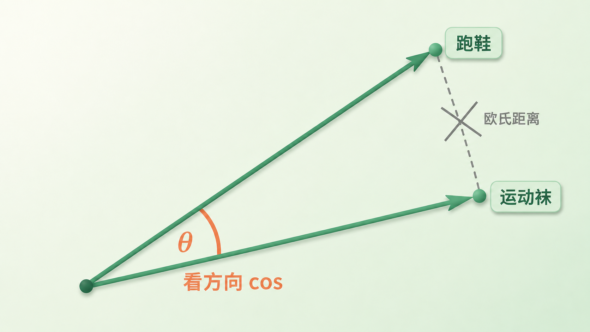
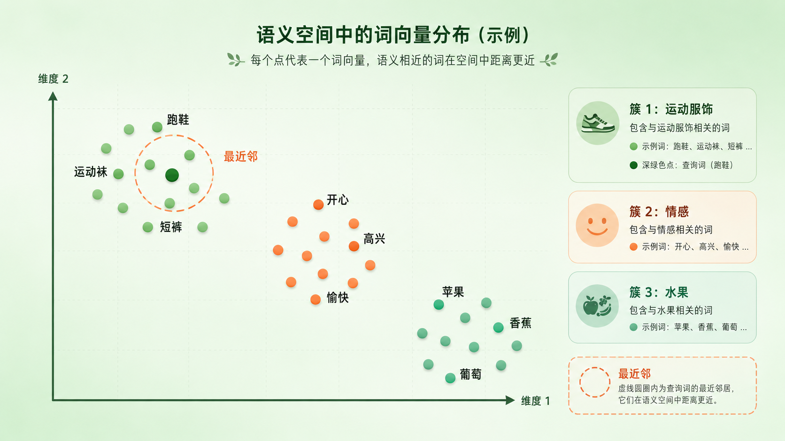
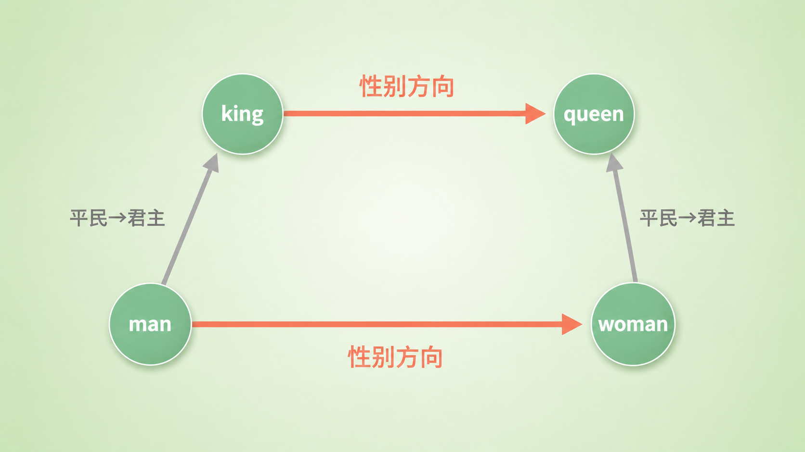
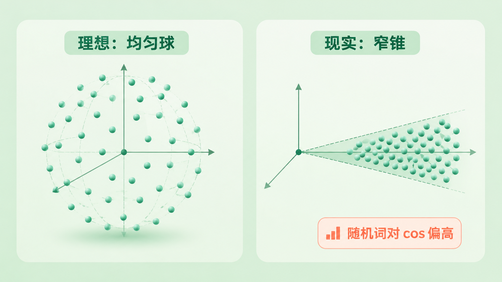

+++
title = "14 几何直觉：向量空间中的类比、距离与各向异性"
description = "把词变成向量后，「相似」成了几何问题——但这套空间布满系统性变形，看起来近的不一定真的近。"
date = 2026-06-27
tags = ["LLM", "Embedding", "词向量", "余弦相似度", "词类比", "各向异性", "anisotropy", "向量空间"]
categories = ["LLM"]
series = ["主线"]
showTableOfContents = true
+++



> 把词变成向量后，「相似」成了几何问题——但这套空间布满系统性变形，看起来近的不一定真的近。

> 前置知识提示：读这篇前，建议先了解 embedding 是查表得到的向量，语义从训练共现里长出来（见第 13 篇）。

你在购物 app 里搜「跑鞋」，它顺手给你推「运动袜」「速干短裤」「慢跑手表」。这几个词没有一个字和「跑鞋」重合，机器凭什么觉得它们「挨得近」？

上一篇我们讲过，每个 token 都被查表变成了一个几百维的向量（embedding），语义不是人标的，而是从训练语料的共现里自己长出来的。那篇结尾留了个尾巴：这些向量之间的「相似」和「距离」到底怎么算、能读出什么——这一篇就来拆它。

我们会看三件事。第一，怎么「读」这个空间，为什么相似度更常看「方向」而不是「原始直线距离」；第二，向量居然能做加减法，「国王 − 男人 + 女人 ≈ 女王」这种类比为什么成立，又在哪里被夸大了；第三，也是最容易被前两节的乐观带跑的——这个空间并不是一个理想的、各处均匀的球，它有系统性的变形，会让「看起来相似」骗过你。

## 方向比距离更靠谱：怎么「读」这个空间

两个词向量摆在几百维空间里，怎么判断它们近不近？最直觉的答案是量它们之间的直线距离——欧氏距离（Euclidean distance），点离得近就相似。这个思路本身没问题，只是直接拿「原始向量」去比欧氏距离会踩个坑，得先处理一下。

> 想象你和朋友站在广场上指方向。你俩都指向「那家咖啡馆」，只是你手臂伸得长、他伸得短——手臂长短不代表你们意见不同，你们指的是同一个方向。词向量也类似：在很多相似度任务里，我们首先关心的是它「指向哪儿」，而不是「伸多长」。

量「方向是否一致」的工具是余弦相似度（cosine similarity）——两个向量夹角的余弦：

$$
\cos(\theta) = \frac{\mathbf{a} \cdot \mathbf{b}}{\|\mathbf{a}\|\,\|\mathbf{b}\|}
$$

分子是点积，分母把两个向量的长度都除掉了，于是结果只和夹角有关：方向完全一致是 1，垂直是 0，相反是 −1。翻译成大白话——我们只关心两个词「指的是不是同一个语义方向」，不关心它们的向量有多长。

那为什么不直接用原始向量的欧氏距离？因为向量的长度（范数，norm）里掺了和语义没直接关系的东西，最典型的就是词频：高频词和低频词在训练里被更新的次数差着数量级，范数会被系统性地拉到不同尺度。直接比原始欧氏距离，「长度差异」会盖过「语义差异」。

不过有两个常见误解得澄清。其一，欧氏距离并不是「永远不能用」：只要先把向量归一化成单位长度，欧氏距离和 cosine 给出的排序就是一回事——对单位向量有 \(\|\hat{\mathbf{a}} - \hat{\mathbf{b}}\|^2 = 2 - 2\cos(\mathbf{a}, \mathbf{b})\)，距离越小 cosine 越大，一一对应。真正该避免的，是拿没归一化的原始向量去比欧氏距离。其二，范数也不是纯噪声：它可能携带词频、置信度、流行度这类统计信号——有些检索系统干脆用点积（dot product）而非 cosine，正是想保留长度里的信息。所以「丢不丢长度」取决于任务：静态词向量比语义相似度时通常归一化、只看方向，但换个训练目标，长度本身可能正是你要的。

有了相似度，就能定义这个空间里最基本的操作——最近邻（nearest neighbors）。给定一个词 \(w\)，在词表 \(V\) 里排除它自己，对其余每个词算 cosine，取最高的 \(k\) 个：

$$
\operatorname{NN}_k(w) = \underset{v \in V \setminus \{w\}}{\mathrm{Top\text{-}}k}\ \cos(\mathbf{w}, \mathbf{v})
$$

「跑鞋」的最近邻是「运动袜」「速干短裤」，「开心」的是「高兴」「愉快」——这就是开头那个推荐的底层动作（注意要排除自身，否则离 \(w\) 最近的永远是它自己）。一堆语义相关的词聚成一团，我们叫它语义邻域（semantic neighborhood）。

*图：从同一原点出发的两个词向量，长度不同但方向几乎一致；相似度看夹角 θ（cosine），而不是连接两端点的原始欧氏距离。*

读这个空间的第一条规矩——先归一化、看方向，相似用 cosine，邻居用最近邻。

*图：体育用品、情绪、水果三组词各自聚成一团；在体育用品簇里选一个查询词，虚线圈出它的最近邻。*

## 向量做算术：类比现象，和它被夸大的地方

如果方向能编码语义，那「方向的差」是不是也编码了某种关系？这就引出了 embedding 最出圈的一个现象。

著名的例子是——把「国王」的向量减去「男人」、再加上「女人」，得到的向量离「女王」最近：

$$
\text{vec(king)} - \text{vec(man)} + \text{vec(woman)} \approx \text{vec(queen)}
$$

把它读成 \(\mathbf{king} + (\mathbf{woman} - \mathbf{man})\) 会更顺：\(\mathbf{woman} - \mathbf{man}\) 是一条「从男性指向女性」的方向，把它加到 king 上，相当于把 king 里的「男性成分」换成「女性成分」，于是落到 queen 附近。这条「性别方向」在很多词对上近似平行：man→woman、king→queen、actor→actress、uncle→aunt 画出来是一组平行的箭头。而平行四边形的另一组对边——man→king、woman→queen——是另一条方向，「平民→君主」。正因为这两组方向各自近似平行，四个点才凑成一个平行四边形。

这说明某些语义关系近似落在一个固定的方向上，或者说一个低维的线性子空间（linear substructure）里——「性别」「单复数」「国家 → 首都」这类关系，可以用空间里一段几乎不变的位移来表示。这也是为什么向量加减法能「算」出类比：你是在沿着某条语义轴平移。

*图：「性别」方向 man→woman 与 king→queen 是两条近似平行的箭头；king − man + woman = king +（woman − man），把男性成分换成女性成分，落到 queen 附近。另一组对边 man→king / woman→queen 则代表「平民→君主」方向。*

但这个现象被科普传得有点神，几个边界必须说清。先看它实际怎么算。以 man、king、woman 求 queen，标准做法叫 3CosAdd——在排除输入词之后，找与「king − man + woman」这个向量 cosine 最大的词：

$$
\mathbf{b}^{*} = \operatorname*{arg\,max}_{x \in V \setminus \{\mathbf{man},\, \mathbf{king},\, \mathbf{woman}\}} \cos\!\big(\mathbf{x},\ \mathbf{king} - \mathbf{man} + \mathbf{woman}\big)
$$

光这个式子就藏着几条容易被忽略的前提：

1. 必须排除参与运算的输入词（man、king、woman）。否则最近邻很可能落在输入词之一上，而不是目标答案 queen。换句话说，「≈ queen」有一部分功劳，是评测帮你把干扰项划掉了。
2. 句法关系比语义关系稳得多。复数、时态这种规则变化的方向很干净；抽象语义关系（「巴黎之于法国」等于「东京之于日本」）成功率明显低，换一组词就翻车。后来的研究还指出，analogy test 能「做对」往往还依赖词对内部本就相似、偏移方向恰好足够强这些条件——它更像对「规则性」的一种间接测量，而不是 embedding 几何的铁证。
3. 不是所有维度、所有关系都能线性运算。能被一段固定位移表示的，只是关系里很小的一类，大多数语义没有这么整齐的几何结构。

向量算术是真的，但它是「部分关系恰好近似线性、评测设置又帮了忙」的产物，不是空间处处都听话。把它当成 embedding 有结构的证据可以，当成万能公式就会摔。

## 为什么「看起来相似」不一定「真的相似」：空间的三个变形

先把范围圈清楚：这一节讲的是第 13 篇那张静态词向量表的几何。上下文表示（contextual embedding）、句向量、检索专用向量也有类似的毛病，但成因和程度并不完全相同，结论不能直接照搬——这点留到讲 attention 时再单独算账。

前两节我们默认这个空间像一个干净均匀的球：词均匀铺在各个方向上，cosine 等于 0 就是「无关」。真实的 embedding 空间不长这样，它有三处系统性变形，全都会让相似度读数失真。

### 各向异性（anisotropy）：所有向量挤在一个窄锥里

理想情况下，两个随机、无关的词，cosine 应该接近 0（方向上互相垂直）。但你真去采样一堆随机词对算 cosine，会发现平均值明显大于 0，即 \(\mathbb{E}_{a,b}[\cos(\mathbf{a},\mathbf{b})] \gg 0\)（具体偏多少，随模型、层数、是否归一化或去均值而变，没有一个固定数）。原因是：所有词向量并没有铺满整个空间，而是挤在一个狭窄的锥形区域里，整体偏向同一侧。

这就麻烦了。当「什么词和什么词都有点正相关」，cosine 的绝对值就不再可信。你看到两个词 cosine 等于 0.4，没法直接说「它们挺相似」——也许这只是大盘的底噪，所有词对都这么高。各向异性是后面所有「相似度读数失真」的总根源。

*图：左为理想——向量均匀铺满各个方向；右为现实——向量全挤进一个窄锥，导致随机词对的 cosine 普遍偏高。*

### 频率偏置（frequency bias）：高频词和低频词住在不同区

接上第一节埋的伏笔。词频不只影响范数，还会系统性地影响向量在空间里的位置：高频词和低频词往往落进不同的几何区域（至于具体谁聚在中心、范数偏大还是偏小，随模型而变，别记死方向）。结果是，词频本身成了一个「隐藏的相似度维度」——两个词可能仅仅因为词频相近就显得「近」，而这和语义毫无关系。做检索、做聚类时，这会让高频功能词莫名其妙地混进结果里。

### Hubness 与中心塌缩：少数「枢纽」成了所有词的邻居

这是高维空间特有的怪病。维度一高，会冒出一小撮「枢纽点」（hub）：它们出现在异常多其他词的最近邻列表里，不管你查什么词，它们都来凑热闹。与之对偶的，是大量向量朝着空间中心（均值）塌缩、彼此挤作一团，最近邻变得没有区分度。直觉上就像一个房间里有几个「社牛」和谁都熟，剩下的人则糊成一片背景。hubness 会让最近邻结果里反复出现那几个万金油词，污染检索质量。

*图：枢纽词 hub 成了众多词的最近邻（箭头都指向它）；另一侧大量向量朝「均值」挤成一团，失去区分度。*

这三个变形有共同的缓解方向——后处理校正。最常见的是把所有向量减去它们的均值（中心化 centering）\(\mathbf{v}' = \mathbf{v} - \bar{\mathbf{v}}\)，把那个「共同偏向」扣掉；更进一步的有白化（whitening），或者干脆删掉方差最大的几个主成分（业界叫 all-but-the-top）。在静态词向量的相似度任务上，这类处理常能把随机词对的 cosine 拉回 0 附近、明显提升表现。但它不是默认必做项：对端到端训练出来的 embedding，随手去掉主成分可能破坏模型本来学到的结构，该不该用得靠下游任务验证。

还有一条更实用的心法：别迷信 cosine 的绝对值。要判断「0.4 到底算不算相似」，得看它在排序里的位置（rank）、对照随机词对的基线、再用任务集或人工标注的相关性去验证——在各向异性的空间里，绝对读数本身没那么有意义。

这个空间的几何确实有用，但它被各向异性、频率、hubness 三重扭曲过。「看起来相似」（cosine 高）和「真的相似」（语义近）之间，隔着一层需要校正、也需要对照基线才能读懂的失真。

## 收尾：从「一堆向量」到「一个有结构、也有变形的空间」

读完这一篇，你对 embedding 空间的认识应该从「一堆能比相似度的向量」，升级成「一个有方向、有结构、但也有系统性变形的几何空间」。我们拿到了三样东西：用 cosine 看方向、用最近邻找语义邻居；用向量算术读出部分线性关系，但要警惕它被夸大；以及最关键的一课——相似度读数会被各向异性、频率、hubness 扭曲，要校正、要对照基线之后才可信。

但我们一直只盯着输入端这张静态的 embedding 表——词进模型时查到的那个向量。还有两个问题悬着。一是这些向量进了 Transformer、被注意力一层层揉过之后，几何会变成什么样（剧透：上下文表示的各向异性只会更猛），这要等讲 attention 时再算账。二是模型在输出端，怎么把最后的隐状态又变回一个词——那张「输出表」和这张「输入表」是什么关系，能不能干脆是同一张？下一篇我们就拆这个镜像：Weight Tying。

## 参考资料 / 推荐阅读

- Mikolov et al., *Efficient Estimation of Word Representations in Vector Space*（word2vec），2013. [arXiv:1301.3781](https://arxiv.org/abs/1301.3781)
- Mikolov et al., *Linguistic Regularities in Continuous Space Word Representations*，2013——king − man + woman 类比的原始论文。
- Rogers et al., *Analogies minus analogy test: measuring regularities in word embeddings*，CoNLL 2017. [arXiv:2010.03446](https://arxiv.org/abs/2010.03446)——剖析 analogy test 为何不能直接当作几何证据。
- Mu & Viswanath, *All-but-the-Top: Simple and Effective Postprocessing for Word Representations*，ICLR 2018. [arXiv:1702.01417](https://arxiv.org/abs/1702.01417)——各向异性与中心化/去主成分校正。
- Ethayarajh, *How Contextual are Contextualized Word Representations?*，EMNLP 2019. [arXiv:1909.00512](https://arxiv.org/abs/1909.00512)——上下文向量的各向异性，为下一章埋的伏笔。
- *Frequency-based Distortions in Contextualized Word Embeddings*，2021. [arXiv:2104.08465](https://arxiv.org/abs/2104.08465)——词频如何系统性扭曲向量几何。
- *Solving Cosine Similarity Underestimation between High Frequency Words by L2 Norm Discounting*，2023. [arXiv:2305.10610](https://arxiv.org/abs/2305.10610)——范数携带频率信息、影响 cosine 估计的一个例证。
- Radovanović et al., *Hubs in Space: Popular Nearest Neighbors in High-Dimensional Data*，JMLR 2010——hubness 现象的系统分析。
