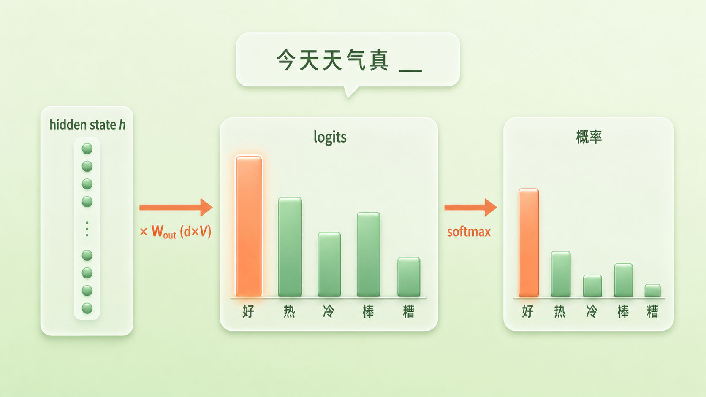
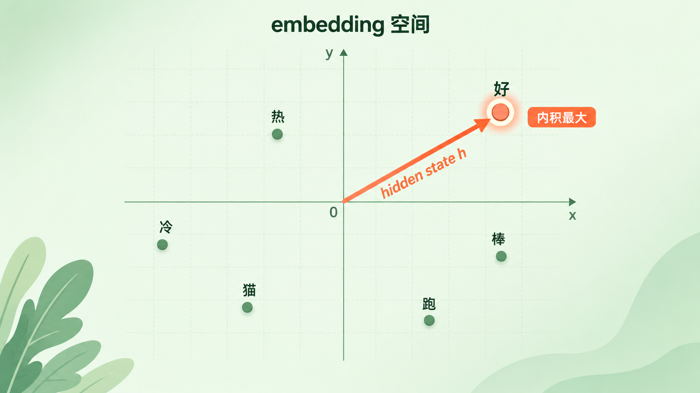
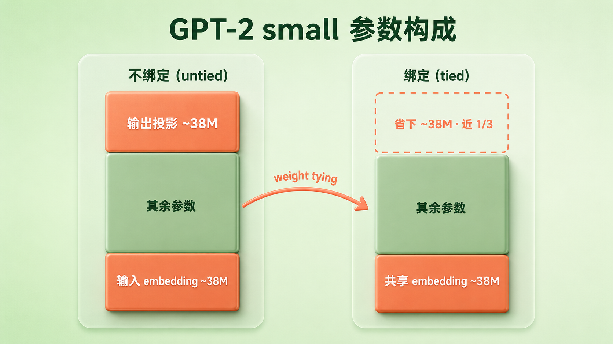
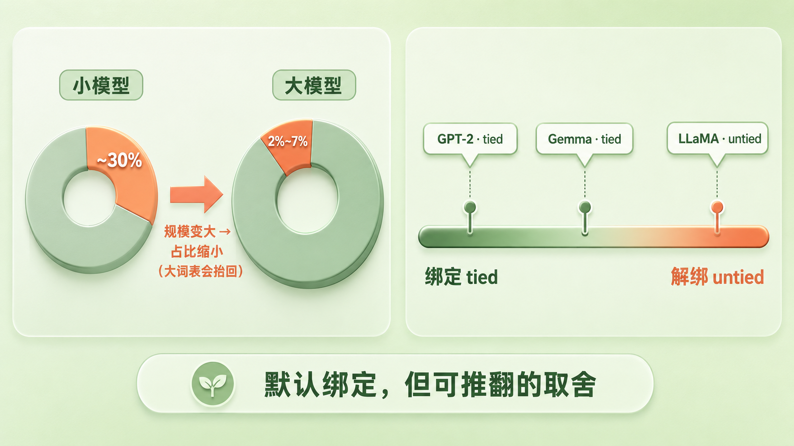

+++
title = "15 Weight Tying：输入输出的镜像关系"
description = "模型输出端把最后的 hidden state 投影回词表得到 logits，这张投影矩阵常和输入 embedding 共享同一套权重——省参数、更一致，但并非必须。"
date = 2026-07-03
tags = ["LLM", "Weight Tying", "权重绑定", "Embedding", "logits", "softmax", "参数量", "输出层"]
categories = ["LLM"]
series = ["主线"]
showTableOfContents = true
+++



> 模型输出端把最后的 hidden state 投影回词表得到 logits，这张投影矩阵常和输入 embedding 共享同一套权重——省参数、更一致，但并非必须。

> 前置知识提示：读这篇前，建议先了解 embedding 查表、logits 与 softmax（见 #4、#13）。

一个认字的人，通常也会写字。看到「好」这个字能认出来、知道它什么意思，是一种能力；提笔想写「好」、在满脑子的字里把它挑出来，是另一种能力。但你不会觉得这是两套彼此独立的知识——认「好」和写「好」，靠的是同一份对「好」这个字的记忆。

语言模型也要同时干这两件事。读一句话时，它得先「认字」：把每个 token 查成一个向量（这就是我们在 #13 讲的 embedding 查表）。生成下一个词时，它又得「写字」：把算到最后的那个向量，变回「词表里到底该输出哪个字」。那问题就来了——模型认字和写字，用的是同一份「字的记忆」吗？

这正是这一篇要讲的 **weight tying（权重绑定）**。要讲清它，得先看看模型的输出端到底在做什么。

*图：输入端「认字」（token → 向量）与输出端「写字」（向量 → token）照同一面镜子，共用同一张 embedding 表*

## 先看输出端：从 hidden state 到 logits

把一句话喂进 Transformer，经过层层计算，模型在最后一层的最后一个位置手里攥着一个向量——通常几百到上万维，记作 \(h\)。它凝聚了「读完这句话之后，接下来该说什么」的全部判断。可 \(h\) 是个连续的向量，而模型要给的答案是离散的：词表里几万个 token，下一个到底是哪一个。这中间隔着一步转换。

> 你可以把 \(h\) 想成一句话的「意图速写」——一段浓缩的、只有模型自己看得懂的描述。输出层要做的，是拿这份速写去和词表里每一个候选词比对：谁跟这份意图最贴，谁的得分就最高。

这一步转换，就是一个线性投影（linear projection）。模型有一张输出权重矩阵，形状是 d×V（d 是向量维度，V 是词表大小）。\(h\) 乘上它，得到一个 V 维向量——词表里每个 token 一个数。这些数就是 logits：

$$
\text{logits} = h \, W_{out}, \quad W_{out} \in \mathbb{R}^{d \times V}
$$

logits 还不是概率，它们是任意实数，有正有负。再过一道 softmax，把它们压成一个和为 1 的概率分布（softmax 的数值细节我们在 #4 讲过）：

$$
P(\text{next} = i) = \frac{e^{\text{logit}_i}}{\sum_j e^{\text{logit}_j}}
$$

举个具体的：模型读到「今天天气真」，最后一层给出 \(h\)。经过 \(W_{out}\)，词表里「好」拿到最高的 logit，「热」次之，「冷」「棒」再往后，剩下几万个词分到很低的值。softmax 之后，「好」的概率最大——这就是模型预测的下一个字。

*图：「今天天气真」→ hidden state 经线性投影得到各候选字的 logits，softmax 后「好」概率最高*

这里有个值得盯住的细节：每个 logit 是怎么算出来的？把矩阵乘法拆开看，第 i 个 logit 就是 \(h\) 和 \(W_{out}\) 第 i 列做点积。也就是说，\(W_{out}\) 的每一列，都是词表里某一个 token 专属的一个 d 维向量；logit 衡量的，是 \(h\) 和这个向量有多「合拍」。

> 输出层的做法，是拿最终的 hidden state 去和词表里每个词的「打分向量」逐一算内积，再归一成概率。

那问题就落到这些打分向量上了：词表里每个词的那个 d 维打分向量，究竟从哪来？

## 镜像：输出的打分向量，其实就是输入的词向量

回想 #13：模型的输入端也有一张表，叫 embedding 矩阵 \(E\)，形状 V×d，词表里每个 token 一行 d 维向量。读句子时，token id 直接去这张表里查出对应的行。

现在输出端又冒出一张 d×V 的矩阵 \(W_{out}\)，每一列也是一个词的 d 维向量。两张表，形状正好互为转置，装的又都是「每个词一个 d 维向量」。你很难不起疑：它们能不能，干脆就是同一张表？

> 回到开头那个认字写字的人。输入 embedding 是「认字」的字典：看到「好」就调出它的含义向量。输出投影是「写字」的字典：手里有个含义向量，就看词表里哪个字的向量跟它最像，写哪个。weight tying 说的就是——认字和写字，用同一本字典。把输入 embedding 矩阵转置一下，直接拿来当输出投影矩阵。

写成公式，就是让

$$
W_{out} = E^{\top}
$$

于是词 i 的 logit 变成：

$$
\text{logit}_i = h \cdot E_i
$$

\(E_i\) 正是 token i 在输入端的那行词向量。在实现层面这一点也很直白：PyTorch / HuggingFace 里输出层通常叫 lm_head，它的权重 `lm_head.weight` 形状是 V×d，和输入 embedding 的权重长得一模一样，算 logits 时写成 `hidden @ lm_head.weight.T`；所谓绑定，就是让这两个 `.weight` 指向同一块张量。

绑定之后，输出层的几何意义就清楚了：预测下一个词，等价于在 embedding 空间里做一次「最大内积打分」（maximum inner product）——拿 hidden state \(h\) 去和每个词向量算内积，谁最大谁的概率最高。不过要当心：这里是内积，并不等于纯粹的「方向最近」。\(h \cdot E_i = \lVert h \rVert \, \lVert E_i \rVert \cos\theta_i\)，词向量的长度也会掺进得分里。只有当向量被归一化之后，它才退化成只看方向的 cosine / 最近邻——这也正是 #14 里我们更偏爱 cosine 的原因：长度往往裹着词频这类无关信息。

*图：把 hidden state h 和每个词向量算内积，「好」的内积最大、得分最高；内积里也含向量长度，不只是方向*

这也顺带说清了「表示一致」到底一致在哪。不做 tying 时，同一个词「好」在输入端有一个向量、在输出端有另一个毫不相干的向量，模型对「好」的理解被劈成了两半；做了 tying，输入和输出共享同一个「好」的向量，模型自始至终用同一套语义坐标看这个词。

> 绑定之后，「预测下一个词」就成了「在词向量空间里给和当前 hidden state 内积最大的那个词打最高分」——输入和输出照着同一面镜子。

## 为什么绑：省参数、对齐表示、两侧一起更新

共享一张表，听起来只是「省事」。但它带来的好处，是实打实的。

第一，省参数，而且省的是大头。embedding 矩阵是模型里最大的单块权重之一：它的规模是 V×d，词表几万、维度上千，随手就是几千万甚至上亿个参数（这正接上 #12 讲的 vocab size——词表越大，这张表越沉）。以 GPT-2 small 为例，词表约 5 万、d=768，光 embedding 表就有约 3800 万参数，接近这个 1.24 亿参数模型的三成。要是输入、输出各用一张独立的表，模型就得再背上同样大的 3800 万。weight tying 把输出这张省掉——而它省的不止是参数量：强行让输入输出共用一套向量，等于给模型加了一道约束、砍掉一半自由度，这在中小模型上往往还起到正则化的作用，参数大幅缩水，效果通常没有明显损失。

*图：GPT-2 small 中，解绑要多存一张约 3800 万参数的输出投影；绑定把它省掉，接近模型的三成*

第二，表示一致。上一节已经讲过：输入输出共享词向量，模型对每个词只维护一套理解，不会「认字时觉得『猫』和『狗』很近，写字时又把它们摆得老远」。语义坐标统一，前后行为更协调。

第三，同一张表从两侧一起被更新。这里要说清一个容易搞错的细节。不做 tying 时，输入 embedding 的更新是稀疏的——一个词的输入向量，只有当它出现在输入里时才收到梯度；而输出投影恰恰相反，它的更新是稠密的——softmax 加交叉熵，会让词表里每一行都收到梯度：

$$
\frac{\partial L}{\partial u_i} = (p_i - \mathbb{1}_{i=y}) \, h
$$

（\(u_i\) 是词 i 的输出向量，\(p_i\) 是模型给它的概率，\(y\) 是真正的下一个词。）意思是，哪怕某个词不是这一步的答案，只要它分到了一点概率，它的输出向量也会被往回推一点。绑定之后，同一个向量既接住输入侧的 lookup 梯度，又接住输出侧这份稠密的分类梯度，读和写两种角色的学习信号落在同一处。最早把这件事讲透的两篇工作（Press & Wolf, 2017；Inan et al., 2016）分析的正是这条更新规则的变化，并在他们的语言模型实验里，用绑定稳定地降低了 perplexity。原始的 Transformer（Vaswani et al., 2017）也采用了这套共享。

> 省掉一张最大的表、把输入输出的语义拧成一股、让同一个词向量在读与写两侧一起被打磨——在中小模型上，weight tying 通常是一笔很划算的买卖。

## 为什么不总绑：一个可推翻的默认项

既然好处这么齐，为什么不把它写成定律？因为上面每一条好处，都带着一个「在什么前提下」。

先说省参数这条，它在大模型里正在褪色，但没那么简单。embedding 那张表只随 V×d 增长，而模型总参数随着层数、宽度、FFN 一起膨胀得快得多，所以模型做大，embedding 的占比通常会往下走——到 LLaMA 7B，这块只剩百分之二左右。可这里有个反方向的力：占比是 V×d 除以总参数，词表一大就会把它重新顶起来。LLaMA 3 把词表扩到 12.8 万，8B 模型里 embedding 又占到约 6.6%，远算不上「可忽略」。所以省参数的动机是随规模减弱、又被大词表拉回，不能只看模型总大小。

再说绑定本身，它也是一种约束。输入端的向量要服务「把词读进来、编码语义」，输出端的向量要服务「在最后一层给候选词打分」——这是两个并不完全相同的目标。绑定等于假设它们的最优解恰好重合。当模型足够大、数据足够多，放开这个约束、让两边各学各的，有时反而能换来一点性能。近年也有分析指出，绑定会把输入表示往输出空间上带偏，在大模型里未必有利——绑不绑，更该按规模和训练配置去实验，而不是当成定理。

还有一层实现上的细节，容易被忽略：尺度。原始 Transformer 在 embedding 层会把向量乘上一个 \(\sqrt{d_{model}}\) 的系数做尺度处理；而输出端 logit 要不要再缩放、归一化，是另一个独立的实现选择。共享一张表时，输入 embedding 的数值尺度会顺着传到输出端 logit 上，影响 softmax 的锐利程度，于是有些实现会在 tied 的基础上再补一道 logit 缩放。这些都在说同一件事：绑不绑，牵一发而动全身，不是「等号一写就完事」。

落到现实，这是一个默认打开、但可以推翻的选择：

| 模型 | 输入 / 输出 embedding |
| --- | --- |
| GPT-2、原始 Transformer | 绑定（tied） |
| Gemma | 绑定（tied） |
| LLaMA 系列 | 解绑（untied） |
| Qwen3 | 小模型绑定 / 大模型解绑 |

没有谁对谁错，只有「在这个规模、这份数据、这套训练配置下，绑还是不绑更划算」。

*图：小模型里 embedding 占比可观、大模型里明显缩小（但大词表会抬回）；主流模型在「绑定—解绑」谱系上各有选择*

> weight tying 是一个通常划算的默认项，不是普适定理——模型越大、词表越小，绑定省下的越薄；而放开它换来的自由，有时更值钱。

## 接上闭环，下一个悬念

读到这里，输入端和输出端在你脑子里应该接成了一个闭环。#13 讲模型怎么把 token 查成向量走进来，这一篇讲它怎么把最后的向量打分成 token 走出去；而这一进一出，很多时候照的是同一面镜子——同一张 embedding 表，正着用是「认字」，转置过来用就是「写字」。所谓 weight tying，不过是承认「认一个词」和「写一个词」本该是同一份知识。

但我们一路上偷偷跳过了一件事。token 查成向量、在 Transformer 里流动、最后打分成下一个 token——整个过程里，模型怎么知道哪个 token 在前、哪个在后？self-attention 本身不带显式的位置特征：光靠它，很难分清「猫追狗」和「狗追猫」——谁在前谁在后，得靠额外的位置编码补进去。那位置信息到底是怎么塞进这些向量的？下一篇（#16），我们从正弦波一路讲到 RoPE。

## 参考资料

- Press & Wolf, 2017. *Using the Output Embedding to Improve Language Models.* arXiv:1608.05859
- Inan, Khosravi & Socher, 2016. *Tying Word Vectors and Word Classifiers: A Loss Framework for Language Modeling.* arXiv:1611.01462
- Vaswani et al., 2017. *Attention Is All You Need.* arXiv:1706.03762（3.4 节 Embeddings and Softmax：输入输出 embedding 与 pre-softmax 投影共享，并对 embedding 乘 √d_model）
- 近年有工作分析 tied embedding 在大模型中的局限（表示偏向 output space、未必总有利），可据此关键词检索最新研究，按自己的规模与配置实验判断。
- 延伸：主流开源实现里的 `tie_word_embeddings` 配置项（如 HuggingFace Transformers），对照不同模型绑 / 不绑的选择。
