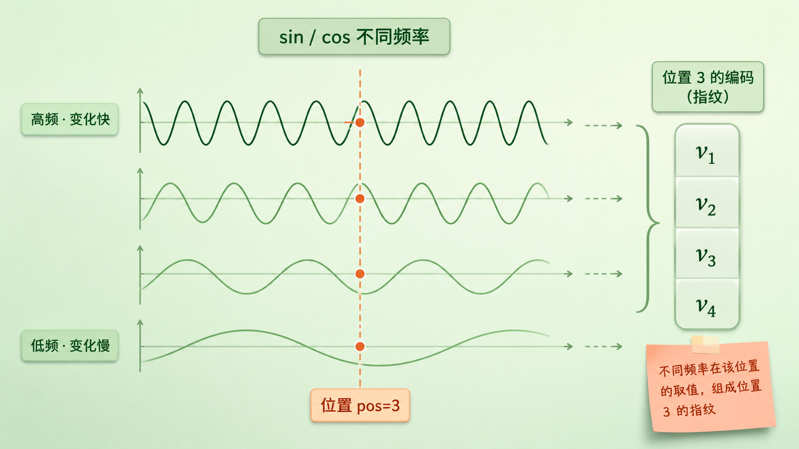
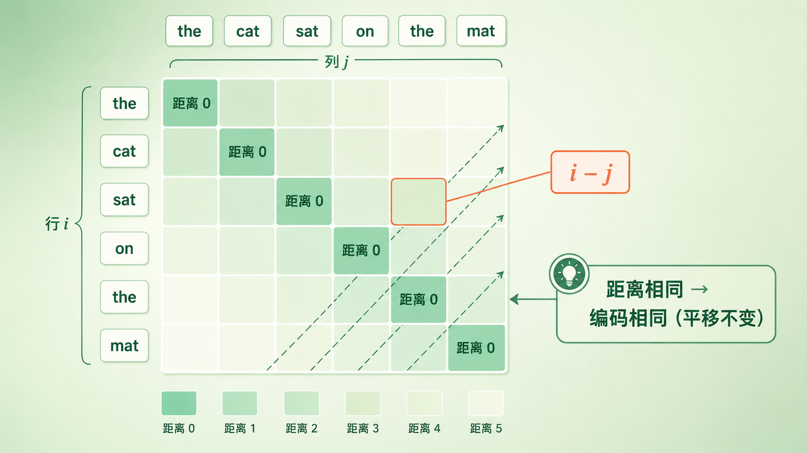
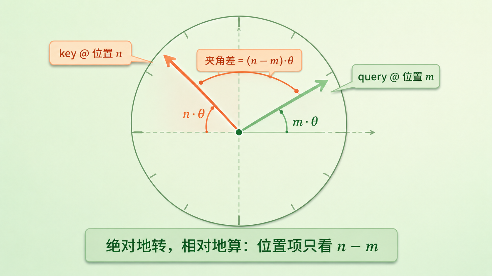
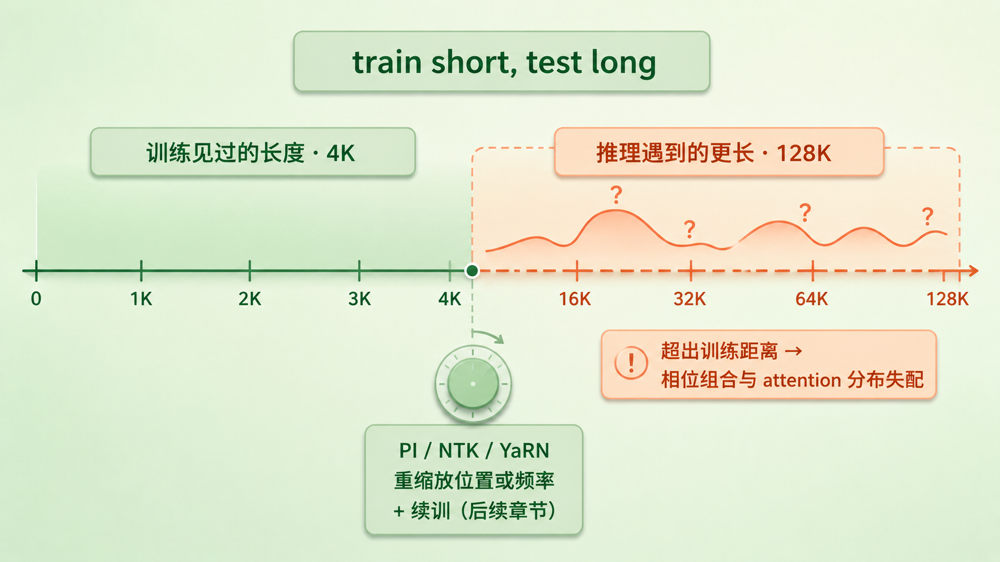

+++
title = "16 位置编码进化史：从正弦波到 RoPE 旋转位置编码"
description = "self-attention 天生把句子看成一袋无序的词，分不清「猫追狗」和「狗追猫」——位置编码就是补上词序的那束信号。从正弦波到 RoPE，讲清现代大模型怎么用一次旋转，让绝对位置算出相对距离。"
date = 2026-07-12
tags = ["LLM", "位置编码", "RoPE", "旋转位置编码", "正弦编码", "相对位置", "self-attention", "Transformer"]
categories = ["LLM"]
series = ["主线"]
showTableOfContents = true
+++



> self-attention 天生把句子看成一袋无序的词，分不清「猫追狗」和「狗追猫」——位置编码就是补上词序的那束信号。从正弦波到 RoPE，这一篇讲清现代大模型怎么用一次旋转，让绝对位置算出相对距离。

> 前置知识提示：读这篇前，建议先了解 embedding 查表和向量内积（见 #13、#14）。self-attention 的完整机制要到下一章才展开，这里只用到它的一个关键特点。

「猫追狗」和「狗追猫」，六个字里用的是同样三个——猫、追、狗，只是换了个顺序，意思就整个反了过来。对我们来说，谁在前谁在后一目了然，语序本身就是意义的一部分。

可就在上一篇结尾我们埋了个悬念：Transformer 的核心零件 self-attention，偏偏对语序不敏感。它读一句话时，会让每个词和其他所有词两两算一遍关联、再加权汇总——可这套运算里，没有任何一处告诉它「猫」排在第一、「狗」排在第三。在它眼里，「猫追狗」和「狗追猫」就是同一堆词。

这就是位置编码（positional encoding）要解决的问题：怎么把「谁在前、谁在后」这条信息，显式地塞进模型。这一篇，我们从最早的正弦波讲起，一路走到今天几乎所有主流开源大模型都在用的 RoPE。

*图：语序相反的两句话，落到无位置信息的 self-attention 眼里是同一袋无序的词——它分不清先后*

## attention 眼里没有前后

先说清楚 self-attention 为什么「看不见」顺序——这是后面一切的出发点。下一章会详拆 attention，这里只需要一个直觉。

它处理一句话的方式，是让每个词都去「看」句子里所有的词，算出「我该多关注你」的权重，再按权重把大家的信息汇总起来。要留意的是，这套操作是「每个词对每个词」的两两关系，本身不带任何「第几个」的标记。

> 你可以把它想成：把一句话里的词全抓出来丢进一个碗里，搅一搅。这个碗记得住里面有哪些词、它们彼此有多相关，却记不住你是按什么顺序丢进去的。这正是经典的「词袋」（bag of words）视角。

说得更准确些，一个既不带位置编码、也不带掩码的 self-attention，具有置换等变性（permutation equivariance）：你把输入词的顺序打乱，它的输出只会跟着以同样的方式打乱，内容不变——

$$
\text{Attn}(\pi \cdot X) = \pi \cdot \text{Attn}(X)
$$

这里 \(X\) 是输入序列，\(\pi\) 是任意一种重新排列。对这样的 attention 而言，序列更像一个集合，而不是一个有序列表，「猫追狗」和「狗追猫」在它看来就是同一盘词。

这里得留个诚实的注脚。下一章会讲到，decoder-only 的大模型还带一层因果掩码（causal mask）——每个词只能看它前面的词。这层掩码本身就打破了上面那条等变性，还悄悄漏了点位置信息（「我前面有几个词」）；确实有研究发现，哪怕完全不加位置编码，带掩码的模型也能学到一些位置感。但这点隐式信号又弱又不好控，想稳定地建模相对关系、撑起长上下文，显式的位置编码仍是主流做法。位置该补，问题只在怎么补。

那最笨的补法呢？给每个词贴个座位号：第 0 个、第 1 个、第 2 个……把这个整数直接拼到词向量上。这不是完全不能用，但很别扭：裸整数对数值尺度很敏感，表达能力单一，缺少适合序列关系的多尺度结构；而且句子一长，测试时的位置会远远超出训练见过的范围，成了模型没见过的输入；点积注意力也很难从一个裸标量里直接读出「两个词隔多远」。我们想要的，是一种有界、连续、每个位置都能区分、还能自然透出相对距离的位置信号。

> attention 天生分不清词序，位置必须显式补进去；难点不在「要不要补」，而在「用什么形式补」。

## 绝对位置编码：给每个位置发一张指纹

最直接的思路，是给每一个位置造一个专属向量——第 0 个位置一个、第 1 个位置一个——把它加到该位置的词向量上。这样同一个词出现在不同位置，就带上了不同的「位置味道」，attention 便能借此分辨先后。这类做法统称绝对位置编码（absolute positional encoding）。

> 这就像给每个座位印一张条码。难点在于：条码不能乱设计——最好既能把每个座位区分开，又能让人从两张条码的关系里读出它们隔了几个座位。

原始 Transformer 给出的方案很巧：正弦位置编码（sinusoidal）。它让位置向量的每一维，都是位置 pos 的一个正弦或余弦函数，而且不同维度用不同的频率：

$$
PE_{(pos,\,2i)} = \sin\!\left(\frac{pos}{10000^{2i/d}}\right), \quad PE_{(pos,\,2i+1)} = \cos\!\left(\frac{pos}{10000^{2i/d}}\right)
$$

直觉上，这像一组走速不同的时钟指针：靠前的维度频率高、转得快，靠后的维度频率低、转得慢。快慢不一的指针叠在一起，给每个位置一个独一无二、又连续变化的多尺度「相位指纹」。选 sin/cos 还有个更关键的好处：位置 pos+k 的编码，可以写成 pos 编码的一个固定线性变换——也就是说，「平移固定的距离」对应「固定的旋转」，相对位置的信息就这样被编了进去。不过这里有个常见的误读要避开：不同频率给的是「多尺度的相位」，不是「距离尺」——两个位置编码之间的差只由间隔 k 决定，却会随 k 周期性起伏，并不是隔得越远、差得就越大。

*图：高频波变化快、低频波变化慢；在 pos=3 处竖切各波，取到的一列值拼成位置 3 的多尺度相位指纹*

后来 BERT、GPT 这些模型嫌手工设计麻烦，干脆让位置向量也变成可学习的（learned absolute PE）：准备一张「最大长度 × 维度」的表，和词表 embedding 一样，让模型自己训练出每个位置该长什么样。更灵活，却埋了个硬伤——这张表只有「最大长度」那么多行。训练时最长见过 512，表里就只有 512 行；推理时来了第 513 个位置，根本没有对应的编码可查。这就是绝对位置编码「训练多长、只能用多长」的外推短板（正弦编码理论上能算任意位置，但实践中外推同样一般）。

> 绝对位置编码回答的是「你在第几个」。可句子里更本质的关系，往往不是「你在第几个」，而是「你俩隔多远」。

## 换个问题：重要的是「隔多远」

看这句话：the cat sat on the mat。cat 和 sat 关系紧密，是因为它们紧挨着。现在把整句话往后平移——前面加十个词——cat 和 sat 成了第 12、13 个词，绝对位置全变了，可它俩的关系一点没变，还是紧挨着。真正决定它们如何互相关注的，是相对距离，不是绝对序号。用绝对位置来编码这件事，其实绕了个弯。

> 好比报时间。你问「现在几点」，得到的是一个绝对时刻；但很多时候你真正想知道的是「离出发还有多久」——那个差值。相对位置编码，索性直接编码这个「差」。

于是有了相对位置编码（relative positional encoding）。Shaw 等人 2018 年的做法，是在 attention 内部给每一对 token，按相对距离 i−j 加一个可学习的向量；T5 更简化，直接在 attention 打分上加一个按相对距离分桶的标量偏置。它们的共同点是：编码的对象从「绝对序号」换成了「token 之间的距离」，因此对整体平移天然不敏感，也通常比「训练多长就只有多长」的可学习绝对位置表更容易伸到长序列。不过「更容易」不等于「一定行」：Shaw 会把超过阈值的距离截断、T5 会把远距离塞进有限个桶——超出范围后，精确的距离信息就丢了；真外推到底行不行，还得看距离怎么截断、怎么分桶、训练时见过多长。

*图：以 token 两两配对成矩阵，格子按相对距离 i−j 着色；对角线为距离 0，距离相同的格子颜色一致，天然平移不变*

但相对位置编码也有它的别扭：这些方案大多要往 attention 的分数里塞偏置、或额外查一张「相对位置表」，等于要动 attention 的内部结构，还常常带来额外的计算和存储。于是一个更贪心的问题浮了出来：能不能既保留绝对编码那种「作用在向量上、算起来干净」的形式，又让 attention 真的只看相对距离？

> 这个「既要又要」的漂亮答案，就是 RoPE。

## RoPE：把位置编码变成一次旋转

RoPE（rotary positional embedding，旋转位置编码）出自 2021 年的 RoFormer，它的做法有点出人意料：不再往向量上「加」一个位置向量，而是把向量「转」一个角度。

> 把每个词向量想象成钟面上的一根指针。位置排在第 m 个的词，就把它的指针从起点转过 m×θ 那么多；越靠后的词，转得越多。等到位置 m 的 query 和位置 n 的 key 在 attention 里「打分」——也就是算内积——两根指针的内积只取决于它们转过的角度之差 (n−m)×θ，只和它们隔多远有关。绝对地转，相对地算。

把这句话形式化。先看最简单的二维情形：一个二维向量，位置为 m 时，就左乘一个旋转矩阵 \(R(m\theta)\)：

$$
R(m\theta) = \begin{pmatrix} \cos m\theta & -\sin m\theta \\ \sin m\theta & \cos m\theta \end{pmatrix}
$$

关键的魔法在内积这一步。位置 m 的 query 转 \(R(m\theta)\)、位置 n 的 key 转 \(R(n\theta)\)，它们的内积是：

$$
\langle R(m\theta)\,q,\; R(n\theta)\,k \rangle = q^{\top} R(m\theta)^{\top} R(n\theta)\, k = q^{\top} R\big((n-m)\theta\big)\, k
$$

两个旋转一相乘，绝对的 m 和 n 消掉了，只剩下差值 n−m（这里把「key 相对 query 的位移」定义成 n−m）。说准一点：打分仍然取决于 query 和 key 的内容——是这两个词本身有多相关；RoPE 改的只是，其中和位置有关的那部分，只通过相对位移 n−m 进来，绝对的 m、n 不再单独出现。

举个最小的例子。设 query 和 key 都是二维单位向量 \(q=k=(1,0)\)，位置分别是 m=2、n=5，那么打分就是 \(\cos\big((5-2)\theta\big)=\cos 3\theta\)——它只由相对距离 3 决定，和这俩词具体排在第几个无关。顺带你也能看出：这个值是随距离余弦振荡的，并不是「越远越小」。

*图：query 转 m·θ、key 转 n·θ，两者夹角差恰为 (n−m)·θ——绝对地转，相对地算，位置项只由 n−m 决定*

真实的向量是几百上千维，不是二维。RoPE 的处理是把它每两维分成一组，每组当成一个二维平面单独旋转，第 i 组用自己的频率：

$$
\theta_i = 10000^{-2i/d}, \quad i = 0, 1, \dots, \tfrac{d}{2}-1
$$

这里的 d 不是整个模型的 hidden size，而是每个注意力头里 query/key 参与旋转的维度（多头注意力下一章会讲；最基础的 RoPE 里，它就等于单个头的维度，且要求是偶数，才好两两配对）。这个 10000 的底和正弦编码同出一辙：高频的组（θ 大）转得快，刻画近距离的差别；低频的组（θ 小）转得慢，管远距离。

有三点值得盯住。

其一，RoPE 转的是 query 和 key，不是词向量本身，也不是 value，而且是在每一层 attention 算 q·k 之前才转。所以它是「注意力内部的位置」，而不是「加在输入上的位置」——这也是它和正弦编码最根本的分野。

其二，绝对的形式、相对的效果。每个词的旋转角只看它自己在第几个（绝对），但打分里和位置有关的部分只依赖相对位移（相对）。前面相对位置编码想要的本质，被它用一个更干净的形式拿到了。

其三，远程衰减（long-term decay）的倾向。RoFormer 把这些频率搭配起来，让「跨越很多频率求和」的注意力得分，整体上带有一点「离得越远、位置带来的关联越弱」的倾向——这和「挨得近的词通常更相关」的语言直觉合拍。但别把它当铁律：像上面 \(\cos 3\theta\) 那样，单看某一对 query/key，得分完全可以随距离振荡，而且始终被两个词的内容牵着走。远程衰减是一种归纳偏置，不是「距离越大注意力一定越小」的保证。

正因为简单（只是旋转，不加参数、不改 attention 的结构）、外推相对友好、又能和 FlashAttention 这类高效实现无缝配合，RoPE 成了当下最常见的位置方案之一：开源的 decoder-only 大模型里，Llama、Qwen、Mistral 等家族清一色用它。当然这不是唯一路线——T5 系列走的是相对位置偏置，也有 ALiBi、甚至干脆不加显式位置编码（NoPE）等做法并存。

> RoPE 用「按位置旋转向量」这一个动作，把「绝对位置」和「相对距离」缝到了一起——这正是绝对与相对两条路线多年拉扯后一个漂亮的收敛点。

把这一路的方案摆到一张表上，就能看清它们不是「新的淘汰旧的」，而是在「怎么注入位置、要不要加参数、动不动 attention、长度怎么扩」上各有取舍：

| 方案 | 注入方式 | 额外参数 | 是否改 attention | 长度扩展 |
| --- | --- | --- | --- | --- |
| Sinusoidal APE | 加到输入 embedding | 无（公式固定） | 否 | 理论可算任意位置，实测外推一般 |
| Learned APE | 加到输入 embedding | 有（位置表） | 否 | 卡在最大训练长度 |
| Shaw RPE | 加到 K/V 计算 | 有（相对向量） | 是 | 距离截断，超出即失真 |
| T5 bias | 加到 attention 打分 | 有（分桶偏置） | 是 | 分桶，远距离粗糙 |
| RoPE | 旋转 Q/K | 无 | 否（只转 Q/K） | 需插值/缩放，配合续训 |
| ALiBi | 加到 attention 打分（线性斜率） | 无 | 是 | 为外推设计，天然更稳 |
| NoPE | 不显式注入 | 无 | 否 | 靠因果掩码隐式感知 |

## 从「第几个」到「隔多远」，还有一道没解的题

读完这一篇，你对「位置」的理解，应该已经从「给每个词贴个序号」挪到了「让 attention 感知词与词之间的距离」。正弦波和可学习编码，把位置当绝对坐标加进向量；相对位置编码换了个问题，直接去编码距离；而 RoPE 用一次旋转，让绝对的操作产出相对的效果——这也是今天开源大模型里最常见的位置方案。位置这条线，到这里算是接上了。

不过 RoPE 也留了个尾巴。一旦推理时的序列长度远远超出训练长度，模型就会撞上两件训练时没见过的事：一是从没出现过的相对距离，二是各个频率维度凑在一起、从没一起出现过的相位组合。注意，问题不在「角度太大」——旋转本来就是 2π 一圈，高频维度在训练长度内早转过好多圈了；真正失稳的，是这些相位组合让 attention 的分数分布整个跑偏。怎么办？位置插值（PI）把位置索引线性压回训练见过的范围，NTK-aware 和 YaRN 则去重新缩放频率谱（YaRN 还分频段处理、外加一点 attention 缩放），而且这些手法通常还得配一轮继续训练——毕竟「把窗口撑到 128K」和「真的用好这 128K」是两码事。这条线怎么展开，我们留到后面的长上下文章节再拆。

*图：模型在训练见过的 4K 内稳定，推理到 128K 时撞上没见过的相对距离与相位组合，attention 分布跑偏——外推正是后续章节要解的题*

而在处理超长序列之前，我们得先真正走进 Transformer 本身。这一整章我们一路在给 self-attention、FFN、残差、归一化这些零件「打预告」，却还没正经拆过任何一个。从下一篇（#17）起，新的一章开始——就从「一个 Transformer block 到底长什么样」讲起。

## 参考资料

- Vaswani et al., 2017. *Attention Is All You Need.* arXiv:1706.03762（3.5 节 Positional Encoding：正弦位置编码）
- Shaw, Uszkoreit & Vaswani, 2018. *Self-Attention with Relative Position Representations.* arXiv:1803.02155（相对位置编码）
- Raffel et al., 2020. *Exploring the Limits of Transfer Learning with a Unified Text-to-Text Transformer (T5).* arXiv:1910.10683（relative position bias）
- Su et al., 2021. *RoFormer: Enhanced Transformer with Rotary Position Embedding.* arXiv:2104.09864（RoPE 原始论文，含 long-term decay 分析）
- Press, Smith & Lewis, 2021. *Train Short, Test Long: Attention with Linear Biases Enables Input Length Extrapolation (ALiBi).* arXiv:2108.12409（为长度外推设计的注意力偏置）
- Haviv et al., 2022. *Transformer Language Models without Positional Encodings Still Learn Positional Information.* arXiv:2203.16634（因果掩码泄漏位置信息 / NoPE）
- Kazemnejad et al., 2023. *The Impact of Positional Encoding on Length Generalization in Transformers.* arXiv:2305.19466（各类位置编码的长度泛化对比）
- 延伸：Position Interpolation（Chen et al., 2023, arXiv:2306.15595）、YaRN（Peng et al., 2023, arXiv:2309.00071）——RoPE 的长度外推方法，留待长上下文章节。
