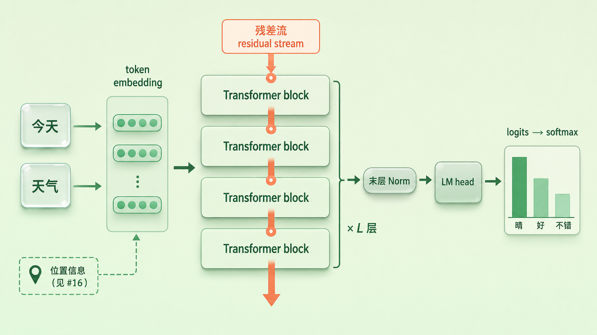
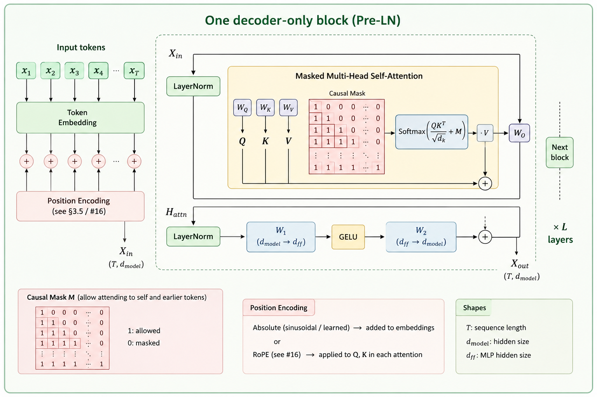
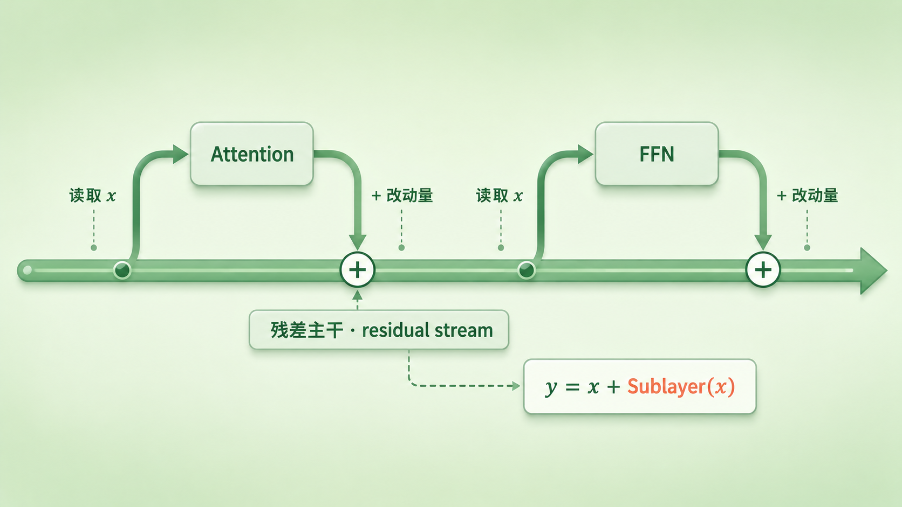
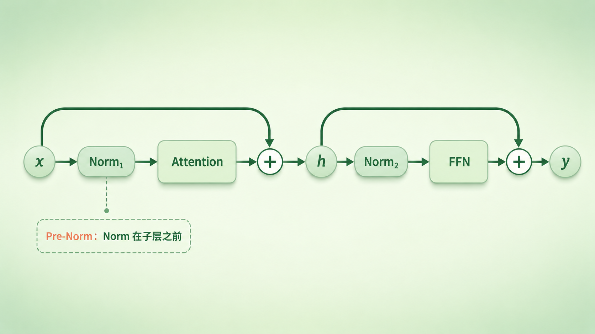
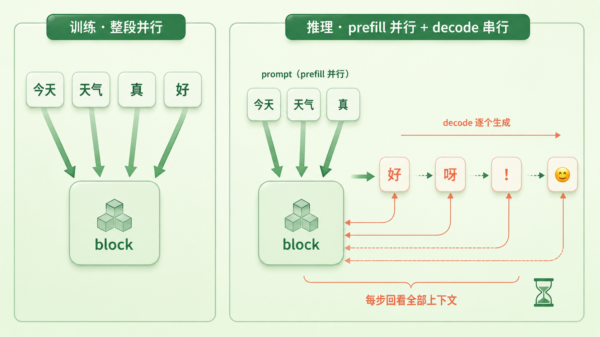

+++
title = "17 一个 Transformer Block 的「最小骨架」"
description = "把 GPT、Llama 拆开，里面是同一块结构摞了几十层。这一篇讲清 decoder-only Transformer block 的最小骨架：两个子层、一条残差主干、每个子层各配一道归一化。"
date = 2026-07-19
tags = ["LLM", "Transformer", "decoder-only", "残差连接", "归一化", "Pre-Norm", "FFN", "注意力"]
categories = ["LLM"]
series = ["主线"]
showTableOfContents = true
+++





> 把 GPT、Llama 拆开，里面是同一块结构摞了几十层。这一篇讲清这块 decoder-only Transformer block 的最小骨架：两个子层、一条残差主干、每个子层各配一道归一化。

> 前置知识提示：读这篇前，建议先了解 token embedding 与词向量（见 #13、#14），以及上一篇讲的位置编码（#16）——本篇讲的，正是这些输入向量进入模型后，在一层里会经历什么。

这是全书第三章《Transformer 架构：训练视角 vs 推理视角》的开篇。前两章我们一直在备料：把文字切成 token、变成带语义的向量、看清向量空间的几何、把输入输出 embedding 绑到一起，再把位置信息装进去。原料齐了，该进加工车间了——这个车间就是 Transformer。这一章会逐个拆开它的零件：注意力、FFN、归一化、因果掩码、KV cache……但在拆零件之前，得先有一张总图。这一篇就画这张图：一个 Transformer block 长什么样，一份数据是怎么从它下面流到上面的。

「基于 Transformer 架构」这句话，你大概听过无数遍。GPT 是，Llama 是，Qwen、Mistral 也都是。可要是真把它们中任何一个拆开，你会发现里面并没有什么神秘的庞然大物——只是同一块结构，几乎一模一样地摞了几十层。这一块，就是 Transformer block（Transformer 块）。

先把范围圈清楚：本篇讲的是 GPT、Llama、Qwen、Mistral 这类 **decoder-only 因果模型**用的基本 block，也是今天绝大多数大语言模型的骨架。最早那版 encoder-decoder Transformer 的 decoder 还多挂一个 cross-attention 子层，MoE、滑动窗口注意力等则是在这副骨架上的变体——这些各有归属的篇目，本篇只讲最常见的那副骨架。

搞懂一块，就搞懂了大半，剩下的只是把它摞高而已。所以这一篇不贪多，只回答一个问题：这一块里到底装了什么，数据又是怎么流过它的。


*图：token embedding（位置信息按架构注入，见 #16）→ 同一块 block 堆叠 L 层（残差流贯穿）→ 末层 Norm → LM head 出 logits → softmax 得到下一个词的概率*

## 先看全景：一块 block 站在流水线的哪一段

在钻进一块 block 内部之前，先退一步看它在整个模型里的位置。

一句话可以概括数据的旅程：文字先变成 token，每个 token 查表得到一个词向量（embedding）；至于位置信息怎么进，取决于用的是哪种位置编码——绝对位置编码把它加在输入向量上，而 Llama、Qwen 这些模型用的 RoPE，是在每一层 attention 内部旋转 Q/K 来注入的（见 #16）。备好的这串向量从下往上，穿过一摞 block，经过最后一道归一化，再由输出层投影成每个候选词的分数。中间那「一摞」，就是模型的主体。

> 可以把模型主体想成一栋楼：每一层的户型完全一样，只是住的信息不同。你不需要看懂整栋楼，看懂一层，再知道它是怎么摞起来的，就够了。

说得正式些：模型主体是 \(L\) 个 block 首尾相接，前一块的输出正好是后一块的输入：

$$
x_\ell = \text{Block}_\ell(x_{\ell-1}), \quad \ell = 1, 2, \dots, L
$$

这里的「一样」只指结构一样——每一层都有自己独立的一套参数，并不是把同一份权重复制去用（就像那栋楼每层户型相同，住户和摆设却各不相同）。

还有个容易被忽略、却很关键的事实：一串向量进入一块 block 时是 \(d\) 维，出来还是 \(d\) 维——形状分毫不变，变的只是里面的内容。这个贯穿始终、宽度恒为 \(d\) 的通道（\(d\) 就是常说的 hidden size / 模型维度），后面会反复提到，它有个名字叫**残差流（residual stream）**。正因为每块的进出形状一致，才能像搭积木一样想摞多高摞多高。

小结一句：模型主体就是同一种结构的 block 摞 \(L\) 层（各层参数独立）；每一块进出都是 \(d\) 维的向量序列，不改变形状，只改变内容。

## 一块里做两件事：先通信，再计算

现在打开一块 block。里面其实只有两个部件，各干一件事。

> 把一块 block 想成一次短会。一屋子人（每个 token 是一个人），先花几分钟互相通气、对齐一下各自掌握的信息；然后各自回工位，埋头把刚听来的东西消化成自己的结论。先通信，后计算——一块 block 就是这么一轮。

这两步分别对应两个子层。

第一步的通信，由**注意力子层**（attention sublayer）完成。它是整块 block 里**唯一**让不同位置之间流通信息的地方：每个位置的新向量，都是从它能看到的那些位置的信息里加权汇聚出来的。要补一句：在 decoder-only 因果模型里，「能看到的」并不包括未来——第 \(i\) 个位置只能读到它自己和它前面的位置，看不到后面的（靠因果掩码实现，机制留给 #19）。至于权重具体怎么算、Q/K/V 和 softmax 那一套是怎么回事，是 #20 的正题，这里只需记住它的角色：**跨位置搬运信息**。

第二步的计算，由 **FFN 子层**（feed-forward network，也叫 MLP）完成。它是一个小小的前馈网络——原始 Transformer 里是两层线性变换夹一个非线性，Llama、Qwen 这些现代模型多改用 SwiGLU 等门控变体，但共同点没变：它**逐位置、独立地**作用在每个 token 上，处理第 3 个位置时完全不去看第 5 个位置。它不跨位置，只把每个 token 自己的向量做一次非线性加工。至于它为什么被不少研究看作模型存放知识的重要载体、又为什么常常吃掉一大半参数，留给 #22。

> 一句话对照：attention 负责「你们互相看看」，FFN 负责「各自想想」。前者在位置之间搬运，后者在每个位置内部加工。

所以摞 \(L\) 层 block，本质上就是「看—想—看—想」来回 \(L\) 轮：每一轮都先让 token 交换一次信息，再各自消化一次。



*图：一块 block 内部——上半区 attention 子层里，每个 token 只连向自己和它前面的 token（因果方向，不看未来），下半区 FFN 子层对每个 token 独立加工（各列之间没有连线）*

小结一句：一块 block = 一次跨位置通信（attention）+ 一次逐位置计算（FFN）；attention 是整个模型里唯一让不同位置流通信息的环节。

## 残差连接：那条一直没断的主干道

到这里你可能会想：既然一块里是 attention 接 FFN，那把它们串起来不就行了——\(x\) 进 attention，输出再进 FFN，一路覆盖过去？真这么搭，模型一深就训不动了。真正的接法多了一个动作：**把输入加回来**。

> 把它想成一条主干道加几个服务区。信息在一条主路上一直往前跑；每个子层不是拦在路中间的收费站，而是路边的一个服务区——从主路上把当前车流复制一份进去加工，再把加工出的「改动量」并回主路，主路本身从不中断。子层学的是「在原来的基础上改点什么」，而不是「推倒重来造一份新的」。

这就是**残差连接（residual connection）**：

$$
y = x + \text{Sublayer}(x)
$$

子层的输出不直接替换 \(x\)，而是作为一个增量（delta）加回到 \(x\) 上。就这么一个加号，带来两个大不一样的好处。

**一是深了也能训。** 深层网络有个老毛病：反向传播时，梯度要一层层穿过每个子层，连乘下来越到底层越容易衰减到接近零，底层几乎学不动。残差里那个「+ \(x\)」给梯度添了一条恒等的近路——它不必只靠子层们的连乘来存活，也能顺着主干直接往下传。梯度不会因此完全不变，但深堆叠明显好训了：几十上百层能摞起来，这个加号是头号功臣。

**二是它成了一条共享的信息总线。** 因为每一层都往同一条主干上「读一点、加一点」，这条贯穿始终的通道（就是前面说的残差流）就变成了各层共享的公告板：靠前的层写进去的东西，靠后的层还能读到、还能在上面接着改。想弄懂 Transformer 内部信息是怎么流动的，盯住这条残差流，往往比盯住某一个孤立的子层更有用。



*图：残差主干 x 一路不断，attention 与 FFN 像路边两个服务区，各自读一份、算出改动量，再用加号并回主干*

小结一句：残差连接让每个子层只学「增量」，既给梯度铺了一条更直达底层的近路，又把整条主干变成了各层共享的信息总线。

## 装上归一化，拼成一整块

有了两个子层和残差，还差最后一块拼图。光靠前面那些，深堆叠仍可能训崩：各层数值的尺度会越滚越大或越缩越小，一路累加尤其容易失控。

> 办法是在每个子层的入口放一个「稳压器」：不管进来的电压飘到哪，先把它拉回到一个统一的稳定区间，再送进子层。

这个稳压器就是**归一化（normalization）**。现代主流做法是把它放在子层**之前**（称为 Pre-Norm）。装上之后，一整块 block 的两步更新就长这样（两处 Norm 是各自独立的模块、各有一套参数）：

$$
\begin{aligned}
h &= x + \text{Attention}(\text{Norm}_1(x)) \\
y &= h + \text{FFN}(\text{Norm}_2(h))
\end{aligned}
$$

写成代码更直白：

```python
# 一个 decoder-only block；norm1/norm2/attn/mlp 各有独立参数，层与层之间也不共享
h = x + attn(norm1(x), causal_mask, pos_info)   # 跨位置通信：只看自己和更早的位置
y = h + mlp(norm2(h))                            # 逐位置计算：各位置彼此独立
```

读法很直白：先把 \(x\) 归一化、送进 attention、结果加回 \(x\) 得到中间量 \(h\)；再把 \(h\) 归一化、送进 FFN、结果加回 \(h\) 得到 \(y\)。\(y\) 就是这块 block 的输出，原样交给下一块。要留意的是，归一化只作用在「进子层」的那一份复制上，主干道 \(x\)、\(h\) 始终原样保留——稳压和残差各管各的，谁也不挡谁。

至于这个 Norm 具体怎么算（是 LayerNorm 还是更省的 RMSNorm）、为什么现代大模型偏爱把它放在子层前面（Pre-Norm）而不是后面（Post-Norm），对训练稳定性影响很大，是下一篇 #18 的正题，这里先按下不表。顺带说一句，Pre-Norm 是当下许多 decoder-only 大模型的常见选择，但不是唯一答案——有些较新的模型还会在子层输出端再补一道归一化，这些差异也一并留给 #18。

结构图里还常冒出一个小零件：dropout。原始 Transformer 会在子层输出上随机丢弃一小部分数值做正则，防过拟合；到了数据量巨大的现代大模型预训练，它的存在感低了很多，常被调得很小甚至直接省掉。骨架里知道有它这么一层就够了。



*图：一整块 block（Pre-Norm）——x 经 Norm₁ 进 attention、结果加回得 h；h 经 Norm₂ 进 FFN、结果加回得 y；两条残差旁路绕过 Norm 与子层*

小结一句：一整块 block = 归一化 + 子层 + 残差，做两次（attention 一次、FFN 一次）；把归一化放在子层前面的 Pre-Norm，是当下的常见做法。

## 读完这一篇，你手里有了一张地图

开头那个「基于 Transformer」的黑箱，现在应该透明了一半。它的主体，是同一种结构的 block 摞了 \(L\) 层（各层参数独立）；每块里先做一次跨位置的通信（attention），再做一次逐位置的计算（FFN）；两个子层都挂在一条贯穿始终的残差主干上，只往上面加增量、从不推倒重来；每个子层进门前，还各有一道归一化替它把数值稳住。输入是前几篇讲过的 token 向量（位置信息按 #16 的方式注入），一路流过 \(L\) 块，经过末层最后一道归一化，交给 LM head 投影成每个候选词的分数（logits），再由 softmax 变成下一个词的概率。这就是一块 Transformer block 的最小骨架，也是整章要反复拆解的那张底图。

但这张骨架图是「静态」的——它只告诉你数据从下往上怎么流过一层，没告诉你同样这一层，在**训练时**和**推理时**跑起来其实是两副面孔。训练时，一整段序列可以一次性喂进去、所有位置并行地算完；推理时要分两步：已知的那段 prompt 还能并行地一次算完（prefill），可轮到生成新词，就只能一个接一个地来（decode），而且每吐一个词，都要回看此前的全部上下文、而不只是上一个词。同一块 block，两副节奏——这正是本章标题「训练视角 vs 推理视角」要讲的主线，后面 attention 的复杂度、因果掩码、prefill/decode 两阶段、KV cache，全都从这道张力里长出来。



*图：同一块 block 的两副面孔——训练时一次并行处理整段序列；推理时 prompt 可并行（prefill），生成阶段逐 token 串行（decode），每步都基于此前的全部上下文*

下一篇 #18，我们先回到骨架里被一笔带过的那个「稳压器」：归一化到底怎么算，为什么现代大模型从 LayerNorm 换成了 RMSNorm，又为什么偏爱把它放在子层前面。

## 参考资料

- Vaswani et al., 2017. *Attention Is All You Need.* arXiv:1706.03762（原始 encoder-decoder Transformer；子层 + 残差 + LayerNorm 的层结构，decoder 含 cross-attention）
- He et al., 2016. *Deep Residual Learning for Image Recognition.* arXiv:1512.03385（残差连接的出处，先在视觉里让极深网络可训练）
- Xiong et al., 2020. *On Layer Normalization in the Transformer Architecture.* arXiv:2002.04745（Pre-LN vs Post-LN 的稳定性分析，细节留给 #18）
- Su et al., 2021. *RoFormer: Enhanced Transformer with Rotary Position Embedding.* arXiv:2104.09864（RoPE：位置在每层 attention 内旋转 Q/K，而非加在 embedding）
- Touvron et al., 2023. *Llama 2: Open Foundation and Fine-Tuned Chat Models.* arXiv:2307.09288（现代 decoder-only 骨架的代表：RMSNorm + Pre-Norm + SwiGLU + RoPE）
- Jiang et al., 2023. *Mistral 7B.* arXiv:2310.06825（滑动窗口注意力等在基本骨架上的变体）
- Elhage et al., 2021. *A Mathematical Framework for Transformer Circuits.* Anthropic（把「残差流」当作各层共享信息总线的视角）
- 延伸：Jay Alammar, *The Illustrated Transformer*；Andrej Karpathy, *nanoGPT*（一块 block 的最小可读实现，约百行代码）
