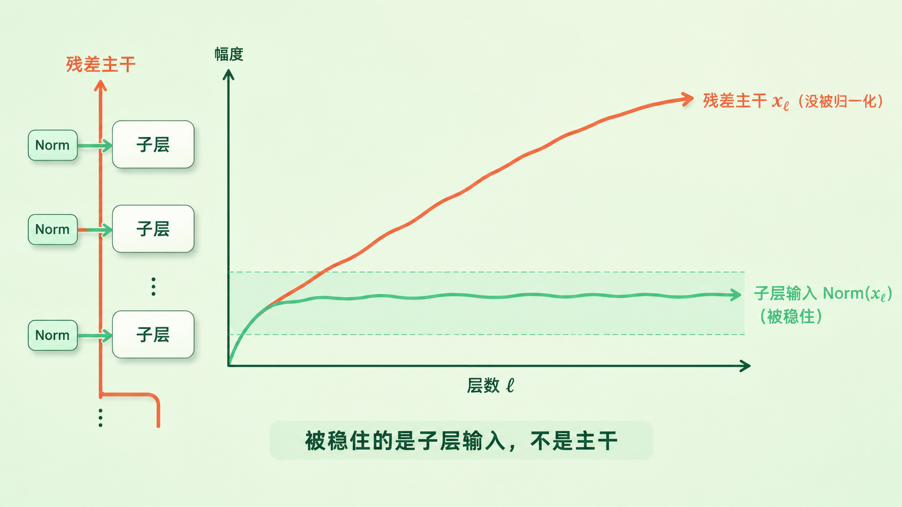
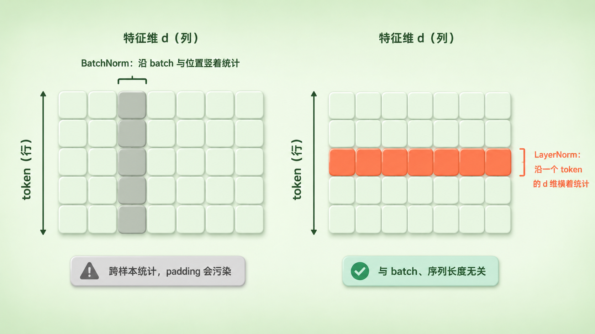
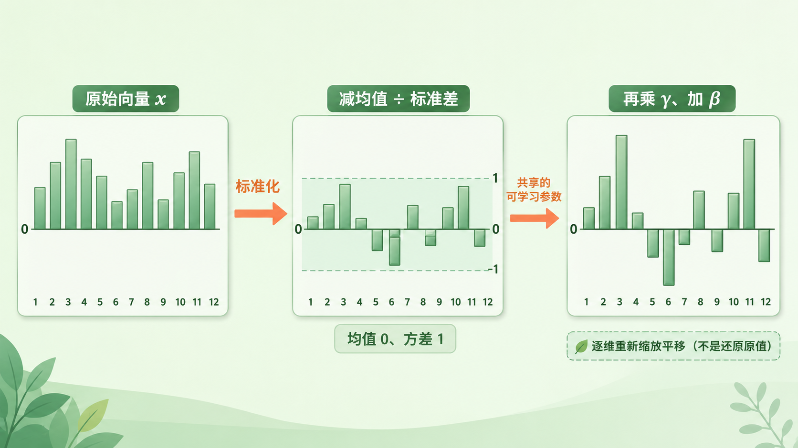
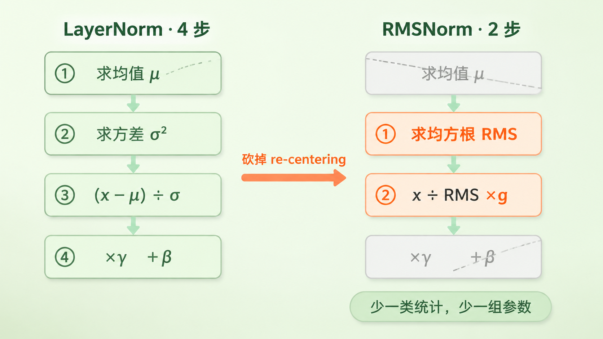
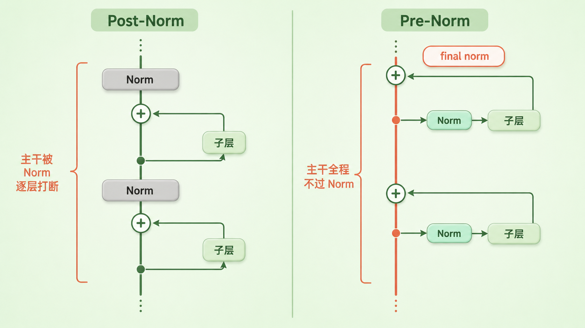
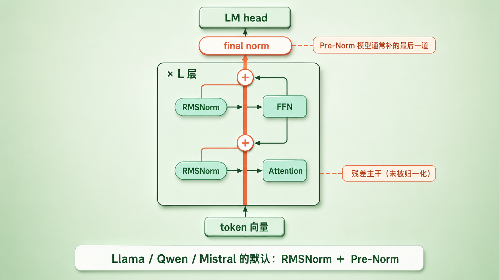

+++
title = "18 归一化的选择：LayerNorm → RMSNorm，Pre-LN vs Post-LN"
description = "归一化不是让数字好看，而是让深堆叠训得动——这一篇讲清从 LayerNorm 到 RMSNorm、从 Post-Norm 到 Pre-Norm 的两次选择。"
date = 2026-07-27
tags = ["LLM", "归一化", "LayerNorm", "RMSNorm", "Pre-Norm", "残差流", "训练稳定性", "Transformer"]
categories = ["LLM"]
series = ["主线"]
showTableOfContents = true
+++





> 归一化不是让数字好看，而是让深堆叠训得动——这一篇讲清从 LayerNorm 到 RMSNorm、从 Post-Norm 到 Pre-Norm 的两次选择。

> 前置知识提示：读这篇前，建议先了解上一篇的 Transformer block 骨架（#17）：两个子层、一条残差主干、每个子层各配一道归一化。本篇拆的就是那道归一化。

期中考卷子难，平均分 50；期末考卷子简单，平均分 90。你两次都考了 75，哪次考得更好？光看原始分说不清，得先把分数换算成「你在这次分布里站在哪」——减掉平均分，再除以标准差。换算完，两个数字才站在同一把尺子上。

上一篇搭骨架时，我们在每个子层门口摆了一个「稳压器」，说它负责把数值拉回稳定区间，然后就按下不表了。那个稳压器干的事，跟把成绩换算成标准分几乎是同一个动作。这一篇把它拆开，回答两个互相独立的问题：这道工序**怎么算**（LayerNorm 还是 RMSNorm），以及它该**摆在子层的哪一边**（前面还是后面）。

两个问题正交，四种组合历史上都有人用过，而今天主流的开源 decoder-only 模型——Llama、Qwen、Mistral 这一挂——绝大多数默认都是 RMSNorm + Pre-Norm。这一篇要讲的，就是这个搭配怎么被逼出来的，以及它换走了什么。


*图：Pre-Norm 稳住的是「子层看到的那份输入」——它被压在一条窄带里；残差主干本身没被归一化过，幅度仍可能随深度一路往上走。主干那条曲线是标准初始化下的典型走势示意，不代表它必然单调上升*

## 一条只做加法的主干，尺度会往哪儿走

先回到 #17 那条残差主干，把三个量分清楚——这一篇后面反复要用。\(x_\ell\) 是**残差主干**本身；\(\hat{x}_\ell = \text{Norm}(x_\ell)\) 是归一化之后、**子层真正看到的输入**；\(r_\ell = F_\ell(\hat{x}_\ell)\) 是子层算出来的**改动量**。主干的更新就是把改动量加回去：\(x_{\ell+1} = x_\ell + r_\ell\)。这三个量的尺度各走各的，混为一谈很容易得出反直觉的错误结论。

那主干的尺度会往哪儿走？每层加上去的 \(r_\ell\) 并不同号，彼此还能抵消一部分，所以它不是逐元素单调变大。

> 更像喝多了的人往前走：每一步方向都随机，有前有后。他不会一直朝一个方向跑，可走上一百步之后，离出发点通常也有十来步远——不是每步都在远离，是随机累加把偏差越摊越开。

写成方差就是这样：

$$
\text{Var}(x_{\ell+1}) = \text{Var}(x_\ell) + \text{Var}(r_\ell) + 2\,\text{Cov}(x_\ell, r_\ell)
$$

大白话讲：新主干的波动 = 老主干的波动 + 这层改动量的波动 + 两者是否同步。方差要能一层层线性累加，真正需要的是两条：**改动量与当前主干近似不相关**（协方差项可忽略），以及**各层改动量的方差大致稳定**（记作 \(v\)）。两条都成立时 \(\text{Var}(x_\ell) \approx \text{Var}(x_0) + \ell v\)，标准差才按 \(\sqrt{\ell}\) 增长——照这个理想模型，12 层摞到 80 层，幅度大约变成 2.6 倍。改动量是不是零均值则管另一件事：它要是不零均值，主干的均值就会朝一个方向系统性漂走，那时幅度增长会比 \(\sqrt{\ell}\) 更快。现实里这些前提都只是近似：改动量可能与主干负相关把幅度压回去，也可能被残差缩放约束住。所以准确的说法是：**残差流的尺度随深度系统性漂移，往哪边漂、漂多快取决于初始化和各层贡献的相关结构，而不是保证一路按** \(\sqrt{\ell}\) **变大**。

尺度漂移本身还不致命，麻烦的是它会顺着往下传：残差流的幅度决定了后面每个算子拿到的输入范围，也就跟着改变了梯度的统计量级。这层关系并不是「幅度大 ⇒ 更新一定太猛」那么直接——真正落到参数上的更新幅度，还要看 Jacobian、参数自己的尺度、优化器状态和数值精度——但它确实是训练不稳的一个已知来源。至于训练大模型最怕的那类事故，loss 曲线跑得好好的突然向上一跳（loss spike）、或者干脆变成 NaN，成因通常是好几股力量叠在一起：attention logits 涨飞、优化器二阶矩失配、低精度下溢出，尺度漂移只是其中一环（崩溃机理留给 #42）。

所以要在管道上加一道工序：不管进来的数值飘到哪，先拉回一个固定的尺度，再送进子层。这里必须说清它稳住的是谁。Pre-Norm 把 Norm 放在子层入口，被拉回固定尺度的是 \(\hat{x}_\ell\)，也就是子层看到的那份输入；主干 \(x_\ell\) 从头到尾没被碰过，照样可以随深度长。这个区分是全篇的地基——后面 Pre-Norm 的代价、末尾那道 final norm，都是从它长出来的。

还得纠正一个流传很广的说法。2015 年 BatchNorm 原论文把归一化的功劳记在「减少内部协变量偏移（internal covariate shift）」上；Santurkar 等人 2018 年直接质疑了它——在 BatchNorm 之后人为注入分布噪声，训练照样又快又稳。他们给出的替代解释是：**BatchNorm 真正做的是让优化面更平滑、梯度更可预测，于是你敢用更大的学习率**。这里得留个心眼：那套实验和分析针对的是 BatchNorm，不能直接搬成「所有归一化都靠这个机制起作用」——LayerNorm、RMSNorm 的收益还要结合它们各自的尺度不变性和所处的残差拓扑单独看。但有一点是共通的：这道工序是给优化器行方便，不是给数字做美容。

那能不能把 CV 里用熟的 BatchNorm 直接搬过来？不是不能，但它在文本上的水土不服是实打实的：

- **它依赖跨样本、跨位置的统计**。batch 里句子长短不一要补 padding，不额外做 mask，padding 位就会污染均值和方差。
- **训练和推理走的是两套统计**。训练时用当前 batch 现算，推理时切到训练期攒下的 running statistics，中间天然有一层行为差。
- **文本 batch 的统计本身就晃**。同一个位置上，不同样本的 token 分布、语义、长度差异都很大，远不如图像那么稳。

于是主流 Transformer 倒向了按 token 独立计算的 LayerNorm：归一化发生在一层的特征内部，跟 batch 里还有谁无关，句子多长也不影响。序列模型上并非只此一条路——PowerNorm、GroupNorm 都有人做过，只是没能成为主流。



*图：同一张「行＝token、列＝特征维」的表格——BatchNorm 竖着框一列（同一特征跨多个 token，即跨样本与位置），LayerNorm 横着框一行（同一 token 的全部 d 维）*

小结一句：残差主干是各层改动量的随机累加，尺度随深度系统性漂移，并把梯度尺度一起带偏；归一化把送进子层的那份输入拉回固定尺度，而跨样本统计在文本上不好使，于是落到按 token 独立计算的 LayerNorm。

## LayerNorm：给一个 token 的向量算标准分

把镜头推到一个 token 上。它在残差流里是一个 \(d\) 维向量，\(d\) 可能是 4096。LayerNorm 做的，就是给这 4096 个数算一次开头说的那种标准分。

先算这一个向量自己的均值和方差：

$$
\mu = \frac{1}{d}\sum_{i=1}^{d} x_i, \qquad \sigma^2 = \frac{1}{d}\sum_{i=1}^{d} (x_i - \mu)^2
$$

再减均值、除标准差，然后乘一个 \(\gamma\)、加一个 \(\beta\)：

$$
\text{LayerNorm}(x)_i = \gamma_i \cdot \frac{x_i - \mu}{\sqrt{\sigma^2 + \varepsilon}} + \beta_i
$$

拆开看三件事。

**第一，归约的范围只有这一个向量。** 在形状为 [batch, seq, d] 的张量里，\(\mu\) 和 \(\sigma\) 只沿最后那个 \(d\) 维算，每个位置各算各的——第 3 个 token 的统计跟第 500 个毫无关系。句子多长、batch 里有几条、训练还是线上单条推理，行为完全一致。

**第二，**\(\varepsilon\) **是个小常数**（常取 1e-5 或 1e-6），加在方差上防止除零，顺带在方差极小时压一压放大倍数。

**第三，**\(\gamma\) **和** \(\beta\) **是可学习的**，各 \(d\) 个参数，LayerNorm 原论文管它们叫自适应增益与偏置（adaptive gain and bias）。这里有件事容易想歪：它们并不是把刚减掉的 \(\mu\)、刚除掉的 \(\sigma\) 还回来——那两个数每个 token 各算各的，而 \(\gamma\)、\(\beta\) 是全体样本共享的一组参数，做不到逐样本还原。它们真正的作用，是让模型在归一化后的表示上重新学一套逐维缩放与偏移，免得每层输出都被死死锁在「严格零均值、单位方差」这一种形状上。



*图：同一个 token 的 12 维向量走完三步——原始值参差不齐且整体偏移；减均值除标准差后居中、幅度统一；再经共享的 γ 缩放、β 平移，在归一化后的表示上重新拉开逐维差异*

还有一个容易被忽略、却很能说明归一化在干嘛的性质：**它让输出对紧挨着它那个线性层的权重缩放免疫**。设 Norm 的输入正好是一个无偏置线性映射的结果 \(z = Wh\)，把 \(W\) 整体乘上一个正数 \(\alpha\)，\(z\) 就整体放大 \(\alpha\) 倍，而减均值除标准差之后结果一模一样（要撇开 \(\varepsilon\) 的影响；\(\alpha\) 取负还会翻符号）。输出没变，回传到 \(W\) 的梯度却缩小成 \(1/\alpha\)——权重变大自动踩刹车、变小自动加油，相当于白送一个自适应学习率。但这条性质的边界得说清楚：它讲的是「Norm 与它正上游那个线性层」之间的关系，不能推广到整个 block——Pre-Norm 下 Norm 吃的是残差主干 \(x_\ell\)，那是一路加出来的和，缩放某一个子层的权重并不会让整条主干等比例缩放。

小结一句：LayerNorm 在每个 token 自己的 \(d\) 维向量上减均值、除标准差，再用共享的 \(\gamma\)、\(\beta\) 重新学一套逐维缩放与偏移；它与 batch、序列长度无关，还顺带让训练对权重尺度不敏感。

## RMSNorm：把「减均值」那一步砍掉

LayerNorm 用了很多年，工程上有个不大不小的膈应：算一次要沿 \(d\) 维走两趟——先求均值，再求方差。这类操作不吃算力、只吃访存，多一趟归约就是多一次读写。

2019 年 Zhang 和 Sennrich 于是问了个很直接的问题：LayerNorm 里那两个动作——**减均值**（re-centering，让分布居中）和**除标准差（re-scaling，让幅度统一）**——真的都不能少吗？

> 好比调音响。你既可以把整体音量拧到统一大小，也可以把信号里那点直流偏置扣掉。真正决定听感的是前者；后者拿掉，多数时候听不出区别。

他们的答案是：管用的主要是 re-scaling。于是把减均值整步删掉，只留下用均方根（root mean square）做缩放：

$$
\text{RMSNorm}(x)_i = g_i \cdot \frac{x_i}{\sqrt{\frac{1}{d}\sum_{j=1}^{d} x_j^2 + \varepsilon}}
$$

对照 LayerNorm 少了两样：均值不算了，平移参数 \(\beta\) 也一并省掉，只留一组缩放参数 \(g\)。写成代码，区别一目了然：

```python
# 两段数值写法保持一致，只看数学上的差别
def layer_norm(x, gamma, beta, eps=1e-5):
    dtype = x.dtype
    x32 = x.float()
    mu = x32.mean(-1, keepdim=True)                    # 一阶矩：均值
    var = (x32 - mu).pow(2).mean(-1, keepdim=True)     # 围绕均值的二阶矩
    y = gamma * (x32 - mu) / (var + eps).sqrt() + beta # 中心化 + 缩放 + 平移
    return y.to(dtype)

def rms_norm(x, g, eps=1e-6):
    dtype = x.dtype
    x32 = x.float()
    ms = x32.pow(2).mean(-1, keepdim=True)             # 只要二阶矩，不算均值
    y = g * x32 / (ms + eps).sqrt()                    # 只缩放，没有中心化也没有 beta
    return y.to(dtype)
```

两段都写了 `x.float()`，那不是摆设：低精度下直接算平方有溢出和精度损失的风险，Llama 这类主流实现会把归一化的统计量提到 FP32 算完再转回去（混合精度的其余细节留给 #43）。这一点两者同等，不是 RMSNorm 特有的需求。顺带一条工程惯例：不少训练配方会把归一化层的 \(\gamma\)、\(g\) 排除在 weight decay 之外，但这不是统一规范，最终以 optimizer 的 parameter group 怎么分为准。

省下的东西单看不多，放到「每层两次、几十层、每个 token 都要走一遍」的规模上就不一样了。RMSNorm 论文在它自己那几个模型上测到 7%–64% 的运行时间下降——这个区间别直接搬到今天的 LLM。也别把「LayerNorm 一定比 RMSNorm 多读一趟内存」当成硬事实：现代 kernel 完全可以用 Welford、或者一次遍历里同时累加 \(\sum x_i\) 和 \(\sum x_i^2\)，把均值和方差压进同一趟；实际的归约次数和访存次数完全取决于实现，端到端到底省多少只能自己 benchmark。RMSNorm 稳拿的是另外两样：计算图更简单（少一类统计、少一次中心化）、参数更少（每层省掉两个 \(d\) 维的 \(\beta\)），也因此更容易和相邻算子融合（推理侧为什么对访存敏感，是 #83、#89 的正题）。

代价是丢掉了 re-centering 不变性——输入整体平移一个常数，LayerNorm 的输出不变，RMSNorm 会变。理论上是个损失，实践里几乎没人因此吃亏。T5 早在 2019 年就用了这个没有均值、没有 bias 的简化版；等 Llama 把它定为默认，Qwen、Mistral、Gemma 一路跟上，今天 RMSNorm 已经是新模型的常态。



*图：LayerNorm 走四步（求均值 → 求方差 → 减均值除标准差 → γ 缩放 β 平移），RMSNorm 砍掉其中两步，只剩「求均方根 → 除以它再乘 g」*

小结一句：RMSNorm 赌的是「归一化的收益主要来自统一幅度、而不是居中」，砍掉减均值和 \(\beta\)，换来更简单的计算图、更少的参数和更好融合的算子；这个赌注被大规模实践验证了。

## 摆在子层前面，还是后面

前两节解决了「怎么算」。第二条轴决定的是训练的脾气：同一道 Norm，摆的位置不同，好不好带差很多。

原始 Transformer（2017）放在最后，今天的主流放在子层入口：

$$
\begin{aligned}
\text{Post-Norm:}\quad y &= \text{Norm}\big(x + \text{Sublayer}(x)\big) \\
\text{Pre-Norm:}\quad y &= x + \text{Sublayer}\big(\text{Norm}(x)\big)
\end{aligned}
$$

两个式子长得几乎一样，差别只在括号的位置。可就这一个括号，决定了主干上有没有一条完全不经过归一化的通路。

> 还是 #17 那条主干道的比喻。Pre-Norm 是把稳压器装在**服务区门口**：车流进服务区之前先稳一稳，主路本身一路畅通。Post-Norm 是把稳压器架在**主路正中间**，每过一层都要经过一道关卡。

这个拓扑差异落到训练上，最有名的一条是 Post-LN 对 warmup 更敏感。Xiong 等人 2020 年在一套简化模型下算了这笔账：标准初始化时，Post-LN 靠近输出端那些参数的梯度量级很大，而且**不随模型总深度** \(L\) **变小**；换成 Pre-LN，同一批参数的梯度量级带上了一个约 \(1/\sqrt{L}\) 的因子，模型越深反而越温和。这里的 \(1/\sqrt{L}\) 说的是「不同深度的模型之间怎么比」，不是「同一个模型里梯度沿层号衰减」——恰恰相反，论文指出固定深度的 Pre-LN 模型内部，各层梯度量级相对均匀。所以 Post-LN 通常得靠开头几千步把学习率从接近零慢慢抬上来。

但「Post-LN 必须 warmup」是说过头了。DeepNorm 就是反例：给残差乘一个放大系数、配上特定初始化，很深的 Post-LN 照样训得稳（细节下面还会提）。另一条路更彻底——T-Fixup 换了一套初始化，把 warmup 和 LayerNorm **一起**去掉也能训 Transformer；得注意它并不是「让 Post-LN 变稳」的方案，因为它的架构里已经没有 LayerNorm 了。反过来，Pre-LN 也不等于可以不要 warmup——Llama 用的是 Pre-RMSNorm，训练配方里照样带着 2000 步 warmup。这里真正成立的说法是：**Pre-Norm 降低了对 warmup 和学习率的敏感度，而不是取消了它们**。

GPT-2 是转折点：它把 LayerNorm 移到每个子块的输入端，并在最后一个 block 之后补了一道归一化。后半句是有讲究的——Pre-Norm 下主干从头到尾没被归一化过，送到 LM head（#15）门口的那份表示，尺度是几十层累加出来的、并不受控；这道 final norm 的职责就是把它重新映射回一个受控区间，再交给输出层算 logits。要说清楚的是，这更像一条被反复验证的工程默认，而不是「不加就一定训崩」的定理——换成别的输出缩放或残差参数化也能起类似作用。但从 GPT-2 到 T5 到 Llama，主流 Pre-Norm 语言模型基本都带着它，#17 全景图里最后那个 Norm 就是它。



*图：左为 Post-Norm——Norm 压在残差相加之后的主干上，从输出回到输入的每条路径都要穿过归一化；右为 Pre-Norm——Norm 退到子层入口，主干本身是一条完全不过 Norm 的恒等通路，末尾另补一道 final norm*

那 Pre-Norm 是不是白赚？也不是，它的代价恰好落在开头那个区分上：被稳住的只是子层输入 \(\hat{x}_\ell\)，主干 \(x_\ell\) 没人管，幅度仍会随深度往上走。越靠后的层，往一条已经很「响」的主干上加同样大小的改动量，相对影响就越小。有研究据此指出 Pre-Norm 深层网络的后段会趋近恒等映射，等于白摞了几层——近两年一批工作（下面的 Peri-LN 就是其一）正是冲着这个去的。所以在中等深度、调教到位的场景（早年的机器翻译模型是典型），Post-LN 的最终质量反而可能好一点。

只是对几百上千卡跑几周的预训练来说，这笔账很好算：**训崩一次损失的钱，远超那一点点质量差**。稳定性优先，Pre-Norm 就这么成了默认。

两头找补的路子也一直有人走：

- **DeepNorm**（2022）给残差乘一个放大系数，配上特定的初始化把 Post-Norm 的稳定性拉起来，硬是把 Transformer 摞到了 1000 层。
- **把子层包起来**：Gemma 2 在每个子层的输入**和**输出各放一道归一化，写出来是 \(x_{\ell+1} = x_\ell + \text{Norm}_{\text{out}}\big(F_\ell(\text{Norm}_{\text{in}}(x_\ell))\big)\)。留意那道输出端的 Norm 作用在**子层吐出来的增量**上，不是作用在相加之后的主干上——主干仍然是一条没被归一化的恒等通路，只是每次写回去的增量被限了幅，主干的方差增长因此被间接压住。这不是退回传统 Post-Norm，近期文献给它起了个专门的名字，叫 **Peri-LN**。#17 结尾说的「有些较新的模型还会在子层输出端再补一道」，就是这个。
- 还有人把归一化塞进 attention 内部，对 Q、K 做归一化（QK-Norm），那是 #20 的地界了。

小结一句：Post-Norm 把 Norm 压在主干上，从输出回到输入没有一条绕开归一化的路，初始化时输出侧梯度偏大、对 warmup 更敏感；Pre-Norm 留出了那条恒等通路，训练宽容得多，代价是主干幅度一路增长、深层贡献被摊薄，末尾通常还得补一道 final norm。

## 读完这一篇：两个旋钮，一个答案

回头看，这一篇只拧了两个旋钮。**怎么算**：沿每个 token 自己的特征维算标准分，是 LayerNorm；再把「减均值」和平移参数砍掉、只留幅度统一，就是 RMSNorm。**放哪里**：压在残差相加之后是 Post-Norm，挪到子层入口是 Pre-Norm。两个旋钮各拧一下，今天绝大多数开源大模型停在同一个位置——RMSNorm + Pre-Norm，末尾再补一道 final norm。它不是理论上的最优解，是「大规模训练里稳定优先」这条现实约束筛出来的解。#17 那张骨架图，到这里所有零件也终于都有了名字。

还有一件事值得带走：被稳住的从来只是**送进子层的那份输入**，不是残差主干本身——主干仍在随深度累积，Peri-LN 这类新写法冲的正是这个遗留问题。归一化没有一劳永逸，只是把问题挪到了更好管的位置。



*图：Llama / Qwen / Mistral 的默认搭配——每个子层入口一道 RMSNorm（Pre-Norm）、残差主干全程贯通、L 层之上补一道 final norm，再送进 LM head*

但这张图仍然是静态的。它没告诉你：训练时，一整段几千 token 的序列是怎么一次性喂进去、所有位置同时算完的？而且既然模型的任务是「根据前面的内容预测下一个」，把整段答案都摊在它面前，它岂不是可以直接抄？下一篇 #19，我们看训练侧的两个关键机制——teacher forcing 和因果掩码，正是它们让「整段并行」和「不许偷看未来」这两件看起来矛盾的事同时成立。

## 参考资料

- Ba, Kiros & Hinton, 2016. *Layer Normalization.* arXiv:1607.06450（LayerNorm 出处：沿特征维归一化，γ/β 称作 adaptive gain and bias）
- Ioffe & Szegedy, 2015. *Batch Normalization: Accelerating Deep Network Training by Reducing Internal Covariate Shift.* arXiv:1502.03167（BatchNorm 与「内部协变量偏移」的原始解释）
- Santurkar et al., 2018. *How Does Batch Normalization Help Optimization?* arXiv:1805.11604（质疑 ICS 解释，提出「优化面更平滑」）
- Zhang & Sennrich, 2019. *Root Mean Square Layer Normalization.* arXiv:1910.07467（RMSNorm：砍掉 re-centering；7%–64% 是该文自身实验的运行时间结果）
- Xiong et al., 2020. *On Layer Normalization in the Transformer Architecture.* arXiv:2002.04745（Post-LN 初始化时输出侧梯度偏大、对 warmup 敏感；Pre-LN 梯度按 1/√L 缩小）
- Huang et al., 2020. *Improving Transformer Optimization Through Better Initialization.* ICML 2020（T-Fixup：换初始化后，warmup 与 LayerNorm 可一并去掉——它不是稳定 Post-LN 的方案）
- Radford et al., 2019. *Language Models are Unsupervised Multitask Learners.*（GPT-2：Norm 前移到子块输入端，并在末尾补一道）
- Wang et al., 2022. *DeepNet: Scaling Transformers to 1,000 Layers.* arXiv:2203.00555（DeepNorm：缩放残差把 Post-Norm 推到千层）
- Gemma Team, 2024. *Gemma 2: Improving Open Language Models at a Practical Size.* arXiv:2408.00118（子层输入与输出各一道归一化）
- *Peri-LN: Revisiting Normalization Layer in the Transformer Architecture*, 2025（把上述「包围子层」的放置方式正式命名为 Peri-LN，并分析 Pre-LN 残差流增长问题）
- Touvron et al., 2023. *LLaMA: Open and Efficient Foundation Language Models.* arXiv:2302.13971（把 RMSNorm + Pre-Norm 定为现代开源模型默认；训练仍用 2000 步 warmup）
- 延伸：Raffel et al., 2020. *Exploring the Limits of Transfer Learning with a Unified Text-to-Text Transformer（T5）.* arXiv:1910.10683（更早采用无均值、无 bias 的简化归一化）
