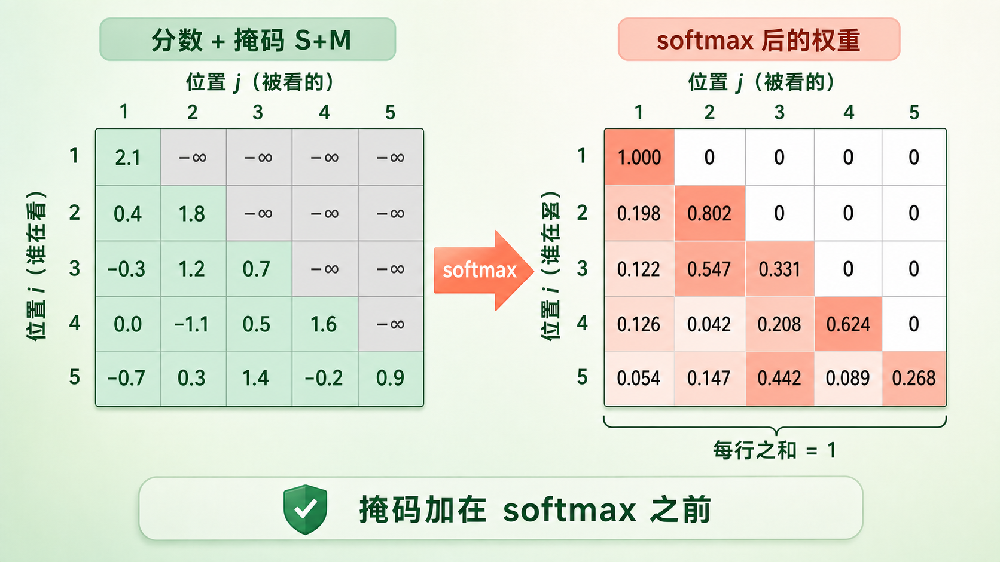
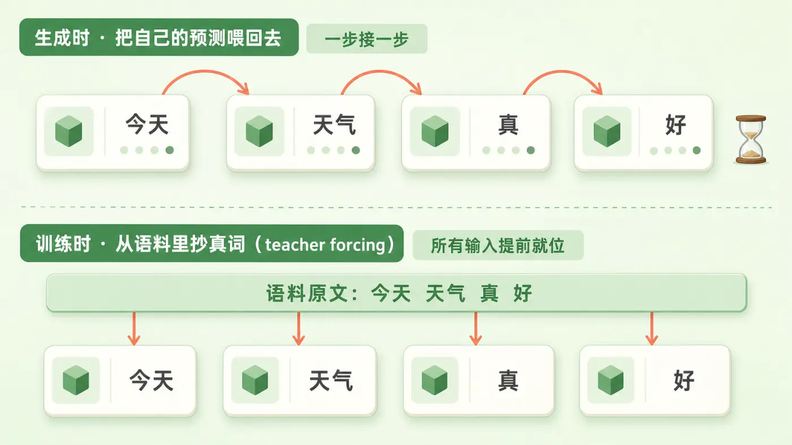
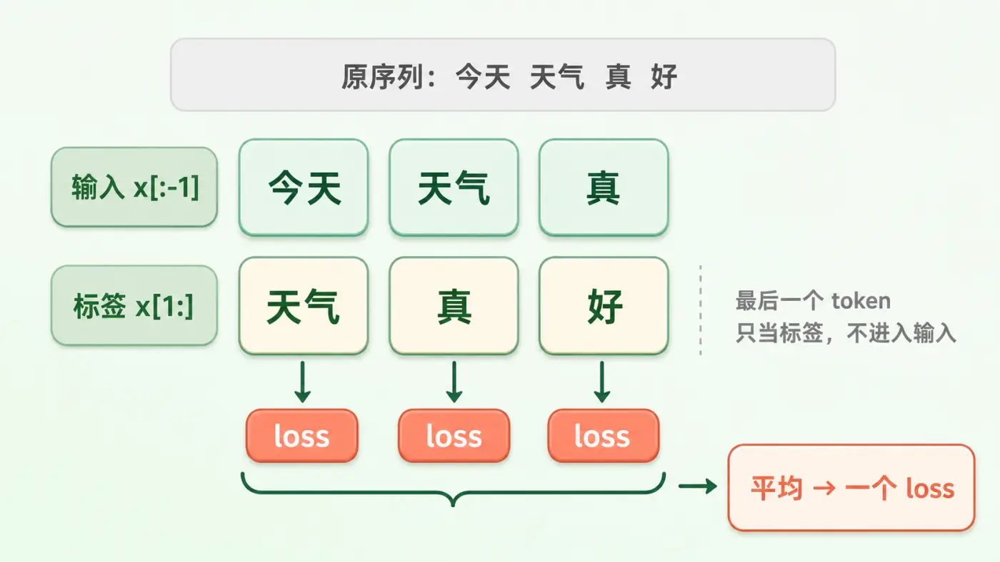
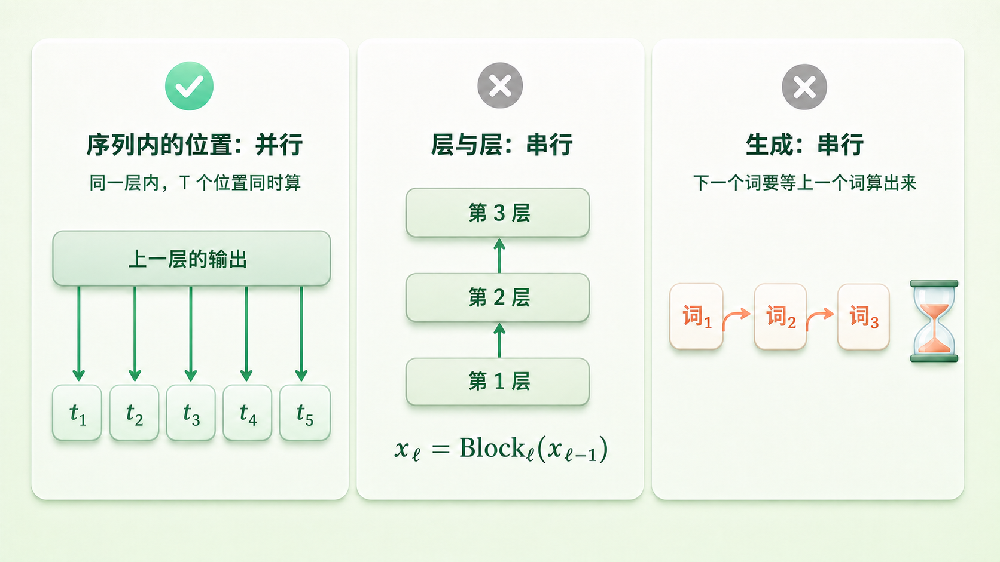
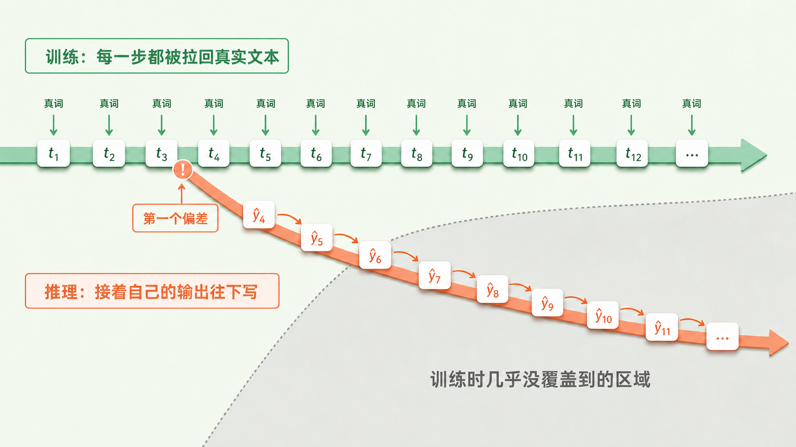

+++
title = "19 训练是并行的：Teacher Forcing 与 Causal Mask"
description = "模型逐 token 生成，训练却能整段并行——teacher forcing 把历史从语料里抄来，causal mask 把未来盖住。"
date = 2026-08-01
tags = ["LLM", "Teacher Forcing", "Causal Mask", "并行训练", "自回归", "Exposure Bias", "Transformer"]
categories = ["LLM"]
series = ["主线"]
showTableOfContents = true
+++





> 模型逐 token 生成，训练却能整段并行——teacher forcing 把历史从语料里抄来，causal mask 把未来盖住。

> 前置知识提示：读这篇前，建议先了解自回归语言模型与链式法则（#1）、交叉熵训练目标（#2），以及 #17 那句话：attention 是整块 block 里唯一让不同位置流通信息的地方。

你让 ChatGPT 写一段话，它是一个词一个词往外蹦的。这说明生成是串行的：第二个词得等第一个词落定，第三个词又得等第二个。

那训练呢？拿一本三十万字的书去训练，是不是也得这样一步一步来，跑够三十万次？真要这样，今天动辄几万亿 token 的预训练根本无从谈起。

好消息是不用。训练时，一整段几千 token 的序列是一次性喂进去、所有位置同时算完的。坏消息是这句话听起来像作弊：模型的任务是「根据前面的内容预测下一个词」，你把整段文本都摊在它面前，它扭头看一眼右边不就知道答案了？

这一篇讲的就是这两件事怎么同时成立——一个机制负责让并行成为可能，另一个负责把作弊的路堵死。



*图：同样是「喂给下一步的输入」，生成时来自模型上一步的输出（一步接一步），训练时直接来自语料里的真词（四个位置的输入同时就位）*

## 把历史抄过来：Teacher Forcing

先看清那条串行链卡在哪里。生成的时候，第 \(t\) 步要吃的输入，正是第 \(t-1\) 步刚吐出来的那个词。上一步不落定，下一步连输入都凑不齐——这条依赖是死的。

训练时能不能把它打断？能，而且理由朴素得有点好笑：训练用的文本是早就写好的。

> 像跟着谱子练琴。学生弹错一个音，老师不会让他顺着错音一路跑下去，而是照谱面上正确的音接着往下练。每一小节的起点都由谱子给定，于是老师可以同时盯着整首曲子的每一小节，不必等学生从头弹到尾。

这就是 **teacher forcing（教师强制）**，名字和做法都来自 1989 年 Williams 与 Zipser 训练循环网络的那篇论文。核心动作只有一个：训练时喂给模型的历史，永远是语料里真实的那一段，而不是模型自己上一步的预测。

预训练语料是已经写好的文本，每个位置的「前文」从一开始就躺在那儿。那条「要先算出 \(t\) 才知道 \(t+1\) 的输入」的依赖，就这么被拿掉了——所有位置的输入在前向开始之前就全部就位。

不过这只解决了一半。**在标准的自回归最大似然训练里，teacher forcing 是并行的必要条件，不是充分条件。** RNN 时代同样用 teacher forcing，训练照样得一步一步来：它的隐状态 \(h_t = f(h_{t-1}, x_t)\) 沿时间递归，第 \(t\) 步要等第 \(t-1\) 步的隐状态算完，这条依赖跟输入是不是真词毫无关系。Transformer 把这条时间递归整个拿掉了——#17 里那两个子层，attention 是一次覆盖所有位置的矩阵运算，FFN 逐位置独立，没有哪个位置需要排在另一个位置后面。

两件事凑齐，整段才能一次算完：teacher forcing 让所有输入提前已知，架构本身在位置维上没有串行依赖。

具体到一次训练是这么操作的。取一段长度 \(T\) 的 token 序列，输入喂 \(x_0\) 到 \(x_{T-2}\)，标签就是同一段整体右移一位：\(x_1\) 到 \(x_{T-1}\)。位置 \(t\) 看着 \(x_0 \dots x_t\)，被要求预测 \(x_{t+1}\)。这套错位就是常说的 **shifted labels**。

$$
\mathcal{L} = -\frac{1}{T-1}\sum_{t=0}^{T-2} \log P_\theta(x_{t+1} \mid x_{\le t})
$$

翻译成大白话：每个位置都做一次「猜下一个词」的小测验，给正确答案的概率越高、罚分越小；把所有位置的罚分平均起来，就是这一段的 loss。这正是 #2 讲过的交叉熵，只不过现在一次算 \(T-1\) 份。真实实现里这个平均还要再挂一张掩码，决定哪些位置有资格计入分子分母——下一节连同另外两张 mask 一起理。

留意最后那个位置：它要预测的词落在这一段之外，段内没有标签。所以手里只有 \(T\) 个 token 时，能榨出来的监督信号是 \(T-1\) 个。工程上还有另一种同样常见的口径——干脆多读一个，取 \(T+1\) 个原始 token 切成长度 \(T\) 的输入和长度 \(T\) 的标签，每个位置就都配得上标签了。两种口径都对，区别只在「\(T\)」指的是原始片段还是输入长度。至于把多篇文档拼成定长序列之后，边界处要不要断开注意力、要不要重置位置编号、结束符那个位置的 loss 算不算，属于数据管线的设计，各家差别不小，留给数据工程章。

这笔账才是重点。一段 4096 token 的文本，一次前向加一次反传，换回四千多个训练信号。换成「一次只学一个位置」，就得跑四千多次前向与反传，而且每一次都要把那段前缀从头再算一遍。重叠部分反复重算，总的浮点运算量会涨到整段训练的 \(O(T)\) 量级——粗算下来，注意力那部分约 \(T/3\) 倍，FFN 那部分约 \(T/2\) 倍。可真正致命的不是这个倍数，而是这四千多次必须一个接一个地来：序列方向的并行性彻底没了，GPU 大半时间在空转。Transformer 在这里真正买到的，是把沿序列方向的串行步数从 \(T\) 压到 1。预训练能吃下几万亿 token，靠的就是这个。



*图：输入「今天/天气/真」对应标签「天气/真/好」，三个位置各产生一个 loss 后取平均；最右侧的「好」是原序列的最后一个 token，它只出现在标签里，没有进入输入*

小结一句：teacher forcing 把每个位置的历史直接从语料里抄来，消掉了「输出 → 输入」这条串行依赖；再加上 Transformer 在位置维上本就没有递归，整段序列才能一次前向算完，并一次拿到一整批监督信号。

## 把未来盖住：Causal Mask

整段摊开是有代价的。attention 的默认行为是让每个位置看所有位置——包括右边。位置 \(t\) 要预测 \(x_{t+1}\)，而 \(x_{t+1}\) 就在它右边一格，明晃晃地摆着。

模型不会跟你客气。它会立刻学到一个极其省事的解：把右邻居抄过来当预测。训练 loss 会漂亮地掉到接近零，可这个模型一上线就废了——生成时右边空空如也，它抄无可抄。

> 开卷考试，卷子右半边印着答案。补救办法不是求学生自觉，是拿一张不透明的纸盖住右边，只让他看见当前这道题和它左边的部分。

把 attention 想成一张 \(T \times T\) 的表：第 \(i\) 行第 \(j\) 列是「位置 \(i\) 该给位置 \(j\) 多少注意力」的原始分数 \(S_{ij}\)（这些分数具体怎么算出来的是 #20 的正题，这里只需要知道有这么一张表）。**因果掩码**（causal mask）就是往这张表上加一个掩码矩阵，它放行的区域正好是下三角：

$$
M_{ij} = \begin{cases} 0, & j \le i \\ -\infty, & j > i \end{cases}
$$

加完再做 softmax：

$$
A = \text{softmax}(S + M)
$$

合法位置加的是 0，分数原样保留；被置成 \(-\infty\) 的格子过一次 exp 就成了 0，权重归零；剩下的位置在 softmax 的分母里自动重新归一化，每行权重和仍是 1。

**为什么必须加在 softmax 之前**，值得单说。假设反过来：先老老实实算完 softmax，再把上三角的权重抹成 0。此时每行权重和小于 1，输出被无端缩水；更要命的是活下来的那些权重，分母里仍然含着未来位置的那几项——未来照样在影响结果，梯度也照样能顺着分母回流过去，泄漏根本没堵住。想修好就得再重新归一化一次，而修完的结果，恰好等于「先加 \(-\infty\) 再 softmax」。绕一圈回到原点。加在 logits 上，语义才是干净的：那些连接从一开始就不存在。

这里顺带把三张容易混着叫的 mask 分清楚。**因果掩码**管「谁能看谁」，只跟位置前后有关；**padding 掩码**管「哪些位置是补齐凑数的」，跟内容有关；还有一张 **loss 掩码**，管「哪些位置的预测该不该计入 loss」——上一节那个平均，分子分母里到底放哪些项，就是它说了算。三者作用在不同环节，指望一张二维的因果掩码替你解决 padding，是解决不了的。

padding 掩码通常先屏蔽补出来的 **key**，别让真实 token 去关注那些凑数位置；至于补出来的 query 那一行要不要一并屏蔽，各家实现并不一致——而这正是下面这个坑的来源。

纯因果掩码永远安全：对角线可见，每行至少有一个合法位置。可一旦某个 query 位置本身就是补出来的、又被连带屏蔽，它那一行会全军覆没，softmax 面对一整行 \(-\infty\)，分母是 0，直接吐 NaN。各家实现的应对并不统一：有的传布尔掩码，有的用真正的 \(-\infty\)（PyTorch 的 `scaled_dot_product_attention` 参考语义就是如此），有的换成当前 dtype 的最小值这种有限的极小负数。换成有限值只是躲开了 NaN——那一整行 logits 全都相等，softmax 会给出一个均匀分布，不是「权重全为零」，语义照样是错的。

真正的解法是从源头上别让全屏蔽的 query 行出现；万一避不开，得在它汇入残差之前就把那一行的输出安全地置零。指望后面用 loss 掩码补救是来不及的：NaN 一旦生成，会顺着输出投影和残差往上扩散到后面每一层，而浮点运算里 0 乘 NaN 仍然是 NaN，事后再屏蔽，坏掉的已经坏了。

```python
import torch

seq = torch.tensor([[101, 2054, 2003, 1996, 3007]])   # 一段长度 5 的 token 序列
inputs, labels = seq[:, :-1], seq[:, 1:]              # 输入 x[:-1]，标签右移一位 x[1:]

# scores 形状 (..., T, T)，来自 attention 内部（#20）
T = inputs.size(1)
causal = torch.ones(T, T, dtype=torch.bool, device=scores.device).tril()
weights = torch.softmax(scores.masked_fill(~causal, float("-inf")), dim=-1)

# 实践中更常见的是把这件事直接交给后端：
# out = torch.nn.functional.scaled_dot_product_attention(q, k, v, is_causal=True)
```

还有一件事顺带就说清了：**一个 block 里需要设闸的地方，只有 attention 这一处。** #17 讲过，它是唯一让不同位置流通信息的子层；FFN 逐位置独立处理，算第 3 个位置时根本不知道第 5 个位置的存在；残差只是把同一个位置的向量加回它自己；#18 那道归一化也只在每个 token 自己的 \(d\) 维特征上做统计。这几样天然没有泄漏未来的能力。

「这一处」说的是位置，不是次数。模型有多少层，就有多少个 self-attention，每一个都得照着同一条因果规则来——漏掉任何一层，未来的信息都会从那一层渗进残差流，再被它上面所有层读走，一处失守等于全线失守。好在这不意味着要写 \(L\) 遍：同一张掩码在所有层之间复用，FlashAttention 这类实现干脆把它内化成 kernel 的一个开关。所以因果掩码落到代码里，往往真就是那么两三行。

最后澄清一下那张 \(T \times T\) 的表。它是个好用的概念模型，但现代实现并不真把它造出来。FlashAttention 那类做法是分块计算、边算边归约，从不物化完整的注意力矩阵；它的 causal 变体更进一步，整块落在上三角里的分块直接跳过，连算都不算。掩码的语义没变，账的算法变了。这条路径为什么重要、\(O(N^2)\) 到底压在哪里，是 #20 的正题。


*图：左边是加完掩码的分数表（下三角与对角线保留各自的原始分数，上三角被压成 −∞），经过 softmax 后变成右边的权重表——每行只在自己和更早的位置上有权重，且一行之和为 1*

小结一句：因果掩码在注意力分数上盖一张只放行下三角的遮罩，在 softmax 之前把未来位置压成 \(-\infty\)，权重自然归零；闸只设在 attention 这一处，但每一层的 attention 都得设。

## 「并行」到底并行了什么

「训练是并行的」这句话很容易被听岔，边界不划清楚，后面几篇会一路误会下去。有三条。

**第一，并行的是序列里的位置，不是层。** \(T\) 个位置同时算完，说的是同一层内部的事；层与层之间照旧串行——#17 写过 \(x_\ell = \text{Block}_\ell(x_{\ell-1})\)，第 12 层得等第 11 层交货，80 层就是 80 次串行。（batch 维那种并行当然也在，不过那不稀奇。）

**第二，并行的是打分，不是生成。** 这条最容易混。训练时模型做的事情是：拿到一批已知前缀，给每一个各打一次「下一个词该是什么」的分。它从头到尾没有真的写出过任何东西，所有「下一个词」都是语料给的。模型仍然是不折不扣的自回归模型，被并行化的是评分，不是采样。（真让模型一次吐出整段的路线叫非自回归生成，那是另一个方向的研究，不是这里在讲的事。）

**第三，并行要两个前提同时成立。** 数据侧的前提是答案已知——那段文本早就写好了，历史不必等模型生成；计算侧的前提是架构在位置维上没有递归，所以所有位置能同时开工。缺哪一个都不行：RNN 手里同样握着完整答案，照样得沿时间一步步爬。推理时坍塌的是第一个前提——下一个词是模型自己造的，不先算出来就没有下一步的输入。这条依赖没法用任何掩码技巧绕开，它就是自回归生成的定义本身。

顺带留一条硬件直觉，给后面几篇埋口径。训练时是一整块矩阵乘另一整块矩阵，GPU 最喜欢这种形状，算力吃得满。生成阶段就要看情况：单请求、小 batch 地一个个往外吐词时，同样的运算退化成一个向量去乘一块大矩阵，算力用不上多少，时间大都花在把权重从显存搬进计算单元；把多个请求的新 token 拼到一起（连续批处理），矩阵的形状又回来了，利用率能拉上去；而上下文一长，读取历史 KV 本身又会变成新的大头。同一个模型、同一块 block，跑起来是好几种不同的性能画像。这笔账怎么算、KV cache 又是从哪儿长出来的，留给 #21、#24 和后面的推理工程章。



*图：三格对照——同一层内 T 个位置同时算（并行）；第 ℓ 层要等第 ℓ−1 层（串行）；生成时下一个词要等上一个词算出来（串行）*

小结一句：并行发生在序列维度上、发生在「打分」这件事上，并且要「答案已知」与「架构无递归」两个前提同时成立；层间依然串行，生成依然串行。

## 谱子撤掉之后：Teacher Forcing 的代价

训练时喂进去的历史永远是完美的真实文本。可模型上线后要接着写的，是它自己刚刚生成的那一段——那段可能已经跑偏了。

> 一直跟着谱子练的人，第一次上台弹错一个音就懵了。不是他不会弹，是他从没练过「弹错之后怎么接下去」——那种局面，谱子上没有。

这就是 **exposure bias（曝光偏差）**，Ranzato 等人 2015 年给它起的名字。它描述的是一个事实：训练分布和推理分布不匹配——模型只在真实前缀上被优化过，从没在「自己写出来的、带瑕疵的前缀」上被优化过。至于由此推出的那句「所以错误会不断累积、越滚越大」，是一种机制解释而非定论：有工作观察到误差确实会累积，也有工作发现语言模型自带相当的纠偏能力，跑偏之后往往能自己拐回来。

缓解手段早就有。scheduled sampling（Bengio 等人 2015）的想法很直接：训练时按一定概率，把喂给下一步的输入从真词换成模型自己的预测，让它提前适应带错的历史。它在当年一些序列任务上确实拿到了收益，不过后续也有理论工作指出这个目标不是所谓的 proper scoring rule，优化它未必收敛到真实的数据分布——「管用」这个评价一直带着保留。

更现实的问题是成本，而且这里有个别扭的地方：并行是 teacher forcing 换来的，想让模型见识自己的错误，最直接的办法恰恰要把并行还回去——某个位置的输入一旦要用模型刚生成的输出，它就必须等前一个位置算完。也不是所有思路都这么贵，先离线把带扰动的前缀准备好、再照常并行训练就能绕开串行；只是放到预训练这个量级上，收益不明朗而改动不小，主流至今仍是老老实实的 teacher forcing 加最大似然。

也别把生成里的所有毛病都记到它头上。模型说车轱辘话、一句翻来覆去，这里面有训练目标和解码策略的成分（#7 拆过那个高频 token 自我强化的反馈环），也有采样参数的成分；exposure bias 是其中一股力量，不是唯一那股。

至于「后面会补上」这个念头，也得说得更小心。指令微调（SFT）和 DPO 这类偏好优化，算 loss 的对象仍然是给定的完整序列，模型并没有在自己的采样轨迹上被优化，它们并不天然消除 exposure bias。真正让模型在自己写出来的东西上被评价、被更新的，是 PPO 那一类 on-policy 的强化学习，以及拿模型自己生成的数据回头再训的做法。这条线索留给第七章。



*图：训练时每一步都被拉回真实文本这条轨道；推理时一旦生成偏离，后续每一步都建立在自己的输出上，走进训练时几乎没覆盖到的区域*

小结一句：teacher forcing 用「永远给完美历史」换来了并行，代价是模型从没练过在自己的错误上继续往下写；这个代价究竟有多大仍有争论，缓解手段又各有各的成本，所以预训练至今仍是 teacher forcing 的天下，真正让模型在自身分布上被优化的，是后面 on-policy 的那一类训练。

## 读完这一篇：两个机制，一处闸

「训练是并行的」这句话背后其实是两个动作。一个是 teacher forcing：每个位置的历史直接从语料里抄，配上 Transformer 在位置维上本就没有的递归，整段序列一次前向算完、一次拿到一整批监督信号。另一个是 causal mask：整段摊开会让每个位置看见自己要预测的答案，于是在注意力分数上盖一张只放行下三角的遮罩，在 softmax 之前把未来掐掉。因为 attention 是整块 block 里唯一跨位置的子层，闸只需设在它这一处——但每一层的 attention 都得设，用的是同一张掩码。

顺手也划清了三条边界：并行的是序列内的位置而不是层，是打分而不是生成，而且要「答案已知」和「架构无递归」两个前提同时成立。

第一个前提，正好是下一篇的入口。推理时答案不再已知：prompt 那一段还好办，它是给定的，可以像训练时一样一次算完；可从第一个新词开始，模型就只能一个一个往外吐，每吐一个还得回看此前的全部上下文。下一篇 #21，我们把推理拆成 prefill 和 decode 两个阶段：看清为什么在「短提示、长输出」的对话场景里，延迟主要被 decode 吃掉；而换成「长提示、短输出」，首字延迟又会反过来压在 prefill 上。

## 参考资料

- Williams & Zipser, 1989. *A Learning Algorithm for Continually Running Fully Recurrent Neural Networks.* Neural Computation 1(2)（teacher forcing 的出处：用真实值而非模型自身输出作为下一步输入）
- Vaswani et al., 2017. *Attention Is All You Need.* arXiv:1706.03762（decoder 的 masked self-attention：在 softmax 的输入上把所有非法连接置为 −∞；也是「沿序列方向串行步数降为 O(1)」的出处）
- Radford et al., 2018. *Improving Language Understanding by Generative Pre-Training.*（decoder-only 模型的 next-token 预训练目标）
- Bengio et al., 2015. *Scheduled Sampling for Sequence Prediction with Recurrent Neural Networks.* arXiv:1506.03099（训练中按概率混入模型自身预测）
- Huszár, 2015. *How (not) to Train your Generative Model: Scheduled Sampling, Likelihood, Adversary?* arXiv:1511.05101（指出 scheduled sampling 的目标不是 proper scoring rule）
- Ranzato et al., 2015. *Sequence Level Training with Recurrent Neural Networks.* arXiv:1511.06732（exposure bias 这个说法的来源）
- He et al., 2021. *Exposure Bias versus Self-Recovery: Are Distortions Really Incremental for Autoregressive Text Generation?* EMNLP 2021（量化 exposure bias 并观察到语言模型的自我纠偏；早期 arXiv 版题为 *Quantifying Exposure Bias…*，arXiv:1905.10617）
- Holtzman et al., 2019. *The Curious Case of Neural Text Degeneration.* arXiv:1904.09751（重复与退化的解码侧解释，呼应 #7）
- Rafailov et al., 2023. *Direct Preference Optimization.* arXiv:2305.18290（DPO 训练时不从模型采样，可作为「对齐 ≠ 自动消除 exposure bias」的对照）
- Dao et al., 2022. *FlashAttention: Fast and Memory-Efficient Exact Attention with IO-Awareness.* arXiv:2205.14135（分块计算，不物化 N×N 注意力矩阵）
- Dao, 2023. *FlashAttention-2.* arXiv:2307.08691（因果掩码下直接跳过整块上三角分块）
- Gu et al., 2018. *Non-Autoregressive Neural Machine Translation.* arXiv:1711.02281（并行生成整段的另一条路线，与本篇讲的并行不是一回事）
- Yu et al., 2022. *Orca: A Distributed Serving System for Transformer-Based Generative Models.* OSDI 2022（连续批处理如何把 decode 的矩阵形状拉回来）
- Agrawal et al., 2024. *Taming Throughput-Latency Tradeoff in LLM Inference with Sarathi-Serve.* OSDI 2024（prefill 与 decode 分别主导哪类延迟，留给 #21）
- 延伸：Andrej Karpathy, *nanoGPT*（`model.py` 里因果掩码与 shifted labels 的最小实现，各占两三行）
