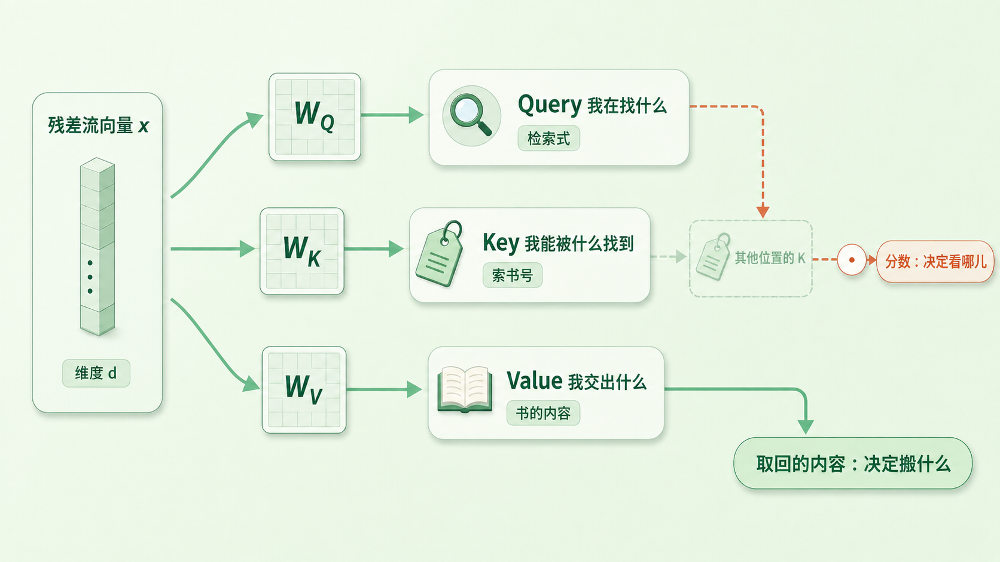
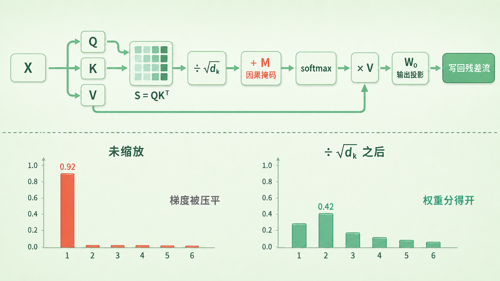
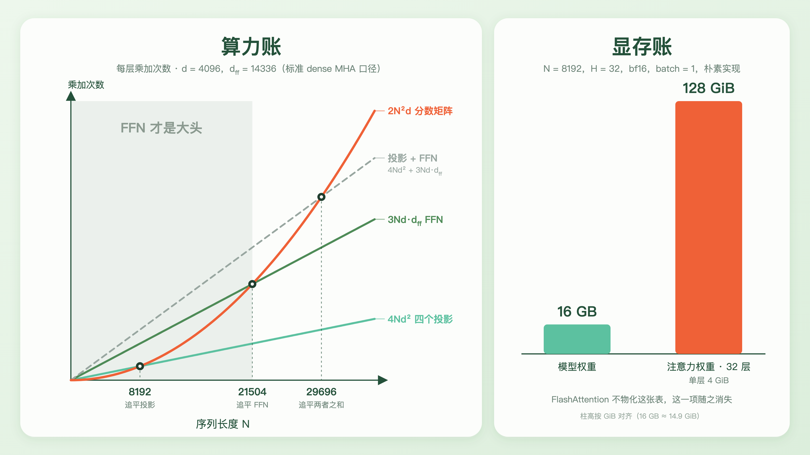
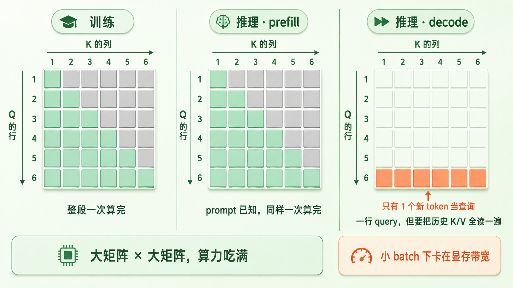

+++
title = "20 Attention 在算什么：Q/K/V、Softmax 与 O(N²)"
description = "一次加权求和而已——Q/K/V 决定权重从哪来，那张 N×N 的分数表决定它有多贵。"
date = 2026-08-09
tags = ["LLM", "Attention", "Q/K/V", "Softmax", "自注意力", "KV Cache", "复杂度", "Transformer"]
categories = ["LLM"]
series = ["主线"]
showTableOfContents = true
+++




> 一次加权求和而已——Q/K/V 决定权重从哪来，那张 N×N 的分数表决定它有多贵。

> 前置知识提示：读这篇前，建议先了解：attention 是一块 block 里唯一让不同位置流通信息的子层（#17）、因果掩码怎么把未来盖住（#19），以及点积作为相似度的几何直觉（#14）。

「因为杯子太烫，他把它放在桌上。」

读到「它」的时候，你的眼睛大概往回扫了一下：这个「它」指谁？线索都在左边——「杯子」是前文最自然的指代候选，「太烫」又给它补了一层描述。你拿着「它」去和前面每个词比对，挑出最配得上的那个。这个回头找的动作，几乎就是 attention 的全部。

线索全在左边不是巧合。#19 讲过，因果掩码让每个位置只能看见自己和更早的位置，「它」右边的「放在」「桌上」对它根本不存在。所以这类判断只能靠已经读过的部分完成。

#17 里说过，一块 Transformer block 有两个子层：attention 跨位置搬运信息，FFN 逐位置加工信息。#19 又补了一条规矩：搬运只许从左往右。可这两篇都绕开了同一个问题——**搬运的比例是谁定的**。「它」这个位置最后拿到的那个向量，凭什么是「杯子」占大头，而不是「太烫」或「他」？

这一篇把这个子层拆开。它算的东西说起来朴素得有点意外：一次加权求和。全部的复杂度都压在一件事上——权重从哪来。


*图：位置「它」向左侧每个词发出一根连线，线的粗细就是注意力权重——「杯子」最粗，「太烫」次之，其余接近于无；右侧被灰掉的是因果掩码挡住的未来。注意连线画的是「打分方向」（Query 去比对各处的 Key），真正被搬回来的是那些位置的 Value；图中权重为示意值，不是某个真实模型的输出*

## 一次搬运，三个角色

既然输出是对其他位置的加权求和，最省事的做法是让 token 自己去比：两个位置的向量做个点积，越像的权重越大。#14 里我们用过这套几何——语义相近的词，方向也相近。

拿来直接用会撞上两堵墙。

第一堵是**角色混淆**。「它」这个位置想说的是「我在找一个刚被提到的、烫的东西」；「杯子」这个位置想说的是「我是个容器，我可能是热的」。这是两句不同的话，让同一个向量同时说清楚，等于逼它兼职。还有第三件事：真正被搬走的内容——「杯子」交出去的那份语义——和它用来「被认出来」的那套标识，也未必是一回事。

第二堵墙是**打分函数本身的对称**。直接拿残差流向量两两点积，分数表 \(S = XX^\top\) 必然满足 \(S_{ij} = S_{ji}\)：「它」觉得「杯子」多合拍，「杯子」就觉得「它」同样合拍。

这里得说清分寸。逐行 softmax 各有各的分母，再叠上因果掩码，最终的权重矩阵 \(A\) 当然不是对称的——方向性并没有完全消失。被卡住的是更底层的东西：**打分函数没有能力区分「谁在查询」和「谁被查询」**，它只能报告两个词有多像。而语言里的依赖大多是带角色的：代词找先行词、动词找主语、修饰语找中心词，反过来都不成立。

> 去图书馆找书：你手里写的检索式是一回事，书脊上的索书号和主题词是另一回事，真正搬回家读的内容又是第三回事。索书号是专门为了「被检索到」而设计的，它不等于书的内容；你的检索式和索书号也不是同一套写法。三样东西各司其职，检索才成立。

Attention 的做法就是把一个向量拆成这三样。设输入是 \(X\)（\(N\) 个位置，每个位置一个 \(d\) 维的残差流向量，见 #13、#17），三个可学习矩阵各投影一次：

$$
Q = XW_Q,\quad K = XW_K,\quad V = XW_V
$$

**Query**（查询）是「我在找什么」，**Key**（键）是「我能被什么找到」，**Value**（值）是「找到我之后，我交出什么」。\(W_Q\) 与 \(W_K\) 的形状是 \(d \times d_k\)，\(W_V\) 是 \(d \times d_v\)——同一个向量走三条不同的路，落进三个不同的子空间。

这里讲的是 self-attention，所以 Q、K、V 都来自同一个 \(X\)。encoder-decoder 里还有一种 cross-attention，Q 来自一个序列、K 和 V 来自另一个，公式一字不变，只是三者的来源不同。本篇只谈前者。

对称性也随之破掉。位置 \(i\) 看位置 \(j\) 的分数展开是 \(x_i W_Q W_K^\top x_j^\top\)，中间那个 \(W_Q W_K^\top\) 一般不是对称矩阵，于是交换 \(i\)、\(j\) 得到的分数也就不再相等。「它」可以给「杯子」打很高的分，「杯子」给「它」打多少分则完全另算——「谁在查」和「谁被查」终于用上了两套表示。

有一点得说明白：这三个矩阵是训练出来的，没有谁在代码里规定 \(W_Q\) 必须编码「我在找什么」。上面那套分工是事后给它的解读，用来说清楚标准 attention 为什么选择把它们拆成三份；模型实际学到的结构，未必都能这么干净地对上号。

顺带把 #16 留的线接上。位置信息该从哪儿进来，各家做法并不一样：原始 Transformer 是把正弦位置编码直接加到 token embedding 上；而 RoPE 这一路（Llama、Qwen 等现代模型的默认选择）不动 embedding，改成在投影之后、点积之前，把 \(q\) 和 \(k\) 各自旋转一个正比于位置的角度。标准 RoPE 不旋转 \(V\)——这是个设计选择而非数学必然，背后的直觉是位置该影响的是「谁该看谁」，不是「看到之后取回什么」。

小结一句：投影成 Q、K、V 三份，是为了让「找什么」「被谁找到」「交出什么」三个角色各自有地方说话，也让打分函数本身带上方向——而语言里的依赖，本来就是有方向的。



*图：位置「它」的一个 d 维向量分三路投影：经 W_Q 成为 Query（检索式）、经 W_K 成为 Key（索书号）、经 W_V 成为 Value（书的内容）；Q 与其他位置的 K 相配得到分数，取回的却是 V*

## 从分数到权重

三份东西齐了，剩下的路很短。整个子层写下来就是一行：

$$
\text{Attention}(Q, K, V) = \text{softmax}\!\left(\frac{QK^\top}{\sqrt{d_k}} + M\right)V
$$

拆开是五步：算分数、缩放、盖掩码、softmax、加权求和。

**算分数。** \(S = QK^\top\) 是一张 \(N \times N\) 的表，\(S_{ij} = q_i \cdot k_j\)——位置 \(i\) 的查询和位置 \(j\) 的键有多合拍。#19 里那张摊开的分数表，就是这一张。

**缩放。** 那个 \(\sqrt{d_k}\) 不是凑出来的。点积是 \(d_k\) 个乘积项相加，维度越高、加的项越多，和的波动就越大。假设 \(q\) 与 \(k\) 的各分量独立、均值 0、方差 1：

$$
\text{Var}(q \cdot k) = \sum_{m=1}^{d_k} \text{Var}(q_m k_m) = d_k
$$

标准差正好是 \(\sqrt{d_k}\)。这里的 \(d_k\) 是单个注意力头的宽度，现代模型里 128 是很常见的取值（为什么是「单个头」，下一篇再说）。\(d_k = 128\) 时，分数的典型波动就在 ±11 这个量级上。把这么悬殊的一组数喂进 softmax 会发生什么？最大那项一枝独秀，其余全被压到接近零，权重退化成近似 one-hot。#4 讲过 softmax 的温度视角——这等于偷偷把温度调到了极低。

饱和的代价是梯度。softmax 对 logits 的 Jacobian 是 \(\partial A_i / \partial z_j = A_i(\delta_{ij} - A_j)\)，权重一旦逼近 one-hot，这一整块就整体趋近于零，Q 和 K 再想去调整注意力该落在哪儿，几乎推不动。倒不是整层都停摆——\(V\) 和 \(W_O\) 的梯度不走这条路，残差通道也还在——但「往哪儿看」这件事被冻住了，训练很难稳。除以 \(\sqrt{d_k}\)，方差回到 1，分布重新变得温和。

```python
import torch

torch.manual_seed(0)
for d_k in (8, 128, 1024):
    q, k = torch.randn(8192, d_k), torch.randn(8192, d_k)
    print(d_k, round((q * k).sum(-1).std().item(), 1))
    # 8 → 2.8    128 → 11.3    1024 → 32.4，正好贴着 √d_k

rows = torch.randn(8192, 6) * 11.3      # 8192 行分数，量级取 d_k=128 的典型值
peak = lambda s: s.softmax(-1).max(-1).values.mean().item()
print(round(peak(rows), 2))             # ≈ 0.92：最大那一项平均吃掉九成权重
print(round(peak(rows / 128**0.5), 2))  # ≈ 0.42：缩放之后，权重还分得开
```

单看一行分数，结果会随机得厉害，所以这里取的是 8192 行的平均——缩放前后的差距是稳定的，具体某一行是多少并不重要。

**盖掩码。** #19 讲透了：\(M\) 在 \(j > i\) 的格子上是 \(-\infty\)，别处是 0。这里只需要记住它在链条上的位置——紧挨着 softmax 之前，加在 logits 上，而不是事后去抹 softmax 的输出。

**softmax。** 逐行做。第 \(i\) 行归一化之后成为权重 \(A_{i:}\)，和为 1。这个「和为 1」值得多看一眼：它意味着每个位置手里有**一份总量固定的注意力预算**。摊给好几个地方当然可以（0.25、0.25、0.2……都合法），但总量就这么多，多给了这边就得从那边扣。#17 说 attention 是路由，路由的含义就藏在这里——它不是给每条连接独立打分，而是在所有可见位置之间做一次分配。

**加权求和。** \(O = AV\)，也就是 \(o_i = \sum_j A_{ij} v_j\)。至此「它」这个位置拿到的，是前文所有 Value 的一个混合，「杯子」的那份占了大头。

**还有一步容易被略过。** \(O\) 的宽度是 \(d_v\)，而残差流的宽度是 \(d\)，中间还有一个**输出投影** \(W_O\) 把它送回去，再加回残差流（#17 说的读—改—写）。只看单头的话，\(W_O\) 显得有点多余——它完全可以并进 \(W_V\) 里。它真正的用处要到下一篇才显形：现实中的 attention 不止跑一份，而是并排跑好几份；\(W_O\) 的活儿是把这几份的输出拼起来、混合成一个能写回残差流的向量。

最后补一句 #18 欠下的：那里点过名的 **QK-Norm**，冲着同一个问题去——按住 logits 的尺度——但手法和 \(\sqrt{d_k}\) 不是一回事。\(\sqrt{d_k}\) 是按维度做的一次固定修正，管不住训练过程中 \(q\)、\(k\) 的范数自己往上涨；范数一涨，logits 照样能飘进饱和区，大模型上表现为训练中途的 loss 尖峰。QK-Norm 直接对每个 \(q\)、\(k\) 的实际范数做归一化，再用一个可学习的尺度去控制 softmax 的软硬（现代实现多为 LayerNorm / RMSNorm 的变体），代价是多两个算子。一个看维度，一个看实际数值，这是它们的分野。

小结一句：一次 attention 就是「打分 → 缩放 → 挡住未来 → 归一化成预算 → 按预算取回 Value」，\(\sqrt{d_k}\) 是为了不让 softmax 提前饱和，\(W_O\) 则是留给多头的接口。



*图：上半部是 X → Q/K/V → S=QKᵀ → ÷√d_k → +M → softmax → ×V → W_O 的完整链条；下半部对比同一批分数在缩放前后的 softmax 结果，缩放前最大权重平均吃掉九成，缩放后分布温和*

## 两笔账：N² 到底贵在哪

「Transformer 的复杂度是 \(O(N^2)\)」几乎成了口头禅。但这句话得分成两笔账来算，而且这两笔账撞墙的时间点差得很远。

算账之前先统一记号。前面为了讲清机制只算了一份 Q/K/V，现实模型是并排跑 \(H\) 个头（下一篇的正题）：残差流宽度记作 \(d\)，每个头的宽度 \(d_h = d / H\)——上一节那个 \(d_k = 128\) 说的就是 \(d_h\)，对应 \(d = 4096\)、\(H = 32\) 这个常见配置。下面算的都是整层总账，也就是所有头加起来。另外先把口径说明白：下面按标准 dense MHA 估算，也就是 Q、K、V 三路的总宽度都等于 \(d\)。MQA/GQA 让 K/V 的头数变少、那两个投影随之变便宜，下面的交叉点也会跟着挪——那是下一篇的事。

**第一笔是算力账。** 每个头的分数表有 \(N \times N\) 个格子，每格一次 \(d_h\) 维点积，\(QK^\top\) 是 \(N^2 d_h\) 次乘加；\(H\) 个头加起来正好凑成 \(N^2 d\)。后面的 \(AV\) 同理，又是一份。所以带 \(N^2\) 的部分总共 \(2N^2 d\)——注意它和头数无关，切成几个头都是这个数。而四个投影矩阵（\(W_Q\)、\(W_K\)、\(W_V\)、\(W_O\)）每个都是 \(N \times d\) 乘 \(d \times d\)，各 \(Nd^2\)：

$$
2N^2 d \quad \text{vs} \quad 4Nd^2
$$

前者随长度平方增长，后者只是线性，两者相等的地方在 \(N = 2d\)——\(d = 4096\) 时就是 8192 tokens。

但这只是 attention 子层内部的账。一层里还坐着一个 FFN，而它比谁都大：SwiGLU 三个矩阵、中间宽度 \(d_\text{ff} = 14336\)，一层是 \(3Nd\,d_\text{ff}\) 次乘加。三项摆到一起，二次项要依次追上的是：

- 追平四个投影：\(N = 2d\)，即 8192
- 追平 FFN：\(N = 1.5\,d_\text{ff}\)，即 21504
- 追平「投影 + FFN」：\(N = 2d + 1.5\,d_\text{ff}\)，约 29700

所以按这组标准 MHA 配置估算，上下文得长到三万 token 上下，那两个平方项才真正成为一层里的算力大头。上下文 2k 的时候，它们加起来只占这一层乘加量的 7% 左右。

> 在几千 token 的上下文里，attention 那两个带 \(N^2\) 的矩阵乘远不是算力大头，FFN 才是。「Transformer 慢是因为 attention 是 \(O(N^2)\)」这句话，要到几万 token 之后才开始成立。

**第二笔是显存账，它撞墙撞得早得多。** 朴素实现要真的把那张 \(N \times N\) 的表造出来，softmax 之后的权重还得留着——反传要用它算 \(V\) 的梯度。这一项要乘上层数、乘上 batch，还要乘上头数：这里和算力账正好相反，二次的乘加量与 \(H\) 无关，但 \(N \times N\) 这张表每个头都得有独立的一份。

还是上面那个模型，\(N = 8192\)、\(H = 32\)、bf16、batch 为 1：一层的注意力权重就是 \(8192^2 \times 32 \times 2\) 字节，正好 4 GiB；32 层全留着是 128 GiB。而这个模型的权重本身，bf16 存下来才 16 GB。

这也是为什么 **FlashAttention** 值得单独提一句。它的做法是分块：把 Q、K、V 切成小块搬进片上高速缓存，边算边用在线 softmax 更新归一化的统计量，算完一块就丢掉，从头到尾不把完整的 \(N \times N\) 物化出来；反传时需要哪块就地重算。显存占用从 \(O(N^2)\) 掉到 \(O(N)\) 量级，而且因为省下了大量对显存的读写，跑得还更快。

上面那个 128 GiB 是朴素实现在长序列下的样子，不是普遍规律，但两种常见的缓解手段干的并不是同一件事：上了 FlashAttention，那张完整的 \(N \times N\) 表压根不会被物化；而激活重算干的是另一件事——它不保证 attention 内部不产生这张表（那取决于用的是哪个 kernel），只是不让各层的中间激活一直留到反传，所以「32 层同时压在显存里」这个估算同样不成立。短上下文下它也构不成威胁。但它解释了一件事：在 FlashAttention 普及之前，「把上下文拉长」先顶到的通常是显存，而不是算力。

还要小心一个高频误解：**FlashAttention 没有降低复杂度**。该算的 \(N^2\) 次点积一次没少，它省的是显存和访存，不是渐近复杂度。真正动复杂度的是另一条路——稀疏注意力只让每个位置看一部分位置，线性注意力换掉 softmax 的形式让运算能重新结合，把 \(N^2\) 压成 \(N \log N\) 甚至 \(N\)。那条路的代价、以及为什么至今没有全面取代标准 attention，留给长上下文那一章。

小结一句：\(N^2\) 有两笔账——算力那笔要等上下文长到几万 token（把 FFN 一起算进来，交叉点在 \(2d + 1.5\,d_\text{ff}\) 附近）才成为一层里的大头；显存那笔在朴素实现下早得多就压得人喘不过气。FlashAttention 解决的是后一笔，前一笔得靠稀疏或线性注意力。



*图：左图横轴是序列长度 N，二次的 2N²d 要先后追平线性的 4Nd²（8192）和 3Nd·d_ff（21504），追平两者之和要到约 29700；右图是 N=8192、朴素实现下的显存对比——32 层的注意力权重 128 GiB，模型权重只有 16 GB*

## 同一个 N²，三副面孔

#19 留下的那条张力——训练整段并行、生成逐个串行——落到 attention 上，会让同一个 \(N^2\) 长出三种完全不同的样子。下面默认已经用上 KV cache（它的正题在 #24），并把 prompt 长度记作 \(P\)、生成长度记作 \(T\)。

**训练时**，一整段 \(N\) 个 token 一次算完，Q 有 \(N\) 行，K 也有 \(N\) 行，分数表是完整的 \(N \times N\)（因果掩码只是把上三角废掉，形状没变）。这是一块大矩阵乘另一块大矩阵，GPU 最喜欢的形状，算力吃得满。

**推理的第一阶段**跟训练几乎一样。用户给的那段 prompt 是已知的完整文本，可以一次性全部算完，把每个位置的 K、V 都准备好——这个阶段叫 **prefill**，同样是 \(P \times P\) 的大矩阵乘。

**推理的第二阶段**变了样。从第一个新词开始，每一步只有一个新 token 当查询：Q 只有 1 行，K 有已经积累的那些行，分数表塌成一条。这个阶段叫 **decode**，单步的计算量随已有上下文线性增长。

听起来轻松，实际上是最难受的一段，原因有两个。

一是二次项并没有消失，只是被摊开了。生成第 \(t\) 个词时要看 \(P + t\) 个位置，整轮加起来是 \(O\big(d(PT + T^2)\big)\)——prompt 越长、生成越长，这笔账越接近平方。总账一分没少，只是从一次大计算变成了 \(T\) 次小计算。

二是每一步的算术强度掉到了地板上。要算那一行分数，得把历史全部位置的 K 读一遍；要做加权求和，还得把同样多的 V 再读一遍。搬进来这么多数据，只做了一次矩阵乘向量，计算单元大部分时间在等数据到位——瓶颈从算力换成了显存带宽。这条结论有前提：它描述的是单请求、小 batch 的情形。把多个请求的新 token 拼成一批（连续批处理），矩阵形状就回来一部分，利用率能拉上去；可上下文一长，读取历史 KV 本身又会变成新的大头。

于是两个后续问题自然浮出来：历史的 K、V 每步都要重算一遍吗（当然不用，缓存下来就是 **KV cache**）？缓存下来之后显存怎么办（它随上下文长度线性增长，长上下文时会超过模型权重本身）？这两笔账留给 #24。prefill 与 decode 各自主导哪种延迟，留给 #21。

小结一句：训练与 prefill 面对的是完整的方阵大矩阵乘、算力吃满；decode 每步只剩一行，单步线性、累计仍是平方量级，而且在小 batch 下瓶颈从「算不算得过来」变成了「搬不搬得过来」。



*图：左、中两格是完整的方阵分数表（下三角有效、上三角被掩码），标注「大矩阵 × 大矩阵，算力吃满」；右格只有最底下一行被点亮，标注「一行 query，要把历史 K/V 全读一遍，卡在带宽」*

## 读完这一篇：一次加权求和的全部账本

回到开头那个「它」。它最后拿到的向量，是左侧所有位置 Value 的加权混合，「杯子」占了大头。权重的来路现在完全清楚了：它自己的 Query 去和每个位置的 Key 做点积，除以 \(\sqrt{d_k}\) 防止 softmax 提前饱和，盖掉右边的未来，再逐行归一化成一份总量为 1 的注意力预算。#17 那句抽象的「跨位置搬运信息」，拆开就是这几步。

另一半收获是价目表。\(N^2\) 不是一个笼统的「慢」，它是两笔独立的账：算力那笔要等上下文长到几万 token 才成为一层里的大头（\(N = 2d\) 只是追平了 attention 自己的四个投影，前面还有更大的 FFN 挡着）；显存那笔在朴素实现下一开始就是主要矛盾——FlashAttention 正是冲着后者去的，它不物化那张表，但一次点积也没少算。而同样一个 \(N^2\)，在训练和 prefill 里是算力吃满的大矩阵乘，到了 decode 就塌成一行，瓶颈换成了带宽。

不过这篇从头到尾只算了一份 Q/K/V。真实的模型是并排跑好几份——训练完之后，确实能在一部分头上观察到相对可解释的倾向：有的偏向代词回指，有的偏向局部句法，有的干脆一直盯着开头那个 token。但这是事后观察到的现象，不是「一个头负责一条语言规则」那么整齐，也别把注意力权重直接当成模型做判断的因果解释。这就是多头注意力，也是 \(W_O\) 那个看似多余的输出投影真正存在的理由。而一旦进入推理，多头会立刻暴露出一个昂贵的副作用：每个头都要缓存自己的 K 和 V，KV cache 的显存跟着头数成倍膨胀。下一篇我们从「多头 = 多视角」讲起，看 MQA 和 GQA 怎么让 Q 保持多头、K/V 却共享或分组共享，把这笔显存省回来。

## 参考资料

- Vaswani et al., 2017. *Attention Is All You Need.* arXiv:1706.03762（scaled dot-product attention 的出处；\(\sqrt{d_k}\) 的方差解释见其脚注 4，以及多头拼接后的输出投影 \(W_O\)）
- Bahdanau et al., 2014. *Neural Machine Translation by Jointly Learning to Align and Translate.* arXiv:1409.0473（attention 的起源，用的还是加性打分而非点积）
- Luong et al., 2015. *Effective Approaches to Attention-based Neural Machine Translation.* arXiv:1508.04025（点积式与加性式打分的系统对比）
- Su et al., 2021. *RoFormer: Enhanced Transformer with Rotary Position Embedding.* arXiv:2104.09864（RoPE 只旋转 Q/K，且发生在点积之前）
- Henry et al., 2020. *Query-Key Normalization for Transformers.* arXiv:2010.04245（QK-Norm 的出处：先归一化 q、k 的实际范数，再用可学习尺度控制 softmax 的软硬）
- Dehghani et al., 2023. *Scaling Vision Transformers to 22 Billion Parameters.* arXiv:2302.05442（用 QK-Norm 压住大模型训练中 attention logits 的发散）
- Milakov & Gimelshein, 2018. *Online normalizer calculation for softmax.* arXiv:1805.02867（在线 softmax：不看完整行也能正确归一化，FlashAttention 的前提）
- Dao et al., 2022. *FlashAttention: Fast and Memory-Efficient Exact Attention with IO-Awareness.* arXiv:2205.14135（分块计算，显存降到 O(N)，但复杂度仍是 O(N²)）
- Child et al., 2019. *Generating Long Sequences with Sparse Transformers.* arXiv:1904.10509（稀疏注意力：真正改复杂度的一路）
- Katharopoulos et al., 2020. *Transformers are RNNs: Fast Autoregressive Transformers with Linear Attention.* arXiv:2006.16236（换掉 softmax 形式，把 N² 压成线性）
- 延伸：Elhage et al., 2021. *A Mathematical Framework for Transformer Circuits.*（把 attention 拆成 QK 电路「决定看哪儿」与 OV 电路「决定搬什么」，正好是本篇三个角色的形式化版本）
- 延伸：Andrej Karpathy, *nanoGPT*（`model.py` 里 `CausalSelfAttention` 二十来行，本篇五个步骤一一对得上）
