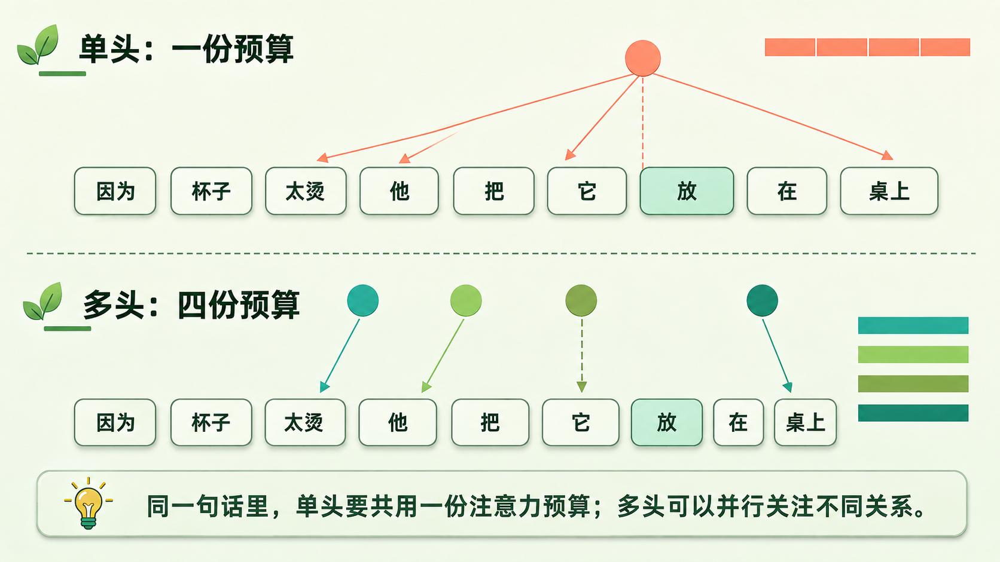
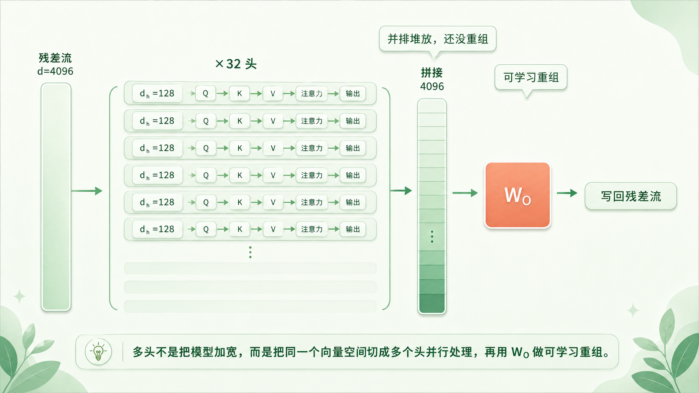
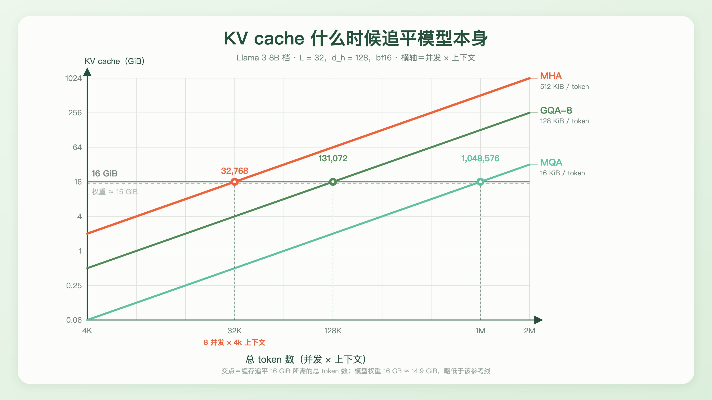
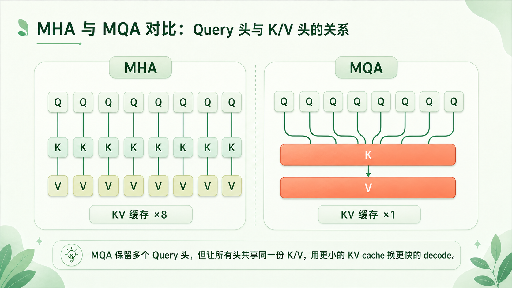
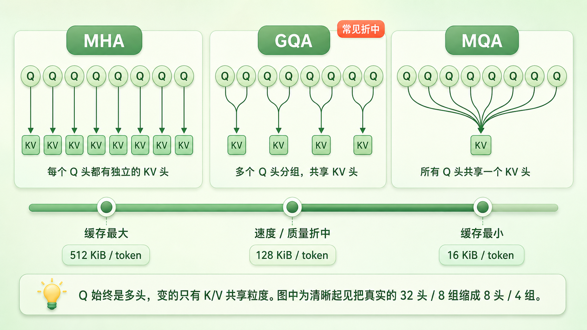
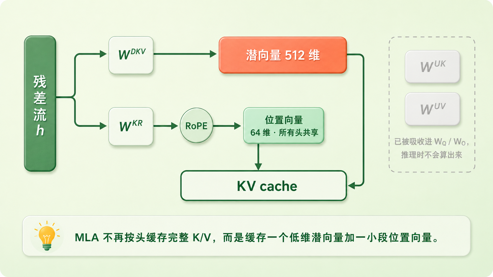

+++
title = "21 多头注意力的现代变体：MHA → MQA/GQA → MLA"
description = "多头在训练时几乎不花钱，账单全寄到了推理——从 MQA、GQA 到 MLA，都是去砍这张账单的。"
date = 2026-08-16
tags = ["LLM", "Attention", "MHA", "MQA", "GQA", "MLA", "KV Cache", "推理优化"]
categories = ["LLM"]
series = ["主线"]
showTableOfContents = true
+++





> 多头在训练时几乎不花钱，账单全寄到了推理——从 MQA、GQA 到 MLA，都是去砍这张账单的。

> 前置知识提示：读这篇前，建议先了解：一次 attention 的五个步骤与那份「总量为 1 的注意力预算」（#20）、\(W_O\) 这个在单头下看似多余的输出投影（#20）、推理为什么从 decode 那一步起变成串行（#19），以及 RoPE 是在投影之后、点积之前旋转 \(q\) 和 \(k\) 的（#16）。

上一篇结尾那个「它」，只干了一件事：往回找先行词。

可同一句话里要判断的，从来不止这一件。还是「因为杯子太烫，他把它放在桌上」，读到「放」这个位置时，至少有四条线索得同时拉住：动作的主语是「他」，宾语是「它」，落点是「桌上」，而整件事的起因挂在更远处的「太烫」上。

#20 发给每个位置的，是一份总量为 1 的注意力预算。逐行 softmax 决定了权重加起来必须是 1，所以四条线索得从同一份预算里分钱：多给主语一点，宾语那边就得少一点。

不过预算紧张只是表面。一个头当然可以给四个位置各分 0.25，Value 里也能混进好几种信息。真正卡住的是更深一层：单头只有**一套**注意力分布、**一套** Q/K/V 投影子空间，四种关系必须挤在同一套表示里说清楚。

Vaswani 他们在原文里说的正是这件事：多头注意力让模型可以同时关注来自不同表示子空间、不同位置的信息，而「用单个注意力头，平均会抑制这一点」。

解法朴素得有点无聊：一份预算不够花，那就发好几份。


*图：同一句「因为杯子太烫，他把它放在桌上」，位置「放」需要同时锁定主语「他」、宾语「它」、地点「桌上」和起因「太烫」。上半部单头只有一份总量为 1 的预算，四条线索互相稀释；下半部四个头各持一份独立预算，各自锁定一条*

这一篇讲这几份预算怎么发、发完之后在推理时捅出了多大的篓子，以及从 2019 到 2024，工程上是怎么分三步把它补回来的。

## 一份预算，好几件事要办

发好几份预算，第一反应可能是把模型加宽：既然一套 Q/K/V 不够用，那就再配几套。

真实做法恰恰相反——不加宽，切开。

> 一份两百页的合同送到公司，让一个人从头读到尾，他得同时惦记责任划分、付款节奏、交付时间和违约条款，读到后面难免顾此失彼。换成一个四人小组，法务只盯责任、财务只盯付款、业务只盯交付、风控只盯违约，各读各的那条线，最后碰头把四份意见拼成一份。人还是那四个人，工作量没变，但每个人手里的注意力不用再分给别人的事。

多头注意力（Multi-Head Attention，MHA）就是这个小组。残差流宽度 \(d\) 不变，把它切成 \(H\) 份，每份宽 \(d_h = d/H\)。#20 里那个反复出现的 \(d_k = 128\)，正是它——不是模型的宽度，是**单个头**的宽度。拿 \(d = 4096\)、\(H = 32\) 代进去，\(d_h = 128\)，对得上。

每个头拿着自己那 128 维的 \(W_Q^{(i)}\)、\(W_K^{(i)}\)、\(W_V^{(i)}\)，把 #20 那五步完整跑一遍：打分、除以 \(\sqrt{d_h}\)、盖掩码、逐行 softmax、按权重取回 Value。三十二个头互不通气，各自得到一份 \(N \times 128\) 的输出。

$$
\text{MultiHead}(X) = \text{Concat}(\text{head}_1, \dots, \text{head}_H)\,W_O
$$

$$
\text{head}_i = \text{Attention}(XW_Q^{(i)},\; XW_K^{(i)},\; XW_V^{(i)})
$$

三十二份 128 维的输出沿宽度拼起来，正好又是 4096 维。

**到这里，**\(W_O\) **的职责也清楚了。** #20 里它显得可有可无——单头情况下它完全可以并进 \(W_V\)，两个连续的线性变换本来就能合成一个。

多头之下它仍然不是维度上的必需品：\(H d_v = d\)，拼出来的向量长度正好，硬加回残差流也不违反什么。它真正提供的是**一次可学习的重组**。把 \(W_O\) 按头切成 \(H\) 块，整个式子等价于「每个头的输出各自投影回完整的 \(d\) 维，再相加」：

$$
\text{Concat}(\text{head}_1,\dots,\text{head}_H)\,W_O = \sum_{i=1}^{H}\text{head}_i\,W_O^{(i)}
$$

差别就在这里。没有 \(W_O\)，第 \(i\) 个头只能把结论写进残差流的第 \(i\) 段那 128 个维度，位置是被钉死的；有了它，每个头都能写到残差流的任意方向上去。小组开完会得碰头，\(W_O\) 就是那场碰头会——注意这场会的形式是「各自发言、汇总相加」，而不是几个头先互相揉合再统一输出。

**接下来是这一节真正反直觉的地方：多头几乎不要钱。**

直觉上，跑三十二遍 attention 应该比跑一遍贵三十二倍。但因为是切分而不是加宽，账根本没变：三十二个头的 \(W_Q^{(i)}\) 摞在一起，仍然是一个 \(d \times d\) 的矩阵，只是被看成三十二个 \(d \times 128\) 的竖条；\(W_K\)、\(W_V\)、\(W_O\) 同理。参数量一分没多。

算力也一样。#20 算过，attention 里那两个带 \(N^2\) 的矩阵乘合计 \(2N^2d\)——推导时就已经注意到它与头数无关：每个头的分数表是 \(N \times N\) 个格子、每格一次 128 维点积，\(H\) 个头加起来恰好凑回 \(N^2 d\)。切成 1 个头还是 32 个头，乘加次数一模一样。Vaswani 原文写得明明白白：「由于每个头的维度降低了，总计算成本与全维度的单头注意力相近。」

所以 \(H\) 是一个近乎白送的超参数。在训练这一侧，它确实白送。



*图：一个 4096 维的残差流向量经三个投影后被切成 32 条 128 维的窄带，每条独立跑完 #20 的五步 attention，输出沿宽度拼回 4096 维，再由 W_O 做一次可学习的重组才加回残差流——等价形式是每个头各自投影回 4096 维后相加*

小结一句：多头不是把模型加宽，是把同一个 \(d\) 维空间切成 \(H\) 份、发出 \(H\) 份独立的注意力预算；参数量与算力几乎不变，\(W_O\) 则从单头下的可有可无，变成了让每个头都能写回残差流任意方向的那次可学习重组。

## 账单寄到了推理

既然多头这么便宜，为什么还会有人费劲去改它？

因为账单不在训练那一侧。

#20 结尾拆过推理的两副面孔：prefill 阶段整段 prompt 一次算完，是 GPU 最喜欢的大矩阵乘；到了 decode，每一步只有一个新 token 当 query，分数表从方阵塌成一行。当时的结论是，这一步的瓶颈从算力换成了显存带宽——要算那一行分数，得把历史上全部位置的 K 读一遍；要做加权求和，还得把同样多的 V 再读一遍。

那些历史的 K 和 V 存在哪儿？缓存起来，就是 **KV cache**。它的完整正题（增量复用怎么发生、并发上来之后显存怎么管）留给 #25，这里只问一个问题：

**它有多大？**

$$
\text{KV cache} = 2 \cdot L \cdot N \cdot H_{kv} \cdot d_h \cdot b \cdot B
$$

逐项拆开：\(2\) 是 K 和 V 各存一份；\(L\) 是层数，每一层的 attention 都有自己的一套 K/V，谁也不能替谁；\(N\) 是已经积累的 token 数，每来一个新 token 就往后追加一行；\(H_{kv}\) 是 key/value 的头数，在 MHA 里它就等于 \(H\)；\(d_h\) 是单头宽度；\(b\) 是每个数占的字节（bf16 是 2）；\(B\) 是并发的序列条数。

拿 #20 一直在用的那个模型代进去——Llama 3 8B 这一档：\(d = 4096\)、\(H = 32\)、\(d_h = 128\)、\(L = 32\)、bf16。假设它用的是标准 MHA（\(H_{kv} = 32\)），单个 token 的 KV 是：

$$
2 \times 32 \times 32 \times 128 \times 2\ \text{字节} = 524288\ \text{字节} = 512\ \text{KiB}
$$

一个 token 在词表里不过是一个整数，进了模型走完三十二层，留下的痕迹是半兆字节。

```python
GiB = 1024 ** 3

def kv_per_token(kv_heads, layers=32, d_h=128, dtype_bytes=2):
    return 2 * layers * kv_heads * d_h * dtype_bytes      # 字节 / token

for name, h_kv in [("MHA", 32), ("GQA-8", 8), ("MQA", 1)]:
    b = kv_per_token(h_kv)
    print(f"{name:6} {b // 1024:>3d} KiB/token   16 GiB 装得下 {16 * GiB // b:>9,d} tokens")

# MHA    512 KiB/token   16 GiB 装得下    32,768 tokens
# GQA-8  128 KiB/token   16 GiB 装得下   131,072 tokens
# MQA     16 KiB/token   16 GiB 装得下 1,048,576 tokens
```

32768 这个数字值得停一下。它不是什么极限压测的配置——**8 条并发请求，每条 4k 上下文**，乘出来就是 32768 个 token。一台机器同时服务八个人聊天，上下文各自四千，MHA 的 KV cache 就已经是 16 GiB——而这个 8B 模型的权重按 bf16 存下来是 16 GB，换算成同一个单位约 15 GiB。缓存已经比模型本身还大了。

而且它比「多占一份显存」更难受。这 16 GiB 不是躺在那里占地方——decode 每生成一个词，都要把它整个读一遍。按 2 TB/s 这个量级的显存带宽估，光是过一遍缓存就要 8 ms 上下，这还没算读模型权重的时间。上下文越长、并发越高，这一遍就越久，而它每个词都得来一次。（这笔账怎么算得更细，留给 #26。）

于是多头那个「白送」的结论要补上后半句：在训练侧它确实白送，一到推理侧，\(H\) 就直接乘在缓存尺寸和每步的搬运量上。



*图：横轴是总 token 数（并发 × 上下文），纵轴是 KV cache 占用。MHA（512 KiB/token）、GQA-8（128 KiB/token）、MQA（16 KiB/token）三条直线依次与 16 GiB 水平线相交于 32768、131072、1048576 个 token（该模型 bf16 权重约 15 GiB，就在这条线下方一点）；8 并发 × 4k 上下文这一常见配置正好落在 MHA 的交点上*

小结一句：KV cache 的大小正比于 \(L \cdot N \cdot H_{kv} \cdot d_h\)。公式里每一项其实都有人动过——精度 \(b\) 可以量化，\(N\) 可以靠滑动窗口或淘汰策略截短。但如果把层数、单头宽度、缓存精度和要保留的历史都固定住，只从**注意力结构本身**下手，那么还能捏的就是 \(H_{kv}\)——接下来两节都在捏它。

## 砍掉冗余：MQA 和它的代价

\(H_{kv}\) 能捏，前提是那三十二份 K/V 并非都不可少。先看一条背景线索。

2019 年有一篇论文，标题本身就是问句：《十六个头真的比一个好吗？》。Michel、Levy 和 Neubig 拿训练好的模型做了一件很直接的事——测试时把某些头直接置零，看分数掉多少。结论出乎当时的直觉：大部分头可以在测试阶段被拿掉而不显著影响性能，有些层甚至只留一个头就够了。

但同一篇论文里还有更要紧的第二个结论：**这种冗余并不均匀。**

在他们测的翻译模型上，encoder-decoder 注意力的最后一层如果只保留单头，BLEU 会掉 13.5 分以上——这已经不是「略有下降」，是垮掉；而 BERT 那边，十二层里每层各留一个头，准确率的变化全都不显著。同样叫「头」，有的层里它们挤在一起干着高度重叠的活，有的层里每一个都不可替代。

这里得把分寸说准：Michel 他们剪掉的是**整个 head**——Q、K、V 连同输出一起拿走，所以这组实验证明不了「Q 该留、K/V 可以共享」。它只是把「几十个头之间存在大量重复劳动」这件事摆到了明面上；重复究竟重复在哪一侧，得靠结构实验一个个去试。

第一种试法，也是最激进的一种。

**MQA**（Multi-Query Attention，多查询注意力）由 Shazeer 在 2019 年提出，论文标题起得很像那句名言的续集：《One Write-Head is All You Need》。它的改动只有一句话：Query 保持 \(H\) 个头不变，Key 和 Value 只留**一份**，被所有 query 头共享。

> 回到 #20 那个图书馆的类比。MHA 是三十二个人各拿一份检索式、面对三十二套独立的索书号系统和三十二套书。MQA 是三十二个人还是各拿各的检索式，但书架只有一套：索书号一套，书也一套。查的人各查各的，查的对象是同一批。

\(H_{kv}\) 从 32 变成 1，缓存和每步搬运量直接除以 32。

Shazeer 那篇论文的实测数字，分寸拿捏得很能说明问题（WMT14 英德，序列长 128，单位是每个输出 token 的微秒数）：

|  | 训练 | 推理 encoder | 推理 decoder |
| --- | --- | --- | --- |
| MHA | 13.2 | 1.7 | 46 |
| MQA | 13.0 | 1.5 | 3.8 |

训练几乎没动，encoder 几乎没动，decoder 从 46 掉到 3.8——十二倍。一处改动，只砍推理那一段。

这个「只砍一段」并不神秘。训练里 K/V 当场算出来当场用掉，读的是刚生成的激活值；prefill 会把它们写进缓存，但写这一次就完事了。只有 decode 才需要一遍遍回读积攒下来的历史——**反复搬运是 decode 独有的负担**，收益也就压倒性地压在这一段。

也别把它说死成零。表里 encoder 从 1.7 掉到 1.5，说明 prefill 那边并非一点没省：K/V 的投影变窄了，往缓存里写的量也小了。只是 prefill 本就更偏算力受限，省下的那点搬运量显不出来。

代价确实存在。同一篇论文里，dev 集的 BLEU 从 26.7 掉到 26.5，每子词 token 的 \(\ln(\text{PPL})\) 从 1.424 升到 1.439。这里有个公平性细节值得点出来：为了让参数量对齐，MQA 版本把 FFN 的中间宽度从 4096 提到了 5440——省下来的 K/V 参数被补回了别处，所以这个对比测的是纯粹的结构差异，不是「参数变少了所以变差」。

真正让 MQA 站得住的，是另一组对照。同样想省缓存，还有一条更笨的路：干脆减少头数。论文把 \(h\) 直接降到 1（每个头仍是 128 维），BLEU 掉到 25.8、\(\ln(\text{PPL})\) 升到 1.518——比 MQA 差得多。

> 共享 K/V 和减少头数，省下的缓存量相当，代价却差着数量级。**这组对照才是 MQA 真正的证据**：保留多个 query 头再共享 K/V，损失明显小于把整个 attention 压成单头。

至于该怎么解释它——「多视角主要活在 Query 那一侧，被问的那批 Key 和 Value 弹性更大」是一种读得通的说法，但论文只给了结果，没有验证这个机制。当直觉用可以，别当结论。

后来的实践还给 MQA 补上了一条更麻烦的账：GQA 那篇论文在开头就直说，MQA 会带来**质量下降和训练不稳定**。而 Shazeer 那组实验是在 2.1 亿参数的翻译模型上做的——两篇论文都没有正面验证「模型一大 MQA 就更不稳」这个因果，但「只是略差」这个结论，确实没法无条件外推到几百亿参数上去。



*图：左侧 MHA，8 个 Query 头各自对应一个独立的 Key 头和 Value 头，共 8 套；右侧 MQA，8 个 Query 头全部连向同一个 Key 头和同一个 Value 头，KV 缓存量降为八分之一*

小结一句：MQA 让所有 query 头共享一份 K/V，把 decode 的搬运量除以 \(H\)，训练和 prefill 几乎不受影响；它的直接证据是 Shazeer 自己那组对照——多 query 头加共享 K/V，损失远小于把整个 attention 压成单头；它的麻烦则在于，强迫所有 query 头共用同一套 K/V 是个相当激进的容量约束，实验上会换来质量下降和训练不稳。

## GQA：在 32 和 1 之间找一个刻度

32 和 1 之间空着三十个数，没有理由不看一眼。

**GQA**（Grouped-Query Attention，分组查询注意力）由 Ainslie 等人在 2023 年提出，做法直白到几乎不用解释：把 \(H\) 个 query 头分成 \(G\) 组，每组内部共享一份 K/V。写作 GQA-\(G\)。\(G = 1\) 时所有头共享一份，就是 MQA；\(G = H\) 时每头一份，就是 MHA。

它把原来的二选一变成了一根连续的旋钮。

T5-XXL 上的实测（推理耗时与七项任务的平均分）：

|  | 推理耗时 | 平均分 |
| --- | --- | --- |
| MHA | 1.51 s | 47.2 |
| MQA | 0.24 s | 46.6 |
| GQA-8 | 0.28 s | 47.1 |

GQA-8 拿到了 MQA 百分之九十以上的加速，质量却几乎贴着 MHA——至少在这组摘要、翻译和问答任务上是这样。旋钮往中间拨一格，两头的好处基本都收走了。

这篇论文还附了一条工程上极其实用的东西：**uptraining**。已经训好的 MHA checkpoint 不必推倒重来——把每组内部那几个头的 K/V 投影矩阵**做平均**，池化成一份，然后用原始预训练算力的 **5%** 续训一下就行。他们比较过三种转换方式：均值池化最好，其次是随便选第一个头，最差是随机初始化新头——排序恰好对应「从预训练模型里保留了多少信息」。5% 已经够用，加到 10% 收益就开始递减。另一个细节耐人寻味：GQA 转换完不续训就已经堪用，MQA 则必须续训才有意义——又一次印证了一刀砍到 1 损失的东西更多。

**那为什么工业界不约而同选了 8？**

两条各自独立的理由，指向了同一个数。

**第一条是扫出来的。** GQA 论文把组数从 1 一路扫到 64，量了每种配置的推理耗时：从 MQA 的 1 组加到 8 组，只带来很小的额外开销；再往上加，代价开始陡增。他们选 8 的原话是「a favorable middle ground」——一个有利的折中点。所以 8 首先是质量与速度之间扫出来的经验甜点位。

**第二条来自机器的形状。** 大模型推理常用单机八卡张量并行，注意力天然按头切分——三十二个头分到八张卡，每张卡拿四个，各算各的。MHA 下 K/V 跟着头走，切得干干净净。可 MQA 只有一个 KV 头，头数比卡数还少，切不动了。剩下两条路都不好走：要么把这唯一一份 K/V 复制到每张卡上，那么整机的缓存量退回八份，和 GQA-8 一模一样，MQA 的优势原地归零；要么改成按 batch 维切分，工程上麻烦得多，而且只有在 batch 大于分片数时才成立。

Llama 2 的消融实验正好把这件事测了出来。Meta 在八张 A100 上跑张量并行时，MQA 的 KV 头就是复制到了每张卡，于是「MQA 的 KV cache 大小变得和 GQA 相等，两个变体表现也几乎相同」。既然复制之后收益一样、质量却更差，34B 和 70B 最终选了 GQA。同一组消融里还有一个更直观的现象：MHA 版本在 2k 上下文、batch 128 时就会显存溢出，而 MQA 和 GQA 都能正常跑完。

八卡这条理由并不是 GQA 论文当初选 8 的依据，但它恰好让 GQA-8 在主流部署形态下切得特别顺。两条理由撞在同一个数上，8 于是成了大模型上很常见的一档：

| 模型 | 注意力头 \(H\) | K/V 头 \(H_{kv}\) | 压缩倍数 |
| --- | --- | --- | --- |
| Llama 2 7B / 13B | 32 / 40 | 同 \(H\)（MHA） | 1× |
| Llama 2 70B | 64 | 8 | 8× |
| Llama 3 8B | 32 | 8 | 4× |
| Llama 3 70B | 64 | 8 | 8× |
| Llama 3 405B | 128 | 8 | 16× |
| Mistral 7B | 32 | 8 | 4× |
| Qwen2 1.5B | 12 | 2 | 6× |
| Qwen2 7B | 28 | 4 | 7× |
| Qwen2 72B | 64 | 8 | 8× |

这张表里藏着一个容易被略过的点：**真正的压缩倍数是** \(H/H_{kv}\)**，不是 8。** Llama 3 8B 只有 32 个头，GQA-8 省下的是 4 倍；到了 405B，128 个头对 8 个 KV 头，省的是 16 倍。模型越大、头越多，同一个 \(G = 8\) 就越划算，Llama 3 那三档正是这么一路走过来的。另一条路也有人走：Qwen2 让 KV 头数跟着规模一起长——1.5B 用 2、7B 用 4、72B 才用 8——压缩倍数反倒稳定在 6 到 8 倍之间。所以 8 并不是什么统一的工业默认值，它只是大模型这一档上反复出现的选择。GQA 论文里的原始论证也指着这个方向：模型一大，头数跟着涨，MQA 那种一刀砍到底在带宽和容量上就显得越来越激进，而分组让这个比例始终握在手里。

还有一处实现细节值得说清，免得留下误解：算的时候，那 8 个 KV 头要和 32 个 query 头一一配对，逻辑上等价于把它们**广播**成 32 份（现代 kernel 并不真在显存里复制一遍，否则省下的缓存又原样吐回去了）。所以点积和加权求和的乘加次数一次都没少——省下来的是**缓存占用**和 decode 每步的**访存量**，不是 FLOPs。这和 #20 里 FlashAttention 那条结论是同一个道理：在 decode 这种被带宽卡住的场景里，少搬数据本身就是提速。

小结一句：GQA 把「每头一份」和「全体一份」变成一根带刻度的旋钮，\(G\) 在大模型上常取 8、小模型上常见 2 或 4；已有的 MHA 模型可以靠组内均值池化加 5% 算力续训转过去，在 T5 那组任务上代价小到几乎看不出来。



*图：三档画的是同样八个 Q 头——变的只有下面那排 K/V。左端 MHA 每个 Q 头独享一份，中间 GQA 每两个 Q 头共享一份，右端 MQA 八个头共用一份；轴下方是三档对应的每 token 缓存量 512 / 128 / 16 KiB*

## MLA：不数头了，改压维度

前面三节其实一直在同一根轴上挪：\(H_{kv}\) 从 32 到 8 到 1。这根轴有个明摆着的天花板——最多省 \(H\) 倍，而且越往 1 靠越危险。

GQA 看上去把这件事解决得挺漂亮。但那是在 T5-XXL 的摘要、翻译和问答任务上。换一把尺子，结论会变。

DeepSeek 在 2024 年做过一组同架构对照：三个 7B 稠密模型，除注意力机制外结构完全一样（为对齐参数量还调了层数），放到几个更硬的知识基准上——

| 7B 稠密模型 | BBH | MMLU | C-Eval | CMMLU |
| --- | --- | --- | --- | --- |
| MQA | 33.2 | 37.9 | 30.0 | 34.6 |
| GQA-8 | 35.6 | 41.2 | 37.7 | 38.4 |
| MHA | 37.0 | 45.2 | 42.9 | 43.5 |

MMLU 上 MHA 比 GQA-8 高 4 个点，C-Eval 高 5 个点。

这和 GQA 论文那张「几乎贴着 MHA」的表并不打架，也别急着说谁推翻了谁——两边的模型规模、架构（encoder-decoder 对上纯 decoder）、训练方式、评测集全都不一样，任何一条都足以解释这个差距。但两张表摆在一起，有件事是清楚的：**GQA 的质量损失有多小，取决于具体的模型和训练设置**。T5 上那个「几乎无损」不能直接外推到所有 LLM，减头数这个维度的学费，未必总是那么便宜。

于是 DeepSeek 换了个问题问。前面所有做法都在问「这几十套 K/V 能不能少留几套」，MLA 问的是：**为什么一定要按「头」为单位来存？**

> 一个部门几十个人各写了一份周报，格式雷同、内容大量重叠。省空间的办法之一是「只让八个人写」——确实省下了，但丢掉的信息是真丢了。另一个办法是把所有周报打成一个压缩包：内容一份没少，占的地方却小得多，因为它们本来就高度冗余。

**MLA**（Multi-head Latent Attention，多头潜注意力）走的是第二条路。它给每个 token 算一个低维的**潜向量**：

$$
\mathbf{c}^{KV}_t = W^{DKV}\mathbf{h}_t
$$

\(\mathbf{h}_t\) 是这个位置的残差流向量，\(W^{DKV}\) 把它压到 \(d_c\) 维，而 \(d_c\) 远小于 \(n_h d_h\)——也就是所有头的 K/V 加起来的宽度。需要 K 和 V 的时候，各用一个上投影还原出来：

$$
\mathbf{k}^C_t = W^{UK}\mathbf{c}^{KV}_t, \qquad \mathbf{v}^C_t = W^{UV}\mathbf{c}^{KV}_t
$$

**缓存里只放** \(\mathbf{c}^{KV}_t\)**。** 上百套 K/V 被折叠进一个几百维的向量。

交代一句完整性：MLA 还会对 Query 做一次**另外的**低秩压缩（\(\mathbf{c}^Q_t = W^{DQ}\mathbf{h}_t\)，DeepSeek-V2 取 \(d_c' = 1536\)）。它和 KV 那条压缩线彼此独立，目的也不一样——降的是训练期 query 激活占的显存，不进 KV cache。所以下面算缓存的账时它不出现。

### 关键不在压缩，在于压根不用解压

读到这儿很容易生出一个误解：既然存的是压缩包，那每一步是不是都得先解压成完整的 K/V 再算？真要是这样，MLA 就没多大意思了——显存峰值又回来了，还白白多出两次矩阵乘。

真正的招数在别处。回到本篇第一节讲 \(W_O\) 时用过的那条性质：**两个相邻的线性变换可以合成一个**。attention 的打分是 \(\mathbf{q}^\top \mathbf{k}\)，把 \(\mathbf{k}\) 换成 \(W^{UK}\mathbf{c}^{KV}\)，整个式子可以这样挪一下括号：

$$
\mathbf{q}^\top \big(W^{UK}\mathbf{c}^{KV}\big) = \big((W^{UK})^\top\mathbf{q}\big)^\top \mathbf{c}^{KV}
$$

右边那个 \((W^{UK})^\top\) 作用在 query 上，而 query 本来就是 \(W_Q\) 投影出来的——两个线性变换紧挨着，事先乘成一个就行。于是 \(W^{UK}\) 被并进了 \(W_Q\)。输出那一侧同理，把 \(W^{UV}\) 从求和里提出来：

$$
\sum_j A_{ij} W^{UV}\mathbf{c}^{KV}_j = W^{UV}\Big(\sum_j A_{ij}\,\mathbf{c}^{KV}_j\Big)
$$

于是 \(W^{UV}\) 可以并进 \(W_O\)。

两个上投影在推理之前就被**吸收**掉了。query 直接和缓存里的潜向量做点积，**完整的 K 和 V 从头到尾都不必还原出来**。论文原话是：我们甚至不需要为 attention 计算出 keys 和 values。（这句话管的是被压缩的那部分 K/V——下一小节会看到，承载位置信息的一小截是个例外。）

这才是 MLA 省下来的东西的完整形态：缓存小了，而解压的代价是零——因为没有解压这一步。

### 但 RoPE 把这条路堵掉一半

吸收有个前提：\(W_Q\) 和 \(W^{UK}\) 之间不能夹着别的东西。

RoPE 恰好就夹在那儿。#16 讲过，RoPE 不动 embedding，它是在投影之后、点积之前，把 \(\mathbf{q}\) 和 \(\mathbf{k}\) 各自旋转一个正比于位置的角度。一旦对 \(\mathbf{k}^C_t\) 施加 RoPE，\(W_Q\) 和 \(W^{UK}\) 中间就插进了一个跟**当前生成到第几个 token** 有关的旋转矩阵。矩阵乘法不满足交换律，这个位置相关的东西挪不走，吸收也就做不成——每生成一个词都得把所有前缀的 K 重算一遍，比不压缩还慢。

DeepSeek 的解法叫 **decoupled RoPE（解耦 RoPE）**：把「承载位置」这件活儿从主通道里单拎出来，另开一小截专用维度 \(d^R_h\)（他们取 \(d_h/2 = 64\)）。query 那一侧每个头配一份 \(\mathbf{q}^R_{t,i}\)，key 那一侧**所有头共享一份** \(\mathbf{k}^R_t\)，只有这一小截过 RoPE。真正参与打分的是两段拼起来的向量：

$$
\mathbf{q}_{t,i} = [\,\mathbf{q}^C_{t,i};\ \mathbf{q}^R_{t,i}\,], \qquad \mathbf{k}_{t,i} = [\,\mathbf{k}^C_{t,i};\ \mathbf{k}^R_t\,]
$$

缩放分母也跟着从 \(\sqrt{d_h}\) 变成 \(\sqrt{d_h + d^R_h}\)。缓存里于是有两样东西：潜向量 \(\mathbf{c}^{KV}_t\)，和那截共享的 \(\mathbf{k}^R_t\)——后者要显式算出来并缓存，这就是上一小节那句「不必还原」的例外。

有个细节值得玩味：那截共享的位置向量，做法其实就是 MQA——所有 query 头共用一份 key。MLA 并没有否定共享，它只是把共享用在了最不吃亏的地方（承载位置的那一小截），把表达力留给被压缩的那一大截。这是我的读法，论文没这么说。

### 账算下来是多少

每个 token 每层要缓存 \(d_c + d^R_h\) 个元素。DeepSeek-V2 和 V3 都取 \(d_c = 512\)、\(d^R_h = 64\)，合计 **576 个元素**。

同一套配置下（\(n_h = 128\)、\(d_h = 128\)），四代做法终于可以摆在一张表里：

| 注意力 | Query 头 | K/V 头 | 每 token 每层缓存元素数 | 代入 DeepSeek 配置 | 位置编码 |
| --- | --- | --- | --- | --- | --- |
| MHA | \(n_h\) | \(n_h\) | \(2 n_h d_h\) | 32768 | 常规 RoPE |
| GQA-\(G\) | \(n_h\) | \(G\) | \(2 G d_h\) | 2048（\(G = 8\)） | 常规 RoPE |
| MQA | \(n_h\) | 1 | \(2 d_h\) | 256 | 常规 RoPE |
| MLA | \(n_h\) | 不按头存 | \(d_c + d^R_h\) | 576 | 须解耦 |

576 不到 GQA-8 那 2048 的三成，只有 MHA 的 1.8%。论文自己的换算最直观：MLA 的缓存量**相当于只有 2.25 组的 GQA**。

顺带把几笔账分开，免得混着看。

**参数量**：MQA/GQA 是**真的会减少** attention 的参数。忽略 bias，MHA 四个投影合计 \(4d^2\)，GQA-\(G\) 则是 \(2d^2 + 2d^2 G/H\)——\(W_Q\) 和 \(W_O\) 不变，\(W_K\)、\(W_V\) 按比例变窄。至于「把省下的参数补回 FFN」，那是**做对照实验时为了对齐总参数量的操作**（Shazeer 把 \(d_\text{ff}\) 从 4096 提到 5440、Llama 2 的消融乘 1.3 都是这个用意），真实模型并不要求这么做。

**注意力主体的乘加量**（那两个带 \(N^2\) 的矩阵乘）在 MHA、MQA、GQA 之间完全相同，GQA 省的从来不是 FLOPs。真正被压下去的是**缓存容量**和 decode 每步的**访存量**，而 decode 恰好卡在后者上，所以省访存就等于提速。

**MLA 这一栏要单算，而且它的算力涨得不算少**：吸收之后 content 那条路的点积是在 512 维的潜空间里做的，比原来的 \(d_h = 128\) 宽了四倍，另外还挂着一条 64 维的 RoPE 分支。这是实打实地用更多 FLOPs 去换大幅缩小的缓存与带宽——在被带宽卡住的 decode 阶段这笔交易通常划算，但也是它对 kernel 更挑剔的原因。

真正让人意外的是质量那一栏。**下面这组数来自 DeepSeek-V2 自己的同架构消融**，两个规模各做一对，除注意力机制外其余结构一致：

|  | 每 token 缓存元素数 | BBH | MMLU | C-Eval | CMMLU |
| --- | --- | --- | --- | --- | --- |
| 250B MoE · MHA | 860.2K | 46.6 | 57.5 | 57.9 | 60.7 |
| 250B MoE · MLA | 34.6K | 50.7 | 59.0 | 59.2 | 62.5 |

缓存降到 4%，四项全面更好。小一号的 16B MoE 上方向一致（110.6K → 15.6K，四项里三项更好，C-Eval 略低）。

前面每一节的故事都是「拿质量换显存」——MQA 换得狠，GQA 换得省。在这组消融里，MLA 是第一个两头都拿到的（换个团队、换套训练配方是否还成立，目前只有这一家的数据）。至于为什么压缩之后反而更好，论文只报告了结果，没给机制上的解释；「低秩瓶颈本身起了正则作用」是一种流传较广的猜测，但它目前也就只是猜测。



*图：残差流向量经 W^DKV 压成 512 维潜向量，另经 W^KR 生成一截 64 维、所有头共享的位置向量；两个上投影 W^UK / W^UV 用虚线框标出「推理前已被吸收进 W_Q / W_O，不会真的算出来」；两条箭头从潜向量和位置向量分别落进下方标着「KV cache」的容器，说明进缓存的只有这两样（缓存元素数的对比看上面那张表，图里不重复画）*

### 放回第二节那张账单

回到第二节那个具体的数：Llama 3 8B 用 GQA-8，每 token 128 KiB。

DeepSeek-V3 有 671B 参数、61 层，每 token 的 KV 是 \(576 \times 61 \times 2\) 字节，约 **68.6 KiB**。

一个 671B 的模型，每个 token 在显存里留下的痕迹，只有那个 8B 模型的 54%。同样用 GQA-8 的 Llama 3 405B（126 层）则是 504 KiB，是它的七倍多。

代价也该说清楚。MLA 的结构比 GQA 复杂得多：多出两组投影矩阵、一套解耦 RoPE 通道，潜向量后面还得补 RMSNorm 才训得稳；吸收技巧也让它和现成的 attention kernel 适配起来更麻烦。而且 DeepSeek 那两篇论文里，MLA 都是从头训练的——GQA 有 uptraining 那条 5% 算力的低成本转换路径，MLA 在这两篇里没有给出对应的配方。

小结一句：MQA 和 GQA 在「留几个头」这根轴上折中，MLA 换了一根轴——把整层的 K/V 低秩压成一个潜向量，靠矩阵吸收让它全程不必还原，再用解耦 RoPE 绕开位置编码这道坎；结果是缓存降到 MHA 的百分之几，代价是 attention 内部算力上升，而质量在 DeepSeek 自家的同架构消融里反而更好。

## 读完这一篇：四代做法，一条线索

回到开头那份不够花的预算。多头的解法是切分而不是加宽——同一个 \(d\) 维空间切成 \(H\) 份，发出 \(H\) 份互不干扰的注意力预算，而参数量和乘加次数几乎原地不动。\(W_O\) 也在这里领到了它真正的岗位：让每个头都能把结论写到残差流的任意方向上，而不是被钉死在自己那一段。#20 里那个悬着的 \(d_k = 128\)，答案就是 \(d/H\)。

代价整个转移到了推理。\(H\) 直接乘在 KV cache 的尺寸上，而 decode 每生成一个词都要把这份缓存整个读一遍——八条并发、各四千上下文，MHA 的缓存就已经超过模型权重本身。

后面三代做法，全是冲着这一张账单去的：

- **MQA**（2019）把 K/V 砍到一份，decode 从 46 µs 掉到 3.8 µs，代价是质量下滑和训练不稳；
- **GQA**（2023）在中间开出刻度，大模型上常取 8——既是论文扫组数扫出来的折中点，也正好合上八卡张量并行的形状——还能用 5% 算力从已有 MHA checkpoint 转过去；
- **MLA**（2024）干脆换了根轴——不数头了，把整层 K/V 低秩压成一个潜向量，靠矩阵吸收做到全程不还原，用解耦 RoPE 绕开位置编码那道坎，最后缓存降到百分之几，质量还反超了 MHA。

把这四代摆在一起看，有一条线索始终没断：**scaled dot-product attention 的核心计算形式一直没变。** #20 讲的那五步——打分、缩放、掩码、softmax、加权求和——从 2017 到今天原样不动，每行权重和为 1 的那份预算也没变。

真正在演化的是另外两件事：**Q/K/V 是怎么参数化出来的**，以及**推理时到底要把哪些状态留在显存里**。MQA 和 GQA 动的是 K/V 的头数与共享方式；MLA 走得更远，连 Q/K/V 的生成路径都换了——低秩压缩、解耦 RoPE，连缩放分母都从 \(\sqrt{d_h}\) 变成了 \(\sqrt{d_h + d^R_h}\)。所以这不是「换个缓存格式」那么轻描淡写，而是围着同一个计算核心，把它的输入端和状态端反复重新设计。

这根轴上还有别的路子在走：把 KV 在层与层之间共享，或者让大部分层只看一个滑动窗口、少数层才看全局，再或者干脆让每个位置只看一部分位置。它们各有各的账要算，留给长上下文那一章和推理工程那一章。

不过我们一路上都在借同一批说法：decode 卡带宽、prefill 是大矩阵乘、延迟主要被 decode 吃掉。这些结论从 #20 借到这一篇，可推理的这两个阶段究竟各自决定了什么，始终没有正面拆过。为什么「短提示、长回答」的对话场景里，你等的是 decode；换成「长文档、短回答」，卡住你的又变成了 prefill？下一篇 #22，我们把推理拆成 prefill 和 decode 两段，把这笔账正面算一遍。

## 参考资料

- Vaswani et al., 2017. *Attention Is All You Need.* arXiv:1706.03762（多头的定义、\(W_O \in \mathbb{R}^{H d_v \times d}\)，以及「由于每个头的维度降低了，总计算成本与全维度单头注意力相近」见 §3.2.2）
- Shazeer, 2019. *Fast Transformer Decoding: One Write-Head is All You Need.* arXiv:1911.02150（MQA 出处；WMT14 基线与各变体均为 2.11 亿参数、训练 13.2→13.0、encoder 1.7→1.5、decoder 46→3.8 µs/token 见 §4.1 与 Table 2，质量对照与 \(h=1\) 的基线见 Table 1）
- Ainslie et al., 2023. *GQA: Training Generalized Multi-Query Transformer Models from Multi-Head Checkpoints.* EMNLP 2023, arXiv:2305.13245（GQA-\(G\) 的定义、uptraining 与均值池化、T5-XXL 的耗时与分数对照见 Table 1；组数从 1 到 64 的扫描与「选 8 组作为 favorable middle ground」见 §3.2 与 Figure 6）
- Michel et al., 2019. *Are Sixteen Heads Really Better than One?* NeurIPS 2019, arXiv:1905.10650（头冗余；「只保留单头」的逐层影响见 Table 2、Table 3——翻译模型 encoder-decoder 末层掉 13.5 BLEU，BERT 各层均不显著。注意它剪的是整个 head，不构成 K/V 可共享的直接证据）
- Touvron et al., 2023. *Llama 2: Open Foundation and Fine-Tuned Chat Models.* arXiv:2307.09288（34B/70B 选择 GQA 的消融、张量并行下 MQA 需复制 KV 头的论证，见附录 A.2.1）
- Llama Team @ Meta, 2024. *The Llama 3 Herd of Models.* arXiv:2407.21783（8B/70B/405B 的 Key/Value Heads 均为 8，见 Table 3）
- Jiang et al., 2023. *Mistral 7B.* arXiv:2310.06825（`n_heads = 32`、`n_kv_heads = 8`，见 Table 1）
- Qwen Team, 2024. *Qwen2 Technical Report.* arXiv:2407.10671（Table 1：0.5B/1.5B/7B/72B 的 KV 头分别为 2/2/4/8，说明 \(H_{kv}\) 随规模变化而非固定 8）
- Pope et al., 2022. *Efficiently Scaling Transformer Inference.* arXiv:2211.05102（推理分片策略；按 batch 维切分 KV 的代价）
- DeepSeek-AI, 2024. *DeepSeek-V2: A Strong, Economical, and Efficient Mixture-of-Experts Language Model.* arXiv:2405.04434（MLA 出处：低秩联合压缩与矩阵吸收见 §2.1.2、解耦 RoPE 见 §2.1.3、四种注意力的每 token 缓存元素数对照与「等价于 2.25 组 GQA」见 Table 1、模型超参见 §3.1.2；实际部署还把 KV cache 每个元素平均量化到 6 bit 见 §3.2.3；7B 稠密模型上 MHA / GQA / MQA 的硬基准消融见附录 Table 8，MLA 与 MHA 的同架构对照见附录 Table 9）
- DeepSeek-AI, 2024. *DeepSeek-V3 Technical Report.* arXiv:2412.19437（671B 总参数 / 37B 激活，沿用与 V2 完全相同的一套 MLA 参数：\(d_c = 512\)、\(d^R_h = 64\)、61 层，见 §4.2）
- 延伸：Voita et al., 2019. *Analyzing Multi-Head Self-Attention: Specialized Heads Do the Heavy Lifting, the Rest Can Be Pruned.* arXiv:1905.09418（哪些头是专门化的、哪些可以剪掉，是对头冗余更细的刻画）
