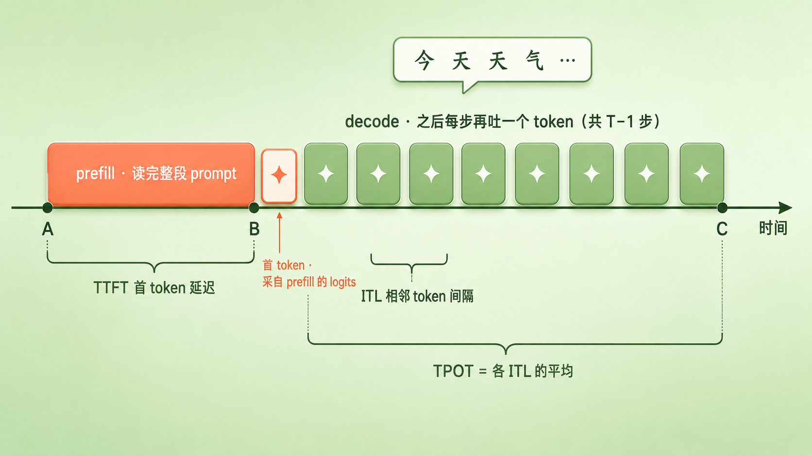
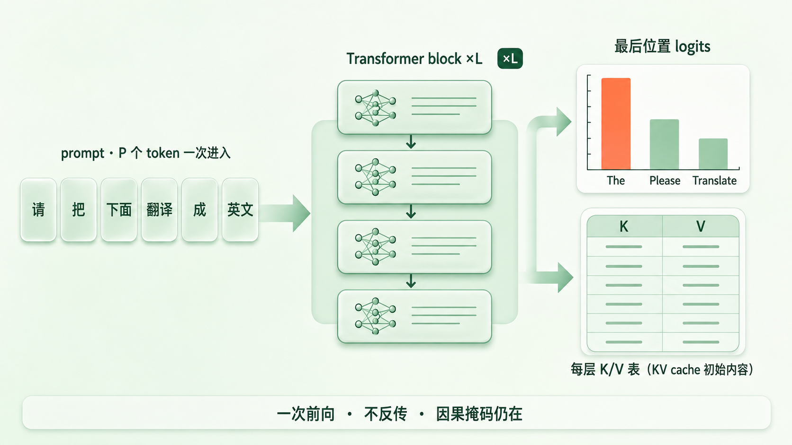
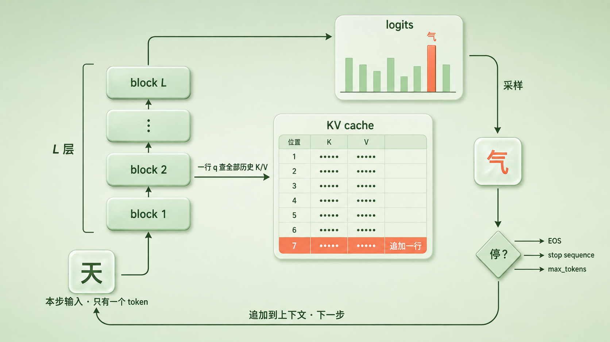
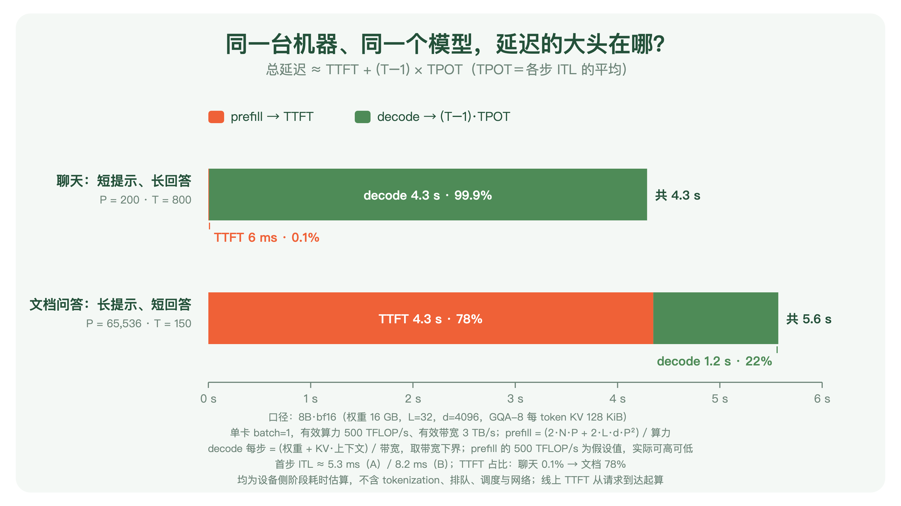
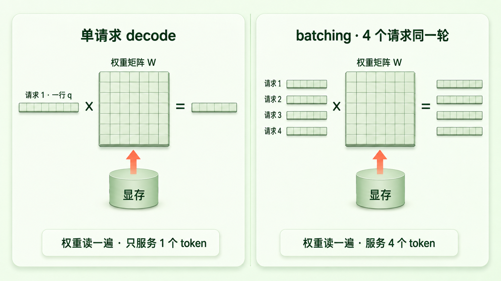

+++
title = "22 推理是串行的：Prefill 与 Decode 的两阶段"
description = "生成不是一口气写完，而是一次整段算完的 prefill，加上一个 token 一个 token 往外吐的 decode 循环；延迟的大头看你让它读多长、写多长。"
date = 2026-08-23
tags = ["LLM", "推理", "Prefill", "Decode", "KV Cache", "TTFT", "TPOT", "Batching"]
categories = ["LLM"]
series = ["主线"]
showTableOfContents = true
+++





> 生成不是一口气写完，而是一次整段算完的 prefill，加上一个 token 一个 token 往外吐的 decode 循环；延迟的大头看你让它读多长、写多长。

> 前置知识提示：读这篇前，建议先了解：训练为什么能「整段一次算完」、并行的三条边界（#19），attention 在 prefill 与 decode 里的两副面孔（#20），以及 decoding 策略里「分布 → 选择 → 停止」那个框架（#5）。

你在对话框里敲下一个问题，按回车。

接下来会发生两件不一样的事。先是一小段安静——光标闪着，什么都没出来；然后字开始一个一个往外蹦，像有人在另一头打字。有时候那段安静很短，短到察觉不到；有时候你丢进去一份几十页的文档，它能安静好几秒，久到你怀疑是不是卡住了。

这两种「等」，不是同一种等。前面那段安静，模型在**读**你给它的东西；后面字往外蹦，模型在**写**。读是一次性读完的，写只能一个词一个词来。这篇文章就讲这两个阶段——它们各自在算什么、为什么一个能并行一个只能串行、以及你等的那些时间到底花在了哪一边。

先把两件事说清楚。第一，下文所有的「推理」指的都是 inference：拿训练好的模型做一次前向计算、产出一段文字。它不是「推理模型」里那个 reasoning（思维链、一步步想），两个词中文撞了车，这篇只管前者。第二，这篇讨论的对象是目前主流的那一类模型——decoder-only 的自回归 Transformer，用全量因果注意力，用标准的 KV cache。encoder-decoder 结构、非自回归或扩散式的语言模型、滑动窗口和稀疏注意力，以及前缀缓存、投机解码这些系统侧优化，要么不完全符合下面的描述，要么会改变这笔账的某一项；文中会在该点名的地方点名，但不展开。


*图：一次完整生成在时间轴上的样子。时间轴上三个点：A 是起点，B 是 prefill 算完、首 token 从它产出的 logits 里采出来的那一刻，C 是最后一个 token 落地。A 到 B 那一整块是 prefill——把整段 prompt 一次算完；B 到 C 一串窄块是之后 T−1 次 decode——每块再吐一个 token。A 到 B 的这段等待叫 TTFT；之后任意两个相邻 token 之间的间隔叫 ITL，B 到 C 之间所有间隔的平均叫 TPOT*

## 一、prefill：答案还没到，题目已经在手上

#19 讲过训练为什么能并行：语料是已知的完整文本，每个位置的输入不用等模型生成，直接从文里抄，所以整段一次前向就够。当时收尾留了三条边界，第三条是「并行以答案已知为前提」——推理时答案不再已知，所以不能照搬。

可推理也不是一上来就什么都不知道。

> 想象你在考试。卷子发下来，你先把题目从头到尾读一遍——这一遍不需要一个字一个字地写，你可以一口气看完。真正只能一笔一画来的，是后面写答案。

用户发来的 prompt 就是那张卷子。它是给定的、完整的、一次性摆在模型面前的——这恰好满足 #19 那个前提。于是推理的第一阶段和训练几乎长得一样：把整段 prompt 当成一个长度为 \(P\) 的序列，一次前向流过全部 \(L\) 层。attention 的分数表在逻辑上是 \(P \times P\)（只有因果下三角有效，现代 kernel 分块计算、并不真把整张表摆出来，#20 讲 FlashAttention 时说过），FFN 是 \(P\) 行一起过——都是 GPU 最喜欢的大矩阵乘，算力能吃满。这个阶段叫 **prefill**（预填充）。

它和训练有三处不同，值得一条条对清。

第一，**没有 loss，不反传**。训练的前向是为了算梯度，prefill 的前向只为产出。前向过程中当然还是有临时激活，但算完这一层就可以丢，不必像训练那样为反向传播留到最后——#20 里那笔「为反传保留 N×N 表、还要乘层数」的显存账，在这里不存在。

第二，**因果掩码还在**。这一点容易想歪：prompt 是已知的，没有标签可泄漏，那为什么还要挡住「看右边」？因为 prefill 算出来的东西要留给后面用。位置 \(i\) 的 K、V 将来要被 decode 的每一步反复查询，而 decode 时它「右边」的那些位置根本还不存在——要让 prefill 算出的状态和逐 token 算出来的一模一样，位置 \(i\) 就只能看 \(\le i\) 的内容。掩码在这里不是防作弊，是保证**状态一致**。

第三，**LM head 只需要算最后一行**。训练时每个位置都要出 logits，因为每个位置都有监督信号；prefill 时前 \(P-1\) 个位置的「下一个词」早就在 prompt 里写着，算出来也没人用。只有最后一个位置的 logits 有用——它就是第一个新 token 的分布。（除非你要 prompt 的逐位置 logprob，比如算 PPL，那是另一件事。）

所以 prefill 结束时，模型手里有两样东西：

- **最后一个位置的 logits**——第一个要生成的 token 的概率分布，下一阶段从这里起步；
- **每一层、每一个位置的 K 和 V**——这是 prompt 留下的「上下文状态」。往后每生成一个词，都要回头查这些 K、V；既然查的是同一批东西，算一次存起来就行，不必每步重算。这就是 **KV cache**（键值缓存）的雏形：prefill 一次性填满它，decode 每步往里追加一行。它要占多少显存、为什么会成为推理的头号资产，留给 #25，这篇只说它从哪来。

prefill 花多长时间？整段 \(P\) 个 token 一起过模型，线性部分的计算量正比于 \(P\)，attention 还有一个随 \(P^2\) 涨的项（短 prompt 时可以忽略，几万 token 时就不能了，#20 算过）。用户看到闪烁光标的那段时间里，主要就是在做这件事。serving 系统把「从请求发出到第一个 token 返回」这段等待叫 **TTFT**（Time To First Token）；在单请求、没有排队的简化模型里，它基本就是 prefill 的耗时——线上真实的 TTFT 还会叠上 tokenization、排队、调度和首 token 的采样，这篇先只算 prefill 这一段。



*图：prefill 一次吃进整段 prompt「请把下面这段话翻译成英文：……」，流过 L 层。产物有两个：右上是最后一个位置的 logits（第一个新词「The」的分布），右下是每层一张 K/V 表——每个 prompt 位置一行，这就是 KV cache 的初始内容*

小结一句：prefill 是推理里「答案未知、题目已知」的那一段——像训练一样整段并行，但只前向、只出最后一行 logits，并把每个位置的 K/V 留下来当上下文状态；在单请求的简化模型里，它的耗时就是首 token 延迟的主体。

## 二、decode：一个词一个词地往外吐

第一个新 token 从 prefill 留下的 logits 里采样出来之后，事情就变了。

第二个 token 的输入是什么？是第一个 token——那个刚刚才被采样出来的东西。它在 prefill 开始的时候还不存在，在第一步结束之前也不存在。要算第二个，必须先有第一个；要算第三个，必须先有第二个。这条链没法跳。

> 还是那张考卷。写答案的时候，你下一个字写什么，取决于上一个字写了什么——不可能把第一句和第三句同时落笔，因为第三句是什么得看前两句怎么写。

这个阶段叫 **decode**（解码）：每一步只处理一个新 token，把它流过全部 \(L\) 层，得到末层的 logits，采样出下一个 token，追加到上下文末尾，再来一遍。写成伪代码就是一个循环：

```python
state = prefill(prompt)            # 一次前向：填满 KV cache，拿到最后位置的 logits
logits = state.logits
output = []

for _ in range(max_tokens):
    token = sample(logits)         # greedy / top-p / temperature 在这一步起作用（含首 token）
    output.append(token)
    if token == EOS or hit_stop_sequence(output):
        break
    logits, state = forward_one(token, state)   # 一个 token 过 L 层，KV cache 追加一行
```

几件事要说准。

**串行的根源是自回归，不是 Transformer。** 第 \(t\) 步的输入就是第 \(t-1\) 步的输出，这是「按条件概率链式展开」这件事本身带来的（#1 写下的那个连乘，每一项的条件里都有前面所有项）。RNN 同样逐 token 生成，同样串行。Transformer 真正改变的是另一半：它让 prefill——以及训练——那一段可以并行（#19）；decode 这一段，它和 RNN 一样一步一步来。

**每一步过的是全部 L 层，不是一层。** 所以这里有两重串行叠在一起：层与层之间串行（第 \(\ell\) 层要等第 \(\ell-1\) 层，#19 说过），步与步之间也串行。一个 token 从进模型到出 logits，要完整走一遍深度；走完才能采样，采样完才能开始下一个。

**每一步的 attention 只有一行。** 新 token 在每一层都要算一次 attention：拿自己的 \(q\) 去对历史上全部位置的 K 打分、对 V 加权——这正是 #20 说的「分数表从方阵塌成一行」。历史的 K、V 从 KV cache 里读，新 token 自己的 K、V 算完追加进去。于是缓存每步长一行，下一步要读的就多一行。

**采样与终止都在循环里兑现。** #5 把生成拆成「分布 → 选择 → 停止」三段：`forward_one` 给分布，`sample` 做选择，`break` 负责停止——模型自己吐出 EOS、命中用户设的 stop sequence、或者 `for` 跑满 `max_tokens`。注意首 token 也在循环里：它同样要过采样策略，也同样要查终止条件（`max_tokens=1`，或者第一个采出来的就是 EOS，都得立刻停）。你在 API 里调的 temperature、top-p、max_tokens，全部作用在这个循环里，而不是 prefill 里。顺带把三个数分清，后面算账要用：输出 token 数是 \(T\)；控制循环——采样加终止检查——跑 \(T\) 次；模型的增量前向 `forward_one` 只跑 \(T-1\) 次，因为首 token 的 logits 已经由 prefill 产出，不需要再单独跑一次。

现在看时间。decode 一步要多久？

一个 token 过一层：attention 是一行 \(q\) 乘历史 K、再乘 V，加上自己那几个投影；FFN 是一行乘两三个大矩阵。算术量很小——和 prefill 那种 \(P\) 行一起过比，这一步几乎没什么可算的。但有一件事省不掉：**每一层的权重都得从显存里读进计算单元**，而且每一步都要重读一遍。一个 8B 的模型，bf16 权重 16 GB，decode 每生成一个 token 就要把这 16 GB 完整过一遍。按 H100 那一档 3 TB/s 上下的显存带宽，光是搬权重就得 5 ms 出头（#21 按 2 TB/s 估的是 8 ms 上下，量级一样）；再加上读一遍历史 K/V——上下文越长这部分越多。至于计算本身，在这种「一行乘一块大矩阵」的形状下只占极小一截。

这就是 #19、#20 都提过的那句话的来历：单请求、小 batch 下，decode 的瓶颈不在算力，在「搬不搬得过来」。它的精确版本（算术强度、roofline）留给 #26 和 #83，这里只需要记住结论：**decode 一步的耗时，主体是把整套权重读一遍，外加读一遍历史 K/V**。前者是常数；后者随上下文缓慢增长——每多生成一个词就多读一行，但相对 16 GB 的权重，几千 token 的缓存只是零头。所以单步耗时在整个生成过程里近乎平的。

这里顺手把两个名词分清。任意两个相邻 token 之间的实际间隔叫 **ITL**（Inter-Token Latency，也叫 TBT）；一次请求里把这 \(T-1\) 个间隔取平均，才是 **TPOT**（Time Per Output Token）。这是 DistServe 这类论文和常见 serving benchmark 的口径，本文沿用它；行业命名并不完全统一，有些监控文档会直接把单次间隔叫 TPOT，读到时留意一下定义就好。两者在 decode 步长近乎平的情况下数值接近，但不是一个东西——ITL 是逐步的，会有尖刺（后面会看到 batching 里长 prefill 插进来就是一种）；TPOT 是一条平均线，会把尖刺摊薄。



*图：decode 的一步。左下角只有一个新 token「天」进入；它流过 L 层，每层里用自己那一行 q 去查 KV cache 里已有的行、再把自己的 K/V 追加为新的一行；末层出 logits，采样得到下一个 token「气」，沿外侧回到入口。循环只有三个出口：EOS、stop sequence、max_tokens*

小结一句：decode 每步只处理一个新 token，串行来自自回归本身；每一步都要把整套权重过一遍、把历史 K/V 读一遍，这段近乎常数的时间就是每步的 ITL、平均下来就是 TPOT，而采样策略与终止条件全部在这个循环里兑现。

## 三、延迟的账：你让它读多长、写多长

两个阶段各自的时间都有了，一次完整请求的延迟就能拼出来：

$$
T_{\text{total}} \approx \text{TTFT} + \sum_{i=2}^{T}\text{ITL}_i = \text{TTFT} + (T-1)\cdot\text{TPOT}
$$

翻成大白话：等第一个字的时间，加上后面 \(T-1\) 个字每个字的间隔之和；把间隔换成平均值，就是 TTFT 加 \((T-1)\) 个 TPOT。

前面几篇一直借着一句话用——「延迟主要被 decode 吃掉」。现在可以把它说准了：这取决于你让模型**读多长、写多长**。

> 还是那张考卷。一道选择题，题干两行、答案一个字母，你的时间几乎全花在读题上；一道作文题，题目一句话、要写八百字，你的时间几乎全花在写上。同一个人、同样的读写速度，时间的分布完全相反。

拿同一台机器、同一个 8B 模型，算两种常见场景。口径写死：bf16 权重 16 GB、\(L = 32\) 层、\(d = 4096\)、GQA-8（每 token 的 K/V 是 \(2 L n_{kv} d_h b = 2 \times 32 \times 8 \times 128 \times 2\) 字节 = 128 KiB，#21 的数）；单卡、batch = 1；有效算力按 500 TFLOP/s（峰值打五折）、有效带宽按 3 TB/s。两个阶段各用一条式子估：

$$
F_{\text{prefill}} \approx 2 N_{\text{params}} P + 2 L d P^2,\qquad
t_{\text{decode}}(s) \gtrsim \frac{B_{\text{weight}} + s \cdot B_{\text{KV/token}}}{\text{BW}}
$$

前一条是 prefill 的算力账：线性项是参数量乘 token 数的两倍（每个参数一次乘加），二次项是 attention 的 \(QK^\top\) 与 \(AV\)、按因果下三角只算一半；除以有效算力就是时间。后一条是 decode 第 \(s\) 个上下文位置那一步的带宽下界：整套权重加上当前上下文的 K/V 一起读一遍，除以带宽。「\(\gtrsim\)」是认真的——这是下界，真实每一步还有 kernel 启动、调度、采样这些开销。

**场景 A，聊天**：200 个 token 的提示，回答 800 个 token。prefill 只要 6 ms——200 行一起过模型，快得察觉不到；之后 799 步 decode，每步 5 ms 出头，合计 4.3 秒。TTFT 占总时长 **0.1%**。

**场景 B，文档问答**：把一份 6.5 万 token 的长文档丢进去，问一个问题，回答 150 个 token。prefill 要算 6.5 万行，attention 的二次项也起来了，TTFT 4.3 秒；之后 149 步 decode、每步 8 ms 出头，合计 1.2 秒。TTFT 占 **78%**。



*图：同一台机器、同一个 8B 模型。上面是聊天（P=200、T=800），总 4.3 秒里 prefill 只有 6 ms，几乎整条都是 decode；下面是文档问答（P=65,536、T=150），总 5.6 秒里 prefill 占 4.3 秒。口径见图内脚注：prefill 按假设的有效算力估、decode 按带宽下界估，均为设备侧阶段耗时、不含排队调度，实际取决于模型、kernel 与 serving 系统，可高可低；这组数字展示的是两种典型场景的趋势*

两条结论。

第一，**「延迟被 decode 支配」只是聊天场景的真相**。短提示、长回答，decode 步数多，总时长几乎就是 \(T \times \text{TPOT}\)。换成长文档、长代码库、整段对话历史做提示，回答却很短，首 token 那一下反而是大头——用户等的那几秒安静，主要就是 prefill。（有个例外值得知道：如果这段长前缀之前刚算过——同一个 system prompt、同一份文档的第二个问题——服务系统可以把上次的 K/V 直接拿来用，不必重新 prefill，这叫前缀缓存，留 #86。所以「长文档必然首字慢」说的是冷请求。）

第二，**这笔账看的是趋势，不是实测**。两条式子的性质不一样：decode 那条是忽略了其他流量与开销的带宽下界，真实 ITL 只会比它高；prefill 那条不是界——500 TFLOP/s 是个假设的有效算力，高效的 kernel 能做到峰值的六七成，糙一点的实现也可能更低。线上 TTFT 还要加上排队与调度。所以别把 4.3 秒、6 ms 当成哪台机器的实测数，它们展示的是在这组假设下两种典型场景各自的倾向；而这两个场景的 P 和 T 相差两个数量级，把哪一项乘个 1.5 或 2，大头仍然在原来那一边。

顺着这笔账，能解释两个日常体感。

**为什么回答是一个字一个字出来的？** 不是为了好看特意做的打字动画——decode 循环每转一圈就产出一个 token，把它立刻推给用户，就是流式输出（streaming）。而且流式有个副作用：模型每秒吐几十到上百个 token，人读中文大约每秒几个到十来个字，只要前者快过后者，后面那 4.3 秒 decode 就被「藏」进阅读时间里了——你边读它边写，感觉不到在等。**藏不住的是 TTFT**：第一个字出来之前，没有任何东西可读。这也是为什么首字延迟在体感上最刺眼，也是 serving 系统把它单独拎出来当指标的原因。

**为什么「推理模型」慢那么多？** 它们在给出答案前要先写一长段思考，输出 token 从几百变成几千上万。按上面那条式子，\(T\) 涨十倍，decode 那一项就涨十倍。而且如果这段思考不向用户返回，按「首个可见 token」的口径，这段 decode 时间会被直接算进 TTFT——此时的 TTFT 里混进了一大段 decode，不再约等于 prefill 耗时。这件事的前因后果留给第六章的 #55，这里只说：它把场景 A 推向了更极端的方向。

小结一句：总延迟 ≈ TTFT + (T−1)·TPOT，谁是大头取决于 P 和 T 的比例——聊天是 decode，长文档问答（冷请求）是 prefill；流式输出能把 decode 藏进阅读里，藏不住的是首 token。

## 四、延迟与吞吐：一行太瘦了

到这里为止算的都是一个请求。真实的服务器上同时有很多请求，这就引出推理系统里最基本的一对矛盾。

回到 decode 一步的形状：一行 \(q\)、一行激活，去乘一整块权重矩阵。刚才算过，时间几乎全花在把权重读进来，读进来之后只用它乘了一行就丢掉。计算单元绝大部分时间在等数据。

> 像一台印刷机，每印一页都要把整套铅字从仓库搬到车间，印完一页再搬回去。搬一趟印一页，机器大部分时间在等搬运。那自然会想：搬一趟能不能多印几页？

能。把多个请求在**同一轮调度**里的那一行叠在一起——请求 1 的新 token、请求 2 的新 token、……请求 \(B\) 的新 token——就变成了 \(B\) 行乘一块权重矩阵。这些请求不必处在相同的生成位置：一个刚写到第 3 个词、另一个已经写到第 300 个，只要它们这一轮都在等下一个 token，就能叠到一起。权重还是读一遍，但这一遍服务了 \(B\) 个 token。矩阵的形状回来了，算力开始派上用场。这就是 **batching**（批处理）。

它改变的是**吞吐**（throughput）：系统每秒总共吐出多少 token。\(B\) 个请求一起 decode，一步的耗时只比单请求略长（权重那部分一样，K/V 那部分按请求累加），吞吐却接近 \(B\) 倍——这一条在小 batch、权重搬运占主导时近似成立；batch 再往上加，瓶颈会逐渐从「读权重」转到「算力」或「读各家的 KV」上，吞吐的增长就变成次线性了，各请求上下文长短不一、调度本身的开销也都会吃掉一部分。代价落在**延迟**（latency）上：每个请求的 ITL 比它独占机器时略高一点，而且请求多了之后要排队等进批。latency 与 throughput 这对指标，从这里开始就不再是一回事——单请求看延迟，系统看吞吐，两者在 decode 这一步上此消彼长。

实际系统里还有两个麻烦，这里只点名、不展开。一是请求来去不齐：有的刚进来要做 prefill，有的在 decode 中途，有的刚生成完 EOS 要离开——批次得每一轮重新组，而不是等一整批都结束再换下一批，这叫连续批处理（continuous batching，Orca 那篇的贡献）。二是 prefill 和 decode 的形状天差地别：一个长 prefill 塞进一批 decode 里，会让同一批里所有请求的那一步 ITL 突然拉长（TPOT 会把这根刺摊薄、看不出它发生在哪一步，逐步的 ITL 曲线上才是一根刺）——把长 prefill 切块摊进多轮（chunked prefill）、或者干脆把两个阶段放到不同机器上（prefill-decode 分离），都是冲着这个来的。这些留给第九章的 #84 和 #86。



*图：左边是单请求 decode——请求 1 的一行 q 去乘整块权重矩阵，这一趟搬运只服务了一个 token；右边是 batching——请求 1 到请求 4 同一轮的四行叠成一个小矩阵，权重同样只读一遍，却服务了四个 token。小 batch 下吞吐接近四倍，每个请求的单步耗时只略增*

小结一句：单请求 decode 每步只有一行，权重读一趟只用一次，算力闲着；把多个请求同一轮的行叠起来就是 batching——小 batch 下吞吐接近成倍涨、每个请求的延迟略升，latency 与 throughput 从这里开始分道扬镳。

## 收尾

读完这篇，「模型生成一段话」这件事在你脑子里应该换了一副骨架：不是一口气写出来的，而是**一次整段算完的 prefill，加上 T−1 次一次一个 token 的 decode 增量前向**——首 token 直接采自 prefill 的 logits，之后每个 token 各要一次 decode。前者像训练一样并行，只前向、只要最后一行 logits、把每个位置的 K/V 留下当上下文状态；后者被自回归钉死在串行上，每一步都要把整套权重过一遍、把历史 K/V 读一遍，采样与终止都在这个循环里发生。

延迟那笔账也能对号入座了：TTFT 主要是 prefill 的账，ITL 是 decode 每一步的账、TPOT 是它们的平均，总时长 ≈ TTFT + (T−1)·TPOT。短提示长回答，等的是 decode；长文档短回答（冷请求），等的是 prefill。流式输出能把前者藏进阅读里，藏不住的是首字。

有一件事先打个预防针：decode 的串行依赖是绕不开的，后面会讲到的投机解码（#92）也没有绕开它——那是用一个小模型先猜几步、再让大模型一次前向把这几步一起验一遍，本质是「先猜再验」，验不过就退回来。依赖没变，只是把一些步合并成了一次验证。

最后留一个问题。decode 每一步最贵的动作是把整套权重读一遍。那这套权重里，谁占大头？不是我们花了三篇讲的 attention。一个标准 block 里，attention 的四个投影合计 \(4d^2\) 个参数，FFN 那两三个矩阵按主流配置是 \(8d^2\) 上下——三分之二的权重坐在 FFN 里；换上 GQA 之后 attention 更瘦，FFN 的占比还要更高。也就是说，decode 每步搬运的大头，是那个我们一直只用一句「逐位置加工」带过的子层。它到底在加工什么、为什么需要这么多参数、「知识存在哪」这句话该不该信——下一篇 #23，我们把 FFN 拆开。

## 参考资料 / 推荐阅读

- Vaswani et al., 2017. *Attention Is All You Need.* arXiv:1706.03762（decoder 的自回归生成方式与 masked self-attention 的原始定义）
- Pope et al., 2022. *Efficiently Scaling Transformer Inference.* arXiv:2211.05102（把推理拆成 prefill 与 decode 两阶段、分别分析算力与带宽受限情形的系统性论述；decode 阶段权重与 KV 的搬运成本）
- Shazeer, 2019. *Fast Transformer Decoding: One Write-Head is All You Need.* arXiv:1911.02150（incremental decoding 每步访存/算力比的分析，是「decode 卡带宽」最早的清晰表述之一）
- Dao et al., 2022. *FlashAttention: Fast and Memory-Efficient Exact Attention with IO-Awareness.* arXiv:2205.14135（分块计算、不物化完整分数表）
- Yu et al., 2022. *Orca: A Distributed Serving System for Transformer-Based Generative Models.* OSDI 2022（迭代级调度 / 连续批处理：批次按调度轮重组）
- Dao, 2023. *FlashAttention-2: Faster Attention with Better Parallelism and Work Partitioning.* arXiv:2307.08691（高效 attention kernel 的实际算力利用率可达峰值的 50%–73%，prefill 估算中的「有效算力」只是假设而非上下界）
- Agrawal et al., 2024. *Taming Throughput-Latency Tradeoff in LLM Inference with Sarathi-Serve.* OSDI 2024, arXiv:2403.02310（prefill 与 decode 混批的相互干扰、chunked prefill）
- Zhong et al., 2024. *DistServe: Disaggregating Prefill and Decoding for Goodput-optimized LLM Serving.* OSDI 2024, arXiv:2401.09670（prefill-decode 分离；TTFT 与 TPOT 作为两类独立 SLO）
- Kwon et al., 2023. *Efficient Memory Management for Large Language Model Serving with PagedAttention.* SOSP 2023, arXiv:2309.06180（vLLM；KV cache 作为 serving 的核心资源，留 #25 / #86 展开）
- vLLM 文档 [Metrics](https://docs.vllm.ai/en/latest/design/metrics/) 与 [Benchmark CLI](https://docs.vllm.ai/en/latest/benchmarking/cli/)（TTFT 从请求到达起算、TPOT 为请求内各 ITL 的平均；注意 vLLM 不同文档对 TPOT/ITL 的命名不完全一致，本文以 DistServe 的口径为准）
- Leviathan et al., 2023. *Fast Inference from Transformers via Speculative Decoding.* ICML 2023, arXiv:2211.17192（投机解码：先猜再验，不改变自回归依赖，留 #92）
