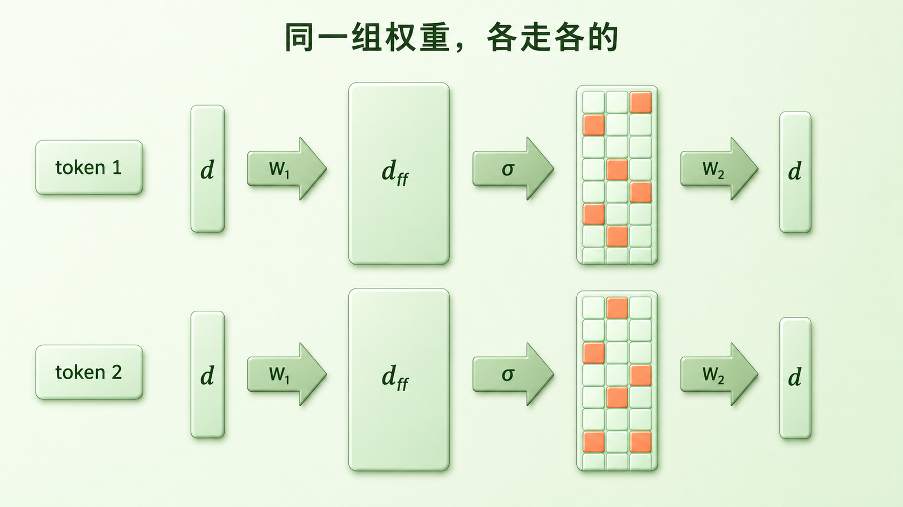
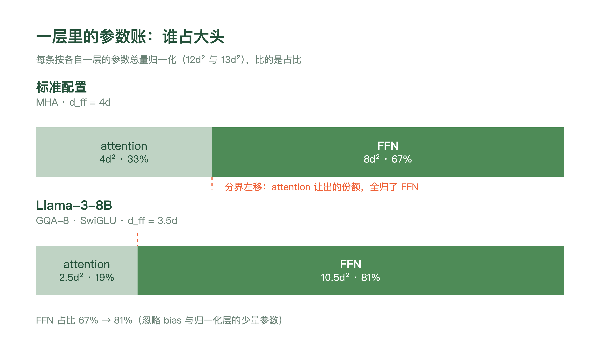
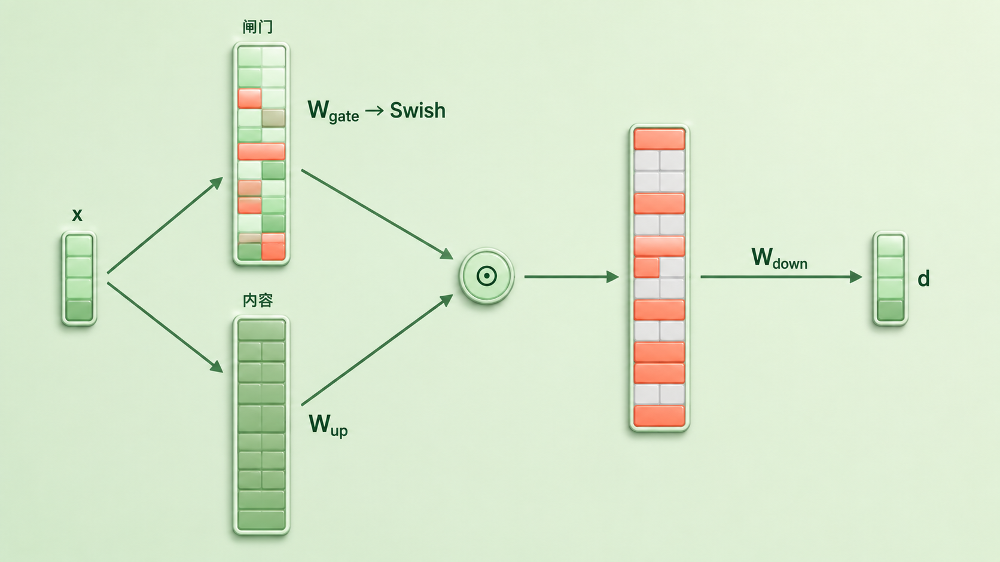
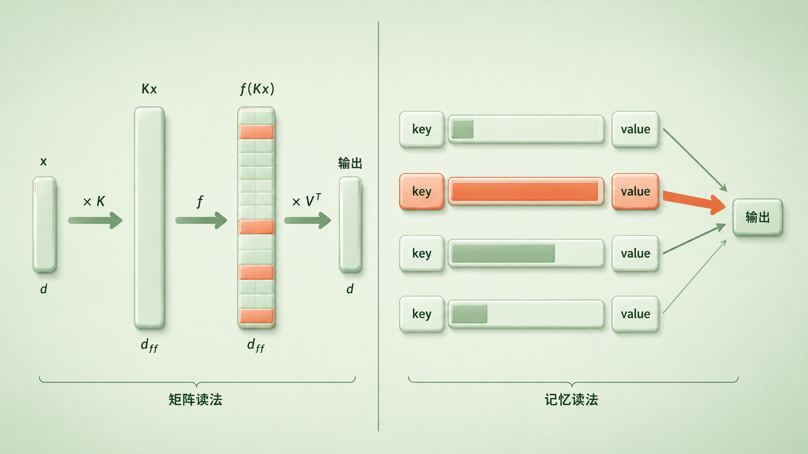
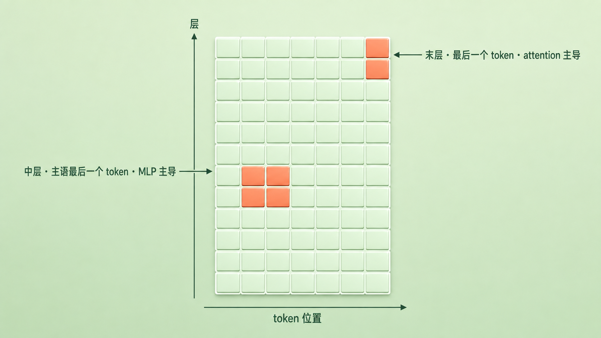

+++
title = "23 FFN/MLP 子层：容量来源与「事实记忆」的直觉"
description = "经典 Transformer block 里约三分之二的参数在 FFN：它撑起模型的参数容量，也深度参与事实的表示与回忆。"
date = 2026-08-30
tags = ["LLM", "FFN", "MLP", "SwiGLU", "知识编辑", "ROME", "可解释性"]
categories = ["LLM"]
series = ["主线"]
showTableOfContents = true
+++



> 经典 Transformer block 里约三分之二的参数在 FFN：它撑起模型的参数容量，也深度参与事实的表示与回忆。

> 前置知识提示：读这篇前，建议先了解一块 block 的两个子层怎么分工（#17）、attention 那四个投影的参数账（#20、#21），以及 decode 每一步都要把整套权重读一遍（#22）。

你问模型：珠穆朗玛峰有多高。

它答：8848 米左右。

这个数字不在你的问题里。它没有联网，没有查任何数据库，你给它的那几个字里也不含答案。那 8848 只可能来自一个地方——它自己那几十 GB 的权重。可权重就是一堆浮点数，一个数字怎么会「存」在一堆浮点数里？

上一篇结尾我们刚数过一笔相关的账。decode 每生成一个 token，都要把整套权重从显存里完整读一遍；而这套权重的大头，不在我们花了三篇去拆的 attention。一个标准 block 里，attention 四个投影合计 \(4d^2\) 个参数，FFN 那两个矩阵是 \(8d^2\)——三分之二的权重，坐在一个从第三章开篇起就只用一句「逐位置加工」带过的子层里。

这一篇就把它拆开。四个问题：它到底在算什么、中间那一层撑宽买到了什么、那几万个维度在存什么、以及「知识存在 FFN 里」这句流传很广的话，该信到什么程度。

## 一、拆开这个子层：升维、挑选、压回

先看它长什么样。#17 里我们说 FFN 是「一个小小的前馈网络」，现在把这句话展开。

> 想象把一团缠在一起的线先摊到一张大桌子上，摊开之后每根线各归各位、互不压着；这时候才好一根一根挑出要用的；挑完，再把选中的那些重新捻成一股，粗细跟原来一样。

FFN 干的就是这三步。它接过残差流上某个位置的向量 \(x \in \mathbb{R}^d\)，先用一个矩阵把它抬到一个更宽的空间，过一次非线性，再用另一个矩阵压回原来的宽度：

$$
\text{FFN}(x) = W_2\,\sigma(W_1 x + b_1) + b_2
$$

其中 \(W_1 \in \mathbb{R}^{d_{\text{ff}} \times d}\) 负责升维、\(W_2 \in \mathbb{R}^{d \times d_{\text{ff}}}\) 负责压回，\(\sigma\) 是非线性函数。原始 Transformer 里 \(d = 512\)、\(d_{\text{ff}} = 2048\)，正好四倍；\(\sigma\) 取 ReLU。算完的结果按 Pre-Norm 的写法加回残差流：\(y = h + \text{FFN}(\text{Norm}(h))\)。

这里有一个性质要专门拎出来，因为它解释了很多后面的事：**FFN 是逐位置的**。同一组 \(W_1\)、\(W_2\) 在每个 token 上独立走一遍：算第 3 个位置时，FFN 不会去读第 5 个位置，它只加工第 3 个位置手上那份已经汇聚好的表示。一段 100 个 token 的序列过 FFN，等价于同一个小网络被调用了 100 次，这 100 次调用之间不交换任何信息。

#19 那句「一个 block 里需要设闸的地方只有 attention 这一处」，根子就在这儿——FFN 不读别的位置，只加工当前位置手上那份表示；而那份表示里能有什么，早已被前面的因果注意力把过关了，所以它没有泄漏未来的机会。

*图：残差流上一个位置的向量 x（宽度 d）进入 FFN——先被 W₁ 抬到更宽的 d_ff 维、过一次非线性、再被 W₂ 压回 d 维，输出加回残差流。这里画的是经典两矩阵结构；具体模型的 d_ff 取值与 SwiGLU 的三矩阵变体，留给后面两张图。旁边的第二个 token 走的是同一组权重、同一条路，但两条路之间没有任何连线：FFN 逐位置独立处理*

现在回到参数账。忽略 bias，attention 那边是 \(W_Q\)、\(W_K\)、\(W_V\)、\(W_O\) 四个 \(d \times d\) 矩阵，合计 \(4d^2\)；FFN 这边两个矩阵各 \(d \times d_{\text{ff}}\)，在 \(d_{\text{ff}} = 4d\) 的配置下是 \(8d^2\)。一层 \(12d^2\)，FFN 占掉整整三分之二——这正是 Geva 等人 2021 年那篇论文摘要的第一句话：feed-forward layers 占了 transformer 参数的三分之二，可它们的角色一直没被好好研究过。

要留意的是，\(8d^2\) 是**那一种配置**的账，不是恒等式。\(d_{\text{ff}} = 4d\) 是原始论文的选择，后来的模型并不都照抄。Llama-3-8B 是 \(d = 4096\)、\(d_{\text{ff}} = 14336\)（三点五倍），而且用的是三个矩阵的 SwiGLU（下一节讲），一层 FFN 是 \(10.5d^2\)；attention 那边它用 GQA，32 个 query 头配 8 个 KV 头，\(W_K\) 和 \(W_V\) 各窄了四倍，四个投影缩到 \(2.5d^2\)。两边一比，FFN 占到约 81%。

*图：一层里的参数怎么分。上条是标准配置（MHA + d_ff = 4d）：attention 4d²、FFN 8d²，FFN 恰好三分之二。下条是 Llama-3-8B（GQA-8 + SwiGLU + d_ff = 3.5d）：attention 缩到 2.5d²、FFN 涨到 10.5d²，占比升到约 81%。两条各按自己那一层的参数总量归一化（12d² 与 13d²），比的是占比不是绝对量*

#20 里算过另一笔账，落点是同一个地方：在几千 token 的上下文里，一层的算力大头也不是 attention 那两个带 \(N^2\) 的矩阵乘，而是 FFN；要等上下文长到**几万 token**，二次项才追上来。这个交点对怎么记账相当敏感：仍拿上面那份 Llama-3-8B 的账（attention 2.5d²、FFN 10.5d²），\(N^2\) 那两个矩阵乘按完整矩阵计，交点在 \(N = 6.5d\)、约 2.7 万 token；若按因果掩码只算下三角，就要翻倍到约 5.3 万。投影按 MHA 还是按 GQA 计，也会把这个数再挪一截。参数和算力两笔账各算各的，指向的却是同一个部件。

顺带说清一件容易混的事：GQA 省的是投影参数与 KV cache。算 attention 分数之前，那 8 个 KV 头仍要配齐 32 个 query 头（#21 讲过，逻辑上等价于广播），所以 \(N^2\) 那两笔乘加一次都没少——它缩的是参数与访存，不是二次项。

这里还有个略带讽刺的连锁反应：#21 讲 MQA/GQA 时，我们说它「真的会减少 attention 的参数」。参数是省下来了，可一层的总量没怎么变——省出来的份额，等于把 FFN 的占比又往上顶了一截。attention 越瘦，FFN 越显得一家独大。

小结一句：FFN 是「升维—挑选—压回」的三段式，逐位置独立执行；它拿走了一层里三分之二的参数，在现代配置下还要更多。

## 二、非线性与宽度：两件不同的事

上一节留了个问题没答：为什么要先升到几倍宽再压回来？

这个问题里其实塞了两个，得拆开问，因为它们的答案性质完全不同：**为什么中间必须有非线性**（数学上的必要条件），和**把中间撑宽买到了什么**（工程上的预算选择）。

先说前一个。

如果把非线性拿掉，\(W_2 W_1 x\) 里的两个矩阵可以先乘起来——\(W_2 W_1\) 仍然是一个 \(d \times d\) 的矩阵。也就是说，没有非线性的两层和一层完全等价，中间撑得再宽都会在数学上塌回去。这一条是硬的：**要让两层真的是两层，中间必须卡一道非线性。**

但这一条只管「有没有非线性」，它管不了「宽不宽」。哪怕取 \(d_{\text{ff}} = d\)，只要中间那道 \(\sigma\) 还在，网络照样不会塌成线性映射。所以 \(4d\)、\(3.5d\) 这些数字都不是数学要求，而是**在参数量、算力、显存的预算之下挑出来的架构选择**。

那么撑宽买到的是什么？

> 想象一个只有三个抽屉的柜子，你要放几万种小零件。硬塞当然塞得下，但每个抽屉里会混着好几十种东西，你伸手一摸，摸出来的永远是一把混合物。换成几万个格子，才有可能一种零件占一个格子。

买到的是**表示容量**：一次能同时算多少个特征检测器。\(W_1\) 的每一行和输入做一次点积，得到中间层的一个分量；有 \(d_{\text{ff}}\) 行，这一层就同时算了 \(d_{\text{ff}}\) 个「像不像某种东西」的判断，非线性再把这些判断变成有 / 没有的取舍——ReLU 直接把负的清零，只留下被触发的那些。中间层越宽，一层里能并排放的检测器越多。

要补一句限定：这些检测器只是**各自计算**，并不保证彼此线性无关，更不保证统计独立。训练出来的 \(W_1\) 各行完全可以高度相关、也可以几个方向合起来才编码一件事。

还有一点容易读歪：升维**不会让信息变多**。乘一个矩阵不能凭空创造信息，\(x\) 里没有的东西，\(W_1 x\) 里也不会有。它做的是把原本挤在 \(d\) 维里、彼此叠在一起的特征摊到一个更宽的空间去，让它们能被逐个筛选——是「摊开好挑」，不是「变多了」。至于 \(d\) 维里到底能挤下多少个特征、挤在一起会怎样，那是可解释性那条线的正题，这里不展开。

再说非线性本身。这些年它换过几轮：

- **ReLU**（原始 Transformer）：负的归零，正的原样通过。干脆，但在零点不可导；而且如果某个单元长期落在负半区，它的梯度会持续为零，就可能变成难以重新激活的 dead neuron（前层参数变了、它收到的输入变了，仍有机会活过来，只是不容易）。
- **GELU**（Hendrycks & Gimpel, 2016）：把硬开关换成平滑的。BERT、GPT-2、GPT-3 都用它。
- **门控家族**（GLU 变体，Shazeer, 2020）：不再是「一个矩阵升维、过一道非线性」，而是升两份——一份过非线性当**闸门**，一份原样当**内容**，两份逐元素相乘。「闸门」只是个方便的叫法：Swish（也叫 SiLU）并不落在 0 到 1 之间，它可以大于 1、也可以略微为负，所以它既能压掉内容，也能放大或翻转内容。用 Swish 当那道闸门的就是 SwiGLU：

$$
\text{FFN}_{\text{SwiGLU}}(x) = W_{\text{down}}\big(\text{Swish}(W_{\text{gate}}\,x) \odot W_{\text{up}}\,x\big)
$$

门控版本用了三个矩阵而不是两个。同样的 \(d_{\text{ff}}\)，参数量会平白多出一半——所以 Shazeer 在论文里把 \(d_{\text{ff}}\) 收到原来的三分之二，好让对照公平。他的 T5-base 基线是 \(d_{\text{model}} = 768\)、\(d_{\text{ff}} = 3072\)，GLU 变体一律降到 2048，原文写得很直白：所有模型在参数量和计算量上都是对齐的。

LLaMA 1/2 的一些档位可以照这条线直观理解：7B 的 \(d_{\text{ff}} = 11008\) 差不多是 \(\tfrac{2}{3} \times 4d = 10922.7\) 往上做硬件友好的对齐，13B 的 13824 同理。但这不是一条家族统一规则——Llama 2 的 70B 就已经是 \(d = 8192\)、\(d_{\text{ff}} = 28672\)，正好 \(3.5d\)；Llama 3 的 8B、70B 延续了这类更宽的 FFN 配置。换句话说，\(\tfrac{2}{3}\) 是门控变体为对齐参数量给出的一个起点，不是各家一直守着的比例。

*图：SwiGLU 把「一个矩阵升维」换成两路并行升维——上路经 W_gate 与 Swish 得到一组门控系数（Swish 不是 0–1 的开关，可以大于 1、也可以略为负），下路经 W_up 保持原样作为内容，两路逐元素相乘，系数接近零的位置内容被压掉，再由 W_down 压回 d 维。三个矩阵而不是两个，所以 d_ff 要收到 2/3 才能对齐参数量*

门控版本好在哪？在 Shazeer 那张表上：去噪预训练任务的 heldout log-perplexity，ReLU 基线在 65,536 步时是 1.997，SwiGLU 是 1.944；训到 524,288 步，1.677 对 1.636。这是**小而稳的改进**，大约 0.04 nats——不是量级上的跃迁；而且同一张表里 GEGLU（1.942 / 1.633）还略微好过 SwiGLU。SwiGLU 后来成为主流默认，这张表解释不了全部。

论文自己对「为什么有效」的交代，是那句被引用了无数次的话：

> We offer no explanation as to why these architectures seem to work; we attribute their success, as all else, to divine benevolence.

> （我们对这些结构为何有效不作解释；一如既往，我们把它们的成功归于神的恩典。）

这是作者的自嘲，不是说这个方向没人研究过。但它确实点出了一件真事：架构上很多被广泛采用的选择，是先被测出来好用、再慢慢补解释的。

小结一句：非线性是「两层不塌成一层」的必要条件，宽度是在预算下买表示容量——两件事各管一头；门控变体是这条线上一次小而稳的改良，代价是多一个矩阵、于是 \(d_{\text{ff}}\) 要相应收窄。

## 三、那几万个方向在存什么

到这里，结构讲完了，但最开始那个问题还悬着：8848 到底存在哪里？

> 像一本厚得离谱的规则手册。每一条规则长这样：「如果前面这段话符合某某特征，就往结论上推一把某某方向」。输入进来，几万条规则各自打个分，分高的那些按分数把自己那一推叠加起来，合成一个改动量交回主干。

这个直觉在 Geva 等人 2021 年那篇论文里有一个精确的对应写法：把 FFN 的两个矩阵分别改叫 \(K\) 和 \(V\)。

$$
\text{FF}(x) = V^{\top} f(K x)
$$

（论文里用行向量写成 \(f(xK^{\top})V\)，这里换成与本文一致的列向量写法，是同一件事。）

形式上它和第一节的 \(W_2 \sigma(W_1 x)\) 也是同一个东西，但换个名字，含义就浮出来了：

- \(K\) 的**每一行**是一个 **key**。它和输入做点积，点积大就说明「输入长得像我关心的那种东西」——它是一个模式检测器。
- \(V\) 的**每一行**是一个 **value**。它是一个具体的向量，一旦被选中就要被写回残差流。
- 中间那层激活值是**系数**：某个 key 被触发得越强，它对应的 value 在最终输出里占的份额就越大。

于是 FFN 的输出，是所有 value 的一次加权和，权重由「输入命中了哪些 key」决定——上面那本规则手册，就是这么落到矩阵上的。

这里要划两条边界，否则很容易把这个读法用过头。

**第一条，它严格对应的是经典的两矩阵 FFN，不是 SwiGLU。** 上一节刚讲完门控变体，而门控把这个一一对应打散了：SwiGLU 里第 \(i\) 个中间分量是 \(\text{Swish}(g_i^{\top} x) \cdot (u_i^{\top} x)\)，由**两个**向量共同决定，不再是「单个 key 做一次点积、过一道 \(f\)」。作为「检测模式 → 写回方向」的直觉，它照样管用；作为代数分解，它和 Geva 那个式子不是同一件事。

**第二条，一个中间维度不等于一条原子事实。** 下面的实验说的是「这个 key 被哪些前缀触发」，不是「这个神经元存着哪条知识」。一条信息可以摊在好几个方向上，一个方向也可以同时参与好几件事——这就是文末推荐那篇 superposition 想讲的问题，本篇不展开。

论文标题里其实还有一个限定词值得保留：它说的是 key-value **memories**，正文里写明这是**未归一化的（unnormalized）**——真实的 FFN 用 ReLU 而不是 softmax，那些系数不构成一个概率分布，不能读成「输入以多大概率命中了这条规则」。它是加权和，不是期望。

*图：同一个 FFN 的两种读法。左边是矩阵读法：x 先被 K 乘、过非线性 f、再被 V 转置乘回 d 维。右边是记忆读法：K 的每一行是一个 key（检测「输入像不像某种模式」），激活值是它被触发的强度，V 的对应行是一个 value（一个要写回残差流的方向）；输出是所有 value 按触发强度的加权和*

这个读法不只是个比喻，论文是拿实验去验的，而实验的规模需要连着结论一起记住。他们用的是一个 16 层、\(d = 1024\)、\(d_{\text{ff}} = 4096\)、在 WikiText-103 上训练的语言模型，全模型共 65,536 个 key，从中每层随机抽 10 个、总共 160 个交给 NLP 专业背景的标注者，让他们看这个 key 被触发得最强的 25 条前缀、说说这些前缀有没有共同点。

结果有两条：

第一，**这些 key 确实对应人能看懂的模式**。160 个 key，每一个都至少被认出一种模式，平均 3.6 种；被检出的前缀里有 65% 到 80% 能挂上至少一种模式。第二，**模式的抽象程度随层数上升**。低层（1–9 层）以表层模式为主，比如一堆前缀恰好都以同一个词结尾；高层（10–16 层）转向语义模式，前缀们表面看毫无相似之处，但说的是同一类事。

那 value 那一半呢？如果 key 负责「认出模式」，value 是不是就负责「给出这个模式后面该接什么词」？

论文测了这件事，答案要小心地说。他们把每个 value 投影到词表上取 top-1，再和这个 key 最强触发样本的下一个真实词比对，看两者是否一致。一致率在低层（1–10 层）几乎为零，从第 11 层开始爬升，最高到约 **3.5%**。

3.5% 怎么读？和随机比，它高得离谱——随机取一个词撞上的概率是 0.0004%，差了近四个数量级，所以「上层的 value 带有非平凡的下一词倾向」这个结论是稳的。但它绝对值仍然只有 3.5%，**不能读成「每个 value 就是它那条模式的下一词预测」**。绝大多数 value 并不指向某个具体的词。

还有一件事，比上面两条都更能纠正直觉：一层里同时被激活的不是一两个 memory，而是**数百个**。它们的 value 叠在一起，合成的分布和其中任何一个单独的 value 都不一样；而层与层之间的残差连接更像一个不断微调的机制——每层往主干上加一点，最终那个分布是自底向上一路修出来的，不是某一层一锤定音。

小结一句：FFN 可以读成一张巨大的「模式 → 写回方向」对照表，低层认表面、高层认语义；但每次触发的是几百条而不是一条，多数条目并不直接对应某个词，而且这张对照表严格成立的对象是经典两矩阵 FFN。

## 四、「知识存在 FFN 里」该信到什么程度

上一节的读法很有说服力，于是就有了那句流传很广的话：知识存在 FFN 里。

这句话之所以难判断真假，是因为它把四件不同的事压成了一句。想说清楚，得先把它们分开：

- **存储**：这条事实的信息，是不是主要以参数的形式落在 FFN 里？
- **因果中介**：模型答对这道题的过程中，FFN 是不是关键的一环？
- **表达**：从「参数里有」到「这次回答里说出来」，是谁在选、谁在调？
- **可编辑性**：想改掉这条事实，动 FFN 的权重是不是有效的抓手？

底下三篇工作各管一段：ROME 给出了「因果中介」与「可编辑性」的证据；Hase 等人把「定位到哪一层」和「该编辑哪一层」拆开；Chen 等人再往前一步，挑战了「同一条事实有固定定位」这个前提。

支持「知识在 FFN」的最有力证据来自 ROME（Meng 等，2022）。他们的做法是因果追踪（causal tracing）：先让模型正常回答「The Space Needle is located in the city of」并答出 Seattle，再把输入加噪破坏掉，然后一个一个地把某个位置、某一层的隐状态**恢复**成干净版本，看哪一处能把正确答案救回来。谁能救回来，谁就在这条因果链上说了算。

结果画出来是两个亮区。一个在**最后几层、最后一个 token** 上——这不奇怪，答案马上就要输出了。真正的新发现是另一个：在**中间层、主语的最后一个 token** 上，而且这个位置的贡献主要由 MLP 撑起来（把 MLP 与 attention 拆开算，早站点的 MLP 峰值 AIE 6.6%，而 attention 在主语末 token 只有 1.6%；attention 反过来在最后一个 token 上更重要）。

这里有三个数字容易被并成一个，得分清：单个隐状态的因果效应峰值出现在**第 15 层**（AIE 8.7%，整体 ATE 18.6%）；把 MLP 单独拆出来、按十层为一窗去测，效应最强的窗口中心在**第 17 层**附近；而 ROME 真正做编辑时，逐层扫下来编辑效果的泛化性在**第 18 层**达到峰值。也就是说，即便在 ROME 自己的论文里，「因果追踪指着第 15 层」和「该改第几层」也不是同一个答案——他们选的是中层 MLP 的那个投影矩阵做一次秩一修改（Rank-One Model Editing），不是「测出 15 就改 15」。改完之后，模型改口说 Space Needle 在巴黎，而且不只是这一句，换个问法它也跟着改。

*图：因果追踪画出的两个亮区。横轴是 token 位置（左起：主语的几个 token、中间的连接词、最后一个 token），纵轴是层数（自下而上）。一个亮区落在中间层与主语最后一个 token 的交叉处，由 MLP 主导；另一个落在最上面几层与最后一个 token 的交叉处，由 attention 主导*

即使这样，「定位到哪层就该改哪层」的直觉还是很顽固。2023 年 Hase 等人把它正面推翻了：他们发现因果追踪指出的位置**对「该编辑哪一层」几乎没有指导作用**——在因果追踪并不看好的层上做编辑，一样能成功改掉事实；真正能预测编辑效果的是「你选了哪一层」这件事本身，而不是定位结果。论文的结论说得相当克制也相当扎心：对模型内部机制更好的理解，不一定能转化成「怎么改它」的方法。

再往后一步，连「定位」本身的稳定性都被追问了。Chen 等人（ICLR 2025）指出，知识定位这个假设隐含着「同一条事实、换个问法，定位到的还是那几个神经元」；他们检查发现这只对一部分事实成立，另一部分事实换个措辞就定位到别处去了。同一篇工作还把 attention 放回画面里：从「参数里有这条知识」到「这次回答里把它说出来」，中间有一步选择，而那一步 attention 是参与的。

把这些放回开头那四件事，能给出的判断是这样：

**中层 FFN 是事实回忆过程中的重要因果参与者，也是目前有效的知识编辑参数空间之一。** 这两条有实验支持。但由此推出「事实主要、或唯一地存储在 FFN 里，找到那几个神经元就能改」，证据是不够的——「能在这里编辑」推不出「只存在这里」，「这次定位到这里」也推不出「换个问法还在这里」。

再补两条边界：

其一，ROME 自己那张图上，attention 在晚站点同样重要；Chen 等人的工作又把 attention 放进了「知识怎么被选出来」这一环；再往后，Liu 等人（ACML 2025）在更新的模型上重做定位实验，发现 attention 模块在事实知识的存取里也占相当份量，据此主张编辑时 MLP 与 attention 一起动。信息不是只躺在 FFN 里。

其二，FFN 是逐位置的——第一节反复强调过。它**本身**不在不同 token 之间搬运信息，跨位置的信息混合必须由 attention 这类 token-mixing 模块完成。但要说清楚的是：一旦别处的信息已经被 attention 汇聚进当前位置的表示里，FFN 照样会继续识别、变换、放大这些跨位置得来的特征。这里有两个尺度别混：在一块 block 内部，attention 在前、FFN 在后，所以 FFN 加工的本来就是这一层 attention 刚混进来的东西；而在 ROME 描述的那条完整回忆链路上，顺序恰好反过来——中层 MLP 先在主语位置把属性召回出来，高层 attention 再把汇总好的信息复制到最后一个 token 上去。所以准确的说法是「FFN 不做 token mixing」，不是「跨位置的事 FFN 一概帮不上忙」。

「attention 负责路由、FFN 负责存储」是一个很好用的分工，能解释很多现象，#17 里「看一看 / 想一想」的对照也是同一个意思。但它是**近似**，不是定义。真到了要下判断的时候，这条分工两头都会漏。

小结一句：FFN 在事实回忆里是关键的因果一环、也是好用的编辑抓手，这两点有证据；把它进一步说成「事实的存放地址」，越过了证据能支撑的范围。

## 收尾

读完这一篇，那个「逐位置加工」的一句话带过，应该被撑成了一个有形状的东西。

FFN 是一次升维、挑选、压回：\(W_1\) 把每个 token 的向量摊到更宽的空间，非线性挑出被触发的那些方向，\(W_2\) 把它们捻回原来的宽度、加回残差流。非线性保证两层不塌成一层，宽度买的是一层里能并排放多少个特征检测器。它逐位置独立执行，所以不需要因果掩码，也不做 token 之间的搬运——但别人搬过来的东西，它照样加工。它拿走一层里三分之二的参数，在 GQA + SwiGLU 的现代配置下能到 81%——decode 每一步搬运的那套权重，大头就是它。

换个读法，那几万个中间维度可以看成一张巨大的对照表：每一条是「认出某种模式 → 往残差流上推某个方向」，低层认表面、高层认语义，每次触发几百条、叠加成一个改动量。开头那个 8848，是以分布式的方式编码在参数与表示里的。沿着 FFN 这条 key-value 视角，可以把其中一部分机制理解成许多「模式 → 写回方向」共同作用的结果；但现有证据不足以把它定位成 FFN 里的某一组固定条目。中层 FFN 在事实回忆中的因果作用有实验支持，可从「能在这里改」到「就存在这里」，中间那一步至今没有走通。

最后留一个口子。既然一次前向真正被用上的只是这张大表里的一小部分——在 ReLU 模型上这个「一小部分」少得惊人，T5-Base 平均只有 3.0% 的中间维非零，而且模型越大越稀疏（这个数字测的是 ReLU 后的非零激活；GELU、SwiGLU 不像 ReLU 那样在整个负半轴形成大面积、结构性的精确零，它们的「稀疏」是大量激活数值很小，所以不能直接换算成「现代 LLM 每次只激活 3% 的神经元」）——那为什么每生成一个 token，都要把整张表原封不动地搬进计算单元过一遍？

这里要先拦一句，免得把两件事想成一件：**激活稀疏不等于可以少算**。dense 的 FFN 想知道哪些中间维会被激活，得先把 \(W_1 x\) 整个算出来——稀疏是算完之后才看见的结果，省不到算力头上。MoE 换的是另一条路：在算任何一个专家之前，先用一个极便宜的路由器挑出少数几个，剩下的根本不参与计算。稀疏从「事后观察到的现象」变成「事前做出的决定」，省下来的正是这一步。

这样一来，参数量和计算量就不必再绑在一起涨了。下一篇 #24，我们讲 MoE：把一个大 FFN 拆成许多个小 FFN，再派一个路由器决定每个 token 该走哪几个。

## 参考资料 / 推荐阅读

- Vaswani et al., 2017. *Attention Is All You Need.* arXiv:1706.03762（FFN 的原始定义与 \(d_{\text{ff}} = 4d\) 的选择；base 模型 \(d = 512\)、\(d_{\text{ff}} = 2048\)）
- Geva et al., 2021. *Transformer Feed-Forward Layers Are Key-Value Memories.* EMNLP 2021, arXiv:2012.14913（key-value memory 视角；模式标注实验、层间抽象度差异、value 的下一词一致率，以及「一层同时激活数百个 memory」）
- Shazeer, 2020. *GLU Variants Improve Transformer.* arXiv:2002.05202（SwiGLU/GEGLU 等门控变体；为对齐参数量把 \(d_{\text{ff}}\) 收到 2/3 的做法与全部对照数据）
- Hendrycks & Gimpel, 2016. *Gaussian Error Linear Units (GELUs).* arXiv:1606.08415（GELU 的提出）
- Meng et al., 2022. *Locating and Editing Factual Associations in GPT.* NeurIPS 2022, arXiv:2202.05262（ROME；因果追踪、MLP 与 attention 的效应分解、中层 MLP 的秩一编辑，以及第 15 / 17 / 18 层三个不同口径）
- Hase et al., 2023. *Does Localization Inform Editing? Surprising Differences in Causality-Based Localization vs. Knowledge Editing in Language Models.* NeurIPS 2023, arXiv:2301.04213（定位结论不指导编辑位置的反证）
- Chen et al., 2025. *Knowledge Localization: Mission Not Accomplished? Enter Query Localization!* ICLR 2025, arXiv:2405.14117（同一事实的定位可能随问法改变；attention 参与知识的选择与表达）
- Li et al., 2022. *The Lazy Neuron Phenomenon: On Emergence of Activation Sparsity in Transformers.* ICLR 2023, arXiv:2210.06313（激活稀疏：T5-Base 平均 3.0% 的中间维非零，模型越大越稀疏）
- Liu et al., 2025. *Balancing Knowledge Updates: Toward Unified Modular Editing in LLMs.* ACML 2025, PMLR v304（在更新的模型上重做知识定位，发现 attention 模块在事实知识的存取中同样占相当份量，主张 MLP 与 attention 一起编辑）
- Shazeer et al., 2017. *Outrageously Large Neural Networks: The Sparsely-Gated Mixture-of-Experts Layer.* arXiv:1701.06538（MoE 的 router 在计算专家之前就做选择——「事前的条件计算」，区别于 FFN「事后观察到的激活稀疏」，留 #24）
- Elhage et al., 2022. *Toy Models of Superposition.* Transformer Circuits Thread（若想追问「一个中间维度到底对应什么」，从这篇入手；本篇刻意没有展开）
