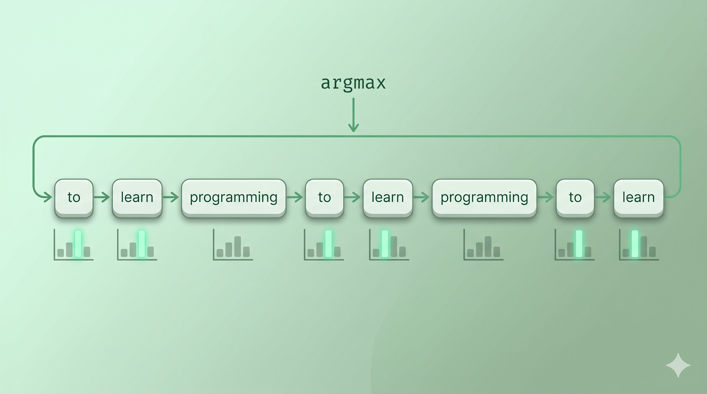
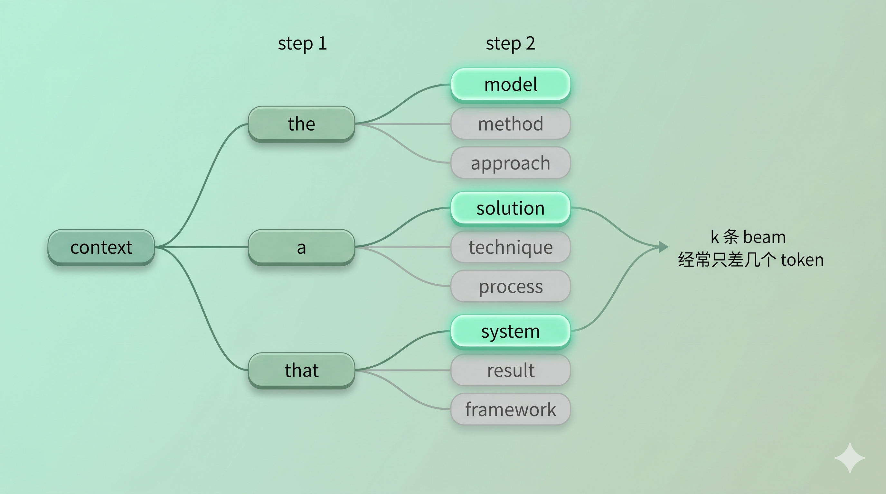
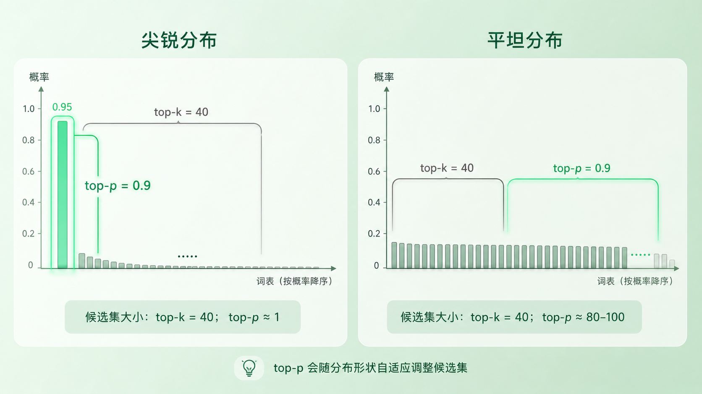

+++
title = "采样策略拆解：Greedy / Beam / Top-k / Top-p"
description = "同一份分布，交给四种 decoding 策略，得到四种风格、四种代价、四种适用场景。"
date = 2026-05-10
tags = ["LLM", "Decoding", "采样", "Top-p", "Beam Search"]
categories = ["LLM"]
series = ["主线"]
showTableOfContents = true
+++





> 前置知识提示：读这篇前，建议了解 next-token 分布、argmax、autoregressive loop（见第 1、4、5 篇）。

> 同一份分布，交给四种 decoding 策略，得到四种风格、四种代价、四种适用场景。

---

上一篇我们把生成过程拆成了一条清晰的链路：模型给出分布 → policy 挑出 token → 拼回上下文 → 再来一轮。我们也说过，整段循环里真正在「做选择」的，只有 policy 这一步。但 policy 到底有几种长法？

打开任何一个开源推理框架的 `generate` 函数，你会看到一组重复出现的参数：`do_sample`、`num_beams`、`top_k`、`top_p`、`temperature`、`repetition_penalty`。这一篇我们把前四个放到一张表上对照着拆——它们各自在分布上动了什么手脚，各自会在哪种场景下翻车，以及为什么开放生成的工业默认几乎都是 top-p。`temperature` 和 `repetition_penalty` 留给下一篇。

### 一、Greedy：永远挑最高，永远会重复

最朴素的策略。每一步把分布交过来，policy 直接挑概率最高的那个 token：

$$
x_t = \arg\max_{v \in V} P(v \mid x_{\lt t})
$$

代码上就是一行 `torch.argmax(logits, dim=-1)`。听起来非常合理——「我每一步都做局部最优，整段不就是最优了吗？」

但实际跑下来很快就会撞墙。问 GPT-2 一个开放问题，让它用纯 greedy 续写，输出大概是这样：

```
The best way to learn programming is to learn programming
to learn programming to learn programming to learn programming…
```

这不是 GPT-2 训练有问题，**这是 greedy 本身的结构性失败**：一旦某个短语在当前语境下概率最高，下一步它的延续大概率也是这个短语的延续——分布陷入自我强化的循环出不来。开放式生成场景几乎不会用纯 greedy。

那 greedy 还有用武之地吗？有。所有需要**确定性输出**的场景：

- **结构化抽取 / JSON 生成**：你要的是同一个 prompt 永远返回同一个解析结果，不能让 sampling 偶尔抽出一个把括号闭错的 token
- **分类任务**：让模型从 `[正面, 负面, 中性]` 里选一个，分布最高的那个就是答案
- **测试回归**：CI 里跑 prompt，今天和昨天的输出必须一致

> Greedy 不是「最弱」的策略，而是「最确定」的策略。用错场景会重复套话，用对场景是免费的可复现性。


*图：greedy 在开放续写中陷入自我重复——每一步都是局部最优，整段却走不出去。*

### 二、Beam search：搜索视角的延伸，为什么开放生成淘汰了它

Greedy 的问题在哪？它每一步只看一个候选——选错了就回不来。一个自然的修补思路是：**每一步保留多条候选路径，最后选整体概率最高的那条。**

这就是 beam search。设 beam width = k：

1. 从初始上下文出发，每一步对当前每条 beam 各自取概率最高的 k 个 token
2. 在所有展开里，按累计 log 概率挑出最高的 k 条留下
3. 一直推进，直到所有 beam 都触发 EOS

形式化一点，每条 beam 评分是序列累计 log 概率：

$$
\text{score}(x_{1:T}) = \sum_{t=1}^{T} \log P(x_t \mid x_{\lt t})
$$

但这个朴素累加有一个直接的副作用——**序列越长，累计分数越负**（log 概率永远是负数），beam 因此倾向于早早结束。机器翻译、ASR、摘要、受约束生成这类任务在意 beam 的「最优解」属性，所以工业上沿用了一个经过工程修正的版本，最常被引用的是 Google NMT 那篇里的形式：

$$
\text{score}(Y \mid X) = \frac{\log P(Y \mid X)}{lp(Y)} + cp(X; Y), \quad lp(Y) = \left(\frac{5 + |Y|}{6}\right)^\alpha
$$

其中 \(lp(Y)\) 做长度归一化（\(\alpha\) 越大对长序列越宽容），\(cp(X; Y)\) 是 coverage penalty，对漏译这类问题做反向修正。这套补丁加上去，beam 在翻译、ASR、受约束生成这些**有标准答案**的任务里今天仍然是默认。

但 beam search 在开放生成（对话、创作、续写）里几乎不再被使用。两个原因。

**第一，多样性塌缩。** 你以为 k 条 beam 会探索 k 个不同方向，实际跑下来 k 条 beam 经常只差几个 token——它们共享了一个高概率主干，分叉发生在末梢。开放生成里这意味着「我同时尝试了 5 条路，结果全都说同一句模板话」。

**第二，搜索假设错位。** Beam 的设计前提是「存在一个最优解、值得多路搜索」。开放问题没有标准答案，搜索视角本身就和任务不匹配——你要的是从合理候选里抽一个有意思的，而不是从所有候选里找一个数学上最大概率的。

> Beam search 不是过时策略——它在翻译、ASR、受约束生成里仍然是默认。但开放对话和创作的需求和 beam 的设计假设是错配的，这条线的主流早已切到 sampling。



*图：beam width = 3 时，每一步保留累计概率最高的 3 条路径，但开放生成里它们经常共享主干，多样性塌缩。*

### 三、Top-k：第一个截断思路，但 k 是个魔法数

Greedy 太刚，beam 太执着。开放生成需要的是 sampling——按概率从分布里抽——但纯 sampling 又有另一个毛病：分布的长尾里有很多概率极低、但加起来不可忽略的 token。比如某一步分布是这样：

| token | 概率 |
| --- | --- |
| 「真」 | 0.42 |
| 「很」 | 0.18 |
| 「不」 | 0.10 |
| 「挺」 | 0.08 |
| 「特别」 | 0.05 |
| 长尾 5 万多个 | 合计 0.17 |

那 0.17 听起来不多，但摊到 5 万个 token 上，意味着「我有 17% 的概率从一堆几乎不可能的 token 里抽一个出来」。一旦抽中，整段后续就跟着歪。

Top-k 的思路最直接：**每步只在概率最高的 k 个 token 里采样，剩下的全扔掉。** 通常 k 取 40 或 50。

实现上分三步：

```python
top_k_logits, top_k_idx = torch.topk(logits, k=40)
probs = F.softmax(top_k_logits, dim=-1)   # 在 k 个里重新归一化
sampled_idx = torch.multinomial(probs, num_samples=1)
token = top_k_idx.gather(-1, sampled_idx)
```

注意第二步——**截断完要在剩下的 k 个上重新归一化**。从概率论上讲这是必要的：丢掉一部分 token 之后，剩下的概率之和不再是 1，不构成合法分布。具体到工程 API（比如 PyTorch 的 `torch.multinomial`）通常允许传入未归一化的非负权重并在内部处理，所以不显式归一化代码也能跑，但语义上等价于先归一化再抽。这一步在所有截断类策略里都是同一个动作。

Top-k 比纯 sampling 干净很多，但它有一个挥之不去的问题：**k 是固定的，分布形状却是变化的。** 想象两种极端：

- **分布很尖**（比如「the next word is `cat`」这种近乎确定的语境）：top 1 就有 0.95 概率，top 40 后面 39 个加起来才 0.05——但 top-k 还是会把它们留在候选里，等于强行制造多样性
- **分布很平**（比如开放问题，前 200 个候选都在合理区间）：top 40 把第 41 名以后全砍了，可能砍掉了真正想要的有趣选项

固定 k 没法同时适配这两种情况。这就引出了 top-p。

### 四、Top-p（Nucleus）：动态截断，今天的事实默认

Top-p 换了个角度。它不问「保留多少个候选」，而是问「保留多少累计概率」。

具体做法：**按概率从高到低排序，依次累加，直到累计概率达到 p（通常 0.9 或 0.95），然后从这个动态候选集（nucleus，「核」）里采样。**

形式化：把词表上的 token 按概率降序排成 \(v_{(1)}, v_{(2)}, \ldots\)，再取最小前缀，使累计概率不小于 \(p\)：

$$
V_p = \{v_{(1)}, \ldots, v_{(m)}\}, \quad m = \min \left\{ j : \sum_{i=1}^{j} P(v_{(i)} \mid x_{\lt t}) \geq p \right\}
$$

然后在这个集合上重新归一化、按概率采样。「先按概率排序、再取前缀」是定义里隐含但容易漏掉的一步——离开排序，「最小集合」在数学上是有歧义的。

关键性质：**候选集大小是自适应的。**

- 分布很尖时：top 1 的概率已经是 0.95，nucleus 里就 1 个 token——退化成 greedy
- 分布很平时：可能要前 200 个 token 才凑够 0.9 的累计概率，候选集自动变大

这正好对应了 LLM 实际工作的两种状态。模型在「下一个 token 几乎确定」的时刻（比如续写 "The capital of France is "）应该几乎不采样，避免抽错；在「下一个 token 真的是开放选择」的时刻（比如续写一首诗的第二行）应该放开候选范围。Top-p 用一个参数同时覆盖了这两端。

这是 Top-p 在 2020 年那篇 *The Curious Case of Neural Text Degeneration*（Holtzman et al.）之后迅速成为开放生成默认的核心原因——它不是「比 top-k 好一点」，而是「自适应分布形状」这个性质带来了质变。

但 Top-p 也不是完美的。它的失败模式更隐蔽：**当分布的高概率区有一个明显异常值时，nucleus 可能只包含这个异常值。** 比如某一步分布是 `[0.96, 0.01, 0.01, ...]`，p=0.95，那 nucleus 就只是那一个 0.96 的 token——不管它是不是合理。这种「单点塌缩」是 top-p 真正的边界情况，**单靠 top-k 是修不了的**——top-k 给候选集设的是上限不是下限，分布过尖时 top-k=50 与 top-p=0.95 串联，结果还是只剩一个 token。工程上要兜住这种情况，常见做法是再叠一个 `min_tokens_to_keep`（HuggingFace 在 logits processor 里直接提供）强制下限保留若干候选；走得更远一点，可以换用 min-p、typical sampling 这类对分布形状有不同假设的策略。

那 top-k 和 top-p 一起用的真实意义是什么？是另一个方向：**top-k 给候选集设上限**，防止分布特别平时 nucleus 一路扩到几百个；**top-p 在这个上限内做动态形状适配**。两者互补，但分工要分清——k 限最大、p 调形状，谁也替不了谁。

> Top-p 不是「比 top-k 多一个参数的版本」。它是把「候选集大小」从超参数变成分布的函数——这是一次思路升级，不是参数微调。



*图：分布尖时，top-p 自动收紧到 1-2 个候选；分布平时，top-p 自动放开到几十上百个；top-k 始终是同一个数。*

### 五、四种策略的对照表

把以上四种放在一起，能看清它们在做的事其实是同一件——**对分布做某种变形/截断，然后再决定怎么挑**：

| 策略 | 对分布做什么 | 怎么挑 | 失败模式 | 适用场景 |
| --- | --- | --- | --- | --- |
| Greedy | 不变 | argmax | 重复套话、自我循环 | 结构化输出、分类、回归 |
| Beam (k) | 多路并行展开 | 累计概率最高 | 多样性塌缩、长度偏置 | 翻译、ASR、摘要、受约束生成 |
| Top-k | 静态截断到 k 个 | 在 k 个里采样 | 分布形状不匹配（要么浪费要么砍多） | 简单 baseline，配 top-p 限上限 |
| Top-p | 动态截断到累计 p | 在 nucleus 里采样 | 高概率单点塌缩、长尾偶发翻车 | 开放生成的事实默认 |

这张表上有几个值得注意的点：

**第一，Greedy 和 Beam 是 deterministic 的；Top-k 和 Top-p 是 stochastic 的。** 这条线把策略劈成两半，回到上一篇的「确定性 vs 随机性」二分。Top-k / Top-p 都需要随机种子（seed）才能近似可复现——「近似」很重要：seed 只在同一份代码、同一硬件、同一后端版本下保证字节级一致，跨硬件、跨推理引擎、跨服务后端都不保证。

**第二，Top-k 与 Top-p 通常组合，但默认值因实现而异。** Hugging Face transformers 里常见默认是 `top_k=50, top_p=1.0`（top-p 默认不启用，靠 top-k 兜上限）；OpenAI API 不暴露 `top_k`，且文档建议优先调 `temperature` 或 `top_p` 之一，不建议同时调两者。具体值因平台和模型而异，但「k 限最大、p 调形状」的工程动机在多数实现里是一致的。

**第三，所有截断类策略的最后一步都是「在保留集上重新归一化、再采样」。** 概念上不归一化就不是合法分布，工程 API 通常会替你做这一步。这是写自定义 decoder 时最容易漏掉的一环——不是因为它难，而是因为它太隐蔽。

顺手把这一组参数的真实工程语义在心里对齐：`temperature` 改的是分布尖锐度（在 logits 上除一个数，下一篇展开），`top_k` / `top_p` 切的是候选集（一个静态、一个动态），`seed` 给随机采样提供近似可复现。它们各管一件事——分布平不平归 temperature，候选大不大归 top-k / top-p，可复现归 seed——调线上服务时不要混着想。

### 收尾

这一篇拆完，你应该能在脑子里把四种策略放进同一张表对照着看。下次再读到「我们用了 nucleus sampling，p=0.9」这种描述，你不只知道它在做什么，还知道它**为什么**这样做、它会在哪里翻车、它和 top-k 的关系是分工不是替代。

在这条线索上，我们其实回避了一个核心参数没讲——**温度（temperature）**。温度做的是更基础的事：它不截断分布，而是直接改变分布的尖锐度。同一个 nucleus 采样，温度调高一点输出就开放、调低一点就保守。下一篇我们把温度、重复惩罚（repetition penalty）、频率惩罚（frequency penalty）这一组「分布形状调节器」一次拆完，把生成「胡说八道」的来源也一并讲清楚。

### 参考资料

- Holtzman et al., *The Curious Case of Neural Text Degeneration*, ICLR 2020. [https://arxiv.org/abs/1904.09751](https://arxiv.org/abs/1904.09751) ——nucleus（top-p）采样原始论文，系统论证了为什么固定 k 不够、动态截断是必要的
- Fan et al., *Hierarchical Neural Story Generation*, ACL 2018. [https://arxiv.org/abs/1805.04833](https://arxiv.org/abs/1805.04833) ——top-k sampling 在文本生成中的早期系统应用
- Wu et al., *Google's Neural Machine Translation System*, 2016. [https://arxiv.org/abs/1609.08144](https://arxiv.org/abs/1609.08144) ——beam search 的 length normalization 与 coverage penalty 工程公式来源
- Hugging Face Transformers Docs, *Generation Strategies & Configuration*. [https://huggingface.co/docs/transformers/main/en/generation_strategies](https://huggingface.co/docs/transformers/main/en/generation_strategies) ——四种策略的实现接口、默认参数、`min_tokens_to_keep` 等工程细节
- OpenAI Platform Docs, *Text generation*. [https://platform.openai.com/docs/guides/text-generation](https://platform.openai.com/docs/guides/text-generation) ——`temperature`、`top_p`、`seed` 在线上 API 的语义与官方建议
