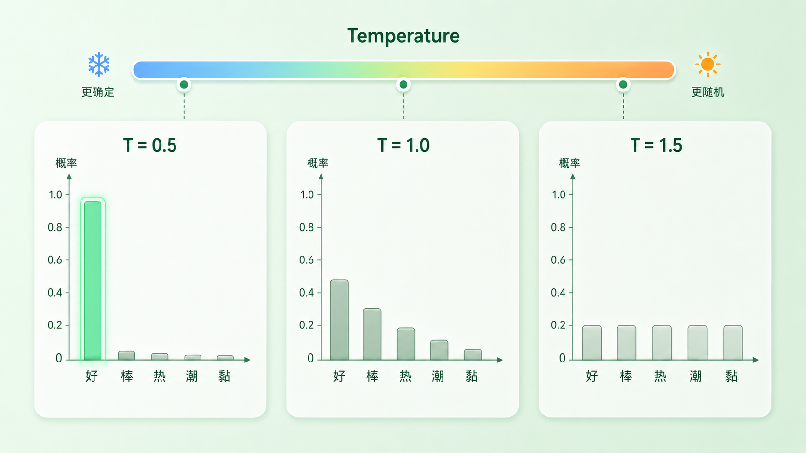
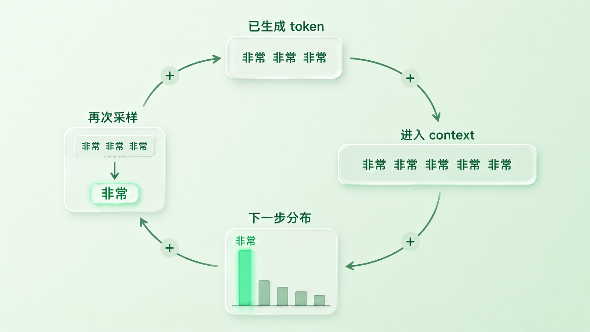
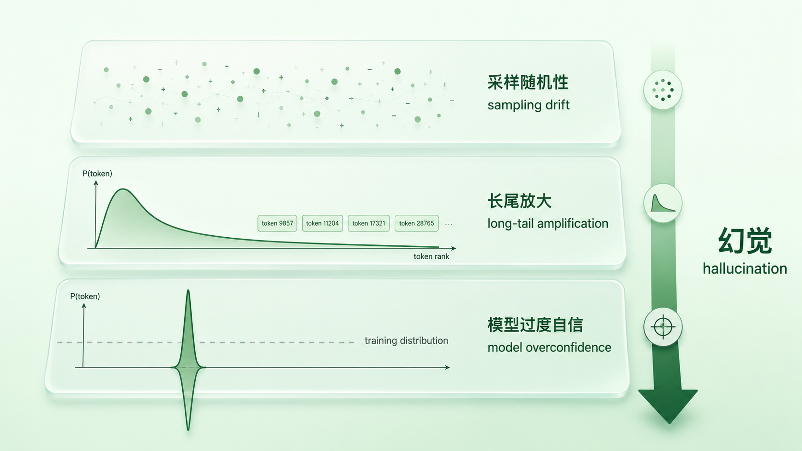

+++
title = "7 Temperature、重复惩罚与「胡说八道」的来源"
description = "Temperature 是给概率分布拨的「温度旋钮」；重复与「胡说八道」，是这个旋钮加上模型过度自信带来的副作用。"
date = 2026-05-17
tags = ["LLM", "Decoding", "Temperature", "重复惩罚", "Hallucination"]
categories = ["LLM"]
series = ["主线"]
showTableOfContents = true
+++



## 开头

同一段 prompt——比如让模型续写「今天天气很」——你把 temperature 设成 0.2，跑十次几乎都是「今天天气很好」；调到 1.5 再跑十次，会冒出「温柔」「黏稠」「像潮」这种乍看奇怪的词。

明明 prompt 没变、模型权重没变，怎么调一个数就翻天覆地？而且更让人困扰的两个现象——模型有时陷在 「很好很好很好」 的循环里出不来，有时又一本正经编出一个不存在的论文标题——它们和这个旋钮又是什么关系？

我们已经在第 4 篇拆过 logits 和 softmax，在第 5、6 篇梳过 decoding 框架和 Greedy / Beam / Top-k / Top-p。但温度、惩罚、「胡说八道」这三个最贴近实际使用的话题一直留到这篇——因为它们其实是同一个故事：**模型每一步都吐出一个分布，而我们对分布做的所有操作（包括什么都不做），最终决定了你看到的那个 token**。本篇把这三件事讲完，第一章「语言建模与采样」就收尾。

## 一、温度旋钮：在分布上「煮稀煮稠」

回到第 4 篇我们留下的那个事实：模型最后一层吐出来的是 logits（一组实数），过 softmax 才变成概率分布。Temperature 的全部秘密就藏在 softmax 之前——把 logits 整体除以一个数 \(T\)。

> **类比**：把一锅杂粮粥煮稀煮稠。粥里本来就有米、有豆、有南瓜，比例不变；调火只是改变它们之间的「差距」看起来有多明显——稠的时候米最显眼，稀的时候大家都泡开了。

形式化的写法：

$$
P(x_i) = \frac{\exp(z_i / T)}{\sum_j \exp(z_j / T)}
$$

意思是先把每个 logit 除以 T 再做 softmax。换句话说，T 不影响分布的「排序」，只影响**相邻概率之间的差距**。

三种极端值最能说明问题：

- \(T \to 0\)：分母里最大的 logit 被指数放大到压倒性优势，分布退化成一个尖峰，等价于 **argmax**——这就是 Greedy。第 6 篇的 Greedy 不是没有温度，而是温度趋于零的极端。
- \(T = 1\)：什么都不做，原始分布。这是模型训练时见过的「自然」分布。
- \(T \to \infty\)：所有 logit 都被压缩到接近 0，分布趋于均匀，相当于让模型从词表里**随机抽**——文本立刻散架。

实践里常见范围大致在 0.2–1.2 之间，事实问答倾向偏低、创意写作可以偏高，没有放之四海皆准的「正确值」。过高会让低概率 token 被采样到的机会上升、漂移风险变大，但不必然乱码——文本最终是不是散架，取决于分布本身有多平。

这里还有一个容易混淆的点：temperature scaling **只在采样时有意义**。如果你走的是纯 Greedy / argmax 路径，除非 T → 0 触发了实现层的特殊分支，否则 logit 整体除以一个正数不会改变排序，argmax 出来的 token 完全相同。换句话说，没有随机性的地方，温度旋钮就拧空了。

### Temperature 和 Top-k / Top-p 的协作顺序

实际系统里，温度从来不是孤立工作的。各家框架的内部实现细节可能不同——有的全程在 logits 层完成 temperature 缩放与候选筛选，有的会显式落地到 softmax 概率上再做截断——但语义上的次序基本一致：**先做 temperature scaling，再走 top-k / top-p 等候选截断，最后对保留下来的 token 重新归一化、采样**。

**先缩放、再截断**——这个语义次序很关键。如果反过来先截断再缩放，温度对「被纳入候选」的影响就消失了，旋钮的语义会变。所以哪怕你只调了 temperature，它也会通过改变分布尖锐度，间接影响 top-p 框出的 nucleus 大小：分布越尖，nucleus 越小（更聚焦）；分布越扁，nucleus 越大（更发散）。这也是 #6 末尾留下的那条「温度与截断常组合使用」的钩子，本质上的工程含义在这里。

> 一句话收束：温度不变排序、只改差距；它和 top-k / top-p 的关系是「先重塑分布、再决定从哪几个里抽」。

## 二、为什么模型会「陷在循环里」：反馈环

调好温度也不一定万事大吉。一个典型的失败现象是模型卡在某一段重复里出不来：

> 这部电影非常非常非常非常非常......

或者更隐蔽的，反复绕同一句话：

> 我认为这一点很重要。这一点确实很重要。这一点的重要性不能被忽视......

第 6 篇我们提过这种现象叫**模式崩塌**（pattern collapse）或者更口语的「复读」。它在 Greedy 里最严重，但在带温度的 sampling 里依然会发生。为什么？

> **类比**：一段话第一次说出来是观点，第二次是强调，第三次开始就成了催眠——而且每说一次，下次接着说同一句的「自然度」都会高一点。

这背后是 autoregressive 生成的**自反馈环**：

1. 模型在第 \(t\) 步采样了一个 token \(x_t\)
2. \(x_t\) 被追加到 context，进入第 \(t+1\) 步的输入
3. 一段已经成型的局部模式（比如 「非常 非常 非常」）进入 context 后，模型很容易把它识别为一个仍在继续的模式——尤其在 Greedy / Beam 或低多样性采样下，这种延续会被反复强化
4. 一旦同一个 token 被多次采样进 context，「再来一个」就更可能成为高分候选——它自己把自己拉成了下一个最可能的 token

形式化地，给定已生成序列 \(x_{\lt t}\)，下一步分布是：

$$
P(x_t \mid x_{\lt t}) = \text{softmax}(f_\theta(x_{\lt t}))
$$

模型并不「知道」自己在重复，它只是看到 context 里 「非常」 出现了三次，于是根据自己学到的规律判断出「再来一个非常」是合理的延续。这不是模型变笨，而是结构性现象——只要采样策略不主动把局部模式打散，反馈环就会自我强化。

> 一句话收束：复读不是模型「出 bug」了，是 autoregressive loop 把高频 token 自我强化成了无解的循环。

## 三、三种惩罚：在分布上动手术

既然反馈环来自「已生成 token 自己抬高自己」，治法也直接——**在每一步采样前，主动把已经出现过的 token 概率压下去**。这就是各类惩罚（penalty）做的事。它们都作用在 softmax 之前的 logits 上，但作用机制不同。

> **类比**：开会时主持人手里拿着一张表，谁刚发过言、发了几次言，下一轮发言权重就往下调。三种调法对应三种惩罚。

还有一个容易被忽略的细节：**惩罚的统计单位是 token，不是词，更不是句子**。中文读者容易直觉地以为「惩罚重复」是在惩罚某个词或某段话再次出现，但实际系统按 tokenizer 切出来的 token id 计数——一个词被切成两个 token、或两段语义完全不同的内容恰好共享某个高频 token，都会改变惩罚的实际作用面。

记 \(z_i\) 是 token \(i\) 当前步的 logit，\(c_i\) 是它在已生成序列里出现的次数。

### 1. Repetition Penalty（按出现与否的比例缩放）

HuggingFace 体系常见，思路是已经出现过的 token 概率「按比例打折」：

$$
z_i' = \begin{cases} z_i / \alpha, & z_i \geq 0 \\ z_i \cdot \alpha, & z_i \lt 0 \end{cases} \quad \text{若 } i \text{ 出现过}
$$

\(\alpha > 1\) 时，正 logit 被除小、负 logit 被乘大，等价于把出现过 token 的概率整体下压。\(\alpha\) 取 1.0 是不惩罚，常用 1.1–1.3。它**不区分出现 1 次还是 10 次**——只要出现过就一刀切。

### 2. Frequency Penalty（次数加权式）

OpenAI API 风格，按出现次数线性加权减分：

$$
z_i' = z_i - \beta \cdot c_i
$$

\(\beta > 0\) 时，出现过 5 次的 token 被减 \(5\beta\)，出现过 1 次的减 \(\beta\)。这就比 repetition penalty 更精细——**重复越多，压得越狠**——适合处理高频小词反复出现的场景。

### 3. Presence Penalty（出现即减分式）

也是 OpenAI 风格，但只看出没出现过：

$$
z_i' = z_i - \gamma \cdot \mathbb{1}[c_i > 0]
$$

只要出现过 1 次就一律减 \(\gamma\)，再多也不加码。它的语义不是「治复读」，而是「鼓励引入新词」——适合需要话题广度的场景，比如让模型在一段总结里多覆盖几个主题。

**怎么选**：开放生成 / 续写场景，frequency penalty 通常更管用，因为复读病的本质就是次数堆出来的；如果只想避免话题贫乏，presence penalty 足够；repetition penalty 是相对老派但简单稳健的兜底。三者**不互相替代**，但也很少同时用三个，会互相打架。

> 一句话收束：复读病的解药不是降低温度，是让重复 token 在下一步**自动降权**——具体怎么降，取决于你想压「出现过没」还是「出现了几次」。

## 四、「胡说八道」的三层来源

最后说「胡说八道」——大模型一本正经编一个不存在的事实、瞎引一篇没写过的论文、给一个错误的 API 名字。这件事在业内叫 **hallucination**，话题比本篇能展开的大得多，本系列后面有专门篇章讨论。但**从 decoding 这一侧能看到的部分**正好可以作为本章收尾，把「温度—采样—惩罚」这条线和「模型为什么会错」接上。

把「胡说八道」的来源拆开看，至少有三层叠加：

### 第一层：采样随机性引入的偶发漂移

只要 \(T > 0\)，每一步都有概率抽到非最优 token。单步偶尔抽到次优问题不大，但在长序列生成里，这种「小漂移」会**沿着 autoregressive loop 累积**——前面歪一点，后面跟着歪一截，到第 200 个 token 时已经远离合理轨道。把 T 调到 0 能消掉这一层，但同时也会把生成质量按到 Greedy 的天花板（包括复读病）。

### 第二层：解码侧长尾放大

Top-p 的设计初衷其实是截掉不可靠的尾巴：分布尖时 nucleus 收紧，把绝大多数概率质量集中到少数高分候选；分布平时 nucleus 才会扩大。问题是**它不区分「分布平因为模型在多个合理选项之间犹豫」和「分布平因为模型分不清边界」**。在模型自己拿不准的位置（比如一个生僻人名后面到底接什么），分布天然变平，nucleus 自动变大，会把更多原本概率不算高的 token 一起放进候选；再叠加一个略偏高的 temperature 让分布更扁，被纳入采样池的低概率 token 又多一档。这些 token 一旦被抽中，就成了「胡编内容」的种子——它们本来概率不高，是采样把它们抬到了被生成的台面上。

### 第三层：模型侧的过度自信

前两层假设模型至少对「自己不确定」是诚实的——但事实并非如此。当输入落在模型训练分布之外（OOD）时，模型常常**仍然给出尖锐的分布**：它没见过这个问题，但还是用类似问题学到的模式套上去，输出一个看起来很有把握的答案。这一层和采样无关、和惩罚无关——温度调到 0、所有 penalty 全关，模型该编还是会编。

> **关键边界**：本系列后面会专门拆 hallucination 的模型 / 训练侧根因（数据偏差、对齐目标、知识时效等），本篇只是从 decoding 视角点明：**前两层可以靠调 sampling 缓解，第三层调不了**。把所有「胡说八道」都怪给温度调得太高是误诊；反过来，把温度压到 0 也不会让模型开始说真话——事实正确性更依赖外部检索、引用校验、工具调用、拒答机制等结构性兜底，sampling 层只是其中一道很细的过滤网。

> 一句话收束：胡说八道不是单一现象，是采样随机性 + 长尾被放进候选池 + 模型对未知的过度自信，三层叠加的结果。

## 收尾

读到这里，你对 LLM 生成过程的认知应该从「模型吐 token」细化到了——**模型每一步吐的是一个分布；我们对这个分布做的所有操作（温度缩放、top-k/top-p 截断、各类惩罚），共同决定了下一个 token 是什么；而生成里的各种问题——复读、漂移、胡说八道——都不是模型变笨，而是分布、采样和模型自身限制叠加出来的结构性后果**。

这也是「语言建模与采样」这一章的收尾。我们从第 1 篇的「序列概率与链式法则」出发，经过 loss、PPL、logits、decoding 框架、采样策略，到本篇的温度与惩罚，整条主线是同一件事：**怎么把「建模一段文本的概率」这个朴素问题，变成一个可训练、可推理、可调节的工程系统**。

但有一个被反复提到却从未拆开的概念——**token**——在前面所有讨论里都被当成「已经存在」的东西。模型为什么用 token 而不是字符？token 是怎么切出来的？为什么有些 LLM 数不清 「strawberry」 里有几个 r？下一篇我们进入第二章「表示与分词」，从这里开始拆。

## 参考资料

- Holtzman et al., *The Curious Case of Neural Text Degeneration*, ICLR 2020. [arXiv:1904.09751](https://arxiv.org/abs/1904.09751) —— top-p / nucleus sampling 原始论文，系统分析了 Greedy / Beam 的重复退化问题
- OpenAI Platform Docs —— [Frequency and presence penalties](https://platform.openai.com/docs/guides/text-generation) —— frequency / presence penalty 的官方定义与建议取值范围
- Welleck et al., *Neural Text Generation with Unlikelihood Training*, ICLR 2020. [arXiv:1908.04319](https://arxiv.org/abs/1908.04319) —— 从训练目标侧治复读病的另一条路线，与 penalty 的 decoding 侧治法形成对照
- Ji et al., *Survey of Hallucination in Natural Language Generation*, ACM Computing Surveys 2023. [arXiv:2202.03629](https://arxiv.org/abs/2202.03629) —— hallucination 主题的系统综述，涵盖数据、建模、训练、解码与任务约束等多侧因素，对应本篇第四节「模型过度自信」一层的延伸阅读
