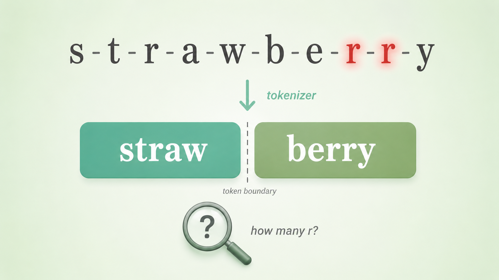
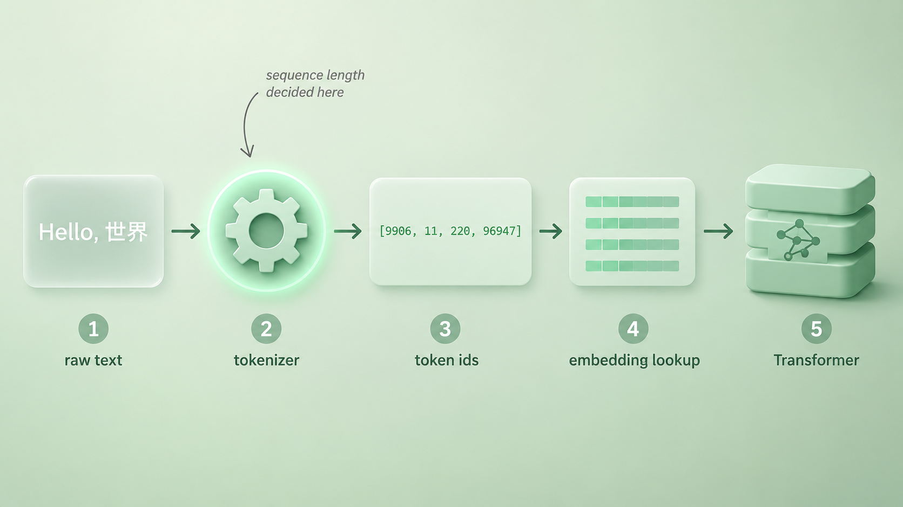
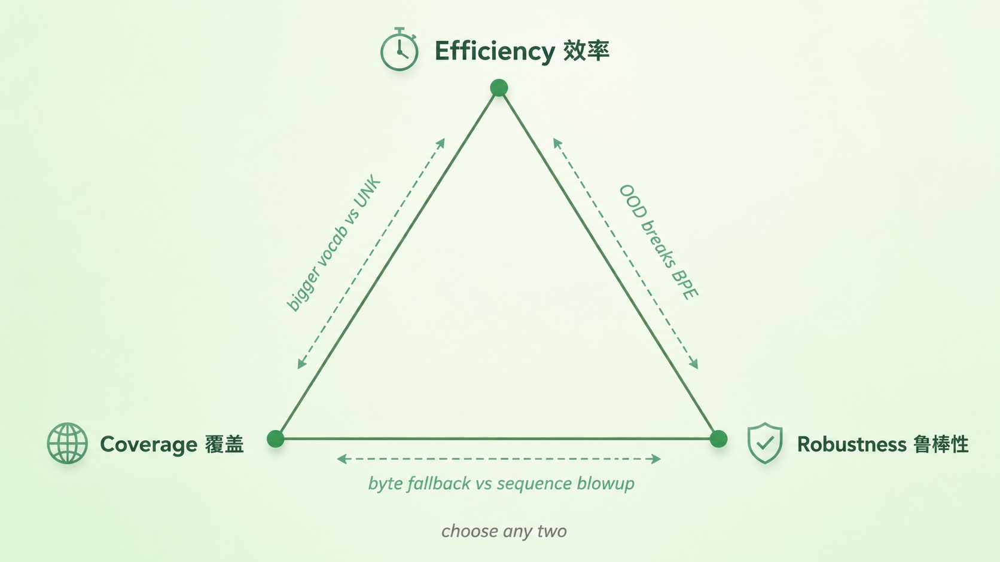

+++
title = "8 Tokenizer 的目标函数：效率、覆盖与鲁棒性的不可能三角"
description = "模型读到的不是字符，是 tokenizer 切出来的 token；而 tokenizer 在效率、覆盖、鲁棒性上只能三选二。"
date = 2026-05-24
tags = ["LLM", "Tokenizer", "BPE", "分词", "词表"]
categories = ["LLM"]
series = ["主线"]
showTableOfContents = true
+++





> 模型读到的不是字符，是 tokenizer 切出来的 token；而 tokenizer 在效率、覆盖、鲁棒性上只能三选二。

## 章导言：第二章「表示与分词」要解决什么

第一章我们把 LLM 拆成了一台条件概率机器：给定 \(x_{\lt t}\)，预测下一个 token；训练就是把所有 token 的负对数似然加起来往下压，推理就是从这个分布里采样。但整章用了 7 篇都没回答一个最基础的前提——**那个被「预测」的 token，到底是什么？**

第二章「表示与分词」就在补这个空缺。9 篇下来要解决的问题串成一条链：人类写的字符流，是怎么一步步变成模型内部那个浮点数张量的？

- Tokenizer 把字符切成 token id（本篇讲它的目标函数；#2 子词霸权讲为什么是 subword 赢了；#3 BPE 与 BBPE 讲算法；#4 Unigram 讲另一条路线；#5 讲 vocab size 取舍与字符级能力缺失）
- Embedding 把 token id 查表成向量（#6 查表机制、#7 几何性质、#8 weight tying）
- 位置编码补上 self-attention 缺失的序列顺序信息（#9 RoPE）

读完整章，你应该能回答：从 `Hello, world` 这几个字符，到 Transformer 第 0 层输入的那个 \([B, T, d]\) 张量，中间到底发生了什么。

本篇先搭这一章的总坐标——把 Tokenizer 设计理解成一个三目标权衡。后面所有具体技术（BPE / BBPE / Unigram / vocab size）都会回到这个坐标上落子。

## 数 r 数错的草莓

前一阵 GPT 数 strawberry 里有几个 r，几乎成了网友的玩具——你问它，它经常回答 2 个；你坚持追问，它有时还会反驳你。

这不是模型笨，也不是它故意叛逆。在 GPT 看来，strawberry 并不是 `s-t-r-a-w-b-e-r-r-y` 这十个独立字母。在主流 BPE 系列 tokenizer 里，它会被切成少数几块 subword——具体切几块、切在哪取决于不同 tokenizer 的训练数据和合并规则，但共同点是：**单个字母 r 几乎从未作为一个独立 token 出现过**。模型从训练第一天起就没「看到」过这个词的字母拼写，它看到的只是几个整数 id。让它数 r，就像让一个只读过印刷体英文教材的人去数手写花体里的笔画——字母级的信息要从 token 内部结构里反推，工具不在它手上。

这件小事透露了一个常被忽略的事实：**模型从来不读字符，它读的是 tokenizer 给它的 token 序列**。tokenizer 决定了模型能看见什么、看不见什么。所以聊 tokenizer，不是聊一个预处理小工具，而是在聊模型感知世界的那块滤镜。

## Token 才是模型真正读到的输入单位

> 类比：你给模型一段中文，它不是按字读的，也不是按词读的；它是按「tokenizer 切出来的那些块」读的——这些块可能是单字、可能是词、可能是半个英文单词、可能是一串字节。

在第一章里，我们写过这条贯穿全系列的链式法则：

$$
P(x_{1:T}) = \prod_{t=1}^{T} P(x_t \mid x_{\lt t})
$$

公式里的 \(x_t\) 一直被默认为「token」，我们没追问。现在该追问了：\(x_t\) **不是字符，也不是词，而是一个整数 id，它的具体含义由 tokenizer 决定。**

走完一次完整的输入处理流程，是这样的：

```python
text = "Hello, 世界"
ids = tokenizer.encode(text)        # 比如 [9906, 11, 220, 96947]
embeddings = embedding_table[ids]   # 查表得到 [4, d] 的向量序列
# 再送进 Transformer
```

中间这步 `ids` 才是模型真正读到的输入。同一句 `Hello, 世界`，喂给 GPT-2 的老 tokenizer 是一种切法，喂给 GPT-4o 是另一种，喂给 Qwen 又是第三种——同一段话，模型看到的那个「句子」是不一样的。

这条事实带出一个工程上的核心后果：**token 是 LLM 系统里所有数量度量的统一单位**。

- 上下文窗口写的是 128k context，单位是 token，不是字
- API 计费表里 $3 per 1M input tokens，单位是 token，不是字符
- 训练数据规模写的是 trained on 15T tokens，单位还是 token

Tokenizer 不只是切分工具，它定义了模型世界的「基本货币」。同一段中文被切成 50 个 token 还是 80 个 token，直接决定了它在 128k 窗口里占多少、调用一次 API 付多少钱、训练时算多少梯度。**而且每家模型的 tokenizer 都不一样，同一段文本的 token 数没法跨模型直接比较——「谁的 1M tokens 装得多」本身就是一个跟 tokenizer 设计绑定的问题，和模型能力是两件事。**



## 三个看起来各自独立的目标

进入「目标函数」之前，先把一个容易混的点摆清楚：

> **Tokenizer 的训练目标，和 LLM 的训练目标，不是同一个目标。** LLM 优化的是 next-token prediction 的交叉熵；tokenizer 优化的是另一组目标——BPE 按频次合并、Unigram 按子词似然做 EM 裁剪，它们都不直接看下游模型的 loss。所以聊 tokenizer 的「目标函数」，不是聊它对 LLM loss 做了什么，而是聊它**自己那个独立的优化问题**：在效率、覆盖、鲁棒性之间怎么取舍。

设计一个 tokenizer，看起来要同时满足三件事。

### 效率（Efficiency）：同一段话切得越少越好

最直接的衡量指标是**压缩率**（compression ratio），通常写成 chars-per-token——平均一个 token 能装多少个字符。

```python
text = "今天天气不错"   # 6 个汉字
gpt2_tokens   = 12     # 早期 BPE，中文按字节切，压缩率 ≈ 0.5
gpt4o_tokens  = 4      # 新 tokenizer 中文优化，压缩率 ≈ 1.5
```

同一段话，GPT-2 的 tokenizer 要花 12 个 token，GPT-4o 只要 4 个。窗口都是 128k 的话，你能塞进 GPT-4o 的中文是 GPT-2 的三倍。效率不是「快一点」的小优化，它直接决定窗口的实际容量和推理成本。

### 覆盖（Coverage）：任何输入都能被表示

失败的标志是 OOV（out-of-vocabulary）和 UNK token——遇到词表里没有的内容，只能塞一个 `<UNK>` 进去，原始信息直接丢失。

早期的 word-level tokenizer 是覆盖性的灾难现场：训练时见过的词构成词表，没见过的全变 UNK。训了个英文模型，用户输入一个 emoji、一个生僻字、一个新词、一段代码符号，全是 UNK——模型相当于看到一句被打了码的话。

### 鲁棒性（Robustness）：切分要稳

同一个语义在不同表达下，切出来不应该差得离谱；噪声、错别字、emoji、混合语言、乱码字节不应该让 tokenizer 直接崩盘。

一个经典的鲁棒性问题：在英文 BPE 词表里，`" hello"`（前面带空格）和 `"hello"`（前面不带空格）是两个完全不同的 token——前者在句中，后者在句首。这是 BPE 的特性而不是 bug，但意味着：

```python
"hello world"   →  [" hello", " world"]            # 2 个 token
"hello, world"  →  ["hello", ",", " world"]        # 3 个 token
```

一个逗号让切法变了，模型对这两段几乎相同的文本看到的是不一样的 id 序列。再往边角看，社区在 GPT-2 / GPT-3 词表里还观察到过一类**罕见 / 异常 token**（俗称 glitch tokens）——是训练时偶然产生的极少出现的怪 token，模型一遇到行为会变得不稳定。它不是鲁棒性问题的全部，但是一个被记录得比较多的边角案例。

## 为什么这是个「不可能三角」

> 直觉：这三个目标看起来都该追求，但任何一对认真对齐，第三个就会被拖下水。

逐对来看牵制关系。

**效率 vs 覆盖。** 想要短序列，词表就得做大——一个 token 装更多内容，序列才短。但词表是固定大小的，再大也总有写不进去的内容。于是大词表带来两个副作用：一是 softmax 输出层维度等于 vocab size，词表 50k 跟 200k 在最后一层的算力和显存差好几倍；二是任何固定词表都堵不住罕见词，最后通常要配合某种「非词表内容」的兜底机制——常见做法是 byte-level 词表（直接把字节也放进词表）或 byte fallback（遇到没见过的字符退化成字节）。不同 tokenizer 取舍不一样：tiktoken 走的是 byte-level；SentencePiece 把 `byte_fallback` 留成参数，默认还是 false，仍保留 `<unk>` 机制。共同的趋势是：**真正面向开放文本的现代 tokenizer，多数会想办法把 OOV 降到接近零，但具体走 byte-level、byte fallback 还是 `<unk>` 是设计选择**。

**覆盖 vs 鲁棒性。** 单看「编码层面的覆盖」，最干净的方案是纯字节级 tokenizer——只有 256 个 token，对应 UTF-8 的 256 种字节值，世界上任何文本都能编码，理论上零 OOV。但要分清两层：**编码层面**的鲁棒（任何输入都能切出来、再拼回去）和**语义层面**的鲁棒（模型对这些字节序列懂不懂）。前者是 tokenizer 的事，后者要看训练数据里有没有这种字节模式、模型有没有学会——一段从未见过的乱码字节流，纯字节级 tokenizer 能切，但模型该不懂还是不懂。而代价是：一个汉字在 UTF-8 里占 3 个字节，纯字节切分意味着一段中文被切成原来三倍长的序列。128k 的窗口装中文相当于只有 40k——效率彻底崩。

**效率 vs 鲁棒性。** 训练 tokenizer 时，词表是从一份训练语料里「长」出来的。训练数据如果是干净的英文 web，它对干净英文的压缩率会做得很好——常见词组合都被合并成单个 token，读得飞快。但一旦遇到分布外输入（中日韩混排、大量 emoji、罕见 Unicode、乱码），词表里没有现成的合并规则，只能退回到字节序列——切分立刻碎成大量小 token，效率断崖式下降。tokenizer 训练得越针对一种数据，它在分布外就越脆弱。

三组对齐，背后其实是同一条牵制链：

> 短序列 ↔ 大词表 ↔ softmax 维度膨胀 + 长尾 token 噪声 ↔ 鲁棒性 / 训练困难。

当然，**「不可能三角」不是一条数学定理，更像一组工程经验**——平均 token 长度、词表规模、OOV / byte fallback 策略、对分布外输入的稳定性之间存在系统性的 trade-off。三个目标之间也不是严格独立的（覆盖和鲁棒性就有显著交叠）。但作为一张坐标图来理解后续 BPE / BBPE / Unigram 的取舍，它够用了。所有现代 tokenizer 都在这个三角里选了一个偏心位置，区别只是偏向哪个顶点、用什么算法实现这个偏心。



## 这个三角拨动的下游齿轮

> 一句话：tokenizer 的取舍，会一路传导到上下文窗口、推理成本、训练数据规模，甚至模型的能力上限。

**上下文窗口的真实容量。** 一个 128k 窗口的模型，对英文用户和中文用户能装的内容并不一样。OpenAI 在 GPT-4o 发布时专门更新了 tokenizer，重点对中文、日文等非拉丁语言提升压缩率——在常见中文样本上，新一代多语言 tokenizer 相比早期 GPT-3.5 / GPT-2 切出来的 token 数显著减少，意味着同一份长文档能多塞不少内容进窗口。具体提升比例因文本类型差异很大（百科、对话、代码混排各不相同），不应该当成单一数字记忆，但方向上是确定的：这不是「算法变聪明」，是 tokenizer 在三角上往多语言效率倾斜的结果。

**推理与训练成本。** Decode 一步算一个 token 的概率，所以每多一个 token 就多一步前向计算。一段中文用 GPT-2 老 tokenizer 生成要 12 步，用 GPT-4o 只要 4 步，单这一项就有约 3 倍延迟差。训练侧同理：训 15T token，如果 tokenizer 压缩率高 30%，相当于多吃了 30% 的有效内容——同样的算力预算，模型看到的世界更大。

**能力的隐性瓶颈。** 回到开头那个数 r 数不清的草莓——tokenizer 把字符层信息隐藏起来后，模型在字符级任务（拼写、反转、字母计数、精确字符匹配）上天然有结构性短板。这不是 attention 不够强，也不是参数不够多，而是输入端的信息分辨率本身就被截断了。这个话题展开太长，留到第 5 篇《词表大小与 Token 危机》里专门讲。

整章后面 8 篇要做的事，都是在这个三角上具体落子：

- #2 解释为什么主流选了 subword（在大词表和小词表之间找折中）
- #3 把 byte-level BPE 讲透（把字节兜底推到极致，靠合并规则把效率拉回来）
- #4 介绍 Unigram 作为另一条路线（切分可多解，正则化思路）
- #5 量化词表大小对下游能力的影响（包括草莓事件的结构原因）

## 收尾

读这一篇之前，「token」可能还是一个含糊的词——大概是「模型读取的单位」，但具体怎么来的、为什么是这个样子，没追究过。读完之后，你应该有了三个东西可以带走：

第一，token 是 tokenizer 设计的产物，不是天然存在的。你给模型的每一段文字，会先被切成一串 id，模型只看 id，不看字符——所以 tokenizer 决定了模型对世界的「分辨率」。

第二，tokenizer 的设计是一个三目标权衡：效率、覆盖、鲁棒性。这三件事**没法同时最优**，所有具体算法都是在这个三角上选位置；而且 tokenizer 的优化目标和 LLM 的训练目标是两套独立的目标函数，不要混为一谈。

第三，这个三角不是抽象的——它一路向下游传导，决定窗口的实际容量、推理的实际成本、甚至某些能力的天花板（草莓数 r 不是段子，是这个三角真实存在的副产物）。

本篇只画了三角，没说现在主流的 tokenizer 落在哪里、是怎么落上去的。**下一篇我们来看为什么 word-level 和 character-level 都被淘汰了、subword 凭什么成为统治方案——它在这个三角里选了一个意外稳定的位置。**

## 参考资料

- Andrej Karpathy, *Let's build the GPT Tokenizer*（YouTube 教程，2024）：从零实现 BPE，里面亲手数了一遍 strawberry
- OpenAI, [tiktoken](https://github.com/openai/tiktoken)：GPT 系列实际使用的 tokenizer 实现，byte-level BPE 路线
- Google, [SentencePiece options 文档](https://github.com/google/sentencepiece/blob/master/doc/options.md)：另一条主流路线，`byte_fallback` 等参数的设计选择都列在里面
- [Tiktokenizer](https://tiktokenizer.vercel.app/)：在线对比 GPT-2 / GPT-3.5 / GPT-4 / GPT-4o / Llama 等不同 tokenizer 切分同一段文字的可视化工具，建议自己玩一遍
- T. Kudo & J. Richardson, *SentencePiece: A simple and language independent subword tokenizer*, EMNLP 2018（[arXiv:1808.06226](https://arxiv.org/abs/1808.06226)）：subword tokenizer 工程化的奠基论文，作为本章后续算法篇的预读
- *Tokenization Falling Short: On Subword Robustness in Large Language Models*（[arXiv:2406.11687](https://arxiv.org/abs/2406.11687)）：系统讨论 subword tokenizer 在 typo、token 内部结构、字符级任务上的鲁棒性表现，可作为「不可能三角」鲁棒性顶点的延伸阅读
