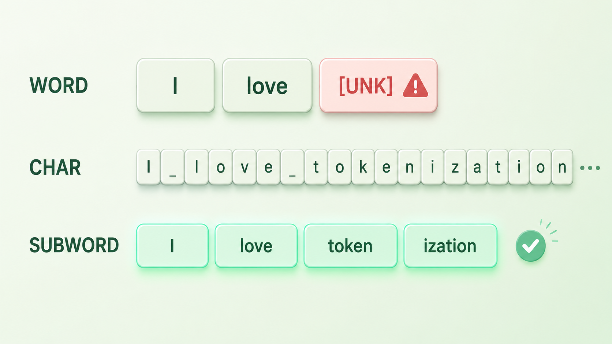
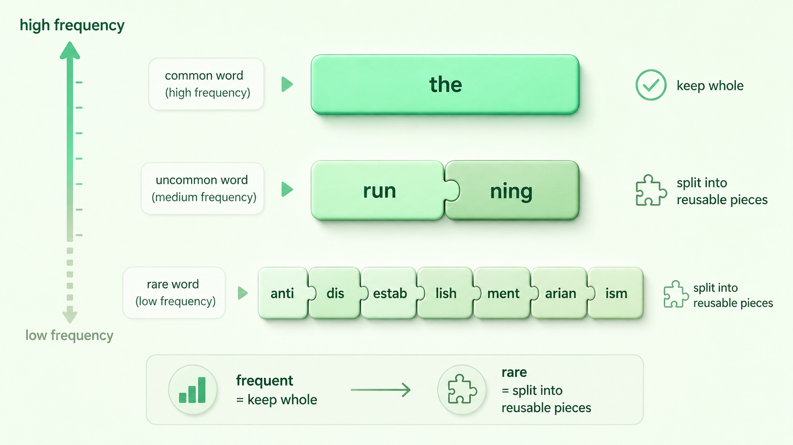

+++
title = "9 子词霸权：为什么 Subword 击败了 Word 和 Char"
description = "把一句话切成 token 时，按整词切太稀、按单字切太碎；subword 用「高频整切、低频拆片」同时拿下短序列和不掉词的开放词表。"
date = 2026-05-30
tags = ["LLM", "Tokenizer", "subword", "BPE", "OOV", "分词"]
categories = ["LLM"]
series = ["主线"]
showTableOfContents = true
+++



> 把一句话切成 token 时，按整词切太稀、按单字切太碎；subword 用「高频整切、低频拆片」同时拿下短序列和不掉词的开放词表。

> 前置知识提示：读这篇前，建议先了解 token 与 tokenization、效率 × 覆盖 × 鲁棒的「不可能三角」（见第 8 篇《Tokenizer 的目标函数》）。

给你出个怪题：`antidisestablishmentarianism`（反对取消英国国教的立场），这个 28 个字母的单词，连英语母语者都未必拼得出。但你把它丢给任何一个大模型，它读得懂，还能接着用。再换一个——你自创一个网名 `xiaoming_2026`，或者打一句「绝绝子😆」，它照样不卡壳。

问题来了：模型的「词汇表」是有限的，几万个条目封死，它训练时根本没完整见过这些词。它怎么读懂一个「表里没有」的词？

答案有点反直觉：它压根不是按「词」来读你的句子的。在把文字喂给模型之前，有一道叫 tokenization 的工序，把字符流切成模型真正认识的最小单位——token。而这一刀怎么切，直接决定了上面这些怪词能不能被处理。这一篇我们就回答一个被低估的问题：**这一刀，到底该切多大？**

上一篇我们立了个框架：任何 tokenizer 都在「效率、覆盖、鲁棒」三件事上做权衡，三者不可兼得——这就是那个不可能三角。这一篇把抽象的三角落到一个具体选择上：切分的**粒度**。是按整词切、按单字切、还是按介于两者之间的「片段」切？三种选法，对应三种命运。

## 一、按词太稀，按字太碎

先看最符合直觉的一种：**按词切（word-level）**。一个词一个 token，词表就是一本固定的词典。

听起来很自然，但它有三个绕不过去的坎。

第一个是 **OOV（Out-Of-Vocabulary，未登录词）**。词典外的词一律没法表示，只能塞给一个统一的 `[UNK]` 占位符，信息当场丢失。麻烦在于「词典外」的东西多得是：网络新词、人名地名、拼写错误、代码里的变量名、emoji——开头那个怪词正是典型。

第二个是 **词表爆炸与长尾**。想少掉 UNK，就得把词典做大。可自然语言的词频是一条 Zipf 长尾曲线，\(f(r) \propto 1/r\)——极少数高频词占了绝大多数出现次数，而绝大多数词是只露面几次的稀有词。把它们统统收进词表，规模会膨胀到几十上百万；偏偏这些稀有词样本太少，模型也学不出像样的表示。雪上加霜的是，输出层的 softmax 要在整个词表上算一遍概率，词表越大，计算越慢、显存越吃紧。

第三个是 **形态浪费**。`run` / `runs` / `running` / `ran` 在 word-level 里是四个互不相干的条目，模型看不出它们同根同源，等于把一个词根的学习量摊薄成四份。到了黏着语（土耳其语、芬兰语）这类一个词能长出几十种变形的语言，这种浪费会被放大到离谱。

> word-level 为了拿到短序列（一词一 token），把覆盖赔了进去——一撞上 OOV 和长尾就崩。

那干脆退到最细呢？**按字符切（char-level）**：如果只盯着有限字符集（比如英文加常用标点），词表可以很小；但要覆盖完整 Unicode，光码位就有十几万个，字符表一点都不小。真正把覆盖性做到极致的是更彻底的一招——**byte-level**：直接以 256 个字节为基本单位，任何字符串都能由字节拼出来，永不 OOV，覆盖性满分。

可不管退到字符还是字节，这么细都会撞上同一头的问题。

首先是**序列长度爆炸**。`internationalization` 一个词就拆成一长串 token，一句话动辄几百个。上下文窗口本就是稀缺资源（你的 128k tokens 窗口被一下子吃掉一大截），而注意力的计算量是 \(O(n^2)\)——序列翻几倍，成本翻平方。

其次是**语义太碎**。单个字母或字节几乎不带意义，`c` `a` `t` 三个 token，要靠模型在前几层自己重新拼回「猫」这个概念，相当于把本该省下的力气，浪费在「重新组词」上。

> char 与 byte 这种最细粒度拿满了覆盖，却把序列长度和算力赔了进去——正好踩在不可能三角的另一个对角。

## 二、Subword：让粒度跟着频率走

两个极端各丢一头，那思路就清楚了：**别用固定粒度**。常用的整块留着，少见的拆成零件。

打个比方，这像乐高，也像汉字的偏旁、英语的词根词缀。`the`、`ing`、`tion` 这种满世界都是的片段，给它一个独立 token；`tokenization` 这种没那么常见的，拆成 `token` + `ization` 两块已知零件；连 `antidisestablishmentarianism` 也能拆成一串认识的片段拼出来。

说得正式些：**subword（子词）**词表是「高频整词 + 可复用子词片段」的混合集合。切分时，高频词整块命中（短），低频或没见过的词则退化成更小的已知片段去拼。粒度不再被「字」或「词」钉死，而是跟着语料里的统计规律走——常见的留成大块，少见的拆成可复用的小件。这就是**频率自适应粒度**的直觉。

这一招同时拿到三样东西：

1. **适中的序列长度**：高频词整切，不像 char 那样爆炸；
2. **大幅缓解 OOV**：常见词整块命中，生僻输入退化成更小的已知片段——不过要做到几乎任意字符串都能表示、基本不掉 UNK，还得靠 byte-level 或上一篇说的 byte fallback 兜底，并不是每种 subword 都自带这个保证；
3. **可控的词表规模**：稳定在几万量级，softmax 输出层不至于失控。

顺带还白赚了两个好处。**形态变化**被自然吃下：`run` / `running` 共享 `run` 这个片段，模型对词根只学一次。**跨语言共享**也成立：拉丁字母的公共片段能在英、德、法之间复用，一套词表服务多门语言。

> subword 不站队两个极端，而是落在不可能三角里那块「够用的中间地带」——这就是它成为现代 LLM 默认选择的根本原因。

还得先说清一件事：subword 是一类方法，不是某一个算法。怎么从语料里学出这套片段，BPE、WordPiece、Unigram 各有各的准则——有的偏向反复合并高频相邻片段，有的按概率/似然挑出最优切分；用不用 byte-level，也直接影响覆盖能力。这些差异留到接下来几篇再拆，这里先把「粒度」的直觉立住。

## 三、代码、中文、emoji：subword 真正的主场

前面是通用论证。subword 真正和另外两种粒度拉开差距的地方，是那些 word-level 彻底失灵的场景。

**代码**：变量名 `getUserById`、`max_retry_count`、`HTTPSConnection` 几乎全是 OOV，按词切只会得到一串 UNK。subword 往往能拆出 `get`、`user`、`id` 这类可复用片段，既保留了可读结构又能跨变量复用——这也是为什么同一个 tokenizer 能同时吃下自然语言和代码。当然，实际切在哪由词表和预分词规则决定，不一定卡在程序员理解的命名边界上。

**中文与混合语言**：中文词之间没有空格这种天然分界，「按词切」得先做一步分词，而分词本身就会错、会产生 OOV。subword（尤其是直接在字节上工作的 byte-level 变体）跳过分词，直接在字节流上切，中英日混排、夹代码夹标点都能无缝处理。代价也得认：一个汉字在 UTF-8 里占 3 个字节，byte-level 切下来 token 数会偏多，覆盖性满分但效率未必最优——不可能三角又在提醒你，没有白拿的好处。

**emoji 与「乱码」**：`😆`、生僻字、复制粘贴带进来的奇怪符号，靠字节兜底保证永远能被表示，不会让一整句话崩成 UNK。

不过得诚实补一句它的软肋：subword 对数字和字母级任务并不友好。像 `2026-05-25`、`3.14159`、`1000000` 这类，会被切成长短不一、边界飘忽的片段——`2026` 是切成 `20` + `26` 还是 `2` + `026`，全看词表脸色。切法一不一致，模型做算术、比大小、逐字符复制时就容易栽跟头。这个「token 边界惹的祸」是另一个大话题，我们留到后面专门讲（见第 12 篇）。

> subword 的胜出不是「哪里都最好」，而是在真实世界最混乱的输入面前，它是唯一不轻易崩的那个。

## 回头看：这一刀切在哪

读到这里，tokenization 这个听起来像枯燥预处理的步骤，应该已经变了样：它不是把句子随手剁碎，而是在上一篇那个「效率 × 覆盖 × 鲁棒」三角上，做的一次关于粒度的关键权衡。word 太稀、char 太碎，subword 用「高频整切、低频拆片」找到了那个让大多数任务都跑得动的折中点。开头那个怪词为什么难不倒模型，现在也有了答案——它从不指望「见过整个词」，只要片段见过就够了。

但有一个问题被我们跳过了：subword 词表里那些「高频片段」，到底是谁定的？凭什么 `tokenization` 该拆成 `token` + `ization`，而不是 `to` + `keniz` + `ation`？这套切分规则不是手写的，是从语料里「学」出来的。下一篇，我们就来拆最经典的那套学法——BPE，以及它如何用 byte-level 版本把 UNK 彻底消灭。

## 参考与延伸阅读

- Sennrich, Haddow & Birch (2016). *Neural Machine Translation of Rare Words with Subword Units*. [arXiv:1508.07909](https://arxiv.org/abs/1508.07909) —— 把 BPE 引入 NLP、确立 subword 路线的奠基论文
- Kudo (2018). *Subword Regularization: Improving NMT Models with Multiple Subword Candidates*. [arXiv:1804.10959](https://arxiv.org/abs/1804.10959) —— Unigram 切分与子词正则化
- Kudo & Richardson (2018). *SentencePiece: A simple and language independent subword tokenizer*. [arXiv:1808.06226](https://arxiv.org/abs/1808.06226) —— 不依赖空格、直接在原始文本上做切分
- Wang, Cho & Gu (2019). *Neural Machine Translation with Byte-Level Subwords*. [arXiv:1909.03341](https://arxiv.org/abs/1909.03341) —— 以 256 字节为基础的 byte-level BPE，逼近零 OOV
- Radford et al. (2019). *Language Models are Unsupervised Multitask Learners*（GPT-2）—— byte-level BPE 的工程落地
- 延伸：OpenAI 的 [tiktoken](https://github.com/openai/tiktoken) 仓库，或任意「Tokenizer Playground」，把一句话粘进去看它被切成哪些 token，最直观
