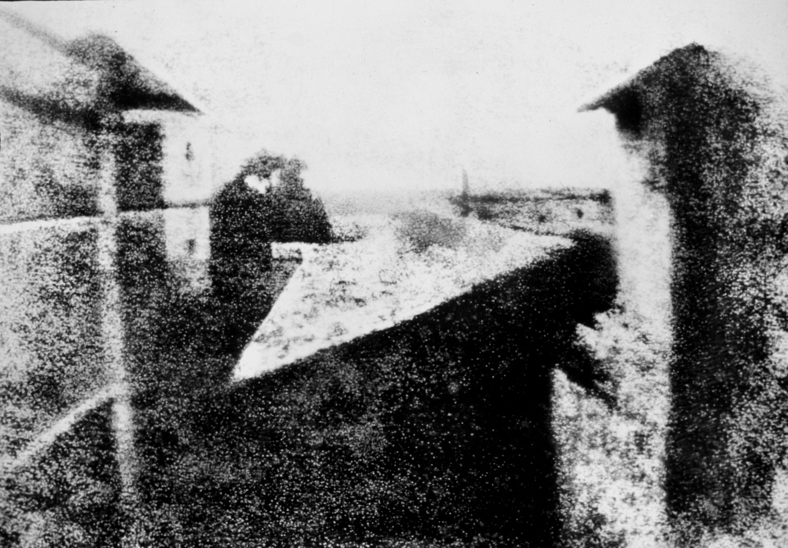
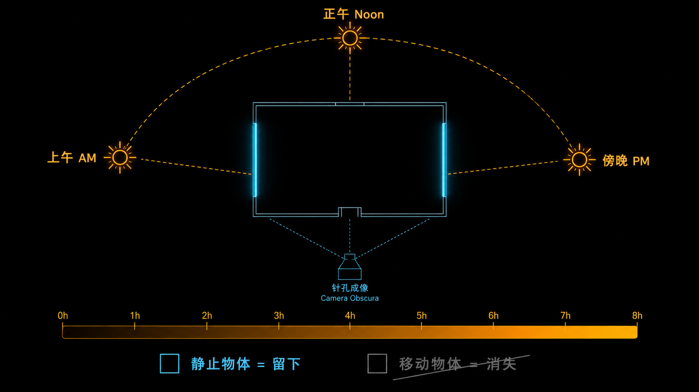

+++
title = "经典作品拆解 #1：View from the Window at Le Gras（窗外景色）"
description = "人类现存最早的照片不是「拍」出来的，而是用漫长的光照「烧」在白鑫板的沥青涂层上——它定义了摄影的物理起点。"
date = 2026-05-14
tags = ["摄影", "经典作品", "摄影史", "Niépce", "Heliography", "曝光"]
categories = ["摄影"]
series = ["经典作品拆解"]
showTableOfContents = true
+++

> 人类现存最早的照片不是「拍」出来的，而是用漫长的光照「烧」在白鑫板的沥青涂层上——它定义了摄影的物理起点。

---

### 一块白鑫板，一段漫长的曝光，人类第一张照片

大约 1826 年的某一天，法国勃良第，一栋叫 Le Gras 的庄园二楼。一块涂了薄薄一层犹太沥青的白鑫板（pewter plate，锡铅合金）被架在窗台上，对着院子。然后什么也没发生——至少在接下来很长一段时间里看起来是这样。阳光从左侧升起，扫过屋顶，最终落到右侧。傍晚，Niépce 取回白鑫板，用薰衣草油和白石油（white petroleum）的混合溶剂洗去未硬化的沥青，板面上隐约浮现出窗外建筑的轮廓。这不是画，不是投影——这是光第一次把自己「写」在了物质上，而且留了下来。

这张照片今天保存在德克萨斯大学奥斯汀分校的哈里·兰瑟姆中心（Harry Ransom Center），是人类现存最早的暗箱拍摄永久性照片（camera-made photograph）——严格说不是最早的所有感光实验图像，但是第一张通过暗箱成像并永久保存下来的照片。

*图：人类现存最早的照片——从 Le Gras 庄园二楼窗口看出去的景色，8 小时曝光让建筑两侧都出现了阳光。图片来源：[Wikimedia Commons](https://commons.wikimedia.org/wiki/File:View_from_the_Window_at_Le_Gras,_Joseph_Nic%C3%A9phore_Ni%C3%A9pce.jpg)，Harry Ransom Center / University of Texas at Austin*

### 在这张照片之前：光留不住

19 世纪初，暗箱（Camera Obscura）已经被画家使用了几百年。它的原理很简单：一个密闭的盒子，前面开一个小孔，外界的光透过小孔在盒子内壁上形成倒像。画家对着这个投影描摹，能得到精确的透视关系。

但暗箱有一个根本性限制：光一走，影像就消失了。它是实时投影，不是记录。怎么把影像「留住」？

Niépce 从 1816 年就开始尝试。他的思路是找一种对光敏感的材料——光照到的地方发生化学变化，没照到的不变，这样就能把影像固定下来。他最早试过氯化银（这是后来银版摄影的基础材料），但遇到了一个致命问题：不知道怎么**定影**。图像在继续见光后会持续反应，最终完全变黑——你没法阻止它继续曝光。

辗转十年后，他找到了犹太沥青（Bitumen of Judea）。这种天然沥青有一个恰好合适的特性：被阳光长时间照射后会硬化变白，未被照射的部分保持柔软，可以用溶剂洗掉。Niépce 把它薄薄地涂在一块白鑫板上，放进暗箱对准窗外——剩下的就是等，等足够长的时间让阳光完成它的工作。他把这个过程叫做 Heliography——日光刻蚀术。

### 这张照片在做什么

仔细看这张照片（或者说，尽量辨认它），你会发现几个反直觉的特征。

**这张照片记录的不是一个瞬间，极长时间的累积。** 传统说法约 8 小时，也有研究认为可能持续数天；确定的是曝光时间极长，太阳从东侧移动到西侧。这意味着建筑物的左侧和右侧在不同时段分别被阳光直射——所以最终画面里，建筑的两侧都出现了亮面。这在正常的「瞬间」照片中不可能出现：任何一个时刻，阳光只能从一个方向来。但在 8 小时的积分里，方向被叠加了。

**画面中没有任何移动的东西。** 人、动物、马车、云——所有在 8 小时内发生过位移的物体，都因为在每个位置停留的时间不够长而无法在沥青上留下足够的化学变化。只有完全静止的建筑物和地面，才积累了足够的光量留下影像。这不是「抓拍」，这是一个关于**静止**的极端筛选器。

**画面反差极低，细节几乎不可辨。** 犹太沥青对光的响应范围很窄——它只区分「照了很久」和「几乎没照」，中间层次几乎没有。用今天的术语说，这块白鑫板的**动态范围**（DR）极低，远低于任何现代传感器。

### 它是怎么做到的

> 一个最简化的模型：感光材料上每个点累积的效果，等于照到它的光的强度乘以照射时间。强光照 1 秒和弱光照 10 秒，可以产生相同的化学变化。这就是摄影中最基础的**互易律（Reciprocity）**——不过在极长曝光下，很多感光材料的响应会偏离这个线性关系，这叫**互易律失效（Reciprocity Failure）**，现代摄影的长曝光也经常需要额外补偿。

Niépce 的技术路径可以拆成三个关键决策。

**第一，选择感光材料。** 犹太沥青的感光灵敏度极低——这就是曝光需要极长时间（传统说法约 8 小时，也有研究认为可能持续数天）的直接原因。作为对比，十年后 Daguerre 改用碘化银，灵敏度提高了几个数量级，曝光时间从小时缩短到分钟。再到今天的数字传感器，一帧曝光可以短到 1/8000 s。从犹太沥青到 CMOS，感光材料的灵敏度提升了大约 10 个数量级——但底层逻辑从未变过：让光在材料上留下可区分的痕迹。

**第二，用暗箱成像。** Niépce 使用的是一台带镜头的暗箱，将窗外景象投射到涂有犹太沥青的白鑫板上。早期暗箱光学的局限、沥青涂层的颗粒不均和极低的感光效率共同限制了画面的清晰度。但这不重要：关键是暗箱把三维场景映射成了二维平面上的光强分布，感光材料只需要「记住」这个分布。

**第三，定影。** 用薰衣草油和白石油（white petroleum）的混合溶剂洗去未硬化的沥青，只留下被光照硬化的部分。这一步解决了之前氯化银方案的致命缺陷——洗完之后，剩下的硬化沥青不再对光敏感，影像不会继续变化。这是人类第一次实现了**永久性**的影像固定。

*图：8 小时曝光期间，太阳从东到西扫过整个场景，建筑两侧均被照亮，移动物体无法留下影像*

### 它在摄影史里的位置

**短期影响**：Niépce 的 Heliography 本身从未成为实用技术。8 小时曝光、极低反差、无法复制——这些限制让它停留在实验阶段。但它完成了最重要的概念验证：光可以自己画画，而且画出来的东西可以留住。Daguerre 在 1829 年成为 Niépce 的合伙人，并在 Niépce 去世后继续改进。到 1839 年，银版摄影术（Daguerreotype）将曝光时间缩短到 15-30 分钟，反差和分辨率大幅提升。但 Daguerre 的起点，是 Niépce 证明了这条路走得通。

**长期影响**：这张照片定义了摄影的物理边界条件——光、感光材料、成像光学、定影。将近 200 年后，数码相机不再需要化学定影，但仍然包含成像、感光、信号转换与保存这几个基本环节——每个环节的技术都进步了几个数量级。

我认为这张照片的真正价值不在美学——它几乎看不清——而在于它是一个**存在性证明**：影像可以不依赖人手而直接由物理过程生成。这个证明一旦成立，后面所有的进步都只是工程优化。

### 与主线的接口

**如果你想深入……**

这张照片的核心决策对应我们摄影主线的两个模块：

- 介质与噪声·介质决定什么 — 讲了感光材料如何限定影像的动态范围和信噪比
- 曝光控制论·曝光到底控制什么 — 讲了曝光时间、光强和感光灵敏度之间的互易关系

读完这些，你对 *View from the Window at Le Gras* 的理解会从「看过」变成可操作的拍摄认知。

### 对今天的启示

这张 200 年前的照片看起来和今天的拍摄没有任何关系。但它体现的一个原则今天仍然适用：**曝光时间的选择，就是你决定让时间的哪个切片留在画面里。**

Niépce 的 8 小时把一天的阳光压缩成了一帧——移动的事物消失，只有静止的结构留下。今天你用 ND 滤镜做 30 秒长曝光拍瀑布，逻辑完全一样：水流被模糊成丝绸状，石头保持清晰。你用 1/1000 s 冻结一只飞鸟，是在做反方向的选择：只留一个瞬间，拒绝其余所有时间。

可以试试这个：在手机上找到长曝光模式，对着一条车流量大的马路拍 3-5 秒。车灯会被拉成光轨，而建筑物纹丝不动——这就是 Niépce 200 年前做的事，只是快了几千倍。

### 读完这篇，你拿到了什么

读之前，你可能觉得这只是「人类第一张照片，模糊得看不清」。读完之后，画面更清晰了：8 小时曝光不是因为拍摄者不着急，而是因为犹太沥青的感光灵敏度极低；建筑两侧都有阳光不是因为光源奇怪，而是因为太阳在 8 小时内扫过了整个天空；画面里没有人和动物不是因为场景空旷，而是因为移动的物体无法在沥青上累积足够的化学变化。每一个视觉特征背后都有物理原因。

下一篇，我们来看另一张定义性的照片—— Cartier-Bresson 的 *Behind the Gare Saint-Lazare*。如果说 Niépce 用 8 小时证明了光可以留住影像，那 Cartier-Bresson 用 1/125 s 证明了另一件事：摄影可以在一个瞬间里捕捉到几何的完美。从 8 小时到 1/125 秒，曝光时间缩短了大约 360 万倍——但那个核心问题从未变过：你想让时间的哪个切片留下来？

### 参考资料

- Harry Ransom Center, University of Texas at Austin. *The Niépce Heliograph*. [官方页面](https://www.hrc.utexas.edu/niepce-heliograph/)
- 摄影师：Joseph Nicéphore Niépce（1765–1833），法国发明家，Heliography（日光刻蚀术）发明人，与 Daguerre 合作开启了实用摄影术的开发
- Wikimedia Commons. [View from the Window at Le Gras 高清图](https://commons.wikimedia.org/wiki/File:View_from_the_Window_at_Le_Gras,_Joseph_Nic%C3%A9phore_Ni%C3%A9pce.jpg)
- Batchen, G. (1997). *Burning with Desire: The Conception of Photography*. MIT Press（关于摄影起源的深度学术著作）
