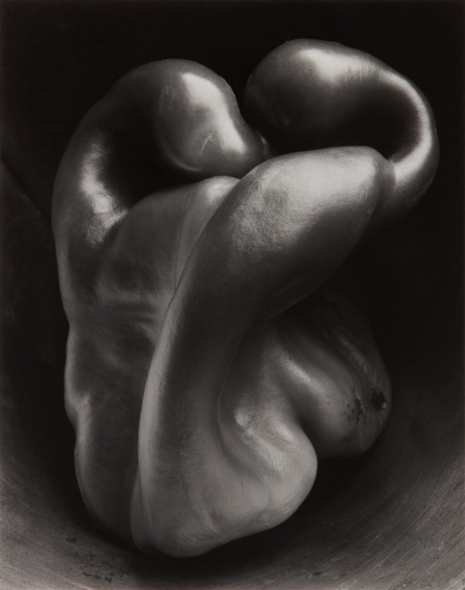
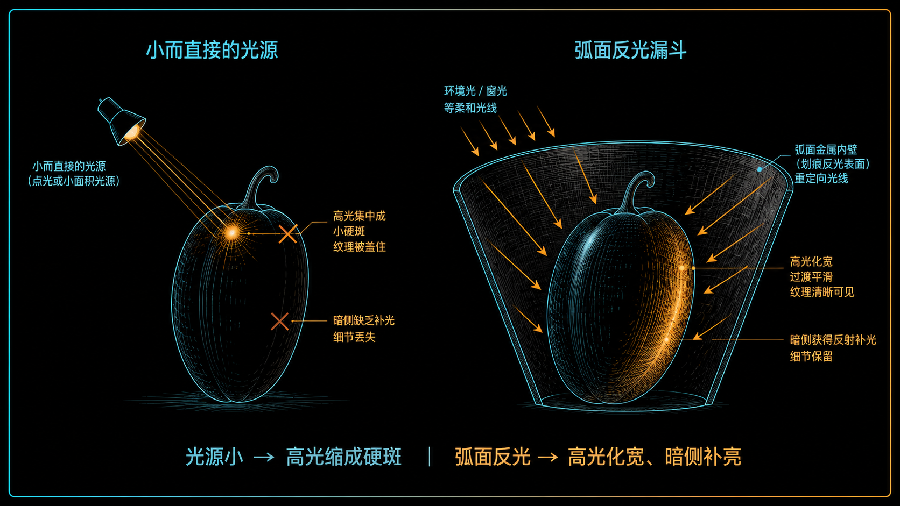
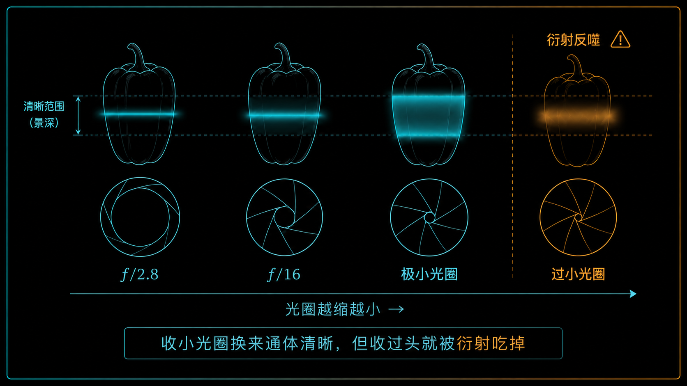
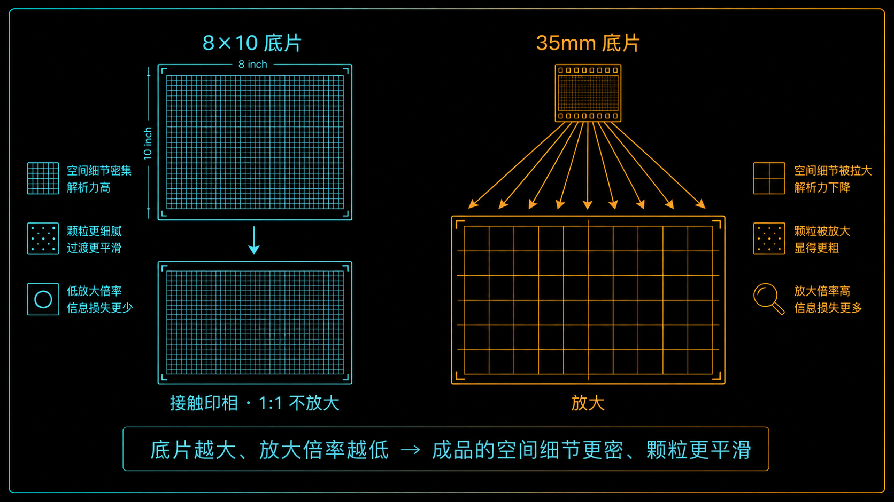

+++
title = "经典作品拆解 #10：Pepper No. 30（辣椒30号）"
description = "一颗青椒被拍成雕塑，靠的不是运气，而是漏斗控光、大画幅接触印相与六分钟的耐心——这，就是「直接摄影」。"
date = 2026-07-12
tags = ["摄影", "经典作品", "摄影史", "Edward Weston", "Pepper No. 30", "直接摄影", "Group f/64", "静物"]
categories = ["摄影"]
series = ["经典作品拆解"]
showTableOfContents = true
+++



> 一颗青椒被拍成雕塑，靠的不是运气，而是漏斗控光、大画幅接触印相与六分钟的耐心——这，就是「直接摄影」。

## 一、从一只锡皮漏斗说起

1930 年 8 月初的加州，Edward Weston 对着青椒较劲了好些天。他试过白布背景，试过白纸板，都不对——反差要么太硬，要么太平，青椒总像一张贴在纸上的标本。直到某天，他把青椒塞进一只锡皮漏斗，事情有了转机：漏斗弧形的金属内壁把光重新拢回青椒的暗侧和轮廓，明暗过渡一下子连续了起来。他架起 8×10 的大座机，对好焦，做了一次六分钟的长曝光。

这张照片叫 *Pepper No. 30*（辣椒30号）。「No. 30」是他这批青椒底片的编号——他一张接一张地拍、一张接一张地编号，直到这一张让他真正满意。名字平淡得像实验记录，画面却成了 20 世纪最著名的静物之一：青椒不像蔬菜，倒像一具蜷起的人体、一块被水流磨过千年的石头。快门按下的那一刻，一颗一毛钱的蔬菜，变成了一件关于「形」的雕塑。

*图：Edward Weston《Pepper No. 30》，底片摄于 1930 年 8 月。本图为其子 Cole Weston 后期印制的银盐版本之数字复制，来源 Wikimedia Commons / Sotheby's；作品 1930 年 12 月首刊于《Theatre Arts Monthly》，现已进入公有领域。Weston 生前与后期印制的多个版本，分藏于 MoMA、SFMOMA 等机构。*

## 二、它是在什么处境下被拍出来的

从墨西哥回到加州后，Weston 把镜头对准了最普通的东西：贝壳、白菜、青椒、裸体。他不布置戏剧化的场景，就在自家工作室的日光下，反复拍同一颗蔬菜——青椒这一组，他前后拍了大约三十张底片，逐一编号，*Pepper No. 30* 是让他最满意的一张。

那个年代的技术条件，决定了他必须慢。他用的是一台 Ansco 8×10 座机——底片约 20×25 cm，接近一张小型打印纸的大小，配一支蔡司（Zeiss）21 cm 镜头。这么大的底片景深很浅，凑近拍一颗青椒，要让它从最凸的前缘到最深的褶皱都清晰，光圈得收得很小；光圈一小、又是近摄，进光量骤降，曝光就得拉长——最后那一次，长达六分钟。更关键的是，Weston 不做放大：他的照片是「接触印样」，把底片直接压在相纸上印，成品和底片一样大，不裁、不放。这意味着构图和影调的大框架，在按快门前就得基本定死；后面的显影、相纸和印放还能微调，但取景一旦拍下，几乎没有重来的机会。

这套「慢」的约束，逼出了那只漏斗。

## 三、技术拆解

### 3.1 这张照片在做什么

**第一件事：它让你先看到一具躯体，再反应过来那是青椒。** 青椒本身的扭转结构——一道从顶部旋下来的深沟、两瓣饱满的凸起——在这束光下被强化成了人体般的曲线。Weston 把漏斗压成了近乎抽象的深色承托面：背景并没有真的消失，但它退到了最暗处，你的注意力无处可逃，只能盯着「形」本身。这正是他要的——把一个具体的蔬菜，抽象成一个纯粹的形状。

**第二件事：从高光到暗部，影调一档一档连续地铺开，几乎没有断层。** 青椒表皮的高光是温润的、带着微微反光的曲面，不是一块炸开的白斑；最深的凹槽里是浓黑，凑近看仍留着隐约的纹理。这种连续的层次不是修出来的，是拍摄方式换来的——它让「清晰」本身成了一种情感。不过这份层次得看 Weston 亲手印的那批照片：网上流传的多是不同年代、不同印相者的扫描件，黑位与反差各有出入。

### 3.2 它是怎么做到的

先说那只漏斗，它对付的是一个今天拍反光物体你也一定会撞上的难题。

青椒表皮是光滑的。光源越小、越直接地打上去，光滑表面就越容易反出一块集中、刺眼的**镜面高光（specular highlight）**——它一旦太强、局部过曝，就会像膏药一样盖住底下的微纹理，青椒于是显得又假又腻，像个塑料模型。反过来，把青椒「看到」的光源摊大、重新分布，这块高光就会化开成一片平缓的亮面，既描述立体的转折，又不抹掉表皮的质感。Weston 的漏斗做的正是后一件事：弧形的金属内壁把工作室的环境光重新反射到青椒的暗侧和轮廓上，同时漏斗本身压成深色，既当背景，又收拢杂光、充当「负补光」。光不再是硬砸上去的一个点，而是从一圈弧面裹回来的一片。

> 记住这条因果的方向：高光会不会盖住纹理，看的不是「硬光还是柔光」这一个词，而是主体看到的光源有多大、入射角多少、高光有没有过曝。

*图：为什么一只漏斗能救活质感——小而直接的光源在光滑表面砸出集中的镜面高光、盖掉微纹理；弧形反光的漏斗把环境光重新拢到暗侧和轮廓，高光化宽，质感留住，深色漏斗顺带当了背景。*

再说曝光和光圈，这里藏着一个流传很广的误会，值得拆一拆。

网上常说这张照片是「f/240、曝光四到六个小时」拍的，这个数字来自 Weston 的后人口述。但翻 Weston 本人的日记（*Daybooks*），能坐实的只有一件事：他把青椒放进漏斗、对好焦，「认准了那个视角，认出了完美的光，做了一次**六分钟**的曝光」。日记里并没有白纸黑字写下光圈。所以严谨的说法是：六分钟曝光有一手材料支持；至于是不是 f/240、是不是四小时，属于与日记冲突的后世说法，只能存疑，不该替他拍板。

这里还有一层容易被忽略的物理。大画幅凑近拍小物件时，镜头要伸出很长的皮腔（bellows），这会让**有效光圈**比镜头刻度上的数字小得多——近似关系是 \(N_{\text{eff}} = N(1+m)\)，其中 \(m\) 是放大倍率。也就是说，哪怕镜头刻度上根本没有 f/240 这一档，在较高放大倍率下，光实际「经历」的有效光圈仍可能小到那个量级。这正是为什么不能只凭「镜头开不到 f/240」就否掉那个说法——近摄的有效光圈，本来就会往下探得很深。

抛开那个具体数字，真正确定的是方向：光圈收得越小、皮腔伸得越长，景深越大、进光越少、曝光越长，六分钟就是这么来的。而光圈也不能无限收——收到一定程度，**衍射（diffraction）**会开始软化整张照片。衍射并没有一个突然失控的临界点，它糊到什么程度算「不能接受」，取决于底片尺寸、放大倍率、成品大小和观看距离；对一张 8×10、还不放大的接触印相来说，这条容忍线本就比小底片放大宽松得多。Weston 到底停在哪一档，我们无从精确考据；能说的是，他在景深、曝光时间和最终成品之间，做了一个经验上的平衡。

*图：收小光圈，清晰的景深越铺越宽，直到青椒通体入焦；但收过头，衍射会反噬，清晰度重新塌掉。最优的那一档不是固定的，随画幅、放大倍率和成品大小而变。*

最后是底片和印相。8×10 的底片需要的放大倍率极低，接触印相又省去了放大镜头这一环，所以成品能保留很细的空间结构和很平滑的颗粒——但这不是「零损耗」：乳剂、相纸的解析力、接触是否贴合、显影控制都还在起作用，只是比起小底片放大，损失确实少得多。包裹光、收到极小的光圈、大底片接触印相，这三件事合起来，构成了 Weston 那一派人所追求的**直接摄影（straight photography）**的一部分：不靠柔焦、不靠花哨的暗房戏法把照片弄得像画，而是把摄影「精确描写」的本事用足。

## 四、它在摄影史里的位置

要理解这颗青椒的分量，得知道它站在哪一边。

19 世纪末到 20 世纪初，想让照片「够得上艺术」的主流做法叫画意摄影（Pictorialism）：故意用柔焦、朦胧的影调，甚至在底片和相纸上手工加工，把照片弄得像炭笔画或蚀刻版画——仿佛摄影非得假装成绘画，才配挂进美术馆。Weston 年轻时也是这么拍的。但到了 1920—30 年代，另一条路已经在成形：强调摄影这个媒介自己的特性——清晰、精确、对形式和构图的严格组织。这条路不是 Weston 一个人开的，Alfred Stieglitz、Paul Strand 等人走得更早；而这颗青椒，是它在美国西海岸被推到极致的一个样本。Weston 不再让摄影模仿绘画，而是反过来问：摄影自己最擅长什么？

*图：直接摄影的物质基础——底片越大、放大倍率越低，成品里能留下的空间细节就越密、颗粒越平滑。8×10 接触印相 1:1 落到相纸，35mm 放大则把有限细节摊薄。*

两年后的 1932 年，Weston 和 Ansel Adams、Imogen Cunningham 等人组了个松散的团体，叫 **Group f/64**——名字直接取自那个代表「极小光圈、极大景深、极致清晰」的光圈值，主张的正是精确描写与形式的完整。所以严格说，*Pepper No. 30* 不算「Group f/64 的作品」，它拍在团体成立之前；但它是那份美学的原型，是宣言贴出来之前，先被拍出来的那张样板。

往长了看，我认为这张照片真正的价值，不在于「一颗青椒被拍得好看」，而在于它证明了一件事：一个最普通的日常物件，只要被足够精确、足够专注地观看，就能变成任何人都能感受到的、近乎抽象的存在。Weston 自己在日记里说，这颗青椒「是抽象的，因为它完全超出了题材本身……把人带进一种内在的真实」。它没有开创直接摄影，却成了这条现代主义摄影传统里最常被引用的范例之一——后来那些把镜头对准平凡之物、靠精确而非戏剧取胜的照片，几乎都绕不开它。

## 五、与主线的接口

**如果你想深入……**

这张照片的核心决策，对应我们摄影主线的「光照设计」和「镜头与成像」两个模块：

- **[#2-6] Specular–Texture 竞争：为什么会「油腻 / 塑料」** — 讲了当镜面高光盖住微纹理，材质就会显得假；以及怎么用光的形态、大小和位置把质感留住。Weston 的漏斗，就是一次纯手工的解法。
- **[#3-1] 清晰不是一个指标：Resolution / Acutance / 纹理 / 噪声的四分法** — 讲了「清晰」其实是四个能分开调的变量，帮你理解 8×10 接触印相那种细节密度到底来自哪里。
- **[#3-3] 高像素的代价：衍射极限与「甜蜜光圈」** — 讲了光圈收到多小就该收手、衍射如何反噬清晰，帮你判断在景深和画质之间怎么权衡。

读完这些，你对 *Pepper No. 30* 的理解，会从「看过」变成可操作的拍摄认知。

## 六、对今天的启示

漏斗这招今天照样管用，而且更简单。你拍反光的小东西——水果、玻璃杯、金属首饰、一块巧克力——可以照一条顺序来：先眯眼看清那块刺眼的镜面高光落在哪；再调整光源相对主体的大小和角度，把光源摊大（一张卷成筒的白纸、一块柔光板，甚至一只 Weston 式的反光容器都行），让高光化宽；用白卡往暗侧补光、用黑卡切掉杂光；最后回看高光有没有过曝，过了就压曝光或再挪光。光圈不必一步到位，从镜头中段（常见是 f/5.6 到 f/11 之间）起步，景深不够再往小收，收到画面开始发肉就换对焦堆叠。原理和八十多年前那只锡皮漏斗，是同一个。

而有一件当年的苦，今天不必再吃。Weston 为了通体清晰把光圈往死里收、赌上长曝光，是因为那个年代没有别的路。今天你要极限景深，不必硬扛衍射——用对焦堆叠（focus stacking）多拍几张再合成，既能让前后全清晰，又能让镜头待在画质最好的「甜蜜光圈」上。工具换了，但「先想清楚要什么，再用流程去保证它」这套思路，没变。

## 七、认知回顾与下一站

读这篇之前，你看到的可能是「一张构图很妙、光影很美的青椒」。读完之后，希望你看到的是一次冷静的工程权衡：一只漏斗把镜面高光化成了留得住质感的亮面，一次六分钟的长曝光换来通体的景深，一张不放大的大底片把空间层次尽量原样留到了相纸上——这三件事加起来，才撑起「直接摄影」四个字。至于它究竟用了多小的光圈、曝了几分几秒，有些数字连一手日记都没写死；与其替它编一个更传奇的版本，不如老实承认「不确定」——这本身也是一种对作品的尊重。

Weston 用几天的耐心，在一颗静止的青椒上，把每一处过渡都调到了位。而下一位摄影师面对的，是完全相反的处境：一个正要落地、只存在几分之一秒的身影。没有漏斗，没有座机，没有六分钟——只有一道围栏的缝隙、一滩积水的倒影，和一次不能重来的按快门。下一篇，我们聊 Henri Cartier-Bresson 的 *Behind the Gare Saint-Lazare*（圣拉扎尔站后面），看看「决定性瞬间」到底是运气，还是另一种可以拆解的工程。

## 参考资料

- **作品收藏页**：Museum of Modern Art（MoMA），*Pepper No. 30*, 1930 — [https://www.moma.org/collection/works/58496](https://www.moma.org/collection/works/58496)
- **作品条目**：Wikipedia, "Pepper No. 30" — [https://en.wikipedia.org/wiki/Pepper_No._30](https://en.wikipedia.org/wiki/Pepper_No._30)
- **其他馆藏**：SFMOMA（编号 39.208）、The J. Paul Getty Museum、Center for Creative Photography（图森，收藏 Weston 全部档案）
- **摄影师**：Edward Weston（1886–1958），美国摄影家，「直接摄影」与 Group f/64（1932）的核心人物；早年为画意摄影者，1920 年代赴墨西哥后转向精确、无干预的现代主义静物、人体与风光。
- **一手材料**：*The Daybooks of Edward Weston, Volume II: California*（Aperture）——六分钟曝光、漏斗与创作心境，均出自他本人日记。
- **延伸阅读**：Amy Conger, *Edward Weston: Photographs*（Center for Creative Photography 编目）。
- **首图版本**：Cole Weston（其子）后期印制的银盐版本之数字复制，来源 Wikimedia Commons / Sotheby's；作品 1930 年 12 月首刊于《Theatre Arts Monthly》，因 1931 年前发表，在美国已属公有领域。
