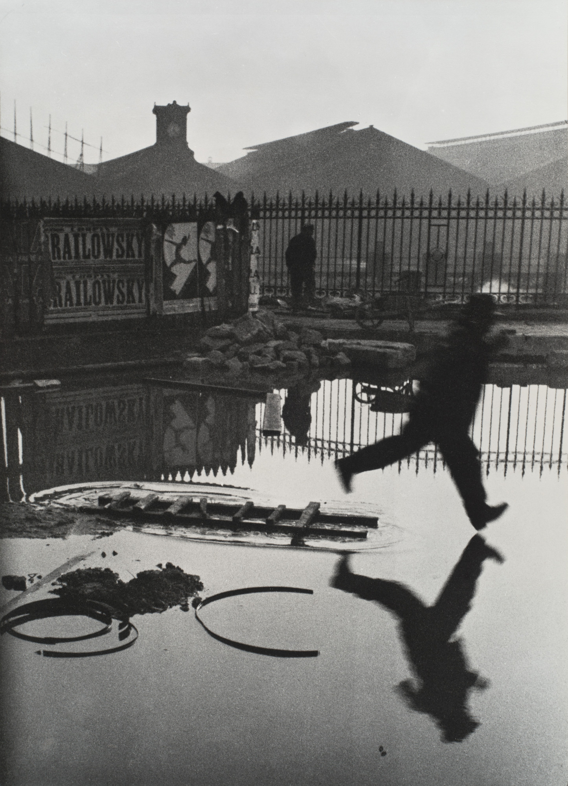
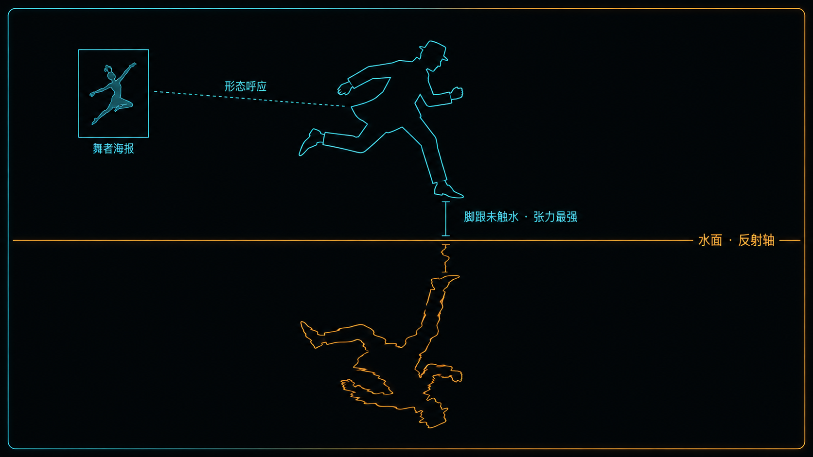
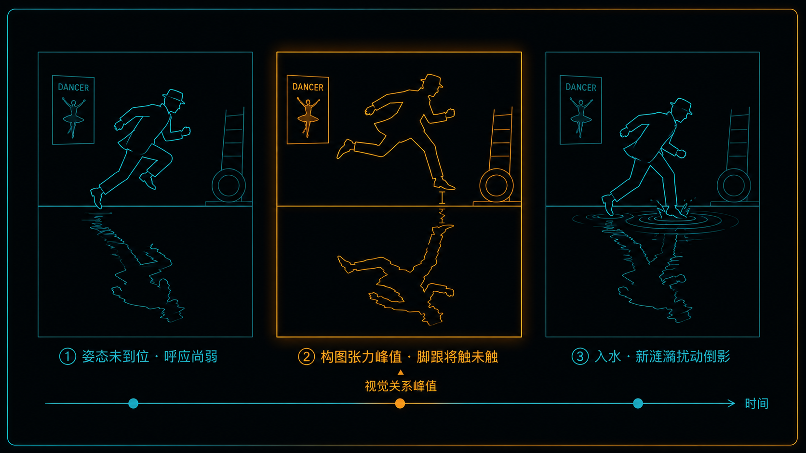
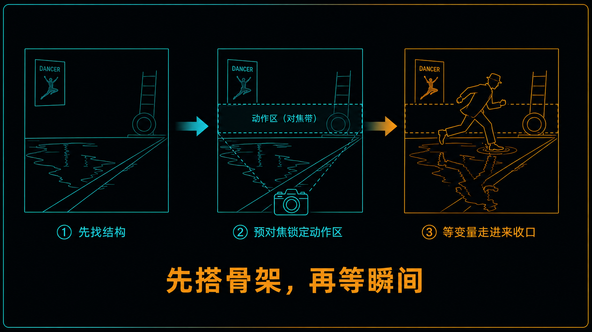

+++
title = "经典作品拆解 #11：Behind the Gare Saint-Lazare（圣拉扎尔站后面）"
description = "决定性瞬间不是撞大运，也不是逐帧预谋——它是一套能从成片反推、也能自己练成的构图直觉。"
date = 2026-07-19
tags = ["摄影", "经典作品", "摄影史", "Henri Cartier-Bresson", "决定性瞬间", "街头摄影", "构图", "抓拍"]
categories = ["摄影"]
series = ["经典作品拆解"]
showTableOfContents = true
+++

> 决定性瞬间不是撞大运，也不是逐帧预谋——它是一套能从成片反推、也能自己练成的构图直觉。

## 一、栏杆缝里，那个永远没落地的人

1932 年的巴黎，圣拉扎尔火车站后面有一片正在施工的空地，围着一圈木板栅栏。亨利·卡蒂埃-布列松（Henri Cartier-Bresson）走过，把徕卡的镜头从两块木板之间的缝里塞出去——缝太窄，取景器几乎被挡死，他其实看不全画面。就在这时，一个男人踩着地上一根半沉的梯子，正要跃过一大滩积水。布列松按下快门。

照片里，那个人永远停在半空，脚跟离水面只差几厘米，再也不会落下去。这张后来被叫作 *Behind the Gare Saint-Lazare*（圣拉扎尔站后面）的照片，成了「决定性瞬间」这个词最经典的注脚，也被《时代》周刊列进「史上最有影响力的 100 张照片」。它的迷人之处不在美，而在一个问题：一张在看不清、构不了图、只有一次机会的现场抢来的照片，为什么会呈现出这么严密的几何秩序？这秩序，是布列松当场算好的，还是我们事后才从成片里读出来的？这篇想把这件事讲清楚。

*图：Henri Cartier-Bresson，《圣拉扎尔站后面》（Behind the Gare Saint-Lazare），1932。原作 © Henri Cartier-Bresson / Magnum Photos；更多资料见 [MoMA 藏品页](https://www.moma.org/collection/works/98333) 与 [Fondation Henri Cartier-Bresson](https://www.henricartierbresson.org)。*

## 二、一台新相机，一道看不清的缝

先说清楚布列松当时的处境。1932 年，35mm 徕卡问世还没几年（徕卡 I 于 1925 年公开发售）。在它之前，手持相机和瞬间快拍并非不存在，但「严肃摄影」大多仍意味着更大的机身、更慢的节奏、更正式的构图——街头那些一秒就没的动作，能拍，却拍得笨拙、偶然、不成体系。徕卡改变的不是「能不能拍」，而是「拍得多顺」：它小、快、安静，可以揣在手里边走边连续地拍。布列松是最早吃透这台机器的人之一——它让街头抓拍从少数人的偶得，变成了一种可以稳定、成规模去做的工作方式。

但这张照片的现场条件其实很糟。他后来的原话是：

> 「圣拉扎尔站后面有一圈木板栅栏，围着施工的地方，我就从板子之间的缝里，用我的相机眼往外看。这就是我看到的。缝太窄，容不下我的镜头，所以照片左边被切掉了一块。」

换句话说：他看不清、构不了图、也没有第二次机会——那个人只会跳一次。顺带一提，这也是布列松极少数亲手裁过的照片之一（这一点他自己讲过）：他把左边那道被栅栏切出来的黑影、和水塘下方一块无趣的空地都裁掉了。一个几乎从不裁图的人，在这张上破了例。这些细节合起来，把问题顶到了台前：这么强的秩序，到底是现场的谋划，还是快门之后才被我们重构出来的？

## 三、拆开这张照片

### 3.1 它在做什么

**第一，它把一滩水变成了一面镜子，让画面近似上下对称。** 男人在水面之上腾空，他的倒影在水面之下——一条几乎看不见的水岸线，把画面分成互相呼应的两半。注意是「近似」：水面倒影确实遵循反射，但落到二维照片上，倒影的位置、压缩程度和可见范围，是由相机高度、视角和水面形状一起决定的，并不是沿着水岸线的严格翻转，何况水面本身还带着波纹。可你的眼睛不计较这些——它第一时间抓住的，是「一个人和他的影子，合成了一个封闭的、上下呼应的图形」。

**第二，它冻结的是「还没落地」的那一帧。** 脚跟离水面只差一点点，将触未触。这个「差一点」是整张照片的发动机——你的大脑清楚接下来会发生什么（他会踩进水里，水花四溅，倒影被搅乱），但照片把这个「接下来」永远悬置了。这种「即将发生却没发生」的张力，和米开朗琪罗《创造亚当》里那两根将碰未碰的手指，是同一个机关。

**第三，画面里到处是「重复」。** 背景墙上贴着舞者海报，海报里的人也在腾跳，姿态和前景那个男人遥相呼应；地上半沉的梯子横档一节一节，像涟漪也像铁轨；零散的圆形铁圈，呼应着倒影里的圆。整张照片，像是同一个「跳」的动作，在不同尺度上被回响了好几遍。（那张海报上的 RAILOWSKY 字样，常被后来的英语评论拿去和一旁火车站的 railway 玩谐音——这是事后读出来的额外趣味，没有证据说布列松当时留意到、更别说有意安排。）

*图：这张照片的几何骨架——一面水把画面分成上下呼应的两半（是近似对称，不是严格翻转）；任何跃入上方的动作都会在水里映出倒影，而脚跟与水面之间那道极窄的间隙，是全片张力最集中的地方。*

### 3.2 它是怎么做到的

先说清楚一件事：接下来这三步，是我们从成片里反推出来的一套拆解，方便你学着用；它不代表布列松当场就这么一项项想过。恰恰相反，他自己一再强调，这里面有很大成分是运气和临场的感受力——他甚至说，镜头伸进缝里之后，他根本没法通过取景器看清那个人。所以「决定性瞬间可以被工程化」这句话，真正的意思不是「他预谋了这一切」，而是「他凭直觉做到的事，我们可以拆开、理解，再有意识地练成」。

**第一步，从成片反推，真正的主角是那滩水，不是那个人。** 水面提供了别处没有的东西——一个免费的、自动的对称舞台。任何东西一旦进入这片水的上方，水里就会浮出它的倒影。也就是说，只要这面水在，画面的几何骨架就已经半搭好了：一条水平轴线，等着任何一个垂直方向的动作来「收口」。这是这张照片最可迁移的一课——但要说明白：我们并没有证据表明布列松是先看中了这面水、再专门蹲守一个跳跃者。更可能的情形是，练了多年的构图直觉，让他在那个人恰好跃起的一瞬认了出来、按了下去。舞台是真的，「预先布好局、守株待兔」则是我们的想象。

**第二步，工具让「等待」成为一种可行的打法。** 徕卡够快、够隐蔽，让人可以贴着栅栏缝举着它，静静等一个决定性的动作，而不惊动任何人——这正是布列松那一代人共同的工作方式。至于这一张具体怎么对的焦，我们并不知道；照片本身还带着一点轻微的运动模糊和失焦，恰恰说明当场未必对得多精确。但对今天的你，方法是清楚的：面对这种「守株待兔」式的抓拍，可以事先用区域预对焦（zone focus）把焦点和景深锁定在你预判动作会发生的那片区域，或者干脆收小光圈、加大景深——人一旦跨进去就是清楚的，你在那一秒里只剩一个决定：什么时候按。

**第三步，也是最难的一步——在视觉关系最强的那一帧收口。** 这个窗口小得吓人。早一点，人的姿态还没和倒影、和那道脚跟间隙形成最好的呼应；晚一点，脚踩进水，新的涟漪荡开，好不容易攒起来的对称就被搅散了。这里要说准确：倒影并不是「这一帧才出现」——只要人在可反射的区域里，水里就有他的影子，梯子周围的涟漪其实早就在那儿。真正只在一瞬里达到峰值的，不是物理上的镜面，而是姿态、脚跟间隙、倒影这三者叠加出来的那个最强构图关系。布列松按下快门的那一刻，抓住的正是这个峰值。

*图：跳跃的时间轴上，倒影一直都在——真正只在极短一瞬里成立的，是姿态、脚跟间隙与倒影三者叠加出的最强构图关系；脚一旦入水，新的涟漪就开始把它搅散。*

那这到底还算不算「运气」？算，但是可以被提高命中率的运气。布列松没注意到那些海报（他自己说的），画面里最妙的那层押韵，有一部分是白捡的——这不削弱他，反而说清了问题的本质：**一个练出来的知觉系统 + 一个碰上了（或找得到）的几何舞台 + 一台够快的工具，会让「美妙的巧合」以远高于随机的频率发生。** 你不必预谋每一帧的每个元素，你要做的，是把中彩票的概率从万分之一提到十分之一，剩下的交给在场和等待。这，就是决定性瞬间里可以被学会、被复现的那一面。

## 四、它在摄影史里的位置

短期看，这张照片和布列松同期的街头作品，把 35mm 相机的能量摆到了台面上——它让「街头的、即兴的、动作正中的」这一类照片，从少数人的偶得，变成可以稳定、成体系地去拍的东西。它让一代人相信，最有力量的画面可能就藏在日常的、一秒钟的缝隙里，只要你带着相机、也带着眼睛在场。

长期看，1952 年布列松把这张照片收进画册《Images à la Sauvette》（英文版书名译作 *The Decisive Moment*，决定性瞬间），这个词从此成了流传最广、也最被误用的摄影概念。它「用几何秩序去驯服街头混乱」的视觉语言，被后来几乎整条街头摄影谱系继承。但也正因为太有名，它常被简化成「抓拍要快」。这张照片真正教给我们的，恰恰相反：快只是最后那一下，前面更要紧的是眼力、在场，和等。

我的立场是：这张照片被高估的部分，是它常被当成「天才的一瞥」来膜拜；被低估的部分，是它其实能被拆成一套可理解、可训练的看的方法。膜拜学不会，方法学得会。

## 五、与主线的接口

**如果你想深入……**

这张照片的两个核心决策，正好接上摄影主线的两个模块。

几何这一层，对应「构图几何与注意力预算」模块：

- **[#6-6] 几何骨架 1：引导线与流场** — 讲了任何方向一致的边缘、纹理、倒影、梯子横档，都能组织成一条视线流场，把观看路径从随机漫游变成可控迁移。布列松那面水，就是最强的一条「流场」。
- **[#6-7] 几何骨架 2：平衡的物理学** — 讲了视重、重心与力矩，解释为什么上下呼应能让一个悬在半空的动作「稳得住」而不散架。

叙事这一层，对应「叙事与编辑」模块：

- **[#7-1] 故事 = 基准 + 偏差 + 余味** — 讲了先让观众建立预期（水面、倒影、对称＝基准），再给一个可见的违背，最后留一个不封死的缺口（他到底落没落地？）。
- **[#7-4] Deviation 分类学：刺点从哪里来** — 讲了「刺点」是可以设计的变量。这张照片里，刺点就是「脚跟未触水」的时序偏差，外加那层事后才被读出来的海报押韵。

读完这些，你对 *Behind the Gare Saint-Lazare* 的理解，会从「看过」变成可操作的拍摄认知。

## 六、对今天的启示

今天你手里的相机，在自动对焦、连拍、最高快门速度和高感光上，都远远强过当年那台徕卡。按理说抓拍该更容易了。但这些进步解决的只是最后按下去的那一下，前面那部分一点没变。有三条能直接上手：

**第一，先找结构，再等变量。** 别追着人跑。先在环境里找一个「会自动帮你构图」的稳定结构——一滩倒影、一束穿过门洞的光、一堵有强烈引导线的墙、一片够干净的背景。把画面骨架先搭好，把焦点预对在那片区域，然后停下来等，让走进来的人替你完成最后一步。这比追着按快门的命中率高得多。（要提醒的是：这是从布列松的成片里提炼出来的训练法，不是他当场的操作说明——但它对你完全好使。）

**第二，倒影是能「做」出来的，不全靠碰。** 想要明显的水面倒影：机位放低，倒影在画面里占的比例更大；水面越静越清晰；让主体偏深、背景偏亮，倒影更容易读出来；这种时候也别急着上强偏振镜——偏振会把你要的反光一起消掉。把这几条记住，下次看到地上一滩水，你就知道该蹲多低、等什么样的光。

**第三，别把连拍当成「守株待兔」的替身。** 对手机和新手来说，连拍、实况照片、预拍缓存都是好工具，它们提高的是时间覆盖率——但覆盖率替代不了预判。「视觉关系最强」的那一帧往往只有一张，早一格晚一格都差点意思。与其事后从三十张里挑，不如同时练那份对人物路径和动作峰值的预判，让快门按在你早就等着的那个点上。

*图：从布列松的成片里反推出一套可复用的三步——先选一个会自动构图的场景当舞台，再把焦点预锁在动作会发生的区域，最后等人走进画框、在视觉关系最强的一帧收口。*

## 七、写在最后

读这篇之前，你可能觉得 *Behind the Gare Saint-Lazare* 就是布列松运气好，恰好撞见一个人在完美的位置起跳。读完之后，希望你把它看成第三种东西：既不是纯粹的走运，也不是逐项预谋的编排，而是一套练出来的直觉——它让一面水成为几何舞台，再在视觉关系最强的一瞬收口。这套直觉，是可以拆开、也可以自己练的。

布列松用一面水，把一次跳跃冻成了呼应的对称。下一篇，我们去看另一张同样拍于 1932 年、同样在「把一种身体感觉推到极致」的照片——*Lunchtime Atop a Skyscraper*（摩天楼上的午餐）：十一个工人并排坐在一根钢梁上吃午饭，脚下是施工中的洛克菲勒中心、离地约 260 米的曼哈顿半空。那高度是真的，不是靠镜头造出来的假象；照片真正做的，是用俯视的视点、城市的尺度、和身边一切安全参照的缺席，把这份真实的高度放大成让人手心冒汗的眩晕。同样是「视点与几何如何摆布你的身体反应」，只不过这一次，摆出来的不是对称的静，而是天旋地转。

## 参考资料

- [Henri Cartier-Bresson, Behind the Gare St. Lazare, 1932 — MoMA 藏品页](https://www.moma.org/collection/works/98333)（权威收藏与策展解读，倒影、海报、涟漪等视觉呼应的分析来源）
- [Fondation Henri Cartier-Bresson](https://www.henricartierbresson.org)（基金会官方网站，作品与生平权威来源）
- [Magnum Photos — Henri Cartier-Bresson](https://www.magnumphotos.com/photographer/henri-cartier-bresson/)（版权与高清授权方）
- TIME《100 Photographs: The Most Influential Images of All Time》（项目主页 [100photos.time.com](http://100photos.time.com)）收录本作，附现场背景与流传脉络
- 「木板缝挡住镜头 / 极少数亲手裁切」的拍摄背景，出自布列松本人的自述（见其画册与晚年访谈）；流传与裁切史的综述另可参考 [Behind the Gare Saint-Lazare — Wikipedia](https://en.wikipedia.org/wiki/Behind_the_Gare_Saint-Lazare)
- 画册：Henri Cartier-Bresson, *The Decisive Moment*（法文原名 *Images à la Sauvette*），1952 —— 这张照片的出处与「决定性瞬间」概念的源头
- 纪录片：*Henri Cartier-Bresson: The Impassioned Eye*（2003），布列松晚年谈自己如何工作

> **摄影师小传：** 亨利·卡蒂埃-布列松（1908–2004），法国摄影家，玛格南图片社（Magnum Photos）联合创始人之一。早年学绘画，深受超现实主义影响，后转向 35mm 街头摄影，以「决定性瞬间」的理念和对几何秩序的敏感著称，被视为现代新闻与街头摄影的奠基者之一。
