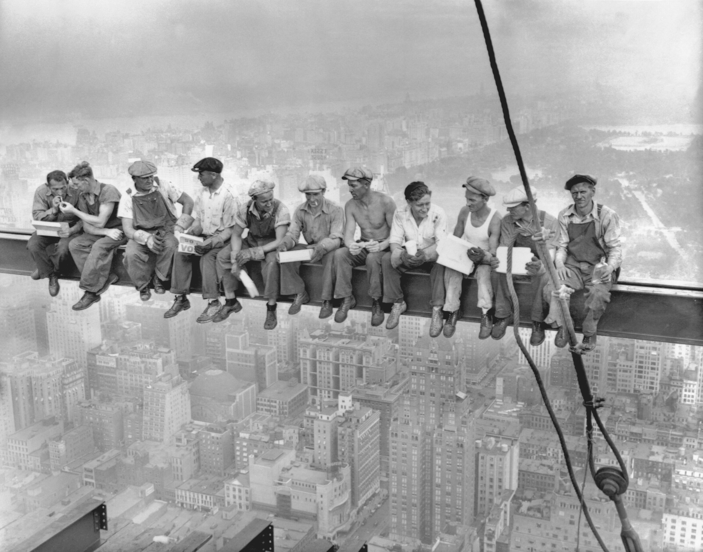
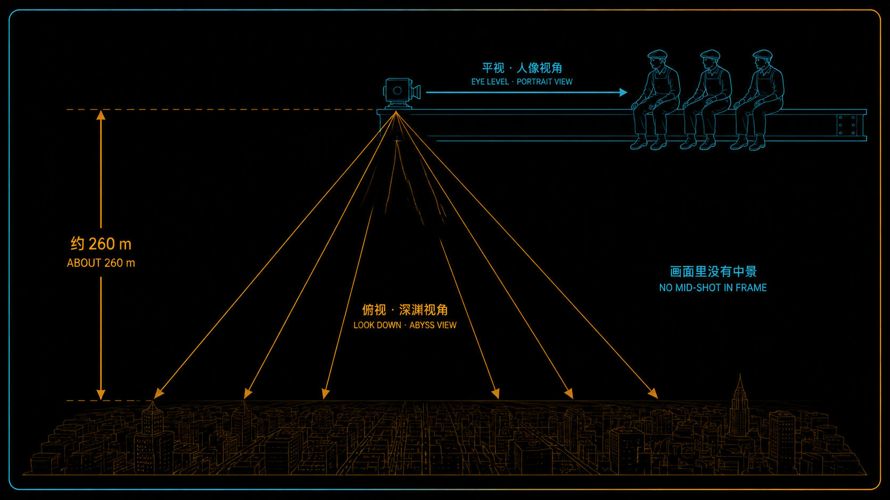
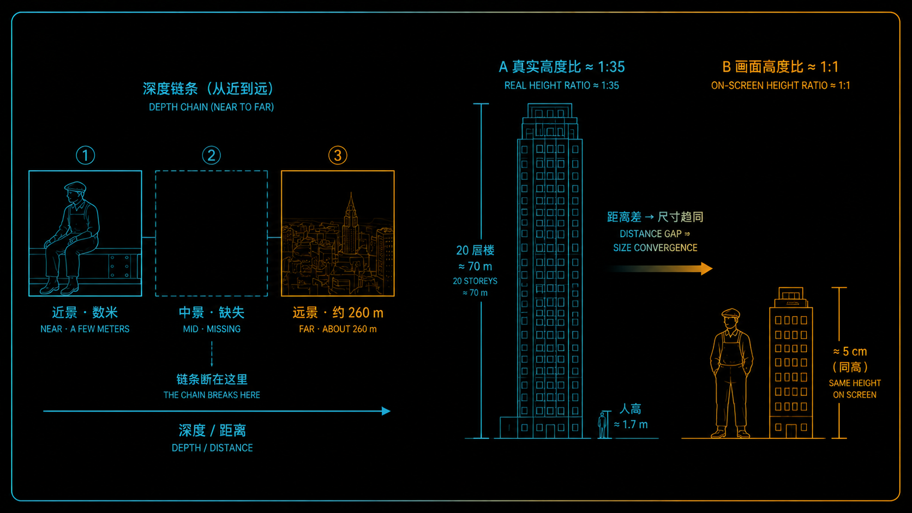
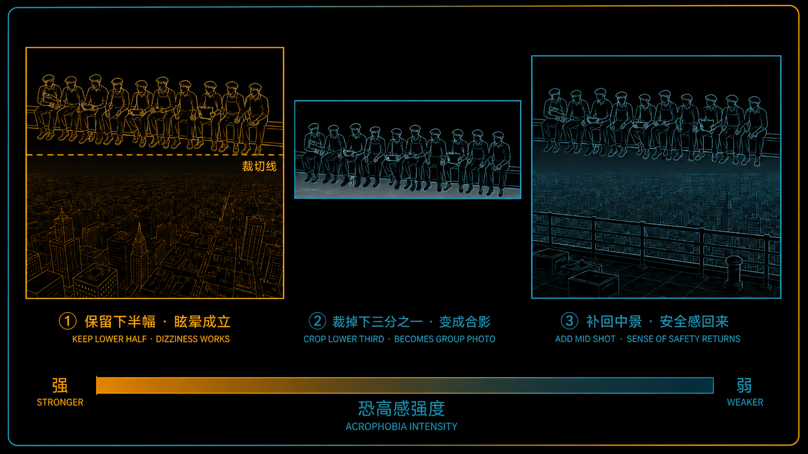

+++
title = "经典作品拆解 #12：Lunch Atop a Skyscraper（摩天楼上的午餐）"
description = "高度是真的；那份眩晕的强度，却是机位、取景和深度线索一起放大出来的。"
date = 2026-07-27
tags = ["摄影", "经典作品", "摄影史", "Lunch Atop a Skyscraper", "机位", "深度线索", "视点", "构图"]
categories = ["摄影"]
series = ["经典作品拆解"]
showTableOfContents = true
+++

> 高度是真的；那份眩晕的强度，却是机位、取景和深度线索一起放大出来的。

## 一、十一个人，一根梁，和脚下的两百六十米

1932 年 9 月 20 日中午，曼哈顿。洛克菲勒中心 RCA 大楼的钢结构刚爬到第 69 层，十一个钢结构工人并排坐在一根横伸出去的钢梁上吃午饭——有人啃三明治，有人侧过身去凑火点烟，有人摊开一张报纸，最右边那位把一只酒瓶搁在膝盖边。没有安全带，没有护栏，脚下是 850 英尺，约 260 米。

十来天后照片见了报，10 月 2 日登上《纽约先驱论坛报》的周日副刊，当时的标题朴素得像一条工地简讯：《Builders of the City Enjoy Luncheon》（城市的建造者享用午餐）。九十多年过去，它换了个名字叫 *Lunch Atop a Skyscraper*（摩天楼上的午餐），成了世界上被复制得最多的照片之一——马克杯、明信片、宿舍墙。而它最基本的两个问题至今悬着：快门是谁按的，照片里的十一个人分别是谁。

所以我们不谈轶事，谈另一个问题：你盯着它看的时候手心发紧——这份眩晕，是那根梁给的，还是这张照片给的？

*图：Lunch Atop a Skyscraper（摩天楼上的午餐），1932 年，摄于建设中的洛克菲勒中心 RCA 大楼第 69 层。本文接下来所有的拆解都指着这张图说话，建议放大了对照着读。图片来源：[Wikimedia Commons](https://commons.wikimedia.org/wiki/File:Lunch_atop_a_Skyscraper_-_Charles_Clyde_Ebbets.jpg)（公有领域，PD-US-not-renewed）*

## 二、一张为了造声势拍的照片

先把情境交代清楚，它会改变你的读法。

1932 年，大萧条正深——美国经济活动的谷底还要再过半年才到。洛克菲勒中心是当时全世界最大的私人建筑工程，而它面对的问题很朴素：这么大一片楼要建下去、要有人来租，先得让人谈论它。于是公关团队组织了一次高空拍摄，为这个工程、也为萧条里的纽约地产业造声势。那天至少有三位摄影师在场（Charles C. Ebbets、William Leftwich、Thomas Kelley），同一场还留下了工人在梁上假装打盹、互相扔橄榄球的其他帧。换句话说，这是一次有组织、有脚本的宣传拍摄，不是路过撞见。

但「摆拍」不等于「造假」，这两件事必须分开：坐在梁上的是真的钢结构工人，梁是真的梁，高度是真的高度，那个年代的高空作业也确实没有安全带。这里还有一个常被忽略的事实——**摄影师本人也在同一片钢结构上**。这个角度不可能站在对面的楼里用长焦拍到；要拍这张照片，你得先爬上去，和他们一样待在 260 米的高空。

至于署名：1998 年 Ebbets 的女儿提出这可能是父亲的作品，2003 年 Corbis 委托调查后一度采信；但随后发现同日现场还有另外两位摄影师，无法判断快门归谁，于是如今 Bettmann–Getty 的档案里，它重新变回了一张没有作者的照片。人物身份也一样悬着：长期以来获得广泛认可的只有两位——左起第三的 Joseph Eckner，和右起第三的 Joe Curtis；其余的说法（斯洛伐克、爱尔兰的家族各自认领过几位）都没有被确证。洛克菲勒中心档案管理员 Christine Roussel 在 2026 年出版的专著里，走访了大量移民与莫霍克（Kahnawake）高空铁工的后人，补上了不少线索，但结论仍然是：这十一个人到底是谁，大部分依旧没有定论。留下来的实物是一块 5×7 英寸玻璃负片，现存于档案库。

## 三、拆开这张照片

### 3.1 它在做什么

**第一，它把两套互相打架的空间线索，塞进了同一个画面。**

十一个人是被**平视**的：相机架在同一片钢结构上、和他们差不多高，所以你看到的是一排正对着你的脸、一排端正的坐姿——把背景换成食堂长桌，这就是一张普通的工间合影。但他们身后那座城市是被**俯视**的：你看得见楼顶的水箱、天台的通风口、街道细成一道缝。画面上半部分说「我在你对面」，下半部分说「我在你脚下三百米」。你的空间感在这里被撕成两半，眩晕就是从这道裂缝里冒出来的。

**第二，将近一半的画幅被让给了「脚下」。**

钢梁大约横在画面高度的一半偏上，往下接近一半的篇幅，全是密密麻麻的楼顶。这是个反直觉的取景决策：常规人像会把人放大、把无关背景压掉；这张照片反过来，肯花半张画幅去交代「下面有多远」。记住这一点，第六节我们会把它变成一个你能直接拨的开关。

**第三，画面里几乎没有一样东西告诉你「他们是安全的」。**

没有护栏，没有系在腰上的绳子。钢梁从左边框进来、从右边框出去，两端都看不到接在哪里——视觉上，它就是一根悬空的横线。天上也没有一块干净的天空：上方那一片被雾霭化开，远处的城市和天空糊成一体，你找不到一条清楚的天际线——于是也就没了远方那个空间锚点，没法据此判断相机到底往下压了多少、这根梁和脚下的城市之间又隔着多远。前景里最醒目、最有方向性的垂直元素，是那根从上方垂下来、穿过右侧、末端拖着吊钩的钢缆——它不提供支撑感，它只是一个箭头，指着下面。（脚下那片城市当然满是垂直的楼体边缘，但它们属于「远处」，不属于这几个人所在的这一层。）真正交代「这一层还有结构」的，只剩画面最下缘那两截露出来的钢梁，还看得见铆钉连接板；它们贴着下边框，和坐人的那根梁之间，仍然空着。

**而且很可能，安全的东西就在画外。** 关于这次拍摄，历史综述里有一个被普遍接受的推测：梁的下方、或者取景框之外，多半就有已经铺好的楼板、结构，甚至脚手架。这不是在拆穿谁——这些人确实在 260 米高空、确实没有安全带，这些都是真的。它说明的是另一件事：**取景本身就是一次筛选**。同一个现场，把楼板收进画面，你得到一张施工记录；把它排除在外，你得到这张照片。接下来要讲的每一条，都是这次筛选的延续。

*图：同一台相机、同一次曝光，人和城市却落在两套完全不同的观看关系里——这道裂缝就是眩晕的来源。*

### 3.2 它是怎么做到的

**第一，高度感主要是机位给的，不是焦距给的。** 我们这个系列的全局口径是：透视只由相机站在哪、离被摄物多远决定；机位不动的前提下，换焦距改变的是取景范围（连带视场与景深），而不是画面里物体之间的比例关系。桶形、枕形那类畸变则是镜头的成像误差，和「高不高」是两回事。所以这张照片的恐高感，不是靠一支广角「拉」出来的——它的前提是有人真的在 260 米高空、就在同一片钢结构上按下了快门。焦距当然仍然有事可做：正是它决定了站在这个机位上，能不能同时框下十一个人和脚下那么大一片城市。但顺序不能颠倒——**先有机位，才谈得上取景**。这条最不浪漫，也最重要：这种画面没有镜头捷径，你得上去。

**第二，你的大脑拿人当尺子，量出了一个吓人的数。** 看画面里任意一个工人，再看他脚下任意一栋二十层的公寓楼——在这张照片上，两者的高度差不多。可现实里，一个人和一栋二十层楼的高度比大约是 1:35。视觉系统对「人有多大」这件事熟得不能再熟，它会立刻拿这把尺子去反推：能把 1:35 压成大致 1:1，那栋楼得远到什么地步？答案就是那份失重感。相对尺度（relative size）是最古老也最强的深度线索之一，这张照片把它推到了极限。

顺带一提，连这排人自己都带着纵深，而证据不在人身上（人的身高、坐姿、朝向各不相同，靠比大小并不可靠），在梁上：右端能看见顶面那道宽亮的翼缘、和它下方厚实的腹板；越往左，整根梁收成一条细线。梁在向左后方退去——连这条看似平直的「横线」，也是斜插进画面深处的。

**第三，深度线索链在中间断了一节。** 一张正常的风景照有前中后景，一层压一层（这叫遮挡关系），你的眼睛沿着这条链子一格一格走到远处，距离是「数」出来的。这张照片没有中景：从钢梁（近在眼前）直接跳到脚下的城市（两百多米），中间是空气。链子一断，大脑没法数，只能靠尺度差一次性外推——**外推出来的距离，永远比数出来的更吓人**。这也解释了一个日常经验：站在天台边缘往下看，比坐在缆车里往下看晕得多；缆车有缆绳、有塔架，一节一节把距离老老实实交代清楚了。

*图：近景是梁上的人、远景是 260 米下的城市，中间一格不剩。大脑数不出距离，就拿「人」当尺子去外推——真实约 1:35 的人楼比，在画面上被压成大致 1:1。*

**第四，也是最容易被漏掉的一条——下面必须是清楚的。** 这张照片里，近处工人工装上的褶子是清楚的，两百六十米下的街道、屋顶水箱、店铺招牌也是清楚的。往画面左上找，快一公里外 Central Park South 上 Essex House 楼顶的招牌字母都还认得出来（我们看到的是招牌背面，字是反的）。现存的原件是一块 5×7 英寸玻璃负片，属于大画幅；至于镜头和光圈，档案里没有留下记录，我们只能从成片反推：要让近处的人和快一公里外的招牌同时可读，拍摄时很可能把光圈收得比较小，并把对焦点安排在能兼顾远近的位置——白天户外足够强的光，让这种拍法成立。

为什么这条要紧？做个反事实：把焦点放在人物上、光圈开到很大，脚下那片细节就会松掉、化成一片柔和的灰——十一个工人立刻退回成一张风格化的工人合影，脚下那座城市变成一块「背景板」。**恐惧需要证据**。你得看清下面那些窗户、那些车、那些屋顶，你的大脑才会认真计算「掉下去要多久」。虚化会把危险抽象掉，而抽象的东西不吓人。

**第五，影调把画面切成了两层——而且这一层还被人为推了一把。** 十一个人穿深色工装，钢梁也是深的，在浅灰的城市上连成一条几乎不断的黑带；视觉系统会自动把靠得近、长得像的东西读成一个整体，于是「人 + 梁」成了一个单一的、实心的图形。这条黑带越完整、越「实」，它下面那片灰蒙蒙的东西就越「空」。有意思的是，这道分离可能不全是现场光比的功劳：Getty 对这块底片的著录里提到，人物周围有做在底片上的减淡痕迹（on-negative dodging）——不过同一条著录也记着破裂、乳剂剥落与变色，所以谨慎的说法是：这道边界很可能在暗房里被推过一把，至于是不是专为了把人从城市里拉出来，档案没说。再加上远处的城市因为空气透视（aerial perspective）对比更低、更发白，脚下近处的楼更黑更实，这道对比梯度又悄悄补了一层「越往画面上方越远」的距离线索。（本节所有影调判断，依据的都是开头那一版 Commons 扫描；原底片已经破裂、剥落，不同扫描版本的局部对比会不一样。）

## 四、它在摄影史里的位置

短期看，这是一次成功得有点过分的公关。照片和同场其他几帧一起被通讯社发出去，把高空的钢结构工人塑造成了一种美国式形象——不是萧条年代的受害者，是坐在城市之巅、吊着腿吃三明治的人。一条题为「城市的建造者享用午餐」的图片新闻，最后长成了一个时代的自画像。同一时期 Lewis Hine 正在拍帝国大厦的建造者，两者的视觉语言近到这张照片长期被误挂在他名下；但 Hine 那批照片是有明确社会立场的纪实工程，而这一张，出身是宣传。

长期看，它成了「把高度当景观」这套视觉语言流传最广的样板。今天我们还在用同一组线索：玻璃栈道上的自拍、无人机贴着楼顶俯冲下降的开场镜头、挂在攀爬者胸口的 GoPro——人在近处清楚，深渊在下方可读，中间尽量不给。工具换了几轮，这三件事没变。2023 年洛克菲勒中心干脆把它做成了付费项目：游客系上安全带、坐进 69 层观景台上的一根复制钢梁，被抬高约十二英尺、缓缓转过 180 度——高度和危险都换成了可控版，构图照旧。一张照片长成一门生意，大概是影响力最实在的证明。

我的立场是：这张照片最容易被误读的地方，是把它当「大萧条纪实」来纪念——它出身宣传，是被组织出来的；而它被低估的地方，是作为视觉工程的完成度。早在 1932 年，它就把「怎么用一张二维图像触发身体反应」这件事做得相当彻底，以至于今天的无人机和 GoPro，用的还是同一组线索。

## 五、与主线的接口

**如果你想深入……**

这张照片的核心决策对应我们摄影主线的「构图几何与注意力预算」模块：

- **[#2-8] 透视投影（Projection）：把构图从 2D 拉回 3D** — 讲了透视由拍摄距离/机位决定、焦段更多是取景与裁切工具，以及前中后景的相对尺度、汇聚与遮挡如何改写画面权重。这张照片的恐高感，就是「机位」这一个变量被拉满的结果。
- **[#2-13] 层次与深度线索：前/中/后景的信息分层** — 讲了遮挡、相对尺度、明度与对比梯度、空气透视各自提供什么深度索引。本篇是它的反用法：故意把中景抽掉，逼大脑只能靠尺度差外推。
- **[#2-9] 焦段与「压缩感」的真相** — 讲了广角「夸张」、长焦「压缩」到底怎么回事：为了同框，广角往往靠近、长焦往往远离，真正在起作用的是距离。读完你就知道，为什么「这是广角拍的吧」是个误判。

读完这些，你对 *Lunch Atop a Skyscraper* 的理解会从「看过」变成可操作的拍摄认知。

## 六、对今天的启示

**第一，想拍高度，先解决机位，再想构图。** 高度感没有镜头解法。真要拍，得让相机到得了边缘外侧（今天最现实的工具是无人机），让画面里出现的是「脚下」而不是「远处」。有个简单的自检：下半幅里能不能看见屋顶。看得见屋顶，观众就知道镜头在往下看；如果镜头再往下压，建筑的垂直线开始向下收敛，俯视感会更强。

**第二，把近处主体和下方细节同时拍清楚。** 拍这类画面别习惯性地开大光圈。它的力量来自「下方可读」：街道、车、屋顶要看得出是什么。全画幅可以从 f/8–f/11 起步，对焦点在最近和最远的关键主体之间折中，实在兼顾不了就分两次对焦做景深合成；手机则记得关掉人像模式、用主摄拍，别让算法替你把背景糊掉。把景深花在纵深上，比花在虚化上值钱得多。

**第三，把中景当成一个可以主动删掉的变量。** 想强调悬空，就把栏杆、天台边沿、缆绳这些交代支撑的东西挪出画外，或者让近景元素两端直接出画（就像那根钢梁）——说的是取景，不是让你翻过护栏：该站在合法观景台就站好，够不到的角度交给长杆、遥控快门或合规飞行的无人机；想让画面变安全、可亲近，就把中景补回来——加一层屋顶、一段护栏，眩晕立刻降档。这是个双向开关，不是单向技巧。

*图：同一张底片，三种裁法。留住下半幅的「脚下」，眩晕成立；裁掉下三分之一，它退回成一张工人合影；把中景补回来，安全感立刻回来。*

## 七、写在最后

读这篇之前，你大概觉得这张照片吓人，是因为「他们真的坐在 260 米高的梁上」。他们确实坐在那儿，风险也确实存在——这一点不需要打折扣。但高度只是原料。真正把这份高度加工成你手心里那层汗的，是一串具体的视觉决策：相机与人齐平、城市落在脚下、中景被抽空、下方保持清晰、半张画幅让给深渊，而所有能交代「安全」的东西——包括很可能就在画外的那块楼板——全被留在了框外。换个机位、把脚下拍虚、裁掉下三分之一，同样的高度会立刻变得平淡。**危险是真的，眩晕的强度是被放大的**；这两句话同时成立，而摄影师干的活，正好都在第二句里。

说到「加工」，这张照片还有另一重身份：它是为造声势拍的宣传照，却成了大萧条最著名的集体记忆之一。下一篇我们去 1936 年的加州尼波莫，一个豌豆采摘者营地边的破棚子前，看 Dorothea Lange 的 *Migrant Mother*（移民母亲）。它同样不是「偶然抓到的真实」：Lange 在那个棚子前只拍了几帧，一步一步走近，最后被全世界记住的只有一张，她甚至事后修掉了底片角落里一根碍事的拇指。如果说这一篇是「摆出来的纪实」，下一篇就是「选出来的纪实」——而她凭什么选中那一张？答案要从「观众的注意力是怎么被分配的」讲起。

## 参考资料

- [Lunch atop a Skyscraper — Wikipedia](https://en.wikipedia.org/wiki/Lunch_atop_a_Skyscraper)（拍摄日期、楼层与高度、发表、署名争议与底片保存的综述来源）
- [File: Lunch atop a Skyscraper — Wikimedia Commons](https://commons.wikimedia.org/wiki/File:Lunch_atop_a_Skyscraper_-_Charles_Clyde_Ebbets.jpg)（本文所用原图，公有领域 PD-US-not-renewed）
- Christine Roussel, *Lunch on a Beam: The Making of an American Photograph*, Brandeis University Press, 2026 —— 洛克菲勒中心档案管理员所写，目前关于这张照片最系统的研究：拍摄组织方式、摄影师与钢结构工人群体、移民与原住民社区的背景
- [Behind the Photo: Lunch Atop a Skyscraper — HISTORY](https://www.history.com/articles/lunch-atop-a-skyscraper-photo-1932)（原始报刊标题、两位身份获广泛确认、以及「画外很可能有楼板或脚手架」的出处）
- [Lunch Atop a Skyscraper Photograph: The Story Behind the Famous Shot — Smithsonian Magazine](https://www.smithsonianmag.com/history/lunch-atop-a-skyscraper-photograph-the-story-behind-the-famous-shot-43931148/)（摆拍性质与同场其他帧）
- [The original 5" x 7" glass negative — Getty Images / Bettmann](https://www.gettyimages.co.uk/detail/news-photo/the-original-5-x-7-glass-negative-of-the-famous-news-photo/515384124)（底片规格，以及「人物周围有在底片上做的减淡加工」的著录）
- [The History of the 'Lunch Atop a Skyscraper' Photo — Rockefeller Center](https://www.rockefellercenter.com/magazine/arts-culture/lunch-atop-skyscraper-irish-immigrants/)（官方视角的流传史，以及 2023 年起复刻这张照片的高空体验项目）
- 纪录片：*Men at Lunch*（2012，Seán Ó Cualáin 导演）——追查照片中工人的身份与爱尔兰移民线索；片中提出的多数身份认定至今仍未被确证
- 同场其他帧（工人在梁上假装小憩的 *Resting on a Girder* 等）由 Bettmann 档案 / Getty Images 授权，可在 Getty 图库检索查看

> **署名与摄影师：** 这张照片目前没有确定作者。它长期被归到 Charles C. Ebbets（1905–1978）名下——他 1932 年确实担任洛克菲勒中心的摄影主管，其女儿于 1998 年提出这一归属，Corbis 在 2003 年调查后一度采信；但随后查明 William Leftwich 与 Thomas Kelley 同日也在现场，无法确定快门归谁，于是 Bettmann–Getty 如今将其标为作者不详。更早的年代，它还常被误挂在社会纪实摄影家 Lewis Hine 名下——Hine 拍过帝国大厦的建造者，但与这张无关。
