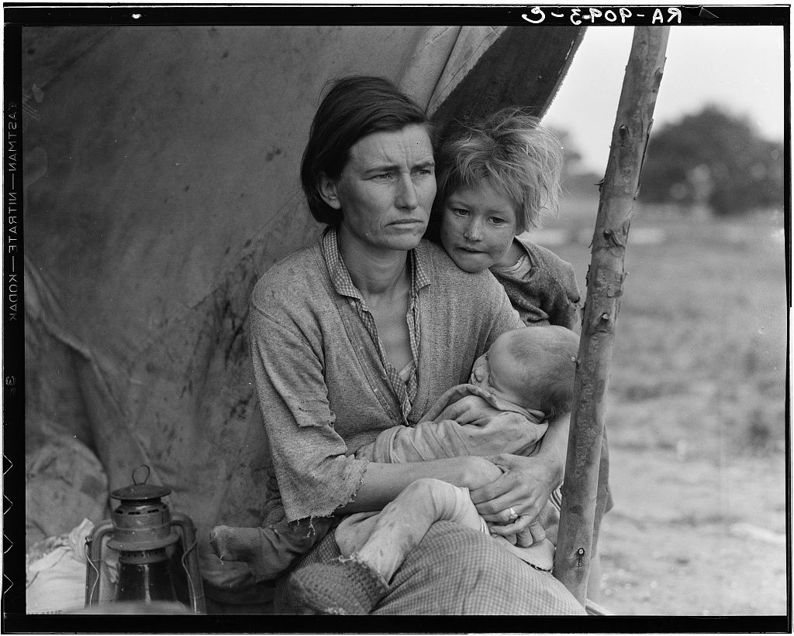
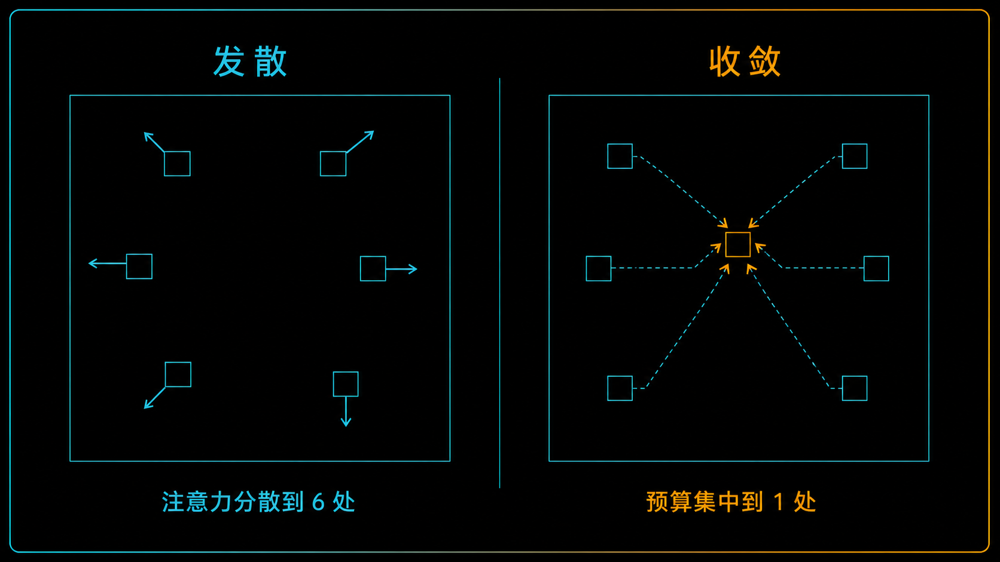
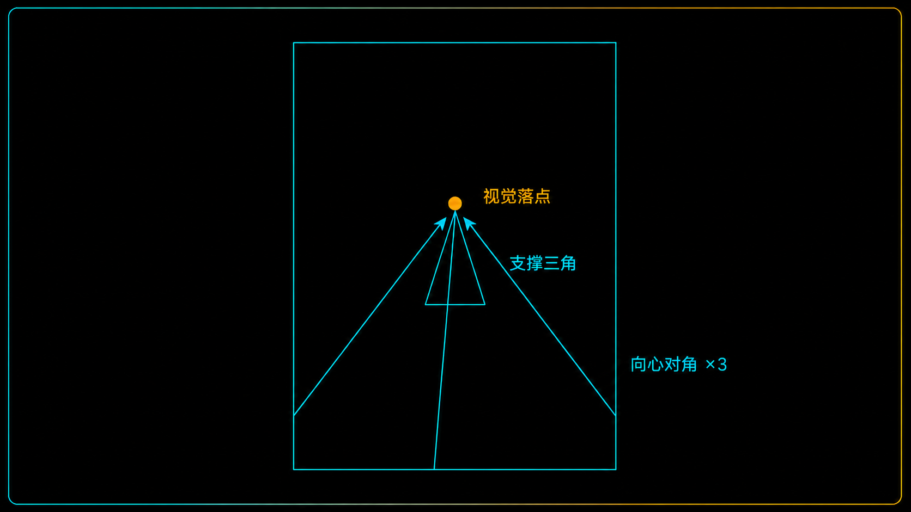
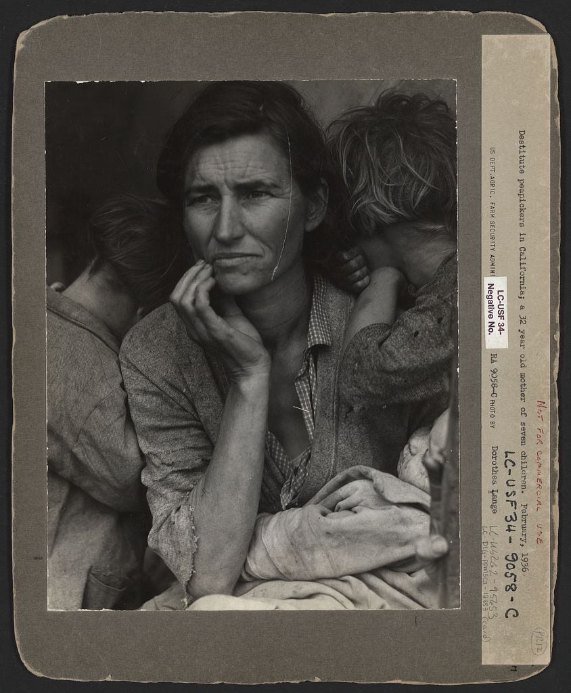
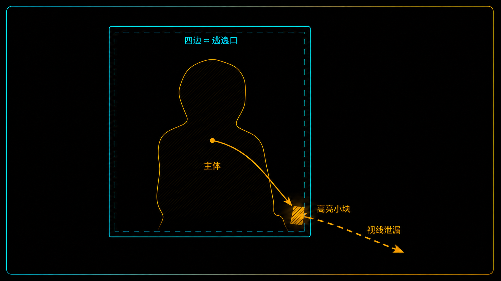
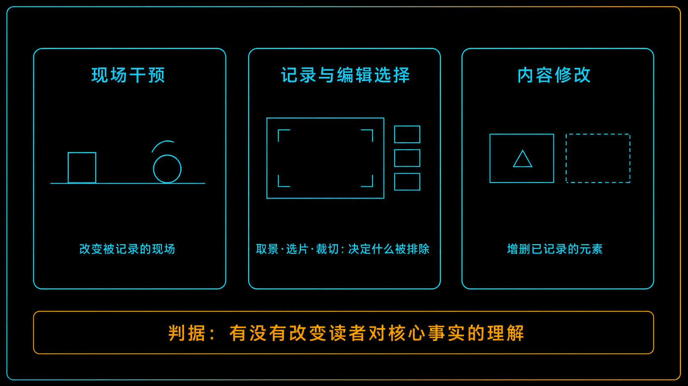

+++
title = "经典作品拆解 #13：Migrant Mother（移民母亲）"
description = "贫困是真的，但这张照片的说服力不产生于快门那一下——而产生于之后的选、修与配文。"
date = 2026-08-01
tags = ["摄影", "经典作品", "摄影史", "Migrant Mother", "Dorothea Lange", "纪实摄影", "FSA", "选片"]
categories = ["摄影"]
series = ["经典作品拆解"]
showTableOfContents = true
+++

> 贫困是真的，但这张照片的说服力不产生于快门那一下——而产生于之后的选、修与配文。

## 那块一闪而过的木牌

据 Lange 自己 1960 年的回忆：1936 年 3 月，加州 101 号公路，她正往家开，路边闪过一块粗糙的木牌，写着「豌豆采摘者营地」。她没停，又开了二十英里，一路说服自己可以继续往前，然后在空荡荡的公路上掉了个头。

营地里滞留着两千多人。一场寒潮把整片豌豆冻死，活儿一夜之间没了。她在一个用帆布支起来的窝棚前停下，拍了几张，前后大约十分钟，没问对方的名字，走了。

这段回忆是几乎所有转述的源头——但它写于二十四年后，和档案对不上。真正值得拆的也不是「她拍到了什么」，是那十分钟里的其他几张：今天几乎没人见过。

*图：「Migrant Mother」（移民母亲），Dorothea Lange 摄于 1936 年 3 月，加州 Nipomo。这是修版之后的底片（LC-USF34-9058-C）。留意画面右缘那根帐篷支柱——它是本文后半程的关键。图片来源：美国国会图书馆 FSA/OWI 收藏。*

## 十分钟，一台 4×5

先把机构说清楚：Lange 当时受雇于安置管理局（Resettlement Administration），次年才改组为更为人熟知的农业安全管理局（FSA）。严格讲，快门按下时「FSA 摄影」还不存在——今天档案归在 FSA/OWI 名下，那是后来的归档结果。

设备是一台 Graflex，底片 4×5 英寸。大画幅的节奏和小相机是两回事：每张都要抽暗板、曝光、插回，标准双面片夹装两张，拍完就得换下一只（也有装六张的 Grafmatic，这次用哪种没有记载）。总之不是从连拍里挑一张——每次曝光都是单独的决定，十分钟里做了至少七次。

被拍的这家人只是路过。车抛锚了，两个大儿子进城修散热器，剩下的人被困在营地。

## 这张照片在做什么：把预算压到一个点上

**它把整个画面的注意力预算，压缩到了单一目标上。**

要看清这件事，最快的办法是看同一个窝棚前的另一帧：

*图：同一场景的另一帧（LC-USF34-9093-C）。同一位母亲、同一家人、同一个下午——但视线有五六个去处。图片来源：美国国会图书馆 FSA/OWI 收藏。*

斜拉的帐篷布、一根很亮的支柱、一盏马灯、身后开阔的田野，还有一个直视镜头的女孩——每一样都在要一点注意力。这是一张信息更多、交代更完整的照片，也正因如此，它不「疼」：视线在里面转，找不到该停在哪。

回到那张经典的：背景被压成一块没有信息的帆布，田野、马灯、天光全部出局；两个大孩子把脸埋进母亲的肩，只留后脑；怀里的婴儿睡着。

**三个孩子都在画面里，却没有一个跟镜头建立眼神联系。** 睁着眼、望向画外的只有母亲一个。高权重目标于是只剩一个：她的脸，和撑在下颌的那只手。

**而观众永远不会知道她在看什么。** 这不是「眼神忧郁」能说清的事，是一个结构性的悬置：视线出框却不给答案，注意力没有出口，只能原地循环。照片看完了，事情没完。

*图：同场景两帧的注意力分配对比——发散 vs 收敛。*

## 它是怎么做到的：选择、减法，和一根被抹掉的拇指

### 它不是「撞见」的，是从多帧里选出来的

先纠正一个流行的误会：这不是走过路过、抬手就中的照片。把已知的几帧摆在一起看，人数、位置、机位都不一样——有远有近，还有从侧面拍的。所以经典那一帧是**编辑意义上的终点**：它是被挑出来、被放出去的那张。至于它是不是时间上的最后一次曝光，现有档案答不了——底片编号是事后编的，这一点后面还会再遇到。

她当时具体做了什么——有没有开口让孩子转过身、让母亲把手抬起来——这次拍摄**没留下任何现场笔记**，无从还原。能确定的只有：现场的组合在变，而她在持续做选择。

**营地里的贫困是真实的，画面的构成是被建构的——两件事不冲突。** 承认后者，不等于指控前者造假。

刚才那三样——没有信息的背景、两张转开的脸、一个睡着的婴儿——凑在一起是同一个动作：减法。构图在这里不是「把主体放在哪个点」，而是先决定谁不许出现。

> 一张画面能承载的注意力是有预算的。你不做减法，读者就替你做——而他们做减法的方式是干脆不看。

### 手—脸三角：这是结构，不是表情

她的右手撑在下颌上，小臂几乎垂直，手肘落在画面下缘。这只手做了两件事：在脸下方架起一个三角，把视线锁在脸的下半部——眉头、眼睛、抿住的嘴唇都在这个开口里；同时把小臂变成一条从底部升上来的斜线，与两个孩子倾斜的肩线构成三条指回中心的对角。

把手拿掉想象一下：脸会立刻失去支点，整张图会松开。这只手是承重结构。

*图：手—脸三角与三条向心对角构成的几何骨架。*

### 那根拇指为什么必须消失

现在回到画面右缘那根帐篷支柱。

国会图书馆同时保存着两个版本：修版后的底片（所有人见过的那张），和未修版的印样（LC-DIG-ppmsca-12883）。差别只有一处——未修版的右下角，有一截拇指扶在支柱上。

*图：未修版印样（LC-DIG-ppmsca-12883）。画面右下缘、贴着帐篷支柱的位置有一截拇指——它在通行版本里被直接从底片上抹掉了。图片来源：美国国会图书馆。*

这根拇指为什么非死不可？它同时踩中三条：明度高（浅色皮肤压在深色支柱上）、形状孤立（认得出来却接不上任何身体）、位置贴边。画框四条边本来就是注意力最容易漏出去的地方，高对比小块贴在那儿，视线会被反复拽过去，顺着边缘滑出画面。

*图：为什么边缘的高亮小块最致命——注意力逃逸口。*

处理方式不是裁切，是照片流传开之后，Lange 让助手直接在底片上把它修掉。她的上司 Roy Stryker 明确不满——在他看来，这一刀损害的不只是一张照片，而是整个纪实项目的可信度。所以「当年没这个讲究」并不成立：**成文的规范还没有，争议当场就有了。**

这也逼出一件必须分清的事。摄影里「生产意义」的动作不止一种，它们改动的对象并不相同：

- **现场干预**（让谁站哪、看哪里）——改变的是被记录的现场本身
- **记录与编辑选择**（取景、选片、裁切）——不虚构框内的任何东西，但决定了什么被排除在外、留下的画面处在什么上下文里
- **内容修改**（抹掉一根真实存在的拇指）——增删已经被记录下来的元素，改的是「照片声称这里有什么」

这三类不是从轻到重的阶梯，别急着排名次。一次误导性的裁切——把冲突现场裁得只剩一方动手——完全可能比修掉一根拇指严重得多。真正的判据是另一个：**这次改动，有没有改变读者对核心事实的理解。**

按这条看那根拇指：它改的是画面的整洁度，不是「这家人有多穷」。所以这一刀在构图上有效、在纪实伦理上有代价，两件事同时成立——而代价不在于它误导了谁，恰恰在于 Stryker 担心的那件事：一旦「可以动已记录的内容」这个口子开了，整批照片的担保就不再成立。

*图：三类「生产意义」的动作——改动对象不同，不构成从轻到重的排名。*

### 五张、六张，还是七张

1960 年，Lange 在《大众摄影》上回忆那十分钟，写了这么一句：她拍了五张，从同一个方向越走越近。

档案对不上。国会图书馆藏有五幅，另有两幅「中距离、从侧角拍摄」的从未入藏。很长时间通行的说法是六张；直到本世纪初，奥克兰博物馆又在 Lange 档案里认出第七幅——一张接触印样，原底片被认为已遗失。国会图书馆还留了一条更要命的说明：底片编号系事后在安置管理局编定，**没法据此判断拍摄顺序**。

我不认为这是撒谎。她儿子 Troy Owens 评价 Lange 另一处记述时说得挺准：「我不觉得她在撒谎，只是把两个故事记混了。」更可能的是：一张照片一旦成为杰作，会反过来重写作者的记忆，把当时的犹豫、试错、换机位，追认成一条干净的、朝杰作收敛的直线。

> 你以为你记得自己怎么拍的。你记得的其实是成片替你编好的版本。

## 它在摄影史里的位置

**短期**：1936 年 3 月 10 日《旧金山新闻》先登了这组里的两张，次日登出这一帧，配社论《「新政」对这位母亲和她的孩子意味着什么？》。同一天《洛杉矶时报》报道，州救济署将向 Nipomo 的两千名采摘工发放口粮；后来流传更广的版本是「联邦政府运去两万磅食物」——机构与数量各家记载不一，能确定的是救济很快到了，而食物到时这家人已经离开。它救的从来不是画面里的那个人。

**长期**：它成了此后人道主义传播里最有影响力的母子苦难图式之一——以单一可识别人物为核心、近景、弱化背景、匿名化。这个图式不是它发明的，却经它反复复用，一直用到今天的募款影像和灾难报道封面。连问题也一并传了下去：被拍的人成了符号，代价是失去名字。

Lange 没问她叫什么。原始说明只有一句：「加州赤贫的豌豆采摘者。七个孩子的母亲。三十二岁。」于是几十年里公众默认画面里是一位白人「尘暴难民」母亲——她其实是切罗基人后裔，生于当时的印第安领地。符号化抹掉的不只是名字，还有她的来处。

四十二年后，Florence Owens Thompson 写信给《Modesto Bee》认领了这张脸，说自己觉得被利用了——「她没问我的名字。」（Lange 转述的卖轮胎换食物一节，家属否认，至今有争议。）不对称主要不在版税：这是政府项目的影像，Lange 不持有版权，也没从报刊转载和公共复制里拿到分成。但照片给她带来的声望与职业收益是实打实的，和 Thompson 得到的东西放在一起，天平从来没平过。更倾斜的是知情、署名与叙述权——她成了那张脸，却始终没机会讲自己的版本。

所以我认为它真正的价值不在于「最能代表大萧条」，而在于它留下了一批异常丰富、却并不完整的证据：不同的帧、修版前后的两个版本、原始配文、报纸记录，以及互相冲突的几方回忆。缺口本身也在说话——没有现场笔记，两幅不在馆藏，一张底片遗失，顺序无从判断。**但正是靠这些对得上和对不上的东西，纪实的权威感如何被一步步生产出来，才变得可以具体拆解。**

## 如果你想深入……

这张照片的核心决策对应我们摄影主线的「构图几何与注意力预算」模块：

- **#2-1 构图的本质：注意力预算的调度** — 为什么「注意力有限」是构图的第一性问题
- **#2-2 三大权重旋钮：明度 / 局部对比 / 色彩强度** — 那根拇指凭什么抢戏
- **#2-10 边缘管理：四条边是「注意力逃逸口」** — 为什么贴边的高亮小块最致命
- **#2-15 裁切是二次调度：重新分配预算与改写路径** — 拍完之后还能改什么

以及「叙事与编辑」模块的**选片原则：功能性 > 审美性**与 **Contact Sheet：印样＝代码审查**——它们解释了为什么「选」是独立工序，而不是拍摄的附属品。

## 对今天的启示

**第一，把「选」当成独立工序。** 拍完不要当场挑，隔一天再打开，标准换成一句话：「哪一张只说一件事？」——不是「哪一张最好看」。9093-C 交代得更完整，但要传达一件事，赢的是那张什么都不交代的。

**第二，成片前做一遍减法审计。** 从四条边往里扫，逐个问「这个元素在争夺什么」，重点查贴边的高明度小块——反光、露出半截的手、角落的亮斑。避不掉的裁掉或压暗，这不是作弊，是构图的最后一步。

**第三，把那条线画在自己身上。** 引导姿态前先问一句、取得同意；无论后期怎么调，永远留一份没有增删过内容的原始文件。前者关乎被拍的人，后者关乎你自己——照片可以修，档案不能。

## 收尾

读之前，你大概会觉得这是一张「抓拍到了神情」的照片：对的时间、对的地点、一个伟大摄影师的直觉。

读完之后，画面没变，但链条露出来了：营地里的贫困是真的，而画面里的每一个元素都经过筛选——远近侧角拍了一批、只放出一帧，背景堵死，两张脸转开，一根拇指抹掉，配文没给名字。**真实的处境和被建构的画面可以同时成立——理解了这一点，你才算真的看懂纪实摄影。**

那么，另外那几帧到底长什么样？

下一篇我们把整组底片摊开—— *Destitute Pea Pickers* （流离失所的豌豆采摘者）。同一个窝棚、同一个下午，那些被留在暗房里的帧：看编辑的手怎么挑出唯一的那张，也看看被丢掉的究竟丢掉了什么。

## 参考资料

- **作品权威页面**：[Destitute pea pickers in California. Mother of seven children. Age thirty-two. Nipomo, California](https://www.loc.gov/resource/fsa.8b29516/)，美国国会图书馆 Prints & Photographs Division，馆藏编号 LC-USF34-9058-C。该馆声明此系列无已知使用限制。
- **整组图像的档案说明**：[Dorothea Lange's "Migrant Mother" Photographs in the Farm Security Administration Collection](https://guides.loc.gov/migrant-mother)，国会图书馆研究指南。其中[「Migrant Mother Series of Images」一页](https://guides.loc.gov/migrant-mother/images)列出馆藏五幅的编号与说明，注明另有两幅从未入藏，并明确底片编号系事后编定、无法据此判断拍摄顺序。
- **第七幅的发现**：[Migrant Mother, Nipomo, California](https://dorothealange.museumca.org/image/migrant-mother-nipomo-california-7/A67.137.96897/)，奥克兰博物馆（OMCA）Dorothea Lange 档案，藏品号 A67.137.96897——该馆记录称此为本世纪初在馆藏中发现的第七幅，来自一张原底片可能已遗失的接触印样。
- **Lange 本人的回忆**：Dorothea Lange, "The Assignment I'll Never Forget: Migrant Mother," *Popular Photography*, 1960 年 2 月。「我拍了五张，从同一个方向越走越近」一句出自此文。
- **关于 Florence Owens Thompson 与家属证词**：Geoffrey Dunn 于 2002 年在 *San Luis Obispo New Times* 发表的调查报道，是家属说法最完整的一手来源；另可参考 [Migrant Mother 条目](https://en.wikipedia.org/wiki/Migrant_Mother)与 [Florence Owens Thompson 条目](https://en.wikipedia.org/wiki/Florence_Owens_Thompson)。
- **摄影师**：Dorothea Lange（1895—1965），生于新泽西州霍博肯，早年在旧金山经营人像影楼，1930 年代起转向社会纪实，先后受雇于安置管理局与农业安全管理局；二战期间拍摄日裔美国人拘禁营，该批作品当时遭军方扣押。延伸阅读推荐 Linda Gordon 的传记 *Dorothea Lange: A Life Beyond Limits*（2009），以及纪录片 *Dorothea Lange: Grab a Hunk of Lightning*（2014）。
