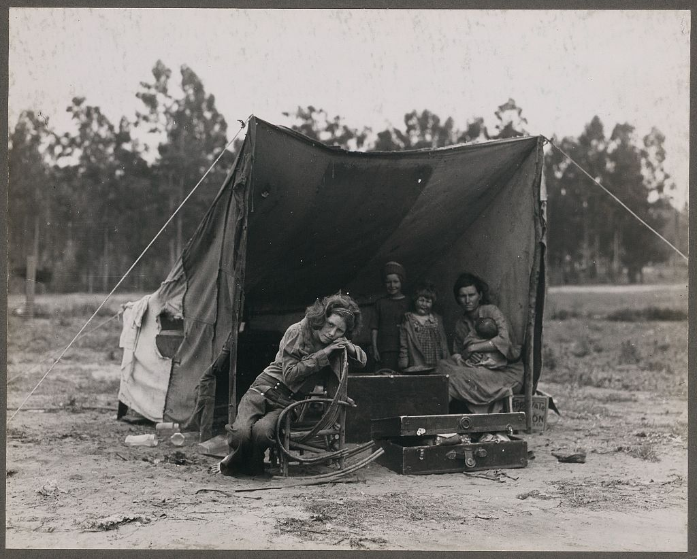
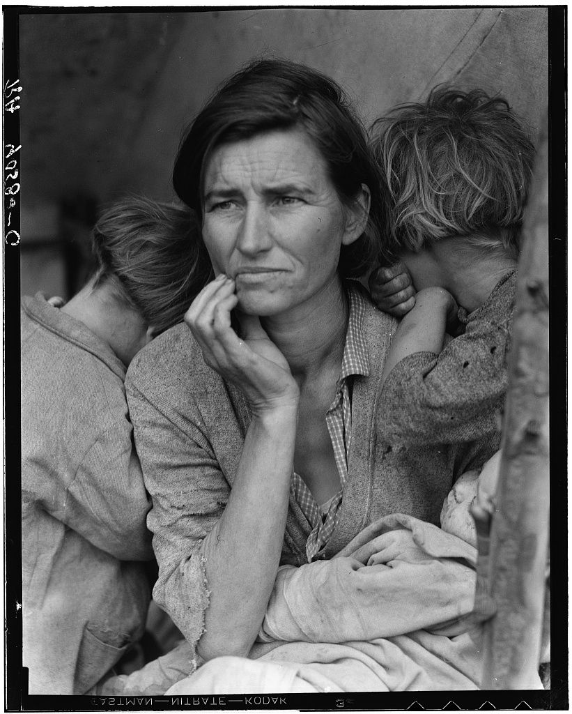
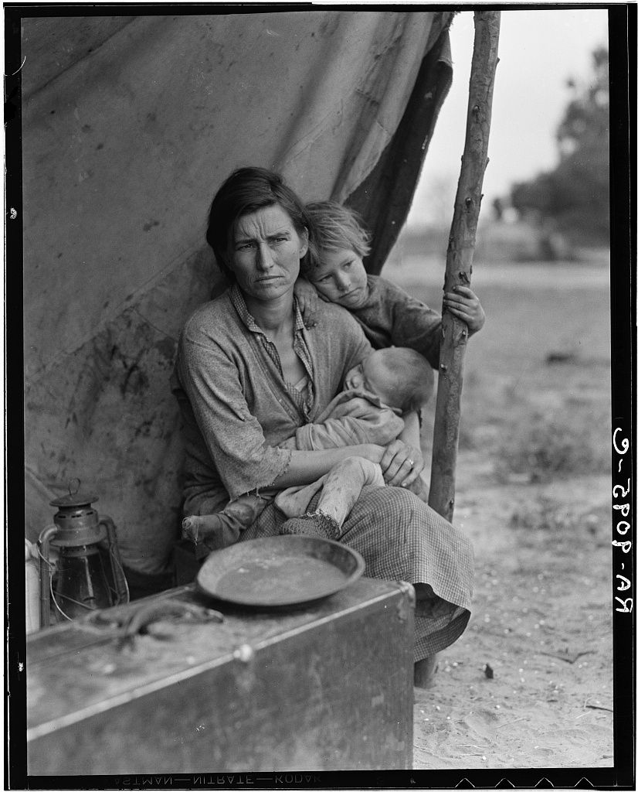
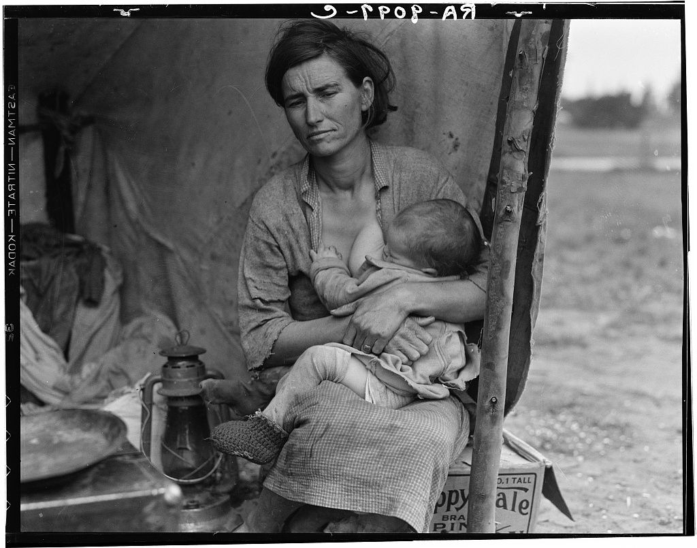
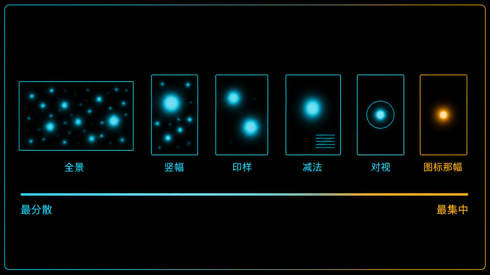
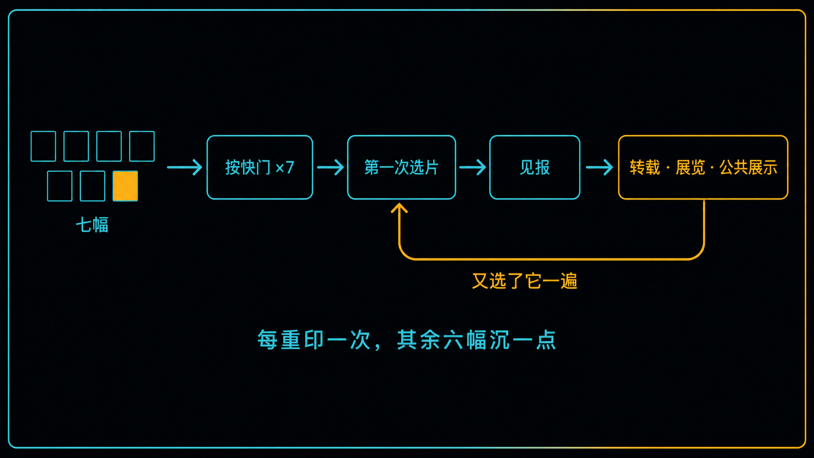

+++
title = "经典作品拆解 #14：Destitute Pea Pickers（流离失所的豌豆采摘者）"
description = "同一个下午拍了七幅，其中一幅后来远远盖过了其余六幅——差别落在哪儿，比「它多好」更值得拆。"
date = 2026-08-09
tags = ["摄影", "经典作品", "摄影史", "Dorothea Lange", "Migrant Mother", "Contact Sheet", "选片", "FSA"]
categories = ["摄影"]
series = ["经典作品拆解"]
showTableOfContents = true
+++

> 同一个下午拍了七幅，其中一幅后来远远盖过了其余六幅——差别落在哪儿，比「它多好」更值得拆。

## 没有标题的那几张

国会图书馆放这组照片的页面很朴素：一张图，下面一行编号；再一张，再一行编号。

第一张所有人都认识。往下翻，第二、第三、第四、第五张——同一位母亲、同一顶帐篷、同一个下午，你大概一张都没见过。其中一张里她正低头哺乳；另一张里一个小女孩抓着帐篷杆，直勾勾地看着镜头；还有一张干脆退到几十步外，把整顶帐篷和一家人一起装进画面。

这些底片没有被销毁，也没有被藏起来，有两幅当年就见了报。它们只是没有变成后来那个图标。

上一篇的结论是：纪实照片的权威感产生于拍完之后的选与修。这一篇把话说完——把七幅并排摊开，回答一个更准确的问题：**为什么最后只有一幅站住了。**

## 十分钟，七次单独的曝光

1936 年 3 月，加州 Nipomo，一个滞留着约两千人的豌豆采摘者营地。Dorothea Lange 当时受雇于安置管理局（Resettlement Administration），在一顶帆布窝棚前停留了大约十分钟。

设备是一台 Graflex，底片是 4×5 英寸散页片——边缘至今能读出 "EASTMAN—NITRATE—KODAK" 的字样。散页片一次曝光消耗一张独立底片：插片盒、抽暗板、曝光、复位，再翻面或换片盒。它不像卷片相机那样能连续过片，每按一次都是一笔单独的开销。

这七幅如今散落在两个机构：国会图书馆藏五幅；另外两幅"中距离、从侧角拍摄"的从未入藏，留在奥克兰博物馆的 Lange 档案里——其中一幅直到本世纪初才被认出来，是一张接触印样，原底片被认为已经遗失（在那之前，通行的说法一直是六张）。

还有两件事得先说清。第一，底片边缘那串手写的 "RA-9058-C" 是事后在安置管理局编上去的，国会图书馆明确声明：**无法据此判断拍摄顺序**。第二，FSA 书面记录里与这组照片相关的扩展说明至今没有找到——没有现场笔记，我们不知道她当时说过什么、要求过什么。

## 这组底片在做什么

**第一，这七幅不是同一张照片的七个版本，是七种不同的说法。** 人数从一个到五个，画幅在竖构图和横构图之间来回切换，距离从贴着脸到退开几十步。它们能承担的任务根本不一样。

**第二，其余六幅既不是"拍坏了"，也不是"没被用过"。** 恰恰相反——有好几幅信息更完整、交代得更清楚；而且 1936 年 3 月 10 日，《旧金山新闻》先登出的正是这组里的另外两幅，后来成为图标的那一幅次日才见报。

所以真正要解释的不是"谁被淘汰了"，而是：**七幅如今都留下了影像记录，为什么其中一幅越走越远，另外六幅慢慢退到了背景里。**

## 逐帧过一遍：每一幅把注意力引向哪里

先划一条线。下面这几段**不是在还原 Lange 或报社编辑当年的选择理由**——那份记录并不存在，前面已经说过。它们是站在今天的单张编辑视角，分析每一幅画面会把注意力引向哪里、适合承担什么任务。事实归档案，推演归我们，两层别混。

基准是这一张：

*图：后来成为图标的那一幅（LC-USF34-9058-C，修版后的底片）。下面每一张都拿它当参照。图片来源：美国国会图书馆 FSA/OWI 收藏。*

### 全景那张：交代得最全

*图：这组照片里退得最远的一幅（原底片编号 LC-USF34-9098-C，已宣告遗失；现存 LC-USZ62-58355 翻拍底片）。这是唯一一幅能回答"他们到底住在什么地方"的照片。图片来源：美国国会图书馆 FSA/OWI 收藏。*

帐篷的全貌、绷紧的缆绳、敞开的行李箱、地上散落的瓶子、身后一排高瘦的树——五个人分布在画面各处：一个大孩子趴在一副椅子架上，两个小的站在帐篷口，母亲坐在右边抱着婴儿。

它交代得最完整，代价也最直接：**五个人在做五件不同的事，注意力被分成好几股。**

这不是缺点，是分工。它是一张 establishing 帧——任务是在一秒内让人回答"这是哪儿、有谁、什么状况"，本来就不负责收束到某一个点上。放进一组报道里，它很适合承担交代环境的那一环；单独拎出来当一张要人反复凝视的照片，它不占优势。

### 竖幅那张：前景多了一个强竞争者

*图：LC-USF34-9095。画面底部那只横着的搪瓷脸盆，是母亲之外最强的一个视觉竞争者。图片来源：美国国会图书馆 FSA/OWI 收藏。*

人少了：母亲、一个抓着帐篷杆的女孩、怀里的婴儿。但前景多出来一整层——一只搪瓷脸盆架在箱子上，横在画面底部，左下角还有一盏马灯。

这只脸盆同时占了三样便宜：**明度高**（浅色，压在深色的箱子上）、**形状完整**（一个闭合的椭圆）、**面积大**。三条加起来，再加上它紧贴画框、位于前景，它在注意力竞争里的权重高得足以和人物分庭抗礼。

于是这幅照片有两个中心：一个是人，一个是那只盆。

### 横幅那张：观看关系变了

*图：LC-USF34-9093-C。竞争源已经减到三个，但那个女孩正看着镜头。图片来源：美国国会图书馆 FSA/OWI 收藏。*

竞争源继续收窄：马灯、帐篷杆、右边那片开阔田野，三处。上一篇用这一幅做过对照，这里推进一层——它和图标那幅最不一样的地方，可能不在那三处竞争。

是那个女孩看着镜头。

**画面里有人与镜头对视，会改变观看者和画中人的关系。** 不对视的时候，你是旁观者，隔着一层玻璃看一件正在发生的事；一旦对视，你被这个人直接回应了。两种都成立，只是它们在讲不同的事：一种是"你在看他们"，一种是"他们也在看你"。

### 减法最狠那张：一行印刷文字

*图：LC-USF34-9097-C。画面右下角那只纸箱上印着商标和 "No. 1 TALL" 字样——全画面唯一的印刷文字。图片来源：美国国会图书馆 FSA/OWI 收藏。*

这一幅的减法做得最彻底：只剩母亲和一个正在吃奶的婴儿，其他孩子都不在画面里。

然后右下角出现了一只罐头纸箱，上面印着商标，还有 "No. 1 TALL" 几个字。

**可辨认的印刷文字通常是高权重的注意元素：观者不只是看见它，还会试着去读它、解释它。** 别的元素被看一眼就过去了，文字会额外占用一段解读时间。更麻烦的是它落在右下角、贴着画框——上一篇讲过，四条边是注意力最容易漏出去的地方。

于是这幅照片同时被拉向两个方向：一边是一位母亲在喂孩子，一边是一行商品标签。

### 印样那张：多了一个情绪锚点

最后一幅在奥克兰博物馆，藏品号 A67.137.96897——就是本世纪初才被认出来的那张接触印样。它的拍摄距离和背景处理都很接近图标那幅：帆布压成无信息的底，帐篷杆立在右边。但画面里多了一个人：母亲身边站着一个小女孩，正在放声大哭，满脸污迹。

**哭泣的孩子形成了一个强烈的情绪锚点，和母亲竞争叙事中心。** 图标那幅里三个孩子都没有和镜头建立联系，母亲是唯一睁着眼的人；这一幅里，观众得在两张脸之间分配同情。而且哭是一件当下正在发生、很快会结束的事，母亲那种说不清在想什么的神情不是。

（这一幅与另一幅同样未入藏的"中距离、侧角"照片都在奥克兰博物馆，图像版权保留，正文不便转载，文末给了链接。按国会图书馆的描述，那一幅拍的是母亲与孩子们在帐篷里，功能上更接近前面那张全景。）

## 并排放：从分散到集中的一条谱

把这五幅的读法摆在一起，会发现它们的差别落在同一条连续的谱上——**注意力被分走的程度**：

- 全景那幅——最分散：五个人各自在做不同的事
- 竖幅那幅——明显分流：人物和前景那只脸盆互相拉扯
- 印样那幅——两个情绪锚点在争：母亲，和正在大哭的孩子
- 减法那幅——已经相当集中，但被一行会被阅读的文字拽偏
- 对视那幅——同样集中在人，只是那道目光把观看关系整个改掉了

图标那一幅落在这条谱最集中的一端。三个孩子都在画面里，没有一个与镜头建立眼神联系；背景是一块没有信息的帆布；那根曾经扶在支柱上的拇指，后来被从底片上修掉了。

要说明的是，这条谱只是个方便的排序工具，不是可以精确计量的东西——真实的观看同时受明度、形状、语义、人物、文字和观看目的影响，"注意力中心"数不出确切的个数。

*图：本组五幅在「注意力被分走的程度」这条谱上的相对位置。*

在这一组里，随着环境信息增加，母亲作为单一视觉中心的优势明显减弱。这不是说"信息多的照片一定弱"——复杂画面完全可以靠明暗、层次和人物关系建立很强的主次。它说的是更具体的一件事：**要挑一幅单独站出去、脱离上下文也能成立的照片，注意力更集中的那幅占便宜。** 而一组报道需要的恰恰相反。

## 印样这件事，留下了一个反讽

4×5 散页片没有 35mm 意义上的接触印样条，但复核方式是一样的：**把这批片子印成小样铺在一起看，先看全局，再回到大图抠细节。**

这条方法论在这组照片里留下了一个近乎反讽的证据：**刚才那一幅之所以今天还能被看到，恰恰因为有人做过印样。** 原底片被认为已经遗失，活下来的是那张接触印样——复核用的副产品，最后成了这幅影像唯一已知存世的版本。

而且"编辑"不止于挑图。国会图书馆那份编号 9093-C 的原始说明写着："这家人刚卖掉帐篷换食物。"Lange 二十四年后在《大众摄影》上的回忆写的却是：她刚卖掉汽车轮胎换食物（轮胎这一节家属有异议，至今存疑）。早期档案说明与作者多年后的回忆，已经给出两个不同版本。**文字是照片的解码器，而解码器本身也是被写出来的。**

## 它在摄影史里的位置

**短期**：1936 年 3 月 10 日，《旧金山新闻》先登了这组里的两幅，次日登出后来成为图标的那一幅，配了社论；奥克兰博物馆至今藏着一封同日该报写给 Lange 的致谢信。这组照片当年是以复数形式进入公众视野的。

**长期**：此后几十年的报刊转载、展览和公共展示，又不断巩固了这一幅的图标地位。**一幅照片成为图标，不只发生在快门和第一次选片上，更发生在之后无数次「又选了它一遍」里。** 每一次重印都在加固它，也在让另外六幅更沉一点。

*图：选择不是一次性的——图标地位来自一条持续加固的回路。*

我认为这组底片真正的价值，不在于哪一幅最能代表大萧条，而在于一件很偶然的事——**它是极少数把备选集基本保住了的经典照片。** 绝大多数名照的其余帧早就消失了，留下的只有成品和一段作者自述，我们只能听作者讲"我当时怎么想的"，没有对照组。这组不一样，虽然也不完整——没有现场笔记，至少两幅的原底片已经遗失或推定遗失，顺序也无从判断。但**有对照组和没有对照组，是两种完全不同的处境。** 把这六幅当"次品"是最大的误读：它们是那幅图标唯一的参照系。

## 如果你想深入……

这组底片的核心决策对应我们摄影主线的「叙事与编辑」模块：

- **选片原则：功能性 > 审美性** — 每幅图都要承担一项任务，不承担任务的"漂亮废话"要删
- **Contact Sheet：印样＝代码审查** — 先用缩略矩阵做全局审查，再回到大图抠细节
- **从单张到作品：照片在序列里是"镜头功能"** — 交代镜头、动作镜头、细节镜头各司其职
- **Establishing 工程：最低必要信息量** — 为什么"交代清楚"和"注意力收敛"是两个目标
- **文本是解码器：标题与字幕策略** — 配文如何改写一幅照片的含义

另外，那只脸盆和那行印刷文字为什么能抢戏，在「构图几何与注意力预算」模块里有专门的两篇：**#2-2 三大权重旋钮**与 **#2-10 边缘管理：四条边是"注意力逃逸口"**。

## 对今天的启示

**第一，先定功能，再判断信息。** 别一上来就问"哪张最好看"，先问"这张要放在哪儿、承担什么任务"。单独发一张，就该往注意力收敛的方向挑；做一组图文，就得留出交代环境的、有细节的、能过渡的——那些"信息太多"的帧，正是这时候的主力。

**第二，专门查一遍画面里的印刷文字。** 招牌、包装、logo、手机屏幕、衣服上的字母，都会被读、被解释。发布前从四条边往里扫一遍，尤其查角落。

**第三，别删备选帧。** 你现在觉得"没用"的那几张，是你日后复盘自己判断力的唯一对照组——硬盘比记忆可靠。

## 收尾

读之前，你大概会默认：这是一次干净利落的成功——好照片被拍出来，被一眼认出，剩下的是废片。

读完之后，链条露出来了。七幅各有各的功能，其中两幅当年就上了报；图标的位置不是那天下午定下的，是在此后几十年一次次转载里长出来的。而我们今天能说的，也只是这些画面各自把注意力引向哪里——Lange 当时怎么想的，档案没留下答案。**照片会被反复选择，每一次选择都在改写它的意义。**

不过这套逻辑有个前提：拍完之后你还有得选。

下一篇的处境正相反。1941 年 11 月的傍晚，新墨西哥州一个叫赫尔南德斯的小镇，月亮刚从云后出来，前景的十字架还剩最后一缕光。Ansel Adams 从车顶上抢下相机，测光表找不到了——他只有一次机会。*Moonrise, Hernandez*（赫尔南德斯月升），我们看一个人怎么在几十秒内把所有曝光决策一次做完。

## 参考资料

- **整组图像的档案说明**：[Dorothea Lange's "Migrant Mother" Photographs in the Farm Security Administration Collection](https://guides.loc.gov/migrant-mother)，美国国会图书馆研究指南。[「Migrant Mother Series of Images」一页](https://guides.loc.gov/migrant-mother/images)逐幅列出馆藏五幅的编号与原始说明，并注明另有两幅"中距离、从侧角拍摄"的从未入藏、可在奥克兰博物馆 Lange 档案中查看。该指南同时说明：影像由 Graflex 拍摄、原始底片为 4×5 英寸；底片编号系事后在安置管理局编定，**无法据此判断拍摄顺序**；FSA 书面记录中与本组相关的扩展说明与补充文本尚未找到；Lange 的"Migrant Mother"系列图像无已知使用限制。
- **本文涉及的馆藏编号**：LC-USF34-9058-C（修版底片，即通行版本；另有未修版印样 LC-DIG-ppmsca-12883）、LC-USF34-9093-C、LC-USF34-9095、LC-USF34-9097-C、LC-USF34-9098-C（原底片已宣告遗失，现存 LC-USZ62-58355 翻拍底片）。
- **本世纪初认出的那一幅**：[Migrant Mother, Nipomo, California](https://dorothealange.museumca.org/image/migrant-mother-nipomo-california-7/A67.137.96897/)，奥克兰博物馆（OMCA）Dorothea Lange 数字档案，藏品号 A67.137.96897。馆方记录称：长期以来人们认为 Lange 只拍了六张，这第七幅是一张来自"推定已遗失底片"的接触印样，于本世纪初在馆藏中被发现。OMCA 图像标注版权保留，本文未转载，请前往该馆页面查看。
- **《旧金山新闻》致谢信**：奥克兰博物馆藏，编号 EP36.SFNews-DL_MM，日期 1936 年 3 月 10 日，内容为该报为 Lange 提供"Migrant Mother"影像致谢。
- **Lange 本人的回忆**：Dorothea Lange, "The Assignment I'll Never Forget: Migrant Mother," *Popular Photography*, 1960 年 2 月。"我拍了五张，从同一个方向越走越近"与"卖掉汽车轮胎换食物"两处均出自此文——写于拍摄二十四年之后。
- **摄影师**：Dorothea Lange（1895—1965），生于新泽西州霍博肯，早年在旧金山经营人像影楼，1930 年代起转向社会纪实，先后受雇于安置管理局与农业安全管理局；二战期间拍摄日裔美国人拘禁营，该批作品当时遭军方扣押。她的个人档案——约四万张底片、六千余幅原作、田野笔记与个人物品——由本人捐赠给奥克兰博物馆。延伸阅读推荐 Linda Gordon 的传记 *Dorothea Lange: A Life Beyond Limits*（2009），以及纪录片 *Dorothea Lange: Grab a Hunk of Lightning*（2014）。
