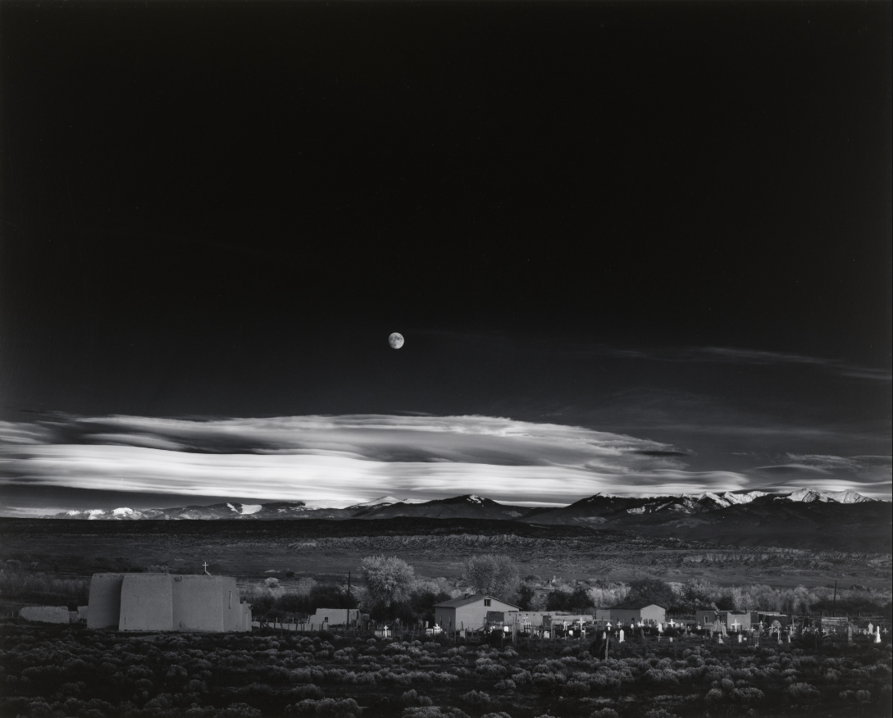
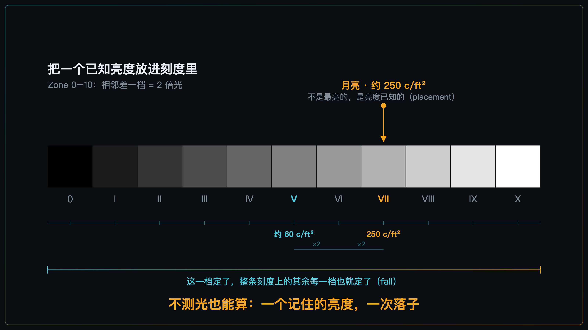
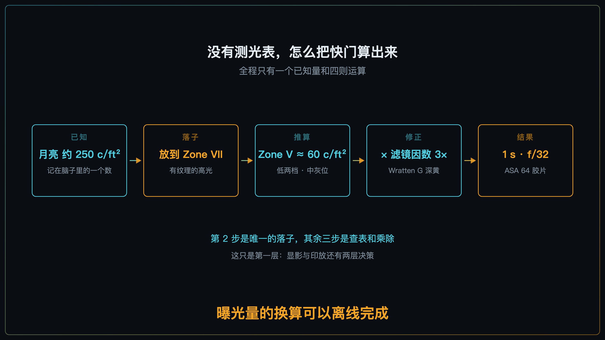
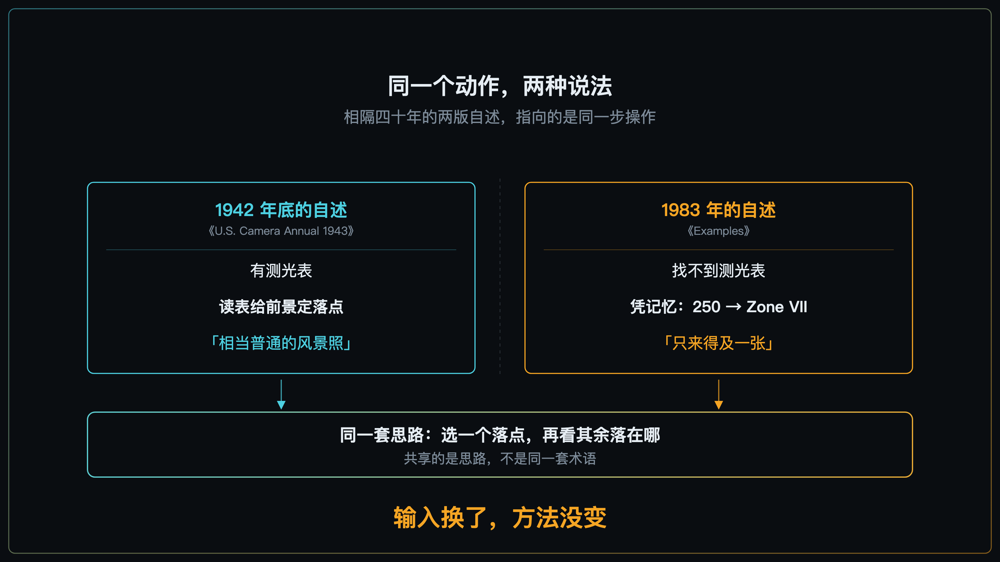
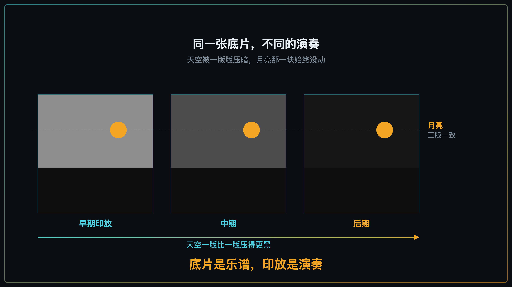

+++
title = "经典作品拆解 #15：Moonrise, Hernandez（赫尔南德斯月升）"
description = "锚点之所以能当锚点，靠的不是它最亮，是你知道它该落在哪一档。"
date = 2026-08-16
tags = ["摄影", "经典作品", "摄影史", "Ansel Adams", "Zone System", "曝光", "大画幅", "印放"]
categories = ["摄影"]
series = ["经典作品拆解"]
showTableOfContents = true
+++

> 锚点之所以能当锚点，靠的不是它最亮，是你知道它该落在哪一档。

## 车顶上的那台 8×10

1941 年 11 月 1 日傍晚，新墨西哥州北部。Ansel Adams 开车沿着 84 号公路往南走，在一个叫 Hernandez 的小镇边上，他看见了那个画面：远山前压着一层云，月亮已经升到云上方；公路右侧是村子的墓地，一排小小的白十字架，正好被落日最后一缕光扫亮。

他把车停在路肩，从车顶行李架上往下搬相机。

这件事的难处不在于"看见"。8×10 大画幅要架三脚架、拉皮腔、钻进黑布里取景、拿放大镜对焦、再插上片盒抽掉暗板——从看见到能按快门，中间隔着一长串动作。而扫在十字架上的那缕光，正在以肉眼可见的速度退走。

这张照片后来被他自己印了上千张，成了 Zone System 最常被引用的一个例证。但真正值得拆的不是他有多快。是他在那几十秒里，到底算了什么。

*图：Moonrise, Hernandez, New Mexico（赫尔南德斯月升），Ansel Adams，1941 年 11 月 1 日。本文要拆的就是这一张——月亮不是一个白点而是一个看得见暗斑的圆盘，天空压到近乎全黑，前景那排白十字架是画面下半部唯一的高光。*

## 一份按天计酬的委托

1941 年 10 月，美国内政部雇 Adams 为内政部博物馆拍一批大幅壁画用的辖地影像，条件是每天 22.22 美元、每年最多 180 个工作日，另加每天 5 美元差旅。他带着儿子 Michael 和朋友 Cedric Wright 在西南部跑了几周。这个壁画项目后来在 1942 年 7 月因战时压力中止、再没恢复，照片是 Adams 此后才陆续完成交付的。这天他们在 Chama 河谷拍了一整天，收获平平，正在往回走。

有一件事得先说清楚：**开头那个日期是后人算出来的，不是 Adams 记下来的。** 他自己从没确定过，先后说过 1937 年之前、1940、1941、1942、1944。1981 年太阳物理学家 David Elmore 用画面里月亮的位置反推出一个日期；十年后 Dennis di Cicco 找出其中的坐标与图像变形误差，实地复核机位后重算为 **1941 年 11 月 1 日 16:49:20（山地标准时）**，Elmore 本人接受了这个结果。

摄影师的记忆会漂，画面里的天体不会。记住这一点，后面还要用到。

## 这张照片在做什么

**第一，它的曝光锚点不是画面里最亮的东西，是那个亮度已知的东西。**

这一点和直觉相反，值得停一下。傍晚那片被落日照亮的云同样很亮——待会儿会看到，正是这片天空在后来的暗房里被压了几十年。但云有多亮，他不知道；月亮有多亮，他知道。**他选月亮当支点，靠的不是它排第几，是他手里有它的数。**

而且月亮在成片里不是一个白点，它是一个圆盘，上面的暗斑清清楚楚。这是个很具体的技术选择——要让一个亮东西保住纹理，就不能让它顶到白。

**第二，它的影调分配极端到近乎粗暴。**

在流传最广的那些后期印放里，天空被压到近乎全黑，远山和云只剩一线，整个前景沉在低档区，那排白十字架是画面下半部唯一的高光。他把绝大部分影调预算给了从近黑到中灰这一段，最上面那几档留给月亮、亮云和十字架。

这不是"曝光正常"的照片。这是一次彻底的分配。

## 它是怎么做到的

按 Adams 1983 年在《Examples: The Making of 40 Photographs》里的说法，他伸手去摸测光表，没摸到——车里翻了一遍也找不着。

然后他做了一件在今天看来有点不可思议的事：他不测了，直接算。

他手上有一个数：**月亮的亮度大约是 250 c/ft²。** c/ft² 是烛光每平方英尺，说人话就是"这块表面朝你射出多少光"；这个 250 不是什么物理常数，是他多年测下来记在脑子里的一个经验值。

有了这个数，剩下的就是我们在主线 [#1-11] 里讲过的那套动作——落子（placement）加分配（fall）：

**他把 250 放到 Zone VII。** Zone VII 是有纹理的高光那一档，正是"亮，但还看得见细节"的位置。

*图：把一个已知亮度放进 Zone 刻度。落子只发生一次，其余每一档都是被这一次落子推出来的。*

落子一定，别的全都跟着定。Zone V 比 Zone VII 低两档，一档差两倍光，两档就是四倍——250 除以 4，约等于 60 c/ft²，那正是测光表默认想把一切推到的中灰位。到这一步，代进曝光公式就能出基准值。

还差一步修正：他镜头上挂着一片 Wratten G（No. 15）深黄滤镜，为的是压暗蓝天、让云从天空里分离出来。这片滤镜吃掉的光大约是 3 倍，得乘回去。

最后落地：ASA 64 的胶片，**1 s / f/32**。

*图：五步里只有第二步是落子，其余三步都是查表和乘除。*

这里要说清楚一件事：**曝光组合从来不止一个解。** f/32 不是被物理逼出来的，是他为景深做的选择——从几十米外的十字架到几公里外的山和月亮都要落进景深，大画幅上只能靠收光圈来换。光圈定在 f/32 之后，那点残光下对应的时间才落在 1 秒左右；他要是开大两档，快门自然也跟着变。

顺带说一句时间线：Zone System 不是被这次险情逼出来的。Adams 和 Fred Archer 大约在 1939 到 1940 年间，在洛杉矶 Art Center School 的教学里把它系统化，比这张照片早了一两年。这次是它最有名的一场早期实战。

### 还有一层：写在冲洗单上的那个决定

算完曝光，他还做了一件事。在同一段自述里他写道：不想冒险，所以他给这张底片指定了水浴显影。

这句话很容易被跳过去，但它正好补上了前面那个缺口。**他真正没把握的是前景**——按他自己的说法，那片暗部的亮度值他并不知道。月亮有数，天上的云至少看得见，可那排十字架和底下的灌木到底暗到什么程度，只能猜。

水浴显影就是给这个猜留的保险：底片先在显影液里过一道，再泡进不搅动的清水——亮部要还原的银多，那一小片区域的药力很快耗尽，密度就不再往上涨；已经曝到光的暗部还能继续显一会儿。一来一去，整体反差被压了下来。

这里有个边界得说清楚：**水浴压的是高光那一端，它救不回根本没曝到的暗部。** 没落到底片上的信息，显影变不出来。

**这正是 Zone System 的另一半。** Adams 在《The Negative》里把这条讲得很直白：暗部主要由曝光决定，而亮部由曝光和显影共同决定。主线 [#1-11] 沿用的就是这个口径，Moonrise 是它最完整的一次演示。

所以更准确的说法是：**落子一旦定下，曝光量的换算确实只剩算术；但 Zone System 的决策不止曝光这一段。** 那天傍晚他做了两层——一层在几十秒里算完，另一层写在冲洗的指示单上。

## 不过，这个故事有两个版本

上面那套算法，出自 1983 年的《Examples》——写在事情发生四十二年之后。

而这张照片最早的自述，是 1942 年底刊在《U.S. Camera Annual 1943》上的。那一版里，他有测光表：

> 这张照片是日落后拍的，远山和云上还留着一层暮光。前景的平均光值被放在 Weston Master 表的「U」位上；月亮和远山的值看来没有高过表上的「A」位……有人可能觉得这是一次 tour de force，但我认为它只是新墨西哥一张相当普通的风景照。

得先拦一个容易的误读：「U」「A」是那台表刻度盘上的标记位，各代 Weston 表的标法并不统一，而且它们和 Zone 编号根本不是同一套刻度。这段话不该被读成"他当时就在说 Zone VII"，也不该拿某个字母去对应某一档。

两版差得不是一点半点。一个有表，一个没表；一个"相当普通"，一个"只来得及一张"。而且如前所述，他连拍摄年份都长期说不准。

我不打算判定谁在撒谎。四十年的记忆本来就会重构，尤其是当一张照片在这四十年里被无数人反复追问"你当时到底怎么拍的"。上一篇讲过，一幅照片的图标地位是被此后几十年一次次重选出来的；这一篇要补的是另一半——**被反复重讲的不只是照片，还有照片的制作过程本身。**

但请注意一件事：**两个版本描述的是同一套动作。**

1943 年那版：用表盘上的标记给前景定一个落点，再看画面亮处相对它落在哪儿。1983 年那版：给月亮定一个落点，其余随之落下。有表的时候是查表落子，没表的时候是靠记住的绝对亮度落子。**共享的是那套思路，不是同一套术语。**

*图：相隔四十年的两版自述并排。两栏完全等大——不是哪一版更重要，是同一步操作的两种说法。*

这反而是对 Zone System 更硬的一次辩护。它的价值从来不在那个惊险的傍晚——而在于，有表没表，做的都是同一件事。

## 第三层：放大机下的四十年

按 1983 年那版的说法，他曝完这一张，赶紧把片盒翻面想再来一张，慢了几秒——阳光已经从十字架上走掉了。所以这张底片是独苗。

它还是一张难伺候的底片：偏薄，反差不够，极难印。1948 年，Adams 用 Kodak IN-5 增感液处理了底片，抬高前景的反差（这一步常被写成"硒调"，那是误传，IN-5 是银增感）。

此后几十年他一遍遍重印。早期的印放天空偏灰，云层看得清清楚楚；越到后来天空压得越黑，直到近乎全黑。同一张底片，完全不同的演奏。他的助手 John Sexton 回忆过印这张的操作：给天空加光时要把放大机光圈开大约 4 档、再多给最多约 70 秒，同时死死保住月亮那一块的曝光不变。

这句回忆顺手给前面留了个旁证。**天空要单独加那么多光、月亮却原样不动，说明底片上云那一片积累的密度比月亮还厚——那些被落日照亮的云，在现场并不比月亮暗。** 当晚各处的实测值没有留下记录，这一句是从暗房操作往回推的；但方向很清楚：月亮并不是那晚最亮的东西，它只是唯一一个他手里有数的东西。

*图：三次印放的对照示意——天空一版比一版压得更黑，月亮那一块始终不动。曝光和显影把信息留在底片上，最终形状是在放大机下决定的。*

Adams 自己的说法是：底片相当于作曲家的乐谱，印放才是那场演出。放在这张照片上，这句话是字面意义的真——曝光和显影一起把信息留在了底片上，但它最终长成什么样，是在放大机下、在此后四十年里一次次决定的（主线 [#1-15] 讲的正是高光过渡这一端到底怎么塑）。

从工作流的位置上看，今天的 RAW 很像数字时代的底片：它保留后续塑形的空间。但两者并不完全等价——银盐底片已经过了显影这一道反差塑形，RAW 更接近显影之前的那份原始记录，那层反差控制被整体挪到了后期曲线上。

## 它在摄影史里的位置

**短期**，它给 Zone System 提供了那个不可或缺的东西：一个足够传奇的示范。一套方法能不能立住，往往不取决于它有多严密，而取决于有没有一个故事能让人记住它。Moonrise 就是那个故事。

**长期**，我认为这张照片被记住的方式有点错位。大多数人记住的是"最后一秒抢下来的神迹"，但它真正证明的恰恰相反——**它证明了摄影可以不靠运气。** 一个能把亮度换算成档位、又知道该在哪一段留后手的人，在光只剩几十秒的时候，不需要试拍、不需要包围曝光、不需要赌。传奇讲的是速度，方法讲的是确定性，而这张照片是后者的证据。

也正因如此，那个"到底有没有测光表"的分歧其实不太重要。真正稀有的从来不是他找不到表，是他找不到表也能算——而且清楚自己哪一段算不准，该拿什么兜住。

## 如果你想深入……

这张照片的核心决策对应我们摄影主线的「曝光控制论」模块：

- **[#1-11] Zone 0–10：用影调系统统一"放在哪一档"** — 讲了 placement + fall 这套语言本身，以及 Adams 那套为黑白胶片设计的曝光—显影分工在数字时代怎么迁移
- **[#1-12] 中间调锚定：主体/肤色应该"落在哪"** — 讲了日常场景里没有月亮可用时，锚点该挑谁
- **[#1-13] 容错优先级：DR 不够时的"损失最小化"策略** — 讲了装不下时先牺牲谁（这张照片的答案很干脆：全放暗部）
- **[#1-15] Roll-off 与肩部：高光过渡如何决定"贵不贵"** — 讲了"底片 → 印放"那一端到底在塑什么

读完这些，你对 *Moonrise* 的理解会从"看过"变成可操作的拍摄认知。

## 对今天的启示

**第一，先建立亮度量级的直觉，再用测光和直方图去验证它。** Adams 手上那个 250 是长年实测攒出来的，而月亮恰好是个极稳定的参照物——这两个条件日常场景都不具备，所以别指望背几个数就能替代测光。真正可练的是另一件事：下次在光线稳定的场景里，先自己估一组参数，再看表、看直方图，把差值记下来。估得越来越准的过程，就是你在长自己的那把尺子。

**第二，能提前定的变量，别留到光来的时候再定。** Adams 那天是在现场从零搭起来的——停车、架机、上镜头、构图、对焦、装滤镜和片盒、找表、算数，全挤在那几十秒里，所以才那么险。我们今天可以把这条线往前挪：预判到光要来，就先把机位、构图、对焦和光圈定死，只留曝光那一两个变量留到现场处理。

**第三，别把成品锁死在快门那一刻。** 曝光负责把信息留住，反差和最终形状是后面两层决定的。这张照片的天空黑到什么程度，是拍完之后的四十年里慢慢定下来的。

## 收尾

读之前，你大概会以为这是一个关于运气和神速的故事：光只剩最后一分钟，大师一击命中。

读完之后，故事换了形状。他能在几十秒里做完，是因为该背的东西早就背好了——一个已知的亮度，一次落子，剩下是乘除；而在他没把握的那一头，他用一道水浴显影兜了底。**能当锚点的，不一定是最亮的那个，但一定是你知道它该落在哪一档的那个。**（主线 [#1-14] 里的保高光策略就是锚在最亮的有纹理高光上——那也成立，因为你同样知道它该落在哪。）

而且连这个故事本身也被重讲过：四十年前他说自己读了表，四十年后他说表找不着了。两个版本里没变的，是那套算法。

下一篇还是他，还是这次委托的路上，第二年。1942 年，怀俄明州，他在一个高处架起相机，面前是蛇河拐出的一道大弯，远处是提顿山脉。这一次他有的是时间，难题换成了另一个：怎么让观众的眼睛自己走进画面深处。*Tetons and the Snake River*（蛇河与提顿山）——一条河的走向，怎么决定一张照片成不成立。

## 参考资料

- **馆藏页面**：[MoMA 藏品页](https://www.moma.org/collection/works/53904)；[盖蒂博物馆](https://www.getty.edu/art/collection/object/104EHH)；[普林斯顿大学艺术博物馆](https://artmuseum.princeton.edu/art/collections/objects/52881)；[密歇根大学 UMMA](https://umma.umich.edu/objects/moonrise-hernandez-new-mexico-1988-1-87)。
- **Adams 本人的两版自述**：早期版本见 *U.S. Camera Annual 1943*（1942 年底出版，文中引用的 Weston Master 表读数与"相当普通的风景照"一句均出自此处）；晚期版本见 Ansel Adams, *Examples: The Making of 40 Photographs*（Little, Brown, 1983），月亮 250 c/ft²、落 Zone VII、Zone V 约 60 c/ft²、滤镜因数 3×、ASA 64 下约 1 s / f/32、"找不到测光表"、"不想冒险，我给这张底片指定了水浴显影"、以及翻面补拍慢了几秒，均出自此书。**两版相隔约四十年，本文并列呈现、不判定取舍。**
- **拍摄日期的考证**：David Elmore（1981）用月亮位置推算得 1941 年 10 月 31 日 16:03；Dennis di Cicco（1991）修正坐标与图像宽高比误差、并实地复核机位后，重算为 1941 年 11 月 1 日 16:49:20 MST，Elmore 本人接受该结论。
- **内政部委托的条件**：美国国家档案馆记录，Adams 的任用条件为每天 22.22 美元、每年最多 180 个工作日，外加每天 5 美元差旅费；1941 年 10 月启程，壁画项目于 1942 年 7 月因战时压力中止、此后未再恢复，照片为 Adams 在项目结束前后陆续完成并提交（约在启程一年后）。「为期六个月」一说常见于二次转述，与该任用条件不符。参见 [79-AA: Ansel Adams Photographs of National Parks and Monuments, 1941–1942](https://unwritten-record.blogs.archives.gov/2021/04/27/79-aa-ansel-adams-photographs-of-national-parks-and-monuments-1941-1942/)，美国国家档案馆 The Unwritten Record 博客。
- **关于"云不比月亮暗"这一判断**：当晚现场各处的实测亮度没有留下记录。本文这一句是从 John Sexton 描述的印放操作（天空需大幅加光、月亮保持不变）往回推断的，属于推演而非档案事实，已在正文中标明。部分二次资料（多为拍卖行作品说明）称 Adams 曾给出「云至少比月亮亮两倍」这类具体倍数，本文未能将其追溯到 Adams 的原著，因此不引用。另需注意：网上流传的「Moonrise 中白云 17.1 cd/m²」指的是**成品照片挂在墙上的反射亮度**（出自 McCann 与 Shaw 论文 *The Ansel Adams Zone System: HDR capture and range compression*，原文正是用它说明「照片并不复现现场亮度」），不是当晚的现场亮度，两者勿混用。
- **关于 Weston 表盘的字母标记**：各代 Weston 表的刻度盘标法并不统一（U / A / C / O 在不同型号上的含义与位置有差异，二次资料彼此矛盾），且它们与 Zone 编号不是同一套刻度。本文因此只原样引用 Adams 1943 年的措辞，不对字母作档位解释。
- **「暗部由曝光决定、亮部由曝光与显影共同决定」**：出自 Ansel Adams, *The Negative*（New York Graphic Society, 1981）第 4 章“The Zone System”。
- **The Ansel Adams Gallery 的相关文章**：[Ansel's Anecdotes — The Making of Moonrise, Hernandez](https://articles.anseladams.com/ansel-adams-anecdotes/)（转录了《Examples》中的自述段落）与 [A Legend in Light](https://articles.anseladams.com/a-legend-in-light/)。
- **摄影师**：Ansel Adams（1902—1984），生于旧金山，早年学钢琴，后转向摄影；1932 年与 Edward Weston、Imogen Cunningham 等人创立 f/64 小组，主张纯摄影与全景深的直接影像。他与 Fred Archer 约在 1939—1940 年间于洛杉矶 Art Center School 的教学中把 Zone System 系统化，后写成 *The Camera* / *The Negative* / *The Print* 三部曲。延伸阅读推荐他的 *Examples: The Making of 40 Photographs*（1983，逐张讲四十幅作品的制作过程，本篇的主要依据之一）与 *Ansel Adams: An Autobiography*（1985）。
