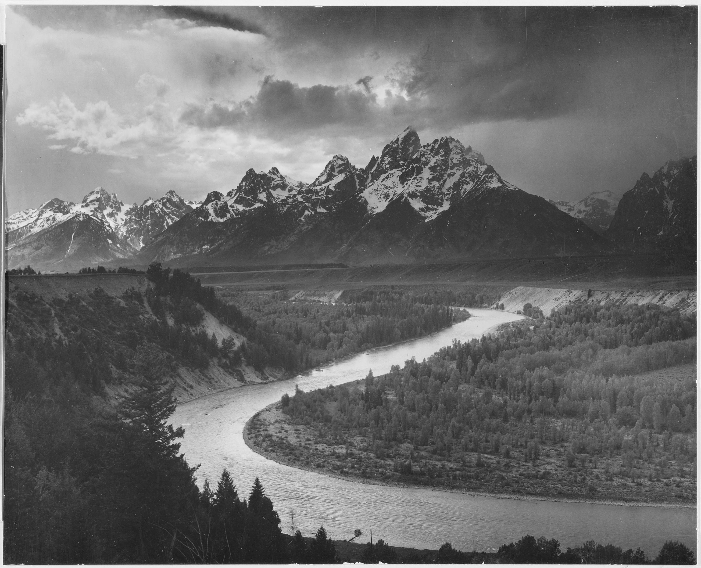
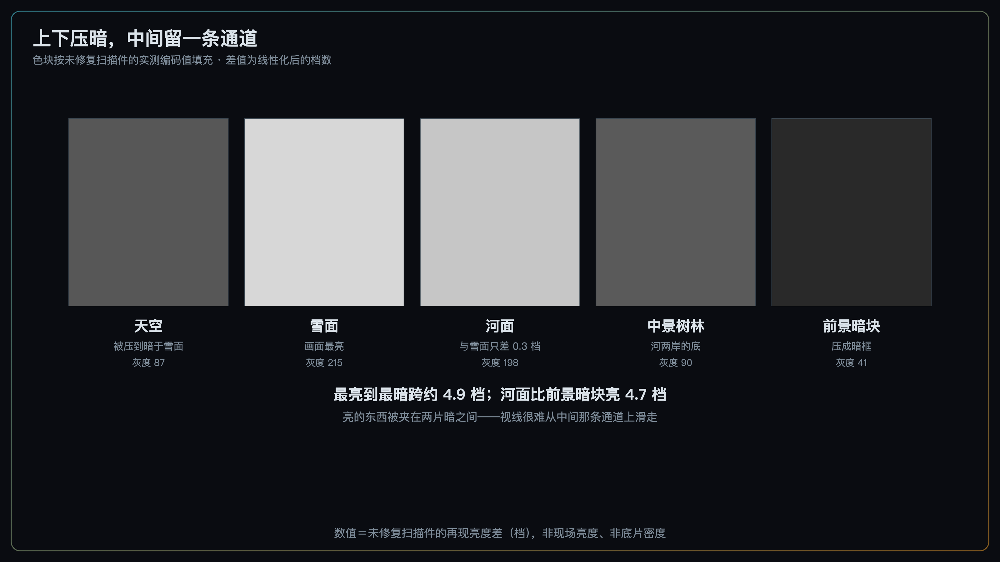
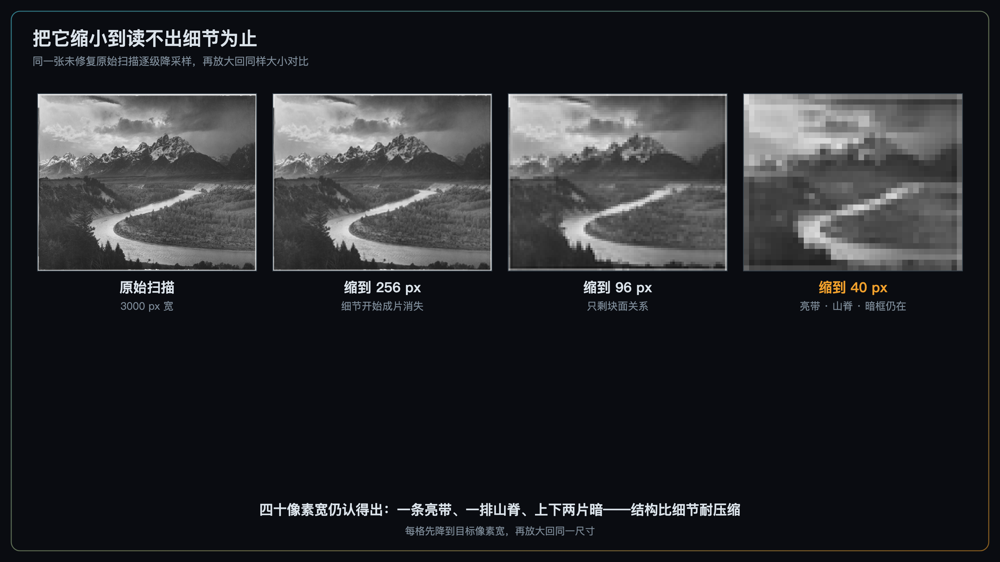

+++
title = "经典作品拆解 #16：Tetons and the Snake River（蛇河与提顿山）"
description = "在这张照片里，河的几何给了方向，而它与两岸的明度反差把这条路径变得难以绕开。"
date = 2026-08-23
tags = ["摄影", "经典作品", "摄影史", "Ansel Adams", "引导线", "明度反差", "风光摄影"]
categories = ["摄影"]
series = ["经典作品拆解"]
showTableOfContents = true
+++

> 在这张照片里，河的几何给了方向，而它与两岸的明度反差把这条路径变得难以绕开。

1977 年，两艘旅行者号探测器各带着一张相同的镀金唱片离开地球。唱片上刻了一百余幅图像，用音频信号编码，留给一个我们一无所知的接收者。其中一幅是安塞尔·亚当斯（Ansel Adams）1942 年拍于怀俄明的黑白照片——《Tetons and the Snake River》（蛇河与提顿山）。

选图委员会当年的任务是用有限的画面表现"地球是什么、我们是谁"，具体为什么选中这一幅，没有留下记载。不过有件事我们自己可以验证：把这张照片缩到很小、细节全部消失之后，它的结构还成不成立。这一篇就从这里拆起。

*图：*Tetons and the Snake River*（蛇河与提顿山），Ansel Adams，1942。这里用的是未修复的原始扫描（Wikimedia 上另有一个提高了对比度的修复版，本文的所有测量都不用它）。图片来源：美国国家档案馆（NARA）藏，档案号 519904 / 79-AA-G01，经 Wikimedia Commons；美国联邦政府职务作品，属公有领域*

## 一、这张照片是怎么来的

它是一个没完成的项目的副产品。

1941 年，国家公园管理局委托 Adams 为华盛顿的内政部大楼拍一组壁画用的影像，主题是国家公园里被保护起来的自然。他跑了两程：1941 年秋天一次，1942 年五六月一次。这张照片出自第二程。然后太平洋战争把项目停了，一直没恢复。壁画没做成，照片留下来了——直到 1962 年才被国家档案馆入藏。

"为壁画而拍"这件事本身是个约束：画面最后要被放大到墙面尺寸挂在公共建筑里。这至少意味着他必须考虑远距离观看、建筑空间，以及大尺幅下整体结构是否足够清晰。具体的壁画陈列方案没有完整保存下来，所以更细的推断只能到此为止。档案馆的记录里有一个细节可以体会当时的工作强度：他带着约 280 磅（近 130 公斤）器材在公园之间辗转。

战时的语境也在里面。Adams 在致内政部的信里，把这批作品描述为对「what we are fighting for」（我们在为什么而战）的一种情感呈现。后来它成了他 1950 年那本 *My Camera in the National Parks* 的封面。

我们在 #15 *Moonrise, Hernandez* 里拆过同一次委托里的另一张照片。那一篇的难题是曝光：光只剩几十秒，一次机会。这一篇的难题不同——提顿山前的光没那么匆忙，需要解决的是**怎么把观众从画面下缘送到远处的山脚下**。

## 二、这张照片在做什么

先把数字的来路说清楚，因为这部分我返工过两次。

我量的是**未修复的原始扫描件**（NARA 79-AA-G01，3000×2430，文件 SHA256 前 16 位 `156fa30c4967eb26`）。第一版量错了文件——用的是 Wikimedia 上那个经过 tonal adjustments 和 cleaning、标注"higher contrast"的修复版。在被人为拉过对比度的图上量反差，量到的是修复者的手。第一版还漏了一步：JPEG 的 8-bit 灰度是经传输函数编码的，不是线性光强，直接取比值得不到任何有意义的差。现在的做法是：**在假定该 JPEG 按 sRGB 编码的前提下，先做逆传输函数线性化，再把亮度比换算成档数**。这个假定是合理的默认，但仍是假定——文件本身没有给出明确的 ICC 说明；换一套 gamma，绝对数值会变，区域之间的次序则稳健得多。

口径必须跟着数字一起走。下面所有的"档"都是**扫描再现亮度差**，不是 EV（曝光值是另一回事），更不是现场差几档：这些数值已经包含了 Adams 的印放与局部加减光、相纸特性、扫描映射，**不能反推 1942 年现场的景物亮度**。我也不套绝对 Zone 编号，那需要知道该次印放的白点与黑点。

**第一，那条河在画面里是一条亮带。** 沿河道取 12 个点，每个点同时量河面和它紧邻的两岸：河面比岸亮 **中位约 3.0 档**（扫描再现亮度差，下同），12 个点**全部**成立。

**第二，河与雪峰的再现亮度非常接近。** 山脊上那些雪面是全图最亮的，但只比河面亮 **约 0.3 档**。两者因此都有条件成为画面里的高显著区域——不是一个主角带着一条通往它的路，而是两处都够分量。

**第三，上下两头都被压暗了。** 前景左下角和底部的树丛比河面暗 **约 4.7 档**；天空比雪面暗 **约 2.8 档**。全图从最亮到最暗跨约 **4.9 档**，而最亮的那一条被夹在两片暗中间。

*图：沿河走一遍。青线是河面，橙线是它紧邻的两岸，中间那块阴影就是这条亮带拿到的反差*

## 三、它是怎么做到的

把上面三条合起来，能得到一个比"用了 S 曲线"有用得多的结论：

> 在这张照片里，河同时提供了三样东西——一条几何路径、一条明度上的通道、一把纵深刻度。

**几何路径**是最容易看到的那一层：河从画面下缘进来，向左拐出一个大弯，再向右上抖一下，最后向左收进山脚。你可以把它读成一个 S——但只能说这是**观看者读得出的几何**，Adams 本人并没有留下"我在这里安排了一个 S 曲线"这类自述。

**明度通道**是第二层。这里要小心不要说过头：引导线并不需要自己更亮才成立。一条穿过亮雪地的暗色道路同样是很强的引导线，轮廓边界、线性透视、方向一致性、纹理差异都能形成引导。准确的说法是——**在这张照片里**，河的 S 形几何已经给出了方向，而它与两岸约 3 档的明度反差又把这条通道进一步强化了。两件事叠在一起，才让它这么难绕开。

那河为什么这么亮？很大程度上来自对明亮天空的镜面反射。这句话值得多想一秒：在一个天空被压得很暗的画面里，地面上却有一条东西把天空的亮度搬了下来。不过反射的强弱同时受观察角度、水面起伏与天空亮度分布影响，不是"有水就一定亮"。

顺带一个今天很容易踩的坑：**偏振镜（CPL）并不总是帮忙**。如果一张照片的核心正是天空在水面上的那条银色反射，把 CPL 转到消反光的位置，可能直接把这条引导线削掉。

第三层更容易被忽略：这条亮带**自带纵深刻度**。实测下来，河在画面里的投影从近处占画面宽的 12% 收到远处的 5%，**收窄约 2.2 倍**。针孔模型下投影尺寸近似与距离成反比，所以远处收窄本身就是明确的透视深度线索。不过要说清楚：蛇河的实际河宽会随河段和弯道变化，因此这 2.2 倍不能全部算到距离头上。

（顺便纠正一个容易反着讲的直觉：宽度均匀的直路或护栏其实是**更纯粹**的透视示例——正因为实体宽度不变，画面里的收窄就完全来自距离。）

那为什么要把上下两头都压暗？

*图：五个区域的实测明度（色块本身就是它在扫描件里的样子）。亮的东西被夹在两片暗之间*

因为引导线有个天然的风险：它既然能把视线往里带，也就能往外带。一条从画面下缘进来的亮带，如果前景也是亮的，视线很容易顺着它滑出画框。从最终的印放效果看，入口那一端的两侧都是暗块，天空也被压住了——亮带于是成为一条夹在暗里的通道，形成把视线向内引导的倾向。天空那一半具体是怎么压的，本片没有留下记载；以 Adams 那些年的惯常做法推，滤镜和印放时的加光都有份，但这只能算推演。

最后还有一件事，可能是整张照片最关键的安排：**这条通道的出口，恰好就在主峰脚下**。河向远处收窄、最后消失的那个位置，与大提顿峰在横向上几乎对齐。一条引导线把你送到哪里，比它长什么样重要得多。

## 四、它在摄影史里的位置

短期看，这批照片的直接任务失败了——壁画没做成。但它们把一种看待国家公园的视觉语言固定了下来：高反差、压暗的天空、大尺度的地形结构。这套语言后来成为美国现代风光摄影最有影响力的视觉谱系之一。

长期看，回到开头那张金唱片。既然委员会的选择理由无从查证，那就自己做实验：把这张照片逐级缩小，看它什么时候读不出来。

*图：把它缩小到读不出细节为止。40 像素宽的时候，一条亮带、一排山脊、上下两片暗仍然认得出*

结果挺说明问题：缩到 40 像素宽，所有细节都没了，但那条 S 形的亮带、那排山脊的锯齿、上下两片暗，依然在。这不能证明委员会当年是这么想的，但它证明了一件更有用的事——**这张照片的结构比它的细节耐压缩**。

这也正好从反面印证了我们在主线 #2-5 讲过的东西：一张照片先以几块大明暗的形态被整体读一遍，然后才轮到细节。

再说一个容易被当成价值证明、其实不是的事：这张照片的大尺寸印放件在拍卖上创过 Adams 作品的价格纪录。那只说明市场怎么看它，说明不了它为什么成立。真正说明问题的是上面那些档差和那个 40 像素的实验。

还有一件容易被忽略的事：我们现在说的"这张照片"并不只有一个版本。国家档案馆藏的是 1942 年交付的那个印放件；费城美术馆藏的那张标注是"1942 年（底片），1976–1977 年（印放）"——同一张底片，三十多年后又演奏了一遍。我们在 #15 说过底片是乐谱、印放是演奏；这里你能看到同一份乐谱的两份录音。本文量的是其中一份。

## 五、如果你想深入

这张照片的核心决策对应我们摄影主线的「构图几何与注意力预算」模块：

- **#2-6 几何骨架 1：引导线与流场** —— 讲任何方向一致的边缘、纹理、光影梯度都能形成视线流场（下一篇，本文正好是它的实例）
- **#2-5 形状优先：大形决定生死** —— 讲为什么缩图之后只剩块面，以及图与底怎么分派
- **#2-2 三大权重旋钮** —— 讲视觉权重来自与紧邻周围的反差而不是绝对亮度（本文量"河 vs 两岸"而不是"河 vs 全图"，用的就是这个口径）
- **#2-10 边缘管理：四条边是注意力逃逸口** —— 讲为什么入口两侧需要封口

曝光那一侧，它对应「曝光控制论·容错优先级」：全图跨近 5 档，谁必须保细节、谁可以掉进死黑，是个得提前定的顺序。

读完这些，你对 *Tetons and the Snake River* 的理解会从"看过"变成可操作的拍摄认知。

## 六、对今天的启示

先说一件扫兴的事：**这张照片今天拍不出来了**。Snake River Overlook 那个观景台还在，山还是那排山，但栏杆下方的针叶林在八十多年里长高了，把那个弯遮住了大半。你带着同样的器材、等到同样的云，也拿不到同样的画面。

所以可复制的从来不是机位，是那套判断。找引导线的时候，有四个维度值得逐一看一遍：

1. **方向** —— 它是指向画面深处，还是横着切过去，或者干脆通向画框外。
2. **局部明度反差** —— 它和紧邻的东西差多少。差得越多，它在画面里越难被绕开；但反差不是必要条件，暗线穿过亮底同样成立。
3. **透视收缩** —— 它会不会越往里越细。会，就自带纵深；一条宽度均匀的实体（直路、护栏）在画面里的收窄完全来自距离，是更纯粹的透视线索。
4. **出口落在哪** —— 这一维最容易漏。很多照片里引导线很漂亮，但它把人送到了一个什么也没有的角落，或者直接送出了画框。沿着它走一遍，看终点在哪。

再补两条现场提醒：水面、雨后的柏油路、雪地上被踩出来的径、逆光里反光的屋顶，共同点是它们都在反射天空。这类带方向的高亮最好在现场靠光线、角度和反射关系拿到——后期可以强化它，但没法凭空造出同样的空间关系。而如果你的画面正指望这条反光，**别习惯性地拧 CPL**。

至于当年那些今天不必再做的：今天的高像素数码相机，已经大幅降低了为大尺幅输出而携带大型摄影系统的必要性。但"画面首先要在整体结构上成立"这个要求没有消失——它同样适用于手机信息流里的快速观看。

## 七、收尾

读这篇之前，"引导线"大概是个构图口诀：找条线，让它指向主体。读完之后，你手上应该多了四个可以用来打量它的维度：方向、局部反差、透视收缩、出口位置。它们不是"必须全部满足"的定义条件——阴影边界可以没有透视收缩，铁轨主要靠方向与透视，也有些线是故意把视线带出画外的——而是决定这条线在画面里究竟有多强、把人带向哪里的四个维度。

Adams 在提顿山前做的事，说到底是把一个已经存在的世界安排进一个矩形里——他选机位、选天气、选什么时候按快门，但那条河本来就在那儿。

六年后在纽约，有人把这件事反了过来。菲利普·霍尔斯曼（Philippe Halsman）想要一张达利的肖像，而他要的那个瞬间在自然里根本不存在：三只猫、一桶水、一把椅子、一幅画，以及达利本人，全部同时悬在空中。助手扔猫、泼水，达利跳起来，霍尔斯曼按快门，然后所有人把猫擦干、把地拖干，再来一次。二十几次之后（不同来源记的次数不完全一致），他得到了那一格底片。

下一篇，*Dali Atomicus*（达利与原子，1948）——从"等一个自然给出的瞬间"，翻到"制造一个自然里不存在的瞬间"。

## 八、参考资料

- 作品权威页面：[美国国家档案馆档案号 519904（Local ID 79-AAG-1）](https://catalog.archives.gov/id/519904)；NARA 介绍页 [The Tetons and the Snake River](https://www.archives.gov/research/still-pictures/highlights/the-tetons-snake-river)
- 本文使用的未修复原始扫描：[Wikimedia Commons: Ansel Adams - National Archives 79-AA-G01](https://commons.wikimedia.org/wiki/File:Ansel_Adams_-_National_Archives_79-AA-G01.jpg)（同站另有一个提高了对比度的修复版，本文未使用）
- 晚年印放版本对照：[费城美术馆藏品（1942 年底片 / 1976–1977 年印放）](https://www.philamuseum.org/collection/object/123315)；[美国国家画廊藏品](https://www.nga.gov/artworks/66684-tetons-and-snake-river-grand-teton-national-park-wyoming)
- Mural Project 背景：[NARA: Ansel Adams Photographs](https://www.archives.gov/research/ansel-adams)；档案博客 [79-AA: Ansel Adams Photographs of National Parks and Monuments, 1941–1942](https://unwritten-record.blogs.archives.gov/2021/04/27/79-aa-ansel-adams-photographs-of-national-parks-and-monuments-1941-1942/)
- 旅行者金唱片图像：[NASA: Golden Record Images](https://science.nasa.gov/mission/voyager/golden-record-contents/images/)（各版本对图像计数与编号口径不完全一致，本文只说"一百余幅图像中包括这一幅"）
- 观景台现状：[NPS: Snake River Overlook](https://www.nps.gov/places/000/snake-river-overlook.htm)
- 摄影师：Ansel Adams（1902–1984），美国。底片现藏亚利桑那大学 Center for Creative Photography
- 延伸阅读：Ansel Adams, *My Camera in the National Parks*（1950）；Ansel Adams, *Examples: The Making of 40 Photographs*（1983）
- **本文数值口径**：未修复原始扫描件的再现亮度差，单位为档（不是 EV），在假定该 JPEG 按 sRGB 编码的前提下线性化得出；已包含印放与扫描环节，不可反推现场景物亮度。沿河道 12 点采样、五区色块与低信息量实验均由程序计算生成并带自校验
