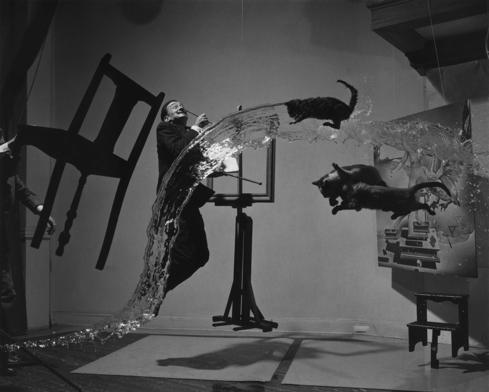
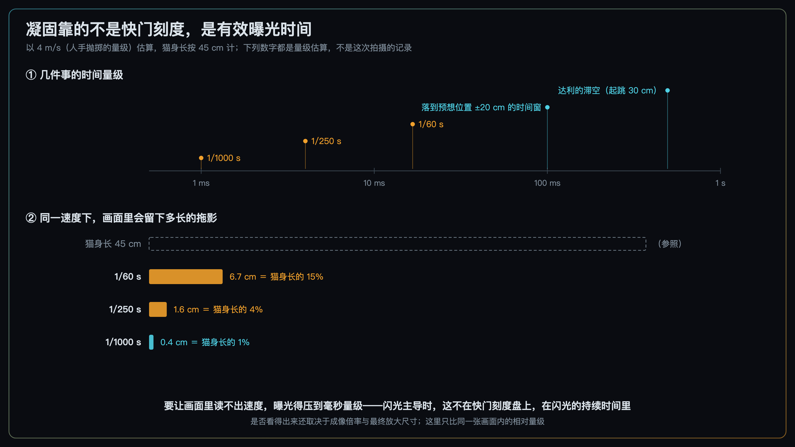
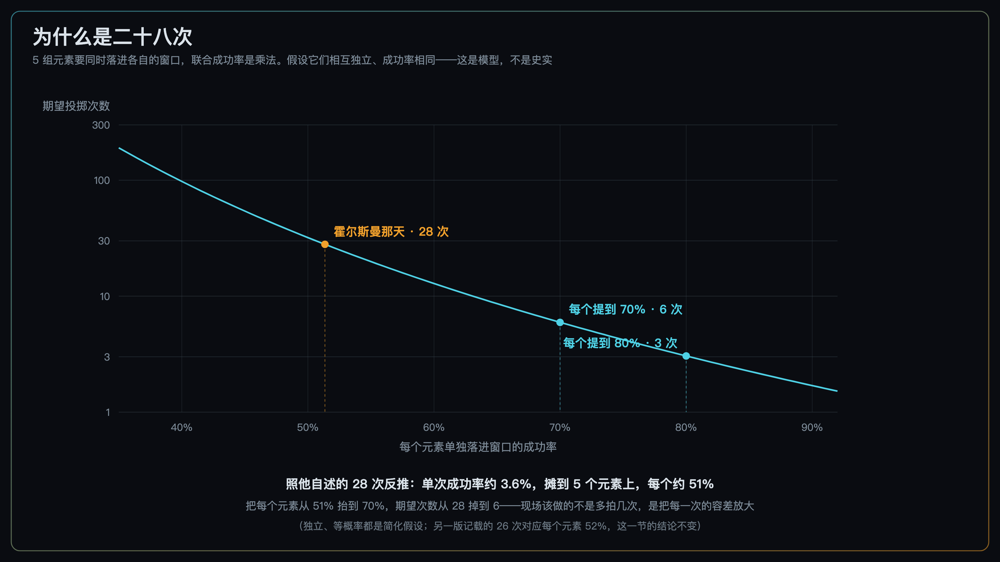
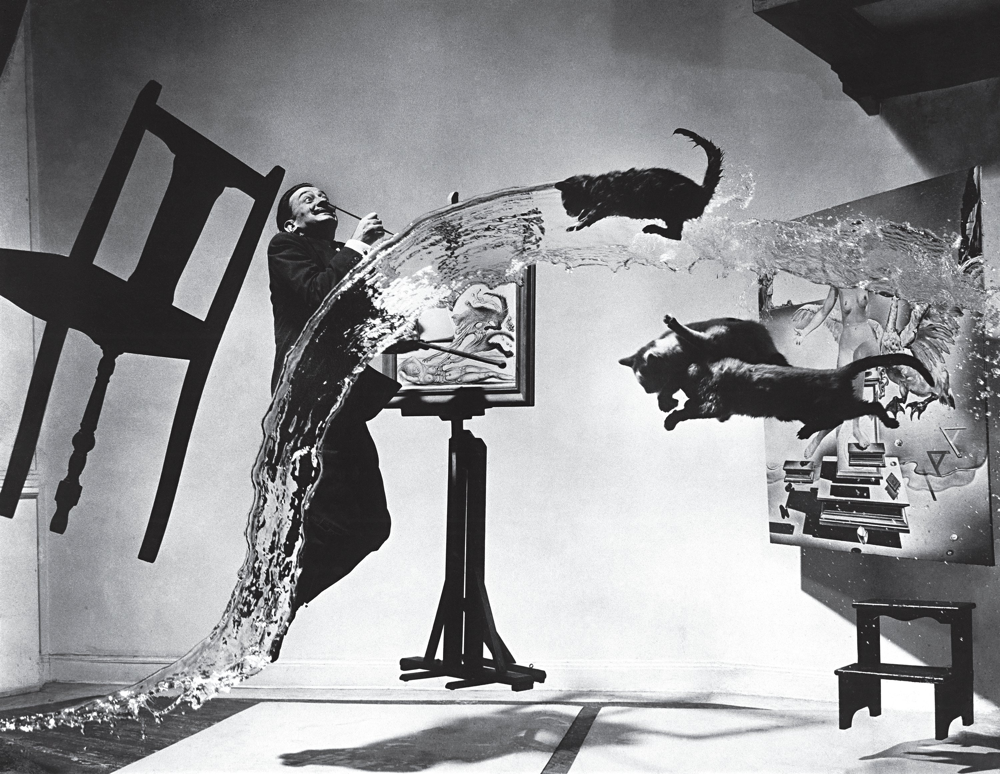
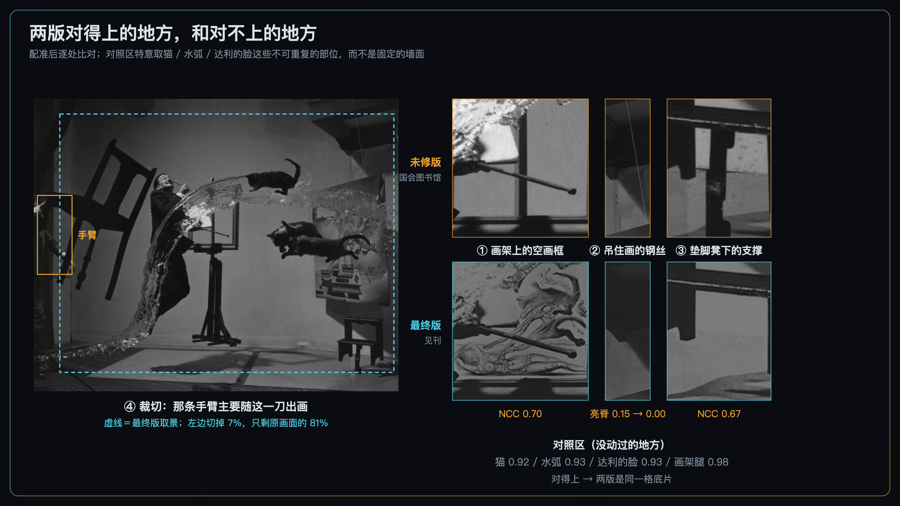

+++
title = "经典作品拆解 #17：Dalí Atomicus（达利与原子）"
description = "所谓悬浮，是把运动的证据删干净之后剩下的东西——它靠闪光、重复和一支画笔造出来。"
date = 2026-08-30
tags = ["摄影", "经典作品", "摄影史", "Philippe Halsman", "达利", "闪光", "凝固运动", "修图伦理"]
categories = ["摄影"]
series = ["经典作品拆解"]
showTableOfContents = true
+++

> 所谓悬浮，是把运动的证据删干净之后剩下的东西——它靠闪光、重复和一支画笔造出来。

1948 年的一个下午，纽约一间工作室里，几个人站在画框外面。数到三，助手把三只猫和一整桶水扔进画面；数到四，达利跳起来。快门响过，所有人开始擦猫、拖地、换掉湿衣服，然后再来一次。

几个小时之后，霍尔斯曼拿到了那一格底片。

*图：Dalí Atomicus（达利与原子），Philippe Halsman，1948。这是未经修饰的那一版——左边有一条从画外伸进来抓着椅背的手臂，右上角有一根吊着画的钢丝，画架上的画框是空的。图片来源：美国国会图书馆（Library of Congress）藏，数字编号 ppmsca.09633，经 Wikimedia Commons*

上一篇里，亚当斯在提顿山前做的事情是**选**——选机位、选天气、选按下快门的那一秒，那条河本来就在那儿。这一篇的难题正好翻过来：霍尔斯曼要的那个瞬间，自然里根本不会自己发生。

## 一、这张照片是怎么来的

起点是达利正在画的一幅画。

1941 年，图片社 Black Star 派霍尔斯曼去拍达利在纽约一家画廊的展览布置，两人就此认识，之后差不多每年都要合作一次。1948 年他们坐下来商量新点子的时候，达利手上正在画 *Leda Atomica*（丽达与原子）——大约 1945 年前后开始构思，现存这幅的定年在 1947 到 1949 年之间。

那幅画的主题是**悬置**。达利把当时的原子物理读成了一句话：万物彼此不接触。这是他自己的艺术化理解，不是严格的物理描述——原子里电子与原子核之间是吸引，宏观世界的「接触」也不能这么归因——但作为一条画面规则，它干净利落：画里所有东西都悬着，谁也不碰谁。

两个人于是想，能不能让照片也这样。

达利最初的方案是炸一只鸭子。他女儿艾琳后来回忆父亲的反应：「你不能这么干，你在美国，会被抓起来的。」方案最后收敛成现在看到的样子：家具、水、猫，还有达利本人，全部在空中。

现场条件值得说清楚，因为后面所有的决策都从这里长出来：

相机是霍尔斯曼自己设计的 4×5 双镜头反光机——他早年学工程，在巴黎时期就自己做过相机。一次一张片，没有连拍，没有预览。工作室里有五个助手，包括他的妻子伊冯和女儿艾琳。暗房就在旁边：每拍一张，他进去冲一张，出来看结果；助手们利用这段时间去捞猫、把猫擦干、把地拖干净。

三只猫，一桶水，一遍一遍。他后来写下的那句话是：「我和助手们浑身湿透、狼狈不堪、累到极限——只有猫看上去还是新的。」

## 二、这张照片在做什么

**第一，画面里该动的东西都在运动，却几乎没有留下运动模糊。**

猫爪上的毛是实的，水滴的边缘是实的，达利外套的褶也是实的。整张照片里找不到一条拖影。

说「所有东西都在往下掉」并不准确。达利被拍到的是接近跳跃最高点的那一刻，此时他的竖直速度接近零；猫和水是被抛出去的，可能正在上升，也可能横着飞；椅子、画和凳子干脆是被手和钢丝固定着的，本来就没动。**统一的不是运动方向，是运动的证据被删掉了。**

照片留下了位置，却抹掉了最直接的那条速度线索——运动模糊。姿态和水弧的形状仍然在暗示运动，这也是它没有塌成一张静物的原因；但没有一样东西拖出尾巴，整幅画面于是被读成了「停住」。

反过来想更清楚：如果猫和水带着两三厘米的拖影，同一张底片会立刻变成另一张照片——「东西正在掉下来」。那是一张热闹的、混乱的、完全不神秘的照片。

**第二，每一样东西都占着一块别人没占的地方。**

三只猫没有一只压在达利身上；水弧从他左边升起，在猫的下方横过去；画架在中间，画在右边，凳子在右下角。把这张照片缩到很小、细节全部消失，仍然数得清有几处东西悬在那儿——这正是我们在主线 #2-4 讲过的「分组决定计数单位」和 #2-5 的大形。要是哪两样粘在了一起，读者眼里就成了一团，「什么都不落地」这个笑话也就讲不出来了。

这不是运气。霍尔斯曼自己记下过几次废掉的理由：达利跳晚了；椅子挡住了他的脸；有人不小心走进了画面。二十几次里，只有一次所有东西同时落在了各自该在的地方。

## 三、它是怎么做到的

### 3.1 凝固靠的不是快门刻度，是有效曝光时间

先算一笔读者自己就能算的账。

一个被人手抛出去的东西，速度大约是 4 m/s 这个量级。曝光 1/60 s，它在快门开着的这段时间里走了 6.7 cm——差不多是猫身长的 15%。这不叫拖影，这叫糊了。曝光 1/250 s，走 1.6 cm，仍然一眼看得见。要压到「看不出来」，得进到 1/1000 s 的量级：0.4 cm，猫身长的百分之一。

严格说，4 mm 的位移看不看得出来，还取决于成像倍率和最终放大到多大——同样的位移，印成明信片和印成一面墙不是一回事。所以这里比的是同一张画面里的相对量级，不是一条「1/1000 s 就一定凝固」的规则。

*图：上半是几件事的时间量级，下半是同一速度下画面里会留下多长的拖影。速度与猫身长都是量级估算，不是这次拍摄的记录*

那问题来了：1948 年，一间工作室里，怎么拿到毫秒量级的曝光？

如果指望快门，得同时满足两件事：快门本身够快，并且现场有强到离谱的持续光，让这么短的曝光还能曝够。前一件当年不难——1948 年已经有快门跑到 1/500 甚至 1/1000 的相机；难的是后一件：要把连续光堆到那个量级，人和猫都先受不了。

所以只剩一条路：**让曝光时间不由快门决定，而由闪光的持续时间决定**。这句话有两个前提：环境光的贡献要足够低，快门要在同步速度以内。两个前提都满足时，被闪光照亮的那部分画面，有效曝光时间就是闪光那一下的长度，快门拨到 1/60 还是 1/125，改变的只是环境光进来多少。前提不满足就不成立——环境光够亮，慢快门照样会在主体后面拖出一条环境光的尾巴。

这次拍摄用的正是闪光。霍尔斯曼在 1972 年的 *Halsman: Sight and Insight* 里回忆过那一刻：达利升到最高点时他按下快门，电子闪光把整个场面冻住了。（这段自述我读到的是展览资料的转引，没能核对原书；至于用的是什么灯、闪光持续时间多少，同样没有找到记录。）

照片本身和这条记载对得上：画面上不存在任何量级的拖影，有效曝光时间必须落在毫秒量级。不过不必再往前推一步说「当年只有闪光做得到」——1948 年已经有快门跑到 1/500 甚至 1/1000 的相机。真正的难处从来不在快门刻度，而在那么短的时间里要有足够的光；闪光解决的正是后面这一半。

### 3.2 联合概率是乘法，所以二十几次是理性成本

画面里真正不受控的，其实只有五件东西：达利、三只猫、一桶水。

椅子、画和垫脚凳不在此列——它们是被手和钢丝固定住的。这个区分很关键，后面还要用到。

五件东西各有各的时间窗。达利如果跳起约 30 cm，滞空是 0.49 s（自由落体算出来的），但「看起来悬在半空、腿的姿态还成立」的那一段比这窄得多。一只猫要落在预想位置 ±20 cm 之内，按 4 m/s 算只有 0.1 s。水泼开成弧、还没砸到地面，也是十分之一秒的量级。

难的地方在于：这些窗口必须**同时**打开。

*图：五个元素独立、成功率相同的简化模型下，期望投掷次数随单元素成功率的变化。独立与等概率都是简化假设——真实拍摄里，同一声「三」喊出去，几个助手的反应是相关的*

先说次数本身。现存记载有两个版本：约六小时、二十八次，和约五小时、二十六次，两个版本都能追到他本人的说法。下面的模型取二十八次。

把二十八当成期望次数反推，单次成功率约 3.6%；再假设五件事互相独立、各自成功率相同，每一件大约 51%。**这是模型，不是史实**——但它给出的量级很说明问题：每件事单独看都有一半的机会成立，五件凑在一起就只剩百分之三点几。

顺带一句：这个模型对那个有争议的数字并不敏感。换成二十六次，单元素成功率从 51% 变成 52%，下面的结论一个字都不用改。

所以二十几次不是笨，是这类问题的成本。

真正能省下次数的也不是「多拍几次」，而是**把每一次的容差放大**：每个元素从 51% 提到 70%，期望次数就从 28 掉到 6。霍尔斯曼那天已经在这么做了——椅子、画、凳子他直接用手和线固定住，只让那五件东西留在随机里。按上面这个模型，少一个随机元素，联合成功率差不多就翻一倍。

### 3.3 每拍一张就冲一张

第三件事最容易被跳过，却是当代最有用的一条：暗房就在旁边。

拍一张，进去冲一张，出来再调整。二十几次因此不是二十几次盲目重复，而是二十几次带反馈的迭代——每一次都知道上一次错在哪个变量上：是达利跳早了，还是猫的落点偏了，还是椅子的角度挡了脸。

今天的即时预览把这个循环从十分钟压到了一秒。但很多人反而不看，或者只看「糊没糊」，不看「这一次和上一次差在哪一个变量上」。

### 3.4 最后一层：画面里那幅画，拍的时候不在

下面这张才是大家见过的那一版。和文章开头那张放在一起看，你会发现它们不太一样。

*图：Dalí Atomicus 的最终版——见刊的就是这一版。画框里有画了，钢丝和手臂都不见了。图片来源：Wikimedia Commons*

我把两版复制件做了配准，然后逐处比对。

*图：未修版（国会图书馆）与最终版（见刊版）配准后的逐处比对。对照区特意取的是猫、水弧、达利的脸这些不可重复的部位；差别集中在标出的这几处，外加一次裁切*

先说结论里最要紧的一条：**两版极可能出自同一格底片**。

这里的对照区特意没有取墙面——固定的背景在不同次投掷之间本来就长得一样，对得上说明不了什么。取的是猫、水弧、达利的脸这三处不可能在另一次投掷里重现的地方，外加画架腿作参照，配准之后相关系数在 0.92 到 0.98 之间。相关系数本身只能支持、不能单独证明；但要让另一次投掷里的猫和水弧长成一模一样，代价比修图大得多。

然后是差别：

- **画架上当时是一个空画框。** 未修版里，你能透过画框看见后面的墙。最终版里那幅画，是照片洗出来之后画上去的——多个来源记载，是达利本人直接画在照片上的。
- **右边那根吊着画的钢丝被抹掉了。** 它在未修版里是一条明显的亮脊——归一化高通响应 0.15，而同一区域的纹理基线只有 0.008；最终版在同一批像素上降到接近 0。
- **垫脚凳下面那根支撑没了。**
- **画面被裁窄了一圈**，只剩原来的 81%，左边切掉最多（7%）。那条从画外伸进来、抓着椅背的手臂，主要是随这一刀出的画。

测量口径写在这里，方便复核：两版先在梯度图上做整体配准，再按区域局部对齐，然后在 0–1 灰度上算归一化互相关；亮脊高度指沿钢丝方向取的高通响应中位数；裁切比例由最终版在未修版坐标系里的覆盖范围算出。

于是这张照片的「真实」变成了分层的：

> 那五件真正在空中的东西——达利、三只猫、那桶水——确实来自同一次曝光，没有从别的底片上拼进来。

> 同时，见刊的那一版：钢丝和凳子下的支撑被修掉，扶椅子的手臂主要被裁出画面，空画框则被补上了一幅画。

这两句话必须一起说。只说前一句，它是个奇迹；只说后一句，它是个骗局。它两样都不是。

## 四、它在摄影史里的位置

短期看，这次拍摄已经预演了他后来那套招牌方法的核心：与其等一个人「自然」，不如给他一件必须身体投入的事去做——人在完成任务的时候，脸上那层用来见人的东西会掉下来。四年后的 1952 年，他把「让人物跳起来」系统化成了 jumpology。中间这几年是不是由这张照片直接推着走的，史料不足以下断言；但方法的雏形在这里已经看得见。那条线值得单独一篇。

长期看，这张照片是今天那场争论的一个坐标。

合成、修图、AI 生图——大家争的往往是「有没有后期」。但 1948 年这张被写进摄影史的照片，本身就带着一层手工修饰与增绘，而且它当年就登在《生活》杂志上，同期还放了几张废掉的帧。过程是公开的。

**在这类摆拍与观念摄影里，分界线往往不在「有没有后期」，而在「过程是否被公开、观众是否被误导」。** 这张照片从没假装自己是抓拍来的，它明说自己是个玩笑；如果霍尔斯曼当年把那二十几次藏起来，讲成「我按了一次快门就拿到了」，同一张照片的性质立刻就变了——底片一个像素都不用改。

这条判断不能直接搬到新闻和纪实摄影上。那一侧的规范更硬：改变画面内容本身就可能越线，事后说明也不豁免。

## 五、如果你想深入

这张照片的核心决策对应我们摄影主线的几个模块：

- **「镜头与成像」模块的「三分法诊断运动糊」** —— 讲相机抖动、主体运动、跟拍失配三种糊怎么分辨（该模块尚未发布，编号未定）
- **#8-6 采集规范：现场锁死关键变量，减少后期猜测** —— 讲的正是 3.3 那个反馈回路的现代版本
- **#8-2 可复现优先于单张惊艳** —— 二十几次的另一面：一次成不成不重要，能不能稳定地成才重要
- **#2-4 视觉底层代码：格式塔分组与脑补** 与 **#2-5 形状优先：大形决定生死** —— 讲为什么那几样东西不能粘在一起
- **「光照设计」模块的闪光灯基础**（待排）—— 闪光持续时间、同步速度、功率与时长的关系

读完这些，你对 *Dalí Atomicus* 的理解会从「看过」变成可操作的拍摄认知。

## 六、对今天的启示

**一、凝固运动时，先问「有效曝光时间是多少」，再去拨快门。** 想拍溅起的水、跳起来的人、砸落的粉末，现场的顺序是：先把环境光压到明显低于闪光的曝光（否则慢快门会拖出一条环境光的尾巴），快门保持在同步速度以内，剩下的交给闪光时长。

怎么把闪光时长压下来，得看灯的类型：多数 IGBT 控制的机顶灯和现代外拍灯，输出功率越低、闪光持续时间越短，所以把灯移近再降功率，通常能换来更短的一下（灯移近本身不缩短闪光，它只是让你有余量把功率降下来）；传统电压控制的棚灯规律可能相反，功率降下去尾巴反而拖长。所以真正该看的是厂家标的数据——闪光持续时间有 t.5 和 t.1 两种口径，t.1 更接近你实际能凝固到什么程度。验收就看边缘：轮廓、水滴、衣角有没有拖出尾巴。

**二、多个元素要同时成立时，别指望「多试几次」。** 先看能不能把随机元素的数量减下来：能固定的固定住，能预先摆好的摆好。霍尔斯曼那天把椅子、画、凳子交给手和钢丝，剩下五件才交给概率。少一个随机项，成功率就是乘法上少乘一次。

**三、给自己留一条「每次都能看到结果」的回路，并且真的去看。** 不是看糊没糊，是看这一次和上一次差在哪个变量上。

**四、修可以修，但把过程留下来。** 今天最省事的做法是保留原始文件，外加一句说明。

**五、这张照片的过程别照着复现。** 反复抛猫、泼水，今天既没必要也不该做。同样的练习换成玩偶、沙包、抛起来的织物都能达到目的；真要那只猫出镜，也可以让它安稳待着，把飞起来的部分留给后期。

## 七、收尾

读这篇之前，这张照片大概是「没有 PS 的年代，靠一遍遍硬拍出来的奇迹」。

读完之后，它更像三件事叠在一起：**把时间切到毫秒**（这是闪光干的）、**把不可控的部分交给重复**（这是那二十几次干的）、**把剩下那些不可能同时成立的东西留给暗房和一支画笔**（这是两处修掉、一刀裁切、一幅补画干的）。

奇迹的部分并没有消失，只是位置变了。它不在「一次拍到」，而在**知道哪一部分必须在现场拿到、哪一部分可以事后补**——这个判断，今天依然是分水岭。

霍尔斯曼在纽约花了大半天造出一个瞬间。几乎同一时期，巴黎的另一个人正在把相反的主张印成一本书。

1952 年，布列松出版了他影响最大的那本摄影集。法文原名叫 *Images à la sauvette*，大意是「偷偷摸摸拍来的图像」，带着点仓促、不体面的意思。美国出版社给英文版另起了一个名字：*The Decisive Moment*。这个名字后来成了一句口号，被引用了七十年——多数引用的人没读过那本书，也没见过那个封面。

而那个封面上，没有一张照片。

下一篇，*The Decisive Moment* 封面（1952）——一个短语是怎么在翻译和装帧里，变成一句谁都会说、谁都用错的话。

## 八、参考资料

- 作品权威页面：[MoMA 藏品页](https://www.moma.org/collection/works/47919)；[V&A（皇家摄影学会收藏）](https://collections.vam.ac.uk/item/O1410625/dali-atomicus-photograph-halsman-philippe/)；[密歇根大学美术馆 UMMA](https://umma.umich.edu/objects/dali-atomicus-1978-2-30)；[耶鲁大学美术馆](https://artgallery.yale.edu/collections/objects/103312)
- 本文使用的未修版原始扫描：[美国国会图书馆 ppmsca.09633（经 Wikimedia Commons）](https://commons.wikimedia.org/wiki/File:Salvador_Dali_A_(Dali_Atomicus)_09633u.jpg)。同站另有 Commons 用户做过除尘处理的 retouched 版本，本文未使用
- 本文使用的最终版复制件：[Wikimedia Commons](https://commons.wikimedia.org/wiki/File:Dal%C3%AD_Atomicus_(final_version).jpg)
- 拍摄经过：[Artsy: The Story behind Philippe Halsman's Surreal Photograph Dalí Atomicus](https://www.artsy.net/article/artsy-editorial-story-surreal-photograph-salvador-dali-three-flying-cats)；[TIME 100 Photographs](https://time.com/4429888/dali-atomicus/)；[Magnum: Halsman 与达利的合作](https://www.magnumphotos.com/arts-culture/art/philippe-halsman-salvador-dali-enduring-partnership/)
- 摄影师：Philippe Halsman（1906–1979），生于里加，1930 年代在巴黎开设肖像工作室，1940 年经爱因斯坦斡旋取得紧急签证赴美；1945 年当选美国杂志摄影师协会（ASMP）首任主席，1951 年应马格南创始人之邀以特约成员身份加入。作品档案见 [Philippe Halsman Archive](https://www.philippehalsman.com/overview)
- 延伸阅读：Philippe Halsman, *Halsman on the Creation of Photographic Ideas*（1961）；*Halsman: Sight and Insight*（1972）；*Philippe Halsman's Jump Book*（1959）
- **本文的次数口径**：现存记载有约六小时、二十八次与约五小时、二十六次两个版本，都被追到霍尔斯曼本人的说法（分别指向 1961 与 1972 那两本书），MoMA 记二十八次，UMMA 与多家画廊记二十六次。这两本原书我都没能核对到原文，转述之间也可能把「投掷」和「成片」混成同一个计数单位。正文取二十八次做模型，并在 3.2 里验算过：换成二十六次结论不变。没有当年的接片样张，这件事无法定论，本文不选边
- **本文的灯光口径**：正文引用的那句自述出自 *Halsman: Sight and Insight*（1972），我读到的是展览资料的转引，没能核对原书；灯具型号与闪光持续时间没有找到记录。3.1 的量级推算独立于这条记载，是从照片上没有拖影反推的，两者结论一致
- **本文的数值口径**：拖影长度、滞空时间、联合概率均由公式算出，输入（4 m/s 的抛掷速度、45 cm 猫身长、30 cm 起跳高度、±20 cm 落点容差）都是量级估算，不是这次拍摄的记录；两版比对的相关系数与亮脊高度在配准后逐区域计算
