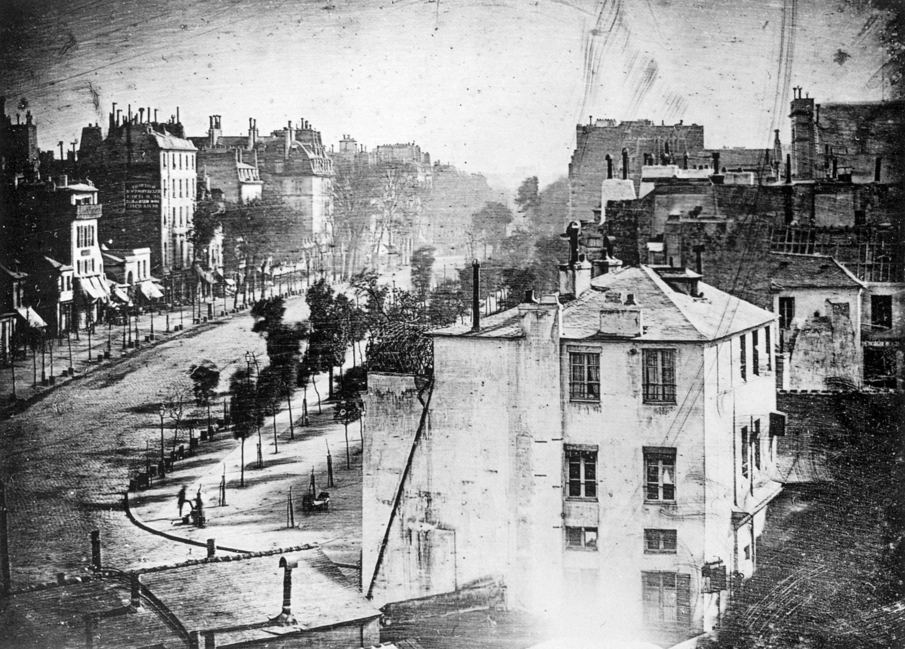

+++
title = "经典作品拆解 #2：Boulevard du Temple（庙宇大道）"
description = "摄影史上第一个被拍到的人，不是被「拍下」的，是被「留下」的——其余所有人都被长曝光过滤掉了。"
date = 2026-05-20
tags = ["摄影", "经典作品", "摄影史", "Daguerre", "Daguerreotype", "长曝光"]
categories = ["摄影"]
series = ["经典作品拆解"]
showTableOfContents = true
+++

> 摄影史上第一个被拍到的人，不是被「拍下」的，是被「留下」的——其余所有人都被长曝光过滤掉了。

## 一、那个被留下来的人

大约 1838 年的某个上午，巴黎第三区。庙宇大道（Boulevard du Temple）上车水马龙，行人、马车、推车、卖花的、上班的，是当时巴黎最热闹的街景之一。这张作品后来通常题作《Boulevard du Temple, Paris, 8 in the morning》。

Louis Daguerre 把他的相机架在工作室二楼的窗边，对准这条街，按下快门——然后等。等了好几分钟。

显影出来的画面里，那条本应人潮汹涌的大道，几乎是空的。建筑清晰，树清晰，路面清晰，但路上几乎一个人都没有。只在画面的左下角，街角的位置，留下了两个模糊但可辨认的人影：一个站着的男人，正在让另一个蹲着的人给他擦鞋。

这张照片通常被视为**现存最早、且最广为人知的「拍到人」的照片之一**。一般认为这两人并非有意摆拍，但他们究竟是完全偶然地停留在那里、还是在不长的等待中被半默许地纳入了画面，史料并没有给出定论。

*图：现存最早展示人类身影的照片。在画面左下角街角位置可以辨认出一个站着的男人，正在让另一个蹲着的人给他擦鞋——那是在几分钟的曝光里，唯一停留足够久、被银版「看见」了的东西。这是原始的银版成像，画面为左右镜像。图片来源：[Wikimedia Commons](https://commons.wikimedia.org/wiki/File:Boulevard_du_Temple_by_Daguerre.jpg)，公有领域*

## 二、为什么是「好几分钟」

要理解这张照片，得先理解 1838 年「拍一张照片」是什么意思。

Daguerre 用的是他自己刚刚定型不久的**银版摄影术（Daguerreotype）**：一块抛光到镜面级别的镀银铜板，在暗室里用碘蒸汽熏过一遍，让表面生成一层对光敏感的碘化银。曝光后，再用汞蒸汽显影、盐水定影，最后得到一张**直接成像在金属板上的正像**。没有底片，没有放大，每一张都是独一无二的物理实物。

这套系统的感光速度极低。换算到今天的口径，大概相当于 ISO 0.1 到 1 之间——比今天最低的可设 ISO 还要再慢七八档。在 1838 年巴黎清晨的散射光下，要让银版上累积出可见的图像，曝光时间必须以**分钟**计。关于这张照片具体曝了多久，公开资料的说法并不一致，常见的估计从 4–5 分钟到 10 分钟以上不等。准确的数字已经无从考证，但量级上可以确定是「好几分钟」。

这已经是当时的飞跃。在他之前，Niépce 用沥青感光的「日光蚀刻法」拍一张窗外景色要曝光 8 个小时——一整个白天，太阳从东到西，影子从一边扫到另一边，最后画面里同一面墙的两侧都被照亮过。Daguerre 把这个数字从 8 小时压到了几分钟。但几分钟，对一条人来人往的大街来说，仍然是一段非常长的时间。

这就是这张照片真正的拍摄约束：**镜头是开的，但时间是慢的**。任何在这几分钟里来过又走了的东西，都会被这块银版「忽略」掉。

## 三、这张照片在做什么

### 3.1 它把整条街「滤」掉了

看这张照片，第一反应通常是：「这条街怎么这么安静？」答案不是街本身安静，而是**这张照片把所有运动的东西都过滤掉了**。

用三句话概括它在视觉层面做了什么：

**第一，它把「动」当作不存在。** 路上的行人、马车、卖花女、推车的伙计——这些人在这几分钟里走过了画面的某一块区域，但每个人在某一个具体位置上停留的时间，可能只有零点几秒到几秒。对一块需要好几分钟才能积累出可见图像的银版来说，这点时间不足以让任何一个银盐颗粒发生足够的化学反应。结果是：他们成了背景的一部分，被均匀地涂抹掉，融进了路面和空气。

**第二，它把「静」做出了层次。** 左侧的整排建筑、树木、远处的烟囱——这些东西在整个曝光过程里没有动过，光子稳定地、持续地、定向地打在银版的相同位置上。所以它们被记录得很清晰，甚至有立体的明暗层次。这是当时全世界还没人见过的清晰度。

**第三，左下角那两个人，是规则的例外。** 擦鞋的客人需要把脚抬到擦鞋台上，重心稳定地压住——他必须站着不动，至少站到擦鞋的人收工。这恰好是几分钟的事。蹲着擦鞋的伙计也是同样的姿势锁定。两个人在画面里同一块小区域上，停留了和曝光时间差不多长的时间。于是他们被留了下来，模糊但可见，像两个从大街上被剪出来的影子。

### 3.2 长曝光是一种时间维度上的低通滤波

这张照片的技术核心，不是「曝光过度」也不是「曝光不足」，而是**用曝光时间本身做了一次筛选**。

要理解这件事，把银版上每一个微小区域想象成一个独立的累加器：它每接收到一个光子，账上就 +1，到达某个阈值后才会在显影时变成可见的银颗粒。

现在分两种情况：

- **静止的物体**（建筑、树、站着不动的人）：它反射的光，在整个曝光期间持续不断地打在银版上对应位置。这个累加器从 0 涨到饱和很快——比如几十秒就能积累出可见图像，剩下时间只是让信号更稳定。
- **运动的物体**（走动的行人、马车）：它反射的光，在每个具体位置上只停留零点几秒到几秒。这个累加器只增加了一点点就被「换班」了——下一秒打在这块区域的，是后面的路人或路面。多次叠加后，每一处的信号强度都被均匀地稀释，最终融入背景的平均亮度。

借一个信号处理的类比：这本质上很像**对时间做了一次低通滤波**——变化周期远短于曝光窗口的东西，都被滤掉了；只有在这个窗口里足够稳定的东西，才能被记录。需要强调的是，这只是个帮助理解的比喻，不是严格的线性系统模型：银盐响应有阈值、有非线性、低光下还有互易律失效，真实过程远比一条公式复杂。但「时间窗口决定了哪些东西能被留下」这个直觉是对的。

这不是失败，是机制。后来一百多年里，所有「人海中只剩下空旷广场」的长曝光延时摄影、所有「车流变成红线」的城市夜景、Hiroshi Sugimoto 把整场电影曝在一张底片上得到一块发光的白屏——用的都是同一个原理。Boulevard du Temple 是这条技术血脉的源头第一帧。

顺带一个细节：这张照片是**左右镜像**的。银版摄影是直接正像，没有翻转过程，所以画面里看到的「左下角」其实是真实场景里的「右下角」，画面里那栋建筑的入口方向也和真实方向相反。这是 Daguerreotype 这种介质的物理特征，不是构图选择。

## 四、它在摄影史里的位置

短期看，这张照片改变了「相机能做什么」的预期。在它之前，公众对摄影的理解还停留在「能把建筑和静物拍下来」——能再现不动的东西已经够神奇了。这张照片证明了：**人也可以进入照片，只要他配合**。更准确地说，它是**最早让人类身影在城市摄影中被清楚辨认出来**的那一张——之前的尝试要么没存留下来、要么只是模糊到无法辨认的痕迹。这直接催生了之后十几年的「肖像热」——为了拍一张人像，被摄者要在头部后方装上一个铁制头托，把自己锁定几十秒到几分钟，所有人脸都因此显得严肃而僵硬。摄影最早的视觉风格，是被曝光时间塑造出来的。

长期看，这张照片定义了一种延续至今的视觉语言：**用曝光时间做减法**。后来 Eugène Atget 在世纪之交拍空荡荡的巴黎街道、Sugimoto 拍空白的电影银幕、Michael Wesely 用 3 年曝光时间拍 MoMA 的扩建——他们都在做同一件事：选择一段时间，让时间替你筛掉「不重要的瞬间」，留下「持久存在的结构」。

这种视觉语言的反面，是 1925 年徕卡 35mm 之后的「决定性瞬间」——快门压到 1/125s 甚至更快，去抓取一个不会重复的几分之一秒。两条路看似相反，其实在问同一个问题：**你这一张照片里，包含了多长的时间？**

## 五、与主线的接口

**如果你想深入……**

这张照片的核心决策对应我们摄影主线的「曝光控制论」与「介质与噪声」两个模块：

- **#1-2 曝光三要素的「物理作用」与「视觉作用」** — 讲了快门时间不只是控制亮度，更是一个独立的「叙事旋钮」：它决定了你的照片里包含多长的时间，以及哪些东西因此被保留、哪些被抹掉。
- **#4-2 责任链总图：从光子到眼睛** — 讲了从光子打到感光介质，到最终在眼睛里形成图像，中间经过哪些环节、每个环节谁是「主导因素」。Daguerre 的银版是这条链上最早的一种介质，理解它的工作方式，能帮你看清今天的传感器在做同一件事的哪一步。

读完这些，你对 Boulevard du Temple 的理解会从「看过」变成可操作的拍摄认知。

## 六、对今天的启示

今天没人会再用几分钟去拍一条普通街道——传感器灵敏度高了七八档，1/250s 就能干净利落地拍下整条大道连同所有行人。但 Boulevard du Temple 留下的方法论没有过时：

**第一，把「曝光时间」当成一个独立的叙事变量，而不是只用来控制亮度。** 当你下次面对一个有动有静的场景，先问自己：「我希望保留什么、过滤掉什么？」 而不是只问「现在光线够不够」。一个常见的可执行例子：拍瀑布或溪流时，1/2 s 的曝光会把水流变成丝绸状（运动被时间平均），而 1/500s 会把它冻成水滴的颗粒——选哪个，对应你想讲哪种故事。

**第二，承认「相机不是被动地看到，相机是有筛选机制地记录」。** 任何一张照片都是某个时间窗口里的累计结果——只是大多数时候这个窗口短到我们以为它等于「瞬间」。当你意识到这一点，你就能主动地用快门时间去做减法：拍人潮汹涌的景点想要空旷感？用 ND 滤镜把曝光时间拉到 30s 以上，让所有走路的游客都消失。但这件事能成立，背后有两个隐含前提：**静止的背景本身得足够稳定**（风一吹树叶就糊了，建筑上的投影在几十秒里也会移位）；**整体曝光量必须靠 ND 滤镜 + 低 ISO + 小光圈三者配合压住**（白天如果不加 ND 直接拉到 30s，一定过曝）。这不是细节，是让「时间筛选」这个机制能被复现的工程条件。Daguerre 在 1838 年被动遭遇了这个机制，今天每个城市风光摄影师是在主动调度这三个变量去复现它。

## 七、回到那个被留下来的人

读这篇之前，你可能把 Boulevard du Temple 当成「世界上第一张拍到人的照片」——一个摄影史上的冷知识。

读完之后，希望你看到的是另一件事：**摄影从一开始就不是「捕捉一瞬」，而是「框定一段时间」**。Daguerre 选择的那几分钟，决定了这张照片里的世界是什么样——一个安静的、没有人烟的庙宇大道，加上一个站着擦鞋的男人。如果他选 5 秒，画面里会有几个走路的人；如果他选 5 小时，连那个擦鞋的男人也会消失。

时间长度，是摄影最早、也最容易被忽视的那个旋钮。

下一篇我们看 Henri Cartier-Bresson 在 Gare Saint-Lazare 后面那道围栏前按下的那个快门——一个截然相反的时间尺度：1/125s，一个男人腾空而起，还没落地。同一台相机能做的事，从几分钟到 1/125 秒，跨了七八个数量级。这之间发生了什么？

## 八、参考资料

- **作品权威页面**：[Boulevard du Temple - Wikipedia](https://en.wikipedia.org/wiki/Boulevard_du_Temple_(photograph))
- **高清原图（Wikimedia Commons，公有领域）**：[Boulevard du Temple by Daguerre.jpg](https://commons.wikimedia.org/wiki/File:Boulevard_du_Temple_by_Daguerre.jpg)
- **作品分类页（含未镜像版本）**：[Category:Boulevard du Temple by Louis Daguerre - Wikimedia Commons](https://commons.wikimedia.org/wiki/Category:Boulevard_du_Temple_by_Louis_Daguerre)
- **摄影师**：Louis-Jacques-Mandé Daguerre (1787–1851)，法国艺术家、化学家。原本是巴黎 Diorama 全景剧场的画家，与 Nicéphore Niépce 合作研究感光化学，在 Niépce 1833 年去世后独立完成了银版摄影术（Daguerreotype），1839 年由法国政府公开发布并买下专利，宣告摄影术诞生
- **延伸阅读**：
    - Beaumont Newhall, *The History of Photography: From 1839 to the Present*（涵盖 Daguerre、Niépce 及银版工艺的权威通史）
    - [Smarthistory - Louis-Jacques-Mandé Daguerre, Paris Boulevard](https://smarthistory.org/daguerre-paris-boulevard/)（牛津/Khan Academy 合作的免费艺术史课程，对这张照片有 5 分钟的视频讲解）
    - [Great Photographs No.1 – Boulevard du Temple, Paris, 8 in the morning](http://www.alistairscott.com/daguerre/)（独立研究者整理的拍摄时间、街景对照、原版与现存版本差异）
