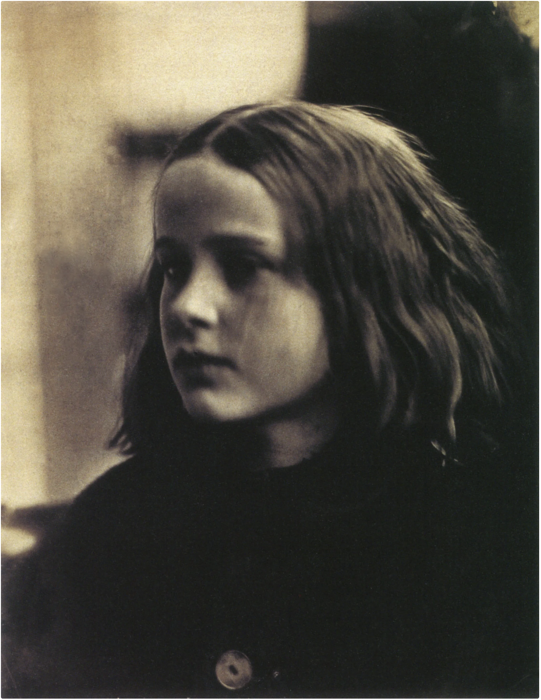
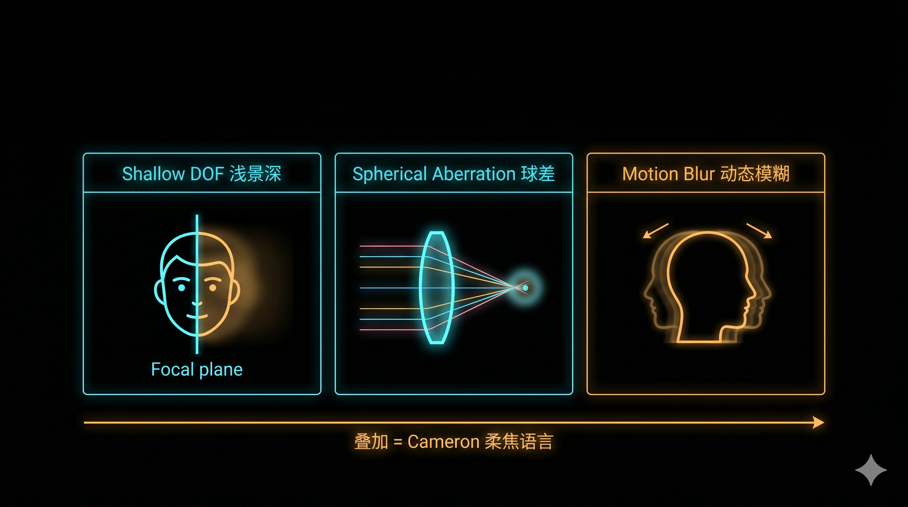

+++
title = "经典作品拆解 #3：Annie, My First Success（安妮，我的第一张成功作）"
description = "1864 年一张被同行退稿的「焦点偏了」的肖像，却定义了未来一百六十年的肖像语言——肖像要拍的不是「脸」，是「在场」。"
date = 2026-05-26
tags = ["摄影", "经典作品", "摄影史", "Julia Margaret Cameron", "软焦", "湿版火棉胶", "肖像"]
categories = ["摄影"]
series = ["经典作品拆解"]
showTableOfContents = true
+++

> 1864 年一个 48 岁的女人拍下一张「焦点偏了」的肖像，同行嫌其技术不过关——但她在告诉未来一百六十年：肖像要拍的不是「脸」，是「在场」。

## 一、那张被同行退稿的「失败作」

1864 年 1 月 29 日，英国怀特岛 Freshwater Bay。Julia Margaret Cameron 收到女儿送的一台滑动盒式相机不到一个月。这一天她 48 岁。邻居家 9 岁的 Annie Philpot 被叫进那间刚改造好的鸡舍摄影棚，坐下，保持不动。曝光时间约三到七分钟，视当天的光线而定。

冲出来的负片，面部焦点偏移了几毫米，鼻尖是虚的，嘴角带柔光晕，背景雾蒙蒙。如果今天交给任何一个图片编辑，会被退稿。但 Cameron 把它装裱、签名、在背面用铅笔写上「Annie - My First Success」、注册了版权。她后来在自传里写：「我感觉是这孩子亲手做出了这张照片。」

同时代的伦敦 Photographic Society，她交的作品反复被评审同行打上「out of focus」「技术太差」的评语。但 Tennyson、Darwin、Herschel、Carlyle 这些人却偏偏要坐船到怀特岛去让她拍。一个被主流摄影界看不上眼的女人，正在不自觉地定义未来一百六十年的肖像语言。

*图：Cameron 自认的「第一张成功作」。画面里最有视觉锚定感的是一只眼睛附近——其余一切都被柔光、浅景深和微动模糊交付给「气场」。图片来源：[Wikimedia Commons](https://commons.wikimedia.org/wiki/File:Annie_my_first_success,_by_Julia_Margaret_Cameron_(restored).jpg)，公有领域*

## 二、湿版灵魂与一架「不够好」的镜头

要读懂 Cameron 在做什么，先得知道 1860 年代拍一张肖像意味着什么。

她用的是**湿版火棉胶工艺（wet collodion）**：在一块玻璃板上现场涂上含卤化物的火棉胶液，进暗房在硝酸银里浸到感光，趁表面还湿着拿出来曝光，拍完立刻在仍然湿着的状态下显影。从涂液到显影完成，必须在约 10 分钟内走完。这套工艺的感光速度换算到今天，远低于今天常用的 ISO，常常导致数秒到数分钟级的曝光时间。Cameron 的肖像常见说法约为 3 到 8 分钟一张。

还有一个常被忽略的细节：湿版主要对**蓝紫光**敏感（属于 blue-sensitive 介质）。这意味着同样亮度下，蓝色织物、白色高光、晴空看起来比肉眼亮，红色和深棕（包括口红、肤色里的暖调、深色头发）则比肉眼暗。今天看 Cameron 画面里那种「肤色偏沉、白衣偏亮、头发几乎吃进黑里」的影调——很大程度是介质的光谱响应在说话，不全是审美选择。把现代数码的曝光经验直接套回这套介质，会读偏。

她的镜头是法国 Jamin 厂的一架长焦肖像镜头。可查资料里有版本记为约 12 英寸焦距、有效光圈 f/6 上下；后期她也使用过更大规格的镜头（包括有记录的 30 英寸 Dallmeyer 平场镜）。具体型号与口径学界并未完全统一，但能确定的是这一类早期人像镜头在像场边缘覆盖、色差和焦点一致性上有明显限制——开到接近最大光圈是柔的，球差和色差都没校准好。Cameron 没有选择回避这些限制，反而接受、甚至利用了它们。

所以拍 Annie 那天的工作流大致是这样：镜头开到最大光圈附近、曝光数分钟、对焦靠毛玻璃看进去那一点点微弱的逆象。她不会说「我选了 f/6」，她会说「我用了能在这个光线下让孩子坐完这件事的唯一组合」。

同一时期伦敦、巴黎的商业肖像店在做什么？用更短的镜头、更小的光圈、加头架锁住被摄者、调亮摄影棚天窗、把曝光压到几十秒。这套工作流的目标是一个词：likeness——「拍得像」。Cameron 走的是另一条路。

## 三、这一张照片在做什么

### 3.1 三个视觉决策

随便看一下 Annie 的脸，有三件吃不到一眼看出、但一旦看出来就避不开的事。

**第一，画面里最有视觉锚定感的是一只眼睛附近。** 鼻尖、嘴角、远侧脸颊、耳际头发——都明显比这一只眼睛软。在浅景深下，整张脸不可能同时清楚——那就把清晰预算都交给一只眼睛。这是「焦点优先级」的极致版本：清晰被当作稀缺资源去分配，而不是匀给所有像素。

**第二，画面整体偏暗，高光集中在脸的一半。** 背景几乎是纯黑。光从侧上方进来，打亮 Annie 额头、颧骨、颈项、发边，另一侧面颊沉入阴影。这不是当时商业肖像那种顶面平光，是一种接近 17 世纪荷兰油画的明暗结构。Cameron 在鸡舍里复刻了伦勃朗的灯光。

**第三，姿态没有被摆出来。** Annie 的侧脸、微启的嘴、微偏的眼神——这不是谁设计的。一个 9 岁的孩子被告知「保持不动 5 分钟」，她会做 5 分钟里一个孩子能做的那件事：轻微偏头、抿抿嘴、眼神脱焦望去某处。Cameron 没有要求她「看起来漂亮」，只要求她「留下来」。最后那一口气里被记录下来的姿态，恰好是一个孩子未经训练的「出神」。

### 3.2 软焦的物理与一个女人的倒走

她的同行们试图反着镜头的不完美走路——收光圈、上更高规格的镜头、后期掩饰。Cameron 倒着走。她这么做，背后是一个物理原因和一个审美原因。

物理原因是这样的。Cameron 镜头的长焦距 × 大光圈意味着浅到几乎不存在的景深。拍一张紧脸头，鼻尖到耳际的距离只有几厘米，但这几厘米已经足以超出焦平面。深处的耳际、近处的鼻尖都会虚。加上大光圈下未校准的球差，在焦平面上本该锐的细节也会带一层轻微的柔光晕——高光的边缘不是利的，是渐变的。最后，动辄 3–7 分钟的曝光意味着任何呼吸、眨眼、领项调整都会记下多个微错位的叠影。三种「不清」叠加：浅景深造成的焦平面偏移、球差造成的柔光晕、长曝光造成的动态模糊。今天看 Cameron 的画面，人们可以从形态学上把三者拆开（这是主线 #3-8 会展开的话），但在她手里，三者被叠成了同一种东西。

这里有个边界要划清，避免把「软焦」误解成「随便拍虚都行」。软焦（soft focus）是焦平面上仍然有细节、只是高光带柔晕、整体微微弥散；失焦（missed focus）是焦平面整个走偏到不该的位置；动态模糊（motion blur）是物体在曝光期间位移留下的方向性叠影；浅景深（shallow DOF）是焦前焦后空间深度上的衰减。这四件事形态完全不同——Cameron 的画面是前三者的叠加，但每一种都可以被单独诊断、单独调用。把它们混为一谈成「拍虚就是艺术」，就丢掉了 Cameron 真正的工程价值。

审美原因要追到拉斐尔前派（Pre-Raphaelite）。Cameron 与 Watts、Rossetti、Tennyson 这圈画家、诗人过从甚密。这些艺术家在画布上追求的是「情感的真」而不是「解剖的对」：人脸上重要的不是毛孔距、肤色均匀、骨架准确，是「这个人现在在想什么」。Cameron 把这件事拼接到摄影里。她要的不是「这个孩子长什么样」，是「这个孩子这五分钟里是什么状态」。

她在自传里写过一句被后人反复引用的话：「I longed to arrest all beauty that came before me, and at length the longing has been satisfied.」关键字是 arrest——「拦下」、「冻结」，不是 record（记录）也不是 reproduce（复现）。这是两种肉眼可见的肖像哲学：

> 同时代的商业肖像师追求 likeness——把一个人最容易被认出来的那一面拍下来。Cameron 追求 presence——这个人在这一刻的「在场感」。likeness 是「是谁」，presence 是「在场」。这两个聊起来表面似乎接近，拍出来经常不重合。

这里需要做一下「意图 vs 意外」的平衡。Cameron 的柔焦是不是从头到尾全是「故意」？不完全是。她是「接受」了这些技术结果，然后发现这正是她要的语言，然后不再去「修正」它。这和「从一开始就计算好柔焦该多软」不一样，但也远不是「拍坏了透」。「主动选择不去修复一个技术缺陷」本身就是创作决策。

*图：Cameron 画面里「不清」的三个独立责任方——浅景深造成的焦平面偏移、球差造成的柔光晕、长曝光造成的动态模糊。在主线 #3-8 里三者被拆开讲，在她这里被叠成同一种语言*

## 四、她在摄影史里的位置

生前 Cameron 几乎没从主流摄影界拿到认可。Photographic Society 展出她作品时贴过「out of focus」的标签，评论者说她「压根不懂镜头怎么用」。但她同时被那个时代最聪明的人一起点名要拍：Tennyson 把她拍的自己叫作「the dirty monk」并为之骨高三丈；Darwin 在她镜头前坐下时完全不抵抗；Herschel——天文学家、「photography」这个词的发明者之一——坚信她拍的肖像是这个时代最好的。

1875 年她随家人迁回斯里兰卡，1879 年在那里去世。生前未获主流承认。但 1880 年代之后兴起的 Pictorialism（画意摄影运动）把她追认为重要先驱。这个运动从 1885 年到 1915 年呈现出一场全球范围的「反锐利」，他们主动设计了「软焦镜头」（soft-focus lens）这种产品品类——很多研究把 Cameron 当作他们经常回溯的视觉源头之一。Edward Steichen 早期人像里的柔焦与明暗结构，骨架里能看到与 Cameron 相通的语言。再到后面：现代柔焦镜头、Lensbaby 这类软焦镜、人像后期里的「柔肤」「光晕」插件、电影里柔化滤镜——这些「故意把锐利调低」的语言，Cameron 是被反复回溯的重要先例之一，但不是唯一源头：画意摄影本身、电影柔化技术、甚至日本浮世绘对欧洲艺术家的影响，都各自贡献了一部分。

另一条更隐性的影响在女性肖像传统里。维多利亚时代女人玩相机被看作「业余爱好」，Cameron 偏要把版权印在每一张照片背面、把作品送进 Royal Photographic Society、给自己的相册标价销售。她拍儿童时不让他们装大人，拍女性时不让她们摆成照相馆的标准姿势。这条「不把人拍成样子，拍成他自己」的肖像路数，后来会被 Diane Arbus、Sally Mann、Annie Leibovitz 接力。

我的看法是：Cameron 不是「柔焦美学的开创者」，柔焦美学是后人给她贴上的标签。她真正进行的事是让肖像拍摄者意识到一件事——**你手里的这台机器不是中性工具，它有它自己的语言。选择「顺这个语言」还是「反这个语言」，本身就是创作决策。**

## 五、与主线的接口

**如果你想深入……**

这张照片的核心决策对应我们摄影主线的「镜头与成像」模块：

- **#3-1 清晰不是一个指标：Resolution / Acutance / 纹理 / 噪声的四分法** — 讲了「清晰」实际上是四个独立维度的组合，Cameron 在其中几个维度上都选了不主流的位置，但在「最重要的那个点」上——Annie 的眼睛附近——仍然有高 acutance。读完那篇，你会明白为什么「柔」不等于「糊」。
- **#3-8 失焦不是糊：失焦的形态学 + 对焦策略** — 讲了浅景深造成的焦平面偏移、球差造成的柔光晕、长曝光造成的动态模糊各自的形态特征。Cameron 同时叠加了三种，但每一种都可以被拆分、诊断、单独调用。

读完这些，你对 Cameron 的「故意柔焦」会从「那个柔柔的古早风格」变成可拆分、可复用、可主动调用的视觉决策。

## 六、对今天的启示

今天清晰是免费的。ISO 12800、八千万像素、识别到睁眼闭眼的对焦系统，让拍一张锐利肖像变成默认选项。但 Cameron 留下的方法论反而更有用了。

**第一，分清「哪里需要锐利，哪里不需要」。** 一张人像不需要每一根头发都锐利。眼睛、嘴角、手——这些情绪锚点要清晰；其他区域可以让位给光线。今天最直接的可执行：拍人像时 f/1.4 的大光圈不是为了「显得高级」，是为了主动把大部分画面交给柔光，让最重要的那个细节独占注意力。

**第二，长曝光不只用来拍夜景。** 把快门拖慢到 1/15 s 拍坐姿肖像，被摄者轻微的呼吸、眨眼、表情变化会被叠加进画面——这不是「拍糊了」，是把「几秒钟里的平均神态」留下来。Cameron 当年被物理逼着做的事，今天可以主动选择这样做。但要让这件事在今天可复现，有几个具体前提：相机一定要在三脚架上，或者至少有非常稳的支撑（手持 1/15 s 在长焦下会糊到无法读图）；被摄者头部要有轻微靠点（椅背、墙、自己的手），减少大幅位移；最关键的是**眼睛必须保持清晰**——眼睛糊了，整张肖像就失去了锚点，那不是软焦，是失败。可以先从 1/30 s 起步、拍十张挑一张，再决定要不要往更慢的方向推。设计轻微的不清，不是抵抗它。

## 七、回到 Annie 的那张照片

读这篇之前，你看 Cameron 的照片可能会觉得「古早、雾蒙蒙、技术不行」。读完之后希望你能看到另一件事：**1864 年 1 月那个下午，48 岁的 Cameron 没有「克服」她的器材，她让她的器材按它自己的方式说话**。那张焦点偏了的 Annie 照片不是失败的肖像，是肖像摄影第一次承认：「我们要的不是把人拍清楚，是把这个人在这一刻的存在拍下来」。

技术的「局限性」和审美的「立场」经常是同一件事，区别只在于你是被它拖着走，还是主动驾驶它。Cameron 手里那架不够好的镜头、那套太慢的化学、那间不够亮的鸡舍——但她从「抱怨这些限制」走到了「使用这些限制」。这是这个系列里一个会被反复出现的主题：最好的语言，往往不是沉默地努力去掩盖介质的问题，是让介质说出它自己的话。

下一篇我们去看一张与 Cameron 截然相反的照片：Edward Weston 1930 年用 8x10 大画幅、f/64 拍的一只青椒。从前景辣椒的尖端到后景木板的纹理、每一个点都锐利。同样是拍一个对象讲一个观点，但 Cameron 把锐利抹掉，Weston 把锐利推到极致。同一门艺术，两种相反的工程哲学。

## 八、参考资料

- **作品权威页面**：[Annie - V&A Collection](https://collections.vam.ac.uk/item/O81145/annie-photograph-cameron-julia-margaret/)
- **高清原图（Wikimedia Commons，公有领域）**：[Annie my first success.jpg](https://commons.wikimedia.org/wiki/File:Annie_my_first_success,_by_Julia_Margaret_Cameron_(restored).jpg)
- **摄影师**：Julia Margaret Cameron (1815–1879)，英国维多利亚时期摄影师。1863 年 48 岁时收到女儿赠送的滑动盒式相机，由此开始 11 年的密集创作。她在怀特岛 Freshwater Bay 的家中改建煤棚为暗房、鸡舍为摄影棚，拍摄包括 Tennyson、Darwin、Herschel、Carlyle、G.F. Watts 等维多利亚时代名人，以及 Mary Hillier、Julia Jackson（她的外甥女、Virginia Woolf 的母亲）等由邻居与家人担任的女性模特。1875 年随家人迁居斯里兰卡，1879 年在那里去世。生前反复被摄影协会评价为技术不达标，身后被广泛认为是肖像摄影的奠基者之一。
- **延伸阅读**：
    - Sylvia Wolf, *Julia Margaret Cameron's Women* (Yale University Press, 1998)——聚焦 Cameron 的女性肖像与神话主题作品
    - V&A Museum, [*Julia Margaret Cameron's working methods*](https://www.vam.ac.uk/articles/julia-margaret-camerons-working-methods)——详细讲解她的湿版工艺、镜头选择、暗房改造
    - Helmut Gernsheim, *Julia Margaret Cameron: Her Life and Photographic Work* (1948)——第一部 Cameron 传记，奠定后世研究基础
    - Morgan Library & Museum, [*Arresting Beauty: Julia Margaret Cameron*](https://www.themorgan.org/exhibitions/arresting-beauty)——2023–2024 年专题展览，含展品高清图与策展论文
