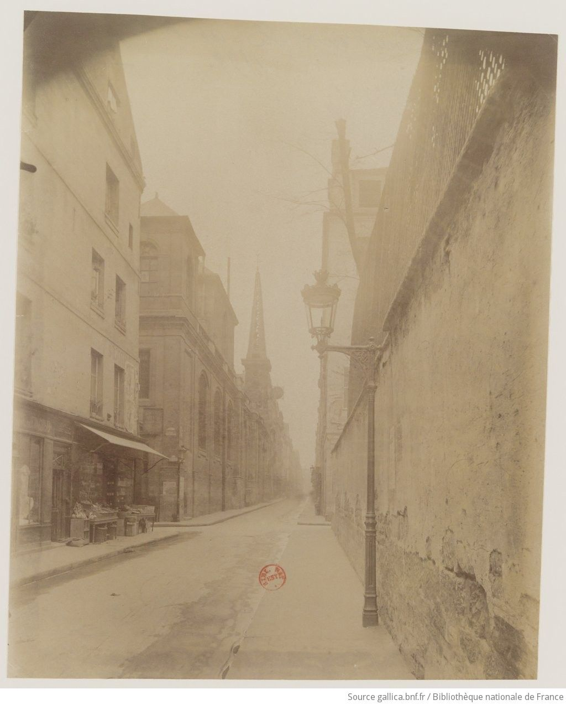
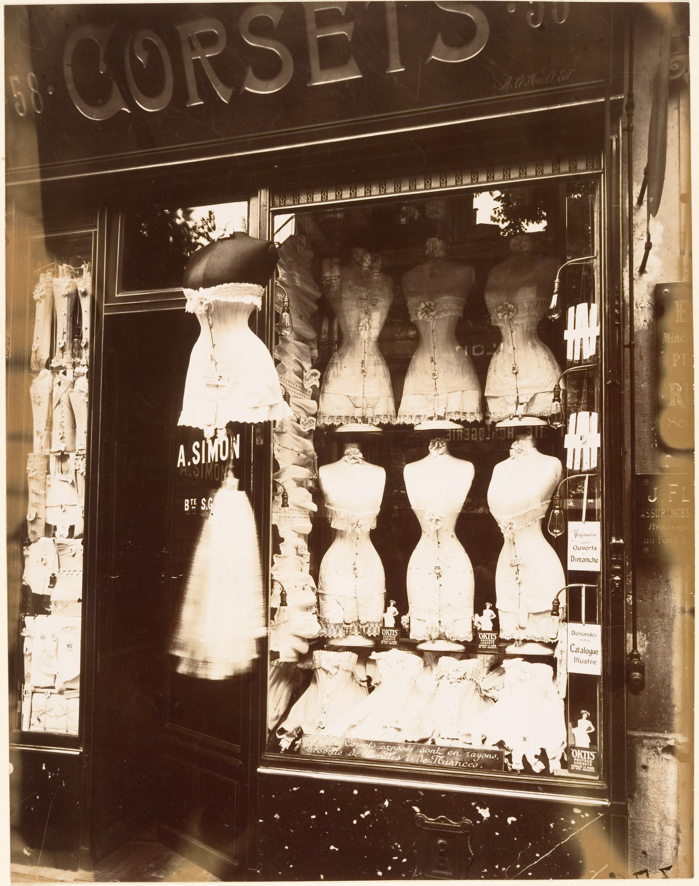

+++
title = "经典作品拆解 #4：Eugène Atget 的巴黎街景"
description = "一个不想当艺术家的「档案工作者」，用 30 年、约 8500 张玻璃版底片给整座巴黎建了一份从街道到门把手的总账——这是档案级摄影方法论的起点。"
date = 2026-06-02
tags = ["摄影", "经典作品", "摄影史", "Eugène Atget", "档案摄影", "大画幅", "街道摄影", "新地形学"]
categories = ["摄影"]
series = ["经典作品拆解"]
showTableOfContents = true
+++

> Atget 不是第一个拿相机记录城市的人——但他把街道、橱窗、门廊这些非纪念碑对象，拍成了 30 年系统的长期项目。这是档案级摄影方法论的起点。

## 一、清晨的木轮车

1900 年前后，巴黎五区某个还没醒来的清晨。一个五十多岁的男人推着一辆木轮车，沿着鹅卵石路面咯噔咯噔走。车上是一台 18×24 cm 的木质大画幅相机、三脚架、十几片玻璃版底片、一块黑布。整套东西二十多公斤。

他把车停在某个十字路口或某条窄巷的开口处，架好三脚架，把头蒙进黑布里取景，拉风箱、对焦、装片、掀开镜头盖，然后等。曝光几秒到几十秒，看光线。再装下一片，再等。一上午通常拍三五张。

他叫 *Eugène Atget*。门口的招牌写着：**Documents pour Artistes** —— 给艺术家的资料。他活着的时候，没有人把他当艺术家，但他也不是无名之辈——巴黎几家市立机构的档案柜里早就有他几千张照片。真正没人想到的是：他死后，整条街拍-纪实-新地形学谱系，都得在这里转个弯。

*图：Rue St Louis en l'Île，1899 年 4 月。Atget 早期典型的空街镜头——巴黎中世纪老城区，清晨没有行人，整条街成了一个被布景过的「舞台」。来源：[BnF Gallica / Wikimedia Commons](https://commons.wikimedia.org/wiki/File:Atget_-_Rue_St_Louis_en_l%27Ile_-_avril_1899,_btv1b10518188c.jpeg)*

## 二、奥斯曼之后的巴黎，与一个三次转行的人

1853 年开始，奥斯曼男爵（Baron Haussmann）受拿破仑三世委派改造巴黎——拆掉中世纪的窄巷、密集街区、不成形的市集，换成笔直的林荫大道、统一立面的奥斯曼公寓楼。到 1880 年代，老巴黎已经被啃掉大半。剩下的还在被拆。

巴黎市政厅为这场改造请的官方摄影师是 *Charles Marville*——他在 1860 年代用大画幅相机系统记录了即将被拆的街区，给市档案馆留底。Marville 是「官方档案摄影」的执行者，工作流由市政厅定义、由市政厅消化。Atget 30 岁拿起相机时，这条路径已经清晰。他做的不是发明这件事，是**把这件事变成一个人的长期项目**——从他自己的客户名册出发，按他自己的主题分类，拍 30 年。

Atget 1857 年生在波尔多附近的 Libourne，父母早亡，跟外祖父长大。年轻时受过戏剧训练，在巡回剧团做过演员，后来因健康/声带问题离开舞台。又尝试过绘画，没卖动。1890 年前后他 33 岁，搬到巴黎蒙帕纳斯，租了间小公寓，挂上「Documents pour Artistes」的招牌——给画家提供风景、街景、人物的资料图，按张卖给画室。

买他照片的画家圈里有 Maurice Utrillo、Edgar Degas、André Derain，但更稳定的客户是机构——卡尔纳瓦莱博物馆（Musée Carnavalet，巴黎市立历史博物馆）、巴黎历史图书馆、装饰艺术博物馆、法国历史古迹委员会（Commission des Monuments Historiques）。机构买他的照片，是因为他们要给「老巴黎」留存档案：拆迁之前，至少底片上还有。1920 年，他甚至主动把已经积累的 2600 多张玻璃版底片卖给历史古迹委员会——这不像一个默默无闻的人会做的事。

这是他工作的物质基础：**他被付钱去拍那些即将消失的东西**。30 年，累计约 8500 张玻璃版底片。

## 三、这张照片在做什么

三件事，相互咬合。

**第一，他主动把自己定位为「档案工作者」，不是艺术家。** 招牌、收据、客户名册、自我介绍——他始终坚持这个身份。1926 年 Man Ray 把他的 4 张照片登在《La Révolution surréaliste》第 7 期上，他要求不署名，说「这只是文献」。这不是谦虚。这是一个工作流的目标函数声明：**我要交付的是可索引、可复制、可被复用的城市信息，不是供观赏的作品**。

**第二，他把整座巴黎拍成了一组 establishing shot。** 在电影叙事里，建立镜头（establishing shot）是用来告诉观众「这里是哪里」的开场镜头——通常宽景、信息完整、不带情节张力。Atget 30 年里几乎每张照片都在做这件事：这是 Rue des Ursins、这是 Marché des Carmes、这是 Boulevard de Strasbourg 上的橱窗。把 8500 张连起来看，他在给整座城市写一份从街道到门把手的总账。

**第三，「清晨没人」不是巧合，是工作流的副产品被审美化的结果。** 他用的玻璃版感光乳剂慢，速度大约相当于今天的 ISO 4-10 区间，曝光时间普遍在几秒到几十秒。任何走动的人都会被糊成幽灵。所以他选清晨出门。但这个出门时间反而决定了他的视觉语言：他的巴黎是**人离场后的舞台**——光线还在，建筑还在，影子还在，只是演员还没到。

## 四、它是怎么做到的

把上面三件事推到地面，是一套完整的工作流。

**设备的物理约束。** 大画幅 18×24 cm 木相机加三脚架，单人推车搬运的极限。镜头是直焦镜（rectilinear），光圈通常缩到 f/16 到 f/22 之间——为了从前景的鹅卵石到后景的屋顶都清晰，必须收很小的光圈。光圈一缩，曝光时间就线性拉长。这一系列约束最终落到时间窗口上：他必须在光线足够、空气稳定、街上没人的那个 15 分钟里完成。

**视角校正：大画幅相机的真正杀手锏。** 大画幅相机有一件 35mm 相机做不到的事——镜头板可以独立平移和倾斜（rise / fall / shift / tilt）。仰头拍楼，垂直线必然向上收敛成梯形——这是相机光轴不再垂直于建筑立面造成的形变（keystoning）。Atget 拍街景时频繁使用前组上升（rise）：相机不抬头、光轴保持水平，但取景框抬高，结果建筑垂直线在底片上仍然平行。30 年后 Cartier-Bresson 的 35mm 街拍没有这套调整，要拍整栋楼只能仰头，于是上窄下宽。Atget 的照片之所以看起来「不像我们今天的街拍」，一半原因在这里：建筑的垂直线，真的是垂直的。

**「一底一片」工作流。** 拍回家，玻璃版底片在小暗房里冲洗、定影、晾干。然后**接触印样（contact print）**——不用放大机，把底片直接压在印相纸上曝光，照片就是底片的 1∶1 副本。这意味着两件事：（1）构图必须在拍的时候定死，没有「后期裁切」这一步；（2）每张底片只能产出一种构图，他在按下快门那一刻已经决定了这张照片是什么。

**主题编目，不是线性叙事。** 这是 Atget 最反「作品」的一点。他的底片不是按时间编号，是按**门类**：招牌（Enseignes）、门道（Portes）、楼梯（Escaliers）、橱窗（Boutiques）、卖花人（Petits Métiers）、宗教雕像（Art religieux）、妓院（Maisons Closes）、公园（Parcs）……他的客户名册按主题查询，画家来要「19 世纪木质招牌」，他就翻出整盒。

**目标函数。** 把上面这些连起来，你会发现 Atget 的工作流目标函数极其反直觉：**不是「这一张要美」，而是「这一组要完整、可索引、可复制」**。完整意味着同一主题尽可能穷尽；可索引意味着按门类编号让人能找到；可复制意味着接触印样工艺保证副本一致。

这是档案级工作流的核心。它跟「艺术作品」的目标函数（独特、不可复制、个人表达）几乎反着来。

可反讽就在这里：**这套以「实用」为目标的流程，最终产出了 20 世纪最有诗意的照片之一**。

*图：Boulevard de Strasbourg, Corsets, 1912。橱窗里的紧身衣模特、玻璃上街道的反射、人体与服装的诡异并置——Atget 拍橱窗时只是在记录一种商业陈列方式，但超现实主义者从这张照片里看到了 unheimlich（诡异的熟悉）。来源：[Metropolitan Museum of Art / Wikimedia Commons](https://commons.wikimedia.org/wiki/File:Eug%C3%A8ne_Atget,_Boulevard_de_Strasbourg,_Corsets,_Paris,_1912.jpg)*

## 五、它在摄影史里的位置

短期看，Atget 生前并非完全无名。他向卡尔纳瓦莱博物馆、巴黎历史图书馆、历史古迹委员会卖出了相当数量的底片和印样——他靠这个吃了 30 年饭。他在艺术家圈子里的声誉，是 Man Ray 和 Berenice Abbott 偶然为他制造的。

1925 年，*Man Ray* 通过自己的助手 *Berenice Abbott* 注意到 Atget——他们都住在巴黎左岸的 Rue Campagne-Première 这条街上。Man Ray 买下几张橱窗照片。1926 年 6 月，他在《La Révolution surréaliste》第 7 期上登了 4 张 Atget 的照片，其中一张是日食期间巴黎人仰头看天的画面，被超现实主义者读成「集体催眠」的隐喻。Atget 要求不署名，理由是：「这只是文献。」

这是**误读式认领**——超现实主义者从 Atget 空街、橱窗里的人偶、雕像上的阴影里看到了 unheimlich（弗洛伊德的概念，「诡异的熟悉」），把他追认为「前超现实主义者」。Atget 自己没接茬，但这次发表让他第一次进入艺术家圈子。

1927 年 Atget 去世后，他的遗嘱执行人 André Calmettes 把约 2000 张底片售给历史古迹委员会——加上 1920 年 Atget 自己卖出的 2600 多张，这批官方档案合计约 5000 张底片留在了法国。1928 年，Abbott 几乎用尽她的全部积蓄，买下了 Atget 工作室里**剩余**的部分——约 1500 张玻璃版底片和近 8000 张印样。她带着这批资料回到美国。1930 年，由 Pierre Mac Orlan 撰文、Abbott 担任 photo editor，*Atget, Photographe de Paris* 在巴黎和纽约同步出版——这是 Atget 作品早期重要的系统出版物之一，让他的影像第一次成规模地进入英语世界。1968 年 Abbott 把整批底片连同自己的研究档案卖给 MoMA，由 John Szarkowski 主持，1981 年起出版了四卷本 *The Work of Atget*。

如果没有 Abbott 这条接生链，Atget 不会消失，但他大概率会停留在「巴黎市档案里的一个摄影师」这个层次，进不了 20 世纪现代艺术史。

长期看，影响更大。*Walker Evans* 在 1930 年代多次写文章公开承认 Atget 是他的偶像。Evans 1938 年的 *American Photographs* 整本书的视觉语法——正面拍摄的建筑、空店面、接触印样工作流——基本上是 Atget 的美国版。从 Evans 往下，是 *Robert Frank* 的 *The Americans*、*Stephen Shore* 的 *American Surfaces* 和 *Uncommon Places*、再到 1975 年「New Topographics（新地形学）」展览那一代——Robert Adams、Lewis Baltz、Bernd & Hilla Becher——他们的共同语法，往上追三代，源头都在 Atget。

我的判断：**Atget 真正的贡献，不是「记录消失中的城市」这个想法**——19 世纪的城市改造留下了大量官方档案摄影，从 Marville 的巴黎到 John Thomson 的伦敦都已经有了。**Atget 的独特性在于：他把官方档案摄影的工作流，转化成一个人的长期项目**。摄影从此有了一种新的生存方式——除了肖像 / 新闻 / 广告之外，可以是一个人用 30 年去给一个对象建立完整目录。从这里往下，Walker Evans 的美国、Bechers 的工业建筑、Stephen Shore 的小镇加油站，都是同一个工作流的变体。

## 六、与主线的接口

**如果你想深入……**

这张照片的核心决策对应我们摄影主线的「叙事与编辑」和「工作流与交付」两个模块：

- 叙事与编辑·Establishing 工程 —— 讲了如何用一组（而不是一张）照片建立一个地方的视觉信息
- 工作流与交付·核心目标函数 —— 讲了拍摄的目标函数（「我究竟要交付什么」）如何决定整套流程

读完这些，你对 Atget 的理解会从「看过」变成可操作的拍摄认知。

## 七、对今天的启示

**第一，给个人项目设一个「档案级目标函数」，反而能逃离作品焦虑。** 你不需要每张都「好」——你只需要把一个主题记录得**完整、可索引、可复制**。完整本身就是一种审美：把你住的小区所有的店招在三年里拍一遍，按门类编号存起来，这套照片的力量不来自任何一张，而来自这套照片作为一个整体的存在。Atget 用 30 年证明了，单张照片可以平庸，但 8500 张连起来不可被替代。

**第二，档案级目标函数的可执行模板。** 想给自己的项目套一个 Atget 式的工作流，把下面五件事先写下来：

- **主题**：一类对象（店招 / 楼梯 / 阳台）还是一个地点（你住的小区 / 你通勤的地铁线 / 一座城市的所有街心公园）
- **地理范围**：边界在哪里——步行 30 分钟内？三环以内？整个杭州？
- **时间跨度**：你打算拍多久——一年？五年？十年？
- **编号与索引方式**：按拍摄日期？按门类（Atget 法）？按地理坐标？
- **重复拍摄规则**：同一对象多久回去拍一次——每季度？年度？永不重拍？

这五件事一旦写下来，你就有了一个**目录**而不是一堆照片。Atget 的 8500 张能立住，靠的就是这种事先把规则定下来的纪律。如果你回答不出其中任何一项，你的项目还停在「拍着拍着看」的阶段。

**第三，主题编目优于单张爆款。** 当代摄影的默认思维是「作品（work）」——一张震撼的照片可以独立成立。Atget 提供的反例是「目录（catalog）」——单位不是张，是组；评价不是看高光，是看覆盖。下次出门前先问自己一个问题：**我今天拍的这张，是要放进哪个抽屉的？** 如果你答不出来，说明你还没有目录。

## 八、收尾

读这篇之前，你可能以为「档案」是「艺术」的反面——前者枯燥、机械、为别人服务；后者表达、独特、为自己创造。读完之后，你应该看见 Atget 给出的反例：**把档案做到极致，就是艺术**。前提是你的目标函数足够诚实——他从来不假装自己在创作，所以他真的能在 30 年里每天清晨推着木轮车出门。

下一篇我们会看 *The Steerage*（1907），Alfred Stieglitz 在一艘横渡大西洋的船上按下的快门——这是他从画意摄影（Pictorialism）转向现代主义摄影语言的关键节点之一。这一步要付出的代价是什么？

## 参考资料

**作品权威收藏**

- [Eugène Atget at MoMA](https://www.moma.org/collection/artists/229) —— MoMA 收藏的 3,039 件 Atget 作品，源自 Abbott-Levy Collection
- [Photographs of Paris by Eugène Atget — Wikimedia Commons](https://commons.wikimedia.org/wiki/Category:Photographs_of_Paris_by_Eug%C3%A8ne_Atget) —— 公有领域版本，约 874 张
- [BnF Gallica — Eugène Atget](https://gallica.bnf.fr/) —— 法国国家图书馆的数字档案
- [Charles Marville — Photographer of Paris (NGA)](https://www.nga.gov/exhibitions/2013/marville.html) —— 巴黎官方档案摄影的前史

**摄影师生平**

Eugène Atget（1857-1927），法国摄影师，生于波尔多附近的 Libourne。年轻时受过戏剧训练，做过巡回剧团演员，后因健康原因离开舞台，又尝试绘画，最终在 1888 年前后转向摄影。1890 年起在巴黎挂出「Documents pour Artistes」招牌，主要客户是巴黎市立机构（Musée Carnavalet、巴黎历史图书馆、装饰艺术博物馆、历史古迹委员会）和画家圈子。生前在档案领域有稳定声誉，1920 年主动售出 2600 多张底片给历史古迹委员会。去世后由 Berenice Abbott 整理推广，进入现代艺术史。

**延伸阅读**

- John Szarkowski & Maria Morris Hambourg, *The Work of Atget*（四卷本，MoMA, 1981-1985）—— 至今最完整的 Atget 研究
- Berenice Abbott (photo ed.) & Pierre Mac Orlan, *Atget, Photographe de Paris*（1930）—— Atget 作品早期重要系统出版物之一
- [*Eugène Atget: "Documents pour artistes"* — MoMA 展览页面](https://www.moma.org/calendar/exhibitions/1199)
