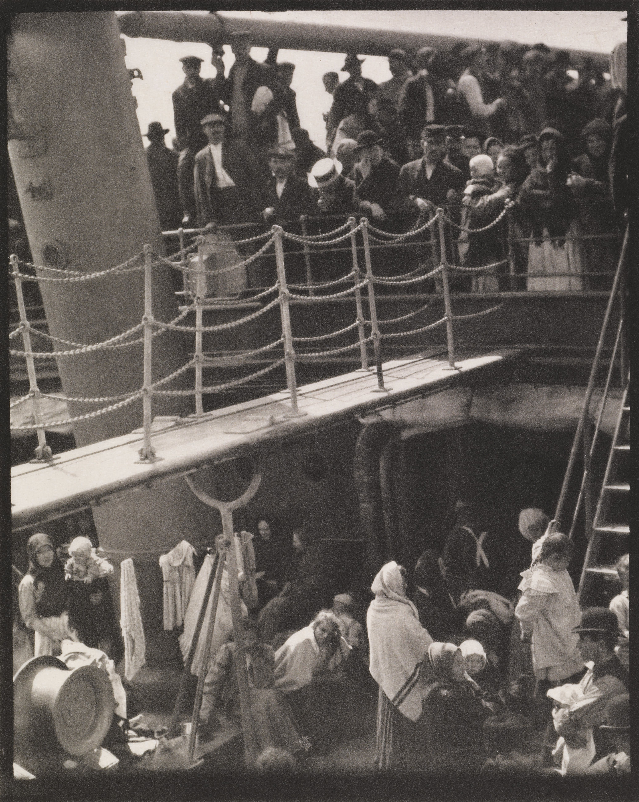
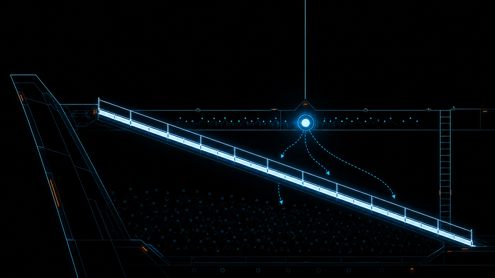

+++
title = "经典作品拆解 #5：The Steerage（统舱）"
description = "《统舱》的伟大不在于它拍了穷人，而在于 Stieglitz 第一次放下绘画式的「美」，让相机用自己的几何与影调去看世界。"
date = 2026-06-09
tags = ["摄影", "经典作品", "摄影史", "Alfred Stieglitz", "The Steerage", "直接摄影", "现代主义", "构图"]
categories = ["摄影"]
series = ["经典作品拆解"]
showTableOfContents = true
+++

> 《统舱》的伟大不在于它拍了穷人，而在于 Stieglitz 第一次放下绘画式的「美」，让相机用自己的几何与影调去看。

## 一、那一张没来得及重拍的底片

1907 年夏天，Alfred Stieglitz 站在一艘横渡大西洋的邮轮头等舱甲板上，心情糟透了。他受不了周围那些暴发户的做派，一个人走到甲板尽头朝下望去——下面是统舱，挤着一群乘低舱位的旅客。就在那一刻他怔住了：一道白色的舷梯斜切过人群，一顶圆草帽、一根斜向一边的船体结构、交叉的吊裤带、一段铁梯……这些形状彼此呼应，像一幅画。他冲回舱房抢出那台 Graflex 手持相机，里面只剩一张没曝光的底片。等他跑回来，那个戴草帽的男人还靠在栏杆上没动。他按下了快门。多年以后他说，这是他拍过最好的一张照片。

*图：The Steerage（统舱），Alfred Stieglitz，1907，照相凹版（photogravure）。一道白色舷梯把画面切成上下两层——这条线既是甲板的分界，也是阶级的分界。图片来源：[Wikimedia Commons / Minneapolis Institute of Art（公有领域）](https://commons.wikimedia.org/wiki/File:Alfred_Stieglitz_-_The_Steerage_-_Google_Art_Project.jpg)*

## 二、一台手持相机、一张底片、一束没法商量的光

先纠正一个流传最广的误读：这艘船不是开往美国的移民船。它叫 SS Kaiser Wilhelm II，从纽约出发、开往欧洲——Stieglitz 带着妻女去欧洲度假，坐的是头等舱。统舱里那些人，是从美国前往欧洲的低舱位旅客；其中可能有人被拒入境、正在返程，但不能简单概括成「一船被遣返的人」。所以这张照片讲的不是「移民涌向新大陆的希望」，那份被后人安上去的感伤，本不属于它。

真正限制他的是现场条件。1907 年没有连拍，没有自动测光，他手里是一台 Graflex 手持相机——靠腰平取景器低头取景、对焦慢、换片更慢，里面只有一张没曝光的底片。这意味着他没有第二次机会，也没有时间反复构图。光是甲板上方斜射下来的日光，他既不能补光，也不能让那群人重新站位。他能动的，只有自己站在哪、什么时候按、以及让这唯一一次曝光把影调落在哪里。

还要把当时的语境放进来：那个年代摄影正被「画意摄影」（Pictorialism）统治——柔焦、朦胧、刻意做旧，照片拼命想长得像油画或铜版画，仿佛只有这样才配叫艺术。而 Stieglitz 自己就是画意摄影阵营的旗手。所以《统舱》的反常，恰恰在于它出自一个最该「画意」的人之手，却朝着相反的方向走了一步。

## 三、技术拆解

### 3.1 这张照片在做什么

**它用一道横贯画面的白色舷梯，把人群切成上下两层——几何上的分界线，同时就是社会阶层的分界线。** 你看那道吊桥／舷梯，是整张照片里最亮、最干净的形状，正好压在上下两层甲板之间。上层站着戴礼帽、草帽的男人，下层挤着裹头巾的女人、孩子和行李堆。Stieglitz 没有去拍任何一张「苦难的脸」，他拍的是一条线如何把一船人劈成两个世界。

**它让影调自己排队：被光打到的地方跳出来当锚点，背光的人堆沉下去当底子。** 你的眼睛会先抓那顶圆草帽和那道白舷梯——它们是画面里的最高光，几乎是不由自主地先看它们；然后视线才慢慢沉到下层那片暗下去的人群里。明和暗在画面里不是平均分布的，它们被组织成了一块块可以「依次阅读」的区域。

*图：用抽象结构示意《统舱》的读图骨架——明亮的对角舷梯把画面分成上、下两个影调区块，倾斜的支架与垂直的桅杆在边缘形成张力，圆草帽是上层区的视觉落点。*

### 3.2 它是怎么做到的

先建立一个直觉：当你第一眼看《统舱》，最先「读」到的其实不是人，而是形状和明暗。这正是关键——Stieglitz 把一个本来很「纪实」的场景，看成了一组抽象的几何与影调关系。问题是，在那种没法摆布的条件下，他是怎么把这组关系稳稳拿下来的？

答案要从光说起。甲板上方斜射下来的强日光，是一种典型的强侧光／顶光：被它正面照到的东西——白舷梯、浅色草帽、亮衣物——一下子冲到高光区；而背着光、或者缩在下层阴影里的人群和船体，则成片地掉进暗部。这种「亮的极亮、暗的极暗、中间过渡很陡」的特性，本身就会把场景自动切成一块块影调区。这就是所谓的影调分区：不是后期分的，是光当场分好的。Stieglitz 要做的，不是制造它，而是读懂它、然后框住它。

这里就触到了这张照片最硬的那个约束：只有自然光，且只有一张底片。这意味着曝光是一锤子买卖——你为整个场景定一个曝光水平，然后接受所有东西各自落在哪里。从画面结果看，他更像是优先保住那些明亮形状的层次：让白舷梯、草帽、亮衣物在底片上还留得住细节，代价是下层人群沉入暗部、细节被吞掉。但这恰好成全了画面——暗下去的人群变成了一整块底子，反而把上面那道亮线衬得更醒目。换句话说，他没有「把每个人都拍清楚」，他选择了「保住那条几何线」。

而真正属于他个人创作的那一步，是机位。他站在头等舱的高处往下俯看，这个角度把一个三维的、嘈杂的甲板场景，压成了一个近乎平面的形状拼贴：那根斜向左边的结构（Stieglitz 自己把它叫作烟囱，也有研究认为更可能是桅杆或吊杆）顶住左边，桅杆从上缘切下来，铁梯立在右侧，吊裤带在一个男人背上画出交叉线——这些边缘上的元素被画框裁切、彼此牵制，绷出一种紧张的几何秩序。Stieglitz 后来一件件数过这些形状。所以这张照片的「构图」不是碰巧撞见的，而是他选定了一个能让这些形状同时成立的位置和瞬间，然后框死。

最后一层是介质。他后来用照相凹版（photogravure）来印这张照片——这种工艺能给出很深的黑和很长的影调过渡。介质在这里不是中性的搬运工，它把现场那种影调分区又强化了一道：黑的更沉，亮线更跳。

把这几步翻译成一句话：在一个不能补光、不能重拍、不能挪动被摄者的现场，Stieglitz 的「决策」不是任何一个相机参数，而是——读懂自然光已经把场景切成了什么，选一个能让这些形状对齐的高机位，然后用唯一一次曝光，把最亮的那副几何骨架保下来。约束没有困住他，反而逼他做了最关键的那几个判断。

## 四、它在摄影史里的位置

短期来看，《统舱》是 Stieglitz 自己的一次转身。作为画意摄影的旗手，他本可以继续做那些柔焦的、像版画的「艺术照」；但这张照片几乎不做修饰，靠的全是相机看见的几何和影调。1911 年，他主编的《Camera Work》把《统舱》和毕加索的立体主义素描同期刊出——一张照片与最前卫的现代绘画并置，这个编排本身就是一句宣言：摄影不必再模仿绘画，它可以和最前卫的现代艺术站在同一排。1915 年，他又在杂志《291》里把这张照片以大幅照相凹版的形式重印，郑重地把它当作代表作推出来。

长期来看，它成了「直接摄影」（straight photography）和摄影现代主义的奠基文本之一。它立下的那个观念——一张照片的力量来自相机自己的观看方式，来自对形状、影调、结构的组织，而不是来自把照片做得像别的什么——后来被 Paul Strand、Edward Weston、乃至 f/64 学派一路接了下去。

这里我想给一个明确的立场：《统舱》是被神话过的。它今天的经典地位，有很大一部分是被后期追认的（retroactively canonized）——Stieglitz 本人反复重述那个「灵光乍现」的故事，把它讲成天才的顿悟；而「移民涌向美国」的误读，又给它贴上了一层本不属于它的感伤。如果你冲着这些去看，多半会失望。它真正的价值不在故事，而在结构——它是摄影第一次不再为「自己是台机器」而道歉，转而开始使用这台机器独有的眼睛。

## 五、与主线的接口

**如果你想深入……**

这张照片的核心决策，对应我们摄影主线的「光照设计」与「构图几何」两个模块：

- **光照设计 · Base Exposure：先定背景，再加光** —— 讲了在只有环境光的时候，如何用一次曝光定下整张照片的底色与影调落点：背景亮到哪一档、哪些暗部主动牺牲。《统舱》是这个原则的极端版——没有「再加光」这一步，只有「先定背景」，所以每一分取舍都不可逆。
- **构图几何 · 构图的本质：注意力预算的调度** —— 讲了构图不是摆元素，而是设计观众的观看时间轴：先看哪、后看哪、从哪进画面、何时离开。那道白舷梯和那顶草帽，就是 Stieglitz 给你安排的「入口」。

读完这些，你对《统舱》的理解会从「看过」变成可操作的拍摄认知。

## 六、对今天的启示

《统舱》最能迁移的，是一种「先读光、再按快门」的次序。下次你在市集、车站、人群这种没法布光、又乱又满的现场举起相机，别急着调参数——先眯起眼睛看光把场景切成了几块亮区和暗区，找到那块最亮的形状，把它当锚点框进画面。乱的场景往往不是元素太多，而是没有一条线、一块亮区帮眼睛落脚。

还有一条反过来的提醒。Stieglitz 只有一张底片，所以他被逼着把全部注意力放在观察和机位上。今天我们可以连拍、可以包围曝光、可以后期分区——单张底片的限制早就没了。但也正因为「反正能补救」，我们很容易省掉「我站在哪、画面会被切成什么形状」这个最该花时间的判断。他那份约束今天不必再背，但他在按下快门前就把画面想清楚的纪律，值得借回来用。

## 七、读前与读后

读这篇之前，《统舱》大概是一张「拍移民、拍穷人」的纪实老照片，沉重而遥远。读完之后，它其实是相机第一次放弃模仿绘画、改用自己的几何与影调之眼去看世界的那一刻——而那道白色舷梯，既是构图的分界线，也是阶级的分界线，两件事被同一根线钉在了一起。

但 Stieglitz 的那道线，是某个下午、靠唯一一张底片偶然撞见又恰好框住的——一次不可复制的相遇。几乎在同一个年代，德国的 August Sander 换了个问法：与其等一张画面的几何替你把社会切开，不如用一套稳定到几乎不变的拍法，把整个国家的人一类一类地编目下来。下一篇，我们拆 *People of the 20th Century*（20 世纪的人），看他如何用六百多张正面、平光、去戏剧化的肖像，把农民、手艺人、银行家、失业者摞成一台「读人」的分类机器——让阶级不再藏在一根线里，而是摊开在整部档案的目录中。

## 八、参考资料

- *The Steerage* 馆藏页面 · 纽约现代艺术博物馆（MoMA）：[moma.org/collection/works/53358](https://www.moma.org/collection/works/53358)
- *The Steerage* 馆藏页面 · 大都会艺术博物馆（The Met）：[metmuseum.org/art/collection/search/267836](https://www.metmuseum.org/art/collection/search/267836)
- 高清原图（公有领域）· Wikimedia Commons：[File:Alfred Stieglitz - The Steerage](https://commons.wikimedia.org/wiki/File:Alfred_Stieglitz_-_The_Steerage_-_Google_Art_Project.jpg)
- 摄影师：Alfred Stieglitz（1864–1946），美国摄影家、画廊主与出版人，Photo-Secession 运动与《Camera Work》杂志的核心人物，被公认为推动摄影成为独立现代艺术的关键推手。
- 延伸阅读：《Camera Work》No.36（1911，首次重点刊登《统舱》，与毕加索素描同期）；《Alfred Stieglitz: The Key Set》（National Gallery of Art 权威全集画册）
