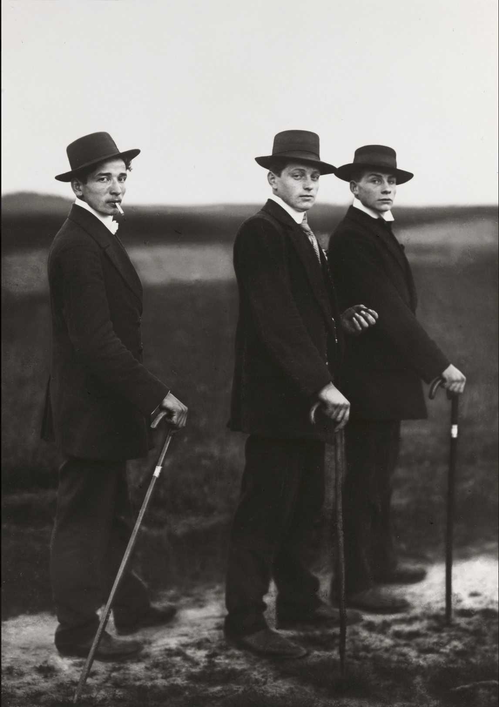
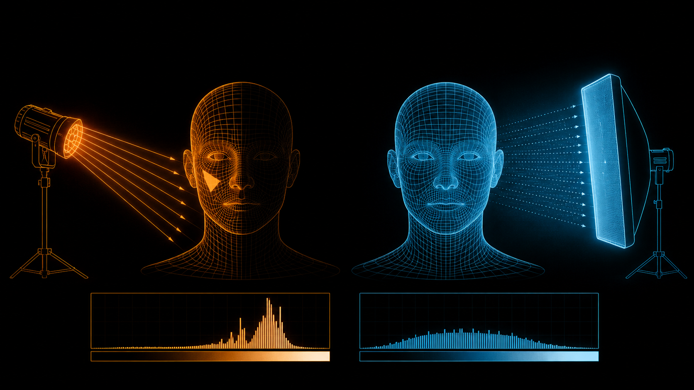

+++
title = "经典作品拆解 #6：People of the 20th Century（20 世纪的人）"
description = "Sander 的革命不在某一张照片，而在他把「怎么拍」拧成一套稳定语法——让整个德国第一次能在相近框架里被横向比较。"
date = 2026-06-14
tags = ["摄影", "经典作品", "摄影史", "August Sander", "类型学", "Typology", "肖像", "纪实摄影"]
categories = ["摄影"]
series = ["经典作品拆解"]
showTableOfContents = true
+++

> Sander 的革命不在某一张照片，而在他把「怎么拍」拧成一套稳定语法——让整个德国第一次能在相近框架里被横向比较。

## 一、三个农民，和他们身后的六百个人

1914 年，德国西部威斯特林山区（Westerwald）一条泥泞的土路上，三个年轻人正要去参加舞会。他们穿着当时刚买得起的成衣西装，戴着礼帽，手里拄着文明棍，叼着烟。听到喊声，他们侧身停在路上，像被叫住似的回头——不躲、不笑，目光落在镜头上，姿态卡在走路和摆拍之间。按下快门的，是一个叫 August Sander 的科隆肖像馆摄影师。这张照片后来叫 *Jungbauern*（年轻农民 / Young Farmers），是 20 世纪被讨论最多的肖像之一。

*图：《年轻农民》（Young Farmers / Jungbauern），August Sander，1914。*

但真正让它重要的，不是这三个人。而是接下来几十年，Sander 用一套近乎不变的拍法，又拍了六百多个德国人——农民、面包师、银行家、艺术家、失业者、军官、被关进收容所的人。他给这个项目起名 *People of the 20th Century*（20 世纪的人）。一张照片是肖像；六百张用相近的眼光拍出来的照片摞在一起，是别的东西——一台把整个社会摊开来读的分类机器。

## 二、一个开肖像馆的人，决定给整个民族编目

Sander 不是艺术家出身。他在科隆开一家普通的肖像照相馆，靠给市民拍结婚照、全家福谋生。1920 年代的魏玛德国，肖像摄影的主流还是「画意派」那一套：柔焦、摆姿、补光打到人人都像油画里走出来的贵族——摄影在拼命模仿绘画，把每个人都拍得比本人更体面一点。

Sander 反着来。他要做的不是让人变好看，而是给整个德国社会画一张「图谱」。他把计划切成 **七大类**，像一棵树：从扎根土地的「农民」开始，往上经过「手艺人」「女人」「各色职业」「艺术家」「城市」，最后落到「最后的人」——老人、病人、残障者、退伍兵、流浪汉。每一类下面再分组，最终是四十多个合辑、六百余幅肖像。1929 年他先出了一本预告性质的画册 *Antlitz der Zeit*（时代的面孔），选了 60 张，请小说家 Alfred Döblin 作序。

技术上，他几乎从不用闪光的戏剧性。一台大画幅相机、高质量的底片（很多是玻璃负片），把人请到他们自己的环境里——作坊、田头、客厅、街角——用现成的自然光或均匀的室内光拍下来。条件很朴素，朴素到几乎不像「创作」。这恰恰是他要的。

## 三、技术拆解

### 3.1 这张照片在做什么

**第一件事：Sander 把每个人都拍成「标本」，而不是「个体」。** 回到 *Young Farmers*——三个人侧身停在泥路上回头看你，没有一道戏剧性的阴影把谁的脸劈成明暗两半，也没有谁被打光打成主角。光是平的，脸是松弛的，所以你不会去读「这个人此刻的心情」，你读到的是他们身上的西装、礼帽、手杖——一个阶层在某个历史时刻的制服。顺带一提，这三个「农民」其实是两名铁矿工人和一名矿场办公室的职员；但在 Sander 的系统里，他们具体是谁不重要，重要的是他们「属于哪一类人」。

**第二件事：职业符号接管了表情。** 在 Sander 那些更接近正面肖像的作品里，人几乎不靠脸说话，靠手里的东西说话。*Bricklayer*（砖匠，1928）——一个男人把一摞砖扛在肩上，砖的重量压着他，他平稳地正对着你；*Pastry Cook*（糕点师，1928）——一个圆滚滚的厨师，一手端盆一手握打蛋器，白大褂、利落的小胡子。砖、打蛋器、白褂，就是他们的身份铭牌。表情被收掉了，留下的是「功能」。

> 一张是肖像，因为它说「这个人」；六百张是档案，因为它们一起说「这些是德国人的种类」。

### 3.2 它是怎么做到的

要看懂 Sander，先得看懂他 **故意不做** 的那件事——打戏剧光。

大多数肖像摄影师都在用光「塑造」人：一盏主光从侧面来，在鼻子下方留一个小三角（伦勃朗光），脸立刻有了立体感、有了情绪、有了「这个人很深刻」的暗示。这种光起的是修辞的作用——它替观众做判断，告诉你这个人是英雄、是谜、是值得仰望的。

Sander 把这套修辞收掉。他用的是 **中性、去戏剧化的正面光**：光均匀地铺在脸上，不留戏剧性阴影，明暗反差压得很低。结果是脸上没有「导演痕迹」——没有谁被照得更高贵，也没有谁被照得更可怜。但这并不等于照片就「不作评价」了。评价只是从光效挪到了别处：人摆出什么姿态、手里握着什么职业符号、最后被归进哪一类、你又被引导着用什么眼光去打量他。Sander 的「客观」是一种视觉策略，而不是没有立场的记录——他挑谁、让谁站多远、把谁编进「最后的人」，每一步都带着判断。戏剧光拿掉的是廉价的情绪修辞，换来的是一种更冷的、档案式的观看。这，就是「类型学（Typology）」摄影的起点：不是拍「这一个独特的人」，而是拍「这一类人的样本」。

光只是其中一层。Sander 更要紧的做法，是尽量让「相机这一侧」保持一套稳定的语法——克制、正面、清晰、去戏剧化——再用它去拍几百个身份天差地别的人。他当然没法把所有条件都焊死：有人全身、有人半身，有人在工棚、有人在客厅，背景、距离、光线都随现场变。但只要观看的框架足够接近，照片之间的注意力就会自动滑向那个真正在变的东西——被拍的人，和他所属的阶层。这有点像做对照实验的思路：把背景变量尽量压平，你想研究的那个因素才显形。

这里还有一层常被忽略的现实：这种正面、稳定、克制的姿态，有一半是器材逼出来的。大画幅相机架在三脚架上，拍摄流程很慢，人没法即兴、没法抓拍，只能站定、对着镜头、把自己交出来。所以 Sander 的「不戏剧化」既是审美选择，也是媒材的自然结果——慢，本身就会把人压成一种端正的、被观察的状态。

也正因为用大画幅，细节密度高得惊人——西装的每一根线头、手上的每一道老茧、皮肤的每一处纹理都纤毫毕现。对别人来说这叫「画质」，对 Sander 来说这是「证据」：衣料、皮肤、工具、环境，全都成了可以一寸寸去读的材料；一份档案，细节越实，越站得住。

*图：同一张脸，戏剧光 vs Sander 的中性正面光——左边把人「导演」成情绪主角，右边把人放进一套可比较的中性框架。光在这里控制的不是好不好看，而是「歌颂个体」还是「陈述事实」。*

## 四、它在摄影史里的位置

**短期看**，Sander 出现的时机近乎可怕地准。哲学家 Walter Benjamin 在 1931 年就敏锐地指出，这套作品像一本「读人的训练手册」——一本能教你辨认社会类型的图谱，而它出现的时代，正是欧洲开始用「类型」给人分等级、定生死的时代。这话很快应验：1936 年，纳粹查封了 *Antlitz der Zeit*，销毁了印版。原因今天通常被理解为，它那套社会图谱与纳粹意识形态相抵触——Sander 不替任何人美化，把农民、贵族、失业者、残障者，连同被纳粹划为「不可欲」的人群，平等地编进同一套严肃的肖像体系。这和「挑出优等人、剔除劣等人」的种族叙事，天然就水火不容。后来战争夺走了更多：1944 年他在科隆的影室毁于轰炸，地窖里幸存下来的底片，又在 1946 年的一场大火中烧掉了两万五到三万张。

**长期看**，这套「先定下一套看法、再拍一整个序列」的方法，成了一整条谱系的源头。Walker Evans 在大洋彼岸把这种正面、平光、去戏剧化的「文件式」肖像接了过去；更直接的继承者是 Bernd 与 Hilla Becher 夫妇——他们把 Sander 对人的类型学，平移到了工业建筑上，用阴天平光拍水塔、高炉、矿井塔架，一排排摆成网格。而 Becher 夫妇在杜塞尔多夫美术学院教出来的学生，就是今天统治当代摄影的「杜塞尔多夫学派」：Thomas Ruff、Thomas Struth、Andreas Gursky。

我的判断是：Sander 的价值常被放错地方。人们爱单独夸 *Young Farmers* 或 *Pastry Cook* 拍得多好——可任何一张拆开看，都只是「拍得很扎实的老照片」。他真正的发明不在某一张，而在他把摄影从「抓住独一无二的瞬间」掉头扭向了「建立一套可复现的看法」。重点从「这一张」搬到了「这一套」。这是观念上的一次换挡，整个 20 世纪后半叶的纪实与观念摄影，都在吃这口红利。

## 五、与主线的接口

**如果你想深入……**

这张照片的核心决策，对应我们摄影主线的两个模块：

- 「光照设计」模块 ·「光到底在控制什么」 — 讲了光的方向与反差不是用来「出片」的旋钮，而是决定一张照片在「歌颂个体」还是在「陈述事实」。Sander 关掉戏剧光这个动作，就是这一篇最极端的实证。
- 「工作流与交付」模块 ·「采集规范」 — 讲了当你要产出一个「系列」而不是一堆单张时，先把拍摄框架（距离、机位、光、背景、姿态）尽量固定下来意味着什么。Sander 的六百张，就是一份跑了几十年的采集规范。

读完这两篇，你对 *People of the 20th Century* 的理解，会从「看过这些老照片」变成「我知道它是怎么被系统地造出来的」。

## 六、对今天的启示

Sander 的大画幅、几十年工期，今天当然不必复刻。但他那套思路，在手机时代反而更容易上手。给你两条能直接用的：

1. **想拍「一组」而不是「一堆」，先定框架再开拍。** 拍一组朋友、一组店主、一组旧物件时，强迫自己锁住几个变量：相近的距离、相近的光、相近的机位和背景。让「被拍的对象」成为画面里主要在变的东西——你会第一次得到能摞在一起看的「系列」，而不是各自为政的单张。
2. **要档案感，就主动把戏剧光关掉。** 别一上来就用侧逆光去「营造气氛」。找一面阴天的天光，或一大块散射的窗光，正面平打，把反差压低。戏剧光会把记录变成表演；中性光，才让被拍的人以「他本来的样子」留下来。

## 七、读完之后

读这篇之前，你大概觉得 *People of the 20th Century* 是一套了不起的「社会纪实老照片」。读完之后，希望你看到的是另一样东西：摄影史上第一次，有人把「怎么看、怎么采集」本身当成了作品——他真正按下的不是六百次快门，而是一套让六百个人能够被并排阅读的看法。

下一站，我们看看当这套「稳定的看法」从「人」挪到「物」会发生什么——Bernd & Hilla Becher 夫妇的《工厂肖像》，用阴天平光把一座座工业构筑物拍成网格，把 Sander 的类型学交给了下一代。

## 参考资料

- **作品收藏 · MoMA**：The August Sander Project（2015 年，MoMA 一次性收藏了构成该项目的 619 幅照片）— [https://www.moma.org/calendar/programs/113](https://www.moma.org/calendar/programs/113) ；其中《年轻农民》合辑 [https://www.moma.org/collection/works/portfolios/204726](https://www.moma.org/collection/works/portfolios/204726) 、《糕点师》 [https://www.moma.org/collection/works/193766](https://www.moma.org/collection/works/193766)
- **作品页 · Wikipedia**：*Young Farmers*（年轻农民）的画面与背景考据 — [https://en.wikipedia.org/wiki/Young_Farmers_(photograph)](https://en.wikipedia.org/wiki/Young_Farmers_(photograph))
- **当前展览 · Yale University Art Gallery**：August Sander's People of the 20th Century（2026 年展出）— [https://artgallery.yale.edu/press-release/august-sanders-people-20th-century](https://artgallery.yale.edu/press-release/august-sanders-people-20th-century)
- **摄影师**：August Sander（1876–1964），德国科隆的肖像与纪实摄影师，毕生项目《20 世纪的人》由科隆 SK Stiftung Kultur 的 August Sander 档案馆保存与重建。生平见 [https://en.wikipedia.org/wiki/August_Sander](https://en.wikipedia.org/wiki/August_Sander)
- **延伸阅读**：
    - *Antlitz der Zeit / Face of Our Time*（1929，Alfred Döblin 作序）——理解整个项目的入口
    - John Berger，《The Suit and the Photograph》（收于 *About Looking*, 1980）——对《年轻农民》里「西装与阶层」的经典分析
    - Walter Benjamin，《摄影小史》（Little History of Photography, 1931）——最早把 Sander 看作「读人图谱」的评论
