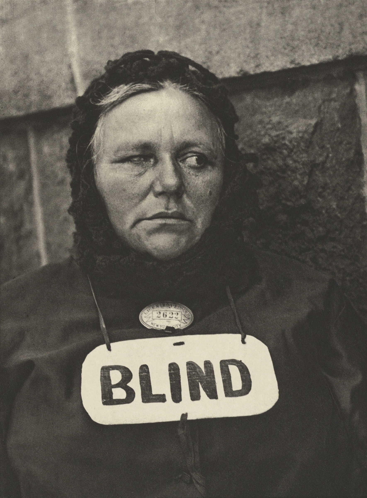
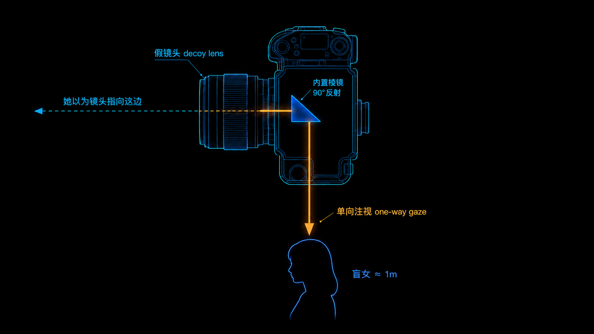

+++
title = "经典作品拆解 #7：Blind（盲女）"
description = "一张偷拍的盲女肖像——它的逼视感不是运气，是距离、机位和「单向注视」设计出来的。"
date = 2026-06-17
tags = ["摄影", "经典作品", "摄影史", "Paul Strand", "Blind", "街头摄影", "直接摄影", "透视"]
categories = ["摄影"]
series = ["经典作品拆解"]
showTableOfContents = true
+++

> 一张偷拍的盲女肖像——它的逼视感不是运气，是距离、机位和「单向注视」设计出来的。

## 一、她不知道自己正在被拍

1916 年，纽约街头，一个挂着「BLIND」牌子的女人不知道自己正在被拍。给她拍照的年轻人 Paul Strand，手里那台相机侧面装了一只假镜头——他把相机正面对着别处，真正的镜头从侧面悄悄对准了她。于是有了这张脸：一只眼睛浑浊偏斜，嘴角紧抿，脖子上挂着手写的「盲」字和一枚小贩执照牌。她看不见镜头，镜头却把她看了个彻底。一百多年过去，这张照片还在被反复讨论——一半因为它够好，一半因为它逼着每个看它的人回答一个问题：你有没有权利这样拍一个人？

*图：Blind（盲人 / Blind Woman, New York），Paul Strand，1916。一台侧装假镜头的相机，在她毫不知情时拍下了这张极近的正面肖像。图片来源：Wikimedia Commons / J. Paul Getty Museum（作品 1917 年发表于《Camera Work》，在美国已进入公有领域）。*

## 二、1916：一个想做社会纪实的人，遇上了偷拍的难题

Strand 那年 26 岁。他在纽约伦理文化学校上过 Lewis Hine 的课——Hine 是美国社会纪实摄影的奠基者，用照片推动过童工制度改革。Hine 带学生去过 Stieglitz 的 291 画廊，那次参观决定了 Strand 后来的方向。他想拍街上最普通的人：穷人、老人、做小买卖的。问题是，一旦你举起相机正对一个人，对方立刻就会变——摆姿势、躲开、警惕。那张「没被相机改变过」的脸，就拍不到了。

Strand 的解法很狡猾：他给一台手持相机的侧面装了一只假镜头（其实是一组棱镜）。相机正面那只显眼的镜头是幌子，真正成像的光路从侧面九十度拐出去。他可以站在街边，看起来在拍马路对面，实际上贴着身边的人按快门。这张盲女像，就是这么来的——也正因为这样，它从第一天起就带着一个甩不掉的伦理标签：这是诚实的见证，还是趁人不备的掠夺？

## 三、它在做什么：把一张脸怼到你无法回避的距离

**第一，极近的拍摄距离，把她怼到了你面前。** 这张照片最直接的冲击，是「近」。她几乎占满画面，皱纹、那块牌子的手写笔迹都清清楚楚。这种逼视感来自一个朴素的事实：画面里一个人有多「扑面而来」，由相机离她多近决定——也就是「透视」（Perspective），它由机位和距离决定，跟用什么镜头无关。Strand 是真的走到了她跟前，近到不能再近。

**第二，「BLIND」那块牌子，是整张照片的轴。** 你的视线会在她的脸和那个手写的「盲」字之间来回跳。这个词把照片变成了一则关于「看」的寓言：她看不见，而你（和镜头）把她看得一清二楚。一张照片里同时装下了「完全地被看见」和「完全地看不见」——这种单向的注视，才是它真正的刺点。

**第三，正面、平视、紧裁，剥掉了一切环境。** 没有街道，没有背景故事，只有她和那块牌子被推到画面最前。这是现代主义的简化：把一个具体的人，压成一个无法回避的正面存在。纪实的内容和现代主义的形式，在这一张里第一次严丝合缝地咬在了一起。

## 四、它是怎么做到的：偷拍这件事，本身就是几何

你盯着这张脸的时候，那种「我在很近的地方直视她、她却毫无防备」的不安，不是错觉。它是 Strand 的拍摄方法直接造出来的。

*图：Blind 的「偷拍几何」——相机正面的假镜头朝向别处，真实光路经棱镜九十度拐向身侧约一米处的盲女；一条单向箭头从相机指向她，标注「单向注视」。*

先说那只假镜头到底改变了什么。普通的近距离肖像，被摄者知道你在拍，于是你拿到的是「她愿意给你看的样子」。Strand 的棱镜把这层默契拆掉了：相机的真实光轴从侧面拐出去，对方以为镜头指着别处，于是他能在一米左右的距离上，拍到一张完全没有为相机准备过的脸。**近距离 + 不被察觉，这两件事必须同时成立，才有这张照片**——而它们恰好也是这张照片张力的来源。

再说机位和距离怎么变成「权力」。我们通常靠两个旋钮给一张肖像注入力量感：一个是角度（仰拍让人显得高大、英雄化，俯拍让人显得渺小、被审视），一个是距离。Strand 在角度上几乎没动手脚——他用的是平视，既不抬高她也不贬低她。他把全部筹码压在了距离上：走得足够近，近到她的脸成为一道你绕不开的墙。值得注意的是，这种「近」是脚走出来的，不是镜头拉出来的——换一只长焦站远处裁出同样大小的脸，透视会完全不同，那种贴脸的压迫感会消失。想要 Blind 这种逼视，你只能走过去。

于是「权力」被从角度转移到了别处：转移到了那道**单向的注视**上。他能拍到这张脸，前提是他不被看见；而她之所以这么坦白，正因为她不知道自己在被记录。照片的几何里，藏着一个无法对等的关系——看的人完全主动，被看的人完全被动，中间还隔着一只她永远不会知道的假镜头。这不是构图技巧能补出来的张力，这是方法本身的形状。

把这些合起来，你会发现 Blind 的力量不是「抓拍的好运气」。Strand 没有在等一个决定性瞬间，他是在用一套精心设计的方法——假镜头、近距离、平视机位——稳定地生产这种「诚实到让人不安」的肖像。运气拍不出一个系列，方法可以。

> 偷拍的伦理争议，和这张照片的力量，其实是同一件事的两面：让它如此有力的那道「单向注视」，正是让它在道德上如此可疑的那道「单向注视」。

## 五、它在摄影史里的位置

短期看，这张照片几乎是立刻封神的。1917 年，Stieglitz 把《Camera Work》最后一期几乎整本给了 Strand——Blind、White Fence、Wall Street、那批门廊抽象，全在里面。那是画意摄影的官方刊物，而它的休止符，是一组又冷又直的现代主义照片。Blind 当场成了「新美国摄影」的标志：它把 Hine 那种社会纪实的人道关怀，和现代主义干净利落的形式，焊在了一起。

长期看，这张照片捅开的那个口子——用隐蔽的方式，在对方不知情时拍下最真实的一面——成了整条街头摄影传统的源头之一。二十多年后，Walker Evans 把相机藏进大衣，在纽约地铁里偷拍乘客，用的是同一套逻辑的升级版。再往后，每一个在街上举起相机对准陌生人的人，都在重复 Strand 1916 年那个没解决的难题：为了真实，我可以隐身到什么程度？

我的判断是：Blind 的分量，不在于它是一张多么动人的「盲人肖像」，而在于它是摄影史上第一次把「偷拍的伦理代价」和「偷拍的美学收益」如此清晰地摆进同一张照片。它好，恰恰是因为它「不该」——这种不适，一百年没有过期。

## 六、与主线的接口

**如果你想深入……**

这张照片的核心决策，对应我们摄影主线的「构图几何与注意力预算」模块：

- **透视投影** — 讲了「透视」（画面里物体的比例与扑面感）只由相机到被摄体的距离决定；Blind 的逼视感来自 Strand 真的走到了她跟前，不是镜头的功劳。
- **焦段与压缩感的真相** — 讲了换镜头、变焦只改变取景范围，不改变透视；想复刻 Blind 那种贴脸的压迫，得靠脚走近，而不是站远拉长焦裁出来。

读完这些，你对 Blind 的理解会从「看过」变成可操作的拍摄认知。

## 七、对今天的启示

Blind 最实用的一课，今天每个用手机拍人的人都用得上：**想要「扑面而来」的临场感，靠的是走近，不是变焦。** 站远处拉长焦裁出来的大头，和走到跟前拍的大头，看着尺寸一样，但前者是平的、隔着一层的，后者才有那种贴脸的重量。下次拍人想要冲击力，先用脚把距离走掉。

但 Strand 留下的另一半，是一个躲不开的问题，而且在手机时代比 1916 年更尖锐：**那只「假镜头」今天人人兜里都揣着一只。** 街上随手一拍就能把陌生人拍得清清楚楚，发出去之前几乎没有成本。Strand 至少还为他的偷拍背着一个社会纪实的理由；我们大多数时候只是顺手。这张照片真正逼问的不是技术，是分寸——你按下快门之前，那个人有没有可能也想说不。能把这个问题随身带着的人，比只会走近的人走得更远。

## 八、收尾

读这篇之前，你大概觉得 Blind 的力量来自那块「盲」字牌子的命运感。读完你知道，真正撑起它的是一套冷静的几何：一只假镜头换来的极近距离，一个不偏不倚的平视机位，和一道她无法回看的单向注视。内容很重，但撑住内容的是方法。

那么问题来了——如果 Strand 把这台相机从一张脸上移开，对准一个完全没有表情、没有命运、甚至没有生命的东西，比如一道白色的木栅栏，还能靠「机位」撑起一张照片吗？同一年，他真的这么干了。当被摄对象从一个人变成一道栅栏，「机位即权力」会变成「机位即形式」。那是下一篇 *White Fence*（白色栅栏）要回答的事。

## 参考资料

- **作品收藏页**：[The Metropolitan Museum of Art — Blind Woman, New York](https://www.metmuseum.org/art/collection/search/267748)；[MoMA — Paul Strand, Blind (1916)](https://www.moma.org/collection/works/54299)；[The J. Paul Getty Museum — Photograph—New York (Blind Woman)](https://www.getty.edu/art/collection/objects/226642/)
- **作品原图**：[Wikimedia Commons — Blind Woman](https://commons.wikimedia.org/wiki/File:Blind_Woman.jpg)（J. Paul Getty Museum 藏照相凹版印；1917 年发表于《Camera Work》，美国公有领域）
- **历史语境**：《Camera Work》第 49/50 期（1917 年 6 月，Paul Strand 专辑，该刊终刊号）
- **摄影师**：Paul Strand（1890–1976），美国摄影师与电影人，直接摄影代表人物；早年师从社会纪实摄影奠基者 Lewis Hine，受 Alfred Stieglitz 提携。延伸：纪录片 *Paul Strand: Under the Dark Cloth*（1989）；画册 *Paul Strand: Master Prints*（Aperture / Paul Strand Archive）。
