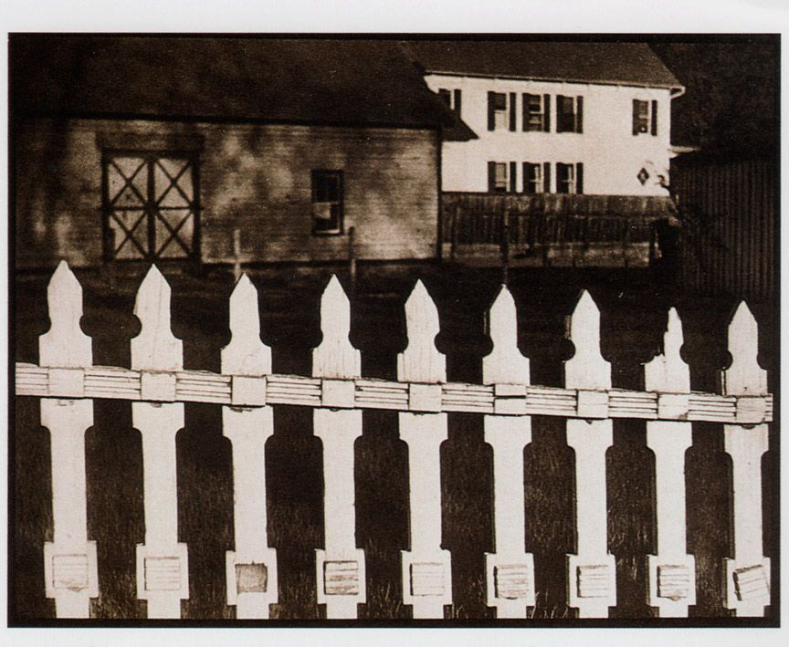
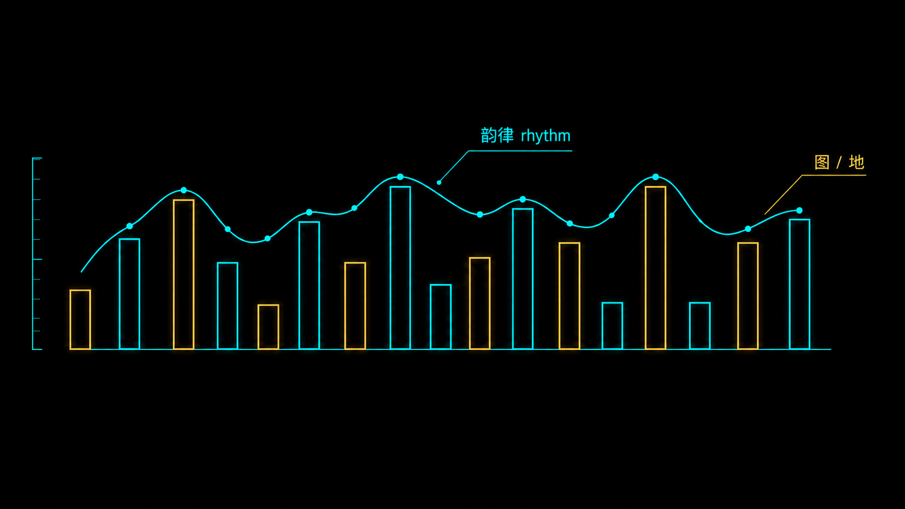
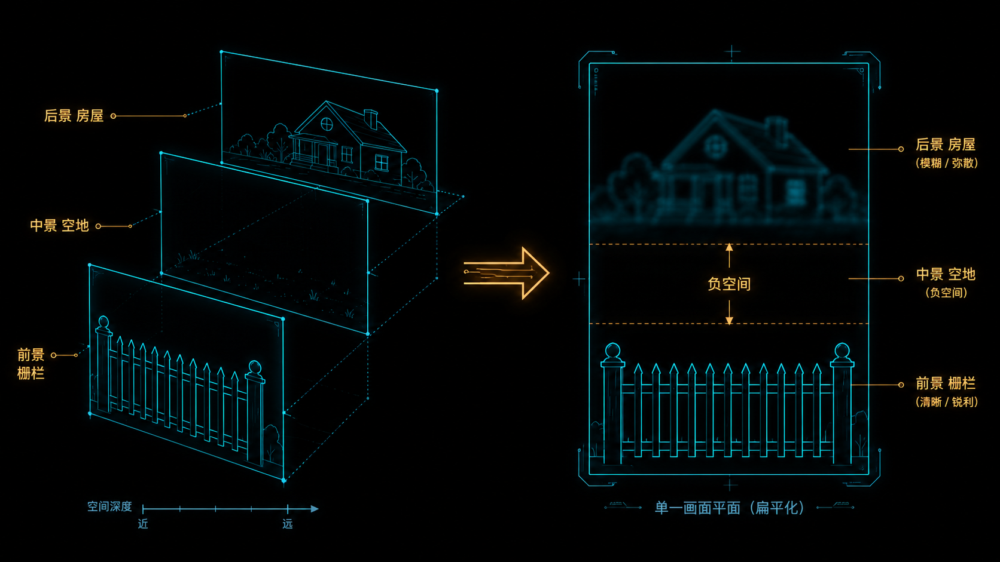
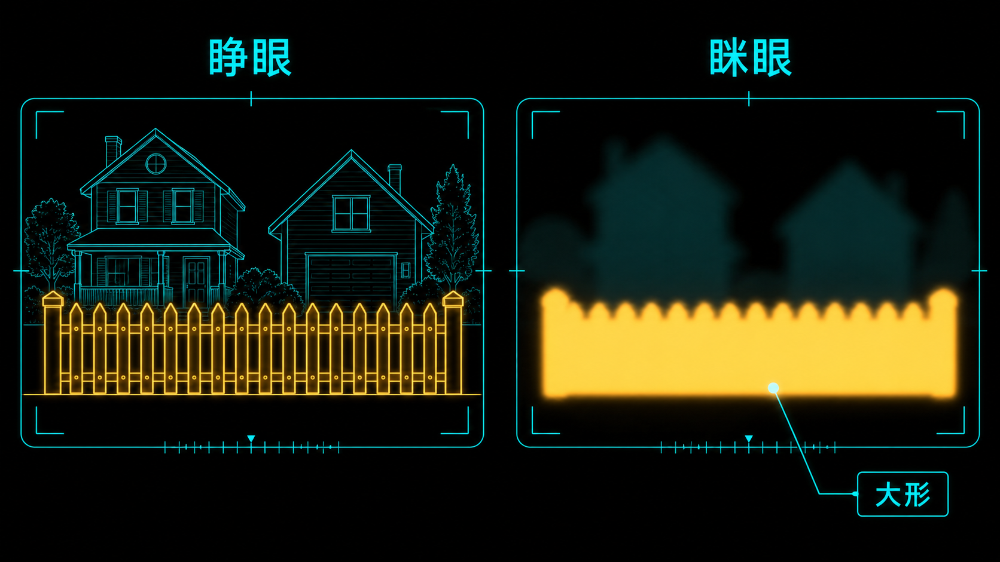

+++
title = "经典作品拆解 #8：White Fence（白色栅栏）"
description = "一道再普通不过的白栅栏，被 Strand 推到了近乎抽象的边缘——这是美国现代主义摄影里「内容退场、形式接管」最锋利的示范之一。"
date = 2026-06-27
tags = ["摄影", "经典作品", "摄影史", "Paul Strand", "White Fence", "直接摄影", "形式抽象", "图地关系"]
categories = ["摄影"]
series = ["经典作品拆解"]
showTableOfContents = true
+++

*图：Paul Strand，White Fence, Port Kent, New York，1916。刀切般锐利的白色栅栏压满下半幅，背景两栋木屋虚成一片——这一锐一糊，正是本文要拆的全部。图片来源：Wikimedia Commons（PD-US）；各馆藏高清版可能另有授权声明（如 MoMA 页面仍标注 Aperture Foundation / Paul Strand Archive 版权）。*

> 一道再普通不过的白栅栏，被 Strand 推到了近乎抽象的边缘——这是美国现代主义摄影里「内容退场、形式接管」最锋利的示范之一。

## 一、一道烂栅栏，凭什么进了摄影史

1916 年夏天，纽约州尚普兰湖边一个叫 Port Kent 的小村，二十五岁的 Paul Strand 在一户人家门前停了下来。吸引他的不是房子，不是远山，是一道再普通不过的白色尖桩栅栏——木头有些朽了，桩子高高低低，间距也不齐。他几乎把相机贴到栅栏跟前，让那排白桩占满整个画面的下缘，身后的两栋木屋反而虚成一片模糊的背景。一年后，这张 *White Fence*（白色栅栏）登上了 Alfred Stieglitz 主编的《Camera Work》终刊号（49–50 号）——那一期的全部图版都给了 Strand，还登了他自己写的一篇《Photography》。一道烂栅栏，凭什么？

## 二、它出生在一场「摄影该像什么」的争论里

要掂出这张照片的分量，得先知道 1916 年的摄影在忙什么。当时的主流叫「画意摄影」（Pictorialism）：摄影师用柔焦镜头、特殊的印放工艺，拼命把照片做得像炭笔素描、像油画——仿佛照片只有装扮成绘画，才配叫艺术。Strand 自己就是从这条路上走出来的，他的中学老师 Lewis Hine 带他走进过这个圈子，而 Stieglitz 的 291 画廊，早年是 Photo-Secession 的重镇；只是到 Strand 出场的时候，291 已经转身成了摄影从画意走向现代主义的重要现场。

可就在这一两年里，Strand 掉头了。他开始相信一件相反的事：照片不该模仿绘画，它该用相机自己的眼睛去看——清晰、直接、不加修饰。问题随之而来：所谓「相机自己的眼睛」，到底能看出什么绘画看不到的东西？*White Fence* 就是冲着这个问题去的。Port Kent 那道栅栏不是什么了不起的题材，恰恰相反，越普通越好——Strand 要的就是一个谁都不会多看一眼的对象，然后用纯粹的形式，把它变成一张谁都没见过的照片。他后来回忆：「因为这道栅栏本身就让我着迷。它非常鲜活，非常美国，是这片土地的一部分。」

## 三、技术拆解

### 3.1 这张照片在做什么

**第一，它把一道栅栏从「物体」变成了「图形」。** 你看那排白桩：有的高、有的矮、有的削尖、有的断了头，间距忽宽忽窄。要是它们整齐划一，那就只是一道栅栏；正因为参差不齐，它们才变成了一串有快有慢、有顿有挫的白色竖条——眼睛会不由自主地顺着它们从左扫到右，像在读一段节奏。

**第二，它让「空」当上了主角。** 栅栏和背景房子之间，是一块什么都没有的空地。在普通照片里，这种地方会被当成废料；但在这里，正是这块空地把前景的白栅栏和后景的房子彻底隔开，让栅栏「浮」了出来。

**第三，它把纵深感抽掉了。** 前景刀切般锐利，背景却糊成一片——这一锐一糊之间，照片的空间感被读得很平。白栅栏看起来不像「站在房子前面」，倒像是被剪下来、贴到了另一张房子照片的上面。

*图：参差的白桩在画面里形成一段视觉节奏（上方曲线）；白为「图」、暗为「地」，最亮的形状第一个被看到。*

### 3.2 它是怎么做到的

先说你眼睛能直接接收到的：整张照片的视觉重量，几乎全压在那排白桩上。原因很朴素——它们是画面里最亮、边缘反差最强、又占地最大的东西，而周围全是中灰到深黑的房子、树影和空地。在这张照片里，白桩凭着高明度、高边缘反差和大面积，几乎一定是眼睛的第一落点。（明度只是决定视觉权重的因素之一，面积、边缘对比、人脸、文字都会来抢注意力；只是在这里，这块高明度的大白形把其他因素都压了下去。）Strand 等于是用影调给整张照片排了座次：白桩是主角，其余都是配角。这是第一层决策——**用明度差，而不是用题材，来决定谁是主体。**

第二层是焦点。Strand 让栅栏落在刀刃般的实焦上，连木头的裂纹、剥落的白漆都历历可见；而身后的房子，他放任它们虚掉。近距离对焦带来的有限景深削弱了背景的细节，再配合高明度的白栅栏和压暗的背景，就制造出强烈的图与地分离——清晰的东西往前跳，模糊的东西往后退。这恰恰是他和画意摄影的分野：画意派把整张照片都柔焦掉，求一层朦胧的「画味」；Strand 反过来，把清晰留给主体、把模糊推给背景，让清晰度本身成了一件构图工具。

这里得提一句：虚化只是「把主体和背景分开」的若干手段之一，它本身不是目的。明暗对比、色块、遮挡、留白，同样能完成分离——*White Fence* 其实是明暗、虚化、裁切几手叠在一起用的。要是把浅景深当成目的去追，反而会忘了它只是为「分离」服务的工具。

但真正让这张照片「立住」的，是第三层：机位。Strand 几乎是贴着栅栏拍的，镜头压得又低又近。这个距离一口气做了两件事。一是把栅栏在画面里放到极大，大到顶天立地、占满下半幅——大形（massing）一旦够大，细节就不重要了，眼睛先接收的是「一排白色竖条」这个整体形状，而不是某一根桩子上的木纹。二是栅栏几乎占满了取景框，那些原本能提示纵深的线索——地面向远处的延伸、边线向消失点的汇聚——要么被切到了画面之外，要么落进了虚掉的背景里；再加上前后强烈的明暗对比，观看者对「谁前谁后」的注意力被大幅削弱。于是整个场景被读成了一组亮形与暗形在平面上的排布——白栅栏不再被看成「近」，房子不再被看成「远」，它们成了同一个平面上的亮形状和暗底色。

把这三层决策翻成一句话：**Strand 拍的根本不是「一道栅栏和它后面的房子」，他拍的是「白色竖条、灰色空带、深色块面」这三种形状的排布关系。** 题材——栅栏是谁家的、房子是干什么的——被整个悬置，剩下的纯粹是形式。它没有依赖画意摄影那套合成、柔焦、手工修饰，而是靠机位、对焦、曝光，再加上印相阶段的影调控制，就把一个现实场景逼成了一幅近乎抽象的构成——这也是它后来最常被援引的地方。

*图：左侧三个景深平面（前景栅栏 / 中景空地 / 后景房屋）本应被读出纵深；当主体占满画面、背景虚化、明暗对比拉强后，提示纵深的线索被移出或弱化，三层在观看中塌成右侧一个平面——中间那条空地，就是隔离主体与背景的「负空间缓冲带」。*

## 四、它在摄影史里的位置

短期看，*White Fence* 和同期的 *Blind*、*Abstraction*、*Wall Street* 一道，被 Stieglitz 收进了《Camera Work》最后两期。这本定义了一个时代的杂志，用最后的版面替摄影翻了一页——从「照片要像画」翻到「照片要像照片」。Stieglitz 还在 291 画廊给 Strand 办了个展，评价他的作品「brutally direct」（残酷地直接），没有任何花招，没有任何「主义」。一年后，《Camera Work》停刊。可以说，画意摄影的时代，是被 Strand 这批照片亲手合上的。

这里值得插一句对照。同一年，Strand 还拍了 *Blind*（盲人）——纽约街头一个挂着「BLIND」牌子的盲眼女人的特写，那是一张几乎全靠内容（一张脸、一块牌子）击中你的照片。*White Fence* 走的是完全相反的方向：内容退到最后，只剩形式。同一个人、同一年、两条相反的路——这恰恰说明 Strand 当时是在系统地试探一个问题：一张照片，到底可以靠什么成立？

长期看，Strand 自己把 *White Fence* 称作「此后我所有作品的基础」。这话不算夸张。「用清晰对抗柔焦、用形式提炼平凡、让相机做相机该做的事」——这套主张后来长成了「直接摄影」（Straight Photography），又顺着 f/64 学派（Edward Weston、Ansel Adams）一路开枝散叶。我们今天觉得「拍得清楚、构图干净」理所当然，可在 1916 年，这是一句需要有人理直气壮说出口的主张。*White Fence* 就是那句话。

如果要给这段历史钉几个坐标：画意摄影 → Strand 这批「直接摄影」→ Stieglitz 把镜头推向纯抽象 → f/64 学派——但这几个节点彼此交叠、相互影响，不是一棒接一棒的单线传承。

## 五、与主线的接口

**如果你想深入……**

这张照片的核心决策，对应我们摄影主线的「构图几何与注意力预算」模块：

- **#6-5 形状优先：大形（Massing）决定生死** — 讲了为什么眼睛先看「大形」再看细节，以及 figure-ground（图地关系）和 squint test（眯眼测试）该怎么用。Strand 让白桩占满下半幅，就是把「大形」做到压倒一切。
- **#6-12 负空间：不是留白，是「隔离缓冲带」** — 讲了那块「空地」如何给主体提供带宽、隔离噪声、稳定观看路径。*White Fence* 里栅栏与房子之间的空地，正是一条教科书级的负空间缓冲带。

读完这两篇，你对 *White Fence* 的理解，会从「看过」变成可以上手操作的拍摄认知。

## 六、对今天的启示

*White Fence* 最该被今天的人偷走的，是一个反直觉的习惯：**当一个场景太普通、怎么都拍不出东西时，别急着去找更好的题材，去找更强的形式。** Strand 面对的就是一道烂栅栏，他没有换地方，他换了看法——把「这是什么」的问题，换成「这里有哪些形状、哪个最亮、它们怎么排」。

落到手上，有两条今天就能用：

一是**眯起眼睛看**。眯眼时画面里的细节会糊掉，只剩明暗大块——这时候如果你的主体不能一眼跳出来，就说明它的「大形」不够，构图还没成立。Strand 让白桩占满画面，背后就是这个判断。

二是**用清晰度做减法**。手机和大光圈镜头让虚化变得太容易，但 *White Fence* 提醒我们：虚化的意义不是「好看」，而是把不重要的东西从主体身边清走。下次开大光圈之前先问一句——我是想让背景好看，还是想让主体和背景分开？后者，才是 Strand 那一刀真正的用意。

把这两条拧成一个马上能做的练习：挑一个最普通的物体（一段栅栏、一面墙、一排楼梯）→ 眯眼看，确认它的明暗大形能不能跳出来 → 走近，让主体占到画面一半以上 → 对焦主体 → 曝光时压住高光别过曝。一圈下来你会发现，「拍什么」远没有「让它在画面里以什么形状出现」重要。

*图：睁眼时是一堆细节；眯眼后只剩明暗大块，最亮的白栅栏一下子从暗团里跳出来——主体「大形」站不站得住，眯一下眼就知道。*

## 七、收尾

读这篇之前，你大概觉得「构图」是一套关于三分法、引导线的规则，是叠加在题材之上的一层装饰。读完之后，希望你看到的是另一回事：在 *White Fence* 里，形式不是装饰，形式就是内容本身——当 Strand 把一道栅栏拍成一串白色节奏，照片讲的已经不再是栅栏，而是「重复、间隔、明暗」这件事本身。

Strand 把摄影推到了抽象的门口：主体还在（你知道那是栅栏），但它已经快被形式吃掉了。那么，能不能再往前迈一步——让主体彻底消失，让照片不再「是」任何东西，只剩下纯粹的情绪？

几年之后，正是当年把 *White Fence* 送上《Camera Work》的那个人——Alfred Stieglitz——给出了回答。1922 年起，他开始把相机举向天空，拍一系列云：没有地平线，没有任何参照物，你说不出那是哪里的云、哪一天的云。这批云他起初叫《Music》《Songs of the Sky》，1923 年展出；直到 1925 年以后，才逐渐定名为 *Equivalents*（等价物）——云的形状，是他内心情绪的「等价物」。

下一篇，我们就去看这批把摄影彻底推进抽象的云。

## 参考资料

- 作品收藏页：[White Fence — The Museum of Modern Art (MoMA)](https://www.moma.org/collection/works/49269)；另见 The Metropolitan Museum of Art、National Gallery of Art、Art Institute of Chicago、Philadelphia Museum of Art（The Paul Strand Retrospective Collection）均有藏。
- 维基百科词条：[The White Fence (photograph) — Wikipedia](https://en.wikipedia.org/wiki/The_White_Fence_(photograph))
- 摄影师：Paul Strand（1890–1976），美国摄影师与电影人，「直接摄影」奠基者之一。生于纽约，中学时师从 Lewis Hine，后受 Alfred Stieglitz 提携，于 291 画廊办展并占据《Camera Work》终刊。代表作 *Wall Street*、*Blind*、*White Fence*。作品档案由 Paul Strand Archive / Aperture Foundation 管理。
- 延伸阅读：《Paul Strand: Master of Modern Photography》（Philadelphia Museum of Art / Yale University Press, 2014）；《Camera Work》终刊号 No. 49–50（1917）。
